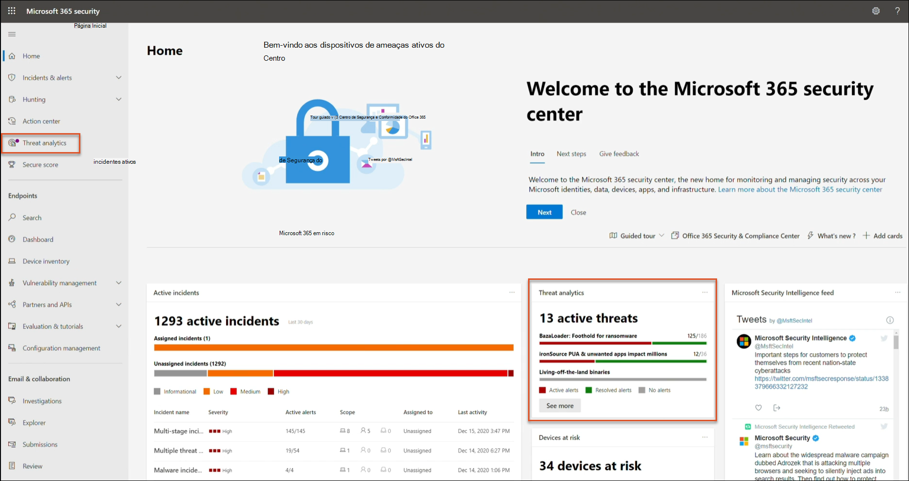
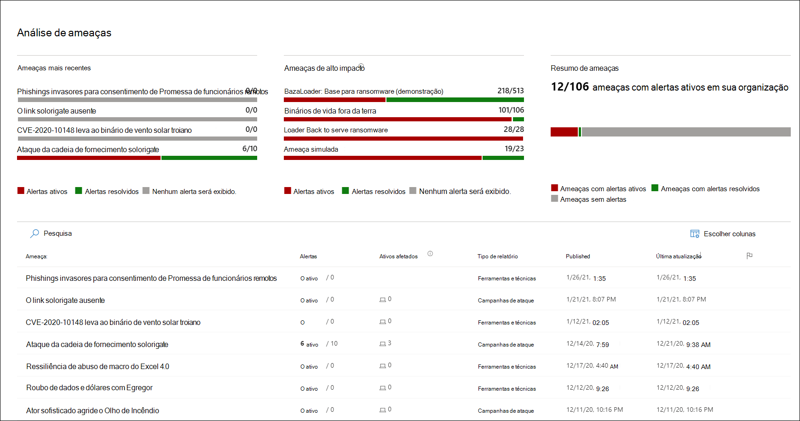
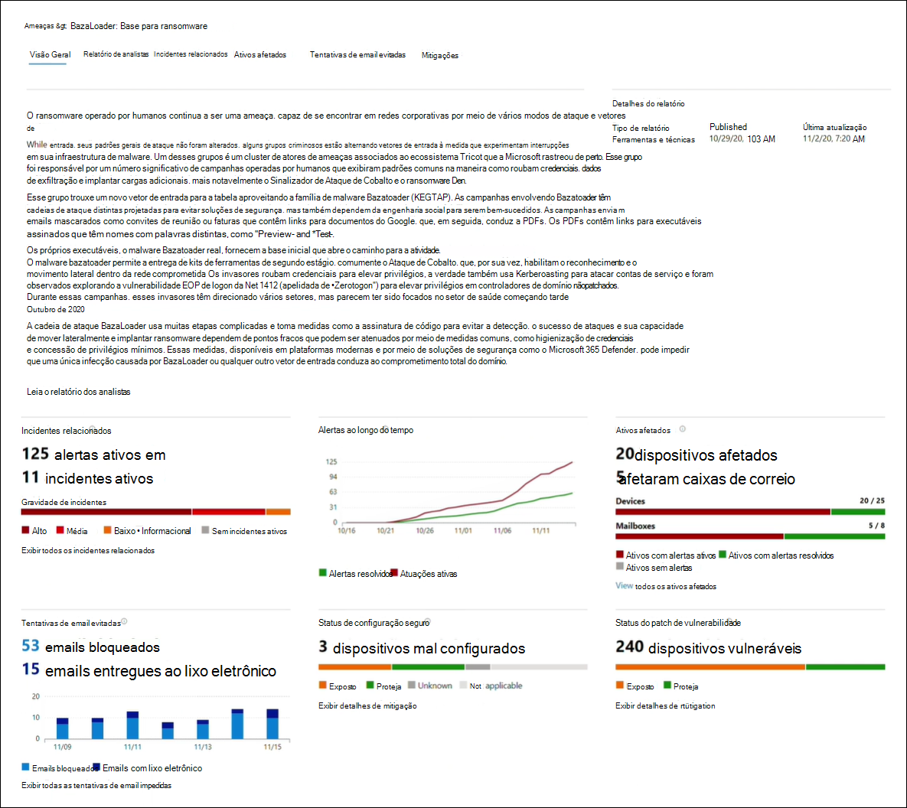
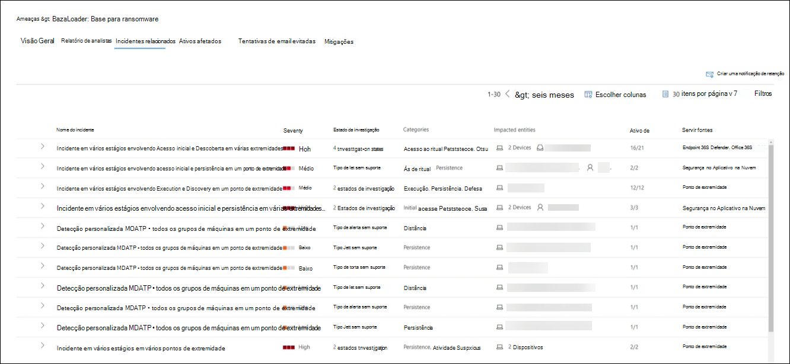
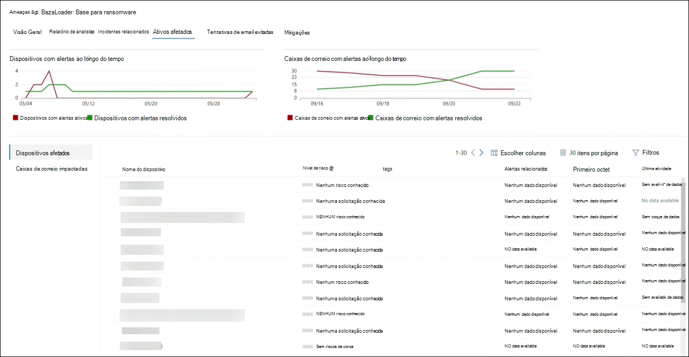
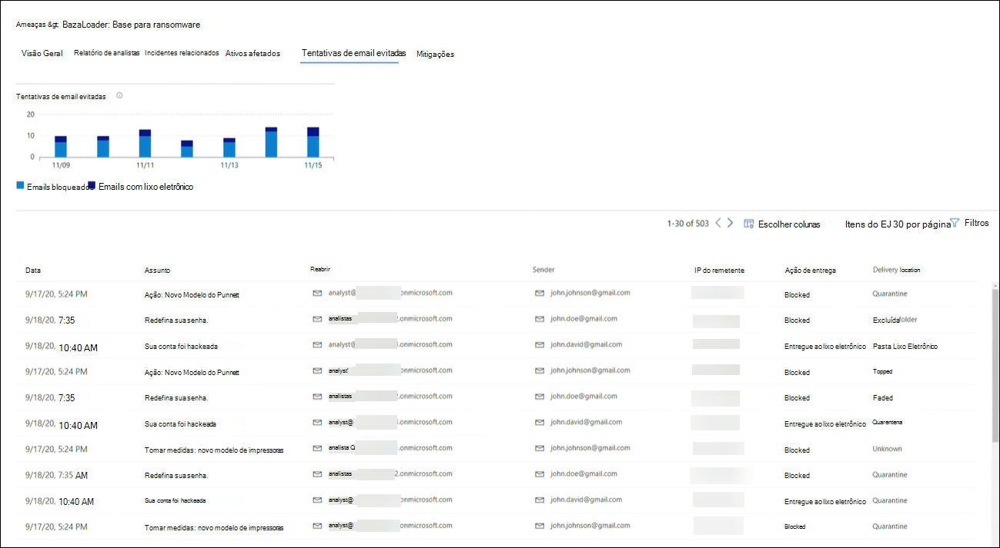
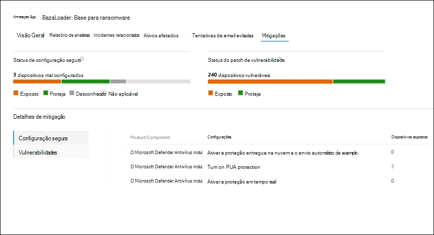
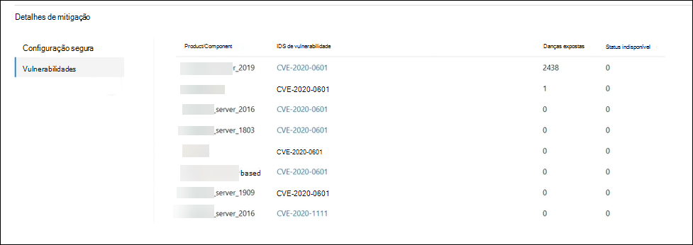

# Rastrear e responder a ameaças emergentes com análise de ameaças 

[!INCLUDE [Microsoft 365 Defender rebranding](../includes/microsoft-defender.md)]

**Aplica-se a:**
- Microsoft 365 Defender

> Deseja experimentar o Microsoft 365 Defender? Você pode [avaliá-lo em um ambiente de laboratório](https://aka.ms/mtp-trial-lab) ou executar seu projeto piloto em [produção](https://aka.ms/m365d-pilotplaybook).
>

[!INCLUDE [Prerelease](../includes/prerelease.md)]

A análise de ameaças é a nossa solução de inteligência contra ameaças no produto de pesquisadores de segurança especialistas da Microsoft, projetado para ajudar as equipes de segurança a serem o mais eficientes possíveis, enfrentando ameaças emergentes, incluindo:

- Atores de ameaças ativos e suas campanhas
- Técnicas de ataque populares e novas
- Vulnerabilidades críticas
- Superfícies de ataque comuns
- Malware predominante

Assista a este breve vídeo para saber mais sobre como a análise de ameaças pode ajudá-lo a rastrear as ameaças mais recentes e impedi-las.

>[!VIDEO https://www.microsoft.com/en-us/videoplayer/embed/RWwJfU]

Você pode acessar a análise de ameaças do lado superior esquerdo da barra de navegação do portal de segurança do Microsoft 365 ou de um cartão de painel dedicado que mostra as principais ameaças em sua organização. Obter visibilidade sobre campanhas ativas ou em andamento e saber o que fazer por meio da análise de ameaças pode ajudar a equipar sua equipe de operações de segurança com decisões informadas. 

_Onde acessar a análise de ameaças_

Com adversários mais sofisticados e novas ameaças surgindo com frequência e predominantemente, é fundamental poder fazer isso rapidamente:

- Identificar e reagir a ameaças emergentes 
- Saiba se você está sob ataque no momento
- Avaliar o impacto da ameaça para seus ativos
- Revise sua resiliência contra ou exposição às ameaças
- Identificar as ações de mitigação, recuperação ou prevenção que você pode tomar para parar ou conter as ameaças

Cada relatório fornece uma análise de uma ameaça controlada e orientações abrangentes sobre como se defender contra essa ameaça. Ele também incorpora dados de sua rede, indicando se a ameaça está ativa e se você tem proteções aplicáveis no local.

## Exibir o painel de análise de ameaças

O painel de análise de ameaças ([security.microsoft.com/threatanalytics3](https://security.microsoft.com/threatanalytics3)) realça os relatórios que são mais relevantes para sua organização. Ele resume as ameaças nas seções a seguir:

- **Ameaças mais** recentes lista os relatórios de ameaças publicados ou atualizados mais recentemente, juntamente com o número de alertas ativos e resolvidos.
- **Ameaças de alto impacto** lista as ameaças que têm o maior impacto para sua organização. Esta seção lista as ameaças com o maior número de alertas ativos e resolvidos primeiro.
- **Resumo de** ameaças — fornece o impacto geral de todas as ameaças controladas mostrando o número de ameaças com alertas ativos e resolvidos.

Selecione uma ameaça no painel para exibir o relatório dessa ameaça.

_Painel de análise de ameaças. Você também pode clicar no ícone Pesquisar para teclar em uma palavra-chave relacionada ao relatório de análise de ameaças que você gostaria de ler._ 

## Exibir um relatório de análise de ameaças

Cada relatório de análise de ameaças fornece informações em várias seções: 

- [**Visão Geral**](#overview-quickly-understand-the-threat-assess-its-impact-and-review-defenses) 
- [**Relatório de analistas**](#analyst-report-get-expert-insight-from-microsoft-security-researchers)
- [**Incidentes relacionados**](#related-incidents-view-and-manage-related-incidents)
- [**Ativos afetados**](#impacted-assets-get-list-of-impacted-devices-and-mailboxes)
- [**Tentativas de email evitadas**](#prevented-email-attempts-view-blocked-or-junked-threat-emails)
- [**Mitigações**](#mitigations-review-list-of-mitigations-and-the-status-of-your-devices)

### Visão geral: entenda rapidamente a ameaça, avalie seu impacto e revise as defesas

A **seção Visão** Geral fornece uma visualização do relatório detalhado do analista. Ele também fornece gráficos que realçam o impacto da ameaça à sua organização e sua exposição por meio de dispositivos não configurados e não configurados.

_Seção Visão geral de um relatório de análise de ameaças_

#### Avaliar o impacto em sua organização
Cada relatório inclui gráficos projetados para fornecer informações sobre o impacto organizacional de uma ameaça:
- **Incidentes relacionados**— fornece uma visão geral do impacto da ameaça controlada à sua organização com os seguintes dados:
  - Número de alertas ativos e o número de incidentes ativos aos que estão associados
  - Gravidade de incidentes ativos
- **Alertas ao longo do tempo** mostram o número de alertas **ativos** e **resolvidos** relacionados ao longo do tempo. O número de alertas resolvidos indica a rapidez com que sua organização responde a alertas associados a uma ameaça. Idealmente, o gráfico deve mostrar alertas resolvidos em alguns dias.
- **Ativos afetados** mostra o número de dispositivos distintos e contas de email (caixas de correio) que atualmente têm pelo menos um alerta ativo associado à ameaça controlada. Alertas são disparados para caixas de correio que receberam emails de ameaça. Revise as políticas no nível da organização e do usuário para ver se há substituições que causam a entrega de emails de ameaça.
- **Tentativas de email evitadas**— mostra o número de emails dos últimos sete dias que foram bloqueados antes da entrega ou entregues à pasta lixo eletrônico.

#### Revisar a resiliência e a postura de segurança
Cada relatório inclui gráficos que fornecem uma visão geral de como sua organização é resiliente contra uma determinada ameaça:
- **Status de configuração** seguro mostra o número de dispositivos com configurações de segurança mal configuradas. Aplique as configurações de segurança recomendadas para ajudar a reduzir a ameaça. Os dispositivos são **considerados Seguros** se eles aplicaram _todas as_ configurações controladas.
- **Status de patch de vulnerabilidade** mostra o número de dispositivos vulneráveis. Aplique atualizações de segurança ou patches para resolver vulnerabilidades exploradas pela ameaça.

### Relatório de analistas: obter informações de especialistas de pesquisadores de segurança da Microsoft
Na seção **Relatório de** Analistas, leia o relatório detalhado do especialista. A maioria dos relatórios fornece descrições detalhadas de cadeias de ataque, incluindo táticas e técnicas mapeadas para  a estrutura de CK do MITRE ATT&, listas exaustivas de recomendações e orientações avançadas sobre a busca de ameaças.

[Saiba mais sobre o relatório do analista](threat-analytics-analyst-reports.md)

### Incidentes relacionados: exibir e gerenciar incidentes relacionados
A **guia Incidentes Relacionados** fornece a lista de todos os incidentes relacionados à ameaça controlada. Você pode atribuir incidentes ou gerenciar alertas vinculados a cada incidente. 

_Seção Incidentes relacionados de um relatório de análise de ameaças_

### Ativos afetados: Obter lista de dispositivos e caixas de correio afetados
Um ativo será considerado afetado se for afetado por um alerta ativo não resolvido. A **guia Ativos afetados** lista os seguintes tipos de ativos afetados:
- **Dispositivos afetados**— pontos de extremidade que não resolveram os alertas do Microsoft Defender para o Ponto de Extremidade. Esses alertas normalmente disparam em avistamentos de indicadores e atividades de ameaças conhecidos.
- **Caixas de correio impactadas**— caixas de correio que receberam mensagens de email que dispararam alertas do Microsoft Defender para o Office 365. Embora a maioria das mensagens que disparam alertas geralmente sejam bloqueadas, as políticas no nível do usuário ou da organização podem substituir filtros.

_Seção ativos afetados de um relatório de análise de ameaças_

### Tentativas de email evitadas: Exibir emails de ameaça bloqueados ou lixo eletrônico
O Microsoft Defender para Office 365 normalmente bloqueia emails com indicadores de ameaça conhecidos, incluindo links mal-intencionados ou anexos. Em alguns casos, mecanismos de filtragem proativos que verificam se há conteúdo suspeito enviarão emails de ameaça para a pasta lixo eletrônico. Em ambos os casos, as chances de a ameaça iniciar código de malware no dispositivo é reduzida.

A **guia Tentativas de Email Impedido** lista todos os emails que foram bloqueados antes da entrega ou enviados para a pasta lixo eletrônico pelo Microsoft Defender para Office 365. 

_Seção Tentativas de email impedidas de um relatório de análise de ameaças_

### Mitigações: revise a lista de mitigações e o status de seus dispositivos
Na seção **Mitigações,** revise a lista de recomendações ativas específicas que podem ajudá-lo a aumentar sua resiliência organizacional em relação à ameaça. A lista de mitigações controladas inclui:

- **Atualizações de segurança**— implantação de atualizações de segurança de software com suporte para vulnerabilidades encontradas em dispositivos conectados
- **Configurações de segurança com suporte**
  - Proteção entregue na nuvem  
  - Proteção de aplicativo potencialmente indesejado (PUA)
  - Proteção em tempo real
 
As informações de mitigação nesta seção incorporam dados do gerenciamento de ameaças e vulnerabilidades [,](https://docs.microsoft.com/windows/security/threat-protection/microsoft-defender-atp/next-gen-threat-and-vuln-mgt)que também fornece informações detalhadas de detalhamento de vários links no relatório.

 

_Seção Mitigações de um relatório de análise de ameaças_

## Detalhes e limitações adicionais do relatório
>[!NOTE]
>Como parte da experiência de segurança unificada, a análise de ameaças agora está disponível não apenas para o Microsoft Defender para Ponto de Extremidade, mas também para os proprietários de licença do Microsoft Defender para Office E5.
>Se você não estiver usando o portal de segurança do Microsoft 365 (Microsoft 365 Defender), também poderá ver os detalhes do relatório (sem os dados do Microsoft Defender para Office) no portal do Centro de Segurança do Microsoft Defender (Microsoft Defender para Ponto de Extremidade). 

Para acessar o relatório de análise de ameaças, você precisa de determinadas funções e permissões. Consulte Funções personalizadas no controle de acesso [baseado em função para o Microsoft 365 Defender](custom-roles.md) para obter detalhes.
  - Para exibir alertas, incidentes ou dados de ativos afetados, você precisa ter permissões para o Microsoft Defender para Office ou o Microsoft Defender para dados de alertas de ponto de extremidade ou ambos.
  - Para exibir tentativas de email impedidas, você precisa ter permissões para os dados de busca do Microsoft Defender para Office. 
  - Para exibir mitigações, você precisa ter permissões para dados de gerenciamento de ameaças e vulnerabilidades no Microsoft Defender para Ponto de Extremidade.

Ao ver os dados de análise de ameaças, lembre-se dos seguintes fatores:
- Os gráficos refletem apenas mitigações controladas. Verifique a visão geral do relatório para obter mitigações adicionais que não são mostradas nos gráficos.
- Mitigações não garantem resiliência completa. As mitigações fornecidas refletem as melhores ações possíveis necessárias para melhorar a resiliência.
- Os dispositivos serão contados como "indisponíveis" se não transmitirem dados para o serviço.
- As estatísticas relacionadas ao antivírus são baseadas nas configurações do Microsoft Defender Antivírus. Dispositivos com soluções antivírus de terceiros podem aparecer como "expostos".

## Tópicos relacionados
- [Encontrar proativamente ameaças com busca avançada](advanced-hunting-overview.md) 
- [Compreender a seção relatório de analistas](threat-analytics-analyst-reports.md)
- [Avaliar e resolver deficiências e exposições de segurança](https://docs.microsoft.com/windows/security/threat-protection/microsoft-defender-atp/next-gen-threat-and-vuln-mgt)
