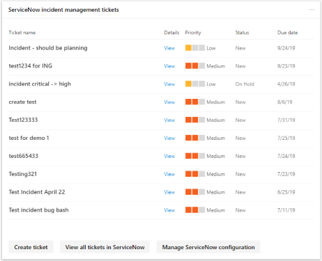

# Gerenciar tíquetes pelo ServiceNowManage tickets through ServiceNow

A central de segurança do Microsoft 365 está sendo aprimorada com a capacidade de criar e controlar de forma nativa as permissões no ServiceNow.Microsoft 365 security center is being enhanced with the ability to natively create and track tickets in ServiceNow. Administradores de segurança podem enviar uma ação de melhoria de [Pontuação segura da Microsoft](microsoft-secure-score.md) diretamente para o ServiceNow e criar uma permissão.Security administrators can send a [Microsoft Secure Score](microsoft-secure-score.md) improvement action directly to ServiceNow and create a ticket. As permissões de gerenciamento de incidentes e de alterações podem ser criadas.Both incident management and change management tickets can be created.

## Pré-requisitosPrerequisites

Ter acesso à central de segurança do Microsoft 365 e uma instância do ServiceNow com:Have access to the Microsoft 365 security center and a ServiceNow instance with:  

* Kingston ou versão superiorKingston or higher version
* Ter credenciais do administrador HIHave admin HI credentials
* Ter privilégios de administrador na instância de fornecedor de destinoHave admin privileges on your target vendor instance

O ServiceNow recomenda que os usuários mantenham as configurações padrão em sua instância do ServiceNow.ServiceNow recommends that users keep default settings in your ServiceNow instance. Ter personalizações pode causar erros ao concluir a lista de verificação de instalação e integração com a central de segurança do Microsoft 365.Having customizations could cause errors when completing the installation checklist and integration with the Microsoft 365 security center.

## Troca de dadosData exchange

Quando você conecta o centro de segurança do Microsoft 365 ao ServiceNow, a Microsoft recebe os seguintes dados adicionais:When you connect the Microsoft 365 security center to ServiceNow, Microsoft receives the following additional data:

* Nome da instância do ServiceNowServiceNow instance name
* ID do cliente do ServiceNowServiceNow client ID
* Segredo do cliente do ServiceNowServiceNow client secret
* Tokens de atualização & AccessServiceNow access & refresh tokens

Quando você cria uma permissão do ServiceNow no centro de segurança do Microsoft 365, os dados a seguir são enviados para o ServiceNow:When you create a ServiceNow ticket from the Microsoft 365 security center, the following data is sent to ServiceNow:

* ID de usuário que inicia a criação de tíqueteUser ID that initiates the ticket creation
* Nome da tarefaTask name
* Descrição da tarefaTask description
* PrioridadePriority
* Data de conclusãoDue date
* Fonte de recomendação (recomendação do usuário ou recomendação da Microsoft)Recommendation source (User recommendation or Microsoft recommendation)
* Categoria de recomendação (dispositivos, dados, aplicativos, identidade, infraestrutura)Recommendation category (Devices, Data, Apps, Identity, Infrastructure)

## Conectar a central de segurança do Microsoft 365 ao ServiceNowConnect Microsoft 365 security center to ServiceNow

Navegue até a home page do centro de segurança do Microsoft 365 para ver o cartão de conexão do ServiceNow.Navigate to the Microsoft 365 security center home page to see the ServiceNow connection card.

Selecione "conectar ao ServiceNow" para ir para a página de configuração do ServiceNow.Select "Connect to ServiceNow" to go to the ServiceNow setup page. Siga as instruções para autorizar o aplicativo conector 365 da Microsoft.Follow the instructions to authorize the Microsoft 365 Connector app.

> [!NOTE]
> Antes de autorizar a conexão entre o centro de segurança do Microsoft 365 e o ServiceNow, certifique-se de usar o logon e a senha de usuário de integração que você criou nas etapas de instalação.Before you authorize the connection between Microsoft 365 security center and ServiceNow, make sure you use the integration user login and password you created in the installation steps. Não use suas credenciais pessoais.Do not use your personal credentials.

Após ter seguido as orientações e autorizar a conexão, veja o status da conexão na página conexão da central de segurança do Microsoft 365 e na experiência do aplicativo do Microsoft 365 Ticketing Connector.After you have followed the directions and authorizing the connection, view the connection status on both the Microsoft 365 security center connection page and in the ServiceNow Microsoft 365 Ticketing Connector App experience. Agora, você está pronto para começar a criar tarefas!Now you are all set to start creating tasks!

## Criar uma tarefa e compartilhá-la para o ServiceNowCreate a task and share it to ServiceNow

Depois que a integração é configurada, crie tarefas do ServiceNow com base em ações específicas de melhoria da Pontuação segura da Microsoft.Once the integration is set up, create ServiceNow tasks based on specific Microsoft Secure Score improvement actions. Vá para qualquer ação de melhoria na pontuação segura no portal da central de segurança do Microsoft 365 e selecione o ícone "compartilhar".Go to any improvement action in Secure Score in the Microsoft 365 security center portal, and select the “share” icon. Uma das opções de DropDown é o ServiceNow.One of the dropdown options is ServiceNow.

Uma tarefa é gerada onde você pode definir a prioridade e editar o nome, a descrição ou a data de conclusão.A task is generated where you can set the priority and edit the name, description, or due date. Após todos os campos obrigatórios serem preenchidos, envie a tarefa para o ServiceNow.Once all the required fields are filled in, send the task to ServiceNow.

A tarefa está visível no ServiceNow como uma solicitação de alteração de configuração e segurança do Microsoft 365.The task is visible in ServiceNow as a Microsoft 365 Security and Configuration Change Request.

## Controlar ingressosTrack tickets

Depois que o gerenciamento de alterações e as permissões de gerenciamento de incidentes tiverem sido criados, eles serão exibidos em cartões na home page do centro de segurança do Microsoft 365.Once ServiceNow change management and incident management tickets have been created, they are displayed on cards in the Microsoft 365 security center home page. A partir desses cartões, você pode criar um tíquete, exibir todos os tíquetes ou gerenciar a configuração do ServiceNow.From these cards, you can create a ticket, view all tickets, or manage the ServiceNow configuration.

  

Para reprovisionar ou gerenciar sua integração do ServiceNow no centro de segurança do Microsoft 365, selecione **gerenciar a configuração do servicenow** em qualquer um dos cartões.To re-provision or manage your ServiceNow integration in the Microsoft 365 security center, select **Manage ServiceNow configuration** on either of the cards. A partir daí, remova a conexão atual do ServiceNow e personalize os nomes de estado de tíquete.From there, remove the current ServiceNow connection and customize ticket state names.

Com as permissões do ServiceNow visíveis no centro de segurança do Microsoft 365, suas tarefas residem em um local onde elas podem ser rastreadas e aplicadas junto com seus outros itens do painel de segurança.With ServiceNow tickets visible in the Microsoft 365 security center, your tasks live in a place where they can be tracked and acted upon alongside your other security dashboard items.

## Solução de problemasTroubleshooting

### Você recebe um erro na primeira etapa da lista de verificação de instalação (criação de OAuth)You receive an error in the first step of the installation checklist (OAuth creation)

**Mensagem de erro**: a operação de leitura em relação a ' oauth_entity ' do escopo ' x_mioms_m365ticket ' foi recusada devido à política de acesso entre escopos da tabela**Error Message**: Read operation against 'oauth_entity' from scope 'x_mioms_m365ticket' has been refused due to the table's cross-scope access policy

O aplicativo presume que qualquer administrador na instância do ServiceNow possa criar e ler entidades OAuth.The app assumes any admin on the ServiceNow instance can create and read OAuth entities. Esse erro pode ser causado devido a uma personalização na instância do ServiceNow, que restringe quem pode criar/ler entidades OAuth.This error could be caused due to a customization on your instance of ServiceNow, which restricts who can create/read OAuth entities.

**O ServiceNow recomenda que os usuários mantenham a funcionalidade padrão.****ServiceNow recommends that users keep default functionality.**

Defina as configurações de tabela "registros de aplicativos" como padrão:Set the “application registries” table configurations to default:

* Rótulo = registradores de aplicativosLabel = Application Registeries
* Nome = oauth_entityName = oauth_entity
* Acessível a partir de = todos os escopos do aplicativoAccessible from = All application scopes
* Caixa de seleção pode ler = marcadaCan read = check box selected

### Como validar a entidade OAuth criada para o conector de conformidade de & de segurança do Microsoft 365How to validate the OAuth entity created for Microsoft 365 Security & Compliance connector

Vá para a tabela registros de aplicativos (**Menu > registro de aplicativo > OAuth de sistema**) no ServiceNow e localize a entidade OAuth criada por você, com o nome que você atribuiu a ela.Go to application registries table (**Menu > System OAuth > Application Registry**) in ServiceNow and find the OAuth entity created by you, with the name that you assigned it.

### Como fazer logon como o usuário de integraçãoLogging in as the integration user

Antes de autorizar a conexão entre o centro de segurança do Microsoft 365 e o ServiceNow, certifique-se de usar o logon e a senha de usuário de integração que você criou nas etapas de instalação.Before you authorize the connection between Microsoft 365 security center and ServiceNow, make sure you use the integration user login and password you created in the installation steps. Não use suas credenciais pessoais.Do not use your personal credentials.

1. Vá para a página autorização no ServiceNow.Go the authorization page in ServiceNow.
2. Se você estiver conectado com suas credenciais pessoais, selecione o **não é possível** vincular no canto superior direito.If you are signed in with your personal credentials, select the **Not You** link in the upper right-hand corner.
3. Faça logon no ServiceNow como o usuário de integração que você criou anteriormente na lista de verificação de instalação.Log in to ServiceNow as the integration user you created previously from the installation checklist.  
4. Selecione **permitir** na página do servicenow que pergunta se o conector de segurança + conformidade pode se conectar à sua conta do servicenow.Select **Allow** in the ServiceNow page that asks whether the Security + Compliance Connector can connect to your ServiceNow account.
5. Prossiga com as etapas de configuração.Proceed with the setup steps.

### Como validar o usuário de integração criado com a lista de verificação de instalação do conector de conformidade do & de segurança do Microsoft 365How to validate the Integration User created with the installation checklist for Microsoft 365 Security & Compliance connector

Vá para a tabela usuários **(Menu > administração de usuário > usuários**) no ServiceNow e localize o usuário de integração criado por você, com o nome atribuído a ele.Go to Users Table **(Menu > User Administration > Users**) in ServiceNow and find the Integration user created by you, with the name that you assigned it.

### Sua empresa tem o logon único habilitado, o que impede que você se conecte ao ServiceNow através da central de segurança do Microsoft 365Your company has single sign-on enabled which prevents you from connecting to ServiceNow through the Microsoft 365 security center

Se sua empresa ativou o logon único e você recebe um erro ou o logon não é bem-sucedido, siga uma das duas soluções.If your company has enabled single sign-on and you receive an error or login is unsuccessful, follow one of the two solutions.

#### Faça logon no ServiceNow como o usuário de integraçãoLog into ServiceNow as the integration user

1. Volte para a página autorização no ServiceNow.Navigate back to the authorization page in ServiceNow.
2. Selecione o **não é possível** vincular no canto superior direito.Select the **Not You** link in the upper right-hand corner.
3. Faça logon no ServiceNow como o usuário de integração que você criou anteriormente na lista de verificação de instalação.Log in to ServiceNow as the integration user you created previously from the installation checklist.  
4. Selecione **permitir** na página do servicenow que pergunta se o conector de segurança + conformidade pode se conectar à sua conta do servicenow.Select **Allow** in the ServiceNow page that asks whether the Security + Compliance Connector can connect to your ServiceNow account.
5. Prossiga com as etapas de configuração.Proceed with the setup steps.

#### Criar um usuário de administrador de segurançaCreate a security admin user

1. Criar um usuário com privilégios de administrador de segurança no Azure Active Directory.Create a user with security admin privileges in Azure Active Directory. O usuário precisa ter o mesmo nome e endereço de email do usuário de integração que você criou na lista de verificação de instalação.The user needs to have the same name and email address as the integration user you created from the Installation Checklist. Você pode remover a função de administrador de segurança após o logon e a conexão ter sido concluída.You can remove the security admin role once login and connection has been completed.
2. Faça logon no centro de segurança do Microsoft 365 como este usuário e siga as etapas de configuração.Log in to the Microsoft 365 security center as this user and follow the setup steps.

### A instalação está concluída, mas não vê tíquetes e não pode ser compartilhadaInstallation is complete but don't see tickets and can't share

Se as etapas de instalação e configuração tiverem sido concluídas, mas você não vir os cartões do ServiceNow na Home Page e não puder compartilhar o ServiceNow pela pontuação segura da Microsoft, verifique o status da página de https://security.microsoft.com/ticketProvisioningprovisionamento em.If the installation and setup steps have been completed, but you don't see the ServiceNow cards on the home page and can't share to ServiceNow from Microsoft Secure Score, check the status of the provisioning page at https://security.microsoft.com/ticketProvisioning. Selecione **autorizar** e retornar para a página inicial.Select **Authorize** and return to the home page. Os cartões devem ser exibidos.The cards should appear.

