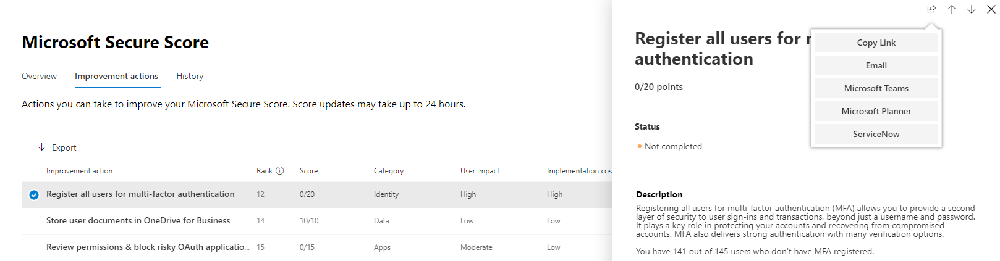

# Gerenciar tíquetes pelo ServiceNow

O ServiceNow é uma plataforma de computação em nuvem popular que ajuda as empresas a gerenciar fluxos de trabalho digitais para operações corporativas. A plataforma atual tem fluxos de trabalho de ti, fluxos de trabalho de funcionários e fluxos de trabalho de cliente. A Microsoft fez uma parceria com o ServiceNow para tornar mais fácil para os administradores de ti gerenciar suas permissões e tarefas em ambas as plataformas. [Saiba mais sobre o ServiceNow](https://www.servicenow.com/)

A central de segurança do Microsoft 365 agora é aprimorada com a capacidade de criar e controlar de forma nativa as permissões no ServiceNow. Administradores de segurança podem enviar uma ação de melhoria de [Pontuação segura da Microsoft](microsoft-secure-score.md) diretamente para o ServiceNow e criar uma permissão. As permissões de gerenciamento de incidentes e de alterações podem ser criadas. Eles podem ser rastreados na home page do centro de segurança da Microsoft e o ServiceNow.

## Pré-requisitos

Ter acesso à central de segurança do Microsoft 365 e uma instância do ServiceNow com:  

* Kingston ou versão superior
* Ter credenciais do administrador HI
* Ter privilégios de administrador na instância de fornecedor de destino

O ServiceNow recomenda que os usuários mantenham as configurações padrão em sua instância do ServiceNow. Ter personalizações pode causar erros ao concluir a lista de verificação de instalação e integração com a central de segurança do Microsoft 365.

## Troca de dados

Quando você conecta o centro de segurança do Microsoft 365 ao ServiceNow, a Microsoft recebe os seguintes dados adicionais:

* Nome da instância do ServiceNow
* ID do cliente do ServiceNow
* Segredo do cliente do ServiceNow
* Tokens de atualização & Access

Quando você cria uma permissão do ServiceNow no centro de segurança do Microsoft 365, os dados a seguir são enviados para o ServiceNow:

* ID de usuário que inicia a criação de tíquete
* Nome da tarefa
* Descrição da tarefa
* Prioridade
* Data de conclusão
* Fonte de recomendação (recomendação do usuário ou recomendação da Microsoft)
* Categoria de recomendação (dispositivos, dados, aplicativos, identidade, infraestrutura)

## Conectar a central de segurança do Microsoft 365 ao ServiceNow

Navegue até a home page do centro de segurança do Microsoft 365 para ver o cartão de conexão do ServiceNow.

Selecione "conectar ao ServiceNow" para ir para a página de configuração do ServiceNow. Siga as instruções para autorizar o aplicativo conector 365 da Microsoft.

> [!NOTE]
> Antes de autorizar a conexão entre o centro de segurança do Microsoft 365 e o ServiceNow, certifique-se de usar o logon e a senha de usuário de integração que você criou nas etapas de instalação. Não use suas credenciais pessoais.

Após ter seguido as orientações e autorizar a conexão, veja o status da conexão na página conexão da central de segurança do Microsoft 365 e na experiência do aplicativo do Microsoft 365 Ticketing Connector. Agora, você está pronto para começar a criar tarefas!

## Criar uma tarefa e compartilhá-la para o ServiceNow

Depois que a integração é configurada, crie tarefas do ServiceNow com base em ações específicas de melhoria da Pontuação segura da Microsoft. Vá para qualquer ação de melhoria na pontuação segura no portal da central de segurança do Microsoft 365 e selecione o ícone "compartilhar". Uma das opções de DropDown é o ServiceNow.

Uma tarefa é gerada onde você pode definir a prioridade e editar o nome, a descrição ou a data de conclusão. Após todos os campos obrigatórios serem preenchidos, envie a tarefa para o ServiceNow.

A tarefa está visível no ServiceNow como uma solicitação de alteração de configuração e segurança do Microsoft 365.

## Controlar ingressos

Depois que o gerenciamento de alterações e as permissões de gerenciamento de incidentes tiverem sido criados, eles serão exibidos em cartões na home page do centro de segurança do Microsoft 365. A partir desses cartões, você pode criar um tíquete, exibir todos os tíquetes ou gerenciar a configuração do ServiceNow.

  

Para reprovisionar ou gerenciar sua integração do ServiceNow no centro de segurança do Microsoft 365, selecione **gerenciar a configuração do servicenow** em qualquer um dos cartões. A partir daí, remova a conexão atual do ServiceNow e personalize os nomes de estado de tíquete.

Com as permissões do ServiceNow visíveis no centro de segurança do Microsoft 365, suas tarefas residem em um local onde elas podem ser rastreadas e aplicadas junto com seus outros itens do painel de segurança.

## Solução de problemas

### Você recebe um erro na primeira etapa da lista de verificação de instalação (criação de OAuth)

**Mensagem de erro**: a operação de leitura em relação a ' oauth_entity ' do escopo ' x_mioms_m365ticket ' foi recusada devido à política de acesso entre escopos da tabela

O aplicativo presume que qualquer administrador na instância do ServiceNow possa criar e ler entidades OAuth. Esse erro pode ser causado devido a uma personalização na instância do ServiceNow, que restringe quem pode criar/ler entidades OAuth.

**O ServiceNow recomenda que os usuários mantenham a funcionalidade padrão.**

Defina as configurações de tabela "registros de aplicativos" como padrão:

* Rótulo = registradores de aplicativos
* Nome = oauth_entity
* Acessível a partir de = todos os escopos do aplicativo
* Caixa de seleção pode ler = marcada

### Como validar a entidade OAuth criada para o conector de conformidade de & de segurança do Microsoft 365

Vá para a tabela registros de aplicativos (**Menu > registro de aplicativo > OAuth de sistema**) no ServiceNow e localize a entidade OAuth criada por você, com o nome que você atribuiu a ela.

### Como fazer logon como o usuário de integração

Antes de autorizar a conexão entre o centro de segurança do Microsoft 365 e o ServiceNow, certifique-se de usar o logon e a senha de usuário de integração que você criou nas etapas de instalação. Não use suas credenciais pessoais.

1. Vá para a página autorização no ServiceNow.
2. Se você estiver conectado com suas credenciais pessoais, selecione o **não é possível** vincular no canto superior direito.
3. Faça logon no ServiceNow como o usuário de integração que você criou anteriormente na lista de verificação de instalação.  
4. Selecione **permitir** na página do servicenow que pergunta se o conector de segurança + conformidade pode se conectar à sua conta do servicenow.
5. Prossiga com as etapas de configuração.

### Como validar o usuário de integração criado com a lista de verificação de instalação do conector de conformidade do & de segurança do Microsoft 365

Vá para a tabela usuários **(Menu > administração de usuário > usuários**) no ServiceNow e localize o usuário de integração criado por você, com o nome atribuído a ele.

### Sua empresa tem o logon único habilitado, o que impede que você se conecte ao ServiceNow através da central de segurança do Microsoft 365

Se sua empresa ativou o logon único e você recebe um erro ou o logon não é bem-sucedido, siga uma das duas soluções.

#### Faça logon no ServiceNow como o usuário de integração

1. Volte para a página autorização no ServiceNow.
2. Selecione o **não é possível** vincular no canto superior direito.
3. Faça logon no ServiceNow como o usuário de integração que você criou anteriormente na lista de verificação de instalação.  
4. Selecione **permitir** na página do servicenow que pergunta se o conector de segurança + conformidade pode se conectar à sua conta do servicenow.
5. Prossiga com as etapas de configuração.

#### Criar um usuário de administrador de segurança

1. Criar um usuário com privilégios de administrador de segurança no Azure Active Directory. O usuário precisa ter o mesmo nome e endereço de email do usuário de integração que você criou na lista de verificação de instalação. Você pode remover a função de administrador de segurança após o logon e a conexão ter sido concluída.
2. Faça logon no centro de segurança do Microsoft 365 como este usuário e siga as etapas de configuração.

### Filtragem de IP

Se você habilitou a filtragem de IP, talvez seja necessário permitir explicitamente endereços IP. Consulte [controle de acesso de endereço IP](https://docs.servicenow.com/bundle/orlando-platform-administration/page/administer/login/task/t_AccessControl.html) para obter informações sobre como permitir intervalos IP no ServiceNow. Consulte [Azure IP Ranges and Service Tags-Public Cloud](https://www.microsoft.com/en-us/download/details.aspx?id=56519) para obter uma lista de endereços IP para permitir.

### A instalação está concluída, mas não vê tíquetes e não pode ser compartilhada

Se as etapas de instalação e configuração tiverem sido concluídas, mas você não vir os cartões do ServiceNow na Home Page e não puder compartilhar o ServiceNow pela pontuação segura da Microsoft, verifique o status da página de https://security.microsoft.com/ticketProvisioningprovisionamento em. Selecione **autorizar** e retornar para a página inicial. Os cartões devem ser exibidos.

