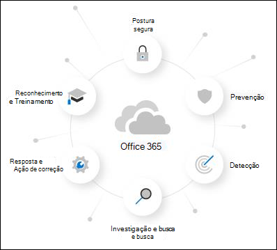

# Sobre a avaliação do Microsoft Defender para Office 365About the Microsoft Defender for Office 365 trial

O Microsoft Defender para Office 365 protege sua organização contra ameaças mal-intencionadas que são colocadas por mensagens de email, links (URLs) e ferramentas de colaboração.Microsoft Defender for Office 365 safeguards your organization against malicious threats that are posed by email messages, links (URLs), and collaboration tools. O Defender for Office 365 inclui:Defender for Office 365 includes:

- **Políticas de proteção contra ameaças**: defina políticas de proteção contra ameaças para definir o nível de proteção apropriado para a sua organização.**Threat protection policies**: Define threat-protection policies to set the appropriate level of protection for your organization.
- **Relatórios**: Exibir relatórios em tempo real para monitorar o desempenho do Defender para Office 365 em sua organização.**Reports**: View real-time reports to monitor Defender for Office 365 performance in your organization.
- **Recursos de investigação e resposta de ameaças**: use as ferramentas de ponta para investigar, compreender, simular e prevenir ameaças.**Threat investigation and response capabilities**: Use leading-edge tools to investigate, understand, simulate, and prevent threats.
- **Recursos de investigação e resposta automatizadas**: poupe tempo e esforço, investigando e reduzindo as ameaças.**Automated investigation and response capabilities**: Save time and effort investigating and mitigating threats.

Uma avaliação do Microsoft Defender para Office 365 é a maneira mais fácil de experimentar os recursos do Defender para o Office 365, e a configuração dele leva apenas alguns cliques.A Microsoft Defender for Office 365 trial is the easiest way to try the capabilities of Defender for Office 365, and setting it up only takes a couple of clicks. Depois que a configuração de avaliação for concluída, todos os recursos do Defender for Office 365 Plan 1 e Plan 2 estarão disponíveis na organização por até 90 dias.After the trial setup is complete, all Defender for Office 365 Plan 1 and Plan 2 capabilities are available in the organization for up to 90 days.

> [!NOTE]
> A configuração automatizada descrita neste artigo está atualmente na Visualização Pública e pode não estar disponível em seu local.The automated configuration that's described in this article is currently in Public Preview and might not be available in your location.

## Termos e condiçõesTerms and conditions

A avaliação do Defender para Office 365 está disponível por 90 dias e pode ser iniciada para todos os seus usuários.The Defender for Office 365 trial is available for 90 days and can be initiated for all of your users. Para obter mais informações, consulte [Microsoft Defender for Office 365 Trial Terms & Conditions](defender-for-office-365-trial-terms-and-conditions.md).For more information, see [Microsoft Defender for Office 365 Trial Terms & Conditions](defender-for-office-365-trial-terms-and-conditions.md).

## Configurar uma avaliação do Defender para o Office 365Set up a Defender for Office 365 trial

Uma avaliação permite que as organizações configurem facilmente e configurem os recursos do Defender for Office 365.A trial allows organizations to easily set up and configure the Defender for Office 365 capabilities. Durante a instalação, as políticas que são exclusivas do Defender para Office 365 (especificamente, Anexos Seguros, [Links](safe-links.md)Seguros e proteção de representação em políticas [anti-spam](set-up-anti-phishing-policies.md#impersonation-settings-in-anti-phishing-policies-in-microsoft-defender-for-office-365)) são [aplicadas](safe-attachments.md)usando o modelo Padrão para políticas de segurança predefinidas. During setup, policies that are exclusive to Defender for Office 365 (specifically, [Safe Attachments](safe-attachments.md), [Safe Links](safe-links.md), and [impersonation protection in anti-spam policies](set-up-anti-phishing-policies.md#impersonation-settings-in-anti-phishing-policies-in-microsoft-defender-for-office-365)) are applied using the Standard template for [preset security policies](preset-security-policies.md).

Por padrão, essas políticas têm escopo para todos os usuários da organização, mas os administradores podem personalizar as políticas durante ou após a instalação, para que se apliquem somente a usuários específicos.By default, these policies are scoped to all users in the organization, but admins can customize the policies during or after setup so they apply only to specific users.

Durante a instalação, a funcionalidade de resposta do MDO (encontrada no MDO P2 ou equivalente) também é configurada para toda a organização.During setup, MDO response functionality (found in MDO P2 or equivalent) is also set up for the entire organization. Não é necessário fazer o scoping de política.No policy scoping is required.

## LicenciamentoLicensing

Como parte da configuração de avaliação, as licenças do Defender for Office 365 são aplicadas automaticamente à organização.As part of the trial setup, the Defender for Office 365 licenses are automatically applied to the organization. As licenças são gratuitas nos primeiros 90 dias.The licenses are free of charge for the first 90 days.

## PermissõesPermissions

Para iniciar ou encerrar a avaliação, você precisa  ser membro das funções **Administrador Global** ou Administrador de Segurança no Azure Active Directory.To start or end the trial, you need to be a member of the **Global Administrator** or **Security Administrator** roles in Azure Active Directory. Para obter detalhes, consulte [Sobre funções de administrador](../../admin/add-users/about-admin-roles.md).For details, see [About admin roles](../../admin/add-users/about-admin-roles.md).

## Informações adicionaisAdditional information

Depois de se inscrever na avaliação, pode levar até 2 horas para que as alterações e atualizações sejam disponibilizadas.After you enroll in the trial, it might take up to 2 hours for the changes and updates to be available. E, os administradores devem fazer logoff e fazer logoff novamente para ver as alterações.And, admins must log out and log back in to see the changes.

Os administradores podem desabilitar a avaliação a qualquer momento, indo para o <> cartão.Admins can disable the trial at any point by going to the <> card.

## DisponibilidadeAvailability

A avaliação do Defender para Office 365 está gradualmente sendo implantada para clientes existentes que atendem a critérios específicos (incluindo geografia) e que não têm licenças existentes do Defender para o Office 365 Plano 1 ou Plano 2 (incluídas em sua assinatura ou como complemento).The Defender for Office 365 trial is gradually rolling out to existing customers who meet specific criteria (including geography) and who don't have existing Defender for Office 365 Plan 1 or Plan 2 licenses (included in their subscription or as an add-on).

## Saiba mais sobre o Defender para Office 365Learn more about Defender for Office 365

O Defender para o Office 365 ajuda as organizações a proteger sua empresa oferecendo uma lista abrangente de recursos.Defender for Office 365 helps organizations secure their enterprise by offering a comprehensive slate of capabilities.

Você também pode saber mais sobre o Defender para Office 365 neste [guia interativo.](https://techcommunity.microsoft.com/t5/video-hub/protect-your-organization-with-microsoft-365-defender/m-p/1671189)You can also learn more about Defender for Office 365 at this [interactive guide](https://techcommunity.microsoft.com/t5/video-hub/protect-your-organization-with-microsoft-365-defender/m-p/1671189).

### PrevençãoPrevention

Uma pilha de filtragem robusta impede uma ampla variedade de ataques baseados em volume e direcionados, incluindo comprometimento de email comercial, phishing de credenciais, ransomware e malware avançado.A robust filtering stack prevents a wide variety of volume-based and targeted attacks including business email compromise, credential phishing, ransomware, and advanced malware.

- [Políticas anti-phishing: configurações exclusivas no Defender para Office 365Anti-phishing policies: Exclusive settings in Defender for Office 365](set-up-anti-phishing-policies.md#exclusive-settings-in-anti-phishing-policies-in-microsoft-defender-for-office-365)
- [Anexos SegurosSafe Attachments](safe-attachments.md)
- [Links SegurosSafe Links](safe-links.md)

### DetecçãoDetection

A IA líder do setor detecta conteúdo mal-intencionado e suspeito e correlaciona padrões de ataque para identificar campanhas projetadas para evitar a proteção.Industry-leading AI detects malicious and suspicious content and correlates attack patterns to identify campaigns designed to evade protection.

- [Exibições de campanha no Microsoft Defender para Office 365Campaign Views in Microsoft Defender for Office 365](campaigns.md)

### Investigação e buscaInvestigation and hunting

Experiências avançadas ajudam a identificar, priorizar e investigar ameaças, com recursos avançados de busca para rastrear ataques no Office 365.Powerful experiences help identify, prioritize, and investigate threats, with advanced hunting capabilities to track attacks across Office 365.

- [Explorador de Ameaças e Detecções em tempo realThreat Explorer and Real-time detections](threat-explorer.md)
- [Relatórios em tempo real no Defender para Office 365Real-time reports in Defender for Office 365](view-reports-for-mdo.md)
- [Rastreadores de Ameaças - Novo e NotávelThreat Trackers - New and Noteworthy](threat-trackers.md)
- Integração com [o Microsoft 365 Defender](../defender/microsoft-365-defender.md)Integration with [Microsoft 365 Defender](../defender/microsoft-365-defender.md)

### Resposta e correçãoResponse and remediation

Recursos abrangentes de resposta a incidentes e automação ampliam a eficácia e a eficiência da equipe de segurança.Extensive incident response and automation capabilities amplify your security team’s effectiveness and efficiency.

- [Investigação e resposta automatizadas (AIR) no Microsoft Defender para Office 365Automated investigation and response (AIR) in Microsoft Defender for Office 365](office-365-air.md)

### Conscientização e TreinamentoAwareness and training

Recursos avançados de simulação e treinamento, juntamente com experiências integradas em aplicativos cliente, conscientizam o usuário.Rich simulation and training capabilities along with integrated experiences within client applications build user awareness.

- [Começar a usar o Treinamento de simulação de ataqueGet started using Attack simulation training](attack-simulation-training-get-started.md)

### Postura seguraSecure posture

Modelos recomendados e percepções de configuração ajudam os clientes a obter e permanecer seguros.Recommended templates and configuration insights help customers get and stay secure.

- [Políticas de segurança predefinidas no EOP e no Microsoft Defender para Office 365Preset security policies in EOP and Microsoft Defender for Office 365](preset-security-policies.md)
- [Analisador de configuração para políticas de proteção no EOP e no Microsoft Defender para Office 365](configuration-analyzer-for-security-policies.md).[Configuration analyzer for protection policies in EOP and Microsoft Defender for Office 365](configuration-analyzer-for-security-policies.md).

## Envie comentáriosGive feedback

Seus comentários nos ajudam a melhorar a proteção do ambiente contra ataques avançados.Your feedback helps us get better at protecting your environment from advanced attacks. Compartilhe sua experiência e impressões dos recursos do produto e dos resultados de avaliação.Share your experience and impressions of product capabilities and trial results.
