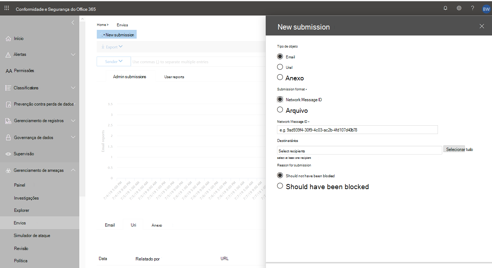
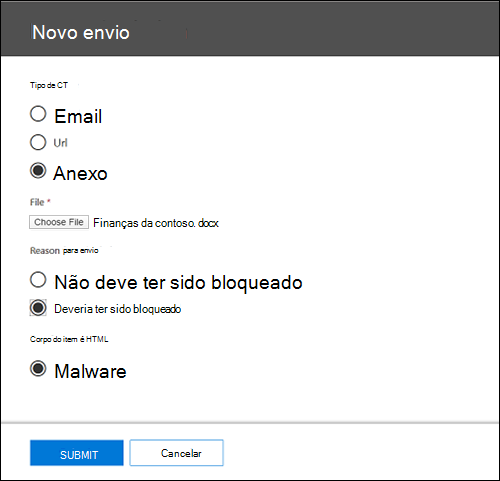
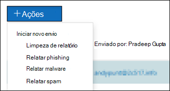

# Usar o Envio do Administrador para enviar spam, phishing, URLs e arquivos à MicrosoftUse Admin Submission to submit suspected spam, phish, URLs, and files to Microsoft

[!INCLUDE [Microsoft 365 Defender rebranding](../includes/microsoft-defender-for-office.md)]

Nas organizações do Microsoft 365 com caixas de correio no Exchange Online, os administradores podem usar o portal de Envios no Centro de Conformidade & e Segurança para enviar mensagens de email, URLs e anexos à Microsoft para verificação.In Microsoft 365 organizations with mailboxes in Exchange Online, admins can use the Submissions portal in the Security & Compliance Center to submit email messages, URLs, and attachments to Microsoft for scanning.

Ao enviar um email, você receberá informações sobre todas as políticas que possam ter permitido o email de entrada em seu locatário, bem como a análise de quaisquer URLs e anexos no email.When you submit an email, you will get information about any policies that may have allowed the incoming email into your tenant, as well as examination of any URLs and attachments in the mail. As políticas que podem ter permitido um email incluem a lista de remetentes seguros de um usuário individual, bem como políticas de nível de locatário, como regras de fluxo de emails do Exchange (também conhecidas como regras de transporte).Policies that may have allowed a mail include an individual user's safe sender list as well as tenant level policies such as Exchange mail flow rules (also known as transport rules).

Para outras maneiras de enviar mensagens de email, URLs e anexos à Microsoft, consulte Mensagens e arquivos [de relatório para a Microsoft.](report-junk-email-messages-to-microsoft.md)For other ways to submit email messages, URLs, and attachments to Microsoft, see [Report messages and files to Microsoft](report-junk-email-messages-to-microsoft.md).

## O que você precisa saber antes de começar?What do you need to know before you begin?

- Você abrir o Centro de conformidade e segurança em <https://protection.office.com/>.You open the Security & Compliance Center at <https://protection.office.com/>. Para ir diretamente para a página **de** Envio, use <https://protection.office.com/reportsubmission> .To go directly to the **Submission** page, use <https://protection.office.com/reportsubmission>.

- Para enviar mensagens e arquivos à Microsoft, você precisa ser membro de um dos seguintes grupos de função:To submit messages and files to Microsoft, you need to be a member of one of the following role groups:

  - **Gerenciamento de organizações** ou **Administrador de segurança** no [Centro de segurança e conformidade](permissions-in-the-security-and-compliance-center.md).**Organization Management** or **Security Administrator** in the [Security & Compliance Center](permissions-in-the-security-and-compliance-center.md).

  - **Gerenciamento de organização** no [Exchange Online](https://docs.microsoft.com/Exchange/permissions-exo/permissions-exo#role-groups).**Organization Management** in [Exchange Online](https://docs.microsoft.com/Exchange/permissions-exo/permissions-exo#role-groups).

    Observe que a associação nesse grupo de função é necessária para exibir [envios](#view-user-submissions-to-the-custom-mailbox) de usuário para a caixa de correio personalizada, conforme descrito posteriormente neste artigo.Note that membership in this role group is required to [View user submissions to the custom mailbox](#view-user-submissions-to-the-custom-mailbox) as described later in this article.

- Para obter mais informações sobre como os usuários podem enviar mensagens e arquivos à Microsoft, consulte [Mensagens e arquivos de relatório para a Microsoft.](report-junk-email-messages-to-microsoft.md)For more information about how users can submit messages and files to Microsoft, see [Report messages and files to Microsoft](report-junk-email-messages-to-microsoft.md).

## Relatar conteúdo suspeito à MicrosoftReport suspicious content to Microsoft

1. No Centro de Conformidade & segurança,  vá para Envios de gerenciamento de ameaças, verifique se você está na guia Envios de Administrador e clique em \>  **Novo envio.** In the Security & Compliance Center, go to **Threat management** \> **Submissions**, verify that you're on the **Admin submissions** tab, and then click **New submission**.

2. Use **o sub80** de envio novo que aparece para enviar a mensagem, a URL ou o anexo, conforme descrito nas seções a seguir.Use **New submission** flyout that appears to submit the message, URL, or attachment as described in the following sections.

### Enviar um email questionável para a MicrosoftSubmit a questionable email to Microsoft

1. Na seção **Tipo de objeto,** selecione **Email**.In the **Object type** section, select **Email**. Na seção **Formato de** envio, use uma das seguintes opções:In the **Submission format** section, use one of the following options:

   - **ID** da mensagem de rede: este é um valor guid que está disponível no header **X-MS-Exchange-Organization-Network-Message-Id** na mensagem ou no header **X-MS-Office365-Filtering-Correlation-Id** em mensagens em quarentena.**Network Message ID**: This is a GUID value that's available in the **X-MS-Exchange-Organization-Network-Message-Id** header in the message, or in the **X-MS-Office365-Filtering-Correlation-Id** header in quarantined messages.

   - **Arquivo:** clique **em Escolher arquivo.****File**: Click **Choose file**. Na caixa de diálogo que abre, encontre e selecione o arquivo .eml ou .msg e clique em **Abrir.**In the dialog that opens, find and select the .eml or .msg file, and then click **Open**.

   > [!NOTE]
   > Os administradores com o Defender para Office 365 Plano 1 ou Plano 2 podem enviar mensagens com até 30 dias.Admins with Defender for Office 365 Plan 1 or Plan 2 are able to submit messages as old as 30 days. Outros administradores só poderão voltar 7 dias.Other admins will only be able to go back 7 days.

2. Na seção **Destinatários,** especifique um ou mais destinatários para os quais você gostaria de executar uma verificação de política.In the **Recipients** section, specify one or more recipients that you would like to run a policy check against. A verificação de política determinará se o email burlou a verificação devido às políticas do usuário ou da organização.The policy check will determine if the email bypassed scanning due to user or organization policies.

3. Na seção **Motivo do envio,** selecione uma das seguintes opções:In the **Reason for submission** section, select one of the following options:

   - **Não deveria ter sido bloqueado****Should not have been blocked**

   - **Deve ter sido bloqueado:** Selecionar **Spam,** **Phishing** ou **Malware.****Should have been blocked**: Select **Spam**, **Phishing**, or **Malware**. Se você não tiver certeza, use seu melhor bom senso.If you're not sure, use your best judgment.

4. Quando terminar, clique no **botão** Enviar.When you're finished, click the **Submit** button.

### Enviar uma URL suspeita para a MicrosoftSend a suspect URL to Microsoft

1. Na seção **Tipo de objeto,** selecione **URL**.In the **Object type** section, select **URL**. Na caixa exibida, insira a URL completa (por exemplo, `https://www.fabrikam.com/marketing.html` ).In the box that appears, enter the full URL (for example, `https://www.fabrikam.com/marketing.html`).

2. Na seção **Motivo do envio,** selecione uma das seguintes opções:In the **Reason for submission** section, select one of the following options:

   - **Não deveria ter sido bloqueado****Should not have been blocked**

   - **Deve ter sido bloqueado:** Selecionar **Phishing** ou **Malware.****Should have been blocked**: Select **Phishing** or **Malware**.

3. Quando terminar, clique no **botão** Enviar.When you're finished, click the **Submit** button.

### Enviar um arquivo suspeito para a MicrosoftSubmit a suspected file to Microsoft

1. Na seção **Tipo de objeto,** selecione **Anexo**.In the **Object type** section, select **Attachment**.

2. Clique **em Escolher Arquivo.**Click **Choose File**. Na caixa de diálogo que é aberta, encontre e selecione o arquivo e clique em **Abrir.**In the dialog that opens, find and select the file, and then click **Open**.

3. Na seção **Motivo do envio,** selecione uma das seguintes opções:In the **Reason for submission** section, select one of the following options:

   - **Não deveria ter sido bloqueado****Should not have been blocked**

   - **Deve ter sido bloqueado:** **o malware** é a única opção e é selecionado automaticamente.**Should have been blocked**: **Malware** is the only choice, and is automatically selected..

4. Quando terminar, clique no **botão** Enviar.When you're finished, click the **Submit** button.

## Exibir envios de administradorView admin submissions

No Centro de Conformidade & segurança,  vá para Envios de gerenciamento de ameaças, verifique se você está na guia Envios de Administrador e clique em \>  **Novo envio.** In the Security & Compliance Center, go to **Threat management** \> **Submissions**, verify that you're on the **Admin submissions** tab, and then click **New submission**.

Na parte superior da página, você pode inserir uma data de início, uma data de término e (por padrão) filtrar pela **ID** de Envio (um valor GUID atribuído a cada envio) inserindo um valor na caixa e clicando no botão  Atualizar.Near the top of the page, you can enter a start date, an end date, and (by default) you can filter by **Submission ID** (a GUID value that's assigned to every submission) by entering a value in the box and clicking . UpdateYou can enter multiple values separated by commas.

Para alterar os critérios de filtro, clique no **botão ID de** Envio e escolha um dos seguintes valores:To change the filter criteria, click the **Submission ID** button and choose one of the following values:

- **Sender****Sender**
- **Assunto/URL/Nome do arquivo****Subject/URL/File name**
- **Enviado por****Submitted by**
- **Tipo de envio****Submission type**
- **Status****Status**

Para exportar os resultados, clique **em Exportar** próximo à parte superior da página e selecione **Chart data** ou **Table**.To export the results, click **Export** near the top of the page and select **Chart data** or **Table**. Na caixa de diálogo exibida, salve o arquivo .csv.In the dialog that appears, save the .csv file.

Abaixo do gráfico, há três guias: **Email** (padrão), **URL** e **Anexo.**Below the graph, there are three tabs: **Email** (default), **URL**, and **Attachment**.

### Exibir envios de email de administradorView admin email submissions

Clique na **guia Email.**Click the **Email** tab.

Você pode clicar **no botão Opções de** coluna na parte inferior da página para adicionar ou remover colunas da exibição:You can click the **Column options** button near the bottom of the page to add or remove columns from the view:

- **Date****Date**
- **ID de** envio: um valor GUID atribuído a cada envio.**Submission ID**: A GUID value that's assigned to every submission.
- **Enviado por**\***Submitted by**\*
- **Assunto**\***Subject**\*
- **Sender****Sender**
- **IP do remetente**\***Sender IP**\*
- **Tipo de envio****Submission type**
- **Motivo da entrega****Delivery reason**
- **Status**\***Status**\*

  \* Se você clicar nesse valor, as informações detalhadas serão exibidas em um flyout.\* If you click this value, detailed information is displayed in a flyout.

#### Detalhes de verificação de envio de administradorAdmin submission rescan details

As mensagens enviadas nos envios de administrador são novamente exibidas e os resultados são mostrados no submenu de detalhes:Messages that are submitted in admin submissions are rescanned and results shown in the details flyout:

- Se houve uma falha na autenticação de email do remetente no momento da entrega.If there was a failure in the sender's email authentication at the time of delivery.
- Informações sobre quaisquer acertos de política que poderiam ter afetado ou substituído o veredito de uma mensagem.Information about any policy hits that could have affected or overridden the verdict of a message.
- Resultados de detonação atuais para ver se as URLs ou arquivos contidos na mensagem são mal-intencionados ou não.Current detonation results to see if the URLs or files contained in the message were malicious or not.
- Comentários dos alunos.Feedback from graders.

Se uma substituição foi encontrada, a verificação novamente deve ser concluída em vários minutos.If an override was found, the rescan should complete in several minutes. Se não houve um problema na autenticação ou na entrega de email não tiver sido afetado por uma substituição, o feedback dos alunos pode levar até um dia.If there wasn't a problem in email authentication or delivery wasn't affected by an override, then the feedback from graders could take up to a day.

### Exibir envios de URL de administradorView admin URL submissions

Clique na **guia URL.**Click the **URL** tab.

Você pode clicar **no botão Opções de** coluna na parte inferior da página para adicionar ou remover colunas da exibição:You can click the **Column options** button near the bottom of the page to add or remove columns from the view:

- **Date****Date**
- **ID de envio****Submission ID**
- **Enviado por**\***Submitted by**\*
- **URL**\***URL**\*
- **Tipo de envio****Submission type**
- **Status**\***Status**\*

  \* Se você clicar nesse valor, as informações detalhadas serão exibidas em um flyout.\* If you click this value, detailed information is displayed in a flyout.

### Exibir envios de anexo de administradorView admin attachment submissions

Clique na **guia Anexos.**Click the **Attachments** tab.

Você pode clicar **no botão Opções de** coluna na parte inferior da página para adicionar ou remover colunas da exibição:You can click the **Column options** button near the bottom of the page to add or remove columns from the view:

- **Date****Date**
- **ID de envio****Submission ID**
- **Enviado por**\***Submitted by**\*
- **Nome do arquivo**\***File name**\*
- **Tipo de envio****Submission type**
- **Status**\***Status**\*

  \* Se você clicar nesse valor, as informações detalhadas serão exibidas em um flyout.\* If you click this value, detailed information is displayed in a flyout.

## Exibir envios de usuário para a MicrosoftView user submissions to Microsoft

Se você implantou o complemento Mensagem de [Relatório,](enable-the-report-message-add-in.md)o relatório [de phishing](enable-the-report-phish-add-in.md)ou as pessoas usam os relatórios integrados no [Outlook na Web](report-junk-email-and-phishing-scams-in-outlook-on-the-web-eop.md), você pode ver o que os usuários estão relatando na guia **Envios** de usuário.If you've deployed the [Report Message add-in](enable-the-report-message-add-in.md), the [Report Phishing add-in](enable-the-report-phish-add-in.md), or people use the [built-in reporting in Outlook on the web](report-junk-email-and-phishing-scams-in-outlook-on-the-web-eop.md), you can see what users are reporting on the **User submissions** tab.

1. No Centro de Conformidade & segurança, vá para Envios **de gerenciamento** \> **de ameaças.**In the Security & Compliance Center, go to **Threat management** \> **Submissions**.

2. Selecione a **guia Envios de** usuário e clique em **Novo envio.**Select the **User submissions** tab, and then click **New submission**.

Você pode clicar **no botão Opções de** coluna na parte inferior da página para adicionar ou remover colunas da exibição:You can click the **Column options** button near the bottom of the page to add or remove columns from the view:

- **Enviado em****Submitted on**
- **Enviado por**\***Submitted by**\*
- **Assunto**\***Subject**\*
- **Sender****Sender**
- **IP do remetente**\***Sender IP**\*
- **Tipo de envio****Submission type**

\* Se você clicar nesse valor, as informações detalhadas serão exibidas em um flyout.\* If you click this value, detailed information is displayed in a flyout.

Na parte superior da página, você pode inserir uma data de início, uma  data de término e (por padrão) filtrar por Remetente inserindo um valor na caixa e clicando no botão  Atualizar.Near the top of the page, you can enter a start date, an end date, and (by default) you can filter by **Sender** by entering a value in the box and clicking . UpdateYou can enter multiple values separated by commas.

Para alterar os critérios de filtro, clique **no botão** Remetente e escolha um dos seguintes valores:To change the filter criteria, click the **Sender** button and choose one of the following values:

- **Domínio do remetente****Sender domain**
- **Assunto****Subject**
- **Enviado por****Submitted by**
- **Tipo de envio****Submission type**
- **IP do remetente****Sender IP**

Para exportar os resultados, clique **em Exportar** próximo à parte superior da página e selecione **Chart data** ou **Table**.To export the results, click **Export** near the top of the page and select **Chart data** or **Table**. Na caixa de diálogo exibida, salve o arquivo .csv.In the dialog that appears, save the .csv file.

## Exibir envios de usuário para a caixa de correio personalizadaView user submissions to the custom mailbox

**Se** você configurou [uma caixa de](user-submission.md) correio personalizada para receber mensagens relatadas pelo usuário, você pode exibir e também enviar mensagens que foram entregues à caixa de correio de relatório.**If** you've [configured a custom mailbox](user-submission.md) to receive user reported messages, you can view and also submit messages that were delivered to the reporting mailbox.

1. No Centro de Conformidade & segurança, vá para Envios **de gerenciamento** \> **de ameaças.**In the Security & Compliance Center, go to **Threat management** \> **Submissions**.

2. Selecione a **guia Caixa de Correio** Personalizada.Select the **Custom mailbox** tab.

Você pode clicar **no botão Opções de** coluna na parte inferior da página para adicionar ou remover colunas da exibição:You can click the **Column options** button near the bottom of the page to add or remove columns from the view:

- **Enviado em****Submitted on**
- **Enviado por**\***Submitted by**\*
- **Assunto**\***Subject**\*
- **Sender****Sender**
- **IP do remetente**\***Sender IP**\*
- **Tipo de envio****Submission type**

Na parte superior da página, você pode inserir uma data de início, uma data de término e pode filtrar por **Submitted** inserindo um valor na caixa e clicando no botão  Atualizar.Near the top of the page, you can enter a start date, an end date, and you can filter by **Submitted by** by entering a value in the box and clicking . UpdateYou can enter multiple values separated by commas.

Para exportar os resultados, clique **em Exportar** próximo à parte superior da página e selecione **Chart data** ou **Table**.To export the results, click **Export** near the top of the page and select **Chart data** or **Table**. Na caixa de diálogo exibida, salve o arquivo .csv.In the dialog that appears, save the .csv file.

## Desfazer envios de usuárioUndo user submissions

Depois que um usuário envia um email suspeito para a caixa de correio personalizada, o usuário e o administrador não têm a opção de desfazer o envio.Once a user submits a suspicious email to the custom mailbox, the user and admin don't have an option to undo the submission. Se o usuário quiser recuperar o email, ele estará disponível para recuperação nas pastas Itens Excluídos ou Lixo Eletrônico.If the user would like to recover the email, it will be available for recovery in the Deleted Items or Junk Email folders.

### Enviar mensagens para a Microsoft da caixa de correio personalizadaSubmit messages to Microsoft from the custom mailbox

Se você configurou a caixa de correio personalizada para interceptar mensagens relatadas pelo usuário sem enviar as mensagens para a Microsoft, você pode encontrar e enviar mensagens específicas para a Microsoft para análise.If you've configured the custom mailbox to intercept user-reported messages without sending the messages to Microsoft, you can find and send specific messages to Microsoft for analysis. Isso efetivamente move um envio de usuário para um envio de administrador.This effectively moves a user submission to an admin submission.

Na guia **Caixa de Correio** Personalizada, selecione  uma mensagem na lista, clique no botão Ação e faça uma das seguintes seleções:On the **Custom mailbox** tab, select a message in the list, click the **Action** button, and make one of the following selections:

- **Relatório limpo****Report clean**
- **Relatar phishing****Report phishing**
- **Relatar malware****Report malware**
- **Relatar spam****Report spam**

