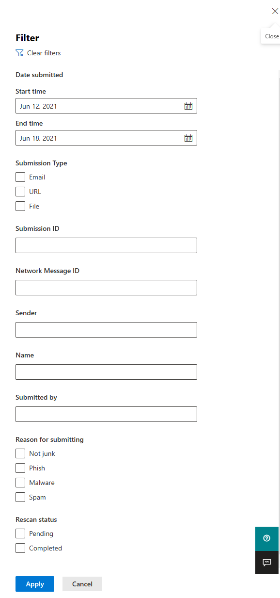

# Usar o Envio do Administrador para enviar spam, phishing, URLs e arquivos à Microsoft

[!INCLUDE [Microsoft 365 Defender rebranding](../includes/microsoft-defender-for-office.md)]

**Aplica-se a**
- [Proteção do Exchange Online](exchange-online-protection-overview.md)
- [Plano 1 e plano 2 do Microsoft Defender para Office 365](defender-for-office-365.md)

Em Microsoft 365 organizações com caixas de correio Exchange Online, os administradores podem usar o portal Envios no portal Microsoft 365 Defender para enviar mensagens de email, URLs e anexos à Microsoft para verificação.

Ao enviar uma mensagem de email, você receberá:

- **Verificação de autenticação de** email : Detalhes sobre se a autenticação de email passou ou falhou quando ela foi entregue.
- **Visitas de política**: informações sobre quaisquer políticas que possam ter permitido ou bloqueado o email de entrada em seu locatário, substituindo nossos vereditos de filtro de serviço.
- **Reputação/detonação** de carga : Exame de quaisquer URLs e anexos na mensagem.
- **Análise de notas**: Revisão feita por alunos de nível humano para confirmar se as mensagens são mal-intencionadas ou não.

> [!IMPORTANT]
> A análise de reputação/detonação e classificação de carga não é feita em todos os locatários. As informações são impedidas de sair da organização quando os dados não devem sair do limite do locatário para fins de conformidade.

Para outras maneiras de enviar mensagens de email, URLs e anexos à Microsoft, consulte [Report messages and files to Microsoft](report-junk-email-messages-to-microsoft.md).

## Do que você precisa saber para começar?

- Abra o portal do Microsoft 365 Defender em <https://security.microsoft.com/>. Para ir diretamente para a página **Envios,** use <https://security.microsoft.com/reportsubmission> .

- Para enviar mensagens e arquivos para a Microsoft, você precisa ser membro de um dos seguintes grupos de função:
  - **Gerenciamento da** organização **ou leitor de** segurança no portal Microsoft 365 Defender [.](permissions-microsoft-365-security-center.md)
  - **Gerenciamento de organização** em [Exchange Online](/Exchange/permissions-exo/permissions-exo#role-groups).

    Observe que a associação neste grupo de funções é necessária para Exibir [envios](#view-user-submissions-to-microsoft) de usuário para a caixa de correio personalizada conforme descrito posteriormente neste artigo.

- Para obter mais informações sobre como os usuários podem enviar mensagens e arquivos para a Microsoft, consulte [Report messages and files to Microsoft](report-junk-email-messages-to-microsoft.md).

## Relatar conteúdo suspeito à Microsoft

1. No portal Microsoft 365 Defender, acesse **Email & envios de** \> **colaboração.**

2. Na página **Envios,** verifique se a guia **Enviado** para análise está selecionada e clique em Ícone de ad Enviar para  **análise**.

3. Use o sub-sub-texto Enviar para **a Microsoft** para revisão que parece enviar a mensagem, a URL ou o anexo de email, conforme descrito nas seções a seguir.

### Enviar um email questionável à Microsoft

1. Na caixa **Selecionar o tipo de** envio, verifique se **Email** está selecionado na lista lista listada.

2. Na seção **Adicionar a ID da** mensagem de rede ou carregar o arquivo de email, use uma das seguintes opções:
   - Adicionar a **ID** da mensagem de rede de email : Este é um valor GUID que está disponível no header **X-MS-Exchange-Organization-Network-Message-Id** na mensagem ou no **header X-MS-Office365-Filtering-Correlation-Id** em mensagens em quarentena.
   - **Upload arquivo de email (.msg ou .eml)**: Clique em **Procurar arquivos**. Na caixa de diálogo que é aberta, encontre e selecione o arquivo .eml ou .msg e clique em **Abrir**.

   > [!NOTE]
   > A capacidade de enviar mensagens com até 30 dias foi temporariamente suspensa para o Defender Office 365 clientes. Os administradores só poderão voltar 7 dias.

3. Na caixa **Escolher um destinatário que tinha um** problema, especifique o destinatário com o qual você gostaria de executar uma verificação de política. A verificação de política determinará se o email foi ignorado devido a políticas de usuário ou organização.

4. Na seção **Selecionar um motivo para enviar à Microsoft,** selecione uma das seguintes opções:
   - **Não deve ter sido bloqueado (falso positivo)**
   - **Deve ter sido** bloqueado : Na seção O email deve ter sido **categorizado** como exibido, selecione um dos seguintes valores (se você não tiver certeza, use seu melhor julgamento):
     - **Golpe**
     - **Spam**
     - **Malware**

5. Quando terminar, clique no **botão Enviar.**

> [!div class="mx-imgBorder"]
> 

### Enviar uma URL suspeita para a Microsoft

1. Na caixa **Selecionar o tipo de** envio, selecione **URL** na lista lista listada.

2. Na caixa **URL** exibida, insira a URL completa (por exemplo, `https://www.fabrikam.com/marketing.html` ).

3. Na seção **Selecionar um motivo para enviar à Microsoft,** selecione uma das seguintes opções:
   - **Não deve ter sido bloqueado (falso positivo)**
   - **Deve ter sido bloqueado**: Na seção Essa URL deve ter sido **categorizada** como exibida, selecione **Phish** ou **Malware**.

4. Quando terminar, clique no **botão Enviar.**

> [!div class="mx-imgBorder"]
> 

### Enviar um anexo de email suspeito à Microsoft

1. Na caixa **Selecionar o tipo de** envio, selecione **Arquivo** na lista lista listada.

2. Na seção **Arquivo** que aparece, clique em **Procurar arquivos**. Na caixa de diálogo que é aberta, encontre e selecione o arquivo e clique em **Abrir**.

3. Na seção **Selecionar um motivo para enviar à Microsoft,** selecione uma das seguintes opções:
   - **Não deve ter sido bloqueado (falso positivo)**
   - **Deve ter sido bloqueado**: Na seção Essa URL deve ter sido **categorizada** como exibida, **Malware** é a única opção e é selecionado automaticamente.

4. Quando terminar, clique no **botão Enviar.**

> [!div class="mx-imgBorder"]
> 

## Exibir envios de administrador para a Microsoft

1. No portal Microsoft 365 Defender, acesse **Email & envios de** \> **colaboração.**

2. Na página **Envios,** verifique se a **guia Enviado para** análise está selecionada.

   - Você pode classificar as entradas clicando em um header de coluna disponível. Clique **em Personalizar colunas** para mostrar no máximo sete colunas. Os valores padrão são marcados com um asterisco (\*):
     - **Nome do envio**\*
     - **Remetente**\*
     - **Data enviada**\*
     - **Tipo de envio**\*
     - **Motivo para o envio**\*
     - **Status da varredura novamente**\*
     - **Rescan result**\*
     - **Veredito de filtro**
     - **Motivo de entrega/bloqueio**
     - **ID do envio**
     - **ID de mensagem de rede/ID do objeto**
     - **Direção**
     - **IP do remetente**
     - **Nível compatível com massa (BCL)**
     - **Destino**
     - **Ação de política**
     - **Enviado por**

     Quando terminar, clique em **Aplicar**.

   - Para filtrar as entradas, clique em **Filtrar**. Os filtros disponíveis são:
     - **Data enviada**: **Data de início** e data de **término.**
     - **Tipo de envio**: **Email,** **URL** ou **Arquivo.**
     - **ID do envio:** um valor GUID atribuído a cada envio.
     - **ID da mensagem de rede**
     - **Sender**

     Quando terminar, clique em **Aplicar**.

     > [!div class="mx-imgBorder"]
     > 

   - Para agrupar as entradas, clique em **Grupo** e selecione um dos seguintes valores na listada:
     - **Nenhum**
     - **Tipo**
     - **Motivo**
     - **Status**
     - **Rescan result**

   - Para exportar as entradas, clique em **Exportar**. Na caixa de diálogo exibida, salve o arquivo .csv arquivo.

### Detalhes da verificação de envio de administrador

As mensagens enviadas em envios de administrador são revisadas e os resultados mostrados no submenu de detalhes de envios:

- Se houve falha na autenticação do email do remetente no momento da entrega.
- Informações sobre quaisquer acessos à política que possam ter afetado ou substituído o veredicto de uma mensagem.
- Resultados de detonação atuais para ver se os URLs ou arquivos contidos na mensagem eram maliciosos ou não.
- Comentários dos alunos.

Se uma substituição for encontrada, a nova varredura deve ser concluída em alguns minutos. Se não houve um problema na autenticação ou na entrega de email não foi afetado por uma substituição, os comentários dos alunos podem levar até um dia.

## Exibir envios de usuários para a Microsoft

Se você tiver implantado o complemento Mensagem de [Relatório,](enable-the-report-message-add-in.md)o [add-in](enable-the-report-phish-add-in.md)Relatório phishing ou as pessoas usarem o relatório  integrado no [Outlook na Web](report-junk-email-and-phishing-scams-in-outlook-on-the-web-eop.md), você poderá ver o que os usuários estão relatando na guia Mensagem relatada pelo usuário.

1. No portal Microsoft 365 Defender, acesse **Email & envios de** \> **colaboração.**

2. Na página **Envios,** selecione a **guia Mensagens relatadas pelo** usuário.

   - Você pode classificar as entradas clicando em um header de coluna disponível. Clique **em Personalizar colunas** para mostrar no máximo sete colunas. Os valores padrão são marcados com um asterisco (\*):

     - **Assunto de email**\*
     - **Relatado por**\*
     - **Data relatada**\*
     - **Remetente**\*
     - **Motivo relatado**\*
     - **Rescan result**\*
     - **ID da mensagem relatada**
     - **ID da mensagem de rede**
     - **IP do remetente**
     - **Simulação de phishing**

     Quando terminar, clique em **Aplicar**.

   - Para filtrar as entradas, clique em **Filtrar**. Os filtros disponíveis são:
     - **Data relatada**: **Data de início** e data de **término.**
     - **Relatado por**
     - **Assunto do email**
     - **ID da mensagem relatada**
     - **ID da mensagem de rede**
     - **Sender**
     - **Motivo relatado:** **não lixo eletrônico,** **phishing** ou **spam.**
     - **Simulação de phishing**: **Sim** ou **Não**

     Quando terminar, clique em **Aplicar**.

     > [!div class="mx-imgBorder"]
     > 

   - Para agrupar as entradas, clique em **Grupo** e selecione um dos seguintes valores na listada:
     - **Nenhum**
     - **Motivo**
     - **Sender**
     - **Relatado por**
     - **Rescan result**
     - **Simulação de phishing**

   - Para exportar as entradas, clique em **Exportar**. Na caixa de diálogo exibida, salve o arquivo .csv arquivo.

> [!NOTE]
> Se as organizações estão configuradas para enviar mensagens relatadas pelo usuário apenas para  a caixa de correio personalizada, as mensagens relatadas não serão enviadas para análise novamente e os resultados nas mensagens relatadas pelo usuário sempre estarão vazios.

### Desfazer envios de usuário

Depois que um usuário envia um email suspeito para a caixa de correio personalizada, o usuário e o administrador não têm uma opção para desfazer o envio. Se o usuário quiser recuperar o email, ele estará disponível para recuperação nas pastas Itens Excluídos ou Lixo Eletrônico.

### Enviar mensagens para a Microsoft da caixa de correio personalizada

Se você configurou a caixa de correio personalizada para interceptar mensagens relatadas pelo usuário sem enviar as mensagens para a Microsoft, você poderá encontrar e enviar mensagens específicas para a Microsoft para análise. Isso move efetivamente um envio de usuário para um envio de administrador.

Na guia **Mensagens relatadas pelo** usuário, selecione uma mensagem na lista, clique em Enviar para a **Microsoft** para análise e selecione um dos seguintes valores na listada:

- **Relatório limpo**
- **Relatar phishing**
- **Relatar malware**
- **Relatar spam**
- **Investigação de gatilho**

> [!div class="mx-imgBorder"]
> 
