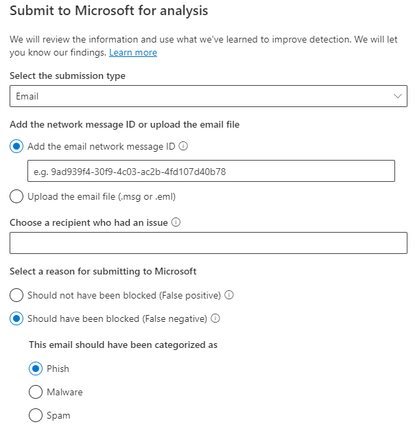

# Usar o Envio do Administrador para enviar spam, phishing, URLs e arquivos à MicrosoftUse Admin Submission to submit suspected spam, phish, URLs, and files to Microsoft

[!INCLUDE [Microsoft 365 Defender rebranding](../includes/microsoft-defender-for-office.md)]

**Aplica-se a****Applies to**
- [Proteção do Exchange OnlineExchange Online Protection](exchange-online-protection-overview.md)
- [Plano 1 e plano 2 do Microsoft Defender para Office 365Microsoft Defender for Office 365 plan 1 and plan 2](defender-for-office-365.md)

Em Microsoft 365 organizações com caixas de correio Exchange Online, os administradores podem usar o portal Envios no portal Microsoft 365 Defender para enviar mensagens de email, URLs e anexos à Microsoft para verificação.In Microsoft 365 organizations with Exchange Online mailboxes, admins can use the Submissions portal in the Microsoft 365 Defender portal to submit email messages, URLs, and attachments to Microsoft for scanning.

Ao enviar uma mensagem de email, você receberá:When you submit an email message, you will get:

- **Verificação de autenticação de** email : Detalhes sobre se a autenticação de email passou ou falhou quando ela foi entregue.**Email authentication check**: Details on whether email authentication passed or failed when it was delivered.
- **Visitas de política**: informações sobre quaisquer políticas que possam ter permitido ou bloqueado o email de entrada em seu locatário, substituindo nossos vereditos de filtro de serviço.**Policy hits**: Information about any policies that may have allowed or blocked the incoming email into your tenant, overriding our service filter verdicts.
- **Reputação/detonação** de carga : Exame de quaisquer URLs e anexos na mensagem.**Payload reputation/detonation**: Examination of any URLs and attachments in the message.
- **Análise de notas**: Revisão feita por alunos de nível humano para confirmar se as mensagens são mal-intencionadas ou não.**Grader analysis**: Review done by human graders in order to confirm whether or not messages are malicious.

> [!IMPORTANT]
> A análise de reputação/detonação e classificação de carga não é feita em todos os locatários.Payload reputation/detonation and grader analysis are not done in all tenants. As informações são impedidas de sair da organização quando os dados não devem sair do limite do locatário para fins de conformidade.Information is blocked from going outside the organization when data is not supposed to leave the tenant boundary for compliance purposes.

Para outras maneiras de enviar mensagens de email, URLs e anexos à Microsoft, consulte [Report messages and files to Microsoft](report-junk-email-messages-to-microsoft.md).For other ways to submit email messages, URLs, and attachments to Microsoft, see [Report messages and files to Microsoft](report-junk-email-messages-to-microsoft.md).

## Do que você precisa saber para começar?What do you need to know before you begin?

- Abra o portal do Microsoft 365 Defender em <https://security.microsoft.com/>.You open the Microsoft 365 Defender portal at <https://security.microsoft.com/>. Para ir diretamente para a página **Envios,** use <https://security.microsoft.com/reportsubmission> .To go directly to the **Submissions** page, use <https://security.microsoft.com/reportsubmission>.

- Para enviar mensagens e arquivos para a Microsoft, você precisa ser membro de um dos seguintes grupos de função:To submit messages and files to Microsoft, you need to be a member of one of the following role groups:
  - **Gerenciamento da** organização **ou leitor de** segurança no portal Microsoft 365 Defender [.](permissions-microsoft-365-security-center.md)**Organization Management** or **Security Reader** in the [Microsoft 365 Defender portal](permissions-microsoft-365-security-center.md).
  
    Observe que a associação neste grupo de funções é necessária para Exibir [envios](#view-user-submissions-to-microsoft) de usuário para a caixa de correio personalizada conforme descrito posteriormente neste artigo.Note that membership in this role group is required to [View user submissions to the custom mailbox](#view-user-submissions-to-microsoft) as described later in this article.

- Para obter mais informações sobre como os usuários podem enviar mensagens e arquivos para a Microsoft, consulte [Report messages and files to Microsoft](report-junk-email-messages-to-microsoft.md).For more information about how users can submit messages and files to Microsoft, see [Report messages and files to Microsoft](report-junk-email-messages-to-microsoft.md).

## Relatar conteúdo suspeito à MicrosoftReport suspicious content to Microsoft

1. No portal Microsoft 365 Defender, acesse **Email & envios de** \> **colaboração.**In the Microsoft 365 Defender portal, go to **Email & collaboration** \> **Submissions**.

2. Na página **Envios,** verifique se a guia **Enviado** para análise está selecionada e clique em Ícone de ad Enviar para  **análise**.On the **Submissions** page, verify that the **Submitted for analysis** tab is selected, and then click  **Submit to Microsoft for analysis**.

3. Use o sub-sub-texto Enviar para **a Microsoft** para revisão que parece enviar a mensagem, a URL ou o anexo de email, conforme descrito nas seções a seguir.Use the **Submit to Microsoft for review** flyout that appears to submit the message, URL, or email attachment as described in the following sections.

### Enviar um email questionável à MicrosoftSubmit a questionable email to Microsoft

1. Na caixa **Selecionar o tipo de** envio, verifique se **Email** está selecionado na lista lista listada.In the **Select the submission type** box, verify that **Email** is selected in the drop down list.

2. Na seção **Adicionar a ID da** mensagem de rede ou carregar o arquivo de email, use uma das seguintes opções:In the **Add the network message ID or upload the email file** section, use one of the following options:
   - Adicionar a **ID** da mensagem de rede de email : Este é um valor GUID que está disponível no header **X-MS-Exchange-Organization-Network-Message-Id** na mensagem ou no **header X-MS-Office365-Filtering-Correlation-Id** em mensagens em quarentena.**Add the email network message ID**: This is a GUID value that's available in the **X-MS-Exchange-Organization-Network-Message-Id** header in the message or in the **X-MS-Office365-Filtering-Correlation-Id** header in quarantined messages.
   - **Upload arquivo de email (.msg ou .eml)**: Clique em **Procurar arquivos**.**Upload the email file (.msg or .eml)**: Click **Browse files**. Na caixa de diálogo que é aberta, encontre e selecione o arquivo .eml ou .msg e clique em **Abrir**.In the dialog that opens, find and select the .eml or .msg file, and then click **Open**.

   > [!NOTE]
   > A capacidade de enviar mensagens com até 30 dias foi temporariamente suspensa para o Defender Office 365 clientes.The ability to submit messages as old as 30 days has been temporarily suspended for Defender for Office 365 customers. Os administradores só poderão voltar 7 dias.Admins will only be able to go back 7 days.

3. Na caixa **Escolher um destinatário que tinha um** problema, especifique o destinatário com o qual você gostaria de executar uma verificação de política.In the **Choose a recipient who had an issue** box, specify the recipient that you would like to run a policy check against. A verificação de política determinará se o email foi ignorado devido a políticas de usuário ou organização.The policy check will determine if the email bypassed scanning due to user or organization policies.

4. Na seção **Selecionar um motivo para enviar à Microsoft,** selecione uma das seguintes opções:In the **Select a reason for submitting to Microsoft** section, select one of the following options:
   - **Não deve ter sido bloqueado (falso positivo)****Should not have been blocked (false positive)**
   - **Deve ter sido** bloqueado : Na seção O email deve ter sido **categorizado** como exibido, selecione um dos seguintes valores (se você não tiver certeza, use seu melhor julgamento):**Should have been blocked**: In the **The email should have been categorized as** section that appears, select one of the following values (if you're not sure, use your best judgement):
     - **Golpe****Phish**
     - **Spam****Spam**
     - **Malware****Malware**

5. Quando terminar, clique no **botão Enviar.**When you're finished, click the **Submit** button.

> [!div class="mx-imgBorder"]
> 

### Enviar uma URL suspeita para a MicrosoftSend a suspect URL to Microsoft

1. Na caixa **Selecionar o tipo de** envio, selecione **URL** na lista lista listada.In the **Select the submission type** box, select **URL** from the drop down list.

2. Na caixa **URL** exibida, insira a URL completa (por exemplo, `https://www.fabrikam.com/marketing.html` ).In the **URL** box that appears, enter the full URL (for example, `https://www.fabrikam.com/marketing.html`).

3. Na seção **Selecionar um motivo para enviar à Microsoft,** selecione uma das seguintes opções:In the **Select a reason for submitting to Microsoft** section, select one of the following options:
   - **Não deve ter sido bloqueado (falso positivo)****Should not have been blocked (false positive)**
   - **Deve ter sido bloqueado**: Na seção Essa URL deve ter sido **categorizada** como exibida, selecione **Phish** ou **Malware**.**Should have been blocked**: In the **This URL should have been categorized as** section that appears, select **Phish** or **Malware**.

4. Quando terminar, clique no **botão Enviar.**When you're finished, click the **Submit** button.

> [!div class="mx-imgBorder"]
> 

### Enviar um anexo de email suspeito à MicrosoftSubmit a suspected email attachment to Microsoft

1. Na caixa **Selecionar o tipo de** envio, selecione **Arquivo** na lista lista listada.In the **Select the submission type** box, select **File** from the drop down list.

2. Na seção **Arquivo** que aparece, clique em **Procurar arquivos**.In the **File** section that appears, click **Browse files**. Na caixa de diálogo que é aberta, encontre e selecione o arquivo e clique em **Abrir**.In the dialog that opens, find and select the file, and then click **Open**.

3. Na seção **Selecionar um motivo para enviar à Microsoft,** selecione uma das seguintes opções:In the **Select a reason for submitting to Microsoft** section, select one of the following options:
   - **Não deve ter sido bloqueado (falso positivo)****Should not have been blocked (false positive)**
   - **Deve ter sido bloqueado**: Na seção Essa URL deve ter sido **categorizada** como exibida, **Malware** é a única opção e é selecionado automaticamente.**Should have been blocked**: In the **This URL should have been categorized as** section that appears, **Malware** is the only choice, and is automatically selected.

4. Quando terminar, clique no **botão Enviar.**When you're finished, click the **Submit** button.

> [!div class="mx-imgBorder"]
> 

## Exibir envios de administrador para a MicrosoftView admin submissions to Microsoft

1. No portal Microsoft 365 Defender, acesse **Email & envios de** \> **colaboração.**In the Microsoft 365 Defender portal, go to **Email & collaboration** \> **Submissions**.

2. Na página **Envios,** verifique se a **guia Enviado para** análise está selecionada.On the **Submissions** page, verify that the **Submitted for analysis** tab is selected.

   - Você pode classificar as entradas clicando em um header de coluna disponível.You can sort the entries by clicking on an available column header. Clique **em Personalizar colunas** para mostrar no máximo sete colunas.Click **Customize columns** to show a maximum of seven columns. Os valores padrão são marcados com um asterisco (\*):The default values are marked with an asterisk (\*):
     - **Nome do envio**\***Submission name**\*
     - **Remetente**\***Sender**\*
     - **Data enviada**\***Date submitted**\*
     - **Tipo de envio**\***Submission type**\*
     - **Motivo para o envio**\***Reason for submitting**\*
     - **Status da varredura novamente**\***Rescan status**\*
     - **Rescan result**\***Rescan result**\*
     - **Veredito de filtro****Filter verdict**
     - **Motivo de entrega/bloqueio****Delivery/Block reason**
     - **ID do envio****Submission ID**
     - **ID de mensagem de rede/ID do objeto****Network Message ID/Object ID**
     - **Direction****Direction**
     - **IP do remetente****Sender IP**
     - **Nível compatível com massa (BCL)****Bulk compliant level (BCL)**
     - **Destino****Destination**
     - **Ação de política****Policy action**
     - **Enviado por****Submitted by**

     Quando terminar, clique em **Aplicar**.When you're finished, click **Apply**.

   - Para filtrar as entradas, clique em **Filtrar**.To filter the entries, click **Filter**. Os filtros disponíveis são:The available filters are:
     - **Data enviada**: **Data de início** e data de **término.****Date submitted**: **Start date** and **End date**.
     - **Tipo de envio**: **Email,** **URL** ou **Arquivo.****Submission type**: **Email**, **URL**, or **File**.
     - **ID do envio:** um valor GUID atribuído a cada envio.**Submission ID**: A GUID value that's assigned to every submission.
     - **ID da mensagem de rede****Network Message ID**
     - **Sender****Sender**

     Quando terminar, clique em **Aplicar**.When you're finished, click **Apply**.

     > [!div class="mx-imgBorder"]
     > 

   - Para agrupar as entradas, clique em **Grupo** e selecione um dos seguintes valores na listada:To group the entries, click **Group** and select one of the following values from the drop down list:
     - **Nenhum****None**
     - **Tipo****Type**
     - **Motivo****Reason**
     - **Status****Status**
     - **Rescan result****Rescan result**

   - Para exportar as entradas, clique em **Exportar**.To export the entries, click **Export**. Na caixa de diálogo exibida, salve o arquivo .csv arquivo.In the dialog that appears, save the .csv file.

### Detalhes da verificação de envio de administradorAdmin submission rescan details

As mensagens enviadas em envios de administrador são revisadas e os resultados mostrados no submenu de detalhes de envios:Messages that are submitted in admin submissions are reviewed and results shown in the submissions detail flyout:

- Se houve falha na autenticação do email do remetente no momento da entrega.If there was a failure in the sender's email authentication at the time of delivery.
- Informações sobre quaisquer acessos à política que possam ter afetado ou substituído o veredicto de uma mensagem.Information about any policy hits that could have affected or overridden the verdict of a message.
- Resultados de detonação atuais para ver se os URLs ou arquivos contidos na mensagem eram maliciosos ou não.Current detonation results to see if the URLs or files contained in the message were malicious or not.
- Comentários dos alunos.Feedback from graders.

Se uma substituição for encontrada, a nova varredura deve ser concluída em alguns minutos.If an override was found, the rescan should complete in several minutes. Se não houve um problema na autenticação ou na entrega de email não foi afetado por uma substituição, os comentários dos alunos podem levar até um dia.If there wasn't a problem in email authentication or delivery wasn't affected by an override, then the feedback from graders could take up to a day.

## Exibir envios de usuários para a MicrosoftView user submissions to Microsoft

Se você tiver implantado o complemento Mensagem de [Relatório,](enable-the-report-message-add-in.md)o [add-in](enable-the-report-phish-add-in.md)Relatório phishing ou as pessoas usarem o relatório  integrado no [Outlook na Web](report-junk-email-and-phishing-scams-in-outlook-on-the-web-eop.md), você poderá ver o que os usuários estão relatando na guia Mensagem relatada pelo usuário.If you've deployed the [Report Message add-in](enable-the-report-message-add-in.md), the [Report Phishing add-in](enable-the-report-phish-add-in.md), or people use the [built-in reporting in Outlook on the web](report-junk-email-and-phishing-scams-in-outlook-on-the-web-eop.md), you can see what users are reporting on the **User reported message** tab.

1. No portal Microsoft 365 Defender, acesse **Email & envios de** \> **colaboração.**In the Microsoft 365 Defender portal, go to **Email & collaboration** \> **Submissions**.

2. Na página **Envios,** selecione a **guia Mensagens relatadas pelo** usuário.On the **Submissions** page, select the **User reported messages** tab.

   - Você pode classificar as entradas clicando em um header de coluna disponível.You can sort the entries by clicking on an available column header. Clique **em Personalizar colunas** para mostrar no máximo sete colunas.Click **Customize columns** to show a maximum of seven columns. Os valores padrão são marcados com um asterisco (\*):The default values are marked with an asterisk (\*):

     - **Assunto de email**\***Email subject**\*
     - **Relatado por**\***Reported by**\*
     - **Data relatada**\***Date reported**\*
     - **Remetente**\***Sender**\*
     - **Motivo relatado**\***Reported reason**\*
     - **Rescan result**\***Rescan result**\*
     - **ID da mensagem relatada****Message reported ID**
     - **ID da mensagem de rede****Network Message ID**
     - **IP do remetente****Sender IP**
     - **Simulação de phishing****Phish simulation**

     Quando terminar, clique em **Aplicar**.When you're finished, click **Apply**.

   - Para filtrar as entradas, clique em **Filtrar**.To filter the entries, click **Filter**. Os filtros disponíveis são:The available filters are:
     - **Data relatada**: **Data de início** e data de **término.****Date reported**: **Start date** and **End date**.
     - **Relatado por****Reported by**
     - **Assunto do email****Email subject**
     - **ID da mensagem relatada****Message reported ID**
     - **ID da mensagem de rede****Network Message ID**
     - **Sender****Sender**
     - **Motivo relatado:** **não lixo eletrônico,** **phishing** ou **spam.****Reported reason**: **Not junk**, **Phish**, or **Spam**.
     - **Simulação de phishing**: **Sim** ou **Não****Phish simulation**: **Yes** or **No**

     Quando terminar, clique em **Aplicar**.When you're finished, click **Apply**.

     > [!div class="mx-imgBorder"]
     > 

   - Para agrupar as entradas, clique em **Grupo** e selecione um dos seguintes valores na listada:To group the entries, click **Group** and select one of the following values from the drop down list:
     - **Nenhum****None**
     - **Motivo****Reason**
     - **Sender****Sender**
     - **Relatado por****Reported by**
     - **Rescan result****Rescan result**
     - **Simulação de phishing****Phish simulation**

   - Para exportar as entradas, clique em **Exportar**.To export the entries, click **Export**. Na caixa de diálogo exibida, salve o arquivo .csv arquivo.In the dialog that appears, save the .csv file.

> [!NOTE]
> Se as organizações estão configuradas para enviar mensagens relatadas pelo usuário apenas para  a caixa de correio personalizada, as mensagens relatadas não serão enviadas para análise novamente e os resultados nas mensagens relatadas pelo usuário sempre estarão vazios.If organizations are configured to send user reported messages to the custom mailbox only, reported messages will not be sent for rescan and the results in **User reported messages** will always be empty.

### Desfazer envios de usuárioUndo user submissions

Depois que um usuário envia um email suspeito para a caixa de correio personalizada, o usuário e o administrador não têm uma opção para desfazer o envio.Once a user submits a suspicious email to the custom mailbox, the user and admin don't have an option to undo the submission. Se o usuário quiser recuperar o email, ele estará disponível para recuperação nas pastas Itens Excluídos ou Lixo Eletrônico.If the user would like to recover the email, it will be available for recovery in the Deleted Items or Junk Email folders.

### Enviar mensagens para a Microsoft da caixa de correio personalizadaSubmit messages to Microsoft from the custom mailbox

Se você configurou a caixa de correio personalizada para interceptar mensagens relatadas pelo usuário sem enviar as mensagens para a Microsoft, você poderá encontrar e enviar mensagens específicas para a Microsoft para análise.If you've configured the custom mailbox to intercept user-reported messages without sending the messages to Microsoft, you can find and send specific messages to Microsoft for analysis. Isso move efetivamente um envio de usuário para um envio de administrador.This effectively moves a user submission to an admin submission.

Na guia **Mensagens relatadas pelo** usuário, selecione uma mensagem na lista, clique em Enviar para a **Microsoft** para análise e selecione um dos seguintes valores na listada:On the **User reported messages** tab, select a message in the list, click **Submit to Microsoft for analysis**, and then select one of the following values from the drop down list:

- **Relatório limpo****Report clean**
- **Relatar phishing****Report phishing**
- **Relatar malware****Report malware**
- **Relatar spam****Report spam**
- **Investigação de gatilho****Trigger investigation**

> [!div class="mx-imgBorder"]
> 
