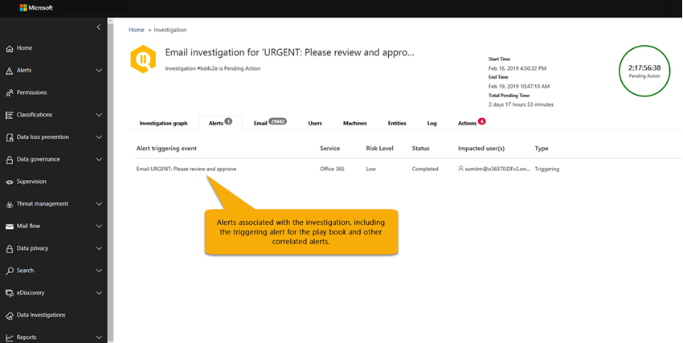

# Detalhes e resultados de uma investigação automatizada no Microsoft 365Details and results of an automated investigation in Microsoft 365

Quando uma [investigação automatizada](office-365-air.md) ocorre na [proteção avançada contra ameaças do Office 365](office-365-atp.md), os detalhes sobre essa investigação estão disponíveis durante e após o processo de investigação automatizado.When an [automated investigation](office-365-air.md) occurs in [Office 365 Advanced Threat Protection](office-365-atp.md), details about that investigation are available during and after the automated investigation process. Se você tiver as permissões necessárias, poderá exibir esses detalhes na exibição de detalhes da investigação.If you have the necessary permissions, you can view those details in an investigation details view. A exibição de detalhes da investigação fornece o status atualizado e a capacidade de aprovar as ações pendentes.The investigation details view provides you with up-to-date status and the ability to approve any pending actions.

## Status de investigaçãoInvestigation status

O status de investigação indica o progresso das análises e ações.The investigation status indicates the progress of the analysis and actions. À medida que a investigação é executada, o status é alterado para indicar se as ameaças foram encontradas e se as ações foram aprovadas.As the investigation runs, status changes to indicate whether threats were found, and whether actions have been approved.

****

|StatusStatus|O que significaWhat it means|
|---|---|
|IniciandoStarting| A investigação foi disparada e está aguardando para começar a executar.The investigation has been triggered and waiting to start running.|
|Em execuçãoRunning| O processo de investigação foi iniciado e está em andamento.The investigation process has started and is underway. Esse estado também ocorre quando [ações pendentes](https://docs.microsoft.com/microsoft-365/security/office-365-security/air-review-approve-pending-completed-actions#approve-or-reject-pending-actions) são aprovadas.This state also occurs when [pending actions](https://docs.microsoft.com/microsoft-365/security/office-365-security/air-review-approve-pending-completed-actions#approve-or-reject-pending-actions) are approved.|
|Nenhuma ameaça encontradaNo Threats Found| A investigação terminou e nenhuma ameaça (conta de usuário, mensagem de email, URL ou arquivo) foi identificada.The investigation has finished and no threats (user account, email message, URL, or file) were identified.   **Dica**: se você suspeita de que algo foi perdido (como falso negativo), você pode tomar medidas usando o [Explorador de ameaças](https://docs.microsoft.com/microsoft-365/security/office-365-security/threat-explorer).**TIP**: If you suspect something was missed (such as a false negative), you can take action using [Threat Explorer](https://docs.microsoft.com/microsoft-365/security/office-365-security/threat-explorer).|
|Ameaça EncontradaThreats Found|A investigação automatizada encontrou problemas, mas não há nenhuma ação de correção específica para resolver esses problemas.The automated investigation found issues, but there are no specific remediation actions to resolve those issues.   O status de ameaças encontradas pode ocorrer quando algum tipo de atividade de usuário foi identificada, mas nenhuma ação de limpeza está disponível.The Threats Found status can occur when some type of user activity was identified but no cleanup actions are available. Os exemplos incluem qualquer uma das atividades de usuário a seguir:Examples include any of the following user activities:  – Evento de [prevenção de perda de dados](https://docs.microsoft.com/Microsoft-365/compliance/data-loss-prevention-policies) (DLP)- A [data loss prevention](https://docs.microsoft.com/Microsoft-365/compliance/data-loss-prevention-policies) (DLP) event  -Um email enviando anomalias- An email sending anomaly  -Malware enviado- Sent malware  – Phishing enviado- Sent phish A investigação não encontrou URLs maliciosas, arquivos ou mensagens de email a serem corrigidas, e nenhuma atividade de caixa de correio para correção, como desativar regras de encaminhamento ou delegação.The investigation found no malicious URLs, files, or email messages to remediate, and no mailbox activity to fix, such as turning off forwarding rules or delegation.   **Dica**: se você suspeita de que algo foi perdido (como falso negativo), é possível investigar e tomar medidas usando o [Explorador de ameaças](https://docs.microsoft.com/microsoft-365/security/office-365-security/threat-explorer).**TIP**: If you suspect something was missed (such as a false negative), you can investigate and take action using [Threat Explorer](https://docs.microsoft.com/microsoft-365/security/office-365-security/threat-explorer).|
|Encerrado pelo sistemaTerminated By System| A investigação parou.The investigation stopped. Uma investigação pode ser interrompida por vários motivos:An investigation can stop for several reasons: – As ações pendentes da investigação expiraram.- The investigation's pending actions expired. Ações pendentes expiraram após esperar a aprovação por uma semana.Pending actions time out after awaiting approval for one week.  -Há muitas ações.- There are too many actions. Por exemplo, se houver muitos usuários clicando em URLs mal-intencionadas, ele poderá exceder a capacidade de investigação de executar todos os analisadores, portanto, a investigação será interrompida.For example, if there are too many users clicking on malicious URLs, it can exceed the investigation's ability to run all the analyzers, so the investigation halts.   **Dica**: se uma investigação for interrompida antes da tomada de ações, tente usar o [Gerenciador de ameaças](https://docs.microsoft.com/microsoft-365/security/office-365-security/threat-explorer) para encontrar e resolver ameaças.**TIP**: If an investigation halts before actions were taken, try using [Threat Explorer](https://docs.microsoft.com/microsoft-365/security/office-365-security/threat-explorer) to find and address threats.|
|Ação PendentePending Action| A investigação encontrou uma ameaça, como um email mal-intencionado, uma URL maliciosa ou uma configuração de caixa de correio arriscada e uma ação para corrigir que a ameaça está aguardando [aprovação](https://docs.microsoft.com/microsoft-365/security/office-365-security/air-review-approve-pending-completed-actions).The investigation has found a threat, such as a malicious email, a malicious URL, or a risky mailbox setting, and an action to remediate that threat is awaiting [approval](https://docs.microsoft.com/microsoft-365/security/office-365-security/air-review-approve-pending-completed-actions).  O estado de ação pendente é disparado quando qualquer ameaça com uma ação correspondente é encontrada.The Pending Action state is triggered when any threat with a corresponding action is found. No entanto, a lista de ações pendentes pode aumentar à medida que uma investigação é executada.However, the list of pending actions can increase as an investigation runs. Verifique o [log de investigação](https://docs.microsoft.com/microsoft-365/security/office-365-security/air-view-investigation-results#playbook-log) para ver se outros itens ainda estão pendentes de conclusão.Check the [investigation log](https://docs.microsoft.com/microsoft-365/security/office-365-security/air-view-investigation-results#playbook-log) to see if other items are still pending completion.|
|RemediadoRemediated| A investigação terminou e todas as ações foram aprovadas (totalmente corrigidas).The investigation finished and all actions were approved (fully remediated).  **Observação**: as ações de correção aprovadas podem ter erros que impedem a tomada de ações.**NOTE**: Approved remediation actions can have errors that prevent the actions from being taken. Independentemente se as ações de correção foram concluídas com êxito, o status de investigação não é alterado.Regardless of whether remediation actions are successfully completed, the investigation status does not change. Verifique o [log de investigação](https://docs.microsoft.com/microsoft-365/security/office-365-security/air-view-investigation-results) para obter resultados detalhados.Check the [investigation log](https://docs.microsoft.com/microsoft-365/security/office-365-security/air-view-investigation-results) for detailed results.|
|Parcialmente corrigidoPartially Remediated| A investigação resultou em ações de correção, e algumas foram aprovadas e concluídas.The investigation resulted in remediation actions, and some were approved and completed. Outras ações ainda estão [pendentes](https://docs.microsoft.com/microsoft-365/security/office-365-security/air-review-approve-pending-completed-actions).Other actions are still [pending](https://docs.microsoft.com/microsoft-365/security/office-365-security/air-review-approve-pending-completed-actions).|
|FalhouFailed| Pelo menos um analisador de investigação teve um problema em que não foi possível concluir corretamente.At least one investigation analyzer ran into a problem where it could not complete properly.   **Observação**: se uma investigação falhar após a aprovação das ações de correção, as ações de correção ainda poderão ter sido bem-sucedida.**NOTE**: If an investigation fails after remediation actions were approved, the remediation actions might still have succeeded. Verifique o [log de investigação](https://docs.microsoft.com/microsoft-365/security/office-365-security/air-view-investigation-results) para obter resultados detalhados.Check the [investigation log](https://docs.microsoft.com/microsoft-365/security/office-365-security/air-view-investigation-results) for detailed results.|
|Em fila por limitaçãoQueued By Throttling| Uma investigação está sendo mantida em uma fila.An investigation is being held in a queue. Quando outras investigações forem concluídas, as investigações em fila começarão.When other investigations complete, queued investigations begin. A limitação ajuda a evitar um desempenho de serviço ruim.Throttling helps avoid poor service performance.   **Dica**: as ações pendentes podem limitar a quantidade de novas investigações que podem ser executadas.**TIP**: Pending actions can limit how many new investigations can run. Certifique-se de [aprovar (ou rejeitar) ações pendentes](https://docs.microsoft.com/microsoft-365/security/office-365-security/air-review-approve-pending-completed-actions#approve-or-reject-pending-actions).Make sure to [approve (or reject) pending actions](https://docs.microsoft.com/microsoft-365/security/office-365-security/air-review-approve-pending-completed-actions#approve-or-reject-pending-actions).|
|Terminada pela limitaçãoTerminated By Throttling| Se uma investigação for mantida na fila por muito tempo, ela será interrompida.If an investigation is held in the queue too long, it stops.   **Dica**: você pode [iniciar uma investigação do explorador de ameaças](https://docs.microsoft.com/microsoft-365/security/office-365-security/automated-investigation-response-office#example-a-security-administrator-triggers-an-investigation-from-threat-explorer).**TIP**: You can [start an investigation from Threat Explorer](https://docs.microsoft.com/microsoft-365/security/office-365-security/automated-investigation-response-office#example-a-security-administrator-triggers-an-investigation-from-threat-explorer).|
|

## Exibir detalhes de uma investigaçãoView details of an investigation

1. Vá para o centro de conformidade e segurança & ( [https://protection.office.com](https://protection.office.com) ) e entre.Go to the Security & Compliance Center ([https://protection.office.com](https://protection.office.com)) and sign in.

2. Siga um destes procedimentos:Do one of the following:

    - Vá para o painel de **Gerenciamento de ameaças**  >  **Dashboard**.Go to **Threat management** > **Dashboard**. Isso leva você para o [painel de segurança](security-dashboard.md).This takes you to the [Security Dashboard](security-dashboard.md). Os widgets do AIR aparecem na parte superior do [painel de segurança](security-dashboard.md).Your AIR widgets appear across the top of the [Security Dashboard](security-dashboard.md). Selecione um widget, como o **Resumo de investigações**.Select a widget, such as **Investigations summary**.

    - Vá para investigações de **Gerenciamento de ameaças**  >  **Investigations**.Go to **Threat management** > **Investigations**.

    Qualquer um dos métodos o leva a uma lista de investigações.Either method takes you to a list of investigations.

    

3. Na lista de investigações, selecione um item na coluna **ID** .In the list of investigations, select an item in the **ID** column. Isso abre a página detalhes da investigação, começando com o gráfico de investigação no modo de exibição.This opens investigation details page, starting with the investigation graph in view.

    

   Use as várias guias para saber mais sobre a investigação.Use the various tabs to learn more about the investigation.

## Exibir detalhes sobre um alerta relacionado a uma investigaçãoView details about an alert related to an investigation

Determinados tipos de alertas disparam investigação automatizada no Microsoft 365.Certain kinds of alerts trigger automated investigation in Microsoft 365. Para saber mais, confira [alertas](automated-investigation-response-office.md#alerts).To learn more, see [Alerts](automated-investigation-response-office.md#alerts). Use o procedimento a seguir para exibir detalhes sobre um alerta que está associado a uma investigação automatizada.Use the following procedure to view details about an alert that is associated with an automated investigation.

1. Vá para o centro de conformidade e segurança & ( [https://protection.office.com](https://protection.office.com) ) e entre.Go to the Security & Compliance Center ([https://protection.office.com](https://protection.office.com)) and sign in.

2. Vá para investigações de **Gerenciamento de ameaças**  >  **Investigations**.Go to **Threat management** > **Investigations**.

3. Na lista de investigações, selecione um item na coluna **ID** .In the list of investigations, select an item in the **ID** column.

4. Com detalhes de uma investigação aberta, selecione a guia **alertas** . Todos os alertas que dispararam a investigação estão listados aqui.With details of an investigation open, select the **Alerts** tab. Any alerts that triggered the investigation are listed here.

5. Selecione um item na lista.Select an item in the list. Um submenu abre, com detalhes sobre o alerta e links para informações adicionais e ações.A flyout opens, with details about the alert and links to additional information and actions.

6. Revise as informações no submenu e, dependendo do alerta específico, execute uma ação, como **resolver**, **suprimir**ou **notificar os usuários**.Review the information on the flyout, and, depending on the particular alert, take an action, such as **Resolve**, **Suppress**, or **Notify users**.

    - **Resolver** é equivalente a fechar um alerta**Resolve** is equivalent to closing an alert

    - **Supressão** faz com que uma política não acione alertas por um período de tempo especificado**Suppress** causes a policy to not trigger alerts for a specified period of time

    - **Notificar os usuários sobre** o início de um email com os endereços de email dos usuários já inseridos e permite que sua equipe de operações de segurança digite uma mensagem para esses usuários.**Notify users** starts an email with users' email addresses already entered, and enables your security operations team to type a message to those users. (Isso é semelhante ao envio de uma mensagem para destinatários usando o [Explorador de ameaças](threat-explorer.md).)(This is similar to sending a message to recipients using [Threat Explorer](threat-explorer.md).)

## Como usar as várias guiasHow to use the various tabs

As seções a seguir orientam você pelas várias guias da página investigações automatizadas e como você pode usar as informações.The following sections walk you through the various tabs on the automated investigations page and how you can use the information.

### Página de investigações automatizadasAutomated investigations page

A página de investigações automatizadas mostra as investigações da organização e seus Estados atuais.The automated investigations page shows your organization's investigations and their current states.

Você pode:You can:

- Navegue diretamente para uma investigação (selecione uma **ID de investigação**).Navigate directly to an investigation (select an **Investigation ID**).
- Aplicar filtros.Apply filters. Escolha um **tipo de investigação**, **intervalo de tempo**, **status**ou uma combinação desses.Choose from **Investigation Type**, **Time range**, **Status**, or a combination of these.
- Exporte os dados para um arquivo. csv.Export the data to a .csv file.

### Gráficos de investigaçãoInvestigation graph

Ao abrir uma investigação específica, você verá a página de gráfico de investigação.When you open a specific investigation, you see the investigation graph page. Esta página mostra todas as diferentes entidades: mensagens de email, usuários (e suas atividades) e dispositivos que foram investigados automaticamente como parte do alerta que foi acionado.This page shows all the different entities: email messages, users (and their activities), and devices that were automatically investigated as part of the alert that was triggered.

Você pode:You can:

- Obtenha uma visão geral da investigação atual.Get a visual overview of the current investigation.
- Exibir um resumo da duração da investigação.View a summary of the investigation duration.
- Selecione um nó na visualização para exibir detalhes desse nó.Select a node in the visualization to view details for that node.
- Selecione uma guia na parte superior para exibir os detalhes dessa guia.Select a tab across the top to view details for that tab.

### Investigação de alertaAlert investigation

Na guia **alertas** de uma investigação, você pode ver alertas relevantes para a investigação.On the **Alerts** tab for an investigation, you can see alerts relevant to the investigation. Os detalhes incluem o alerta que disparou a investigação e outros alertas correlacionados, como entrada arriscada, violações de [política de DLP](https://docs.microsoft.com/Microsoft-365/compliance/data-loss-prevention-policies) , etc., que são correlacionadas à investigação.Details include the alert that triggered the investigation and other correlated alerts, such as risky sign-in, [DLP policy](https://docs.microsoft.com/Microsoft-365/compliance/data-loss-prevention-policies) violations, etc., that are correlated to the investigation. A partir dessa página, um analista de segurança também pode exibir detalhes adicionais sobre alertas individuais.From this page, a security analyst can also view additional details on individual alerts.

Você pode:You can:

- Obtenha uma visão geral do alerta de acionamento atual e de todos os alertas associados.Get a visual overview of the current triggering alert and any associated alerts.
- Selecione um alerta na lista para abrir uma página de sobrevôo que mostre detalhes completos do alerta.Select an alert in the list to open a fly-out page that shows full alert details.

### Investigação de emailEmail investigation

Na guia **email** de uma investigação, você pode ver os emails originais e os clusters de emails semelhantes identificados como parte da investigação.On the **Email** tab for an investigation, you can see the original emails and the clusters of similar email identified as part of the investigation.

Dado o volume simples de email que os usuários de uma organização enviam e recebem, além da natureza de comunicação de email e ataques de vários usuários, o processo deGiven the sheer volume of email that users in an organization send and receive, plus the multi-user nature of email communications and attacks, the process of

- agrupar mensagens de email com base em atributos semelhantes de um cabeçalho de mensagem, corpo, URL e anexos;clustering email messages based on similar attributes from a message header, body, URL, and attachments;
- separar emails mal-intencionados do email em bom estado; eseparating malicious email from the good email; and
- executar ações em mensagens de email mal-intencionadastaking action on malicious email messages

pode levar muito tempo.can take significant time. Agora, o ar automatiza esse processo, poupando o tempo e esforço da equipe de segurança da sua organização.AIR now automates this process, saving your organization's security team time and effort.

Dois tipos diferentes de clusters de email podem ser identificados durante a etapa de análise de email: clusters de similaridade e clusters de indicador.Two different types of email clusters may be identified during the email analysis step: similarity clusters and indicator clusters.

- Os clusters de similaridade são mensagens de email identificadas pela busca de emails com atributos de remetente e conteúdo semelhantes.Similarity clusters are email messages identified by hunting for emails with similar sender and content attributes. Esses clusters são avaliados para conteúdo mal-intencionado com base nas descobertas de detecção originais.These clusters are evaluated for malicious content based on the original detection findings. Os clusters de emails que contêm detecções de email maliciosas suficientes são considerados mal-intencionados.Email clusters that contain enough malicious email detections are considered malicious.
- Os clusters de indicadores são mensagens de email identificadas por busca da mesma entidade de indicador (hash de arquivo ou URL) do email original.Indicator clusters are email messages that are identified by hunting for the same indicator entity (file hash or URL) from the original email. Quando a entidade de arquivo/URL original é identificada como mal-intencionada, o AIR aplica o indicador veredicto a todo o cluster de mensagens de email contendo essa entidade.When the original file/URL entity is identified as malicious, AIR applies the indicator verdict to the entire cluster of email messages containing that entity. Um arquivo identificado como malware significa que o cluster de mensagens de email que contém esse arquivo é tratado como mensagens de email de malware.A file identified as malware means that the cluster of email messages containing that file are treated as malware email messages.

O objetivo do clustering é procurar e encontrar outras mensagens de email relacionadas enviadas pelo mesmo remetente como parte de um ataque ou uma campanha.The goal of clustering is to hunt and find other related email messages that are sent by the same sender as part of an attack or a campaign.  Em alguns casos, os emails legítimos podem acionar uma investigação (por exemplo, um usuário relata um email de marketing).In some cases, legitimate email may trigger an investigation (for example, a user reports a marketing email).  Nesses cenários, o clustering de emails deve identificar que os clusters de emails não são mal-intencionados, quando isso o faz adequadamente, ele **não** indica uma ameaça nem recomenda a remoção de email.In these scenarios, the email clustering should identify that email clusters are not malicious – when it appropriately does so, it will **not** indicate a threat nor will it recommend email removal.

A guia **email** também mostra os itens de email relacionados à investigação, como os detalhes de email relatados pelo usuário, o email original relatado, a (s) mensagem (ns) de email zapped devido a malware/phishing, etc.The **Email** tab also shows email items related to the investigation, such as the user-reported email details, the original email reported, the email message(s) zapped due to malware/phish, etc.

A contagem de emails identificada na guia email representa atualmente a soma total de todas as mensagens de email exibidas na guia **email** . Como as mensagens de email estão presentes em vários clusters, a contagem total real de mensagens de email identificadas (e afetadas por ações de correção) é a contagem de mensagens de email exclusivas em todos os clusters e mensagens de email dos destinatários originais.The email count identified on the email tab currently represents the sum total of all email messages shown on the **Email** tab. Because email messages are present in multiple clusters, the actual total count of email messages identified (and affected by remediation actions) is the count of unique email messages present across all of the clusters and original recipients' email messages.

O Explorer e o AIR contam mensagens de email por destinatário, já que os locais de segurança verdicts, ações e entrega variam de acordo com cada destinatário.Both Explorer and AIR count email messages on a per recipient basis, since the security verdicts, actions, and delivery locations vary on a per recipient basis. Portanto, um email original enviado a três usuários conta como um total de três mensagens de email em vez de um email.Thus an original email sent to three users count as a total of three email messages instead of one email. Observação pode haver casos em que um email é contado duas ou mais vezes, uma vez que o email pode ter várias ações nela, pode haver várias cópias do email quando todas as ações ocorrerem.Note there may be cases where an email gets counted two or more times, since the email may have multiple actions on it and there may be multiple copies of the email once all actions occur. Por exemplo, um email de malware detectado na entrega pode resultar em um email bloqueado (em quarentena) e um email substituído (arquivo de ameaça substituído por um arquivo de aviso e, em seguida, entregue à caixa de correio do usuário).For example, a malware email that is detected at delivery may result in both a blocked (quarantined) email and a replaced email (threat file replaced with a warning file, then delivered to user's mailbox). Como há, literalmente, duas cópias do email no sistema, ambas podem ser contadas em contagens de cluster.Since there are literally two copies of the email in the system, both might be counted in cluster counts.

As contagens de email são calculadas no momento da investigação e algumas contagens são recalculadas quando você abre submenus de investigação (com base em uma consulta subjacente).Email counts are calculated at the time of the investigation and some counts are recalculated when you open investigation flyouts (based on an underlying query). As contagens de email mostradas para os clusters de email na guia email e o valor de quantidade de email mostrado no submenu de cluster são calculados no momento da investigação e não são alterados.The email counts shown for the email clusters on the email tab and the email quantity value shown on cluster flyout are calculated at the time of investigation and do not change. A contagem de email mostrada na parte inferior da guia email do submenu de cluster de emails e a contagem de mensagens de email exibidas no Explorer refletem mensagens de email recebidas após a análise inicial da investigação.The email count shown at the bottom of the email tab of the email cluster flyout and the count of email messages shown in Explorer reflect email messages received after the investigation's initial analysis. Portanto, um cluster de emails que mostra uma quantidade original de 10 mensagens de email mostraria uma lista de emails de 15 a cinco mensagens de email que chegam entre a fase de análise de investigação e quando o administrador revisa a investigação.Thus an email cluster that shows an original quantity of 10 email messages would show an email list total of 15 when five more email messages arrive between the investigation analysis phase and when the admin reviews the investigation.  Da mesma forma, investigações antigas podem começar a ter contagens maiores do que as consultas do Explorer, já que ATP P2 expira dados após 7 dias para tentativas e 30 dias para licenças pagas.Likewise old investigations may start having bigger counts than Explorer queries show, since ATP P2 expires data after 7 days for trials and 30 days for paid licenses.  Mostrar as contagens históricas e atuais de contagem em modos de exibição diferentes é feita para indicar o impacto do email no momento da investigação e o impacto atual até o momento em que a correção é executada.Showing both count historical and current counts in different views is done to indicate the email impact at the time of investigation and the current impact up until the time that remediation is run.

Por exemplo, considere o cenário a seguir.As an example, consider the following scenario. O primeiro cluster de três mensagens de email foi considerado como phishing.The first cluster of three email messages were deemed to be phish. Outro cluster de mensagens semelhantes com o mesmo IP e assunto foi encontrado e considerado mal-intencionado, pois alguns deles foram identificados como phishing durante a detecção inicial.Another cluster of similar messages with the same IP and subject was found and considered malicious, as some of them were identified as phish during initial detection.

Você pode:You can:
- Obtenha uma visão geral das ameaças e dos resultados de agrupamento atuais encontrados.Get a visual overview of the current clustering results and threats found.
- Clique em uma entidade de cluster ou uma lista de ameaças para abrir uma página de saída que mostra os detalhes completos do alerta.Click a cluster entity or a threat list to open a fly-out page that shows the full alert details.
- Investigue mais o cluster de emails clicando no link "abrir no Explorer" na parte superior da guia "detalhes do cluster de emails"Further investigate the email cluster by clicking the 'Open in Explorer' link at the top of the 'Email cluster details' tab

> [!NOTE]
> No contexto de email, você pode ver uma superfície de ameaça de anomalias de volume como parte da investigação.In the context of email, you may see a volume anomaly threat surface as part of the investigation. Uma anomalia de volume indica um pico em mensagens de email semelhantes em torno do tempo de evento de investigação em comparação aos prazos anteriores.A volume anomaly indicates a spike in similar email messages around the investigation event time compared to earlier timeframes. Esse pico no tráfego de email com características semelhantes (por exemplo, domínio de assunto e remetente, semelhança de corpo e IP de remetente) é típico do início de campanhas ou ataques de email.This spike in email traffic with similar characteristics (e.g. subject and sender domain, body similarity and sender IP) is typical of the start of email campaigns or attacks. No entanto, as campanhas de emails em massa, spam e legítimas normalmente compartilham essas características.However, bulk, spam, and legitimate email campaigns commonly share these characteristics. As anomalias de volume representam uma possível ameaça e, portanto, podem ser menos graves em comparação às ameaças de malware ou phishing identificadas usando mecanismos antivírus, acionamento ou reputação mal-intencionados.Volume anomalies represent a potential threat, and accordingly could be less severe compared to malware or phish threats that are identified using anti-virus engines, detonation or malicious reputation.

### Investigação de usuárioUser investigation

Na guia **usuários** , você pode ver todos os usuários identificados como parte da investigação.On the **Users** tab, you can see all the users identified as part of the investigation. As contas de usuário são exibidas na investigação quando há um evento ou indicação de que essas contas de usuário podem ser afetadas ou comprometidas.User accounts appear in the investigation when there is an event or indication that those user accounts might be affected or compromised.

Por exemplo, na imagem a seguir, o AIR identificou indicadores de comprometimento e anomalias com base em uma nova regra de caixa de entrada que foi criada.For example, in the following image, AIR has identified indicators of compromise and anomalies based on a new inbox rule that was created. Detalhes adicionais (evidência) da investigação estão disponíveis por meio de exibições detalhadas nesta guia. os indicadores de comprometimento e anomalias também podem incluir detecções de anomalias do [Microsoft Cloud app Security](https://docs.microsoft.com/cloud-app-security).Additional details (evidence) of the investigation are available through detailed views within this tab. Indicators of compromise and anomalies may also include anomaly detections from [Microsoft Cloud App Security](https://docs.microsoft.com/cloud-app-security).

Você pode:You can:
- Obtenha uma visão geral dos resultados do usuário identificados e dos riscos encontrados.Get a visual overview of identified user results and risks found.
- Selecione um usuário para abrir uma página de sobrevôo que mostre os detalhes completos do alerta.Select a user to open a fly-out page that shows the full alert details.

### Investigação de máquinaMachine investigation

Na guia **computadores** , você pode ver todas as máquinas identificadas como parte da investigação.On the **Machines** tab, you can see all the machines identified as part of the investigation.

Como parte de alguns guias estratégicos, o AIR correlaciona ameaças de email a dispositivos (por exemplo, malware zapped).As part of some playbooks, AIR correlates email threats to devices (e.g. Zapped malware). Por exemplo, uma investigação passa um hash de arquivo mal-intencionado no [Microsoft defender ATP](https://docs.microsoft.com/windows/security/threat-protection/microsoft-defender-atp/microsoft-defender-advanced-threat-protection
) para investigar.For example, an investigation passes a malicious file hash across to [Microsoft Defender ATP](https://docs.microsoft.com/windows/security/threat-protection/microsoft-defender-atp/microsoft-defender-advanced-threat-protection
) to investigate. Isso permite a investigação automatizada de máquinas relevantes para seus usuários, para ajudar a garantir que as ameaças sejam tratadas na nuvem e nos seus pontos de extremidade.This allows for automated investigation of relevant machines for your users, to help ensure that threats are addressed both in the cloud and across your endpoints.

Você pode:You can:

- Obtenha uma visão geral das máquinas e ameaças atuais encontradas.Get a visual overview of the current machines and threats found.
- Selecione uma máquina para abrir um modo de exibição que nas [investigações ATP do Microsoft](https://docs.microsoft.com/windows/security/threat-protection/microsoft-defender-atp/automated-investigations) defender relacionadas na central de segurança do Microsoft defender.Select a machine to open a view that into the related [Microsoft Defender ATP investigations](https://docs.microsoft.com/windows/security/threat-protection/microsoft-defender-atp/automated-investigations) in the Microsoft Defender Security Center.

### Investigação de entidadeEntity investigation

Na guia **entidades** , você pode ver as entidades identificadas e analisadas como parte da investigação.On the **Entities** tab, you can see the entities identified and analyzed as part of the investigation.

Aqui, você pode ver as entidades investigadas e os detalhes dos tipos de entidades, como mensagens de email, clusters, endereços IP, usuários e muito mais.Here, you can see the investigated entities and details of the types of entities, such as email messages, clusters, IP addresses, users, and more. Você também pode ver quantas entidades foram analisadas e as ameaças que foram associadas a cada uma delas.You can also see how many entities were analyzed, and the threats that were associated with each.

Você pode:You can:
- Obtenha uma visão geral das entidades e ameaças de investigação encontradas.Get a visual overview of the investigation entities and threats found.
- Selecione uma entidade para abrir uma página de sobrevôo que mostre os detalhes relacionados da entidade.Select an entity to open a fly-out page that shows the related entity details.

### Log do guia estratégicoPlaybook log

Na guia **log** , você pode ver todas as etapas do guia estratégico que ocorreram durante a investigação.On the **Log** tab, you can see all the playbook steps that have occurred during the investigation. O log captura um inventário completo de todas as análises e ações concluídas pelos recursos de investigação automática do Office 365 como parte do AIR.The log captures a complete inventory of all analyzers and actions completed by Office 365 auto-investigation capabilities as part of AIR. Ele fornece uma visão clara de todas as etapas executadas, incluindo a ação em si, uma descrição e a duração do real do início ao fim.It provides a clear view of all the steps taken, including the action itself, a description, and the duration of the actual from start to finish.

Você pode:You can:

- Obtenha uma visão geral das etapas do guia estratégico.Get see a visual overview of the playbook steps taken.
- Exportar os resultados para um arquivo CSV.Export the results to a CSV file.
- Filtrar o modo de exibição.Filter the view.

****

|AnalyzAnalyzer| DescriçãoDescription|
|---|---|
|Investigação de violações de DLPDLP violations investigation|Investigue todas as violações detectadas pela [prevenção de perda de dados](../../compliance/data-loss-prevention-policies.md) (DLP)Investigate any violations detected by [Data Loss Prevention](../../compliance/data-loss-prevention-policies.md) (DLP)|
|Extração de indicadores de emailEmail indicators extraction|Extrair indicadores do cabeçalho, do corpo e do conteúdo de uma mensagem de email para investigaçãoExtract indicators from the header, body, and content of an email message for investigation|
|Reputação de hash de arquivoFile Hash Reputation|Detectar anomalias com base nos hashes de arquivo para usuários e computadores em sua organizaçãoDetect anomalies based on file hashes for users and machines in your organization|
|Identificação de cluster de emailMail cluster identification|Análise do cluster de emails com base no cabeçalho, corpo, conteúdo e URLsEmail cluster analysis based on header, body, content, and URLs|
|Análise de volume de cluster de emailMail cluster volume analysis|Análise de cluster de email com base em padrões de volume de fluxo de emails de saídaEmail cluster analysis based on outbound mail flow volume patterns|
|Investigação de delegação de emailMail delegation investigation|Investigar o acesso de delegação de email para caixas de correio de usuário relacionadas a essa investigaçãoInvestigate mail delegation access for user mailboxes related to this investigation|
|Investigação de regras de encaminhamento de emailMail forwarding rules investigation|Investigue qualquer regra de encaminhamento de email para caixas de correio do usuário relacionadas a esta investigaçãoInvestigate any mail forwarding rules for user mailboxes related to this investigation|
|Malware perdido detectadoMissed malware detected|Detectar o malware perdido para a caixa de correio do usuário em sua organizaçãoDetect missed malware delivered to user's mailbox in your organization|
|Acionamento sob demandaOn-demand detonation|Acionamento sob demanda disparado para mensagens de email, anexos e URLsOn-demand detonation triggered for email messages, attachments, and URLs|
|Investigação de anomalia de email de saídaOutbound mail anomaly investigation|Detectar anomalias com base em fluxo de emails históricos enviando padrões para usuários em sua organizaçãoDetect anomalies based on historical mail flow sending patterns for users in your organization|
|Investigação anormal de malware e spam de saídaOutbound malware and spam anomaly investigation|Detectar malware, phishing ou spam da organização e de saída provenientes de usuários em sua organizaçãoDetect intra-org and outbound malware, phish, or spam originating from users in your organization|
|Investigação de domínio do remetenteSender domain investigation|Verificação sob demanda da reputação do domínio do [gráfico de segurança inteligente da Microsoft](https://www.microsoft.com/security/operations/intelligence) e de fontes de inteligência de ameaças externasOn-demand check of domain reputation from the [Microsoft Intelligent Security Graph](https://www.microsoft.com/security/operations/intelligence) and external threat intelligence sources|
|Investigação de IP do remetenteSender IP investigation| Verificação por demanda da reputação de IP do [gráfico de segurança inteligente da Microsoft](https://www.microsoft.com/security/operations/intelligence) e de fontes de inteligência de ameaças externasOn-demand check of IP reputation from the [Microsoft Intelligent Security Graph](https://www.microsoft.com/security/operations/intelligence) and external threat intelligence sources|
|Investigação de cliques de URLURL clicks investigation| Investigar cliques de usuários protegidos por [links seguros de ATP do Office 365](atp-safe-links.md) em sua organizaçãoInvestigate clicks  from users protected by [Office 365 ATP Safe Links](atp-safe-links.md) in your organization|
|Investigação de reputação de URLURL reputation investigation|Verificação sob demanda na reputação da URL do [gráfico de segurança inteligente da Microsoft](https://www.microsoft.com/security/operations/intelligence) e de fontes de inteligência de ameaças externasOn-demand check on URL reputation from the [Microsoft Intelligent Security Graph](https://www.microsoft.com/security/operations/intelligence) and external threat intelligence sources|
|Investigação de atividades do usuárioUser activity investigation|Analisar anomalias de atividades do usuário no [Microsoft Cloud app Security](https://docs.microsoft.com/cloud-app-security/what-is-cloud-app-security)Analyze user activity anomalies in [Microsoft Cloud App Security](https://docs.microsoft.com/cloud-app-security/what-is-cloud-app-security)|
|Extração de indicadores de email relatados pelo usuárioUser-reported emails indicators extraction|Extrair indicadores do cabeçalho, do corpo e do conteúdo de [emails relatados pelo usuário](enable-the-report-message-add-in.md) para investigaçãoExtract indicators from the header, body, and content of [user-reported email](enable-the-report-message-add-in.md) for investigation|
|

### Ações recomendadasRecommended actions

Na guia **ações** , você pode ver todas as ações do guia estratégico que são recomendadas para correção após a conclusão da investigação.On the **Actions** tab, you can see all the playbook actions that are recommended for remediation after the investigation has completed.

As ações capturam as etapas que a Microsoft recomenda que você faça no final de uma investigação.Actions capture the steps Microsoft recommends you take at the end of an investigation. Você pode realizar ações de correção aqui selecionando uma ou mais ações.You can take remediation actions here by selecting one or more actions. Clicar em **aprovar** permite que a correção seja iniciada.Clicking **Approve** allows remediation to begin. (As permissões apropriadas são necessárias-a função de ' pesquisa e limpeza ' é necessária para executar ações do Explorer e do AIR).(Appropriate permissions are needed - the 'Search And Purge' role is required to run actions from Explorer and AIR). Por exemplo, um leitor de segurança pode exibir ações, mas não aprová-las.For example, a Security Reader can view actions but not approve them. Observação: não é necessário aprovar todas as ações.Note: You do not have to approve every action. Se você não concordar com a ação recomendada ou sua organização não escolher determinados tipos de ações, você poderá optar por **rejeitar** as ações ou simplesmente ignorá-las e não executar nenhuma ação.If you do not agree with the recommended action or your organization does not choose certain types of actions, then you can choose to **Reject** the actions or simply ignore them and take no action. Aprovar e/ou rejeitar todas as ações permite que a investigação seja totalmente fechada (o status é corrigido), enquanto deixa algumas ações incompletas resultam na alteração do status de investigação para um estado parcialmente corrigido.Approving and/or rejecting all actions lets the investigation fully close (status becomes remediated), while leaving some actions incomplete results in the investigation status changing to a partially remediated state.

Você pode:You can:

- Obtenha uma visão geral das ações recomendadas para o guia estratégico.Get a visual overview of the playbook-recommended actions.
- Selecione uma única ação ou várias ações.Select a single action or multiple actions.
- Aprovar ou rejeitar ações recomendadas com comentários.Approve or reject recommended actions with comments.
- Exportar os resultados para um arquivo CSV.Export the results to a CSV file.
- Filtrar o modo de exibição.Filter the view.

## Próximas etapasNext steps

- [Revisar e aprovar ações pendentesReview and approve pending actions](https://docs.microsoft.com/microsoft-365/security/office-365-security/air-review-approve-pending-completed-actions?view=o365-worldwide#approve-or-reject-pending-actions)

- [Saiba mais sobre a investigação e a resposta automatizadas no Microsoft Threat ProtectionLearn about automated investigation and response in Microsoft Threat Protection](https://docs.microsoft.com/microsoft-365/security/mtp/mtp-autoir)
