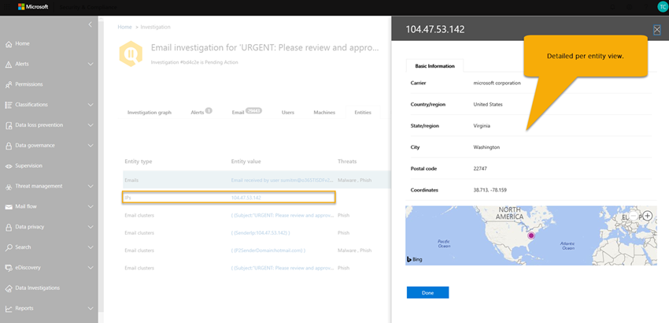

# Detalhes e resultados de uma investigação automatizada no Microsoft 365

[!INCLUDE [Microsoft 365 Defender rebranding](../includes/microsoft-defender-for-office.md)]

Quando uma [investigação automatizada](office-365-air.md) ocorre na [proteção avançada contra ameaças do Office 365](office-365-atp.md), os detalhes sobre essa investigação estão disponíveis durante e após o processo de investigação automatizado. Se você tiver as permissões necessárias, poderá exibir esses detalhes na exibição de detalhes da investigação. A exibição de detalhes da investigação fornece o status atualizado e a capacidade de aprovar as ações pendentes.

## Status de investigação

O status de investigação indica o progresso das análises e ações. À medida que a investigação é executada, o status é alterado para indicar se as ameaças foram encontradas e se as ações foram aprovadas.

****

|Status|O que significa|
|---|---|
|Iniciando| A investigação foi disparada e está aguardando para começar a executar.|
|Em execução| O processo de investigação foi iniciado e está em andamento. Esse estado também ocorre quando [ações pendentes](https://docs.microsoft.com/microsoft-365/security/office-365-security/air-review-approve-pending-completed-actions#approve-or-reject-pending-actions) são aprovadas.|
|Nenhuma ameaça encontrada| A investigação terminou e nenhuma ameaça (conta de usuário, mensagem de email, URL ou arquivo) foi identificada.   **Dica**: se você suspeita de que algo foi perdido (como falso negativo), você pode tomar medidas usando o [Explorador de ameaças](https://docs.microsoft.com/microsoft-365/security/office-365-security/threat-explorer).|
|Ameaça Encontrada|A investigação automatizada encontrou problemas, mas não há nenhuma ação de correção específica para resolver esses problemas.   O status de ameaças encontradas pode ocorrer quando algum tipo de atividade de usuário foi identificada, mas nenhuma ação de limpeza está disponível. Os exemplos incluem qualquer uma das atividades de usuário a seguir:  – Evento de [prevenção de perda de dados](https://docs.microsoft.com/Microsoft-365/compliance/data-loss-prevention-policies) (DLP)  -Um email enviando anomalias  -Malware enviado  – Phishing enviado A investigação não encontrou URLs maliciosas, arquivos ou mensagens de email a serem corrigidas, e nenhuma atividade de caixa de correio para correção, como desativar regras de encaminhamento ou delegação.   **Dica**: se você suspeita de que algo foi perdido (como falso negativo), é possível investigar e tomar medidas usando o [Explorador de ameaças](https://docs.microsoft.com/microsoft-365/security/office-365-security/threat-explorer).|
|Encerrado pelo sistema| A investigação parou. Uma investigação pode ser interrompida por vários motivos: – As ações pendentes da investigação expiraram. Ações pendentes expiraram após esperar a aprovação por uma semana.  -Há muitas ações. Por exemplo, se houver muitos usuários clicando em URLs mal-intencionadas, ele poderá exceder a capacidade de investigação de executar todos os analisadores, portanto, a investigação será interrompida.   **Dica**: se uma investigação for interrompida antes da tomada de ações, tente usar o [Gerenciador de ameaças](https://docs.microsoft.com/microsoft-365/security/office-365-security/threat-explorer) para encontrar e resolver ameaças.|
|Ação Pendente| A investigação encontrou uma ameaça, como um email mal-intencionado, uma URL maliciosa ou uma configuração de caixa de correio arriscada e uma ação para corrigir que a ameaça está aguardando [aprovação](https://docs.microsoft.com/microsoft-365/security/office-365-security/air-review-approve-pending-completed-actions).  O estado de ação pendente é disparado quando qualquer ameaça com uma ação correspondente é encontrada. No entanto, a lista de ações pendentes pode aumentar à medida que uma investigação é executada. Verifique o [log de investigação](https://docs.microsoft.com/microsoft-365/security/office-365-security/air-view-investigation-results#playbook-log) para ver se outros itens ainda estão pendentes de conclusão.|
|Remediado| A investigação terminou e todas as ações foram aprovadas (totalmente corrigidas).  **Observação**: as ações de correção aprovadas podem ter erros que impedem a tomada de ações. Independentemente se as ações de correção foram concluídas com êxito, o status de investigação não é alterado. Verifique o [log de investigação](https://docs.microsoft.com/microsoft-365/security/office-365-security/air-view-investigation-results) para obter resultados detalhados.|
|Parcialmente corrigido| A investigação resultou em ações de correção, e algumas foram aprovadas e concluídas. Outras ações ainda estão [pendentes](https://docs.microsoft.com/microsoft-365/security/office-365-security/air-review-approve-pending-completed-actions).|
|Falhou| Pelo menos um analisador de investigação teve um problema em que não foi possível concluir corretamente.   **Observação**: se uma investigação falhar após a aprovação das ações de correção, as ações de correção ainda poderão ter sido bem-sucedida. Verifique o [log de investigação](https://docs.microsoft.com/microsoft-365/security/office-365-security/air-view-investigation-results) para obter resultados detalhados.|
|Em fila por limitação| Uma investigação está sendo mantida em uma fila. Quando outras investigações forem concluídas, as investigações em fila começarão. A limitação ajuda a evitar um desempenho de serviço ruim.   **Dica**: as ações pendentes podem limitar a quantidade de novas investigações que podem ser executadas. Certifique-se de [aprovar (ou rejeitar) ações pendentes](https://docs.microsoft.com/microsoft-365/security/office-365-security/air-review-approve-pending-completed-actions#approve-or-reject-pending-actions).|
|Terminada pela limitação| Se uma investigação for mantida na fila por muito tempo, ela será interrompida.   **Dica**: você pode [iniciar uma investigação do explorador de ameaças](https://docs.microsoft.com/microsoft-365/security/office-365-security/automated-investigation-response-office#example-a-security-administrator-triggers-an-investigation-from-threat-explorer).|
|

## Exibir detalhes de uma investigação

1. Vá para o centro de conformidade e segurança & ( [https://protection.office.com](https://protection.office.com) ) e entre.

2. Siga um destes procedimentos:

    - Vá para o painel de **Gerenciamento de ameaças**  >  **Dashboard**. Isso leva você para o [painel de segurança](security-dashboard.md). Os widgets do AIR aparecem na parte superior do [painel de segurança](security-dashboard.md). Selecione um widget, como o **Resumo de investigações**.

    - Vá para investigações de **Gerenciamento de ameaças**  >  **Investigations**.

    Qualquer um dos métodos o leva a uma lista de investigações.

    

3. Na lista de investigações, selecione um item na coluna **ID** . Isso abre a página detalhes da investigação, começando com o gráfico de investigação no modo de exibição.

    

   Use as várias guias para saber mais sobre a investigação.

## Exibir detalhes sobre um alerta relacionado a uma investigação

Determinados tipos de alertas disparam investigação automatizada no Microsoft 365. Para saber mais, confira [alertas](automated-investigation-response-office.md#alerts). Use o procedimento a seguir para exibir detalhes sobre um alerta que está associado a uma investigação automatizada.

1. Vá para o centro de conformidade e segurança & ( [https://protection.office.com](https://protection.office.com) ) e entre.

2. Vá para investigações de **Gerenciamento de ameaças**  >  **Investigations**.

3. Na lista de investigações, selecione um item na coluna **ID** .

4. Com detalhes de uma investigação aberta, selecione a guia **alertas** . Todos os alertas que dispararam a investigação estão listados aqui.

5. Selecione um item na lista. Um submenu abre, com detalhes sobre o alerta e links para informações adicionais e ações.

6. Revise as informações no submenu e, dependendo do alerta específico, execute uma ação, como **resolver**, **suprimir**ou **notificar os usuários**.

    - **Resolver** é equivalente a fechar um alerta

    - **Supressão** faz com que uma política não acione alertas por um período de tempo especificado

    - **Notificar os usuários sobre** o início de um email com os endereços de email dos usuários já inseridos e permite que sua equipe de operações de segurança digite uma mensagem para esses usuários. (Isso é semelhante ao envio de uma mensagem para destinatários usando o [Explorador de ameaças](threat-explorer.md).)

## Como usar as várias guias

As seções a seguir orientam você pelas várias guias da página investigações automatizadas e como você pode usar as informações.

### Página de investigações automatizadas

A página de investigações automatizadas mostra as investigações da organização e seus Estados atuais.

Você pode:

- Navegue diretamente para uma investigação (selecione uma **ID de investigação**).
- Aplicar filtros. Escolha um **tipo de investigação**, **intervalo de tempo**, **status**ou uma combinação desses.
- Exporte os dados para um arquivo. csv.

### Gráficos de investigação

Ao abrir uma investigação específica, você verá a página de gráfico de investigação. Esta página mostra todas as diferentes entidades: mensagens de email, usuários (e suas atividades) e dispositivos que foram investigados automaticamente como parte do alerta que foi acionado.

Você pode:

- Obtenha uma visão geral da investigação atual.
- Exibir um resumo da duração da investigação.
- Selecione um nó na visualização para exibir detalhes desse nó.
- Selecione uma guia na parte superior para exibir os detalhes dessa guia.

### Investigação de alerta

Na guia **alertas** de uma investigação, você pode ver alertas relevantes para a investigação. Os detalhes incluem o alerta que disparou a investigação e outros alertas correlacionados, como entrada arriscada, violações de [política de DLP](https://docs.microsoft.com/Microsoft-365/compliance/data-loss-prevention-policies) , etc., que são correlacionadas à investigação. A partir dessa página, um analista de segurança também pode exibir detalhes adicionais sobre alertas individuais.

Você pode:

- Obtenha uma visão geral do alerta de acionamento atual e de todos os alertas associados.
- Selecione um alerta na lista para abrir uma página de sobrevôo que mostre detalhes completos do alerta.

### Investigação de email

Na guia **email** de uma investigação, você pode ver os emails originais e os clusters de emails semelhantes identificados como parte da investigação.

Dado o volume simples de email que os usuários de uma organização enviam e recebem, além da natureza de comunicação de email e ataques de vários usuários, o processo de

- agrupar mensagens de email com base em atributos semelhantes de um cabeçalho de mensagem, corpo, URL e anexos;
- separar emails mal-intencionados do email em bom estado; e
- executar ações em mensagens de email mal-intencionadas

pode levar muito tempo. Agora, o ar automatiza esse processo, poupando o tempo e esforço da equipe de segurança da sua organização.

Dois tipos diferentes de clusters de email podem ser identificados durante a etapa de análise de email: clusters de similaridade e clusters de indicador.

- Os clusters de similaridade são mensagens de email identificadas pela busca de emails com atributos de remetente e conteúdo semelhantes. Esses clusters são avaliados para conteúdo mal-intencionado com base nas descobertas de detecção originais. Os clusters de emails que contêm detecções de email maliciosas suficientes são considerados mal-intencionados.
- Os clusters de indicadores são mensagens de email identificadas por busca da mesma entidade de indicador (hash de arquivo ou URL) do email original. Quando a entidade de arquivo/URL original é identificada como mal-intencionada, o AIR aplica o indicador veredicto a todo o cluster de mensagens de email contendo essa entidade. Um arquivo identificado como malware significa que o cluster de mensagens de email que contém esse arquivo é tratado como mensagens de email de malware.

O objetivo do clustering é procurar e encontrar outras mensagens de email relacionadas enviadas pelo mesmo remetente como parte de um ataque ou uma campanha.  Em alguns casos, os emails legítimos podem acionar uma investigação (por exemplo, um usuário relata um email de marketing).  Nesses cenários, o clustering de emails deve identificar que os clusters de emails não são mal-intencionados, quando isso o faz adequadamente, ele **não** indica uma ameaça nem recomenda a remoção de email.

A guia **email** também mostra os itens de email relacionados à investigação, como os detalhes de email relatados pelo usuário, o email original relatado, a (s) mensagem (ns) de email zapped devido a malware/phishing, etc.

A contagem de emails identificada na guia email representa atualmente a soma total de todas as mensagens de email exibidas na guia **email** . Como as mensagens de email estão presentes em vários clusters, a contagem total real de mensagens de email identificadas (e afetadas por ações de correção) é a contagem de mensagens de email exclusivas em todos os clusters e mensagens de email dos destinatários originais.

O Explorer e o AIR contam mensagens de email por destinatário, já que os locais de segurança verdicts, ações e entrega variam de acordo com cada destinatário. Portanto, um email original enviado a três usuários conta como um total de três mensagens de email em vez de um email. Observação pode haver casos em que um email é contado duas ou mais vezes, uma vez que o email pode ter várias ações nela, pode haver várias cópias do email quando todas as ações ocorrerem. Por exemplo, um email de malware detectado na entrega pode resultar em um email bloqueado (em quarentena) e um email substituído (arquivo de ameaça substituído por um arquivo de aviso e, em seguida, entregue à caixa de correio do usuário). Como há, literalmente, duas cópias do email no sistema, ambas podem ser contadas em contagens de cluster.

As contagens de email são calculadas no momento da investigação e algumas contagens são recalculadas quando você abre submenus de investigação (com base em uma consulta subjacente). As contagens de email mostradas para os clusters de email na guia email e o valor de quantidade de email mostrado no submenu de cluster são calculados no momento da investigação e não são alterados. A contagem de email mostrada na parte inferior da guia email do submenu de cluster de emails e a contagem de mensagens de email exibidas no Explorer refletem mensagens de email recebidas após a análise inicial da investigação. Portanto, um cluster de emails que mostra uma quantidade original de 10 mensagens de email mostraria uma lista de emails de 15 a cinco mensagens de email que chegam entre a fase de análise de investigação e quando o administrador revisa a investigação.  Da mesma forma, investigações antigas podem começar a ter contagens maiores do que as consultas do Explorer, já que ATP P2 expira dados após 7 dias para tentativas e 30 dias para licenças pagas.  Mostrar as contagens históricas e atuais de contagem em modos de exibição diferentes é feita para indicar o impacto do email no momento da investigação e o impacto atual até o momento em que a correção é executada.

Por exemplo, considere o cenário a seguir. O primeiro cluster de três mensagens de email foi considerado como phishing. Outro cluster de mensagens semelhantes com o mesmo IP e assunto foi encontrado e considerado mal-intencionado, pois alguns deles foram identificados como phishing durante a detecção inicial.

Você pode:
- Obtenha uma visão geral das ameaças e dos resultados de agrupamento atuais encontrados.
- Clique em uma entidade de cluster ou uma lista de ameaças para abrir uma página de saída que mostra os detalhes completos do alerta.
- Investigue mais o cluster de emails clicando no link "abrir no Explorer" na parte superior da guia "detalhes do cluster de emails"

> [!NOTE]
> No contexto de email, você pode ver uma superfície de ameaça de anomalias de volume como parte da investigação. Uma anomalia de volume indica um pico em mensagens de email semelhantes em torno do tempo de evento de investigação em comparação aos prazos anteriores. Esse pico no tráfego de email com características semelhantes (por exemplo, domínio de assunto e remetente, semelhança de corpo e IP de remetente) é típico do início de campanhas ou ataques de email. No entanto, as campanhas de emails em massa, spam e legítimas normalmente compartilham essas características. As anomalias de volume representam uma possível ameaça e, portanto, podem ser menos graves em comparação às ameaças de malware ou phishing identificadas usando mecanismos antivírus, acionamento ou reputação mal-intencionados.

### Investigação de usuário

Na guia **usuários** , você pode ver todos os usuários identificados como parte da investigação. As contas de usuário são exibidas na investigação quando há um evento ou indicação de que essas contas de usuário podem ser afetadas ou comprometidas.

Por exemplo, na imagem a seguir, o AIR identificou indicadores de comprometimento e anomalias com base em uma nova regra de caixa de entrada que foi criada. Detalhes adicionais (evidência) da investigação estão disponíveis por meio de exibições detalhadas nesta guia. Indicadores de comprometimento e anomalias também podem incluir detecções de anomalias do [Microsoft Cloud app Security](https://docs.microsoft.com/cloud-app-security).

Você pode:
- Obtenha uma visão geral dos resultados do usuário identificados e dos riscos encontrados.
- Selecione um usuário para abrir uma página de sobrevôo que mostre os detalhes completos do alerta.

### Investigação de máquina

Na guia **computadores** , você pode ver todas as máquinas identificadas como parte da investigação.

Como parte de alguns guias estratégicos, o AIR correlaciona ameaças de email a dispositivos (por exemplo, malware zapped). Por exemplo, uma investigação passa um hash de arquivo mal-intencionado no [Microsoft defender ATP](https://docs.microsoft.com/windows/security/threat-protection/microsoft-defender-atp/microsoft-defender-advanced-threat-protection
) para investigar. Isso permite a investigação automatizada de máquinas relevantes para seus usuários, para ajudar a garantir que as ameaças sejam tratadas na nuvem e nos seus pontos de extremidade.

Você pode:

- Obtenha uma visão geral das máquinas e ameaças atuais encontradas.
- Selecione uma máquina para abrir um modo de exibição que nas [investigações ATP do Microsoft](https://docs.microsoft.com/windows/security/threat-protection/microsoft-defender-atp/automated-investigations) defender relacionadas na central de segurança do Microsoft defender.

### Investigação de entidade

Na guia **entidades** , você pode ver as entidades identificadas e analisadas como parte da investigação.

Aqui, você pode ver as entidades investigadas e os detalhes dos tipos de entidades, como mensagens de email, clusters, endereços IP, usuários e muito mais. Você também pode ver quantas entidades foram analisadas e as ameaças que foram associadas a cada uma delas.

Você pode:
- Obtenha uma visão geral das entidades e ameaças de investigação encontradas.
- Selecione uma entidade para abrir uma página de sobrevôo que mostre os detalhes relacionados da entidade.

### Log do guia estratégico

Na guia **log** , você pode ver todas as etapas do guia estratégico que ocorreram durante a investigação. O log captura um inventário completo de todas as análises e ações concluídas pelos recursos de investigação automática do Office 365 como parte do AIR. Ele fornece uma visão clara de todas as etapas executadas, incluindo a ação em si, uma descrição e a duração do real do início ao fim.

Você pode:

- Obtenha uma visão geral das etapas do guia estratégico.
- Exportar os resultados para um arquivo CSV.
- Filtrar o modo de exibição.

****

|Analyz| Descrição|
|---|---|
|Investigação de violações de DLP|Investigue todas as violações detectadas pela [prevenção de perda de dados](../../compliance/data-loss-prevention-policies.md) (DLP)|
|Extração de indicadores de email|Extrair indicadores do cabeçalho, do corpo e do conteúdo de uma mensagem de email para investigação|
|Reputação de hash de arquivo|Detectar anomalias com base nos hashes de arquivo para usuários e computadores em sua organização|
|Identificação de cluster de email|Análise do cluster de emails com base no cabeçalho, corpo, conteúdo e URLs|
|Análise de volume de cluster de email|Análise de cluster de email com base em padrões de volume de fluxo de emails de saída|
|Investigação de delegação de email|Investigar o acesso de delegação de email para caixas de correio de usuário relacionadas a essa investigação|
|Investigação de regras de encaminhamento de email|Investigue qualquer regra de encaminhamento de email para caixas de correio do usuário relacionadas a esta investigação|
|Malware perdido detectado|Detectar o malware perdido para a caixa de correio do usuário em sua organização|
|Acionamento sob demanda|Acionamento sob demanda disparado para mensagens de email, anexos e URLs|
|Investigação de anomalia de email de saída|Detectar anomalias com base em fluxo de emails históricos enviando padrões para usuários em sua organização|
|Investigação anormal de malware e spam de saída|Detectar malware, phishing ou spam da organização e de saída provenientes de usuários em sua organização|
|Investigação de domínio do remetente|Verificação sob demanda da reputação do domínio do [gráfico de segurança inteligente da Microsoft](https://www.microsoft.com/security/operations/intelligence) e de fontes de inteligência de ameaças externas|
|Investigação de IP do remetente| Verificação por demanda da reputação de IP do [gráfico de segurança inteligente da Microsoft](https://www.microsoft.com/security/operations/intelligence) e de fontes de inteligência de ameaças externas|
|Investigação de cliques de URL| Investigar cliques de usuários protegidos por [links seguros de ATP do Office 365](atp-safe-links.md) em sua organização|
|Investigação de reputação de URL|Verificação sob demanda na reputação da URL do [gráfico de segurança inteligente da Microsoft](https://www.microsoft.com/security/operations/intelligence) e de fontes de inteligência de ameaças externas|
|Investigação de atividades do usuário|Analisar anomalias de atividades do usuário no [Microsoft Cloud app Security](https://docs.microsoft.com/cloud-app-security/what-is-cloud-app-security)|
|Extração de indicadores de email relatados pelo usuário|Extrair indicadores do cabeçalho, do corpo e do conteúdo de [emails relatados pelo usuário](enable-the-report-message-add-in.md) para investigação|
|

### Ações recomendadas

Na guia **ações** , você pode ver todas as ações do guia estratégico que são recomendadas para correção após a conclusão da investigação.

As ações capturam as etapas que a Microsoft recomenda que você faça no final de uma investigação. Você pode realizar ações de correção aqui selecionando uma ou mais ações. Clicar em **aprovar** permite que a correção seja iniciada. (As permissões apropriadas são necessárias-a função de ' pesquisa e limpeza ' é necessária para executar ações do Explorer e do AIR). Por exemplo, um leitor de segurança pode exibir ações, mas não aprová-las. Observação: não é necessário aprovar todas as ações. Se você não concordar com a ação recomendada ou sua organização não escolher determinados tipos de ações, você poderá optar por **rejeitar** as ações ou simplesmente ignorá-las e não executar nenhuma ação. Aprovar e/ou rejeitar todas as ações permite que a investigação seja totalmente fechada (o status é corrigido), enquanto deixa algumas ações incompletas resultam na alteração do status de investigação para um estado parcialmente corrigido.

Você pode:

- Obtenha uma visão geral das ações recomendadas para o guia estratégico.
- Selecione uma única ação ou várias ações.
- Aprovar ou rejeitar ações recomendadas com comentários.
- Exportar os resultados para um arquivo CSV.
- Filtrar o modo de exibição.

## Próximas etapas

- [Revisar e aprovar ações pendentes](https://docs.microsoft.com/microsoft-365/security/office-365-security/air-review-approve-pending-completed-actions?view=o365-worldwide#approve-or-reject-pending-actions)

- [Saiba mais sobre a investigação e a resposta automatizadas no Microsoft Threat Protection](https://docs.microsoft.com/microsoft-365/security/mtp/mtp-autoir)
