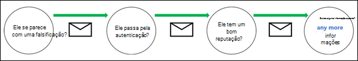
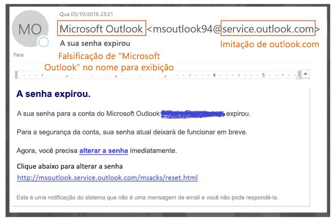
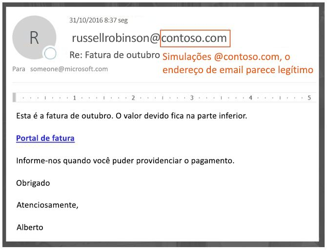
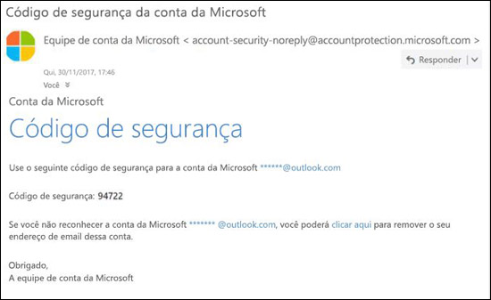

# Proteção antifalsificação

Se você for um cliente do Microsoft 365 com caixas de correio no Exchange Online ou um cliente autônomo da Proteção do Exchange Online (EOP) sem caixas de correio do Exchange Online, o EOP incluirá recursos para ajudar a proteger sua organização contra remetentes falsificados (forjados).

Quando se trata de proteger os usuários, a Microsoft leva a sério a ameaça de phishing. A falsificação é uma técnica comum usada por invasores. **As mensagens falsas parecem se originar de alguém ou algum lugar que não é a origem real.** Essa técnica é frequentemente usada em campanhas de phishing projetadas para obter credenciais de usuário. A tecnologia antifalsificação na EOP examina especificamente a falsificação do cabeçalho De no corpo da mensagem (usada para exibir o remetente da mensagem nos clientes de email). Quando a EOP tem alta confiança de que o cabeçalho De é forjado, a mensagem é identificada como falsificada.

As seguintes tecnologias antifalsificação estão disponíveis na EOP:

- **Inteligência contra falsificação**: Revise as mensagens falsas dos remetentes em domínios internos e externos e permita ou bloqueie esses remetentes. Para obter mais informações, contra [Configurar a inteligência contra falsificação no Microsoft 365](learn-about-spoof-intelligence.md).

- **Políticas antiphishing**: Na EOP, a política interna antiphishing permite ativar ou desativar a inteligência contra falsificação, ativar ou desativar a identificação de remetente não autenticado no Outlook e especificar a ação para remetentes falsificados bloqueados (mover para a pasta Lixo Eletrônico ou para a quarentena). As políticas antiphishing avançadas disponíveis na Proteção Avançada contra Ameaças do Office 365 (ATP) também contêm configurações contra usurpação de identidade (remetentes e domínios protegidos), configurações de inteligência da caixa de correio e limites ajustáveis de phishing avançados. Para obter mais informações, confira [Políticas antiphishing](set-up-anti-phishing-policies.md) no Microsoft 365.

- **Autenticação de email**: Um componente integrante de qualquer esforço antifalsificação é o uso de autenticação de email (também conhecida como validação de email) pelos registros SPF, DKIM e DMARC no DNS. Você pode configurar esses registros para seus domínios, para que os sistemas de email de destino possam verificar a validade das mensagens que afirmam ser de remetentes em seus domínios. Para mensagens de entrada, o Microsoft 365 requer autenticação de email para domínios do remetente. Para obter mais informações, confira [Autenticação de email no Microsoft 365](email-validation-and-authentication.md).

A tecnologia antifalsificação da Microsoft foi implantada originalmente apenas em organizações com a Proteção Avançada contra Ameaças (ATP) do Office 365. Em outubro de 2018, a proteção antifalsificação foi adicionada à EOP.

A EOP analisa e bloqueia mensagens que não podem ser autenticadas pela combinação de métodos padrão de autenticação de email e técnicas de reputação do remetente.

## Como a falsificação é usada em ataques de phishing

As mensagens falsificadas têm as seguintes implicações negativas para os usuários:

- **Mensagens falsificadas enganam os usuários**: Uma mensagem falsificada pode induzir o destinatário a clicar em um link e expor suas credenciais, baixar malware ou responder a uma mensagem com conteúdo confidencial (o que é conhecido como comprometimento de email empresarial ou BEC).

  A seguinte mensagem é um exemplo de phishing que usa o remetente falsificado msoutlook94@service.outlook.com:

  

  Essa mensagem não veio de service.outlook.com, mas o invasor falsificou o campo do cabeçalho **De** para fazer com que parecesse ter vindo. Essa foi uma tentativa de induzir o destinatário a clicar no link **alterar senha** e expor suas credenciais.

  A seguinte mensagem é um exemplo de BEC que usa o domínio de email falsificado contoso.com:

  

  A mensagem parece legítima, mas o remetente é falso.

- **Os usuários confundem mensagens reais com mensagens falsas**: Mesmo os usuários que conhecem phishing podem ter dificuldade em perceber as diferenças entre mensagens reais e falsificadas.

  A seguinte mensagem é um exemplo de uma mensagem real de redefinição de senha da conta de Segurança da Microsoft:

  

  A mensagem realmente veio da Microsoft, mas os usuários foram condicionados a suspeitar. Como é difícil distinguir uma mensagem de redefinição de senha real de uma falsa, os usuários podem ignorar a mensagem, denunciá-la como spam ou denunciá-la desnecessariamente à Microsoft como phishing.

## Diferentes tipos de falsificação

A Microsoft diferencia dois tipos diferentes de mensagens falsas:

- **Falsificação dentro da organização**: Também conhecida como falsificação _self-to-self_. Por exemplo:

  - O remetente e o destinatário estão no mesmo domínio:
    > De: humberto@contoso.com   Para: michelle@contoso.com

  - O remetente e o destinatário estão em subdomínios do mesmo domínio:
    > De: laura@marketing.fabrikam.com   Para: julia@engineering.fabrikam.com

  - O remetente e o destinatário estão em domínios diferentes que pertencem à mesma organização (ou seja, os dois domínios estão configurados como [domínios aceitos](https://docs.microsoft.com/exchange/mail-flow-best-practices/manage-accepted-domains/manage-accepted-domains) na mesma organização):
    > De: remetente @ microsoft.com   Para: destinatário @ bing.com

    Os espaços são usados nos endereços de email para impedir a coleta de spambots.

  As mensagens reprovadas na [autenticação composta](email-validation-and-authentication.md#composite-authentication) devido à falsificação dentro da organização contêm os seguintes valores de cabeçalho:

  `Authentication-Results: ... compauth=fail reason=6xx`

  `X-Forefront-Antispam-Report: ...CAT:SPOOF;...SFTY:9.11`

  - `reason=6xx` indica falsificação dentro da organização.

  - SFTY é o nível de segurança da mensagem. 9 indica phishing, .11 indica falsificação dentro da organização.

- **Falsificação entre domínios**: Os domínios do remetente e do destinatário são diferentes e não têm relação entre si (também conhecidos como domínios externos). Por exemplo:
    > De: humberto@contoso.com   Para: michelle@tailspintoys.com

  As mensagens reprovadas na [autenticação composta](email-validation-and-authentication.md#composite-authentication) devido à falsificação entre domínios contêm os seguintes valores de cabeçalhos:

  `Authentication-Results: ... compauth=fail reason=000/001`

  `X-Forefront-Antispam-Report: ...CAT:SPOOF;...SFTY:9.22`

  - `reason=000` indica que a mensagem foi reprovada na autenticação explícita de email. `reason=001` indica que a mensagem foi reprovada na autenticação implícita de email.

  - SFTY é o nível de segurança da mensagem. 9 indica phishing, .22 indica falsificação entre domínios.

Para obter mais informações sobre os valores Categoria e autenticação composta (compauth) relacionados à falsificação, confira [Cabeçalhos de mensagem antispam no Microsoft 365](anti-spam-message-headers.md).

Para obter mais informações sobre o DMARC, confira [Usar o DMARC para validar emails no Microsoft 365](use-dmarc-to-validate-email.md).

## Relatórios de quantas mensagens foram marcadas como falsificadas

Organizações da EOP podem usar as **Detecções de falsificação** no painel relatórios no Centro de Conformidade e Segurança. Para mais informações, confira [Relatório de Detecções de Falsificação](view-email-security-reports.md#spoof-detections-report).

A organização da Proteção Avançada contra Ameaças do Office 365 (ATP) pode usar o Explorador de Ameaças no Centro de Conformidade e Segurança para exibir informações sobre tentativas de phishing. Para obter mais informações, confira [Investigação e resposta a ameaças do Microsoft 365](office-365-ti.md).

## Problemas com a proteção antifalsificação

Sabe-se que as listas de endereçamento (também conhecidas como listas de discussão) têm problemas com a antifalsificação devido à maneira como encaminham e modificam as mensagens.

Por exemplo, Gabriela Laureano (glaureano@contoso.com) está interessada em observar pássaros, ingressa na lista de endereçamento birdwatchers@fabrikam.com e envia a seguinte mensagem à lista:

> **De:** "Laura Cunha" \<lauracunha@contoso.com\>   **Para:** Lista de Discussão de Observação de Pássaros \<observadoresdepassaros@fabrikam.com\>   
**Assunto:** Excelente vista de galos azuis no topo do Monte. Rainier esta semana   Alguém quer conferir esta semana a vista do Monte Rainier?

O servidor da lista de endereçamento recebe a mensagem, modifica seu conteúdo e a repete aos membros da lista. A mensagem repetida tem o mesmo endereço De (glaureano@contoso.com), mas uma marca é adicionada à linha de assunto e um rodapé é adicionado à parte inferior da mensagem. Esse tipo de modificação é comum em listas de endereçamento, e pode resultar em falsos positivos para falsificação.

> **De:** "Laura Cunha" \<lauracunha@contoso.com\>   **Para:** Lista de Discussão de Observação de Pássaros \<observadoresdepassaros@fabrikam.com\>   **Assunto:** [OBSERVAÇÃODEPÁSSAROS] Belo exemplo de gaios azuis no topo do Monte Rainier esta semana    Alguém quer conferir esta semana a vista do Monte Rainier?    Esta mensagem foi enviada para a lista de discussão de Observação de Pássaros. Você pode cancelar a assinatura a qualquer momento.

Para ajudar as mensagens da lista de endereçamento a passarem nas verificações antifalsificação, execute as seguintes etapas com base no controle da lista de endereçamento:

- Sua organização possui a lista de endereçamento:

  - Verifique as Perguntas Frequentes em DMARC.org: [Opero uma lista de endereçamento e quero interoperar com o DMARC, o que devo fazer?](https://dmarc.org/wiki/FAQ#I_operate_a_mailing_list_and_I_want_to_interoperate_with_DMARC.2C_what_should_I_do.3F).

  - Leia as instruções nesta postagem do blog: [Uma dica para os operadores de listas de endereçamento interoperarem com o DMARC para evitar falhas](https://blogs.msdn.microsoft.com/tzink/2017/03/22/a-tip-for-mailing-list-operators-to-interoperate-with-dmarc-to-avoid-failures/).

  - Considere a instalação de atualizações em seu servidor de lista de endereçamento para dar suporte ao ARC. Veja [https://arc-spec.org](https://arc-spec.org/)

- Sua organização não possui a lista de endereçamento:

  - Peça ao mantenedor da lista de endereçamento para que ele configure a autenticação de email para o domínio do qual a lista de endereçamento está retransmitindo.

    Quando um número suficiente de remetentes responde aos proprietários do domínio que devem configurar registros de autenticação de email, isso os incentiva a agir. Embora a Microsoft também trabalhe com proprietários de domínio para publicar os registros necessários, é ainda mais eficaz quando usuários individuais solicitam isso.

  - Crie regras de caixa de entrada no seu cliente de email para mover as mensagens para a Caixa de Entrada. Você também pode solicitar que seus administradores configurem substituições, conforme discutido em [Usar inteligência contra falsificação para configurar remetentes permitidos de email não autenticado](email-validation-and-authentication.md#use-spoof-intelligence-to-configure-permitted-senders-of-unauthenticated-email).

  - Crie um tíquete de suporte do Microsoft 365 para criar uma substituição para a lista de endereçamento para que ela seja tratada como legítima. Para obter mais informações, confira [Contatar o suporte para produtos comerciais - Ajuda para administradores](../../admin/contact-support-for-business-products.md).

Se tudo falhar, você poderá relatar a mensagem como um falso positivo para a Microsoft. Para mais informações, confira [Relatar mensagens e arquivos à Microsoft](report-junk-email-messages-to-microsoft.md).

Você também pode entrar em contato com seu administrador, que pode criar um tíquete de suporte na Microsoft. A equipe de engenharia da Microsoft investigará por que a mensagem foi marcada como uma falsificação.

## Considerações sobre a proteção antifalsificação

Se você é um administrador que atualmente envia mensagens para o Microsoft 365, precisa garantir que seu email seja autenticado corretamente. Caso contrário, ele pode ser marcado como spam ou phishing. Para obter mais informações, confira [Soluções para remetentes legítimos enviando emails não autenticados](email-validation-and-authentication.md#solutions-for-legitimate-senders-who-are-sending-unauthenticated-email).