# <a name="anti-spoofing-protection-in-office-365"></a><span data-ttu-id="e3ee2-105">Proteção antifalsificação no Office 365</span><span class="sxs-lookup"><span data-stu-id="e3ee2-105">Anti-spoofing protection in Office 365</span></span>

<span data-ttu-id="e3ee2-106">Este artigo descreve como o Office 365 mitiga ataques de phishing que usam domínios de remetentes forjados, ou seja, domínios falsificados.</span><span class="sxs-lookup"><span data-stu-id="e3ee2-106">This article describes how Office 365 mitigates against phishing attacks that use forged sender domains, that is, domains that are spoofed.</span></span> <span data-ttu-id="e3ee2-107">Isso é feito analisando as mensagens e bloqueando as que não podem ser autenticadas com métodos de autenticação de email padrão nem outras técnicas de reputação de remetente.</span><span class="sxs-lookup"><span data-stu-id="e3ee2-107">It accomplishes this by analyzing the messages and blocking the ones that cannot be authenticated using standard email authentication methods, nor other sender reputation techniques.</span></span> <span data-ttu-id="e3ee2-108">Essa alteração foi implementada para reduzir o número de ataques de phishing aos quais as organizações do Office 365 estão expostas.</span><span class="sxs-lookup"><span data-stu-id="e3ee2-108">This change was implemented to reduce the number of phishing attacks to which organizations in Office 365 are exposed.</span></span>

<span data-ttu-id="e3ee2-109">Este artigo também descreve por que essa alteração está sendo feita, como os clientes podem se preparar para a alteração, como exibir mensagens que serão afetadas, como enviar relatórios sobre mensagens, como reduzir a ocorrência de falsos positivos e como os remetentes para a Microsoft devem se preparar para essa alteração.</span><span class="sxs-lookup"><span data-stu-id="e3ee2-109">This article also describes why this change is being made, how customers can prepare for this change, how to view messages that will be affected, how to report on messages, how to mitigate false positives, as well as how senders to Microsoft should prepare for this change.</span></span>

<span data-ttu-id="e3ee2-110">A tecnologia antifalsificação da Microsoft foi implantada inicialmente nas organizações da empresa que tinham uma assinatura do Office 365 Enterprise E5 ou que tinham o complemento ATP (Proteção Avançada contra Ameaças) do Office 365 na assinatura.</span><span class="sxs-lookup"><span data-stu-id="e3ee2-110">Microsoft's anti-spoofing technology was initially deployed to its organizations that had an Office 365 Enterprise E5 subscription or had purchased the Office 365 Advanced Threat Protection (ATP) add-on for their subscription.</span></span> <span data-ttu-id="e3ee2-111">Desde outubro de 2018, estendemos a proteção para organizações que também têm a EOP (Proteção do Exchange Online).</span><span class="sxs-lookup"><span data-stu-id="e3ee2-111">As of October, 2018 we extended the protection to organizations that have Exchange Online Protection (EOP) as well.</span></span> <span data-ttu-id="e3ee2-112">Além disso, devido à maneira como todos os nossos filtros aprendem uns com os outros, os usuários do Outlook.com também podem ser afetados.</span><span class="sxs-lookup"><span data-stu-id="e3ee2-112">Additionally, because of the way all of our filters learn from each other, Outlook.com users may also be affected.</span></span>

## <a name="how-spoofing-is-used-in-phishing-attacks"></a><span data-ttu-id="e3ee2-113">Como a falsificação é usada em ataques de phishing</span><span class="sxs-lookup"><span data-stu-id="e3ee2-113">How spoofing is used in phishing attacks</span></span>

<span data-ttu-id="e3ee2-114">Quando se trata de proteger os usuários, a Microsoft leva a sério a ameaça de phishing.</span><span class="sxs-lookup"><span data-stu-id="e3ee2-114">When it comes to protecting its users, Microsoft takes the threat of phishing seriously.</span></span> <span data-ttu-id="e3ee2-115">Uma das técnicas usadas por spammers e phishers é a falsificação, que é quando o remetente é forjado e uma mensagem parece se originar de alguém ou algum outro lugar que não seja a fonte atual.</span><span class="sxs-lookup"><span data-stu-id="e3ee2-115">One of the techniques that spammers and phishers commonly use is spoofing, which is when the sender is forged, and a message appears to originate from someone or somewhere other than the actual source.</span></span> <span data-ttu-id="e3ee2-116">Essa técnica é frequentemente usada em campanhas de phishing criadas para obter credenciais de usuários.</span><span class="sxs-lookup"><span data-stu-id="e3ee2-116">This technique is often used in phishing campaigns designed to obtain user credentials.</span></span> <span data-ttu-id="e3ee2-117">A tecnologia antifalsificação da Microsoft analisa especificamente a falsificação do "cabeçalho De:", que é o que aparece em um cliente de email como o Outlook.</span><span class="sxs-lookup"><span data-stu-id="e3ee2-117">Microsoft's Anti-spoof technology specifically examines forgery of the 'From: header' which is the one that shows up in an email client like Outlook.</span></span> <span data-ttu-id="e3ee2-118">Quando a Microsoft tem alta confiança de que o cabeçalho De: é falsificado, identifica a mensagem como uma falsificação.</span><span class="sxs-lookup"><span data-stu-id="e3ee2-118">When Microsoft has high confidence that the From: header is spoofed, it identifies the message as a spoof.</span></span>

<span data-ttu-id="e3ee2-119">As mensagens falsificadas têm duas implicações negativas para os usuários da vida real:</span><span class="sxs-lookup"><span data-stu-id="e3ee2-119">Spoofing messages have two negative implications for real life users:</span></span>

### <a name="1-spoofed-messages-deceive-users"></a><span data-ttu-id="e3ee2-120">1. As mensagens falsificadas enganam os usuários</span><span class="sxs-lookup"><span data-stu-id="e3ee2-120">1. Spoofed messages deceive users</span></span>

<span data-ttu-id="e3ee2-121">Primeiro, uma mensagem falsificada pode induzir o usuário a clicar em um link e fornecer as credenciais, baixar malware ou responder a uma mensagem com conteúdo confidencial (essa última situação é conhecida como Comprometimento de Email Empresarial).</span><span class="sxs-lookup"><span data-stu-id="e3ee2-121">First, a spoofed message may trick a user into clicking a link and giving up their credentials, downloading malware, or replying to a message with sensitive content (the latter of which is known as Business Email Compromise).</span></span> <span data-ttu-id="e3ee2-122">Por exemplo, a seguir está uma mensagem de phishing com o remetente falsificado msoutlook94@service.outlook.com:</span><span class="sxs-lookup"><span data-stu-id="e3ee2-122">For example, the following is a phishing message with a spoofed sender of msoutlook94@service.outlook.com:</span></span>

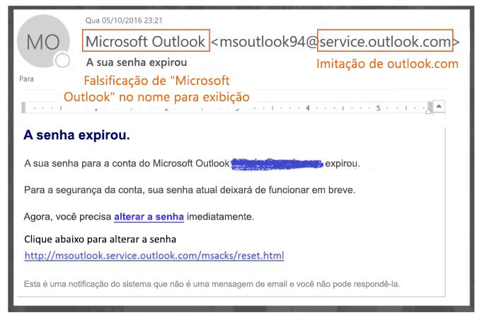

<span data-ttu-id="e3ee2-124">O exemplo acima não veio realmente de service.outlook.com. Em vez disso, foi falsificado pelo phisher para parecer que veio.</span><span class="sxs-lookup"><span data-stu-id="e3ee2-124">The above did not actually come from service.outlook.com, but instead was spoofed by the phisher to make it look like it did.</span></span> <span data-ttu-id="e3ee2-125">Está tentando enganar um usuário para clicar no link na mensagem.</span><span class="sxs-lookup"><span data-stu-id="e3ee2-125">It is attempting to trick a user into clicking the link within the message.</span></span>

<span data-ttu-id="e3ee2-126">O próximo exemplo está falsificando contoso.com:</span><span class="sxs-lookup"><span data-stu-id="e3ee2-126">The next example is spoofing contoso.com:</span></span>

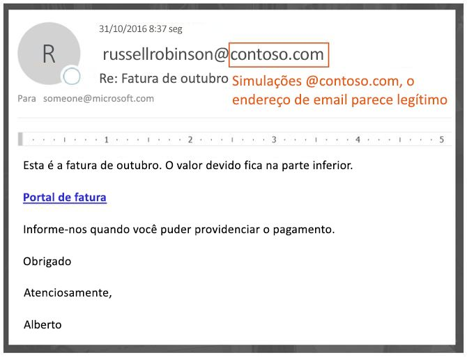

<span data-ttu-id="e3ee2-128">A mensagem parece legítima, mas na verdade é uma falsificação.</span><span class="sxs-lookup"><span data-stu-id="e3ee2-128">The message looks legitimate, but in fact is a spoof.</span></span> <span data-ttu-id="e3ee2-129">Essa mensagem de phishing é um tipo de Comprometimento de Email Empresarial, que é uma subcategoria de phishing.</span><span class="sxs-lookup"><span data-stu-id="e3ee2-129">This phishing message is a type of Business Email Compromise which is a subcategory of phishing.</span></span>

### <a name="2-users-confuse-real-messages-for-fake-ones"></a><span data-ttu-id="e3ee2-130">2. Os usuários confundem as mensagens reais com as falsas</span><span class="sxs-lookup"><span data-stu-id="e3ee2-130">2. Users confuse real messages for fake ones</span></span>

<span data-ttu-id="e3ee2-131">Em segundo lugar, as mensagens falsificadas criam incerteza para os usuários que sabem da existência de mensagens de phishing, mas não conseguem distinguir entre uma mensagem real e uma falsificada.</span><span class="sxs-lookup"><span data-stu-id="e3ee2-131">Second, spoofed messages create uncertainty for users who know about phishing messages but cannot tell the difference between a real message and spoofed one.</span></span> <span data-ttu-id="e3ee2-132">Por exemplo, a seguir há uma redefinição de senha real do endereço de email da conta de Segurança da Microsoft:</span><span class="sxs-lookup"><span data-stu-id="e3ee2-132">For example, the following is an example of an actual password reset from the Microsoft Security account email address:</span></span>

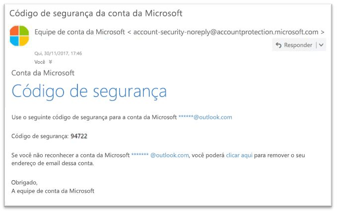

<span data-ttu-id="e3ee2-134">A mensagem acima veio da Microsoft, mas, ao mesmo tempo, os usuários estão acostumados a receber mensagens de phishing que podem enganá-los para clicar em um link e fornecer credenciais, baixar malware ou responder a uma mensagem com conteúdo confidencial.</span><span class="sxs-lookup"><span data-stu-id="e3ee2-134">The above message did come from Microsoft, but at the same time, users are used to getting phishing messages that may trick a user into clicking a link and giving up their credentials, downloading malware, or replying to a message with sensitive content.</span></span> <span data-ttu-id="e3ee2-135">Como é difícil distinguir entre uma redefinição de senha real e uma falsa, muitos usuários ignoram essas mensagens, as relatam como spam ou desnecessariamente à Microsoft como tentativas de phishing perdidas.</span><span class="sxs-lookup"><span data-stu-id="e3ee2-135">Because it is difficult to tell the difference between a real password reset and a fake one, many users ignore these messages, report them as spam, or unnecessarily report the messages back to Microsoft as missed phishing scams.</span></span>

<span data-ttu-id="e3ee2-136">Para impedir a falsificação, o setor de filtragem de email desenvolveu protocolos de autenticação de email, como [SPF](https://docs.microsoft.com/office365/SecurityCompliance/set-up-spf-in-office-365-to-help-prevent-spoofing), [DKIM](https://docs.microsoft.com/office365/SecurityCompliance/use-dkim-to-validate-outbound-email) e [DMARC](https://docs.microsoft.com/office365/SecurityCompliance/use-dmarc-to-validate-email).</span><span class="sxs-lookup"><span data-stu-id="e3ee2-136">To stop spoofing, the email filtering industry has developed email authentication protocols such as [SPF](https://docs.microsoft.com/office365/SecurityCompliance/set-up-spf-in-office-365-to-help-prevent-spoofing), [DKIM](https://docs.microsoft.com/office365/SecurityCompliance/use-dkim-to-validate-outbound-email), and [DMARC](https://docs.microsoft.com/office365/SecurityCompliance/use-dmarc-to-validate-email).</span></span> <span data-ttu-id="e3ee2-137">O DMARC impede que falsificações examinem o remetente de uma mensagem.</span><span class="sxs-lookup"><span data-stu-id="e3ee2-137">DMARC prevents spoofing from examining a message's sender.</span></span> <span data-ttu-id="e3ee2-138">Ou seja, o remetente que os usuários veem em seus clientes de email (nos exemplos acima, são o service.outlook.com, o outlook.com e o accountprotection.microsoft.com).</span><span class="sxs-lookup"><span data-stu-id="e3ee2-138">That is, the sender that users see in their email client (in the examples above it is service.outlook.com, outlook.com, and accountprotection.microsoft.com).</span></span> <span data-ttu-id="e3ee2-139">Além disso, os usuários também podem ver se o domínio já passou no SPF ou no DKIM, o que significa que o domínio foi autenticado e, portanto, não é falso.</span><span class="sxs-lookup"><span data-stu-id="e3ee2-139">Furthermore, users can also see that the domain has passed SPF or DKIM, which means that the domain has been authenticated and is therefore not spoofed.</span></span> <span data-ttu-id="e3ee2-140">Para uma discussão mais completa, confira a seção "*Entender por que a autenticação de email nem sempre é suficiente para impedir a falsificação"* mais adiante neste artigo.</span><span class="sxs-lookup"><span data-stu-id="e3ee2-140">For a more complete discussion, see the section "*Understanding why email authentication is not always enough to stop spoofing"*  later on in this article.</span></span>

<span data-ttu-id="e3ee2-141">No entanto, o problema é que os registros de autenticação de email são opcionais, não obrigatórios.</span><span class="sxs-lookup"><span data-stu-id="e3ee2-141">However, the problem is that email authentication records are optional, not required.</span></span> <span data-ttu-id="e3ee2-142">Portanto, enquanto domínios com políticas de autenticação fortes, como microsoft.com e skype.com, sejam protegidos contra falsificação, domínios que publicam políticas de autenticação mais fracas ou nenhuma política, são alvos de falsificação.</span><span class="sxs-lookup"><span data-stu-id="e3ee2-142">Therefore, while domains with strong authentication policies like microsoft.com and skype.com are protected from spoofing, domains that publish weaker authentication policies, or no policy at all, are targets for being spoofed.As of March 2018, only 9% of domains of companies in the Fortune 500 publish strong email authentication policies.</span></span> <span data-ttu-id="e3ee2-143">Em março de 2018, apenas 9% dos domínios de empresas da lista Fortune 500 publicavam políticas de autenticação de emails fortes.</span><span class="sxs-lookup"><span data-stu-id="e3ee2-143">As of March 2018, only 9% of domains of companies in the Fortune 500 publish strong email authentication policies.</span></span> <span data-ttu-id="e3ee2-144">Os 91% restantes podem ser falsificados por um phisher e, a menos que o filtro de email os detecte usando outra política, podem ser entregues a um usuário final e enganá-lo:</span><span class="sxs-lookup"><span data-stu-id="e3ee2-144">The remaining 91% may be spoofed by a phisher, and unless the email filter detects it using another policy, may be delivered to an end user and deceive them:</span></span>

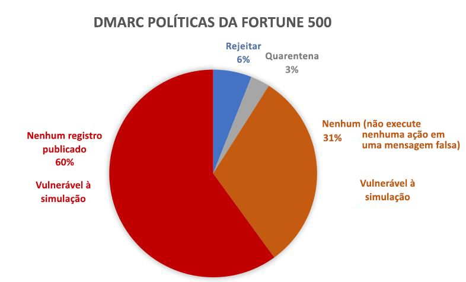

<span data-ttu-id="e3ee2-146">A proporção de pequenas e médias empresas que não fazem parte da lista Fortune 500 e que publicam políticas de autenticação de email fortes é menor, sendo ainda menor para domínios fora da América do Norte e da Europa Ocidental.</span><span class="sxs-lookup"><span data-stu-id="e3ee2-146">The proportion of small-to-medium sized companies that are not in the Fortune 500 that publish strong email authentication policies is smaller, and smaller still for domains that are outside of North America and western Europe.</span></span>

<span data-ttu-id="e3ee2-147">Esse é um grande problema porque, embora as empresas possam não estar cientes de como a autenticação de email funciona, os phishers entendem e aproveitam a falta dela.</span><span class="sxs-lookup"><span data-stu-id="e3ee2-147">This is a big problem because while enterprises may not be aware of how email authentication works, phishers do understand and take advantage of the lack of it.</span></span>

<span data-ttu-id="e3ee2-148">Para obter informações sobre como configurar o SPF, o DKIM e o DMARC, confira a seção "*Clientes do Office 365"*, mais adiante neste documento.</span><span class="sxs-lookup"><span data-stu-id="e3ee2-148">For information on setting up SPF, DKIM, and DMARC, see the section "*Customers of Office 365"*  later on in this document.</span></span>

## <a name="stopping-spoofing-with-implicit-email-authentication"></a><span data-ttu-id="e3ee2-149">Impedir a falsificação com a autenticação de email implícita</span><span class="sxs-lookup"><span data-stu-id="e3ee2-149">Stopping spoofing with implicit email authentication</span></span>

<span data-ttu-id="e3ee2-150">Como o phishing e o spear phishing são um problema muito sério, e devido à adoção limitada de políticas de autenticação de email fortes, a Microsoft continua investindo em recursos para proteger os clientes.</span><span class="sxs-lookup"><span data-stu-id="e3ee2-150">Because phishing and spear phishing is such a problem, and because of the limited adoption of strong email authentication policies, Microsoft continues to invest in capabilities to protect its customers.</span></span> <span data-ttu-id="e3ee2-151">Portanto, a Microsoft está progredindo com a *autenticação de email implícita*. Se um domínio não for autenticado, a Microsoft o tratará como se como se ele tivesse publicado registros de autenticação de email e o tratará da maneira apropriada, se não for aprovado.</span><span class="sxs-lookup"><span data-stu-id="e3ee2-151">Therefore, Microsoft is moving ahead with  *implicit email authentication* - if a domain doesn't authenticate, Microsoft will treat it as if it had published email authentication records and treat it accordingly if it doesn't pass.</span></span>

<span data-ttu-id="e3ee2-152">Para isso, a Microsoft criou várias extensões para a autenticação regular de emails, incluindo a reputação do remetente, o histórico do remetente/destinatário, a análise comportamental e outras técnicas avançadas.</span><span class="sxs-lookup"><span data-stu-id="e3ee2-152">To accomplish this, Microsoft has built numerous extensions to regular email authentication including sender reputation, sender/recipient history, behavioral analysis, and other advanced techniques.</span></span> <span data-ttu-id="e3ee2-153">Uma mensagem enviada de um domínio que não publica a autenticação de email será marcada como falsificação, a menos que contenha outros sinais para indicar que é legítima.</span><span class="sxs-lookup"><span data-stu-id="e3ee2-153">A message sent from a domain that doesn't publish email authentication will be marked as spoof unless it contains other signals to indicate that it is legitimate.</span></span>

<span data-ttu-id="e3ee2-154">Dessa forma, os usuários finais podem saber com confiança que um email não foi falsificado, os remetentes podem ter certeza de que ninguém está fingindo ser o domínio deles e os clientes do Office 365 podem oferecer proteção ainda melhor, como a proteção contra falsificação de identidade.</span><span class="sxs-lookup"><span data-stu-id="e3ee2-154">By doing this, end users can have confidence that an email sent to them has not been spoofed, senders can be confident that nobody is impersonating their domain, and customers of Office 365 can offer even better protection such as Impersonation protection.</span></span>

<span data-ttu-id="e3ee2-155">Para ver o comunicado geral da Microsoft, confira [Um mar de phishing, parte 2 ‒ antifalsificação aprimorada no Office 365](https://techcommunity.microsoft.com/t5/Security-Privacy-and-Compliance/Schooling-A-Sea-of-Phish-Part-2-Enhanced-Anti-spoofing/ba-p/176209).</span><span class="sxs-lookup"><span data-stu-id="e3ee2-155">To see Microsoft's general announcement, see [A Sea of Phish Part 2 - Enhanced Anti-spoofing in Office 365](https://techcommunity.microsoft.com/t5/Security-Privacy-and-Compliance/Schooling-A-Sea-of-Phish-Part-2-Enhanced-Anti-spoofing/ba-p/176209).</span></span>

## <a name="identifying-that-a-message-is-classified-as-spoofed"></a><span data-ttu-id="e3ee2-156">Identificar que uma mensagem foi classificada como falsificada</span><span class="sxs-lookup"><span data-stu-id="e3ee2-156">Identifying that a message is classified as spoofed</span></span>

### <a name="composite-authentication"></a><span data-ttu-id="e3ee2-157">Autenticação composta</span><span class="sxs-lookup"><span data-stu-id="e3ee2-157">Composite authentication</span></span>

<span data-ttu-id="e3ee2-158">Embora o SPF, o DKIM e o DMARC sejam úteis por si só, não comunicam um status de autenticação suficiente caso uma mensagem não tenha registros de autenticação explícitos.</span><span class="sxs-lookup"><span data-stu-id="e3ee2-158">While SPF, DKIM, and DMARC are all useful by themselves, they don't communicate enough authentication status in the event a message has no explicit authentication records.</span></span> <span data-ttu-id="e3ee2-159">Portanto, a Microsoft desenvolveu um algoritmo que combina vários sinais em um único valor chamado Autenticação Composta, abreviada como compauth.</span><span class="sxs-lookup"><span data-stu-id="e3ee2-159">Therefore, Microsoft has developed an algorithm that combines multiple signals into a single value called Composite Authentication, or compauth for short.</span></span> <span data-ttu-id="e3ee2-160">Os clientes no Office 365 têm valores compartilhados marcados no cabeçalho *Authentication-Results* nos cabeçalhos das mensagens.</span><span class="sxs-lookup"><span data-stu-id="e3ee2-160">Customers in Office 365 have compauth values stamped into the *Authentication-Results* header in the message headers.</span></span>

```
Authentication-Results:
  compauth=<fail|pass|softpass|none> reason=<yyy>

```

|<span data-ttu-id="e3ee2-161">**Resultado de CompAuth**</span><span class="sxs-lookup"><span data-stu-id="e3ee2-161">**CompAuth result**</span></span>|<span data-ttu-id="e3ee2-162">**Descrição**</span><span class="sxs-lookup"><span data-stu-id="e3ee2-162">**Description**</span></span>|
|:-----|:-----|
|<span data-ttu-id="e3ee2-163">fail</span><span class="sxs-lookup"><span data-stu-id="e3ee2-163">fail</span></span>|<span data-ttu-id="e3ee2-164">A mensagem foi reprovada na autenticação explícita (envio de registros publicados no domínio explicitamente no DNS) ou autenticação implícita (o domínio de envio não publicou registros no DNS, assim, o Office 365 interpolou o resultado como se tivesse registros publicados).</span><span class="sxs-lookup"><span data-stu-id="e3ee2-164">Message failed explicit authentication (sending domain published records explicitly in DNS) or implicit authentication (sending domain did not publish records in DNS, so Office 365 interpolated the result as if it had published records).</span></span>|
|<span data-ttu-id="e3ee2-165">pass</span><span class="sxs-lookup"><span data-stu-id="e3ee2-165">pass</span></span>|<span data-ttu-id="e3ee2-166">A mensagem foi aprovada na autenticação explícita (a mensagem foi aprovada no DMARC ou [Best Guess Passed DMARC](https://blogs.msdn.microsoft.com/tzink/2015/05/06/what-is-dmarc-bestguesspass-in-office-365)) ou autenticação implícita com alta confiança (o domínio de envio não publica registros de autenticação de email, mas o Office 365 tem sinais de back-end fortes para indicar que a mensagem é provavelmente legítima).</span><span class="sxs-lookup"><span data-stu-id="e3ee2-166">Message passed explicit authentication (message passed DMARC, or [Best Guess Passed DMARC](https://blogs.msdn.microsoft.com/tzink/2015/05/06/what-is-dmarc-bestguesspass-in-office-365)) or implicit authentication with high confidence (sending domain does not publish email authentication records, but Office 365 has strong backend signals to indicate the message is likely legitimate).</span></span>|
|<span data-ttu-id="e3ee2-167">softpass</span><span class="sxs-lookup"><span data-stu-id="e3ee2-167">softpass</span></span>|<span data-ttu-id="e3ee2-168">A mensagem foi aprovada na autenticação implícita com confiança de baixa a média (o domínio de envio não publica a autenticação de email, mas o Office 365 tem sinais de back-end para indicar que a mensagem é legítima, embora a intensidade do sinal seja mais fraca).</span><span class="sxs-lookup"><span data-stu-id="e3ee2-168">Message passed implicit authentication with low-to-medium confidence (sending domain does not publish email authentication, but Office 365 has backend signals to indicate the message is legitimate but the strength of the signal is weaker).</span></span>|
|<span data-ttu-id="e3ee2-169">nenhuma</span><span class="sxs-lookup"><span data-stu-id="e3ee2-169">none</span></span>|<span data-ttu-id="e3ee2-170">A mensagem não foi autenticada (ou foi autenticada, mas não foi alinhada), mas a autenticação composta não foi aplicada devido à reputação do remetente ou a outros fatores.</span><span class="sxs-lookup"><span data-stu-id="e3ee2-170">Message did not authenticate (or it did authenticate but did not align), but composite authentication not applied due to sender reputation or other factors.</span></span>|

|||
|:-----|:-----|
|<span data-ttu-id="e3ee2-171">**Motivo**</span><span class="sxs-lookup"><span data-stu-id="e3ee2-171">**Reason**</span></span>|<span data-ttu-id="e3ee2-172">**Descrição**</span><span class="sxs-lookup"><span data-stu-id="e3ee2-172">**Description**</span></span>|
|<span data-ttu-id="e3ee2-173">0xx</span><span class="sxs-lookup"><span data-stu-id="e3ee2-173">0xx</span></span> |<span data-ttu-id="e3ee2-174">A mensagem foi reprovada na autenticação composta.</span><span class="sxs-lookup"><span data-stu-id="e3ee2-174">Message failed composite authentication.</span></span><br/><span data-ttu-id="e3ee2-175">**000** significa que a mensagem foi reprovada no DMARC com uma ação de rejeição ou quarentena.</span><span class="sxs-lookup"><span data-stu-id="e3ee2-175">**000** means the message failed DMARC with an action of reject or quarantine.</span></span>  <br/><span data-ttu-id="e3ee2-176">**001** significa que a mensagem foi reprovada na autenticação de email implícita.</span><span class="sxs-lookup"><span data-stu-id="e3ee2-176">**001** means the message failed implicit email authentication.</span></span> <span data-ttu-id="e3ee2-177">Isso significa que o domínio de envio não tinha registros de autenticação de email publicados ou, se os tinha, eles usavam uma política de falha mais fraca (falha não grave do SPF ou neutra; política do DMARC de p=nenhum).</span><span class="sxs-lookup"><span data-stu-id="e3ee2-177">This means that the sending domain did not have email authentication records published, or if they did, they had a weaker failure policy (SPF soft fail or neutral, DMARC policy of p=none).</span></span>  <br/><span data-ttu-id="e3ee2-178">**002** significa que a organização tem uma política para o par remetente/domínio, que é explicitamente proibido de enviar emails falsificados. Essa configuração é definida manualmente por um administrador.</span><span class="sxs-lookup"><span data-stu-id="e3ee2-178">**002** means the organization has a policy for the sender/domain pair that is explicitly prohibited from sending spoofed email, this setting is manually set by an administrator.</span></span>  <br/><span data-ttu-id="e3ee2-179">**010** significa que a mensagem foi reprovada no DMARC com uma ação de rejeição ou quarentena, e o domínio de envio é um dos domínios aceitos de sua organização (isso faz parte da falsificação self-to-self ou dentro da organização).</span><span class="sxs-lookup"><span data-stu-id="e3ee2-179">**010** means the message failed DMARC with an action of reject or quarantine, and the sending domain is one of your organization's accepted-domains (this is part of self-to-self, or intra-org, spoofing).</span></span>|
|<span data-ttu-id="e3ee2-180">1xx, 2xx, 3xx, 4xx e 5xx</span><span class="sxs-lookup"><span data-stu-id="e3ee2-180">1xx, 2xx, 3xx, 4xx, and 5xx</span></span>|<span data-ttu-id="e3ee2-181">Corresponde a vários códigos internos que indicam o motivo pelo qual uma mensagem foi aprovada na autenticação implícita ou não teve autenticação, mas nenhuma ação foi aplicada.</span><span class="sxs-lookup"><span data-stu-id="e3ee2-181">Correspond to various internal codes for why a message passed implicit authentication, or had no authentication but no action was applied.</span></span>|
|<span data-ttu-id="e3ee2-182">6xx</span><span class="sxs-lookup"><span data-stu-id="e3ee2-182">6xx</span></span>|<span data-ttu-id="e3ee2-183">Significa que a mensagem foi reprovada na autenticação de email implícita e o domínio de envio é um dos domínios aceitos de sua organização (isso faz parte da falsificação self-to-self ou dentro da organização).</span><span class="sxs-lookup"><span data-stu-id="e3ee2-183">Means the message failed implicit email authentication, and the sending domain is one of your organization's accepted domains (this is part of self-to-self, or intra-org, spoofing).</span></span>|

<span data-ttu-id="e3ee2-184">Examinando os cabeçalhos de uma mensagem, um administrador ou até mesmo um usuário final pode determinar como o Office 365 chega à conclusão de que o remetente pode ser falsificado.</span><span class="sxs-lookup"><span data-stu-id="e3ee2-184">By looking at the headers of a message, an administrator or even an end user can determine how Office 365 arrives at the conclusion that the sender may be spoofed.</span></span>

### <a name="differentiating-between-different-types-of-spoofing"></a><span data-ttu-id="e3ee2-185">Diferenciar os tipos de falsificação</span><span class="sxs-lookup"><span data-stu-id="e3ee2-185">Differentiating between different types of spoofing</span></span>

<span data-ttu-id="e3ee2-186">A Microsoft diferencia dois tipos de mensagens de falsificação:</span><span class="sxs-lookup"><span data-stu-id="e3ee2-186">Microsoft differentiates between two different types of spoofing messages:</span></span>

#### <a name="intra-org-spoofing"></a><span data-ttu-id="e3ee2-187">Falsificação dentro da organização</span><span class="sxs-lookup"><span data-stu-id="e3ee2-187">Intra-org spoofing</span></span>

<span data-ttu-id="e3ee2-188">Também conhecida como falsificação self-to-self, ocorre quando o domínio no endereço De: é igual ou está alinhado ao domínio do destinatário (quando o domínio do destinatário é um dos [domínios aceitos](https://docs.microsoft.com/exchange/mail-flow-best-practices/manage-accepted-domains/manage-accepted-domains) de sua organização) ou quando o domínio no endereço De: faz parte da mesma organização.</span><span class="sxs-lookup"><span data-stu-id="e3ee2-188">Also known as self-to-self spoofing, this occurs when the domain in the From: address is the same as, or aligns with, the recipient domain (when recipient domain is one of your organization's [accepted domains](https://docs.microsoft.com/exchange/mail-flow-best-practices/manage-accepted-domains/manage-accepted-domains)); or, when the domain in the From: address is part of the same organization.</span></span>

<span data-ttu-id="e3ee2-189">O exemplo a seguir tem remetente e destinatário do mesmo domínio (contoso.com).</span><span class="sxs-lookup"><span data-stu-id="e3ee2-189">For example, the following has sender and recipient from the same domain (contoso.com).</span></span> <span data-ttu-id="e3ee2-190">Espaços são inseridos no endereço de email para evitar a coleta de spambot na página):</span><span class="sxs-lookup"><span data-stu-id="e3ee2-190">Spaces are inserted into the email address to prevent spambot harvesting on this page):</span></span>

> <span data-ttu-id="e3ee2-191">De: remetente @ contoso.com</span><span class="sxs-lookup"><span data-stu-id="e3ee2-191">From: sender @ contoso.com</span></span> <br/> <span data-ttu-id="e3ee2-192">Para: destinatário @ contoso.com</span><span class="sxs-lookup"><span data-stu-id="e3ee2-192">To: recipient @ contoso.com</span></span>

<span data-ttu-id="e3ee2-193">No seguinte exemplo, os domínios de remetente e destinatário estão alinhados com o domínio organizacional (fabrikam.com):</span><span class="sxs-lookup"><span data-stu-id="e3ee2-193">The following has the sender and recipient domains aligning with the organizational domain (fabrikam.com):</span></span>

> <span data-ttu-id="e3ee2-194">De: remetente @ foo.fabrikam.com</span><span class="sxs-lookup"><span data-stu-id="e3ee2-194">From: sender @ foo.fabrikam.com</span></span> <br/> <span data-ttu-id="e3ee2-195">Para: destinatário @ bar.fabrikam.com</span><span class="sxs-lookup"><span data-stu-id="e3ee2-195">To: recipient @ bar.fabrikam.com</span></span>

<span data-ttu-id="e3ee2-196">No seguinte exemplo, os domínios de remetente e destinatário são diferentes (microsoft.com e bing.com), mas pertencem à mesma organização (ou seja, ambos fazem parte dos Domínios Aceitos da organização):</span><span class="sxs-lookup"><span data-stu-id="e3ee2-196">The following sender and recipient domains are different (microsoft.com and bing.com), but they belong to the same organization (that is, both are part of the organization's Accepted Domains):</span></span>

> <span data-ttu-id="e3ee2-197">De: remetente @ microsoft.com</span><span class="sxs-lookup"><span data-stu-id="e3ee2-197">From: sender @ microsoft.com</span></span> <br/> <span data-ttu-id="e3ee2-198">Para: destinatário @ bing.com</span><span class="sxs-lookup"><span data-stu-id="e3ee2-198">To: recipient @ bing.com</span></span>

<span data-ttu-id="e3ee2-199">As mensagens reprovadas na falsificação dentro da organização contêm os seguintes valores nos cabeçalhos:</span><span class="sxs-lookup"><span data-stu-id="e3ee2-199">Messages that fail intra-org spoofing contain the following values in the headers:</span></span>

`X-Forefront-Antispam-Report: ...CAT:SPM/HSPM/PHSH;...SFTY:9.11`

<span data-ttu-id="e3ee2-200">CAT é a categoria da mensagem, normalmente carimbada como SPM (spam), mas ocasionalmente pode ser HSPM (spam de alta confiança) ou PHISH (phishing), dependendo de quais outros tipos de padrões ocorrem na mensagem.</span><span class="sxs-lookup"><span data-stu-id="e3ee2-200">The CAT is the category of the message, and it is normally stamped as SPM (spam), but occasionally may be HSPM (high confidence spam) or PHISH (phishing) depending upon what other types of patterns occur in the message.</span></span>

<span data-ttu-id="e3ee2-201">SFTY é o nível de segurança da mensagem. O primeiro dígito (9) significa que se trata de uma mensagem de phishing, e o segundo conjunto de dígitos após o ponto (11) significa que é uma falsificação dentro da organização.</span><span class="sxs-lookup"><span data-stu-id="e3ee2-201">The SFTY is the safety level of the message, the first digit (9) means the message is phishing, and second set of digits after the dot (11) means it is intra-org spoofing.</span></span>

<span data-ttu-id="e3ee2-202">Não há um código de razão específico de Autenticação Composta para falsificação dentro da organização. Ela será marcada mais tarde em 2018 (a linha do tempo ainda não está definida).</span><span class="sxs-lookup"><span data-stu-id="e3ee2-202">There is no specific reason code for Composite Authentication for intra-org spoofing, that will be stamped later in 2018 (timeline not yet defined).</span></span>

#### <a name="cross-domain-spoofing"></a><span data-ttu-id="e3ee2-203">Falsificação entre domínios</span><span class="sxs-lookup"><span data-stu-id="e3ee2-203">Cross-domain spoofing</span></span>

<span data-ttu-id="e3ee2-204">Isso ocorre quando o domínio de envio no endereço De: é um domínio externo à organização receptora.</span><span class="sxs-lookup"><span data-stu-id="e3ee2-204">This occurs when the sending domain in the From: address is an external domain to the receiving organization.</span></span> <span data-ttu-id="e3ee2-205">Mensagens que são reprovadas na Autenticação Composta devido a falsificação entre domínios contêm os seguintes valores nos cabeçalhos:</span><span class="sxs-lookup"><span data-stu-id="e3ee2-205">Messages that fail Composite Authentication due to cross-domain spoofing contain the following values in the headers:</span></span>

`Authentication-Results: ... compauth=fail reason=000/001`

`X-Forefront-Antispam-Report: ...CAT:SPOOF;...SFTY:9.22`

<span data-ttu-id="e3ee2-206">Em ambos os casos, a seguinte dica de segurança vermelha está marcada na mensagem ou há um equivalente que é personalizado para o idioma da caixa de correio do destinatário:</span><span class="sxs-lookup"><span data-stu-id="e3ee2-206">In both cases, the following red safety tip is stamped in the message, or an equivalent that is customized to the recipient mailbox's language:</span></span>

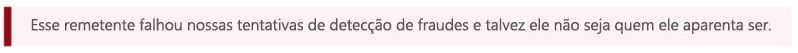

<span data-ttu-id="e3ee2-208">É apenas observando o endereço De: e sabendo qual é o email do destinatário ou inspecionando os cabeçalhos de email que você pode diferenciar entre falsificação dentro da organização e entre domínios.</span><span class="sxs-lookup"><span data-stu-id="e3ee2-208">It's only by looking at the From: address and knowing what your recipient email is, or by inspecting the email headers, that you can differentiate between intra-org and cross-domain spoofing.</span></span>

## <a name="how-customers-of-office-365-can-prepare-themselves-for-the-new-anti-spoofing-protection"></a><span data-ttu-id="e3ee2-209">Como os clientes do Office 365 podem se preparar para a nova proteção antifalsificação</span><span class="sxs-lookup"><span data-stu-id="e3ee2-209">How customers of Office 365 can prepare themselves for the new anti-spoofing protection</span></span>

### <a name="information-for-administrators"></a><span data-ttu-id="e3ee2-210">Informações para administradores</span><span class="sxs-lookup"><span data-stu-id="e3ee2-210">Information for administrators</span></span>

<span data-ttu-id="e3ee2-211">Como administrador de uma organização no Office 365, há várias informações importantes que você deve conhecer.</span><span class="sxs-lookup"><span data-stu-id="e3ee2-211">As an administrator of an organization in Office 365, there are several key pieces of information you should be aware of.</span></span>

### <a name="understanding-why-email-authentication-is-not-always-enough-to-stop-spoofing"></a><span data-ttu-id="e3ee2-212">Entender por que a autenticação de email nem sempre é suficiente para impedir a falsificação</span><span class="sxs-lookup"><span data-stu-id="e3ee2-212">Understanding why email authentication is not always enough to stop spoofing</span></span>

<span data-ttu-id="e3ee2-213">A nova proteção antifalsificação depende da autenticação de email (SPF, DKIM e DMARC) para não marcar uma mensagem como falsificada.</span><span class="sxs-lookup"><span data-stu-id="e3ee2-213">The new anti-spoofing protection relies on email authentication (SPF, DKIM, and DMARC) to not mark a message as spoofing.</span></span> <span data-ttu-id="e3ee2-214">Um exemplo comum é quando um domínio de envio nunca publicou registros SPF.</span><span class="sxs-lookup"><span data-stu-id="e3ee2-214">A common example is when a sending domain has never published SPF records.</span></span> <span data-ttu-id="e3ee2-215">Se não houver registros SPF ou eles estiverem configurados incorretamente, uma mensagem enviada será marcada como falsificada, a menos que a Microsoft tenha inteligência de back-end para informar que a mensagem é legítima.</span><span class="sxs-lookup"><span data-stu-id="e3ee2-215">If there are no SPF records or they are incorrectly set up, a sent message will be marked as spoofed unless Microsoft has back-end intelligence that says the message is legitimate.</span></span>

<span data-ttu-id="e3ee2-216">Por exemplo, antes de a antifalsificação ser implantada, uma mensagem pode ter a seguinte aparência, sem nenhum registro SPF, nenhum registro DKIM e nenhum registro DMARC:</span><span class="sxs-lookup"><span data-stu-id="e3ee2-216">For example, prior to anti-spoofing being deployed, a message may have looked like the following with no SPF record, no DKIM record, and no DMARC record:</span></span>

```text
Authentication-Results: spf=none (sender IP is 1.2.3.4)
  smtp.mailfrom=fabrikam.com; contoso.com; dkim=none
  (message not signed) header.d=none; contoso.com; dmarc=none
  action=none header.from=fabrikam.com;
From: sender @ fabrikam.com
To: receiver @ contoso.com
```

<span data-ttu-id="e3ee2-217">Após a antifalsificação, se você tiver o Office 365 Enterprise E5, EOP ou ATP, o valor de compauth será marcado:</span><span class="sxs-lookup"><span data-stu-id="e3ee2-217">After anti-spoofing, if you have Office 365 Enterprise E5, EOP, or ATP, the compauth value is stamped:</span></span>

```text
Authentication-Results: spf=none (sender IP is 1.2.3.4)
  smtp.mailfrom=fabrikam.com; contoso.com; dkim=none
  (message not signed) header.d=none; contoso.com; dmarc=none
  action=none header.from=fabrikam.com; compauth=fail reason=001
From: sender @ fabrikam.com
To: receiver @ contoso.com
```

<span data-ttu-id="e3ee2-218">Se fabrikam.com corrigiu isso configurando um registro SPF mas não um registro DKIM, isso seria aprovado pela autenticação composta porque o domínio aprovado no SPF estava alinhado com o domínio no endereço De:</span><span class="sxs-lookup"><span data-stu-id="e3ee2-218">If fabrikam.com fixed this by setting up an SPF record but not a DKIM record, this would pass composite authentication because the domain that passed SPF aligned with the domain in the From: address:</span></span>

```text
Authentication-Results: spf=pass (sender IP is 1.2.3.4)
  smtp.mailfrom=fabrikam.com; contoso.com; dkim=none
  (message not signed) header.d=none; contoso.com; dmarc=bestguesspass
  action=none header.from=fabrikam.com; compauth=pass reason=109
From: sender @ fabrikam.com
To: receiver @ contoso.com
```

<span data-ttu-id="e3ee2-219">Ou, caso tenha sido configurado um registro DKIM, mas não um registro SPF, isso também será aprovado na autenticação composta porque o domínio na Assinatura DKIM aprovada estava alinhado com o domínio no endereço De:</span><span class="sxs-lookup"><span data-stu-id="e3ee2-219">Or, if they set up a DKIM record but not an SPF record, this would also pass composite authentication because the domain in the DKIM-Signature that passed aligned with the domain in the From: address:</span></span>

```text
Authentication-Results: spf=none (sender IP is 1.2.3.4)
  smtp.mailfrom=fabrikam.com; contoso.com; dkim=pass
  (signature was verified) header.d=outbound.fabrikam.com;
  contoso.com; dmarc=bestguesspass action=none
  header.from=fabrikam.com; compauth=pass reason=109
From: sender @ fabrikam.com
To: receiver @ contoso.com
```

<span data-ttu-id="e3ee2-220">No entanto, um phisher também pode configurar o SPF e o DKIM e assinar a mensagem com seu próprio domínio, mas especificar um domínio diferente no endereço De:.</span><span class="sxs-lookup"><span data-stu-id="e3ee2-220">However, a phisher may also set up SPF and DKIM and sign the message with their own domain, but specify a different domain in the From: address.</span></span> <span data-ttu-id="e3ee2-221">Nem o SPF nem o DKIM exigem que o domínio se alinhe com o domínio no endereço De:. Portanto, a menos que fabrikam.com tenha publicado registros DMARC, isso não será marcado como uma falsificação usando DMARC:</span><span class="sxs-lookup"><span data-stu-id="e3ee2-221">Neither SPF nor DKIM requires the domain to align with the domain in the From: address, so unless fabrikam.com published DMARC records, this would not be marked as a spoof using DMARC:</span></span>

```text
Authentication-Results: spf=pass (sender IP is 5.6.7.8)
  smtp.mailfrom=maliciousDomain.com; contoso.com; dkim=pass
  (signature was verified) header.d=maliciousDomain.com;
  contoso.com; dmarc=none action=none header.from=fabrikam.com;
From: sender @ fabrikam.com
To: receiver @ contoso.com
```

<span data-ttu-id="e3ee2-222">No cliente de email (Outlook, Outlook na Web ou qualquer outro cliente de email), apenas o domínio De: é exibido, não o domínio no SPF ou DKIM. Isso pode induzir o usuário a pensar que a mensagem veio de fabrikam.com, quando na verdade, ela veio de maliciousDomain.com.</span><span class="sxs-lookup"><span data-stu-id="e3ee2-222">In the email client (Outlook, Outlook on the web, or any other email client), only the From: domain is displayed, not the domain in the SPF or DKIM, and that can mislead the user into thinking the message came from fabrikam.com, but actually came from maliciousDomain.com.</span></span>

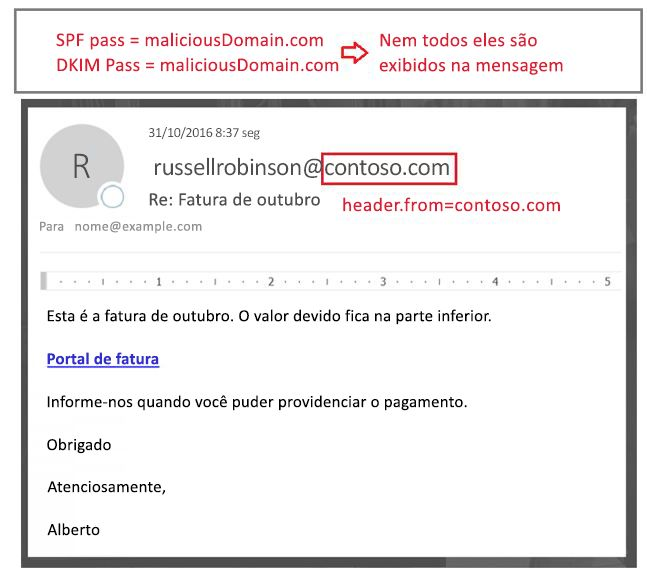

<span data-ttu-id="e3ee2-224">Por esse motivo, o Office 365 exige que o domínio no endereço De: se alinhe com o domínio na assinatura SPF ou DKIM e, se ele não se alinhar, que contenha alguns outros sinais internos que indiquem que a mensagem é legítima.</span><span class="sxs-lookup"><span data-stu-id="e3ee2-224">For that reason, Office 365 requires that the domain in the From: address aligns with the domain in the SPF or DKIM signature, and if it doesn't, contains some other internal signals that indicates that the message is legitimate.</span></span> <span data-ttu-id="e3ee2-225">Caso contrário, a mensagem será reprovada em compauth.</span><span class="sxs-lookup"><span data-stu-id="e3ee2-225">Otherwise, the message would be a compauth fail.</span></span>

```text
Authentication-Results: spf=none (sender IP is 5.6.7.8)
  smtp.mailfrom=maliciousDomain.com; contoso.com; dkim=pass
  (signature was verified) header.d=maliciousDomain.com;
  contoso.com; dmarc=none action=none header.from=contoso.com;
  compauth=fail reason=001
From: sender@contoso.com
To: someone@fabrikam.com
```

<span data-ttu-id="e3ee2-226">Portanto, a antifalsificação do Office 365 protege contra domínios sem autenticação e contra domínios que configuram a autenticação, mas não correspondem ao domínio no endereço De: porque ele é o que o usuário vê e acredita ser o remetente da mensagem.</span><span class="sxs-lookup"><span data-stu-id="e3ee2-226">Thus, Office 365 anti-spoofing protects against domains with no authentication, and against domains who set up authentication but mismatch against the domain in the From: address as that is the one that the user sees and believes is the sender of the message.</span></span> <span data-ttu-id="e3ee2-227">Isso vale para is domínios externos à sua organização e para os domínios dela.</span><span class="sxs-lookup"><span data-stu-id="e3ee2-227">This is true both of domains external to your organization, as well as domains within your organization.</span></span>

<span data-ttu-id="e3ee2-228">Portanto, se você receber uma mensagem que foi reprovada na autenticação composta e está marcada como falsificada, mesmo que a mensagem tenha sido aprovada no SPF e no DKIM, é porque o domínio que foi aprovado no SPF e no DKIM não está alinhado com o domínio no endereço De:.</span><span class="sxs-lookup"><span data-stu-id="e3ee2-228">Therefore, if you ever receive a message that failed composite authentication and is marked as spoofed, even though the message passed SPF and DKIM, it's because the domain that passed SPF and DKIM are not aligned with the domain in the From: address.</span></span>

### <a name="understanding-changes-in-how-spoofed-emails-are-treated"></a><span data-ttu-id="e3ee2-229">Entender as alterações na maneira como os emails falsificados são tratados</span><span class="sxs-lookup"><span data-stu-id="e3ee2-229">Understanding changes in how spoofed emails are treated</span></span>

<span data-ttu-id="e3ee2-230">Atualmente, para todas as organizações no Office 365 (com e sem ATP), as mensagens reprovadas no DMARC com uma política de rejeição ou quarentena são marcadas como spam e geralmente são submetidas à ação de spam de alta confiança ou, às vezes, à ação de spam regular (dependendo de outras regras de spam as identificarem primeiro como spam).</span><span class="sxs-lookup"><span data-stu-id="e3ee2-230">Currently, for all organizations in Office 365 - ATP and non-ATP - messages that fail DMARC with a policy of reject or quarantine are marked as spam and usually take the high confidence spam action, or sometimes the regular spam action (depending on whether other spam rules first identify it as spam).</span></span> <span data-ttu-id="e3ee2-231">Detecções de spoofs dentro da organização levam à ação regular de spam.</span><span class="sxs-lookup"><span data-stu-id="e3ee2-231">Intra-org spoof detections take the regular spam action.</span></span> <span data-ttu-id="e3ee2-232">Esse comportamento não precisa ser habilitado nem pode ser desabilitado.</span><span class="sxs-lookup"><span data-stu-id="e3ee2-232">This behavior does not need to be enabled, nor can it be disabled.</span></span>

<span data-ttu-id="e3ee2-233">No entanto, para mensagens de spoofing entre domínios, antes dessa alteração, elas passariam por verificações regulares de spam, phishing e malware, e se outras partes do filtro as identificassem como suspeitas, seriam marcadas como spam, phishing ou malware, respectivamente.</span><span class="sxs-lookup"><span data-stu-id="e3ee2-233">However, for cross-domain spoofing messages, before this change they would go through regular spam, phish, and malware checks and if other parts of the filter identified them as suspicious, would mark them as spam, phish, or malware respectively.</span></span> <span data-ttu-id="e3ee2-234">Com a nova proteção contra falsificação entre domínios, qualquer mensagem que não puder ser autenticada será submetida, por padrão, à ação definida na política Antiphishing \> Antifalsificação.</span><span class="sxs-lookup"><span data-stu-id="e3ee2-234">With the new cross-domain spoofing protection, any message that can't be authenticated will, by default, take the action defined in the Anti-phishing \> Anti-spoofing policy.</span></span> <span data-ttu-id="e3ee2-235">Se não houver uma definida, ela será movida para uma pasta Lixo Eletrônico do usuário.</span><span class="sxs-lookup"><span data-stu-id="e3ee2-235">If one is not defined, it will be moved to a users Junk Email folder.</span></span> <span data-ttu-id="e3ee2-236">Em alguns casos, mensagens mais suspeitas também terão a dica de segurança vermelha adicionada a elas.</span><span class="sxs-lookup"><span data-stu-id="e3ee2-236">In some cases, more suspicious messages will also have the red safety tip added to the message.</span></span>

<span data-ttu-id="e3ee2-237">Isso pode fazer com que algumas mensagens marcadas anteriormente como spam continuem sendo marcadas assim, mas agora elas também terão uma dica de segurança vermelha. Em outros casos, as mensagens marcadas como não spam começarão a ser marcadas como spam (CAT:SPOOF), com uma dica de segurança vermelha adicionada.</span><span class="sxs-lookup"><span data-stu-id="e3ee2-237">This may result in some messages that were previously marked as spam still getting marked as spam but will now also have a red safety tip; in other cases, messages that were previously marked as non-spam will start getting marked as spam (CAT:SPOOF) with a red safety tip added.</span></span> <span data-ttu-id="e3ee2-238">Em outros casos, os clientes que estavam movendo todos os itens de spam e phishing para a quarentena agora os verão na Pasta de Lixo Eletrônico (esse comportamento pode ser alterado; confira [Alterar suas configurações antifalsificação](#changing-your-anti-spoofing-settings)).</span><span class="sxs-lookup"><span data-stu-id="e3ee2-238">In still other cases, customers that were moving all spam and phish to the quarantine would now see them going to the Junk Mail Folder (this behavior can be changed, see [Changing your anti-spoofing settings](#changing-your-anti-spoofing-settings)).</span></span>

<span data-ttu-id="e3ee2-239">Há várias maneiras diferentes de falsificar uma mensagem (confira [Diferenciar entre tipos de falsificação](#differentiating-between-different-types-of-spoofing) anteriormente neste artigo), mas, em março de 2018, a maneira como o Office 365 trata essas mensagens ainda não está unificada.</span><span class="sxs-lookup"><span data-stu-id="e3ee2-239">There are multiple different ways a message can be spoofed (see  [Differentiating between different types of spoofing](#differentiating-between-different-types-of-spoofing) earlier in this article) but as of March 2018 the way Office 365 treats these messages is not yet unified.</span></span> <span data-ttu-id="e3ee2-240">A tabela a seguir é um resumo rápido, em que a proteção contra falsificação entre domínios é um novo comportamento:</span><span class="sxs-lookup"><span data-stu-id="e3ee2-240">The following table is a quick summary, with Cross-domain spoofing protection being new behavior:</span></span>

|<span data-ttu-id="e3ee2-241">**Tipo de falsificação**</span><span class="sxs-lookup"><span data-stu-id="e3ee2-241">**Type of spoof**</span></span>|<span data-ttu-id="e3ee2-242">**Categoria**</span><span class="sxs-lookup"><span data-stu-id="e3ee2-242">**Category**</span></span>|<span data-ttu-id="e3ee2-243">**Dica de segurança adicionada?**</span><span class="sxs-lookup"><span data-stu-id="e3ee2-243">**Safety tip added?**</span></span>|<span data-ttu-id="e3ee2-244">**Aplica-se a**</span><span class="sxs-lookup"><span data-stu-id="e3ee2-244">**Applies to**</span></span>|
|:-----|:-----|:-----|:-----|
|<span data-ttu-id="e3ee2-245">Reprovação no DMARC (quarentena ou rejeição)</span><span class="sxs-lookup"><span data-stu-id="e3ee2-245">DMARC fail (quarantine or reject)</span></span>|<span data-ttu-id="e3ee2-246">HSPM (padrão); também pode ser SPM ou PHSH</span><span class="sxs-lookup"><span data-stu-id="e3ee2-246">HSPM (default), may also be SPM or PHSH</span></span>|<span data-ttu-id="e3ee2-247">Não (ainda não)</span><span class="sxs-lookup"><span data-stu-id="e3ee2-247">No (not yet)</span></span>|<span data-ttu-id="e3ee2-248">Todos os clientes do Office 365, Outlook.com</span><span class="sxs-lookup"><span data-stu-id="e3ee2-248">All Office 365 customers, Outlook.com</span></span>|
|<span data-ttu-id="e3ee2-249">Self-to-self</span><span class="sxs-lookup"><span data-stu-id="e3ee2-249">Self-to-self</span></span>|<span data-ttu-id="e3ee2-250">SPM</span><span class="sxs-lookup"><span data-stu-id="e3ee2-250">SPM</span></span>|<span data-ttu-id="e3ee2-251">Sim</span><span class="sxs-lookup"><span data-stu-id="e3ee2-251">Yes</span></span>|<span data-ttu-id="e3ee2-252">Todas as organizações do Office 365, Outlook.com</span><span class="sxs-lookup"><span data-stu-id="e3ee2-252">All Office 365 organizations, Outlook.com</span></span>|
|<span data-ttu-id="e3ee2-253">Entre domínios</span><span class="sxs-lookup"><span data-stu-id="e3ee2-253">Cross-domain</span></span>|<span data-ttu-id="e3ee2-254">SPOOF</span><span class="sxs-lookup"><span data-stu-id="e3ee2-254">SPOOF</span></span>|<span data-ttu-id="e3ee2-255">Sim</span><span class="sxs-lookup"><span data-stu-id="e3ee2-255">Yes</span></span>|<span data-ttu-id="e3ee2-256">Clientes da Proteção Avançada contra Ameaças do Office 365 e E5</span><span class="sxs-lookup"><span data-stu-id="e3ee2-256">Office 365 Advanced Threat Protection and E5 customers</span></span>|

### <a name="changing-your-anti-spoofing-settings"></a><span data-ttu-id="e3ee2-257">Alterar suas configurações antifalsificação</span><span class="sxs-lookup"><span data-stu-id="e3ee2-257">Changing your anti-spoofing settings</span></span>

<span data-ttu-id="e3ee2-258">Para criar ou atualizar suas configurações antifalsificação (entre domínios), navegue até as configurações Antiphishing \> Antifalsificação na guia Política do Gerenciamento de Ameaças \> no Centro de Conformidade &amp; Segurança.</span><span class="sxs-lookup"><span data-stu-id="e3ee2-258">To create or update your (cross-domain) anti-spoofing settings, navigate to the Anti-phishing \> Anti-spoofing settings under the Threat Management \> Policy tab in the Security &amp; Compliance Center.</span></span> <span data-ttu-id="e3ee2-259">Se você nunca tiver criado uma configuração antiphishing, será necessário criar uma:</span><span class="sxs-lookup"><span data-stu-id="e3ee2-259">If you have never created any anti-phishing settings, you will need to create one:</span></span>

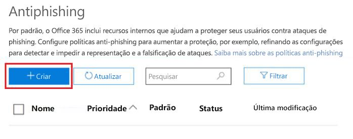

<span data-ttu-id="e3ee2-261">Se já tiver criado uma, você poderá selecioná-la para modificá-la:</span><span class="sxs-lookup"><span data-stu-id="e3ee2-261">If you've already created one, you can select it to modify it:</span></span>

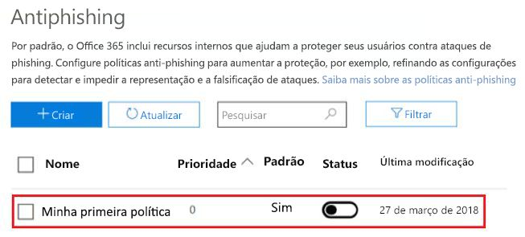

<span data-ttu-id="e3ee2-263">Selecione a política que você acabou de criar e siga as etapas descritas em [Saiba mais sobre a falsificação de informações](learn-about-spoof-intelligence.md).</span><span class="sxs-lookup"><span data-stu-id="e3ee2-263">Select the policy you just created and proceed through the steps as described in [Learn more about spoof intelligence](learn-about-spoof-intelligence.md).</span></span>

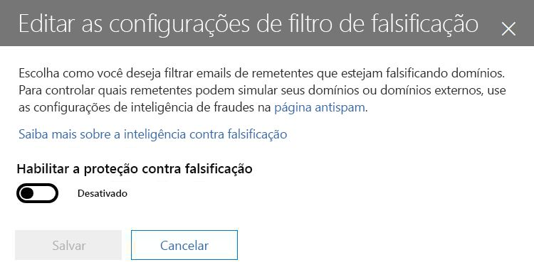

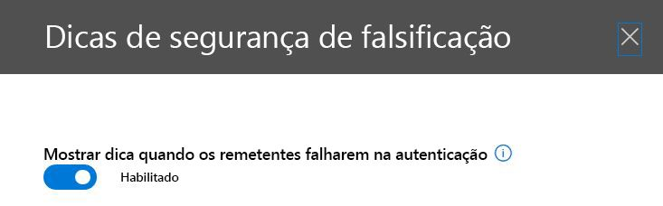

<span data-ttu-id="e3ee2-266">Para criar uma nova política usando o PowerShell:</span><span class="sxs-lookup"><span data-stu-id="e3ee2-266">To create a new policy by using PowerShell:</span></span>

```powershell
$org = Get-OrganizationConfig
$name = "My first anti-phishing policy for " + $org.Name
# Note: The name should not exclude 64 characters, including spaces.
# If it does, you will need to pick a smaller name.
# Next, create a new anti-phishing policy with the default values
New-AntiphishPolicy -Name $Name
# Select the domains to scope it to
# Multiple domains are specified in a comma-separated list
$domains = "domain1.com, domain2.com, domain3.com"
# Next, create the anti-phishing rule, scope it to the anti-phishing rule
New-AntiphishRule -Name $name -AntiphishPolicy $name -RecipientDomainIs $domains
```

<span data-ttu-id="e3ee2-267">Você pode modificar os parâmetros da política antiphishing usando o PowerShell, seguindo a documentação em [Set-AntiphishPolicy](https://docs.microsoft.com/powershell/module/exchange/advanced-threat-protection/Set-AntiPhishPolicy).</span><span class="sxs-lookup"><span data-stu-id="e3ee2-267">You may then modify the anti-phishing policy parameters using PowerShell, following the documentation at [Set-AntiphishPolicy](https://docs.microsoft.com/powershell/module/exchange/advanced-threat-protection/Set-AntiPhishPolicy).</span></span> <span data-ttu-id="e3ee2-268">Você pode especificar $name como parâmetro:</span><span class="sxs-lookup"><span data-stu-id="e3ee2-268">You may specify the $name as a parameter:</span></span>

```powershell
Set-AntiphishPolicy -Identity $name <fill in rest of parameters>
```

<span data-ttu-id="e3ee2-269">Mais adiante em 2018,em vez de você ter que criar uma política padrão, ela será criada para você com escopo para todos os destinatários de sua organização. Assim, você não precisará especificá-la manualmente (as capturas de tela a seguir estão sujeitas a alterações antes da implementação final).</span><span class="sxs-lookup"><span data-stu-id="e3ee2-269">Later in 2018, rather than you having to create a default policy, one will be created for you that is scoped to all the recipients in your organization so you don't have to specify it manually (the screenshots below are subject to change before the final implementation).</span></span>


<span data-ttu-id="e3ee2-271">Diferentemente de uma política que você cria, não é possível excluir a política padrão, modificar sua prioridade ou escolher quais usuários, domínios ou grupos estão no escopo para ela.</span><span class="sxs-lookup"><span data-stu-id="e3ee2-271">Unlike a policy that you create, you cannot delete the default policy, modify its priority, or choose which users, domains, or groups to scope it to.</span></span>

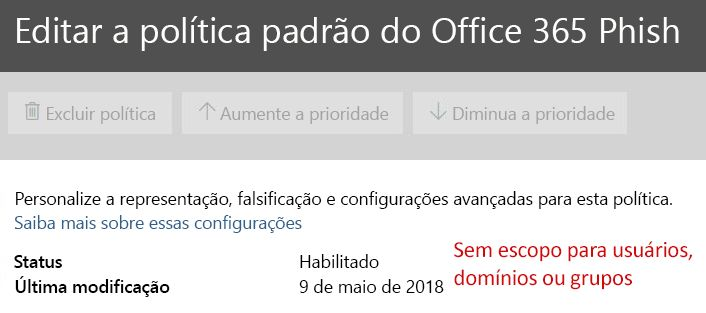

<span data-ttu-id="e3ee2-273">Para configurar sua proteção padrão usando o PowerShell:</span><span class="sxs-lookup"><span data-stu-id="e3ee2-273">To set up your default protection by using PowerShell:</span></span>

```powershell
$defaultAntiphishPolicy = Get-AntiphishPolicy | ? {$_.IsDefault -eq $true}
Set-AntiphishPolicy -Identity $defaultAntiphishPolicy.Name -EnableAntispoofEnforcement <$true|$false>
```

<span data-ttu-id="e3ee2-274">Você só deverá desabilitar a proteção antifalsificação se tiver outro servidor de email ou servidores na frente do Office 365 (confira Cenários legítimos para desabilitar a antifalsificação para obter mais detalhes).</span><span class="sxs-lookup"><span data-stu-id="e3ee2-274">You should only disable anti-spoofing protection if you have another mail server or servers in front of Office 365 (see Legitimate scenarios to disable anti-spoofing for more details).</span></span>

```powershell
$defaultAntiphishPolicy = Get-AntiphishiPolicy | ? {$_.IsDefault $true}
Set-AntiphishPolicy -Identity $defaultAntiphishPolicy.Name -EnableAntispoofEnforcement $false
```

> [!IMPORTANT]
> <span data-ttu-id="e3ee2-275">Se o primeiro salto (hop) no caminho de email for o Office 365 e você estiver recebendo muitos emails legítimos marcados como falsificação, primeiro configure os remetentes com permissão para enviar e-mails falsificados para seu domínio (confira a seção ["Gerenciar remetentes legítimos que estão enviando emails não autenticados"](#managing-legitimate-senders-who-are-sending-unauthenticated-email)).</span><span class="sxs-lookup"><span data-stu-id="e3ee2-275">If the first hop in your email path is Office 365, and you are getting too many legitimate emails marked as spoof, you should first set up your senders that are allowed to send spoofed email to your domain (see the  [Managing legitimate senders who are sending unauthenticated email](#managing-legitimate-senders-who-are-sending-unauthenticated-email) section in this topic.</span></span> <span data-ttu-id="e3ee2-276">Se você ainda está recebendo muitos falsos positivos (ou seja, mensagens legítimas marcadas como falsificação), NÃO recomendamos desabilitar a proteção antifalsificação.</span><span class="sxs-lookup"><span data-stu-id="e3ee2-276">If you are still getting too many false positives (that is, legitimate messages marked as spoof), we do NOT recommend disabling anti-spoofing protection altogether.</span></span> <span data-ttu-id="e3ee2-277">Em vez disso, recomendamos escolher a proteção Básica em vez de Alta.</span><span class="sxs-lookup"><span data-stu-id="e3ee2-277">Instead, we recommend choosing Basic instead of High protection.</span></span> <span data-ttu-id="e3ee2-278">É melhor trabalhar com falsos positivos do que expor sua organização a emails falsificados, o que poderia acabar acarretando custos significativamente mais altos em longo prazo.</span><span class="sxs-lookup"><span data-stu-id="e3ee2-278">It is better to work through false positives than to expose your organization to spoofed email which could end up imposing significantly higher costs in the long term.</span></span>

### <a name="managing-legitimate-senders-who-are-sending-unauthenticated-email"></a><span data-ttu-id="e3ee2-279">Gerenciar remetentes legítimos que estão enviando emails não autenticados</span><span class="sxs-lookup"><span data-stu-id="e3ee2-279">Managing legitimate senders who are sending unauthenticated email</span></span>

<span data-ttu-id="e3ee2-280">O Office 365 mantém o controle de quem está enviando emails não autenticados para sua organização.</span><span class="sxs-lookup"><span data-stu-id="e3ee2-280">Office 365 keeps track of who is sending unauthenticated email to your organization.</span></span> <span data-ttu-id="e3ee2-281">Se o serviço achar que o remetente não é legítimo, ele será marcado como uma falha de *compauth*.</span><span class="sxs-lookup"><span data-stu-id="e3ee2-281">If the service thinks the sender is not legitimate, it will mark it as a *compauth* failure.</span></span> <span data-ttu-id="e3ee2-282">Isso será classificado como SPOOF, embora dependa da política antifalsificação aplicada à mensagem.</span><span class="sxs-lookup"><span data-stu-id="e3ee2-282">This will be classified as SPOOF although it depends on your anti-spoofing policy that was applied to the message.</span></span>

<span data-ttu-id="e3ee2-283">No entanto, como administrador, você pode especificar quais remetentes têm permissão para enviar emails falsificados, substituindo a decisão do Office 365.</span><span class="sxs-lookup"><span data-stu-id="e3ee2-283">However, as an administrator, you can specify which senders are permitted to send spoofed email, overriding Office 365's decision.</span></span>

#### <a name="method-1---if-your-organization-owns-the-domain-set-up-email-authentication"></a><span data-ttu-id="e3ee2-284">Método 1 ‒ se sua organização possui o domínio, configure a autenticação de email</span><span class="sxs-lookup"><span data-stu-id="e3ee2-284">Method 1 - If your organization owns the domain, set up email authentication</span></span>

<span data-ttu-id="e3ee2-285">Esse método pode ser usado para resolver o spoofing dentro da organização e o spoofing entre domínios, nos casos em que você possui ou interage com vários locatários.</span><span class="sxs-lookup"><span data-stu-id="e3ee2-285">This method can be used to resolve intra-org spoofing, and cross-domain spoofing in cases where you own or interact with multiple tenants.</span></span> <span data-ttu-id="e3ee2-286">Também ajuda a resolver a falsificação entre domínios, em que você envia a outros clientes no Office 365 e também a terceiros hospedados em outros provedores.</span><span class="sxs-lookup"><span data-stu-id="e3ee2-286">It also helps resolve cross-domain spoofing where you send to other customers within Office 365, and also third parties that are hosted in other providers.</span></span>

<span data-ttu-id="e3ee2-287">Para obter mais detalhes, confira [Clientes do Office 365](#customers-of-office-365).</span><span class="sxs-lookup"><span data-stu-id="e3ee2-287">For more details, see [Customers of Office 365](#customers-of-office-365).</span></span>

#### <a name="method-2---use-spoof-intelligence-to-configure-permitted-senders-of-unauthenticated-email"></a><span data-ttu-id="e3ee2-288">Método 2 ‒ use a Inteligência contra Falsificação para configurar os remetentes permitidos de emails não autenticados</span><span class="sxs-lookup"><span data-stu-id="e3ee2-288">Method 2 - Use Spoof intelligence to configure permitted senders of unauthenticated email</span></span>

<span data-ttu-id="e3ee2-289">Você também pode usar a [Inteligência contra Falsificação](learn-about-spoof-intelligence.md) para permitir que os remetentes transmitam mensagens não autenticadas para sua organização.</span><span class="sxs-lookup"><span data-stu-id="e3ee2-289">You can also use [Spoof Intelligence](learn-about-spoof-intelligence.md) to permit senders to transmit unauthenticated messages to your organization.</span></span>

<span data-ttu-id="e3ee2-290">Para domínios externos, o usuário falsificado é o domínio no endereço De, enquanto a infraestrutura de envio é o endereço IP de envio (dividido em /24 intervalos CIDR) ou o domínio organizacional do registro PTR (na captura de tela a seguir, o IP de envio pode ser 131.107.18.4, cujo registro PTR é outbound.mail.protection.outlook.com, e isso seria exibido como outlook.com para a infraestrutura de envio).</span><span class="sxs-lookup"><span data-stu-id="e3ee2-290">For external domains, the spoofed user is the domain in the From address, while the sending infrastructure is either the sending IP address (divided up into /24 CIDR ranges), or the organizational domain of the PTR record (in the screenshot below, the sending IP might be 131.107.18.4 whose PTR record is outbound.mail.protection.outlook.com, and this would show up as outlook.com for the sending infrastructure).</span></span>

<span data-ttu-id="e3ee2-291">Para permitir que esse remetente envie emails não autenticados, altere **No** para **Yes**.</span><span class="sxs-lookup"><span data-stu-id="e3ee2-291">To permit this sender to send unauthenticated email, change the **No** to a **Yes**.</span></span>

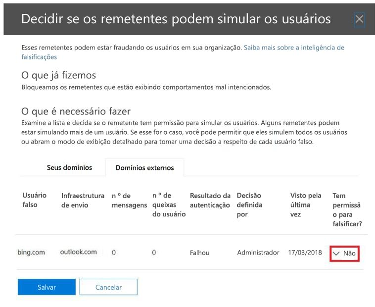

<span data-ttu-id="e3ee2-293">Você também pode usar o PowerShell para permitir que um remetente específico falsifique seu domínio:</span><span class="sxs-lookup"><span data-stu-id="e3ee2-293">You can also use PowerShell to allow specific sender to spoof your domain:</span></span>

```powershell
$file = "C:\My Documents\Summary Spoofed Internal Domains and Senders.csv"
Get-PhishFilterPolicy -Detailed -SpoofAllowBlockList -SpoofType External | Export-CSV $file
```


<span data-ttu-id="e3ee2-295">Na imagem anterior, foram adicionadas quebras de linha para ajustar a captura de tela.</span><span class="sxs-lookup"><span data-stu-id="e3ee2-295">In the previous image, additional line breaks have been added to make this screenshot fit.</span></span> <span data-ttu-id="e3ee2-296">Normalmente, todos os valores apareceriam em uma única linha.</span><span class="sxs-lookup"><span data-stu-id="e3ee2-296">Normally, all the values would appear on a single line.</span></span>

<span data-ttu-id="e3ee2-297">Edite o arquivo, procure a linha que corresponde a outlook.com e bing.com e altere a entrada AllowedToSpoof de No para Yes:</span><span class="sxs-lookup"><span data-stu-id="e3ee2-297">Edit the file and look for the line that corresponds to outlook.com and bing.com, and change the AllowedToSpoof entry from No to Yes:</span></span>


<span data-ttu-id="e3ee2-299">Salve o arquivo e execute:</span><span class="sxs-lookup"><span data-stu-id="e3ee2-299">Save the file, and then run:</span></span>

```powershell
$UpdateSpoofedSenders = Get-Content -Raw "C:\My Documents\Spoofed Senders.csv"
Set-PhishFilterPolicy -Identity Default -SpoofAllowBlockList $UpdateSpoofedSenders
```

<span data-ttu-id="e3ee2-300">Agora isso permitirá que bing.com envie emails não autenticados de \*.outlook.com.</span><span class="sxs-lookup"><span data-stu-id="e3ee2-300">This will now allow bing.com to send unauthenticated email from \*.outlook.com.</span></span>

#### <a name="method-3---create-an-allow-entry-for-the-senderrecipient-pair"></a><span data-ttu-id="e3ee2-301">Método 3 ‒ crie uma entrada de permissão para o par emissor/destinatário</span><span class="sxs-lookup"><span data-stu-id="e3ee2-301">Method 3 - Create an allow entry for the sender/recipient pair</span></span>

<span data-ttu-id="e3ee2-302">Você também pode optar por ignorar toda a filtragem de spam para determinado remetente.</span><span class="sxs-lookup"><span data-stu-id="e3ee2-302">You can also choose to bypass all spam filtering for a particular sender.</span></span> <span data-ttu-id="e3ee2-303">Para obter mais detalhes, confira [Como adicionar com segurança um remetente a uma lista de permissões no Office 365](https://blogs.msdn.microsoft.com/tzink/2017/11/29/how-to-securely-add-a-sender-to-an-allow-list-in-office-365/).</span><span class="sxs-lookup"><span data-stu-id="e3ee2-303">For more details, see [How to securely add a sender to an allow list in Office 365](https://blogs.msdn.microsoft.com/tzink/2017/11/29/how-to-securely-add-a-sender-to-an-allow-list-in-office-365/).</span></span>

<span data-ttu-id="e3ee2-304">Se você usar esse método, ele ignorará o spam e alguns dos filtros de phishing, mas não a filtragem de malware.</span><span class="sxs-lookup"><span data-stu-id="e3ee2-304">If you use this method, it will skip spam and some of the phish filtering, but not malware filtering.</span></span>

#### <a name="method-4---contact-the-sender-and-ask-them-to-set-up-email-authentication"></a><span data-ttu-id="e3ee2-305">Método 4 ‒ entre em contato com o remetente e peça que ele configure a autenticação de email</span><span class="sxs-lookup"><span data-stu-id="e3ee2-305">Method 4 - Contact the sender and ask them to set up email authentication</span></span>

<span data-ttu-id="e3ee2-306">Devido ao problema de spam e phishing, a Microsoft recomenda que todos os remetentes configurem a autenticação de email.</span><span class="sxs-lookup"><span data-stu-id="e3ee2-306">Because of the problem of spam and phishing, Microsoft recommends all senders set up email authentication.</span></span> <span data-ttu-id="e3ee2-307">Se você conhece um administrador do domínio de envio, entre em contato com ele e solicite que ele configure registros de autenticação de email para que você não precise adicionar nenhuma substituição.</span><span class="sxs-lookup"><span data-stu-id="e3ee2-307">If you know an administrator of the sending domain, contact them and request that they set up email authentication records so you do not have to add any overrides.</span></span> <span data-ttu-id="e3ee2-308">Para obter mais informações, confira [Administradores de domínios que não são clientes do Office 365](#administrators-of-domains-that-are-not-office-365-customers) mais adiante neste artigo.</span><span class="sxs-lookup"><span data-stu-id="e3ee2-308">For more information, see [Administrators of domains that are not Office 365 customers](#administrators-of-domains-that-are-not-office-365-customers)" later in this article.</span></span>

<span data-ttu-id="e3ee2-309">Embora inicialmente possa ser difícil enviar domínios para autenticação, com o passar do tempo, à medida que mais e mais filtros de email começarem a acumular ou até mesmo rejeitar seus emails, isso fará com que eles configurem os registros apropriados para melhorar a entrega.</span><span class="sxs-lookup"><span data-stu-id="e3ee2-309">While it may be difficult at first to get sending domains to authenticate, over time, as more and more email filters start junking or even rejecting their email, it will cause them to set up the proper records to ensure better delivery.</span></span>

### <a name="viewing-reports-of-how-many-messages-were-marked-as-spoofed"></a><span data-ttu-id="e3ee2-310">Exibir relatórios de quantas mensagens foram marcadas como falsificadas</span><span class="sxs-lookup"><span data-stu-id="e3ee2-310">Viewing reports of how many messages were marked as spoofed</span></span>

<span data-ttu-id="e3ee2-311">Depois que a política antifalsificação estiver habilitada, você poderá usar os recursos de resposta e investigação de ameaça para obter o número de mensagens marcadas como phishing.</span><span class="sxs-lookup"><span data-stu-id="e3ee2-311">Once your anti-spoofing policy is enabled, you can use threat investigation and response capabilities to get numbers around how many messages are marked as phish.</span></span> <span data-ttu-id="e3ee2-312">Para fazer isso, vá até o Centro de Conformidade &amp; Segurança, em Gerenciamento de Ameaças \> Explorer, defina a Exibição como Phish e agrupe por Domínio de Remetente ou Status de Proteção:</span><span class="sxs-lookup"><span data-stu-id="e3ee2-312">To do this, go into the Security &amp; Compliance Center (SCC) under Threat Management \> Explorer, set the View to Phish, and group by Sender Domain or Protection Status:</span></span>

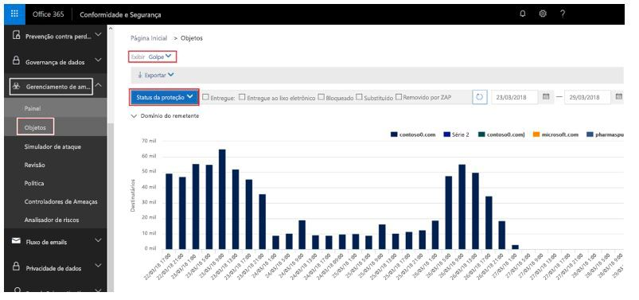

<span data-ttu-id="e3ee2-314">Você pode interagir com vários relatórios para ver quantas foram marcadas como phishing, inclusive mensagens marcadas como FALSAS.</span><span class="sxs-lookup"><span data-stu-id="e3ee2-314">You can interact with the various reports to see how many were marked as phishing, including messages marked as SPOOF.</span></span> <span data-ttu-id="e3ee2-315">Para saber mais, confira [Introdução à resposta e investigação de ameaças do Office 365](office-365-ti.md).</span><span class="sxs-lookup"><span data-stu-id="e3ee2-315">To learn more, see [Get started with Office 365 Threat investigation and response](office-365-ti.md).</span></span>

<span data-ttu-id="e3ee2-316">Você ainda não pode separar as mensagens que foram marcadas devido à falsificação de outros tipos de phishing (phishing geral, representação de domínio ou usuário e assim por diante).</span><span class="sxs-lookup"><span data-stu-id="e3ee2-316">You can't yet split out which messages were marked due to spoofing as opposed to other types of phishing (general phishing, domain or user impersonation, and so on).</span></span> <span data-ttu-id="e3ee2-317">No entanto, mais tarde, você poderá fazer isso por meio do Centro de Conformidade &amp; Segurança.</span><span class="sxs-lookup"><span data-stu-id="e3ee2-317">However, later, you will be able to do this through the Security &amp; Compliance Center.</span></span> <span data-ttu-id="e3ee2-318">Depois disso, você poderá usar esse relatório como ponto de partida para identificar domínios de envio que possam ser legítimos e que estejam sendo marcados como falsificação devido a falhas na autenticação.</span><span class="sxs-lookup"><span data-stu-id="e3ee2-318">Once you do, you can use this report as a starting place to identify sending domains that may be legitimate that are being marked as spoof due to failing authentication.</span></span>

<span data-ttu-id="e3ee2-319">A captura de tela a seguir é uma proposta da aparência que esses dados terão, mas eles poderão mudar quando forem lançados:</span><span class="sxs-lookup"><span data-stu-id="e3ee2-319">The following screenshot is a proposal for how this data will look, but may change when released:</span></span>

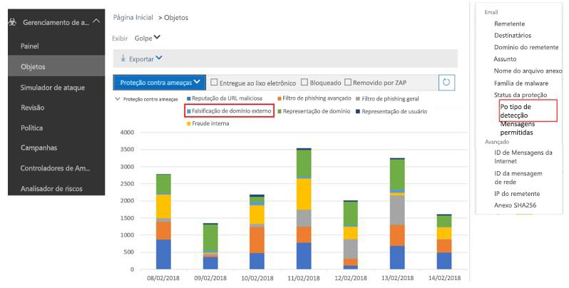

<span data-ttu-id="e3ee2-321">Para clientes não ATP e E5, esses relatórios estarão disponíveis mais tarde nos relatórios de TPS (Status de Proteção contra Ameaças), mas serão atrasados em pelo menos 24 horas.</span><span class="sxs-lookup"><span data-stu-id="e3ee2-321">For non-ATP and E5 customers, these reports will be available later under the Threat Protection Status (TPS) reports, but will be delayed by at least 24 hours.</span></span> <span data-ttu-id="e3ee2-322">Essa página será atualizada à medida que eles forem integrados ao Centro de Conformidade &amp; Segurança.</span><span class="sxs-lookup"><span data-stu-id="e3ee2-322">This page will be updated as they are integrated into the Security &amp; Compliance Center.</span></span>

### <a name="predicting-how-many-messages-will-be-marked-as-spoof"></a><span data-ttu-id="e3ee2-323">Prever quantas mensagens serão marcadas como falsas</span><span class="sxs-lookup"><span data-stu-id="e3ee2-323">Predicting how many messages will be marked as spoof</span></span>

<span data-ttu-id="e3ee2-324">Depois que o Office 365 atualizar suas configurações para permitir que você ative ou desative a imposição de antifalsificação com a imposição Básica ou Alta, você poderá ver como a disposição da mensagem será alterada nas várias configurações.</span><span class="sxs-lookup"><span data-stu-id="e3ee2-324">Once Office 365 updates its settings to let you turn the anti-spoofing enforcement Off, or on with Basic or High enforcement, you will be given the ability to see how message disposition will change at the various settings.</span></span> <span data-ttu-id="e3ee2-325">Ou seja, se a antifalsificação estiver desativada, você poderá ver quantas mensagens serão detectadas como Falsas se você ativar a opção Básica. Se ela for Básica, você poderá ver quantas outras mensagens serão detectadas como Falsas se você mudar para a opção Alta.</span><span class="sxs-lookup"><span data-stu-id="e3ee2-325">That is, if anti-spoofing is Off, you will be able to see how many messages will be detected as Spoof if you turn to Basic; or, if it's Basic, you will be able to see how many more messages will be detected as Spoof if you turn it to High.</span></span>

<span data-ttu-id="e3ee2-326">No momento esse recurso está em desenvolvimento.</span><span class="sxs-lookup"><span data-stu-id="e3ee2-326">This feature is currently under development.</span></span> <span data-ttu-id="e3ee2-327">À medida que mais detalhes forem definidos, essa página será atualizada com capturas de tela do Centro de Segurança e Conformidade e com exemplos do PowerShell.</span><span class="sxs-lookup"><span data-stu-id="e3ee2-327">As more details are defined, this page will be updated both with screenshots of the Security and Compliance Center, and with PowerShell examples.</span></span>

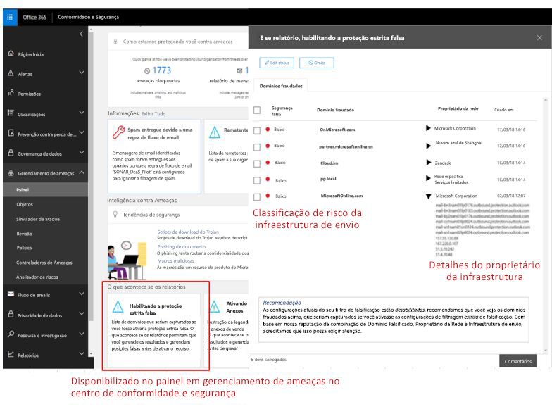

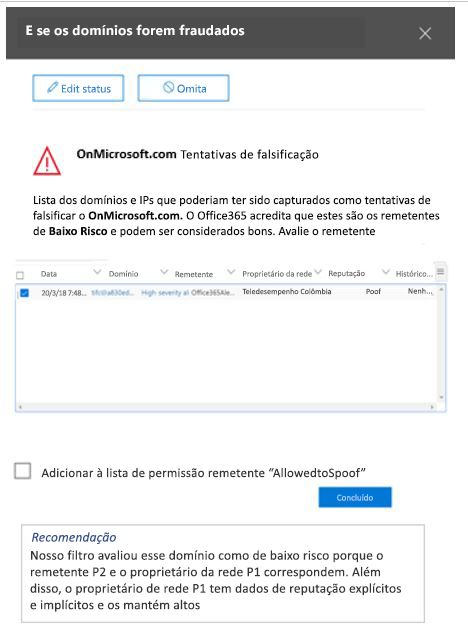

### <a name="legitimate-scenarios-to-disable-anti-spoofing"></a><span data-ttu-id="e3ee2-330">Cenários legítimos para desabilitar a antifalsificação</span><span class="sxs-lookup"><span data-stu-id="e3ee2-330">Legitimate scenarios to disable anti-spoofing</span></span>

<span data-ttu-id="e3ee2-331">A antifalsificação protege melhor os clientes contra ataques de phishing. Portanto, a desabilitação da proteção antifalsificação é altamente desencorajada.</span><span class="sxs-lookup"><span data-stu-id="e3ee2-331">Anti-spoofing better protects customers from phishing attacks, and therefore disabling anti-spoofing protection is strongly discouraged.</span></span> <span data-ttu-id="e3ee2-332">Se a desabilitar, você poderá resolver alguns falsos positivos de curto prazo, mas estará exposto a mais riscos em longo prazo.</span><span class="sxs-lookup"><span data-stu-id="e3ee2-332">By disabling it, you may resolve some short-term false positives, but long term you will be exposed to more risk.</span></span> <span data-ttu-id="e3ee2-333">O custo da configuração da autenticação no lado do remetente ou dos ajustes nas políticas de phishing geralmente envolve eventos únicos ou apenas manutenção mínima e periódica.</span><span class="sxs-lookup"><span data-stu-id="e3ee2-333">The cost for setting up authentication on the sender side, or making adjustments in the phishing policies, are usually one-time events or require only minimal, periodic maintenance.</span></span> <span data-ttu-id="e3ee2-334">No entanto, o custo para se recuperar de um ataque de phishing em que os dados foram expostos ou os ativos foram comprometidos é muito maior.</span><span class="sxs-lookup"><span data-stu-id="e3ee2-334">However, the cost to recover from a phishing attack where data has been exposed, or assets have been compromised is much higher.</span></span>

<span data-ttu-id="e3ee2-335">Por esse motivo, é melhor trabalhar com falsos positivos antifalsificação do que desabilitar a proteção antifalsificação.</span><span class="sxs-lookup"><span data-stu-id="e3ee2-335">For this reason, it is better to work through anti-spoofing false positives than to disable anti-spoof protection.</span></span>

<span data-ttu-id="e3ee2-336">No entanto, há um cenário legítimo em que a antifalsificação deve ser desabilitada. É quando há produtos adicionais de filtragem de mensagens no roteamento de mensagens, e o Office 365 não é o primeiro salto no caminho de email:</span><span class="sxs-lookup"><span data-stu-id="e3ee2-336">However, there is a legitimate scenario where anti-spoofing should be disabled, and that is when there are additional mail-filtering products in the message routing, and Office 365 is not the first hop in the email path:</span></span>

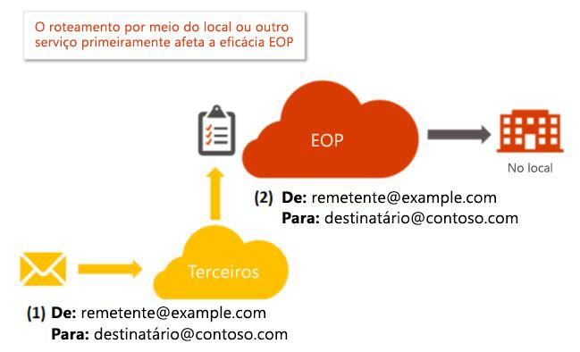

<span data-ttu-id="e3ee2-338">O outro servidor pode ser um servidor de correio local do Exchange, um dispositivo de filtragem de email, como o Ironport, ou outro serviço hospedado na nuvem.</span><span class="sxs-lookup"><span data-stu-id="e3ee2-338">The other server may be an Exchange on-premises mail server, a mail filtering device such as Ironport, or another cloud hosted service.</span></span>

<span data-ttu-id="e3ee2-339">Se o registro MX do domínio do destinatário não apontar para o Office 365, não será necessário desabilitar a antifalsificação porque o Office 365 procura o registro MX do domínio de recebimento e suprime a antifalsificação se ela aponta para outro serviço.</span><span class="sxs-lookup"><span data-stu-id="e3ee2-339">If the MX record of the recipient domain does not point to Office 365, then there is no need to disable anti-spoofing because Office 365 looks up your receiving domain's MX record and suppresses anti-spoofing if it points to another service.</span></span> <span data-ttu-id="e3ee2-340">Se você não sabe se seu domínio tem outro servidor diante dele, poderá usar um site como o MX Toolbox para pesquisar o registro MX.</span><span class="sxs-lookup"><span data-stu-id="e3ee2-340">If you don't know if your domain has another server in front, you can use a website like MX Toolbox to look up the MX record.</span></span> <span data-ttu-id="e3ee2-341">Ele poderá dizer algo como:</span><span class="sxs-lookup"><span data-stu-id="e3ee2-341">It might say something like the following:</span></span>

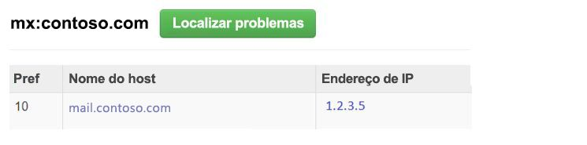

<span data-ttu-id="e3ee2-343">Esse domínio tem um registro MX que não aponta para o Office 365. Portanto, o Office 365 não aplicaria a imposição antifalsificação.</span><span class="sxs-lookup"><span data-stu-id="e3ee2-343">This domain has an MX record that does not point to Office 365, so Office 365 would not apply anti-spoofing enforcement.</span></span>

<span data-ttu-id="e3ee2-344">No entanto, se o registro MX do domínio do destinatário *apontar* para o Office 365, mesmo que haja outro serviço diante do Office 365, você deverá desabilitar a antifalsificação.</span><span class="sxs-lookup"><span data-stu-id="e3ee2-344">However, if the MX record of the recipient domain  *does*  point to Office 365, even though there is another service in front of Office 365, then you should disable anti-spoofing.</span></span> <span data-ttu-id="e3ee2-345">O exemplo mais comum é com o uso de uma reescrita de destinatário:</span><span class="sxs-lookup"><span data-stu-id="e3ee2-345">The most common example is through the use of a recipient rewrite:</span></span>

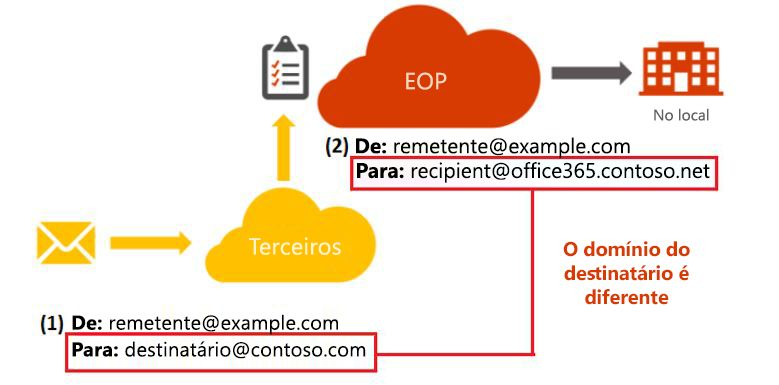

<span data-ttu-id="e3ee2-347">O registro MX do domínio contoso.com aponta para o servidor local, enquanto o registro MX do domínio @office365.contoso.net aponta para o Office 365 porque contém \*.protection.outlook.com ou \*.eo.outlook.com no registro MX:</span><span class="sxs-lookup"><span data-stu-id="e3ee2-347">The domain contoso.com's MX record points to the on-premises server, while the domain @office365.contoso.net's MX record points to Office 365 because it contains \*.protection.outlook.com, or \*.eo.outlook.com in the MX record:</span></span>

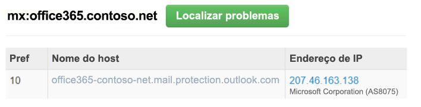

<span data-ttu-id="e3ee2-349">Diferencie quando o registro MX de um domínio de destinatário não aponta para o Office 365 e quando ele foi submetido a uma reescrita de destinatário.</span><span class="sxs-lookup"><span data-stu-id="e3ee2-349">Be sure to differentiate when a recipient domain's MX record does not point to Office 365, and when it has undergone a recipient rewrite.</span></span> <span data-ttu-id="e3ee2-350">É importante saber a diferença entre esses dois casos.</span><span class="sxs-lookup"><span data-stu-id="e3ee2-350">It is important to tell the difference between these two cases.</span></span>

<span data-ttu-id="e3ee2-351">Se você não tem certeza se seu domínio de recebimento foi ou não submetido a uma reescrita de destinatário, às vezes é possível determinar isso examinando os cabeçalhos das mensagens.</span><span class="sxs-lookup"><span data-stu-id="e3ee2-351">If you are unsure whether or not your receiving domain has undergone a recipient-rewrite, sometimes you can tell by looking at the message headers.</span></span>

<span data-ttu-id="e3ee2-352">a) Primeiro, examine os cabeçalhos na mensagem do domínio do destinatário no cabeçalho Authentication-Results:</span><span class="sxs-lookup"><span data-stu-id="e3ee2-352">a) First, look at the headers in the message for the recipient domain in the Authentication-Results header:</span></span>

```text
Authentication-Results: spf=fail (sender IP is 1.2.3.4)
  smtp.mailfrom=fabrikam.com; office365.contoso.net; dkim=fail
  (body hash did not verify) header.d=simple.fabrikam.com;
  office365.contoso.net; dmarc=none action=none
  header.from=fabrikam.com; compauth=fail reason=001
```

<span data-ttu-id="e3ee2-353">O domínio do destinatário é encontrado no texto em negrito acima; neste caso, é office365.contoso.net.</span><span class="sxs-lookup"><span data-stu-id="e3ee2-353">The recipient domain is found in the bold red text above, in this case office365.contoso.net.</span></span> <span data-ttu-id="e3ee2-354">Isso pode ser diferente do destinatário no cabeçalho Para:</span><span class="sxs-lookup"><span data-stu-id="e3ee2-354">This may be different that the recipient in the To: header:</span></span>

<span data-ttu-id="e3ee2-355">Para: Exemplo de Destinatário \<destinatário @ contoso.com\></span><span class="sxs-lookup"><span data-stu-id="e3ee2-355">To: Example Recipient \<recipient @ contoso.com\></span></span>

<span data-ttu-id="e3ee2-356">Execute uma pesquisa de registro MX do domínio real do destinatário.</span><span class="sxs-lookup"><span data-stu-id="e3ee2-356">Perform an MX-record lookup of the actual recipient domain.</span></span> <span data-ttu-id="e3ee2-357">Se ele contiver \*.protection.outlook.com, mail.messaging.microsoft.com, \*.eo.outlook.com ou mail.global.frontbridge.com, isso indicará que o MX aponta para o Office 365.</span><span class="sxs-lookup"><span data-stu-id="e3ee2-357">If it contains \*.protection.outlook.com, mail.messaging.microsoft.com, \*.eo.outlook.com, or mail.global.frontbridge.com, that means that the MX points to Office 365.</span></span>

<span data-ttu-id="e3ee2-358">Se não contiver esses valores, isso indicará que o MX não aponta para o Office 365.</span><span class="sxs-lookup"><span data-stu-id="e3ee2-358">If it does not contain those values, then it means that the MX does not point to Office 365.</span></span> <span data-ttu-id="e3ee2-359">Uma ferramenta que você pode usar para verificar isso é o MX Toolbox.</span><span class="sxs-lookup"><span data-stu-id="e3ee2-359">One tool you can use to verify this is MX Toolbox.</span></span>

<span data-ttu-id="e3ee2-360">Para esse exemplo específico, o seguinte item informa que contoso.com, o domínio que parece ser do destinatário, já que era o cabeçalho Para:, tem um registro MX que aponta para um servidor local:</span><span class="sxs-lookup"><span data-stu-id="e3ee2-360">For this particular example, the following says that contoso.com, the domain that looks like the recipient since it was the To: header, has MX record points to an on-prem server:</span></span>


<span data-ttu-id="e3ee2-362">No entanto, o destinatário real é office365.contoso.net, cujo registro MX aponta para o Office 365:</span><span class="sxs-lookup"><span data-stu-id="e3ee2-362">However, the actual recipient is office365.contoso.net whose MX record does point to Office 365:</span></span>

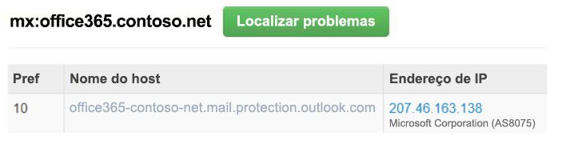

<span data-ttu-id="e3ee2-364">Portanto, essa mensagem provavelmente foi submetida à reescrita de destinatário.</span><span class="sxs-lookup"><span data-stu-id="e3ee2-364">Therefore, this message has likely undergone a recipient-rewrite.</span></span>

<span data-ttu-id="e3ee2-365">b) Em segundo lugar, diferencie os casos de uso comum de reescrita de destinatários.</span><span class="sxs-lookup"><span data-stu-id="e3ee2-365">b) Second, be sure to distinguish between common use cases of recipient rewrites.</span></span> <span data-ttu-id="e3ee2-366">Se você vai reescrever o domínio do destinatário para \*.onmicrosoft.com, em vez disso, reescreva-o para \*.mail.onmicrosoft.com.</span><span class="sxs-lookup"><span data-stu-id="e3ee2-366">If you are going to rewrite the recipient domain to \*.onmicrosoft.com, instead rewrite it to \*.mail.onmicrosoft.com.</span></span>

<span data-ttu-id="e3ee2-367">Após identificar o domínio do destinatário final roteado por trás de outro servidor e verificar se o registro MX do domínio do destinatário realmente aponta para o Office 365 (conforme publicado em seus registros DNS), você pode desabilitar a antifalsificação.</span><span class="sxs-lookup"><span data-stu-id="e3ee2-367">Once you have identified the final recipient domain that is routed behind another server and the recipient domain's MX record actually points to Office 365 (as published in its DNS records), you may proceed to disable anti-spoofing.</span></span>

<span data-ttu-id="e3ee2-368">Lembre-se: você não deverá desabilitar a antifalsificação se o primeiro salto do domínio no caminho de roteamento for o Office 365, mas somente quando ele estiver por trás de um ou mais serviços.</span><span class="sxs-lookup"><span data-stu-id="e3ee2-368">Remember, you don't want to disable anti-spoofing if the domain's first hop in the routing path is Office 365, only when it's behind one or more services.</span></span>

### <a name="how-to-disable-anti-spoofing"></a><span data-ttu-id="e3ee2-369">Como desabilitar a antifalsificação</span><span class="sxs-lookup"><span data-stu-id="e3ee2-369">How to disable anti-spoofing</span></span>

<span data-ttu-id="e3ee2-370">Se você já tiver criado uma política antiphishing, defina o parâmetro *EnableAntispoofEnforcement* como $false:</span><span class="sxs-lookup"><span data-stu-id="e3ee2-370">If you already have an Anti-phishing policy created, set the *EnableAntispoofEnforcement* parameter to $false:</span></span>

```powershell
$name = "<name of policy>"
Set-AntiphishPolicy -Identity $name -EnableAntiSpoofEnforcement $false
```

<span data-ttu-id="e3ee2-371">Se você não souber o nome da(s) política(s) a ser(em) desabilitada(s), poderá exibi-la(s):</span><span class="sxs-lookup"><span data-stu-id="e3ee2-371">If you don't know the name of the policy (or policies) to disable, you can display them:</span></span>

```powershell
Get-AntiphishPolicy | Format-List Name
```

<span data-ttu-id="e3ee2-372">Se não tiver políticas antiphishing, você poderá criar uma e desabilitá-la (mesmo que você não tenha uma política, a antifalsificação ainda será aplicada; mais adiante em 2018, uma política padrão será criada e você poderá então desabilitá-la em vez de criar uma).</span><span class="sxs-lookup"><span data-stu-id="e3ee2-372">If you don't have any existing anti-phishing policies, you can create one and then disable it (even if you don't have a policy, anti-spoofing is still applied; later on in 2018, a default policy will be created for you and you can then disable that instead of creating one).</span></span> <span data-ttu-id="e3ee2-373">Você terá que fazer isso em várias etapas:</span><span class="sxs-lookup"><span data-stu-id="e3ee2-373">You will have to do this in multiple steps:</span></span>

```powershell
$org = Get-OrganizationConfig
$name = "My first anti-phishing policy for " + $org.Name
# Note: If the name is more than 64 characters, you will need to choose a smaller one
```

```powershell
# Next, create a new anti-phishing policy with the default values
New-AntiphishPolicy -Name $Name
# Select the domains to scope it to
# Multiple domains are specified in a comma-separated list
$domains = "domain1.com, domain2.com, domain3.com"
# Next, create the anti-phishing rule, scope it to the anti-phishing rule
New-AntiphishRule -Name $name -AntiphishPolicy -RecipientDomainIs $domains
# Finally, scope the anti-phishing policy to the domains
Set-AntiphishPolicy -Identity $name -EnableAntispoofEnforcement $false
```

<span data-ttu-id="e3ee2-374">A desabilitação da antifalsificação está disponível apenas via cmdlet (mais tarde, ele estará disponível no Centro de Conformidade &amp; Segurança).</span><span class="sxs-lookup"><span data-stu-id="e3ee2-374">Disabling anti-spoofing is only available via cmdlet (later it will be available in the Security &amp; Compliance Center).</span></span> <span data-ttu-id="e3ee2-375">Se você não tiver acesso ao PowerShell, crie um tíquete de suporte.</span><span class="sxs-lookup"><span data-stu-id="e3ee2-375">If you do not have access to PowerShell, create a support ticket.</span></span>

<span data-ttu-id="e3ee2-376">Lembre-se: isso só deve ser aplicado a domínios que passam por roteamento indireto quando enviados para o Office 365.</span><span class="sxs-lookup"><span data-stu-id="e3ee2-376">Remember, this should only be applied to domains that undergo indirect routing when sent to Office 365.</span></span> <span data-ttu-id="e3ee2-377">Resista à tentação de desativar a antifalsificação por causa de alguns falsos positivos. Em longo prazo, será melhor lidar com eles.</span><span class="sxs-lookup"><span data-stu-id="e3ee2-377">Resist the temptation to disable anti-spoofing because of some false positives, it will be better in the long run to work through them.</span></span>

### <a name="information-for-individual-users"></a><span data-ttu-id="e3ee2-378">Informações para usuários individuais</span><span class="sxs-lookup"><span data-stu-id="e3ee2-378">Information for individual users</span></span>

<span data-ttu-id="e3ee2-379">Há limitações na maneira como usuários individuais podem interagir com a dica de segurança antifalsificação.</span><span class="sxs-lookup"><span data-stu-id="e3ee2-379">Individual users are limited in how they can interact with the anti-spoofing safety tip.</span></span> <span data-ttu-id="e3ee2-380">No entanto, há várias coisas que você pode fazer para resolver cenários comuns.</span><span class="sxs-lookup"><span data-stu-id="e3ee2-380">However, there are several things you can do to resolve common scenarios.</span></span>

### <a name="common-scenario-discussion-lists"></a><span data-ttu-id="e3ee2-381">Cenário comum: Listas de discussão</span><span class="sxs-lookup"><span data-stu-id="e3ee2-381">Common scenario: Discussion lists</span></span>

<span data-ttu-id="e3ee2-382">Sabe-se que as listas de discussão têm problemas com a antifalsificação, devido à maneira como encaminham mensagens e modificam o conteúdo, mas mantêm o endereço De: original.</span><span class="sxs-lookup"><span data-stu-id="e3ee2-382">Discussion lists are known to have problems with anti-spoofing due to the way they forward the message and modify its contents yet retain the original From: address.</span></span>

<span data-ttu-id="e3ee2-383">Por exemplo, vamos supor que Gabriela Laureano(glaureano @ contoso.com) esteja interessada em observação de aves e aderiu à lista observadoresdepássaros@ fabrikam.com.</span><span class="sxs-lookup"><span data-stu-id="e3ee2-383">For example, suppose Gabriela Laureano (glaureano @ contoso.com) is interested in bird watching and joins the discussion list birdwatchers @ fabrikam.com.</span></span> <span data-ttu-id="e3ee2-384">Quando uma mensagem é enviada à lista de discussão, ela tem a seguinte aparência:</span><span class="sxs-lookup"><span data-stu-id="e3ee2-384">When she send a message to the discussion list, it looks like this:</span></span>

> <span data-ttu-id="e3ee2-385">**De:** Gabriela Laureano \<glaureano @ contoso.com\></span><span class="sxs-lookup"><span data-stu-id="e3ee2-385">**From:** Gabriela Laureano \<glaureano @ contoso.com\></span></span> <br/> <span data-ttu-id="e3ee2-386">**Para:** Lista de Discussão de Observação de Pássaros \<observadoresdepássaros @ fabrikam.com\></span><span class="sxs-lookup"><span data-stu-id="e3ee2-386">**To:** Birdwatcher's Discussion List \<birdwatchers @ fabrikam.com\></span></span> <br/><span data-ttu-id="e3ee2-387"> \
\**Assunto:\** Excelente vista de galos azuis no topo do Monte.</span><span class="sxs-lookup"><span data-stu-id="e3ee2-387"> \
\**Subject:\** Great viewing of blue jays at the top of Mt.</span></span> <span data-ttu-id="e3ee2-388">Rainier esta semana</span><span class="sxs-lookup"><span data-stu-id="e3ee2-388">Rainier this week</span></span> <br/><br/><span data-ttu-id="e3ee2-389">Alguém quer conferir esta semana a vista do Monte</span><span class="sxs-lookup"><span data-stu-id="e3ee2-389">Anyone want to check out the viewing this week from Mt.</span></span> <span data-ttu-id="e3ee2-390">Rainier?</span><span class="sxs-lookup"><span data-stu-id="e3ee2-390">Rainier?</span></span>

<span data-ttu-id="e3ee2-391">Quando a lista de emails recebe a mensagem, ela a formata, modificando o seu conteúdo e a reproduz para o restante dos membros da lista de discussão, composta de participantes de vários destinatários de email diferentes.</span><span class="sxs-lookup"><span data-stu-id="e3ee2-391">When the email list receives the message, they format the message, modify its contents, and replay it to the rest of the members on the discussion list which, is made up of participants from many different email receivers.</span></span>

> <span data-ttu-id="e3ee2-392">**De:** Gabriela Laureano \<glaureano @ contoso.com\></span><span class="sxs-lookup"><span data-stu-id="e3ee2-392">**From:** Gabriela Laureano \<glaureano @ contoso.com\></span></span> <br/> <span data-ttu-id="e3ee2-393">**Para:** Lista de Discussão de Observação de Pássaros \<observadoresdepássaros @ fabrikam.com\></span><span class="sxs-lookup"><span data-stu-id="e3ee2-393">**To:** Birdwatcher's Discussion List \<birdwatchers @ fabrikam.com\></span></span> <br/> <span data-ttu-id="e3ee2-394">**Assunto:** [OBSERVAÇÃODEPÁSSAROS] Belo exemplo de gaios azuis no topo do Monte</span><span class="sxs-lookup"><span data-stu-id="e3ee2-394">**Subject:** [BIRDWATCHERS] Great viewing of blue jays at the top of Mt.</span></span> <span data-ttu-id="e3ee2-395">Rainier esta semana</span><span class="sxs-lookup"><span data-stu-id="e3ee2-395">Rainier this week</span></span> <br/><br/> <span data-ttu-id="e3ee2-396">Alguém quer conferir esta semana a vista do Monte</span><span class="sxs-lookup"><span data-stu-id="e3ee2-396">Anyone want to check out the viewing this week from Mt.</span></span> <span data-ttu-id="e3ee2-397">Rainier?</span><span class="sxs-lookup"><span data-stu-id="e3ee2-397">Rainier?</span></span> <br/><br/> <span data-ttu-id="e3ee2-398">Esta mensagem foi enviada para a lista de discussão de Observação de Pássaros.</span><span class="sxs-lookup"><span data-stu-id="e3ee2-398">This message was sent to the Birdwatchers Discussion List.</span></span> <span data-ttu-id="e3ee2-399">Você pode cancelar a assinatura a qualquer momento.</span><span class="sxs-lookup"><span data-stu-id="e3ee2-399">You can unsubscribe at any time.</span></span>

<span data-ttu-id="e3ee2-400">No exemplo acima, a mensagem repetida tem o mesmo endereço De: (usuario @ contoso.com), mas a mensagem original foi modificada com a adição de uma marca à linha Assunto e de um rodapé à parte inferior da mensagem.</span><span class="sxs-lookup"><span data-stu-id="e3ee2-400">In this example, the replayed message has the same From: address (glaureano @ contoso.com) but the original message has been modified by adding a tag to the Subject line, and a footer to the bottom of the message.</span></span> <span data-ttu-id="e3ee2-401">Esse tipo de modificação de mensagem é comum em listas de discussão e pode resultar em falsos positivos.</span><span class="sxs-lookup"><span data-stu-id="e3ee2-401">This type of message modification is common in mailing lists, and may result in false positives.</span></span>

<span data-ttu-id="e3ee2-402">Se você ou alguém de sua organização for um administrador de lista de discussão, você poderá configurá-la para aprovação em verificações antifalsificação.</span><span class="sxs-lookup"><span data-stu-id="e3ee2-402">If you or someone in your organization is an administrator of the mailing list, you may be able to configure it to pass anti-spoofing checks.</span></span>

- <span data-ttu-id="e3ee2-403">Confira as perguntas frequentes em DMARC.org: [Opero uma lista de discussão e quero interoperar com o DMARC. O que devo fazer?](https://dmarc.org/wiki/FAQ#I_operate_a_mailing_list_and_I_want_to_interoperate_with_DMARC.2C_what_should_I_do.3F)</span><span class="sxs-lookup"><span data-stu-id="e3ee2-403">Check the FAQ at DMARC.org: [I operate a mailing list and I want to interoperate with DMARC, what should I do?](https://dmarc.org/wiki/FAQ#I_operate_a_mailing_list_and_I_want_to_interoperate_with_DMARC.2C_what_should_I_do.3F)</span></span>

- <span data-ttu-id="e3ee2-404">Leia as instruções nesta postagem do blog: [Uma dica para operadores de listas de discussão interoperarem com o DMARC para evitar falhas](https://blogs.msdn.microsoft.com/tzink/2017/03/22/a-tip-for-mailing-list-operators-to-interoperate-with-dmarc-to-avoid-failures/)</span><span class="sxs-lookup"><span data-stu-id="e3ee2-404">Read the instructions at this blog post: [A tip for mailing list operators to interoperate with DMARC to avoid failures](https://blogs.msdn.microsoft.com/tzink/2017/03/22/a-tip-for-mailing-list-operators-to-interoperate-with-dmarc-to-avoid-failures/)</span></span>

- <span data-ttu-id="e3ee2-405">Considere a instalação de atualizações em seu servidor de lista de discussão para dar suporte ao ARC. Veja [https://arc-spec.org](https://arc-spec.org/)</span><span class="sxs-lookup"><span data-stu-id="e3ee2-405">Consider installing updates on your mailing list server to support ARC, see [https://arc-spec.org](https://arc-spec.org/)</span></span>

<span data-ttu-id="e3ee2-406">Se você não for o proprietário da lista de endereços:</span><span class="sxs-lookup"><span data-stu-id="e3ee2-406">If you don't own the mailing list:</span></span>

- <span data-ttu-id="e3ee2-407">Você pode solicitar que o mantenedor da lista de discussão implemente uma das opções acima (ele também deve configurar a autenticação de email para o domínio do qual a lista de discussão está sendo retransmitida)</span><span class="sxs-lookup"><span data-stu-id="e3ee2-407">You can request the maintainer of the mailing list to implement one of the previous options (they should also have email authentication set up for the domain the mailing list is relaying from).</span></span>

- <span data-ttu-id="e3ee2-408">Você pode criar regras de caixa de correio em seu cliente de email para mover mensagens para a Caixa de Entrada.</span><span class="sxs-lookup"><span data-stu-id="e3ee2-408">You can create mailbox rules in your email client to move messages to the Inbox.</span></span> <span data-ttu-id="e3ee2-409">Você também pode solicitar que os administradores de sua organização configurem regras de permissão ou substituições, conforme discutido sobre o tópico na seção[Gerenciar remetentes legítimos que estão enviando emails não autenticados](#managing-legitimate-senders-who-are-sending-unauthenticated-email).</span><span class="sxs-lookup"><span data-stu-id="e3ee2-409">You can also request your organization's administrators to set up allow rules, or overrides as discussed in the [Managing legitimate senders who are sending unauthenticated email](#managing-legitimate-senders-who-are-sending-unauthenticated-email)section in this topic.</span></span>

- <span data-ttu-id="e3ee2-410">Você pode criar um tíquete de suporte com o Office 365 para criar uma sobreposição de métodos (override) para a lista de distribuição a fim de tratá-la como legítima.</span><span class="sxs-lookup"><span data-stu-id="e3ee2-410">You can create a support ticket with Office 365 to create an override for the mailing list to treat it as legitimate.</span></span>

### <a name="other-scenarios"></a><span data-ttu-id="e3ee2-411">Outros cenários</span><span class="sxs-lookup"><span data-stu-id="e3ee2-411">Other scenarios</span></span>

1. <span data-ttu-id="e3ee2-412">Se nenhum dos cenários comuns acima se aplicar à sua situação, relate a mensagem como um falso positivo para a Microsoft.</span><span class="sxs-lookup"><span data-stu-id="e3ee2-412">If neither of the above common scenarios applies to your situation, report the message as a false positive back to Microsoft.</span></span> <span data-ttu-id="e3ee2-413">Para obter mais informações, confira a seção [Como relatar mensagens de spam ou não spam à Microsoft?](#how-can-i-report-spam-or-non-spam-messages-back-to-microsoft) mais adiante neste artigo.</span><span class="sxs-lookup"><span data-stu-id="e3ee2-413">For more information, see the section [How can I report spam or non-spam messages back to Microsoft?](#how-can-i-report-spam-or-non-spam-messages-back-to-microsoft) later in this article.</span></span>

2. <span data-ttu-id="e3ee2-414">Você também pode entrar em contato com seu administrador de email, que pode criar um tíquete de suporte na Microsoft.</span><span class="sxs-lookup"><span data-stu-id="e3ee2-414">You may also contact your email administrator who can raise it as a support ticket with Microsoft.</span></span> <span data-ttu-id="e3ee2-415">A equipe de engenharia da Microsoft investigará por que a mensagem foi marcada como uma falsificação.</span><span class="sxs-lookup"><span data-stu-id="e3ee2-415">The Microsoft engineering team will investigate why the message was marked as a spoof.</span></span>

3. <span data-ttu-id="e3ee2-416">Além disso, se você souber quem é o remetente e tiver certeza de que ele não está sendo falsificado de forma mal-intencionada, poderá responder ao remetente para indicar que ele está enviando mensagens de um servidor de email que não está autenticado.</span><span class="sxs-lookup"><span data-stu-id="e3ee2-416">Additionally, if you know who the sender is and are confident they are not being maliciously spoofed, you may reply back to the sender indicating that they are sending messages from a mail server that does not authenticate.</span></span> <span data-ttu-id="e3ee2-417">Às vezes isso faz com que o remetente original entre em contato com o administrador de TI, que configurará os registros de autenticação de email necessários.</span><span class="sxs-lookup"><span data-stu-id="e3ee2-417">This sometimes results in the original sender contacting their IT administrator who will set up the required email authentication records.</span></span>

   <span data-ttu-id="e3ee2-418">Quando um número suficiente de remetentes responde aos proprietários do domínio que devem configurar registros de autenticação de email, isso os incentiva a agir.</span><span class="sxs-lookup"><span data-stu-id="e3ee2-418">When enough senders reply back to domain owners that they should set up email authentication records, it spurs them into taking action.</span></span> <span data-ttu-id="e3ee2-419">Embora a Microsoft também trabalhe com proprietários de domínio para publicar os registros necessários, é ainda mais eficaz quando usuários individuais solicitam isso.</span><span class="sxs-lookup"><span data-stu-id="e3ee2-419">While Microsoft also works with domain owners to publish the required records, it helps even more when individual users request it.</span></span>

4. <span data-ttu-id="e3ee2-420">Opcionalmente, adicione o remetente à sua lista de Remetentes Confiáveis.</span><span class="sxs-lookup"><span data-stu-id="e3ee2-420">Optionally, add the sender to your Safe Senders list.</span></span> <span data-ttu-id="e3ee2-421">No entanto, lembre-se de que, se um phisher falsificar essa conta, ela será entregue em sua caixa postal.</span><span class="sxs-lookup"><span data-stu-id="e3ee2-421">However, be aware that if a phisher spoofs that account, it will be delivered to your mailbox.</span></span> <span data-ttu-id="e3ee2-422">Portanto, essa opção deve ser usada com moderação.</span><span class="sxs-lookup"><span data-stu-id="e3ee2-422">Therefore, this option should be used sparingly.</span></span>

## <a name="how-senders-to-microsoft-should-prepare-for-anti-spoofing-protection"></a><span data-ttu-id="e3ee2-423">Como os remetentes para a Microsoft devem se preparar para proteção antifalsificação</span><span class="sxs-lookup"><span data-stu-id="e3ee2-423">How senders to Microsoft should prepare for anti-spoofing protection</span></span>

<span data-ttu-id="e3ee2-424">Se você é um administrador que atualmente envia mensagens para a Microsoft, para o Office 365 ou o Outlook.com, deve garantir que seu email esteja devidamente autenticado. Caso contrário, ele poderá ser marcado como spam ou phishing.</span><span class="sxs-lookup"><span data-stu-id="e3ee2-424">If you are an administrator who currently sends messages to Microsoft, either Office 365 or Outlook.com, you should ensure that your email is properly authenticated otherwise it may be marked as spam or phish.</span></span>

### <a name="customers-of-office-365"></a><span data-ttu-id="e3ee2-425">Clientes do Office 365</span><span class="sxs-lookup"><span data-stu-id="e3ee2-425">Customers of Office 365</span></span>

<span data-ttu-id="e3ee2-426">Se você é um cliente do Office 365 e usa o Office 365 para enviar emails de saída:</span><span class="sxs-lookup"><span data-stu-id="e3ee2-426">If you are an Office 365 customer and you use Office 365 to send outbound email:</span></span>

- <span data-ttu-id="e3ee2-427">Para seus domínios, [Configure o SPF no Office 365 para impedir a falsificação](set-up-spf-in-office-365-to-help-prevent-spoofing.md)</span><span class="sxs-lookup"><span data-stu-id="e3ee2-427">For your domains, [Set up SPF in Office 365 to help prevent spoofing](set-up-spf-in-office-365-to-help-prevent-spoofing.md)</span></span>

- <span data-ttu-id="e3ee2-428">Para seus domínios primários, [Use o DKIM para validar emails de saída enviados de seu domínio personalizado no Office 365](use-dkim-to-validate-outbound-email.md)</span><span class="sxs-lookup"><span data-stu-id="e3ee2-428">For your primary domains, [Use DKIM to validate outbound email sent from your custom domain in Office 365](use-dkim-to-validate-outbound-email.md)</span></span>

- <span data-ttu-id="e3ee2-429">[Considere a configuração de registros DMARC](use-dmarc-to-validate-email.md) para seu domínio a fim de determinar quem são seus remetentes legítimos</span><span class="sxs-lookup"><span data-stu-id="e3ee2-429">[Consider setting up DMARC records](use-dmarc-to-validate-email.md) for your domain to determine who are your legitimate senders</span></span>

<span data-ttu-id="e3ee2-430">A Microsoft não fornece diretrizes de implementação detalhadas para SPF, DKIM e DMARC.</span><span class="sxs-lookup"><span data-stu-id="e3ee2-430">Microsoft does not provide detailed implementation guidelines for each of SPF, DKIM, and DMARC.</span></span> <span data-ttu-id="e3ee2-431">No entanto, há muitas informações publicadas online.</span><span class="sxs-lookup"><span data-stu-id="e3ee2-431">However, there is a lot of information published online.</span></span> <span data-ttu-id="e3ee2-432">Também há empresas de terceiros dedicadas a ajudar sua organização a configurar registros de autenticação de email.</span><span class="sxs-lookup"><span data-stu-id="e3ee2-432">There are also 3rd party companies dedicated to helping your organization set up email authentication records.</span></span>

### <a name="administrators-of-domains-that-are-not-office-365-customers"></a><span data-ttu-id="e3ee2-433">Administradores de domínios que não são clientes do Office 365</span><span class="sxs-lookup"><span data-stu-id="e3ee2-433">Administrators of domains that are not Office 365 customers</span></span>

<span data-ttu-id="e3ee2-434">Se você é um administrador de domínio, mas não é cliente do Office 365:</span><span class="sxs-lookup"><span data-stu-id="e3ee2-434">If you are a domain administrator but are not an Office 365 customer:</span></span>

- <span data-ttu-id="e3ee2-435">Você deve configurar o SPF para publicar os endereços IP de envio de seu domínio e também configurar o DKIM (se disponível) para assinar digitalmente as mensagens.</span><span class="sxs-lookup"><span data-stu-id="e3ee2-435">You should set up SPF to publish your domain's sending IP addresses, and also set up DKIM (if available) to digitally sign messages.</span></span> <span data-ttu-id="e3ee2-436">Você também pode considerar a configuração de registros DMARC.</span><span class="sxs-lookup"><span data-stu-id="e3ee2-436">You may also consider setting up DMARC records.</span></span>

- <span data-ttu-id="e3ee2-437">Se você tiver remetentes em massa que transmitem emails em seu nome, trabalhe com eles para enviar emails de forma que o domínio de envio no endereço De: (se pertencer a você) esteja alinhado ao domínio aprovado por SPF ou DMARC.</span><span class="sxs-lookup"><span data-stu-id="e3ee2-437">If you have bulk senders who are transmitting email on your behalf, you should work with them to send email in a way such that the sending domain in the From: address (if it belongs to you) aligns with the domain that passes SPF or DMARC.</span></span>

- <span data-ttu-id="e3ee2-438">Se você tiver servidores de email locais, enviar de um provedor de software como um serviço ou de um serviço de hospedagem na nuvem como Microsoft Azure, GoDaddy, Rackspace, Amazon Web Services ou semelhante, garanta que eles sejam adicionado ao registro SPF.</span><span class="sxs-lookup"><span data-stu-id="e3ee2-438">If you have on-premises mail servers, or send from a Software-as-a-service provider, or from a cloud-hosting service like Microsoft Azure, GoDaddy, Rackspace, Amazon Web Services, or similar, you should ensure that they are added to your SPF record.</span></span>

- <span data-ttu-id="e3ee2-439">Se você é um pequeno domínio hospedado por um ISP, deve configurar seu registro SPF de acordo com as instruções fornecidas pelo ISP.</span><span class="sxs-lookup"><span data-stu-id="e3ee2-439">If you are a small domain that is hosted by an ISP, you should set up your SPF record according to the instructions that is provided to you by your ISP.</span></span> <span data-ttu-id="e3ee2-440">A maioria dos ISPs fornece esses tipos de instruções, e elas podem ser encontradas nas páginas de suporte da empresa.</span><span class="sxs-lookup"><span data-stu-id="e3ee2-440">Most ISPs provide these types of instructions and can be found on the company's support pages.</span></span>

- <span data-ttu-id="e3ee2-441">Mesmo que você não tenha precisado publicar registros de autenticação de email antes e isso tenha funcionado bem, ainda deverá publicar registros de autenticação de email para enviar à Microsoft.</span><span class="sxs-lookup"><span data-stu-id="e3ee2-441">Even if you have not had to publish email authentication records before, and it worked fine, you must still publish email authentication records to send to Microsoft.</span></span> <span data-ttu-id="e3ee2-442">Fazendo isso, você ajuda na luta contra o phishing e reduz a possibilidade de que você ou organizações para as quais envia sejam afetados por phishing.</span><span class="sxs-lookup"><span data-stu-id="e3ee2-442">By doing so, you are helping in the fight against phishing, and reducing the possibility that either you, or organizations you send to, will get phished.</span></span>

### <a name="what-if-you-dont-know-who-sends-email-as-your-domain"></a><span data-ttu-id="e3ee2-443">E se você não souber quem envia emails como seu domínio?</span><span class="sxs-lookup"><span data-stu-id="e3ee2-443">What if you don't know who sends email as your domain?</span></span>

<span data-ttu-id="e3ee2-444">Muitos domínios não publicam registros SPF porque não sabem quem são todos os seus remetentes.</span><span class="sxs-lookup"><span data-stu-id="e3ee2-444">Many domains do not publish SPF records because they do not know who all their senders are.</span></span> <span data-ttu-id="e3ee2-445">Não há problemas. Você não precisa saber quem são todos eles.</span><span class="sxs-lookup"><span data-stu-id="e3ee2-445">That's okay, you do not need to know who all of them are.</span></span> <span data-ttu-id="e3ee2-446">Em vez disso, você deve começar publicando um registro SPF daqueles dos quais você tem conhecimento, especialmente onde o tráfego corporativo está localizado, e publicar uma política de SPF neutra, `?all`:</span><span class="sxs-lookup"><span data-stu-id="e3ee2-446">Instead, you should get started by publishing an SPF record for the ones you do know of, especially where your corporate traffic is located, and publish a neutral SPF policy, `?all`:</span></span>

```text
fabrikam.com IN TXT "v=spf1 include:spf.fabrikam.com ?all"
```

<span data-ttu-id="e3ee2-447">A política de SPF neutra significa que qualquer email que saia de sua infraestrutura corporativa passará pela autenticação de email em todos os outros destinatários de email.</span><span class="sxs-lookup"><span data-stu-id="e3ee2-447">The neutral SPF policy means that any email that comes out of your corporate infrastructure will pass email authentication at all other email receivers.</span></span> <span data-ttu-id="e3ee2-448">O email proveniente de remetentes que você não conhece retornará ao nível neutro, o que é quase o mesmo que não publicar um registro SPF.</span><span class="sxs-lookup"><span data-stu-id="e3ee2-448">Email that comes from senders you don't know about will fall back to neutral, which is almost the same as publishing no SPF record at all.</span></span>

<span data-ttu-id="e3ee2-449">Ao enviar para o Office 365, os emails provenientes de seu tráfego corporativo serão marcados como autenticados, mas os emails provenientes de fontes que você não conhece ainda poderão ser marcados como falsificados (dependendo de o Office 365 poder autenticá-los implicitamente ou não).</span><span class="sxs-lookup"><span data-stu-id="e3ee2-449">When sending to Office 365, email that comes from your corporate traffic will be marked as authenticated, but the email that comes from sources you don't know about may still be marked as spoof (depending upon whether or not Office 365 can implicitly authenticate it).</span></span> <span data-ttu-id="e3ee2-450">No entanto, isso ainda é uma melhoria em relação à situação em que todos os emails são marcados como falsificação pelo Office 365.</span><span class="sxs-lookup"><span data-stu-id="e3ee2-450">However, this is still an improvement from all email being marked as spoof by Office 365.</span></span>

<span data-ttu-id="e3ee2-451">Após começar a usar um registro SPF com a política de fallback ?all, você pode gradualmente incluir mais infraestrutura de envio e publicar uma política mais rígida.</span><span class="sxs-lookup"><span data-stu-id="e3ee2-451">Once you've gotten started with an SPF record with a fallback policy of ?all, you can gradually include more and more sending infrastructure and then publish a stricter policy.</span></span>

### <a name="what-if-you-are-the-owner-of-a-mailing-list"></a><span data-ttu-id="e3ee2-452">E se você for o proprietário de uma lista de discussão?</span><span class="sxs-lookup"><span data-stu-id="e3ee2-452">What if you are the owner of a mailing list?</span></span>

<span data-ttu-id="e3ee2-453">Confira a seção[Cenário comum: Listas de discussão](#common-scenario-discussion-lists) sobre o tópico.</span><span class="sxs-lookup"><span data-stu-id="e3ee2-453">See the [Common scenario: Discussion lists](#common-scenario-discussion-lists) section earlier in this topic.</span></span>

### <a name="what-if-you-are-an-infrastructure-provider-such-as-an-internet-service-provider-isp-email-service-provider-esp-or-cloud-hosting-service"></a><span data-ttu-id="e3ee2-454">E se você for um provedor de infraestrutura, como um ISP (Provedor de Serviços de Internet), um ESP (Provedor de Serviços de Email) ou um serviço de hospedagem na nuvem?</span><span class="sxs-lookup"><span data-stu-id="e3ee2-454">What if you are an infrastructure provider such as an Internet Service Provider (ISP), Email Service Provider (ESP), or cloud hosting service?</span></span>

<span data-ttu-id="e3ee2-455">Se você hospedar o email de um domínio, e ele enviar um email ou fornecer uma infraestrutura de hospedagem que possa enviar emails, faça o seguinte:</span><span class="sxs-lookup"><span data-stu-id="e3ee2-455">If you host a domain's email, and it sends email, or provide hosting infrastructure that can send email, you should do the following:</span></span>

- <span data-ttu-id="e3ee2-456">Garanta que seus clientes tenham a documentação com detalhes sobre o que publicar nos registros SPF</span><span class="sxs-lookup"><span data-stu-id="e3ee2-456">Ensure your customers have documentation detailing what to publish in their SPF records</span></span>

- <span data-ttu-id="e3ee2-457">Considere a inclusão de assinaturas DKIM nos emails de saída, mesmo que o cliente não os configure explicitamente (assine com um domínio padrão).</span><span class="sxs-lookup"><span data-stu-id="e3ee2-457">Consider signing DKIM-signatures on outbound email even if the customer doesn't explicitly set it up (sign with a default domain).</span></span> <span data-ttu-id="e3ee2-458">Você pode até mesmo assinar duplamente o email com assinaturas DKIM (uma vez com o domínio do cliente, se ele estiver configurado, e uma segunda vez com a assinatura DKIM de sua empresa)</span><span class="sxs-lookup"><span data-stu-id="e3ee2-458">You can even double-sign the email with DKIM signatures (once with the customer's domain if they have set it up, and a second time with your company's DKIM signature)</span></span>

<span data-ttu-id="e3ee2-459">A capacidade de entrega para a Microsoft não é garantida, mesmo que você autentique emails originados de sua plataforma, mas pelo menos isso garante que a Microsoft não marque seu email como lixo eletrônico porque ele não está autenticado.</span><span class="sxs-lookup"><span data-stu-id="e3ee2-459">Deliverability to Microsoft is not guaranteed even if you authenticate email originating from your platform, but at least it ensures that Microsoft does not junk your email because it is not authenticated.</span></span> <span data-ttu-id="e3ee2-460">Para obter mais detalhes sobre como o Outlook.com filtra os emails, confira a [Página Postmaster do Outlook.com](https://postmaster.live.com/pm/postmaster.aspx).</span><span class="sxs-lookup"><span data-stu-id="e3ee2-460">For more details around how Outlook.com filters email, see the [Outlook.com Postmaster page](https://postmaster.live.com/pm/postmaster.aspx).</span></span>

<span data-ttu-id="e3ee2-461">Para obter mais detalhes sobre as práticas recomendadas dos provedores de serviços, confira [Práticas recomendadas de mensagens móveis do M3AAWG para provedores de serviços](https://www.m3aawg.org/sites/default/files/M3AAWG-Mobile-Messaging-Best-Practices-Service-Providers-2015-08.pdf).</span><span class="sxs-lookup"><span data-stu-id="e3ee2-461">For more details on service providers best practices, see [M3AAWG Mobile Messaging Best Practices for Service Providers](https://www.m3aawg.org/sites/default/files/M3AAWG-Mobile-Messaging-Best-Practices-Service-Providers-2015-08.pdf).</span></span>

## <a name="frequently-asked-questions"></a><span data-ttu-id="e3ee2-462">Perguntas Frequentes</span><span class="sxs-lookup"><span data-stu-id="e3ee2-462">Frequently Asked Questions</span></span>

### <a name="why-is-microsoft-making-this-change"></a><span data-ttu-id="e3ee2-463">Por que a Microsoft está fazendo essa alteração?</span><span class="sxs-lookup"><span data-stu-id="e3ee2-463">Why is Microsoft making this change?</span></span>

<span data-ttu-id="e3ee2-464">Devido ao impacto de ataques de phishing e porque a autenticação de email existe há mais de 15 anos, a Microsoft acredita que o risco de continuar a permitir emails não autenticados é maior do que o risco de perder emails legítimos.</span><span class="sxs-lookup"><span data-stu-id="e3ee2-464">Because of the impact of phishing attacks, and because email authentication has been around for over 15 years, Microsoft believes that the risk of continue to allow unauthenticated email is higher than the risk of losing legitimate email.</span></span>

### <a name="will-this-change-cause-legitimate-email-to-be-marked-as-spam"></a><span data-ttu-id="e3ee2-465">Essa alteração fará com que emails legítimos sejam marcados como spam?</span><span class="sxs-lookup"><span data-stu-id="e3ee2-465">Will this change cause legitimate email to be marked as spam?</span></span>

<span data-ttu-id="e3ee2-466">Inicialmente, algumas mensagens serão marcadas como spam.</span><span class="sxs-lookup"><span data-stu-id="e3ee2-466">At first, there will be some messages that are marked as spam.</span></span> <span data-ttu-id="e3ee2-467">No entanto, com o tempo, os remetentes se ajustarão e, em seguida, a quantidade de mensagens rotuladas incorretamente como falsificadas será insignificante para a maioria dos caminhos de email.</span><span class="sxs-lookup"><span data-stu-id="e3ee2-467">However, over time, senders will adjust and then the amount of messages mislabeled as spoofed will be negligible for most email paths.</span></span>

<span data-ttu-id="e3ee2-468">A própria Microsoft adotou esse recurso várias semanas antes de implantá-lo no restante de seus clientes.</span><span class="sxs-lookup"><span data-stu-id="e3ee2-468">Microsoft itself first adopted this feature several weeks before deploying it to the rest of its customers.</span></span> <span data-ttu-id="e3ee2-469">Embora tenha havido dificuldades no início, elas diminuíram gradualmente.</span><span class="sxs-lookup"><span data-stu-id="e3ee2-469">While there was disruption at first, it gradually declined.</span></span>

### <a name="will-microsoft-bring-this-feature-to-outlookcom-and-non-advanced-threat-protection-customers-of-office-365"></a><span data-ttu-id="e3ee2-470">A Microsoft levará esse recurso para o Outlook.com e clientes que não tenham a Proteção Avançada contra Ameaças do Office 365?</span><span class="sxs-lookup"><span data-stu-id="e3ee2-470">Will Microsoft bring this feature to Outlook.com and non-Advanced Threat Protection customers of Office 365?</span></span>

<span data-ttu-id="e3ee2-471">A tecnologia antifalsificação da Microsoft foi implantada inicialmente nas organizações da empresa que tinham uma assinatura do Office 365 Enterprise E5 ou que tinham o complemento ATP (Proteção Avançada contra Ameaças) do Office 365 na assinatura.</span><span class="sxs-lookup"><span data-stu-id="e3ee2-471">Microsoft's anti-spoofing technology was initially deployed to its organizations that had an Office 365 Enterprise E5 subscription or had purchased the Office 365 Advanced Threat Protection (ATP) add-on for their subscription.</span></span> <span data-ttu-id="e3ee2-472">Desde outubro de 2018, estendemos a proteção para organizações que também têm a EOP (Proteção do Exchange Online).</span><span class="sxs-lookup"><span data-stu-id="e3ee2-472">As of October, 2018 we've extended the protection to organizations that have Exchange Online Protection (EOP) as well.</span></span> <span data-ttu-id="e3ee2-473">No futuro, podemos lançá-la para o Outlook.com.</span><span class="sxs-lookup"><span data-stu-id="e3ee2-473">In the future, we may release it for Outlook.com.</span></span> <span data-ttu-id="e3ee2-474">No entanto, se fizermos isso, alguns recursos poderão não ser aplicados, como relatórios e substituições personalizadas.</span><span class="sxs-lookup"><span data-stu-id="e3ee2-474">However, if we do, there may be some capabilities that are not applied such as reporting and custom overrides.</span></span>

### <a name="how-can-i-report-spam-or-non-spam-messages-back-to-microsoft"></a><span data-ttu-id="e3ee2-475">Como relatar mensagens de spam ou não spam para a Microsoft?</span><span class="sxs-lookup"><span data-stu-id="e3ee2-475">How can I report spam or non-spam messages back to Microsoft?</span></span>

<span data-ttu-id="e3ee2-476">Você pode usar o [Suplemento para Relatar Mensagens para o Outlook](https://support.office.com/article/b5caa9f1-cdf3-4443-af8c-ff724ea719d2) ou, se não estiver instalado, [Enviar mensagens de spam, não spam e de phishing à Microsoft para análise](submit-spam-non-spam-and-phishing-scam-messages-to-microsoft-for-analysis.md).</span><span class="sxs-lookup"><span data-stu-id="e3ee2-476">You can either use the [Report Message Add-in for Outlook](https://support.office.com/article/b5caa9f1-cdf3-4443-af8c-ff724ea719d2), or if it isn't installed, [Submit spam, non-spam, and phishing scam messages to Microsoft for analysis](submit-spam-non-spam-and-phishing-scam-messages-to-microsoft-for-analysis.md).</span></span>

### <a name="im-a-domain-administrator-who-doesnt-know-who-all-my-senders-are"></a><span data-ttu-id="e3ee2-477">Sou um administrador de domínio que não sabe quem são todos os meus remetentes!</span><span class="sxs-lookup"><span data-stu-id="e3ee2-477">I'm a domain administrator who doesn't know who all my senders are!</span></span>

<span data-ttu-id="e3ee2-478">Confira [Administradores de domínios que não são clientes do Office 365](#administrators-of-domains-that-are-not-office-365-customers).</span><span class="sxs-lookup"><span data-stu-id="e3ee2-478">Please see [Administrators of domains that are not Office 365 customers](#administrators-of-domains-that-are-not-office-365-customers).</span></span>

### <a name="what-happens-if-i-disable-anti-spoofing-protection-for-my-organization-even-though-office-365-is-my-primary-filter"></a><span data-ttu-id="e3ee2-479">O que acontecerá se eu desabilitar a proteção antifalsificação em minha organização, mesmo que o Office 365 seja meu filtro principal?</span><span class="sxs-lookup"><span data-stu-id="e3ee2-479">What happens if I disable anti-spoofing protection for my organization, even though Office 365 is my primary filter?</span></span>

<span data-ttu-id="e3ee2-480">Não recomendamos isso porque você será exposto a mais mensagens de phishing e spam.</span><span class="sxs-lookup"><span data-stu-id="e3ee2-480">We do not recommend this because you will be exposed to more missed phishing and spam messages.</span></span> <span data-ttu-id="e3ee2-481">Nem todos os tipos de phishing são falsificações, e nem todas as falsificações serão ignoradas.</span><span class="sxs-lookup"><span data-stu-id="e3ee2-481">Not all phishing is spoofing, and not all spoofs will be missed.</span></span> <span data-ttu-id="e3ee2-482">No entanto, seu risco será maior do que um cliente que habilita a antifalsificação.</span><span class="sxs-lookup"><span data-stu-id="e3ee2-482">However, your risk will be higher than a customer who enables anti-spoofing.</span></span>

### <a name="does-enabling-anti-spoofing-protection-mean-i-will-be-protected-from-all-phishing"></a><span data-ttu-id="e3ee2-483">A habilitação da proteção antifalsificação significa que ficarei protegido contra todos os tipos de phishing?</span><span class="sxs-lookup"><span data-stu-id="e3ee2-483">Does enabling anti-spoofing protection mean I will be protected from all phishing?</span></span>

<span data-ttu-id="e3ee2-484">Infelizmente, não, porque os phishers vão se adaptar para usar outras técnicas, como contas comprometidas, ou vão configurar contas de serviços gratuitos.</span><span class="sxs-lookup"><span data-stu-id="e3ee2-484">Unfortunately, no, because phishers will adapt to use other techniques such as compromised accounts, or setting up accounts of free services.</span></span> <span data-ttu-id="e3ee2-485">No entanto, a proteção antiphishing funciona muito melhor para detectar esses outros tipos de métodos de phishing porque as camadas de proteção do Office 365 são projetadas para trabalhar juntas e auxiliar umas às outras.</span><span class="sxs-lookup"><span data-stu-id="e3ee2-485">However, anti-phishing protection works much better to detect these other types of phishing methods because Office 365's protection layers are designed work together and build on top of each other.</span></span>

### <a name="do-other-large-email-receivers-block-unauthenticated-email"></a><span data-ttu-id="e3ee2-486">Outros grandes receptores de email bloqueiam emails não autenticados?</span><span class="sxs-lookup"><span data-stu-id="e3ee2-486">Do other large email receivers block unauthenticated email?</span></span>

<span data-ttu-id="e3ee2-487">Quase todos os grandes receptores de email implementam SPF, DKIM e DMARC tradicionais.</span><span class="sxs-lookup"><span data-stu-id="e3ee2-487">Nearly all large email receivers implement traditional SPF, DKIM, and DMARC.</span></span> <span data-ttu-id="e3ee2-488">Alguns receptores têm outras verificações que são mais rigorosas do que apenas esses padrões, mas poucos chegam ao mesmo nível que o Office 365 para bloquear emails não autenticados e tratá-los como uma falsificação.</span><span class="sxs-lookup"><span data-stu-id="e3ee2-488">Some receivers have other checks that are more strict than just those standards, but few go as far as Office 365 to block unauthenticated email and treat them as a spoof.</span></span> <span data-ttu-id="e3ee2-489">No entanto, a maior parte do setor está se tornando cada vez mais rigorosa em relação a esse tipo específico de email, principalmente devido ao problema de phishing.</span><span class="sxs-lookup"><span data-stu-id="e3ee2-489">However, most of the industry is becoming more and more strict about this particular type of email, particularly because of the problem of phishing.</span></span>

### <a name="do-i-still-need-the-advanced-spam-filtering-option-enabled-for-spf-hard-fail-if-i-enable-anti-spoofing"></a><span data-ttu-id="e3ee2-490">Ainda precisarei ter a opção Filtragem de Spam Avançada habilitada para "Falha Irrecuperável de FPS" se eu habilitar a antifalsificação?</span><span class="sxs-lookup"><span data-stu-id="e3ee2-490">Do I still need the Advanced Spam Filtering option enabled for "SPF Hard Fail" if I enable anti-spoofing?</span></span>

<span data-ttu-id="e3ee2-491">Não, essa opção não é mais necessária porque o recurso antifalsificação não considera apenas as falhas graves de SPF, mas um conjunto muito mais amplo de critérios.</span><span class="sxs-lookup"><span data-stu-id="e3ee2-491">No, this option is no longer required because the anti-spoofing feature not only considers SPF hard fails, but a much wider set of criteria.</span></span> <span data-ttu-id="e3ee2-492">Se você tiver antifalsificação e a opção Falha Irrecuperável de FPS habilitadas, provavelmente obterá mais falsos positivos.</span><span class="sxs-lookup"><span data-stu-id="e3ee2-492">If you have anti-spoofing enabled and the SPF Hard Fail option enabled, you will probably get more false positives.</span></span> <span data-ttu-id="e3ee2-493">Recomendamos desabilitar esse recurso porque ele não fornece quase nenhuma captura adicional de spam ou phishing, e gera principalmente falsos positivos.</span><span class="sxs-lookup"><span data-stu-id="e3ee2-493">We recommend disabling this feature as it would provide almost no additional catch for spam or phish, and instead generate mostly false positives.</span></span>

### <a name="does-sender-rewriting-scheme-srs-help-fix-forwarded-email"></a><span data-ttu-id="e3ee2-494">O SRS (Esquema de Reescrita de Remetente) ajuda a corrigir o email encaminhado?</span><span class="sxs-lookup"><span data-stu-id="e3ee2-494">Does Sender Rewriting Scheme (SRS) help fix forwarded email?</span></span>

<span data-ttu-id="e3ee2-495">O SRS corrige apenas parcialmente o problema dos emails encaminhados.</span><span class="sxs-lookup"><span data-stu-id="e3ee2-495">SRS only partially fixes the problem of forwarded email.</span></span> <span data-ttu-id="e3ee2-496">Reescrevendo SMTP MAIL FROM, o SRS pode garantir que a mensagem encaminhada seja aprovada no SPF no próximo destino.</span><span class="sxs-lookup"><span data-stu-id="e3ee2-496">By rewriting the SMTP MAIL FROM, SRS can ensure that the forwarded message passes SPF at the next destination.</span></span> <span data-ttu-id="e3ee2-497">No entanto, como a antifalsificação é baseada no endereço De: em combinação com o domínio de assinatura MAIL FROM ou DKIM (ou outros sinais), não é suficiente para impedir que emails encaminhados sejam marcados como falsificados.</span><span class="sxs-lookup"><span data-stu-id="e3ee2-497">However, because anti-spoofing is based upon the From: address in combination with either the MAIL FROM or DKIM-signing domain (or other signals), it is not enough to prevent forwarded email from being marked as spoofed.</span></span>
