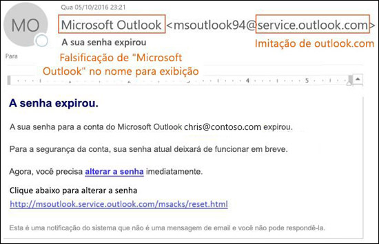

# Proteção antifalsificação no Office 365Anti-spoofing protection in Office 365

Se você for um cliente do Office 365 com caixas de correio no Exchange Online ou um cliente autônomo da Proteção do Exchange Online (EOP) sem caixas de correio do Exchange Online, o EOP incluirá recursos para ajudar a proteger sua organização contra remetentes falsificados (forjados).If you're an Office 365 customer with mailboxes in Exchange Online or a standalone Exchange Online Protection (EOP) customer without Exchange Online mailboxes, EOP includes features to help protect your organization from spoofed (forged) senders.

Quando se trata de proteger os usuários, a Microsoft leva a sério a ameaça de phishing.When it comes to protecting its users, Microsoft takes the threat of phishing seriously. A falsificação é uma técnica comum usada por invasores.Spoofing is a common technique that's used by attackers. **As mensagens falsas parecem se originar de alguém ou algum lugar que não é a origem real.****Spoofed messages appear to originate from someone or somewhere other than the actual source**. Essa técnica é frequentemente usada em campanhas de phishing projetadas para obter credenciais de usuário.This technique is often used in phishing campaigns that are designed to obtain user credentials. A tecnologia antifalsificação na EOP examina especificamente a falsificação do cabeçalho De no corpo da mensagem (usada para exibir o remetente da mensagem nos clientes de email).The anti-spoofing technology in EOP specifically examines forgery of the From header in the message body (used to display the message sender in email clients). Quando a EOP tem alta confiança de que o cabeçalho De é forjado, a mensagem é identificada como falsificada.When EOP has high confidence that the From header is forged, the message is identified as spoofed.

As seguintes tecnologias antifalsificação estão disponíveis na EOP:The following anti-spoofing technologies are available in EOP:

- **Inteligência contra falsificação**: Revise as mensagens falsas dos remetentes em domínios internos e externos e permita ou bloqueie esses remetentes.**Spoof intelligence**: Review spoofed messages from senders in internal and external domains, and allow or block those senders. Para obter mais informações, contra [Configurar a inteligência contra falsificação no Office 365](learn-about-spoof-intelligence.md).For more information, see [Configure spoof intelligence in Office 365](learn-about-spoof-intelligence.md).

- **Políticas antiphishing**: Na EOP, a política interna antiphishing permite ativar ou desativar a inteligência contra falsificação, ativar ou desativar a identificação de remetente não autenticado no Outlook e especificar a ação para remetentes falsificados bloqueados (mover para a pasta Lixo Eletrônico ou para a quarentena).**Anti-phishing policies**: In EOP, the built-in anti-phishing policy allows you to turn spoof intelligence on or off, turn unauthenticated sender identification in Outlook on or off, and specify the action for blocked spoofed senders (move to the Junk Email folder or quarantine). As políticas antiphishing avançadas disponíveis na Proteção Avançada contra Ameaças do Office 365 (ATP) também contêm configurações contra usurpação de identidade (remetentes e domínios protegidos), configurações de inteligência da caixa de correio e limites ajustáveis de phishing avançados.Advanced anti-phishing policies that are available in Office 365 Advanced Threat Protection (ATP) also contain anti-impersonation settings (protected senders and domains), mailbox intelligence settings, and adjustable advanced phishing thresholds. Para obter mais informações, confira [Políticas antiphishing](set-up-anti-phishing-policies.md) no Office 365.For more information, see [Anti-phishing policies in Office 365](set-up-anti-phishing-policies.md).

- **Autenticação de email**: Um componente integrante de qualquer esforço antifalsificação é o uso de autenticação de email (também conhecida como validação de email) pelos registros SPF, DKIM e DMARC no DNS.**Email authentication**: An integral part of any anti-spoofing effort is the use of email authentication (also known as email validation) by SPF, DKIM, and DMARC records in DNS. Você pode configurar esses registros para seus domínios, para que os sistemas de email de destino possam verificar a validade das mensagens que afirmam ser de remetentes em seus domínios.You can configure these records for your domains so destination email systems can check the validity of messages that claim to be from senders in your domains. Para mensagens de entrada, o Office 365 requer autenticação de email para domínios do remetente.For inbound messages, Office 365 requires email authentication for sender domains. Para obter mais informações, confira [Autenticação de email no Office 365](email-validation-and-authentication.md).For more information, see [Email authentication in Office 365](email-validation-and-authentication.md).

A tecnologia antifalsificação da Microsoft foi implantada originalmente apenas em organizações com a Proteção Avançada contra Ameaças (ATP) do Office 365.Microsoft's anti-spoofing technology was originally deployed only to organizations with Office 365 Office 365 Advanced Threat Protection (ATP). Em outubro de 2018, a proteção antifalsificação foi adicionada à EOP.In October  2018, anti-spoofing protection was added to EOP.

A EOP analisa e bloqueia mensagens que não podem ser autenticadas pela combinação de métodos padrão de autenticação de email e técnicas de reputação do remetente.EOP analyzes and blocks messages that can't be authenticated by the combination of standard email authentication methods and sender reputation techniques.

## Como a falsificação é usada em ataques de phishingHow spoofing is used in phishing attacks

As mensagens falsificadas têm as seguintes implicações negativas para os usuários:Spoofing messages have the following negative implications for users:

- **Mensagens falsificadas enganam os usuários**: Uma mensagem falsificada pode induzir o destinatário a clicar em um link e expor suas credenciais, baixar malware ou responder a uma mensagem com conteúdo confidencial (o que é conhecido como comprometimento de email empresarial ou BEC).**Spoofed messages deceive users**: A spoofed message might trick the recipient into clicking a link and giving up their credentials, downloading malware, or replying to a message with sensitive content (known as a business email compromise or BEC).

  A seguinte mensagem é um exemplo de phishing que usa o remetente falsificado msoutlook94@service.outlook.com:The following message is an example of phishing that uses the spoofed sender msoutlook94@service.outlook.com:

  

  Essa mensagem não veio de service.outlook.com, mas o invasor falsificou o campo do cabeçalho **De** para fazer com que parecesse ter vindo.This message didn't come from service.outlook.com, but the attacker spoofed the **From** header field to make it look like it did. Essa foi uma tentativa de induzir o destinatário a clicar no link **alterar senha** e expor suas credenciais.This was an attempt to trick the recipient into clicking the **change your password** link and giving up their credentials.

  A seguinte mensagem é um exemplo de BEC que usa o domínio de email falsificado contoso.com:The following message is an example of BEC that uses the spoofed email domain contoso.com:

  

  A mensagem parece legítima, mas o remetente é falso.The message looks legitimate, but the sender is spoofed.

- **Os usuários confundem mensagens reais com mensagens falsas**: Mesmo os usuários que conhecem phishing podem ter dificuldade em perceber as diferenças entre mensagens reais e falsificadas.**Users confuse real messages for fake ones**: Even users who know about phishing might have difficulty seeing the differences between real messages and spoofed messages.

  A seguinte mensagem é um exemplo de uma mensagem real de redefinição de senha da conta de Segurança da Microsoft:The following message is an example of a real password reset message from the Microsoft Security account:

  

  A mensagem realmente veio da Microsoft, mas os usuários foram condicionados a suspeitar.The message really did come from Microsoft, but users have been conditioned to be suspicious. Como é difícil distinguir uma mensagem de redefinição de senha real de uma falsa, os usuários podem ignorar a mensagem, denunciá-la como spam ou denunciá-la desnecessariamente à Microsoft como phishing.Because it's difficult to the difference between a real password reset message and a fake one, users might ignore the message, report it as spam, or unnecessarily report the message to Microsoft as phishing.

## Diferentes tipos de falsificaçãoDifferent types of spoofing

A Microsoft diferencia dois tipos diferentes de mensagens falsas:Microsoft differentiates between two different types of spoofed messages:

- **Falsificação dentro da organização**: Também conhecida como falsificação _self-to-self_.**Intra-org spoofing**: Also known as _self-to-self_ spoofing. Por exemplo:For example:

  - O remetente e o destinatário estão no mesmo domínio:The sender and recipient are in the same domain:
    > De: humberto@contoso.comFrom: chris@contoso.com   Para: michelle@contoso.comTo: michelle@contoso.com

  - O remetente e o destinatário estão em subdomínios do mesmo domínio:The sender and the recipient are in subdomains of the same domain:
    > De: laura@marketing.fabrikam.comFrom: laura@marketing.fabrikam.com   Para: julia@engineering.fabrikam.comTo: julia@engineering.fabrikam.com

  - O remetente e o destinatário estão em domínios diferentes que pertencem à mesma organização (ou seja, os dois domínios estão configurados como [domínios aceitos](https://docs.microsoft.com/exchange/mail-flow-best-practices/manage-accepted-domains/manage-accepted-domains) na mesma organização):The sender and recipient are in different domains that belong to the same organization (that is, both domains are configured as [accepted domains](https://docs.microsoft.com/exchange/mail-flow-best-practices/manage-accepted-domains/manage-accepted-domains) in the same organization):
    > De: remetente @ microsoft.comFrom: sender @ microsoft.com   Para: destinatário @ bing.comTo: recipient @ bing.com

    Os espaços são usados nos endereços de email para impedir a coleta de spambots.Spaces are used in the email addresses to prevent spambot harvesting.

  As mensagens reprovadas na [autenticação composta](email-validation-and-authentication.md#composite-authentication) devido à falsificação dentro da organização contêm os seguintes valores de cabeçalho:Messages that fail [composite authentication](email-validation-and-authentication.md#composite-authentication) due to intra-org spoofing contain the following header values:

  `Authentication-Results: ... compauth=fail reason=6xx`

  `X-Forefront-Antispam-Report: ...CAT:SPM/HSPM/PHSH;...SFTY:9.11`

  - `reason=6xx` indica falsificação dentro da organização.`reason=6xx` indicates intra-org spoofing.

  - CAT é a categoria da mensagem e normalmente é SPM (spam), mas ocasionalmente pode ser HSPM (spam de alta confiança) ou PHISH (phishing), dependendo de quais outros tipos de padrões tenham sido detectados na mensagem.CAT is the category of the message, and it is normally SPM (spam), but occasionally might be HSPM (high confidence spam) or PHISH (phishing) depending upon what other types of patterns were detected in the message.

  - SFTY é o nível de segurança da mensagem.SFTY is the safety level of the message. 9 indica phishing, .11 indica falsificação dentro da organização.9 indicates phishing, .11 indicates intra-org spoofing.

- **Falsificação entre domínios**: Os domínios do remetente e do destinatário são diferentes e não têm relação entre si (também conhecidos como domínios externos).**Cross-domain spoofing**: The sender and recipient domains are different, and have no relationship to each other (also known as external domains). Por exemplo:For example:
    > De: humberto@contoso.comFrom: chris@contoso.com   Para: michelle@tailspintoys.comTo: michelle@tailspintoys.com

  As mensagens reprovadas na [autenticação composta](email-validation-and-authentication.md#composite-authentication) devido à falsificação entre domínios contêm os seguintes valores de cabeçalhos:Messages that fail [composite authentication](email-validation-and-authentication.md#composite-authentication) due to cross-domain spoofing contain the following headers values:

  `Authentication-Results: ... compauth=fail reason=000/001`

  `X-Forefront-Antispam-Report: ...CAT:SPOOF;...SFTY:9.22`

  - O valor `reason=000` indica que a mensagem foi reprovada na autenticação explícita de email.`reason=000` value indicates the message failed explicit email authentication. `reason=001` indica que a mensagem foi reprovada na autenticação implícita de email.`reason=001` indicates the message failed implicit email authentication.

  - SFTY é o nível de segurança da mensagem.SFTY is the safety level of the message. 9 indica phishing, .22 indica falsificação entre domínios.9 indicates phishing, .22 indicates cross-domain spoofing.

Para obter mais informações sobre os valores Categoria e autenticação composta (compauth) relacionados à falsificação, confira [Cabeçalhos de mensagem antispam no Office 365](anti-spam-message-headers.md).For more information about the Category and composite authentication (compauth) values that are related to spoofing, see [Anti-spam message headers in Office 365](anti-spam-message-headers.md).

Para obter mais informações sobre o DMARC, confira [Usar o DMARC para validar emails no Office 365](use-dmarc-to-validate-email.md).For more information about DMARC, see [Use DMARC to validate email in Office 365](use-dmarc-to-validate-email.md).

## Relatórios de quantas mensagens foram marcadas como falsificadasReports of how many messages were marked as spoofed

Organizações da EOP podem usar as **Detecções de falsificação** no painel relatórios no Centro de Conformidade e Segurança.EOP organizations can use the **Spoof detections** report in the reports dashboard in the Security & Compliance Center. Para mais informações, confira [Relatório de Detecções de Falsificação](view-email-security-reports.md#spoof-detections-report).For more information, see [Spoof Detections report](view-email-security-reports.md#spoof-detections-report).

A organização da Proteção Avançada contra Ameaças do Office 365 (ATP) pode usar o Explorador de Ameaças no Centro de Conformidade e Segurança para exibir informações sobre tentativas de phishing.Office 365 ATP organization can use Threat Explorer in the Security & Compliance Center to view information about phishing attempts. Para obter mais informações, confira [Investigação e resposta a ameaças do Office 365](office-365-ti.md).For more information, see [Office 365 threat investigation and response](office-365-ti.md).

## Problemas com a proteção antifalsificaçãoProblems with anti-spoofing protection

Sabe-se que as listas de endereçamento (também conhecidas como listas de discussão) têm problemas com a antifalsificação devido à maneira como encaminham e modificam as mensagens.Mailing lists (also known as discussion lists) are known to have problems with anti-spoofing due to the way they forward and modify messages.

Por exemplo, Gabriela Laureano (glaureano@contoso.com) está interessada em observar pássaros, ingressa na lista de endereçamento birdwatchers@fabrikam.com e envia a seguinte mensagem à lista:For example, Gabriela Laureano (glaureano@contoso.com) is interested in bird watching, joins the mailing list birdwatchers@fabrikam.com, and sends the following message to the list:

> **De:** "Laura Cunha" \<lauracunha@contoso.com\>**From:** "Gabriela Laureano" \<glaureano@contoso.com\>   **Para:** Lista de Discussão de Observação de Pássaros \<observadoresdepassaros@fabrikam.com\>**To:** Birdwatcher's Discussion List \<birdwatchers@fabrikam.com\>   \
\**Assunto:\** Excelente vista de galos azuis no topo do Monte. \
\**Subject:\** Great viewing of blue jays at the top of Mt. Rainier esta semanaRainier this week   Alguém quer conferir esta semana a vista do MonteAnyone want to check out the viewing this week from Mt. Rainier?Rainier?

O servidor da lista de endereçamento recebe a mensagem, modifica seu conteúdo e a repete aos membros da lista.The mailing list server receives the message, modifies its content, and replays it to the members of list. A mensagem repetida tem o mesmo endereço De (glaureano@contoso.com), mas uma marca é adicionada à linha de assunto e um rodapé é adicionado à parte inferior da mensagem.The replayed message has the same From address (glaureano@contoso.com), but a tag is added to the subject line, and a footer is added to the bottom of the message. Esse tipo de modificação é comum em listas de endereçamento, e pode resultar em falsos positivos para falsificação.This type of modification is common in mailing lists, and may result in false positives for spoofing.

> **De:** "Laura Cunha" \<lauracunha@contoso.com\>**From:** "Gabriela Laureano" \<glaureano@contoso.com\>   **Para:** Lista de Discussão de Observação de Pássaros \<observadoresdepassaros@fabrikam.com\>**To:** Birdwatcher's Discussion List \<birdwatchers@fabrikam.com\>   **Assunto:** [OBSERVAÇÃODEPÁSSAROS] Belo exemplo de gaios azuis no topo do Monte**Subject:** [BIRDWATCHERS] Great viewing of blue jays at the top of Mt. Rainier esta semanaRainier this week    Alguém quer conferir esta semana a vista do MonteAnyone want to check out the viewing this week from Mt. Rainier?Rainier?    Esta mensagem foi enviada para a lista de discussão de Observação de Pássaros.This message was sent to the Birdwatchers Discussion List. Você pode cancelar a assinatura a qualquer momento.You can unsubscribe at any time.

Para ajudar as mensagens da lista de endereçamento a passarem nas verificações antifalsificação, execute as seguintes etapas com base no controle da lista de endereçamento:To help mailing list messages pass anti-spoofing checks, do following steps based on whether you control the mailing list:

- Sua organização possui a lista de endereçamento:Your organization owns the mailing list:

  - Verifique as Perguntas Frequentes em DMARC.org: [Opero uma lista de endereçamento e quero interoperar com o DMARC, o que devo fazer?](https://dmarc.org/wiki/FAQ#I_operate_a_mailing_list_and_I_want_to_interoperate_with_DMARC.2C_what_should_I_do.3F).Check the FAQ at DMARC.org: [I operate a mailing list and I want to interoperate with DMARC, what should I do?](https://dmarc.org/wiki/FAQ#I_operate_a_mailing_list_and_I_want_to_interoperate_with_DMARC.2C_what_should_I_do.3F).

  - Leia as instruções nesta postagem do blog: [Uma dica para os operadores de listas de endereçamento interoperarem com o DMARC para evitar falhas](https://blogs.msdn.microsoft.com/tzink/2017/03/22/a-tip-for-mailing-list-operators-to-interoperate-with-dmarc-to-avoid-failures/).Read the instructions at this blog post: [A tip for mailing list operators to interoperate with DMARC to avoid failures](https://blogs.msdn.microsoft.com/tzink/2017/03/22/a-tip-for-mailing-list-operators-to-interoperate-with-dmarc-to-avoid-failures/).

  - Considere a instalação de atualizações em seu servidor de lista de endereçamento para dar suporte ao ARC. Veja [https://arc-spec.org](https://arc-spec.org/)Consider installing updates on your mailing list server to support ARC, see [https://arc-spec.org](https://arc-spec.org/)

- Sua organização não possui a lista de endereçamento:Your organization doesn't own the mailing list:

  - Peça ao mantenedor da lista de endereçamento para que ele configure a autenticação de email para o domínio do qual a lista de endereçamento está retransmitindo.Ask the maintainer of the mailing list to configure email authentication for the domain that the mailing list is relaying from.

    Quando um número suficiente de remetentes responde aos proprietários do domínio que devem configurar registros de autenticação de email, isso os incentiva a agir.When enough senders reply back to domain owners that they should set up email authentication records, it spurs them into taking action. Embora a Microsoft também trabalhe com proprietários de domínio para publicar os registros necessários, é ainda mais eficaz quando usuários individuais solicitam isso.While Microsoft also works with domain owners to publish the required records, it helps even more when individual users request it.

  - Crie regras de caixa de entrada no seu cliente de email para mover as mensagens para a Caixa de Entrada.Create inbox rules in your email client to move messages to the Inbox. Você também pode solicitar que seus administradores configurem substituições, conforme discutido em [Usar inteligência contra falsificação para configurar remetentes permitidos de email não autenticado](email-validation-and-authentication.md#use-spoof-intelligence-to-configure-permitted-senders-of-unauthenticated-email).You can also ask your admins to configure overrides as discussed in the [Use spoof intelligence to configure permitted senders of unauthenticated email](email-validation-and-authentication.md#use-spoof-intelligence-to-configure-permitted-senders-of-unauthenticated-email).

  - Crie um tíquete de suporte do Office 365 para criar uma substituição para a lista de endereçamento para que ela seja tratada como legítima.Create a support ticket with Office 365 to create an override for the mailing list to treat it as legitimate. Para obter mais informações, confira [Contatar o suporte para produtos comerciais - Ajuda para administradores](../../admin/contact-support-for-business-products.md).For more information, see [Contact support for business products - Admin Help](../../admin/contact-support-for-business-products.md).

Se tudo falhar, você poderá relatar a mensagem como um falso positivo para a Microsoft.If all else fails, you can report the message as a false positive to Microsoft. Para mais informações, confira [Relatar mensagens e arquivos à Microsoft](report-junk-email-messages-to-microsoft.md).For more information, see [Report messages and files to Microsoft](report-junk-email-messages-to-microsoft.md).

Você também pode entrar em contato com seu administrador, que pode criar um tíquete de suporte na Microsoft.You may also contact your admin who can raise it as a support ticket with Microsoft. A equipe de engenharia da Microsoft investigará por que a mensagem foi marcada como uma falsificação.The Microsoft engineering team will investigate why the message was marked as a spoof.

## Considerações sobre a proteção antifalsificaçãoConsiderations for anti-spoofing protection

Se você é um administrador que atualmente envia mensagens para o Office 365, precisa garantir que seu email seja autenticado corretamente.If you're an admin who currently sends messages to Office 365, you need to ensure that your email is properly authenticated. Caso contrário, ele pode ser marcado como spam ou phishing.Otherwise, it might be marked as spam or phish. Para obter mais informações, confira [Soluções para remetentes legítimos enviando emails não autenticados](email-validation-and-authentication.md#solutions-for-legitimate-senders-who-are-sending-unauthenticated-email).For more information, see [Solutions for legitimate senders who are sending unauthenticated email](email-validation-and-authentication.md#solutions-for-legitimate-senders-who-are-sending-unauthenticated-email).
