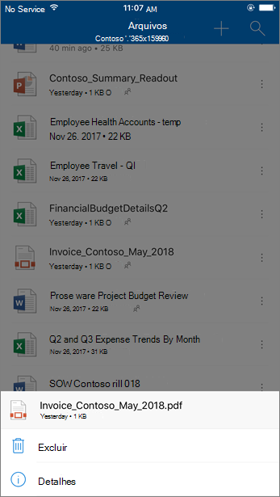
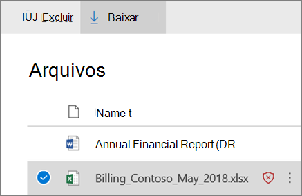

# ATP para SharePoint, OneDrive e Microsoft Teams

[!INCLUDE [Microsoft 365 Defender rebranding](../includes/microsoft-defender-for-office.md)]

ATP para SharePoint, OneDrive e Microsoft Teams no [Microsoft defender para Office 365](office-365-atp.md) fornece uma camada adicional de proteção para arquivos que já foram verificados no momento do carregamento pelo [mecanismo de detecção de vírus comum no Microsoft 365](virus-detection-in-spo.md). ATP para SharePoint, OneDrive e Microsoft Teams ajuda a detectar e bloquear arquivos existentes identificados como mal-intencionados em sites de equipe e bibliotecas de documentos.

ATP para SharePoint, OneDrive e Microsoft Teams não está habilitado por padrão. Para ativá-la, confira [Ativar ATP para SharePoint, onedrive e Microsoft Teams](turn-on-atp-for-spo-odb-and-teams.md).

## Como a ATP para SharePoint, OneDrive e Microsoft Teams funciona

Quando a ATP para SharePoint, OneDrive e Microsoft Teams está habilitada e identifica um arquivo como mal-intencionado, o arquivo é bloqueado usando a integração direta com os repositórios de arquivos. A imagem a seguir mostra um exemplo de um arquivo mal-intencionado detectado em uma biblioteca.

Embora o arquivo bloqueado ainda esteja listado na biblioteca de documentos e em aplicativos Web, móveis ou de área de trabalho, as pessoas não podem abrir, copiar, mover ou compartilhar o arquivo. Mas eles podem excluir o arquivo bloqueado.

Veja um exemplo da aparência de um arquivo bloqueado em um dispositivo móvel:

Por padrão, as pessoas podem baixar um arquivo bloqueado. Veja como baixar um arquivo bloqueado em um dispositivo móvel:

Os administradores do SharePoint Online podem impedir que as pessoas baixem arquivos mal-intencionados. Para obter instruções, confira [usar o PowerShell do SharePoint Online para impedir que os usuários baixem arquivos mal-intencionados](turn-on-atp-for-spo-odb-and-teams.md#step-2-recommended-use-sharepoint-online-powershell-to-prevent-users-from-downloading-malicious-files).

Para saber mais sobre a experiência do usuário quando um arquivo foi detectado como mal-intencionado, confira [o que fazer quando um arquivo mal-intencionado é encontrado no SharePoint Online, no onedrive ou no Microsoft Teams](https://support.microsoft.com/office/01e902ad-a903-4e0f-b093-1e1ac0c37ad2).

## Exibir informações sobre arquivos mal-intencionados detectados pela ATP para SharePoint, OneDrive e Microsoft Teams

Os arquivos identificados como mal-intencionados pelo Microsoft defender para Office 365 aparecerão nos [relatórios do Microsoft defender para office 365](view-reports-for-atp.md) e no [Explorer (e detecções em tempo real)](threat-explorer.md).

A partir de maio de 2018, quando um arquivo é identificado como mal-intencionado pelo Microsoft defender para Office 365, o arquivo também está disponível em quarentena. Para obter mais informações, consulte [usar o centro de conformidade de & de segurança para gerenciar arquivos em quarentena](manage-quarantined-messages-and-files.md#microsoft-defender-for-office-365-only-use-the-security--compliance-center-to-manage-quarantined-files).

## Mantenha esses pontos em mente

- O defender for Office 365 não examinará todos os arquivos do SharePoint Online, do OneDrive for Business ou do Microsoft Teams. Este é o comportamento padrão do produto. Os arquivos são verificados de forma assíncrona. O processo usa eventos de atividade de compartilhamento e convidados junto com heurística inteligente e sinais de ameaça para identificar arquivos mal-intencionados.

- Certifique-se de que seus sites do SharePoint estão configurados para usar a [experiência moderna](https://docs.microsoft.com/sharepoint/guide-to-sharepoint-modern-experience). O defender for Office 365 Protection aplica se a experiência moderna ou o modo de exibição clássico é usado; no entanto, os indicadores visuais que um arquivo está bloqueado estão disponíveis apenas na experiência moderna.

- ATP para SharePoint, OneDrive e Microsoft Teams é parte da estratégia geral de proteção contra ameaças da sua organização, que inclui proteção antispam e antimalware no Exchange Online Protection (EOP), bem como links seguros e anexos seguros no Microsoft defender para Office 365. Para saber mais, confira [proteger contra ameaças no Office 365](protect-against-threats.md).
