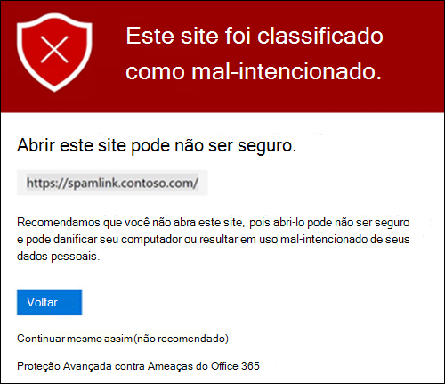
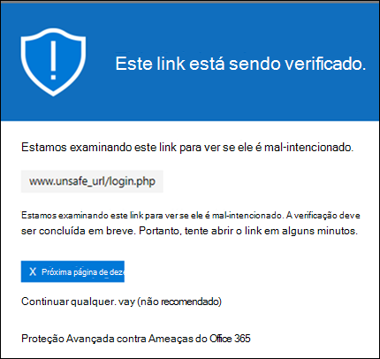
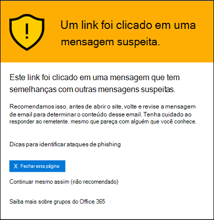
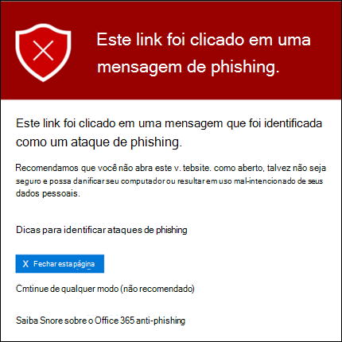
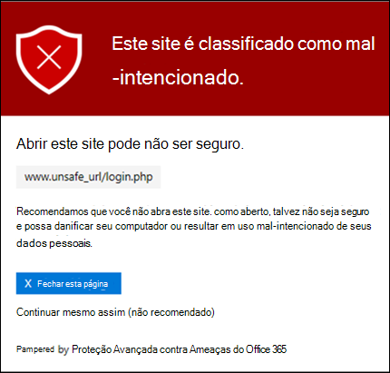
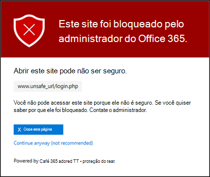
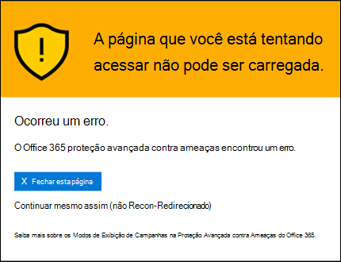

# Links seguros no Office 365 ATP

[!INCLUDE [Microsoft 365 Defender rebranding](../includes/microsoft-defender-for-office.md)]

> [!IMPORTANT]
> Este artigo destina-se a clientes comerciais que têm a [proteção avançada contra ameaças (ATP) do Office 365](office-365-atp.md). Se você estiver usando o Outlook.com, a família Microsoft 365 ou o Microsoft 365 Personal, e estiver procurando informações sobre o Safelinks no Outlook, consulte [Advanced Outlook.com Security](https://support.microsoft.com/office/882d2243-eab9-4545-a58a-b36fee4a46e2).

Links seguros é um recurso da [proteção avançada contra ameaças do Office 365](office-365-atp.md) que oferece verificação de URL e regravação de mensagens de email de entrada no fluxo de emails e verificação de URLs e links em mensagens de email e em outros locais. A verificação de links seguros ocorre além da proteção regular antispam [e antimalware](anti-spam-and-anti-malware-protection.md) em mensagens de email de entrada no Exchange Online Protection (EOP). A verificação de links seguros pode ajudar a proteger sua organização contra links mal-intencionados que são usados em phishing e outros ataques.

A proteção de links seguros está disponível nos seguintes locais:

- **Mensagens de email**: a proteção de links seguros para links em mensagens de email é controlada por políticas de links seguros. Não há nenhuma política de links seguros padrão, **portanto, para obter a proteção de links seguros em mensagens de email, você precisa criar uma ou mais políticas de links seguros**. Para obter instruções, consulte [set up Safe links Policies in ATP](set-up-atp-safe-links-policies.md).

  Para obter mais informações sobre proteção de links seguros para mensagens de email, consulte a seção [configurações de links seguros para mensagens de email](#safe-links-settings-for-email-messages) mais adiante neste artigo.

- **Microsoft Teams** (atualmente em versão prévia): a proteção de links seguros para links em conversas de equipes, chats de grupo ou de canais também é controlada por políticas de links seguros. Não há nenhuma política de links seguros padrão, **portanto, para obter a proteção de links seguros no Teams, você precisa criar uma ou mais políticas de links seguros**.

  Para obter mais informações sobre proteção de links seguros no Teams, consulte a seção [configurações de links seguros para o Microsoft Teams](#safe-links-settings-for-microsoft-teams) mais adiante neste tópico.

- **Aplicativos do office 365**: a proteção de links seguros para aplicativos do Office 365 está disponível em APS de área de trabalho, móvel e Web com suporte. Você **configura** a proteção de links seguros para aplicativos do Office 365 na configuração global que estão **fora** de políticas de links seguros. Para obter instruções, consulte [Configure Global Settings for Safe links Settings in Office 365 ATP](configure-global-settings-for-safe-links.md).

  No entanto, a proteção de links seguros para aplicativos do Office 365 só é **aplicada** a usuários que estão incluídos em políticas de links seguros ativas. Se um usuário não estiver incluído em uma política de links seguros ativa, o usuário não terá proteção de links seguros em aplicativos do Office 365 com suporte.

  Para obter mais informações sobre proteção de links seguros nos aplicativos do Office 365, confira a seção [configurações de links seguros para aplicativos do office 365](#safe-links-settings-for-office-365-apps) mais adiante neste artigo.

Este artigo inclui descrições detalhadas dos seguintes tipos de configurações de links confiáveis:

- **Configurações em políticas de links seguros**: essas configurações se aplicam somente aos usuários que estão incluídos nas políticas específicas, e as configurações podem ser diferentes entre as políticas. Essas configurações incluem:

  - [Configurações de links seguros para mensagens de email](#safe-links-settings-for-email-messages)
  - [Configurações de links seguros para o Microsoft Teams](#safe-links-settings-for-microsoft-teams)
  - [Lista "não reescrever as seguintes URLs" em políticas de links seguros](#do-not-rewrite-the-following-urls-lists-in-safe-links-policies)

- **Configurações globais de links seguros**: essas configurações são configuradas globalmente, não em políticas de links seguros. No entanto, as configurações aplicam-se apenas aos usuários incluídos nas políticas de links seguros ativos. Essas configurações incluem:

  - [Configurações de links seguros para aplicativos do Office 365](#safe-links-settings-for-office-365-apps)
  - [Lista "bloquear as seguintes URLs" para links seguros](#block-the-following-urls-list-for-safe-links)

A tabela a seguir descreve cenários para links seguros no Microsoft 365 e no Office 365 organizações que incluem ATP (em outras palavras, a falta de licenciamento nunca é um problema nos exemplos).

****

|Cenário|Resultado|
|---|---|
|Jean é membro do departamento de marketing. A proteção de links seguros para aplicativos do Office 365 está ativada nas configurações globais para links seguros e uma política de links seguros que se aplica aos membros do departamento de marketing existe. Jean abre uma apresentação do PowerPoint em uma mensagem de email e, em seguida, clica em uma URL na apresentação.|Jean é protegido por links seguros.    Jean está incluído em uma política de links seguros, e a proteção de links seguros para aplicativos do Office 365 está ativada.    Para obter mais informações sobre os requisitos de proteção de links seguros nos aplicativos do Office 365, consulte a seção [configurações de links seguros para aplicativos do office 365](#safe-links-settings-for-office-365-apps) mais adiante neste artigo.|
|A organização do Microsoft 365 E5 de Carla não tem políticas de links seguros configuradas. Chris recebe um email de um remetente externo que contém uma URL para um site mal-intencionado em que ele clica no final.|Carla não é protegida por links seguros.    Um administrador deve criar pelo menos uma política de links seguros para que qualquer pessoa Obtenha proteção de links seguros em mensagens de email de entrada. Chris deve ser incluído nas condições de política para obter proteção de links seguros.|
|Na organização do Luigi, nenhum administrador criou nenhuma política de links seguros, mas a proteção de links seguros para aplicativos do Office 365 está ativada. Pat abre um documento do Word e clica em uma URL no arquivo.|Pat não está protegido por links seguros.    Embora a proteção de links seguros para aplicativos do Office 365 seja ativada globalmente, Luigi não está incluído em nenhuma política ativa de links seguros, portanto, a proteção não pode ser aplicada.|
|Na organização de Lee, `https://tailspintoys.com` é configurada na lista **bloquear as seguintes URLs** nas configurações globais de links seguros. Uma política de links seguros que inclui Lee já existe. Lee recebe uma mensagem de email que contém a URL `https://tailspintoys.com/aboutus/trythispage` . Lee clica na URL.|A URL pode ser bloqueada automaticamente para Lee; depende da entrada de URL na lista e do cliente de email Lee usado. Para obter mais informações, consulte a [lista "bloquear as seguintes URLs" da seção de links seguros](#block-the-following-urls-list-for-safe-links) mais adiante neste tópico.|
|Jaime e Julia funcionam para o contoso.com. Há muito tempo, os administradores configuraram políticas de links seguros que se aplicam a Jaime e Julia. Jaime envia um email para Julia, não sabendo que o email contém uma URL mal-intencionada.|Julia é protegido por links seguros **se** a política de links seguros que se aplica a ele estiver configurada para ser aplicada a mensagens entre destinatários internos. Para obter mais informações, consulte a seção [configurações de links seguros para mensagens de email](#safe-links-settings-for-email-messages) mais adiante neste tópico.|

## Configurações de links seguros para mensagens de email

Os links seguros verificam o email de entrada para hiperlinks mal-intencionados conhecidos. As URLs verificadas são reconfiguradas usando o prefixo de URL padrão da Microsoft: `https://nam01.safelinks.protection.outlook.com` . Depois que o link é reconfigurado, ele é analisado para conteúdo potencialmente mal-intencionado.

Depois que os links seguros reescrevem uma URL, a URL permanece reconfigurada, mesmo se a mensagem for encaminhada ou respondida. Links adicionais que são adicionados à mensagem encaminhada ou respondida não são reconfigurados.

As configurações em políticas de links seguros que se aplicam a mensagens de email são descritas na lista a seguir:

- **Selecione a ação para URLs possivelmente mal-intencionadas desconhecidas nas mensagens**: habilita ou desabilita a verificação de links seguros em mensagens de email. O valor recomendado está **ativado**. Ativar essa configuração resulta nas seguintes ações.

  - A verificação de links seguros está habilitada no Outlook (C2R) no Windows.
  - As URLs são reescritas e os usuários são roteados por meio de proteção de links seguros quando eles clicam em URLs em mensagens.
  - Quando clicado, as URLs são verificadas em relação a uma lista de URLs mal-intencionadas conhecidas e à [lista "bloquear as seguintes URLs"](#block-the-following-urls-list-for-safe-links).
  - As URLs que não têm uma reputação válida são destruído assincronamente em segundo plano.

- **Aplicar verificação de URL em tempo real para links suspeitos e links que apontam para arquivos**: habilita a verificação em tempo real de links, incluindo links em mensagens de email que apontam para o conteúdo baixável. O valor recomendado está habilitado.

  - **Aguarde a conclusão da verificação de URL antes de entregar a mensagem**:

    - Habilitado: mensagens que contêm URLs são mantidas até que a verificação seja concluída. As mensagens são entregues somente depois que as URLs são confirmadas para serem seguras. Esse é o valor recomendado.
    - Disabled: se a verificação de URL não puder ser concluída, entregue a mensagem mesmo assim.

- **Aplicar links seguros a mensagens de email enviadas dentro da organização**: habilita ou desabilita a verificação de links seguros nas mensagens enviadas entre remetentes internos e destinatários internos dentro da mesma organização do Exchange Online. O valor recomendado está habilitado.

- **Não rastrear cliques do usuário**: habilita ou desabilita o armazenamento de links seguros clique em dados para URLs clicadas em mensagens de email. O valor recomendado é deixar essa configuração desmarcada (para rastrear cliques do usuário).

  URL o acompanhamento de links em mensagens de email enviadas entre remetentes internos e destinatários internos não é suportado no momento.

- **Não permitir que os usuários acessem a URL original**: permite ou impede que os usuários cliquem na [página de aviso](#warning-pages-from-safe-links) para a URL original. O valor recomendado está habilitado.

- **Não Reescreva as seguintes URLs**: deixa as URLs como estão. Mantém uma lista personalizada de URLs seguras que não precisam de verificação. A lista é exclusiva para cada política de links seguros. Para obter mais informações sobre a lista **não reescrever as seguintes URLs** , consulte as [listas "não reescrever as seguintes URLs" na seção políticas de links seguros](#do-not-rewrite-the-following-urls-lists-in-safe-links-policies) mais adiante neste artigo.

Para obter mais informações sobre os valores recomendados para configurações de política padrão e estrita para políticas de links seguros, consulte [configurações de política de links seguros](recommended-settings-for-eop-and-office365-atp.md#safe-links-policy-settings).

- **Filtros de destinatário**: você precisa especificar as condições e exceções de destinatário que determinam a quem a política se aplica. Você pode usar essas propriedades para condições e exceções:

  - **O destinatário é**
  - **O domínio do destinatário é**
  - **O destinatário é um membro de**

  Você só pode usar uma condição ou uma exceção uma vez, mas a condição ou exceção pode conter vários valores. Vários valores da mesma condição ou exceção usam a lógica OU (por exemplo, _\<recipient1\>_ ou _\<recipient2\>_). Para diferentes condições ou exceções, use a lógica E (por exemplo, _\<recipient1\>_ e _\<member of group 1\>_).

- **Prioridade**: se você criar várias políticas, poderá especificar a ordem em que elas serão aplicadas. Duas políticas não podem ter a mesma prioridade, e o processamento da política será interrompido após a primeira política ser aplicada.

  Para obter mais informações sobre a ordem de precedência e como várias políticas são avaliadas e aplicadas, confira [Ordem e precedência da proteção de email](how-policies-and-protections-are-combined.md).

### Como os links seguros funcionam em mensagens de email

Em um nível alto, veja como a proteção de links seguros funciona em URLs nas mensagens de email:

1. Todos os emails passam pelo EOP, onde os filtros IP e de envelopes, a proteção contra malware baseado em assinatura, os filtros antispam e antimalware antes da mensagem é entregue à caixa de correio do destinatário.

2. O usuário abre a mensagem em sua caixa de correio e clica em uma URL na mensagem.

3. Os links seguros verificam imediatamente a URL antes de abrir o site:

   - Se a URL for incluída na lista **bloquear as seguintes URLs** , um [aviso de URL bloqueado](#blocked-url-warning) será aberto.

   - Se a URL apontar para um site que foi determinado como mal-intencionado, uma página de [aviso de site mal-intencionado](#malicious-website-warning) (ou uma página de aviso diferente) será aberta.

   - Se a URL aponta para um arquivo que pode ser baixado e a configuração **aplicar URL em tempo real verificação de links suspeitos e links desfeitos que apontam para arquivos** estiver habilitada na política que se aplica ao usuário, o arquivo baixável é verificado.

   - Se a URL for considerada segura, o site abrirá.

## Configurações de links seguros para o Microsoft Teams

> [!IMPORTANT]
> A partir de março de 2020, esse recurso está em versão prévia e está disponível somente para membros do programa de adoção de tecnologia do Microsoft Teams (toque).

Habilite ou desabilite a proteção de links seguros para o Microsoft Teams em políticas de links seguros. Especificamente, você usa a configuração **selecionar a ação para URLs desconhecidas ou potencialmente mal-intencionadas dentro da Microsoft Teams** . O valor recomendado está **ativado**.

As configurações a seguir em políticas de links seguros que se aplicam a links em mensagens de email também se aplicam a links no Teams:

- **Aplicar verificação de URL em tempo real para links suspeitos e links que apontam para arquivos**
- **Não rastrear cliques do usuário**
- **Não permitir que os usuários cliquem através da URL original**

Essas configurações são explicadas na seção [configurações de links seguros anteriores para mensagens de email](#safe-links-settings-for-email-messages) .

Depois de ativar a proteção de links seguros para o Microsoft Teams, as URLs no Teams são verificadas em relação a uma lista de links mal-intencionados conhecidos quando o usuário protegido clica no link (proteção de tempo de clique). As URLs não são reconfiguradas. Se um link for considerado mal-intencionado, os usuários terão as seguintes experiências:

- Se o link tiver sido clicado em uma conversa de equipes, em um chat de grupo ou em canais, a página de aviso, conforme mostrado na captura de tela abaixo, aparecerá no navegador da Web padrão.
- Se o link foi clicado em uma guia fixada, a página de aviso será exibida na interface do Microsoft Teams dentro dessa guia. A opção para abrir o link em um navegador da Web está desabilitada por motivos de segurança.
- Dependendo de como a configuração **não permitir que os usuários cliquem na URL original** na política estiver configurada, o usuário ou não terá permissão para clicar na URL original (**continuar mesmo assim (não recomendado)** na captura de tela). Recomendamos que você habilite a configuração **não permitir que os usuários cliquem na URL original** para que os usuários não possam clicar na URL original.

Se o usuário que enviou o link não estiver incluído em uma política de links seguros onde a proteção do teams está habilitada, o usuário estará livre para clicar na URL original em seu computador ou dispositivo.

Clicar no **botão voltar** na página de aviso fechará a página (ou poderá resultar em uma página em branco que os usuários podem fechar). No entanto, se você clicar no link original novamente, os links seguros para examinar novamente a URL, portanto, a página de aviso será exibida novamente.

### Como os links seguros funcionam no Microsoft Teams

Em um nível alto, veja como a proteção de links seguros funciona para URLs no Microsoft Teams:

1. Um usuário inicia o aplicativo Teams.

2. O Microsoft 365 verifica se a organização do usuário inclui o Office 365 ATP e se o usuário está incluído em uma política ativa de links seguros onde a proteção para o Microsoft Teams está habilitada.

3. As URLs são validadas no momento de clique para o usuário em chats, chats de grupo, canais e guias.

## Configurações de links seguros para aplicativos do Office 365

Proteção de links seguros para aplicativos do Office 365 verifica links em documentos do Office, não links em mensagens de email (mas pode verificar links em documentos do Office anexados em mensagens de email após a abertura do documento).

A proteção de links seguros para aplicativos do Office 365 tem os seguintes requisitos de cliente:

- Microsoft 365 aplicativos ou Microsoft 365 Business Premium.
  - Versões atuais do Word, Excel e PowerPoint no Windows, Mac ou em um navegador da Web.
  - Aplicativos do Office em dispositivos iOS ou Android.
  - Visio no Windows.
  - O OneNote em um navegador da Web.

- Os aplicativos do Office 365 estão configurados para usar a autenticação moderna. Para obter mais informações, consulte [como a autenticação moderna funciona para aplicativos cliente do office 2013, office 2016 e office 2019](https://docs.microsoft.com/microsoft-365/enterprise/modern-auth-for-office-2013-and-2016).

- Os usuários são conectados usando suas contas corporativas ou de estudante. Para obter mais informações, consulte [entrar no Office](https://support.microsoft.com/office/b9582171-fd1f-4284-9846-bdd72bb28426).

Você configura a proteção de links seguros para aplicativos do Office 365 nas configurações globais para links seguros, não em políticas de links seguros. No entanto, para que a proteção de links seguros para aplicativos do Office 365 seja aplicada, o usuário que abre o documento do Office e clica no link deve ser incluído em uma política de links seguros ativa.

As seguintes configurações de links seguros estão disponíveis para os aplicativos do Office 365:

- **Aplicativos do office 365**: habilita ou desabilita a verificação de links seguros em aplicativos do Office 365 com suporte. O valor padrão e recomendado está **ativado**.

- **Não rastrear quando os usuários clicarem em links seguros**: habilita ou desabilita o armazenamento de links seguros clique em dados para URLs clicados nas versões do desktop do Word, Excel, PowerPoint e Visio. O valor recomendado está **desativado**, o que significa que os cliques do usuário são controlados.

- **Não permitir que os usuários cliquem por meio de links seguros para a URL original**: permite ou impede que os usuários cliquem na [página de aviso](#warning-pages-from-safe-links) para a URL original nas versões de área de trabalho Word, Excel, PowerPoint e Visio. O valor padrão e recomendado está **ativado**.

Para definir as configurações de links seguros para aplicativos do Office 365, consulte [Configurar proteção de links seguros para aplicativos do office 365](configure-global-settings-for-safe-links.md#configure-safe-links-protection-for-office-365-apps-in-the-security--compliance-center).

Para obter mais informações sobre os valores recomendados para as configurações de política padrão e estrita, consulte [Global Settings for Safe links](recommended-settings-for-eop-and-office365-atp.md#global-settings-for-safe-links).

### Como os links seguros funcionam nos aplicativos do Office 365

Em um nível alto, veja como a proteção de links seguros funciona para URLs nos aplicativos do Office 365. Os aplicativos do Office 365 com suporte são descritos na seção anterior.

1. Um usuário faz logon usando sua conta corporativa ou de estudante em uma organização que inclui o Microsoft 365 aplicativos ou o Microsoft 365 Business Premium.

2. O usuário abre e clica em um link de um documento do Office em um aplicativo do Office com suporte.

3. Os links seguros verificam imediatamente a URL antes de abrir o site de destino:

   - Se a URL estiver incluída na lista que ignora a verificação de links seguros (a lista de **seguintes URLs** ) uma página de [aviso de URL bloqueada](#blocked-url-warning) é aberta.

   - Se a URL apontar para um site que foi determinado como mal-intencionado, uma página de [aviso de site mal-intencionado](#malicious-website-warning) (ou uma página de aviso diferente) será aberta.

   - Se a URL aponta para um arquivo baixável e a política de links seguros que se aplica ao usuário estiver configurada para examinar links para conteúdo para download (**aplicar verificação de URL em tempo real para links suspeitos e links que apontam para arquivos**), o arquivo baixável é verificado.

   - Se a URL for considerada segura, o usuário será levado para o site.

   - Se a verificação de links seguros não puder ser concluída, a proteção de links seguros não será disparada. Nos clientes da área de trabalho do Office, o usuário será avisado antes de prosseguir para o site de destino.

> [!NOTE]
> Pode levar alguns segundos no início de cada sessão para verificar se o usuário tem links seguros para o Office habilitado.

## Lista "bloquear as seguintes URLs" para links seguros

A lista de **URLs a seguir** define os links que são sempre bloqueados pela verificação de links seguros nos seguintes locais:

- Mensagens de email.
- Documentos em aplicativos do Office 365 no Windows e Mac.
- Documentos no Office para iOS e Android.

Quando um usuário em uma política ativa de links seguros clica em um link bloqueado em um aplicativo com suporte, ele é levado para a página de [aviso de URL bloqueado](#blocked-url-warning) .

Você configura a lista de URLs nas configurações globais para links seguros. Para obter instruções, consulte [Configurar a lista "bloquear as seguintes URLs"](configure-global-settings-for-safe-links.md#configure-the-block-the-following-urls-list-in-the-security--compliance-center).

**Observações**:

- Para uma lista verdadeiramente universal de URLs bloqueadas em todos os lugares, consulte [Manage URLs na lista de permissões/bloqueios de locatário](tenant-allow-block-list.md).

- Limitar
  - O número máximo de entradas é 500.
  - O tamanho máximo de uma entrada é de 128 caracteres.
  - Todas as entradas não podem exceder 10.000 caracteres.

- Não inclua uma barra ( `/` ) no final da URL. Por exemplo, use `https://www.contoso.com` , não `https://www.contoso.com/` .

- Somente um domínio-a URL (por exemplo `contoso.com` ou `tailspintoys.com` ) bloqueará qualquer URL que contenha o domínio.

- Você pode bloquear um subdomínio sem bloquear o domínio completo. Por exemplo, `toys.contoso.com*` bloqueia qualquer URL que contenha o subdomínio, mas não bloqueia URLs que contenham o domínio completo `contoso.com` .

- Você pode incluir até três curingas ( `*` ) por entrada de URL.

### Sintaxe de entrada para a lista "bloquear as seguintes URLs"

Exemplos de valores que você pode inserir e seus resultados são descritos na tabela a seguir:

****

|Valor|Resultado|
|---|---|
|`contoso.com`   ou   `*contoso.com*`|Bloqueia o domínio, subdomínios e caminhos. Por exemplo, `https://www.contoso.com` , `https://sub.contoso.com` e `https://contoso.com/abc` são bloqueados.|
|`https://contoso.com/a`|Blocos `https://contoso.com/a` , mas não outros subcaminhos, como `https://contoso.com/a/b` .|
|`https://contoso.com/a*`|Blocos `https://contoso.com/a` e subcaminhos adicionais, como `https://contoso.com/a/b` .|
|`https://toys.contoso.com*`|Bloqueia um subdomínio ( `toys` neste exemplo), mas permite cliques para outras URLs de domínio (como `https://contoso.com` ou `https://home.contoso.com` ).|
|

## Lista "não reescrever as seguintes URLs" em políticas de links seguros

> [!NOTE]
> Se sua organização usa políticas de links seguros, a lista **não reescrever as seguintes URLs** é o único método com suporte para testes de phishing de terceiros.

Cada política de links seguros contém uma lista **não reescrever as seguintes URLs** que você pode usar para especificar URLs que não são reconfiguradas pela verificação de links seguros. Em outras palavras, a lista permite que os usuários que estão incluídos na política acessem as URLs especificadas que, caso contrário, serão bloqueadas por links seguros. Você pode configurar diferentes listas em diferentes políticas de links seguros. O processamento da política pára após a primeira política (provavelmente, a maior prioridade) é aplicada ao usuário. Portanto, somente uma não **reescrever a lista de URLs a seguir** é aplicada a um usuário que está incluído em várias políticas ativas de links seguros.

Para adicionar entradas à lista em políticas de links seguros novas ou existentes, consulte [criar políticas de links seguros](set-up-atp-safe-links-policies.md#use-the-security--compliance-center-to-create-safe-links-policies) ou [modificar políticas de links seguros](set-up-atp-safe-links-policies.md#use-the-security--compliance-center-to-modify-safe-links-policies).

**Observações**:

- Os seguintes clientes não reconhecem o **não reescrever as seguintes** listas de URLs em políticas de links seguros. Os usuários incluídos nas políticas podem ser impedidos de acessar as URLs com base nos resultados da verificação de links seguros nesses clientes:

  - Microsoft Teams
  - Office Web Apps

  Para uma lista de URLs verdadeiramente universais permitidas em todos os lugares, consulte [Manage URLs na lista de permissões/bloqueios de locatário](tenant-allow-block-list.md).

- Considere adicionar URLs internas comumente usadas à lista para melhorar a experiência do usuário. Por exemplo, se você tiver serviços locais, como o Skype for Business ou o SharePoint, poderá adicionar essas URLs para excluí-las da verificação.

- Se você já tiver **não reescrever as seguintes** entradas de URLs em suas políticas de links seguros, revise as listas e adicione caracteres curinga conforme necessário. Por exemplo, sua lista tem uma entrada como `https://contoso.com/a` e, posteriormente, decidir incluir subcaminhos, como `https://contoso.com/a/b` . Em vez de adicionar uma nova entrada, adicione um curinga à entrada existente, de forma que ele se torne `https://contoso.com/a/*` .

- Você pode incluir até três curingas ( `*` ) por entrada de URL. Os curingas incluem explicitamente prefixos ou subdomínios. Por exemplo, a entrada `contoso.com` não é igual a `*.contoso.com/*` , pois `*.contoso.com/*` permite que as pessoas visitem subdomínios e caminhos no domínio especificado.

### Sintaxe de entrada para a lista "não reescrever as seguintes URLs"

Exemplos de valores que você pode inserir e seus resultados são descritos na tabela a seguir:

****

|Valor|Resultado|
|---|---|
|`contoso.com`|Permite acesso `https://contoso.com` , mas não subdomínios ou caminhos.|
|`*.contoso.com/*`|Permite o acesso a um domínio, subdomínios e caminhos (por exemplo, `https://www.contoso.com` , `https://www.contoso.com` ,, `https://maps.contoso.com` ou `https://www.contoso.com/a` ).    Essa entrada é inerentemente melhor do que `*contoso.com*` , porque não permite sites potencialmente fraudulentos, como `https://www.falsecontoso.com` ou `https://www.false.contoso.completelyfalse.com`|
|`https://contoso.com/a`|Permite o acesso a `https://contoso.com/a` , mas não a subcaminhos como `https://contoso.com/a/b`|
|`https://contoso.com/a/*`|Permite o acesso a `https://contoso.com/a` e subcaminhos como `https://contoso.com/a/b`|
|

## Páginas de aviso de links seguros

Esta seção contém exemplos de várias páginas de aviso disparadas pela proteção de links seguros quando você clica em uma URL.

Observe que várias páginas de aviso foram atualizadas. Se você ainda não estiver vendo as páginas atualizadas, em breve. As páginas atualizadas incluem um novo esquema de cores, mais detalhes e a capacidade de prosseguir para um site, apesar dos avisos e recomendações fornecidos.

### Notificação de verificação em andamento

A URL clicada está sendo verificada por links seguros. Talvez seja necessário aguardar alguns momentos antes de tentar o link novamente.

A página de notificação original é parecida com esta:

### Aviso de mensagem suspeita

A URL clicada estava em uma mensagem de email semelhante a outras mensagens suspeitas. Recomendamos que você faça uma verificação dupla da mensagem de email antes de prosseguir para o site.

### Aviso de tentativa de phishing

A URL clicada estava em uma mensagem de email que foi identificada como um ataque de phishing. Como resultado, todas as URLs na mensagem de email são bloqueadas. Recomendamos que você não vá para o site.

### Aviso de site mal-intencionado

A URL clicada aponta para um site que foi identificado como mal-intencionado. Recomendamos que você não vá para o site.

A página de aviso original é parecida com esta:

### Aviso de URL bloqueado

A URL clicada foi bloqueada manualmente por um administrador em sua organização (a lista **bloquear as seguintes URLs** nas configurações globais de links seguros). O link não foi verificado por links seguros porque foi bloqueado manualmente.

Há várias razões pelas quais um administrador bloquearia manualmente URLs específicas. Se você achar que o site não deve ser bloqueado, entre em contato com seu administrador.

A página de aviso original é parecida com esta:

### Aviso de erro

Ocorreu algum tipo de erro, e a URL não pode ser aberta.

A página de aviso original é parecida com esta:

