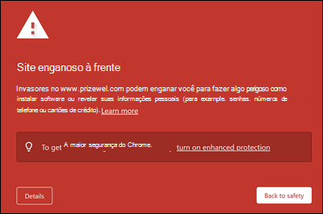
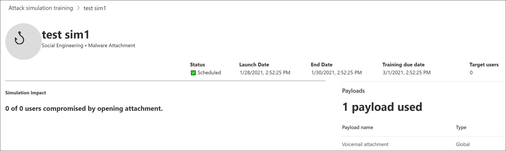
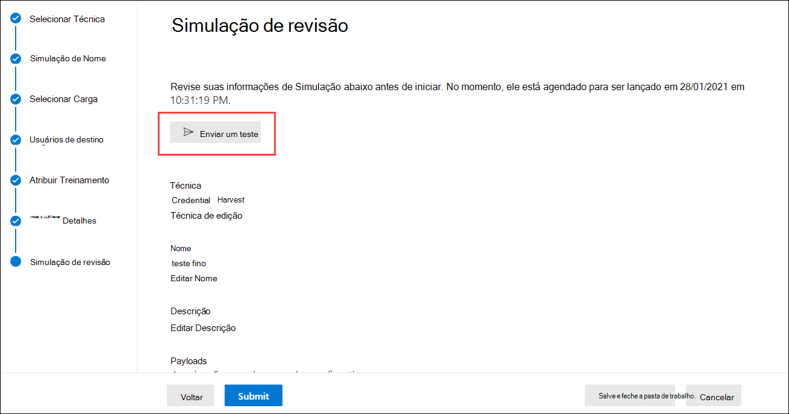

# Considerações de implantação de treinamento de simulação de ataque e perguntas frequentesAttack simulation training deployment considerations and FAQ

O treinamento de simulação de ataque [agora está geralmente disponível](https://techcommunity.microsoft.com/t5/microsoft-security-and/attack-simulation-training-in-microsoft-defender-for-office-365/ba-p/2037291).Attack simulation training is now [generally available](https://techcommunity.microsoft.com/t5/microsoft-security-and/attack-simulation-training-in-microsoft-defender-for-office-365/ba-p/2037291). O treinamento de simulação de ataque permite que as organizações do Microsoft 365 E5 ou do Microsoft Defender for Office 365 Plan 2 medam e gerenciem o risco de engenharia social, permitindo a criação e o gerenciamento de simulações de phishing que são movidas por cargas de phishing desarmadas no mundo real.Attack simulation training enables Microsoft 365 E5 or Microsoft Defender for Office 365 Plan 2 organizations to measure and manage social engineering risk by allowing the creation and management of phishing simulations that are powered by real-world, de-weaponized phishing payloads. O treinamento hiper-direcionado, fornecido em parceria com a segurança do Terranova, ajuda a melhorar o conhecimento e alterar o comportamento dos funcionários.Hyper-targeted training, delivered in partnership with Terranova security, helps improve knowledge and change employee behavior.

Para obter mais informações sobre como começar com o treinamento de simulação de ataque, consulte [Get started using Attack simulation training](attack-simulation-training-get-started.md).For more information about getting started with Attack simulation training, see [Get started using Attack simulation training](attack-simulation-training-get-started.md).

Embora toda a experiência de criação e agendamento de simulação tenha sido projetada para ser de fluxo livre e sem atrito, a execução de simulações em uma escala corporativa geralmente requer planejamento.While the whole simulation creation and scheduling experience has been designed to be free-flowing and frictionless, running simulations at an enterprise scale often requires planning. Este artigo ajuda a resolver desafios específicos que vemos à medida que nossos clientes executarem simulações em seus próprios ambientes.This article helps address specific challenges that we see as our customers run simulations in their own environments.

## Problemas com experiências de usuário finalIssues with end user experiences

### URLs de simulação de phishing bloqueadas pela Navegação Segura do GooglePhishing simulation URLs blocked by Google Safe Browsing

Um serviço de reputação de URL pode identificar uma ou mais URLs usadas pelo treinamento de simulação de ataque como não seguras.A URL reputation service might identify one or more of the URLs that are used by Attack simulation training as unsafe. A Navegação Segura do Google no Google Chrome bloqueia algumas das URLs de phishing simuladas com uma **mensagem de site enganoso à** frente.Google Safe Browsing in Google Chrome blocks some of the simulated phishing URLs with a **Deceptive site ahead** message. Embora trabalhemos com muitos fornecedores de reputação de URL para sempre permitir nossas URLs de simulação, nem sempre temos cobertura completa.While we work with many URL reputation vendors to always allow our simulation URLs, we don't always have full coverage.

Observe que esse problema não afeta o Microsoft Edge.Note that this issue does not affect Microsoft Edge.

Como parte da fase de planejamento, verifique a disponibilidade da URL em seus navegadores da Web com suporte antes de usar a URL em uma campanha de phishing.As part of the planning phase, be sure to check the availability of the URL in your supported web browsers before you use the URL in a phishing campaign. Se as URLs são bloqueadas pela Navegação Segura do [Google,](https://support.google.com/chrome/a/answer/7532419) siga essas diretrizes do Google para permitir o acesso às URLs.If the URLs are blocked by Google Safe Browsing, [follow this guidance](https://support.google.com/chrome/a/answer/7532419) from Google to allow access to the URLs.

Consulte [Get started using Attack simulation training](attack-simulation-training-get-started.md) for the list of URLs that are currently used by Attack simulation training.Refer to [Get started using Attack simulation training](attack-simulation-training-get-started.md) for the list of URLs that are currently used by Attack simulation training.

### UrLs de administrador e simulação de phishing bloqueadas por soluções de proxy de rede e drivers de filtroPhishing simulation and admin URLs blocked by network proxy solutions and filter drivers

UrLs de simulação de phishing e URLs de administrador podem ser bloqueadas ou largas por seus dispositivos de segurança intermediários ou filtros.Both phishing simulation URLs and admin URLs might be blocked or dropped by your intermediate security devices or filters. Por exemplo:For example:

- FirewallsFirewalls
- Soluções waf (firewall de aplicativo web)Web Application Firewall (WAF) solutions
- Drivers de filtro de terceiros (por exemplo, filtros de modo kernel)Third-party filter drivers (for example, kernel mode filters)

Embora vimos poucos clientes sendo bloqueados nessa camada, isso acontece.While we have seen few customers being blocked at this layer, it does happen. Se você encontrar problemas, considere configurar as SEGUINTES URLs para ignorar a verificação por seus dispositivos de segurança ou filtros, conforme necessário:If you encounter problems, consider configuring the following URLs to bypass scanning by your security devices or filters as required:

- As URLs de phishing simuladas conforme descrito em [Get started using Attack simulation training](attack-simulation-training-get-started.md).The simulated phishing URLs as described in [Get started using Attack simulation training](attack-simulation-training-get-started.md).
- <https://security.microsoft.com/attacksimulator>
- <https://security.microsoft.com/attacksimulationreport>
- <https://security.microsoft.com/trainingassignments>

### Mensagens de simulação não entregues a todos os usuários direcionadosSimulation messages not delivered to all targeted users

É possível que o número de usuários que realmente recebem as mensagens de email de simulação seja menor do que o número de usuários que foram direcionados pela simulação.It's possible that the number of users who actually receive the simulation email messages is less than the number of users who were targeted by the simulation. Os seguintes tipos de usuários serão excluídos como parte da validação de destino:The following types of users will be excluded as part of target validation:

- Endereços de email de destinatário inválidos.Invalid recipient email addresses.
- Usuários convidados.Guest users.
- Usuários que não estão mais ativos no Azure Active Directory (Azure AD).Users that are no longer active in Azure Active Directory (Azure AD).

Somente usuários não convidados válidos com uma caixa de correio válida serão incluídos em simulações.Only valid, non-guest users with a valid mailbox will be included in simulations. Se você usar grupos de distribuição ou grupos de segurança habilitados para email para direcionar usuários, poderá usar o cmdlet [Get-DistributionGroupMember](/powershell/module/exchange/get-distributiongroupmember) no [PowerShell](/powershell/exchange/connect-to-exchange-online-powershell) do Exchange Online para exibir e validar membros do grupo de distribuição.If you use distribution groups or mail-enabled security groups to target users, you can use the [Get-DistributionGroupMember](/powershell/module/exchange/get-distributiongroupmember) cmdlet in [Exchange Online PowerShell](/powershell/exchange/connect-to-exchange-online-powershell) to view and validate distribution group members.

## Problemas com relatórios de treinamento de simulação de ataqueIssues with Attack simulation training reporting

### Relatórios de treinamento de simulação de ataque não contêm detalhes de atividadeAttack simulation training reports do not contain any activity details

O treinamento de simulação de ataque vem com ideias ricas e ativas que o mantêm informado sobre o progresso da preparação de ameaças de seus funcionários.Attack simulation training comes with rich, actionable insights that keep you informed of the threat readiness progress of your employees. Se os relatórios de treinamento de simulação de ataque não são preenchidos com dados, verifique se a pesquisa de log de auditoria está 100% 100% 100%.If Attack simulation training reports are not populated with data, verify that audit log search is turned on in your organization (it's on by default).

A pesquisa de log de auditoria é necessária pelo treinamento de simulação de ataque para que os eventos possam ser capturados, gravados e lidos de volta.Audit log search is required by Attack simulation training so events can be captured, recorded, and read back. Desligar a pesquisa de log de auditoria tem as seguintes consequências para o treinamento de simulação de ataque:Turning off audit log search has the following consequences for Attack simulation training:

- Os dados de relatório não estão disponíveis em todos os relatórios.Reporting data is not available across all reports. Os relatórios aparecerão vazios.The reports will appear empty.
- As atribuições de treinamento são bloqueadas porque os dados não estão disponíveis.Training assignments are blocked, because data is not available.

Para ativar a pesquisa de log de auditoria, consulte Ativar ou desativar a pesquisa [de log de auditoria.](../../compliance/turn-audit-log-search-on-or-off.md)To turn on audit log search, see [Turn audit log search on or off](../../compliance/turn-audit-log-search-on-or-off.md).

> [!NOTE]
> Detalhes de atividades vazias também podem ser causados por nenhuma licença do E5 ser atribuída aos usuários.Empty activity details can also be caused by no E5 licenses being assigned to users. Verifique se pelo menos uma licença E5 é atribuída a um usuário ativo para garantir que os eventos de relatório sejam capturados e gravados.Verify at least one E5 license is assigned to an active user to ensure that reporting events are captured and recorded.

### Relatórios de simulação não são atualizados imediatamenteSimulation reports are not updated immediately

Relatórios detalhados de simulação não são atualizados imediatamente após o início de uma campanha.Detailed simulation reports are not updated immediately after you launch a campaign. Não se preocupe. esse comportamento é esperado.Don't worry; this behavior is expected.

Cada campanha de simulação tem um ciclo de vida.Every simulation campaign has a lifecycle. Quando criada pela primeira vez, a simulação está no **estado Agendado.**When first created, the simulation is in the **Scheduled** state. Quando a simulação é iniciada, ela faz a transição para o **estado em** andamento.When the simulation starts, it transitions to the **In progress** state. Quando concluída, a simulação faz a transição para o **estado** Concluído.When completed, the simulation transitions to the **Completed** state.

Enquanto uma simulação estiver no **estado Agendado,** os relatórios de simulação estarão em sua maioria vazios.While a simulation is in the **Scheduled** state, the simulation reports will be mostly empty. Durante esse estágio, o mecanismo de simulação está resolvendo os endereços de email do usuário de destino, expandindo grupos de distribuição, removendo usuários convidados da lista, etc.:During this stage, the simulation engine is resolving the target user email addresses, expanding distribution groups, removing guest users from the list, etc.:

Depois que a simulação entrar **no estágio Em andamento,** você observará as informações que começam a entrar no relatório:Once the simulation enters the **In progress** stage, you will notice information starting to trickle into the reporting:

Pode levar até 30 minutos para que os relatórios de simulação individuais atualizem após a transição para o **estado em** andamento.It can take up to 30 minutes for the individual simulation reports to update after the transition to the **In progress** state. Os dados do relatório continuam a ser construídos até que a simulação atinja o **estado Concluído.**The report data continues to build until the simulation reaches the **Completed** state. As atualizações de relatórios ocorrem nos seguintes intervalos:Reporting updates occur at the following intervals:

- A cada 10 minutos dos primeiros 60 minutos.Every 10 minutes for the first 60 minutes.
- A cada 15 minutos após 60 minutos até 2 dias.Every 15 minutes after 60 minutes until 2 days.
- A cada 30 minutos após 2 dias até 7 dias.Every 30 minutes after 2 days until 7 days.
- A cada 60 minutos após sete dias.Every 60 minutes after 7 days.

Os widgets na página **Visão** Geral fornecem um instantâneo rápido da postura de segurança baseada em simulação da sua organização ao longo do tempo.Widgets on the **Overview** page provide a quick snapshot of your organization's simulation-based security posture over time. Como esses widgets refletem sua postura geral de segurança e sua jornada ao longo do tempo, eles são atualizados após a conclusão de cada campanha de simulação.Because these widgets reflect your overall security posture and journey over time, they're updated after each simulation campaign is completed.

> [!NOTE]
> Você pode usar a **opção Exportar** nas várias páginas de relatórios para extrair dados.You can use the **Export** option on the various reporting pages to extract data.

### Mensagens relatadas como phishing por usuários não aparecem em relatórios de simulaçãoMessages reported as phishing by users aren't appearing in simulation reports

Relatórios de simulação no treinamento do simulador de ataque fornecem detalhes sobre a atividade do usuário.Simulation reports in Attack simulator training provide details on user activity. Por exemplo:For example:

- Usuários que clicaram no link na mensagem.Users who clicked on the link in the message.
- Usuários que abriram mão de suas credenciais.Users who gave up their credentials.
- Usuários que relataram a mensagem como phishing.Users who reported the message as phishing.

Se as mensagens relatadas pelos usuários como phishing não são capturadas nos relatórios de simulação de simulação de ataque, pode haver uma regra de fluxo de emails do Exchange (também conhecida como regra de transporte) que está bloqueando a entrega das mensagens relatadas para a Microsoft.If messages that users reported as phishing aren't captured in Attack simulation training simulation reports, there might be an Exchange mail flow rule (also known as a transport rule) that's blocking the delivery of the reported messages to Microsoft. Verifique se as regras de fluxo de emails não estão bloqueando a entrega para os seguintes endereços de email:Verify that any mail flow rules aren't blocking delivery to the following email addresses:

- junk@office365.microsoft.comjunk@office365.microsoft.com
- abuse@messaging.microsoft.comabuse@messaging.microsoft.com
- phish@office365.microsoft.comphish@office365.microsoft.com
- não \_ junk@office365.microsoft.comnot\_junk@office365.microsoft.com

## Outras perguntas frequentesOther frequently asked questions

### P: Qual é o método recomendado para direcionar usuários para campanhas de simulação?Q: What is the recommended method to target users for simulation campaigns?

R: Várias opções estão disponíveis para os usuários de destino:A: Several options are available to target users:

- Inclua todos os usuários (atualmente disponíveis para organizações com menos de 40.000 usuários).Include all users (currently available to organizations with less than 40,000 users).
- Escolha usuários específicos.Choose specific users.
- Selecione usuários de um arquivo CSV.Select users from a CSV file.
- Direcionamento baseado em grupo do Azure AD.Azure AD group-based targeting.

Descobrimos que as campanhas nas quais os usuários direcionados são identificados pelos grupos do Azure AD geralmente são mais fáceis de gerenciar.We've found that campaigns where the targeted users are identified by Azure AD groups are generally easier to manage.

### P: Há limites para direcionar usuários ao importar de um CSV ou adicionar usuários?Q: Are there any limits in targeting users while importing from a CSV or adding users?

R: O limite para importar destinatários de um arquivo CSV ou adicionar destinatários individuais a uma simulação é 40.000.A: The limit for importing recipients from a CSV file or adding individual recipients to a simulation is 40,000.

Um destinatário pode ser um usuário individual ou um grupo.A recipient can be an individual user or a group. Um grupo pode conter centenas ou milhares de destinatários, portanto, um limite real não é colocado no número de usuários individuais.A group might contain hundreds or thousands of recipients, so an actual limit isn't placed on the number of individual users.

Gerenciar um arquivo CSV grande ou adicionar muitos destinatários individuais pode ser complicado.Managing a large CSV file or adding many individual recipients can be cumbersome. O uso de grupos do Azure AD simplificará o gerenciamento geral da simulação.Using Azure AD groups will simplify the overall management of the simulation.

### P: A Microsoft fornece cargas em outros idiomas?Q: Does Microsoft provide payloads in other languages?

R: Atualmente, há 5 cargas localizadas disponíveis.A: Currently, there are 5 localized payloads available. Notamos que as traduções diretas ou automáticas de cargas existentes para outros idiomas levarão a imprecisões e redução de relevância.We've noticed than any direct or machine translations of existing payloads to other languages will lead to inaccuracies and decreased relevance.

Dito isso, você pode criar sua própria carga no idioma de sua escolha usando a experiência de criação de carga personalizada.That being said, you can create your own payload in the language of your choice using the custom payload authoring experience. Também recomendamos que você colhe cargas existentes que foram usadas para direcionar usuários em uma geografia específica.We also strongly recommend that you harvest existing payloads that were used to target users in a specific geography. Em outras palavras, deixe que os invasores localizem o conteúdo para você.In other words, let the attackers localize the content for you.

### P: Como posso alternar para outros idiomas para meu portal de administração e experiência de treinamento?Q: How can I switch to other languages for my admin portal and training experience?

R: No Microsoft 365 ou Office 365, a configuração de idioma é específica e centralizada para cada conta de usuário.A: In Microsoft 365 or Office 365, language configuration is specific and centralized for each user account. Para obter instruções sobre como alterar sua configuração de idioma, consulte Alterar seu idioma de exibição e fuso [horário no Microsoft 365 for Business](https://support.microsoft.com/office/6f238bff-5252-441e-b32b-655d5d85d15b).For instructions on how to change your language setting, see [Change your display language and time zone in Microsoft 365 for Business](https://support.microsoft.com/office/6f238bff-5252-441e-b32b-655d5d85d15b).

Observe que a alteração de configuração pode levar até 30 minutos para ser sincronizada em todos os serviços.Note that the configuration change might take up to 30 minutes to synchronize across all services.

### P: Posso disparar uma simulação de teste para entender como ela é antes de iniciar uma campanha completa?Q: Can I trigger a test simulation to understand what it looks like prior to launching a full-fledged campaign?

R: Sim, você pode!A: Yes you can! Na última página **De simulação** de revisão no assistente para criar uma nova simulação, há uma opção **para Enviar um teste**.On the very last **Review Simulation** page in the wizard to create a new simulation, there's an option to **Send a test**. Essa opção enviará uma mensagem de simulação de phishing de exemplo para o usuário conectado no momento.This option will send a sample phishing simulation message to the currently logged in user. Depois de validar a mensagem de phishing em sua Caixa de Entrada, você pode enviar a simulação.After you validate the phishing message in your Inbox, you can submit the simulation.

### P: Posso direcionar usuários que pertencem a um locatário diferente como parte da mesma campanha de simulação?Q: Can I target users that belong to a different tenant as part of the same simulation campaign?

R: Não.A: No. Atualmente, não há suporte para simulações entre locatários.Currently, cross-tenant simulations are not supported. Verifique se todos os usuários direcionados estão no mesmo locatário.Verify that all of your targeted users are in the same tenant. Quaisquer usuários entre locatários ou usuários convidados serão excluídos da campanha de simulação.Any cross-tenant users or guest users will be excluded from the simulation campaign.

### P: Como funciona a entrega ciente da região?Q: How does region aware delivery work?

R: A entrega ciente da região usa o atributo TimeZone da caixa de correio do usuário direcionado e a lógica "não antes" para determinar quando entregar a mensagem.A: Region aware delivery uses the TimeZone attribute of the targeted user's mailbox and 'not before' logic to determine when to deliver the message. Por exemplo, considere o seguinte cenário:For example, consider the following scenario:

- Às 7:00 da manhã no fuso horário do Pacífico (UTC-8), um administrador cria e agenda uma campanha para começar às 9:00 no mesmo dia.At 7:00 AM in the Pacific time zone (UTC-8), an admin creates and schedules a campaign to start at 9:00 AM on the same day.
- UserA está no fuso horário do Leste (UTC-5).UserA is in the Eastern time zone (UTC-5).
- UserB também está no fuso horário do Pacífico.UserB is also in the Pacific time zone.

Às 9:00 da manhã do mesmo dia, a mensagem de simulação é enviada para UserB.At 9:00 AM on the same day, the simulation message is sent to UserB. Com a entrega ciente da região, a mensagem não é enviada para UserA no mesmo dia, pois 9:00 hora do Pacífico é 12:00 horário de Leste.With region-aware delivery, the message is not sent to UserA on the same day, because 9:00 AM Pacific time is 12:00 PM Eastern time. Em vez disso, a mensagem é enviada para UserA às 9:00 horário do Leste no dia seguinte.Instead, the message is sent to UserA at 9:00 AM Eastern time on the following day.

Portanto, na primeira etapa de uma campanha com a entrega ciente de região habilitada, pode parecer que a mensagem de simulação foi enviada somente para usuários em um fuso horário específico.So, on the initial run of a campaign with region aware delivery enabled, it might appear that the simulation message was sent only to users in a specific time zone. Mas, à medida que o tempo passa e mais usuários chegam ao escopo, os usuários direcionados aumentarão.But, as time passes and more users come into scope, the targeted users will increase.