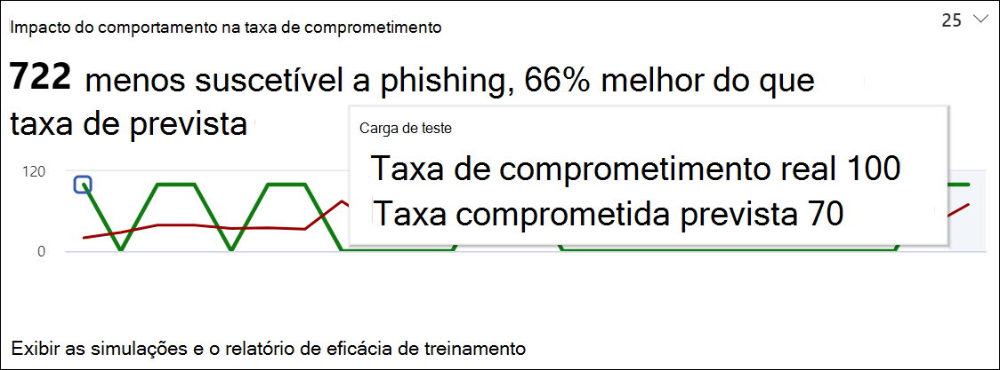
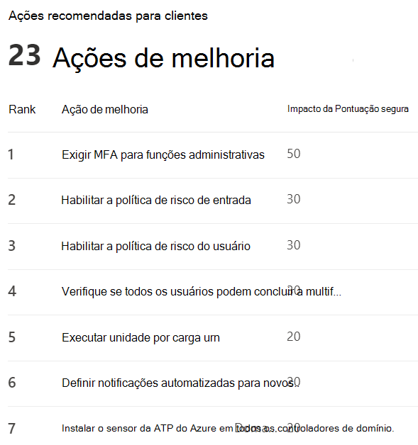

# Obter insights por meio do treinamento de simulação de Ataque

No treinamento de simulação de ataque, a Microsoft fornece informações com base nos resultados de simulações e treinamentos pelos funcionários. Essas informações ajudarão a mantê-lo informado sobre o progresso da preparação de ameaças de seus funcionários, bem como recomendar as próximas etapas para preparar melhor seus funcionários e seu ambiente para ataques.

Estamos trabalhando continuamente para expandir as percepções que estão disponíveis para você. O impacto no comportamento e as ações recomendadas estão disponíveis no momento. Para começar, vá para Treinamento de simulação de ataque no centro de segurança [do Microsoft 365.](https://security.microsoft.com/attacksimulator?viewid=overview)

## Impacto de comportamento na taxa de comprometimento

Na guia **Visão geral** do treinamento de simulação de ataque, você encontrará o impacto do comportamento no cartão de **taxa de** comprometimento. Este cartão mostra como os funcionários lidavam com as simulações que você fez em contraste com a taxa **de comprometimento prevista.** Você pode usar essas informações para acompanhar o progresso na preparação de ameaças de funcionários executando várias simulações nos mesmos grupos de funcionários.

No gráfico, você pode ver:

- **Taxa de comprometimento prevista** que reflete a taxa média de comprometimento para simulações usando o mesmo tipo de carga em outros locatários do Microsoft 365 que usam treinamento de simulação de ataque.
- **A taxa de comprometimento real** reflete a porcentagem de funcionários que caiu na simulação.

Além disso, reflete a diferença entre o número real de funcionários comprometidos pelo ataque e a taxa `<number> less susceptible to phishing` de comprometimento prevista. Esse número de funcionários é menos provável de ser comprometido por ataques semelhantes no futuro, enquanto indica como os funcionários fizeram em geral, em contraste com a taxa de comprometimento `<percent%> better than predicted rate` prevista.

> [!div class="mx-imgBorder"]
> 

Para ver um relatório mais detalhado, clique em **Exibir simulações e relatório** de eficácia de treinamento. Este relatório fornece as mesmas informações com contexto adicional da própria simulação (por exemplo, a técnica de simulação e o total de usuários direcionados).

## Ações recomendadas

Na guia [ **Simulações,**](https://security.microsoft.com/attacksimulator?viewid=simulations)selecionar uma simulação levará você aos detalhes da simulação, onde você encontrará a **seção Ações recomendadas.**

A seção ações recomendadas detalha as recomendações conforme disponível na [Pontuação Segura da Microsoft.](https://docs.microsoft.com/microsoft-365/security/defender/microsoft-secure-score) Essas recomendações se baseiam na carga usada na simulação e ajudarão você a proteger seus funcionários e seu ambiente. Clicar em cada ação de melhoria levará você aos detalhes.

> [!div class="mx-imgBorder"]
> 

## Links relacionados

[Começar a usar o Treinamento de simulação de ataque](attack-simulation-training-get-started.md)

[Criar uma simulação de ataque de phishing](attack-simulation-training.md)

[criar uma carga para treinar suas pessoas](attack-simulation-training-payloads.md)
