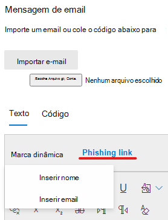
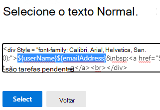

# Criar uma carga personalizada para treinamento de simulação de ataque

A Microsoft oferece um catálogo de carga robusto para várias técnicas de engenharia social para emparelhar com seu treinamento de simulação de ataque. No entanto, talvez você queira criar cargas personalizadas que funcionem melhor para sua organização. O seguinte descreve como criar uma carga no treinamento de simulação de ataque através do Microsoft defender para Office 365.

[!INCLUDE [Prerelease information](../includes/prerelease.md)]

Você pode criar uma carga clicando em **criar uma carga** na [guia **cargas** dedicadas](https://security.microsoft.com/attacksimulator?viewid=payload) ou no [Assistente de criação de simulação](attack-simulation-training.md#selecting-a-payload).

A primeira etapa do assistente terá que você selecionar um tipo de carga. **Atualmente, apenas o email está disponível**.

Em seguida, selecione uma técnica associada. Veja mais detalhes sobre as técnicas na [seleção de uma técnica de engenharia social](attack-simulation-training.md#selecting-a-social-engineering-technique).

Na próxima etapa, nomeie sua carga. Opcionalmente, você pode fornecer uma descrição.

## Configurar carga

Agora é hora de criar sua carga. Insira o nome do remetente, o email e o assunto do email na seção **detalhes do remetente** . Escolha uma URL de phishing na lista fornecida. Essa URL será incorporada posteriormente ao corpo da mensagem.

> [!TIP]
> Você pode escolher um email interno para o remetente da carga de conteúdo, que fará com que a carga apareça da mesma forma que vem de outro funcionário da empresa. Isso aumentará o susceptibility da carga e ajudará a educar os funcionários sobre o risco de ameaças internas.

Um editor de Rich Text está disponível para criar sua carga. Você também pode importar um email que você criou anteriormente. Ao estruturar o corpo do email, aproveite as **marcas dinâmicas** para personalizar o email para seus destinos. Clique em **link de phishing** para adicionar a URL de phishing selecionada anteriormente ao corpo do email.

> [!TIP]
> Para economizar tempo, alterne a opção para **substituir todos os links na mensagem de email pelo link de phishing**.

Após concluir a criação da carga de preferência, clique em **Avançar**.

## Adicionar indicadores

Os indicadores ajudarão os funcionários a passar pela simulação de ataque entendem o indício de que eles podem procurar em futuros ataques. Para começar, clique em **Adicionar indicador**.

Selecione um indicador que você gostaria de usar na lista suspensa. Essa lista é organizada para conter as dicas mais comuns que aparecem em mensagens de email de phishing. Depois de selecionado, certifique-se de que o posicionamento do indicador está definido para **o corpo do email** e clique em **selecionar texto**. Realce a parte da carga onde esse indicador aparece e clique em **selecionar**.

Adicione uma descrição personalizada para descrever o indicador e clique no quadro de visualização do indicador para ver uma visualização do indicador. Após concluir, clique em **Adicionar**. Repita essas etapas até que você tenha abordado todos os indicadores em sua carga.

## Examinar carga

Você terminou de criar sua carga. Agora é hora de revisar os detalhes e ver uma visualização da sua carga. A visualização incluirá todos os indicadores que você criou. Você pode editar cada parte da carga desta etapa. Depois de satisfeito, **envie** sua carga. 

> [!IMPORTANT]
> As cargas que você criou terão o **locatário** definido como sua fonte. Ao selecionar as cargas, certifique-se de que o **locatário** não foi filtrado.