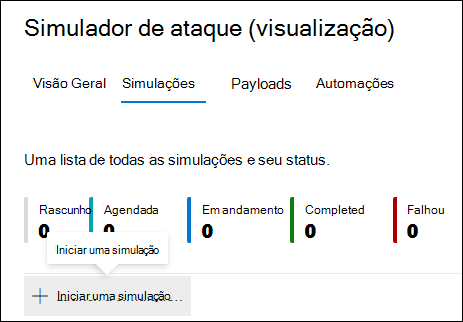
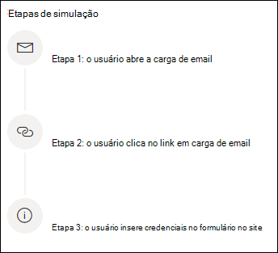
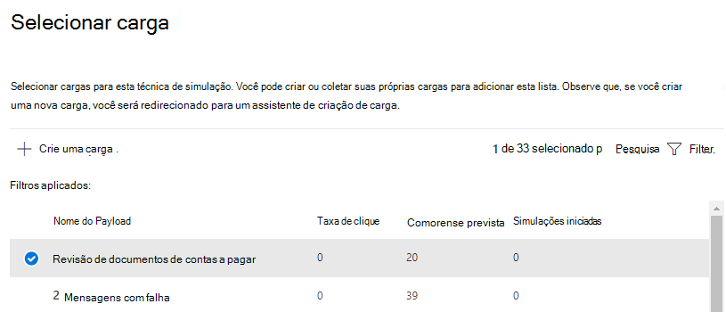
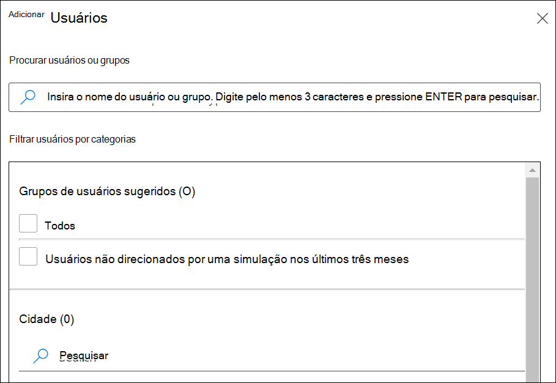
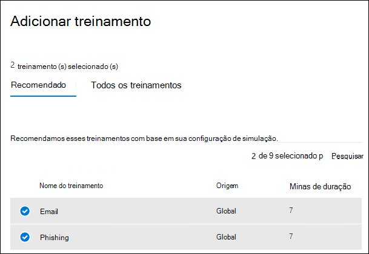

# Simular um ataque de phishing

O treinamento de simulação de ataque no Microsoft Defender para Office 365 permite que você execute simulações de ataques cibernéticos benignos em sua organização para testar suas políticas e práticas de segurança, bem como treinar seus funcionários para aumentar a conscientização e diminuir a suscetibilidade a ataques. Este artigo orienta você em meio à criação de um ataque simulado de phishing usando o treinamento de simulação de ataque.

Para obter informações de iniciação sobre treinamento de simulação de ataque, consulte [Começar a usar o treinamento de simulação de ataque.](attack-simulation-training-get-started.md)

Para iniciar um ataque simulado de phishing, abra o centro de segurança do [Microsoft 365,](https://security.microsoft.com/)vá para **Email &** treinamento de simulação de ataque de colaboração e alterne para a guia \>  [**Simulações.**](https://security.microsoft.com/attacksimulator?viewid=simulations)

Em **Simulações,** selecione **+ Iniciar uma simulação.**

> [!NOTE]
> A qualquer momento durante a criação da simulação, você pode salvar e fechar para continuar configurando a simulação posteriormente.

## Selecionando uma técnica de engenharia social

Selecione de 4 técnicas diferentes, selecionadas a partir da estrutura [MITRE ATT&CK® estrutura.](https://attack.mitre.org/techniques/enterprise/) Cargas diferentes estão disponíveis para diferentes técnicas:

- **A coleta de** credenciais tenta coletar credenciais levando os usuários a um site com aparência conhecida com caixas de entrada para enviar um nome de usuário e senha.
- **O anexo de malware** adiciona um anexo mal-intencionado a uma mensagem. Quando o usuário abre o anexo, é executado um código arbitrário que ajudará o invasor a comprometer o dispositivo do destino.
- **O link no anexo** é um tipo de coleta híbrida de credencial. Um invasor insere uma URL em um anexo de email. A URL dentro do anexo segue a mesma técnica que a coleta de credenciais.
- **O link para malware** executará alguns códigos arbitrários de um arquivo hospedado em um serviço de compartilhamento de arquivos conhecido. A mensagem enviada ao usuário conterá um link para esse arquivo mal-intencionado. Abrir o arquivo e ajudar o invasor a comprometer o dispositivo do destino.

> [!TIP]
> Clicar em Exibir **detalhes na** descrição de cada técnica exibirá mais informações e as etapas de simulação para a técnica.
>
> 

Depois de selecionar a técnica e clicar em **Próximo,** dê um nome à simulação e, opcionalmente, uma descrição.

## Selecionando uma carga

Em seguida, você precisará selecionar uma carga do catálogo de carga pré-existente.

As cargas têm vários pontos de dados para ajudá-lo a escolher:

- **A taxa de** clique conta quantas pessoas clicaram nessa carga.
- **A taxa de** comprometimento prevista prevê a porcentagem de pessoas que serão comprometidas por essa carga com base nos dados históricos da carga nos clientes do Microsoft Defender para Office 365.
- **As simulações lançadas** conta o número de vezes que essa carga foi usada em outras simulações.
- **A complexidade,** disponível por **meio** de filtros, é calculada com base no número de indicadores dentro da carga que indica um ataque. Mais indicadores levam à menor complexidade.
- **Source**, disponível por **meio** de filtros , indica se a carga foi criada em seu locatário ou é uma parte do catálogo de carga pré-existente da Microsoft (global).

Selecione uma carga na lista para ver uma visualização da carga com informações adicionais sobre ela.

Se você quiser criar sua própria carga, leia criar uma carga para treinamento [de simulação de ataque.](attack-simulation-training-payloads.md)

## Segmentação por público-alvo

Agora é hora de selecionar o público desta simulação. Você pode optar por **incluir todos os usuários em sua organização ou** incluir somente usuários e grupos **específicos.**

Ao optar por **incluir somente usuários e grupos específicos,** você pode:

- **Adicione** usuários , que permite que você aproveite a pesquisa para seu locatário, bem como recursos avançados de pesquisa e filtragem, como direcionamento para usuários que não foram direcionados por uma simulação nos últimos 3 meses.
  
- **A importação de CSV** permite importar um conjunto predefinido de usuários para esta simulação.

## Atribuindo treinamento

Recomendamos que você atribua treinamento para cada simulação, pois os funcionários que passam pelo treinamento são menos suscetíveis a ataques semelhantes.

Você pode optar por ter treinamento atribuído a você ou selecionar cursos e módulos de treinamento por conta própria.

Selecione a **data de vencimento do treinamento** para garantir que os funcionários terminem o treinamento em tempo hábil.

> [!NOTE]
> Se você optar por selecionar cursos e módulos por conta própria, ainda poderá ver o conteúdo recomendado, bem como todos os cursos e módulos disponíveis.
>
> 

Nas próximas etapas, você precisará adicionar **treinamentos** se optar por selecioná-lo por conta própria e personalizar sua página inicial de treinamento. Você poderá visualizar a página inicial de treinamento, bem como alterar o corpo e o header dela.

## Detalhes e revisão do lançamento

Agora que tudo está configurado, você pode iniciar essa simulação imediatamente ou agende-a para uma data posterior. Você também precisará escolher quando finalizar essa simulação. Paramos de capturar a interação com essa simulação após o tempo selecionado.

**Habilita a entrega de zona de** tempo ciente da região para entregar mensagens de ataque simuladas aos funcionários durante o horário de trabalho com base na região.

Quando terminar, clique em Próximo **e** revise os detalhes da simulação. Clique em **Editar** em qualquer uma das partes para voltar e alterar todos os detalhes que precisam ser mudados. Depois de terminar, clique **em Enviar.**
