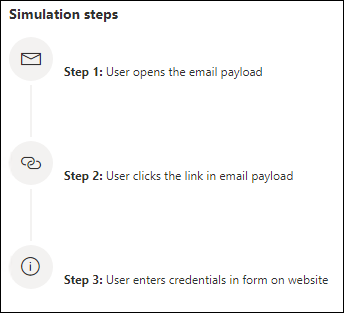

# Simular um ataque de phishingSimulate a phishing attack

**Aplica-se ao** [Microsoft Defender para Office 365 plano 2](defender-for-office-365.md)**Applies to** [Microsoft Defender for Office 365 plan 2](defender-for-office-365.md)

O treinamento de simulação de ataque no Microsoft Defender Office 365 permite que você execute simulações de ataques cibernéticos benignos em sua organização para testar suas políticas e práticas de segurança, bem como treinar seus funcionários para aumentar sua conscientização e diminuir sua suscetibilidade a ataques.Attack simulation training in Microsoft Defender for Office 365 lets you run benign cyberattack simulations on your organization to test your security policies and practices, as well as train your employees to increase their awareness and decrease their susceptibility to attacks. Este artigo orienta você a criar um ataque de phishing simulado usando treinamento de simulação de ataque.This article walks you through creating  a simulated phishing attack using attack simulation training.

Para obter informações sobre o treinamento de simulação de ataque, consulte [Começar a usar o treinamento de simulação de ataque.](attack-simulation-training-get-started.md)For getting started information about Attack simulation training, see [Get started using Attack simulation training](attack-simulation-training-get-started.md).

Para iniciar um ataque de phishing simulado, abra o portal do Microsoft 365 Defender ( ), acesse Email & colaboração Treinamento de simulação de ataque e alternar para a guia <https://security.microsoft.com/>  \>  **[Simulações.](https://security.microsoft.com/attacksimulator?viewid=simulations)**To launch a simulated phishing attack, open the Microsoft 365 Defender portal (<https://security.microsoft.com/>), go to **Email & collaboration** \> **Attack simulation training**, and switch to the **[Simulations](https://security.microsoft.com/attacksimulator?viewid=simulations)** tab.

Em **Simulações,** selecione **+ Iniciar uma simulação.**Under **Simulations**, select **+ Launch a simulation**.

> [!NOTE]
> A qualquer momento durante a criação da simulação, você pode salvar e fechar para continuar configurando a simulação posteriormente.At any point during simulation creation, you can save and close to continue configuring the simulation at a later time.

## Selecionar uma técnica de engenharia socialSelecting a social engineering technique

Selecione de 4 técnicas diferentes, com a curadoria da estrutura [MITRE ATT&CK® framework](https://attack.mitre.org/techniques/enterprise/).Select from 4 different techniques, curated from the [MITRE ATT&CK® framework](https://attack.mitre.org/techniques/enterprise/). Cargas diferentes estão disponíveis para diferentes técnicas:Different payloads are available for different techniques:

- **A coleta de** credenciais tenta coletar credenciais levando os usuários a um site de aparência conhecido com caixas de entrada para enviar um nome de usuário e uma senha.**Credential harvest** attempts to collect credentials by taking users to a well-known looking website with input boxes to submit a username and password.
- **O anexo de malware** adiciona um anexo mal-intencionado a uma mensagem.**Malware attachment** adds a malicious attachment to a message. Quando o usuário abre o anexo, o código arbitrário é executado que ajudará o invasor a comprometer o dispositivo do destino.When the user opens the attachment, arbitrary code is run that will help the attacker compromise the target's device.
- **Link in attachment** é um tipo de coleta de credenciais híbrida.**Link in attachment** is a type of credential harvest hybrid. Um invasor insere uma URL em um anexo de email.An attacker inserts a URL into an email attachment. A URL dentro do anexo segue a mesma técnica que a coleta de credenciais.The URL within the attachment follows the same technique as credential harvest.
- **O link para malware** executará algum código arbitrário de um arquivo hospedado em um serviço de compartilhamento de arquivos conhecido.**Link to malware** will run some arbitrary code from a file hosted on a well-known file sharing service. A mensagem enviada ao usuário conterá um link para esse arquivo mal-intencionado.The message sent to the user will contain a link to this malicious file. Abrir o arquivo e ajudar o invasor a comprometer o dispositivo do destino.Opening the file and help the attacker compromise the target's device.
- **A URL** de unidade por unidade é onde a URL mal-intencionada na mensagem leva o usuário a um site de aparência familiar que executa silenciosamente e/ou instala código de código no dispositivo do usuário.**Drive-by URL** is where the malicious URL in the message takes the user to a familiar-looking website that silently runs and/or installs code code on the user's device.

> [!TIP]
> Clicar em **Exibir detalhes na** descrição de cada técnica exibirá mais informações e as etapas de simulação da técnica.Clicking on **View details** within the description of each technique will display further information and the simulation steps for the technique.
>
> 

Depois de selecionar a técnica e clicar em **Next,** dê um nome à simulação e, opcionalmente, uma descrição.After you've selected the technique and clicked on **Next**, give your simulation a name and optionally a description.

## Selecionar uma cargaSelecting a payload

Em seguida, você precisará selecionar uma carga no catálogo de carga pré-existente.Next, you'll need to either select a payload from the pre-existing payload catalog.

Os carregadores têm vários pontos de dados para ajudá-lo a escolher:Payloads have a number of data points to help you choose:

- **A taxa de** clique conta quantas pessoas clicaram nessa carga.**Click rate** counts how many people clicked this payload.
- **A taxa de comprometimento** prevista prevê a porcentagem de pessoas que serão comprometidas por essa carga com base em dados históricos para a carga no Microsoft Defender para clientes Office 365.**Predicted compromise rate** predicts the percentage of people that will get compromised by this payload based on historical data for the payload across Microsoft Defender for Office 365 customers.
- **As simulações lançadas** contam o número de vezes que essa carga foi usada em outras simulações.**Simulations launched** counts the number of times this payload was used in other simulations.
- **A complexidade**, disponível por **meio** de filtros, é calculada com base no número de indicadores dentro da carga que a pista direciona para ele como um ataque.**Complexity**, available through **filters**, is calculated based on the number of indicators within the payload that clue targets in on it being an attack. Mais indicadores levam à menor complexidade.More indicators lead to lower complexity.
- **Source**, disponível por meio **de** filtros , indica se a carga foi criada em seu locatário ou faz parte do catálogo de carga pré-existente da Microsoft (global).**Source**, available through **filters**, indicates whether the payload was created on your tenant or is a part of Microsoft's pre-existing payload catalog (global).

Selecione uma carga na lista para ver uma visualização da carga com informações adicionais sobre ele.Select a payload from the list to see a preview of the payload with additional information about it.

Se você quiser criar sua própria carga, leia criar uma carga para treinamento de [simulação de ataque.](attack-simulation-training-payloads.md)If you'd like to create your own payload, read [create a payload for attack simulation training](attack-simulation-training-payloads.md).

## Segmentação por público-alvoAudience targeting

Agora é hora de selecionar a audiência dessa simulação.Now it's time to select this simulation's audience. Você pode optar por **incluir todos os usuários em sua organização ou** incluir apenas usuários e grupos **específicos.**You can choose to **include all users in your organization** or **include only specific users and groups**.

Ao optar por **incluir apenas usuários e grupos específicos,** você pode:When you choose to **include only specific users and groups** you can either:

- **Adicione usuários**, o que permite aproveitar a pesquisa para seu locatário, bem como recursos avançados de pesquisa e filtragem, como direcionar usuários que não foram direcionados por uma simulação nos últimos três meses.**Add users**, which allows you to leverage search for your tenant, as well as advanced search and filtering capabilities, like targeting users who haven't been targeted by a simulation in the last 3 months.

  

- **A importação de CSV** permite importar um conjunto predefinido de usuários para essa simulação.**Import from CSV** allows you to import a predefined set of users for this simulation.

## Atribuindo treinamentoAssigning training

Recomendamos que você atribua treinamento para cada simulação, pois os funcionários que passam pelo treinamento são menos suscetíveis a ataques semelhantes.We recommend that you assign training for each simulation, as employees who go through training are less susceptible to similar attacks.

Você pode optar por ter treinamento atribuído a você ou selecionar cursos de treinamento e módulos por conta própria.You can either choose to have training assigned for you or select training courses and modules yourself.

Selecione a **data de vencimento do treinamento** para garantir que os funcionários terminem o treinamento em tempo hábil.Select the **training due date** to make sure employees finish their training in a timely manner.

> [!NOTE]
> Se você optar por selecionar cursos e módulos por conta própria, ainda poderá ver o conteúdo recomendado, bem como todos os cursos e módulos disponíveis.If you choose to select courses and modules yourself, you'll still be able to see the recommended content as well as all available courses and modules.
>
> 

Nas próximas etapas, você precisará adicionar **treinamentos** se você optou por selecioná-lo por conta própria e personalizar sua página inicial de treinamento.In the next steps you'll need to **Add trainings** if you opted to select it yourself, and customize your training landing page. Você poderá visualizar a página de aterrissagem do treinamento, bem como alterar o header e o corpo dela.You'll be able to preview the training landing page, as well as change the header and body of it.

## Iniciar detalhes e revisarLaunch details and review

Agora que tudo está configurado, você pode iniciar essa simulação imediatamente ou agende-a para uma data posterior.Now that everything is configured, you can launch this simulation immediately or schedule it for a later date. Você também precisará escolher quando encerrar essa simulação.You will also need to choose when to end this simulation. Vamos parar de capturar a interação com essa simulação após o tempo selecionado.We will stop capturing interaction with this simulation past the selected time.

**Habilita a entrega de zona** de tempo ciente da região para entregar mensagens de ataque simuladas aos funcionários durante o horário de trabalho com base em sua região.**Enable region aware timezone delivery** to deliver simulated attack messages to your employees during their working hours based on their region.

Depois de terminar, clique em **Next** e revise os detalhes da simulação.Once you're done, click on **Next** and review the details of your simulation. Clique em **Editar** em qualquer uma das partes para voltar e alterar todos os detalhes que precisam ser mudados.Click on **Edit** on any of the parts to go back and change any details that need changing. Depois de terminar, clique em **Enviar**.Once done, click **Submit**.
