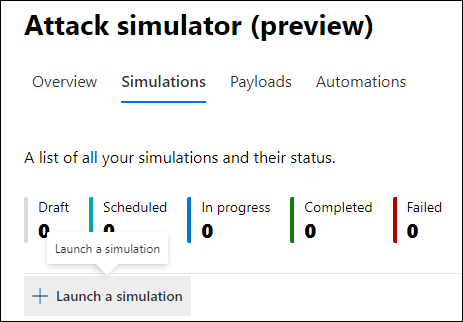

# Simular um ataque de phishing

**Aplica-se ao** [Microsoft Defender para Office 365 plano 2](defender-for-office-365.md)

O treinamento de simulação de ataque no Microsoft Defender Office 365 permite que você execute simulações de ataques cibernéticos benignos em sua organização para testar suas políticas e práticas de segurança, bem como treinar seus funcionários para aumentar sua conscientização e diminuir sua suscetibilidade a ataques. Este artigo orienta você a criar um ataque de phishing simulado usando treinamento de simulação de ataque.

Para obter informações sobre o treinamento de simulação de ataque, consulte [Começar a usar o treinamento de simulação de ataque.](attack-simulation-training-get-started.md)

Para iniciar um ataque de phishing simulado, abra o portal do Microsoft 365 Defender ( ), acesse Email & colaboração Treinamento de simulação de ataque e alternar para a guia <https://security.microsoft.com/>  \>  **[Simulações.](https://security.microsoft.com/attacksimulator?viewid=simulations)**

Em **Simulações,** selecione **+ Iniciar uma simulação.**

> [!NOTE]
> A qualquer momento durante a criação da simulação, você pode salvar e fechar para continuar configurando a simulação posteriormente.

## Selecionar uma técnica de engenharia social

Selecione de 4 técnicas diferentes, com a curadoria da estrutura [MITRE ATT&CK® framework](https://attack.mitre.org/techniques/enterprise/). Cargas diferentes estão disponíveis para diferentes técnicas:

- **A coleta de** credenciais tenta coletar credenciais levando os usuários a um site de aparência conhecido com caixas de entrada para enviar um nome de usuário e uma senha.
- **O anexo de malware** adiciona um anexo mal-intencionado a uma mensagem. Quando o usuário abre o anexo, o código arbitrário é executado que ajudará o invasor a comprometer o dispositivo do destino.
- **Link in attachment** é um tipo de coleta de credenciais híbrida. Um invasor insere uma URL em um anexo de email. A URL dentro do anexo segue a mesma técnica que a coleta de credenciais.
- **O link para malware** executará algum código arbitrário de um arquivo hospedado em um serviço de compartilhamento de arquivos conhecido. A mensagem enviada ao usuário conterá um link para esse arquivo mal-intencionado. Abrir o arquivo e ajudar o invasor a comprometer o dispositivo do destino.
- **A URL** de unidade por unidade é onde a URL mal-intencionada na mensagem leva o usuário a um site de aparência familiar que executa silenciosamente e/ou instala código de código no dispositivo do usuário.

> [!TIP]
> Clicar em **Exibir detalhes na** descrição de cada técnica exibirá mais informações e as etapas de simulação da técnica.
>
> 

Depois de selecionar a técnica e clicar em **Next,** dê um nome à simulação e, opcionalmente, uma descrição.

## Selecionar uma carga

Em seguida, você precisará selecionar uma carga no catálogo de carga pré-existente.

Os carregadores têm vários pontos de dados para ajudá-lo a escolher:

- **A taxa de** clique conta quantas pessoas clicaram nessa carga.
- **A taxa de comprometimento** prevista prevê a porcentagem de pessoas que serão comprometidas por essa carga com base em dados históricos para a carga no Microsoft Defender para clientes Office 365.
- **As simulações lançadas** contam o número de vezes que essa carga foi usada em outras simulações.
- **A complexidade**, disponível por **meio** de filtros, é calculada com base no número de indicadores dentro da carga que a pista direciona para ele como um ataque. Mais indicadores levam à menor complexidade.
- **Source**, disponível por meio **de** filtros , indica se a carga foi criada em seu locatário ou faz parte do catálogo de carga pré-existente da Microsoft (global).

Selecione uma carga na lista para ver uma visualização da carga com informações adicionais sobre ele.

Se você quiser criar sua própria carga, leia criar uma carga para treinamento de [simulação de ataque.](attack-simulation-training-payloads.md)

## Segmentação por público-alvo

Agora é hora de selecionar a audiência dessa simulação. Você pode optar por **incluir todos os usuários em sua organização ou** incluir apenas usuários e grupos **específicos.**

Ao optar por **incluir apenas usuários e grupos específicos,** você pode:

- **Adicione usuários**, o que permite aproveitar a pesquisa para seu locatário, bem como recursos avançados de pesquisa e filtragem, como direcionar usuários que não foram direcionados por uma simulação nos últimos três meses.

  

- **A importação de CSV** permite importar um conjunto predefinido de usuários para essa simulação.

## Atribuindo treinamento

Recomendamos que você atribua treinamento para cada simulação, pois os funcionários que passam pelo treinamento são menos suscetíveis a ataques semelhantes.

Você pode optar por ter treinamento atribuído a você ou selecionar cursos de treinamento e módulos por conta própria.

Selecione a **data de vencimento do treinamento** para garantir que os funcionários terminem o treinamento em tempo hábil.

> [!NOTE]
> Se você optar por selecionar cursos e módulos por conta própria, ainda poderá ver o conteúdo recomendado, bem como todos os cursos e módulos disponíveis.
>
> 

Nas próximas etapas, você precisará adicionar **treinamentos** se você optou por selecioná-lo por conta própria e personalizar sua página inicial de treinamento. Você poderá visualizar a página de aterrissagem do treinamento, bem como alterar o header e o corpo dela.

## Iniciar detalhes e revisar

Agora que tudo está configurado, você pode iniciar essa simulação imediatamente ou agende-a para uma data posterior. Você também precisará escolher quando encerrar essa simulação. Vamos parar de capturar a interação com essa simulação após o tempo selecionado.

**Habilita a entrega de zona** de tempo ciente da região para entregar mensagens de ataque simuladas aos funcionários durante o horário de trabalho com base em sua região.

Depois de terminar, clique em **Next** e revise os detalhes da simulação. Clique em **Editar** em qualquer uma das partes para voltar e alterar todos os detalhes que precisam ser mudados. Depois de terminar, clique em **Enviar**.
