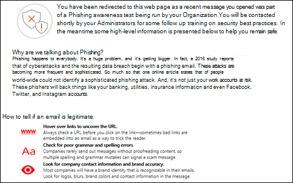

# Simulador de Ataque no Microsoft Defender para Office 365Attack Simulator in Microsoft Defender for Office 365

[!INCLUDE [Microsoft 365 Defender rebranding](../includes/microsoft-defender-for-office.md)]

**Aplica-se ao** [Microsoft Defender para Office 365 plano 2](https://go.microsoft.com/fwlink/?linkid=2148715)**Applies to** [Microsoft Defender for Office 365 plan 2](https://go.microsoft.com/fwlink/?linkid=2148715)

Se sua organização tiver o Microsoft Defender para Office 365 Plano 2, que inclui recursos de Investigação e Resposta contra [Ameaças,](office-365-ti.md)você poderá usar o Simulador de Ataques no Centro de Conformidade e Segurança & para executar cenários de ataque realistas em sua organização.If your organization has Microsoft Defender for Office 365 Plan 2, which includes [Threat Investigation and Response capabilities](office-365-ti.md), you can use Attack Simulator in the Security & Compliance Center to run realistic attack scenarios in your organization. Esses ataques simulados podem ajudá-lo a identificar e encontrar usuários vulneráveis antes que um ataque real a impacte seu resultado final.These simulated attacks can help you identify and find vulnerable users before a real attack impacts your bottom line. Leia este artigo para saber mais.Read this article to learn more.

> [!NOTE]
> A experiência do Simulador de Ataque v1 foi alternada para o modo somente leitura e substituída pelo treinamento do simulador de ataques descrito em Começar a usar o treinamento de [simulação de ataque.](attack-simulation-training-get-started.md)Attack Simulator v1 experience has been switched to read-only mode and replaced by Attack simulator training that's described in [Get started using Attack simulation training](attack-simulation-training-get-started.md).
> A capacidade de iniciar novas simulações deste site foi desabilitada.The ability to launch new simulations from this site has been disabled. No entanto, você ainda pode acessar relatórios de simulações executados por um período de 90 dias a partir de 24 de janeiro de 2021.However, you can still access reports for simulations run for a period of 90 days from January 24, 2021.

## O que você precisa saber antes de começar?What do you need to know before you begin?

- Para abrir o Centro de Conformidade e Segurança, acesse <https://protection.office.com/>.To open the Security & Compliance Center, go to <https://protection.office.com/>. Simulador de ataque está disponível no **Simulador de** \> **ataques de gerenciamento de ameaças.**Attack simulator is available at **Threat management** \> **Attack simulator**. Vá diretamente para o simulador de ataques, <https://protection.office.com/attacksimulator> abra.Go go directly to attack simulator, open <https://protection.office.com/attacksimulator>.

- Para saber mais sobre a disponibilidade do Simulador de Ataque em diferentes assinaturas do Microsoft 365, confira a descrição do serviço do [Microsoft Defender para Office 365.](https://docs.microsoft.com/office365/servicedescriptions/office-365-advanced-threat-protection-service-description)For more information about the availability of Attack Simulator across different Microsoft 365 subscriptions, see [Microsoft Defender for Office 365 service description](https://docs.microsoft.com/office365/servicedescriptions/office-365-advanced-threat-protection-service-description).

- Você precisa ser membro dos grupos de função Gerenciamento da Organização **ou** **Administrador de** Segurança.You need to be a member of the **Organization Management** or **Security Administrator** role groups. Para obter mais informações sobre grupos de funções no Centro de Conformidade e Segurança, confira [Permissões no Centro de Conformidade e Segurança](permissions-in-the-security-and-compliance-center.md).For more information about role groups in the Security & Compliance Center, see [Permissions in the Security & Compliance Center](permissions-in-the-security-and-compliance-center.md).

- Sua conta precisa ser configurada para autenticação multifatória (MFA) para criar e gerenciar campanhas no Simulador de Ataques.Your account needs to be configured for multi-factor authentication (MFA) to create and manage campaigns in Attack Simulator. Para obter instruções, [consulte Configurar a autenticação multifa factor.](https://docs.microsoft.com/microsoft-365/admin/security-and-compliance/set-up-multi-factor-authentication)For instructions, see [Set up multi-factor authentication](https://docs.microsoft.com/microsoft-365/admin/security-and-compliance/set-up-multi-factor-authentication).

- As campanhas de phishing coletarão e processarão eventos por 30 dias.Phishing campaigns will collect and process events for 30 days. Os dados históricos da campanha estarão disponíveis por até 90 dias após o lançamento da campanha.Historical campaign data will be available for up to 90 days after you launch the campaign.

- Os dados relacionados à simulação de ataque e treinamento são armazenados com outros dados do cliente para os serviços do Microsoft 365.Attack simulation and training related data is stored with other customer data for Microsoft 365 services. Para saber mais, confira [locais de dados do Microsoft 365.](/microsoft-365/enterprise/o365-data-locations)For more information see [Microsoft 365 data locations](/microsoft-365/enterprise/o365-data-locations).

- Não há cmdlets do PowerShell correspondentes para o Simulador de Ataque.There are no corresponding PowerShell cmdlets for Attack Simulator.

## Campanhas de phishing em bandaSpear phishing campaigns

*Phishing* é um termo genérico para ataques de email que tentam roubar informações confidenciais em mensagens que parecem ser de envios legítimos ou confiáveis.*Phishing* is a generic term for email attacks that try to steal sensitive information in messages that appear to be from legitimate or trusted senders. *O phishing* em busca de phishing é um ataque de phishing direcionado que usa conteúdo focado e personalizado especificamente adaptado aos destinatários-alvo (normalmente, após a ida e volta aos destinatários pelo invasor).*Spear phishing* is a targeted phishing attack that uses focused and customized content that's specifically tailored to the targeted recipients (typically, after reconnaissance on the recipients by the attacker).

No Simulador de Ataques, dois tipos diferentes de campanhas de phishing de phishing estão disponíveis:In Attack Simulator, two different types of spear phishing campaigns are available:

- **Phishing de nome (coleta de credenciais)**: o ataque tenta convencer os destinatários a clicar em uma URL na mensagem.**Spear phishing (credentials harvest)**: The attack tries to convince the recipients to click a URL in the message. Se eles clicarem no link, serão solicitados a inserir suas credenciais.If they click the link, they're asked to enter their credentials. Se o fizerem, eles serão levados para um dos seguintes locais:If they do, they're taken to one of the following locations:

  - Uma página padrão que explica que isso foi apenas um teste e fornece dicas para reconhecer mensagens de phishing.A default page that explains that this was a just a test, and gives tips for recognizing phishing messages.

    

  - Uma página personalizada (URL) que você especificar.A custom page (URL) that you specify.

- **Phishing (anexo)**: o ataque tenta convencer os destinatários a abrir um anexo .docx ou .pdf na mensagem.**Spear phishing (attachment)**: The attack tries to convince the recipients to open a .docx or .pdf attachment in the message. O anexo contém o mesmo conteúdo do link de phishing padrão, mas a primeira frase começa com " \<Display Name\> , you are seeing this message as a recent email message you opened...".The attachment contains the same content from the default phishing link, but the first sentence starts with "\<Display Name\>, you are seeing this message as a recent email message you opened...".

> [!NOTE]
> Atualmente, as campanhas de phishing em phishing no Simulador de Ataques não expiram.Currently, spear phishing campaigns in Attack Simulator don't expire.

### Criar uma campanha de phishing em forma de phishingCreate a spear phishing campaign

Uma parte importante de qualquer campanha de phishing é a aparência da mensagem de email que é enviada aos destinatários de alvo.An important part of any spear phishing campaign is the look and feel of the email message that's sent to the targeted recipients. Para criar e configurar a mensagem de email, você tem estas opções:To create and configure the email message, you have these options:

- **Use um modelo de email integrado:** dois modelos integrados estão disponíveis: **Giveaway e Payroll** **Update.****Use a built-in email template**: Two built-in templates are available: **Prize Giveaway** and **Payroll Update**. Você pode personalizar ainda mais algumas, todas ou nenhuma das propriedades de email do modelo ao criar e iniciar a campanha.You can further customize some, all, or none of the email properties from the template when you create and launch the campaign.

- **Crie um modelo de email** reutilizável: depois de criar e salvar o modelo de email, você poderá usá-lo novamente em futuras campanhas de phishing.**Create a reusable email template**: After you create and save the email template, you can use it again in future spear phishing campaigns. Você pode personalizar ainda mais algumas, todas ou nenhuma das propriedades de email do modelo ao criar e iniciar a campanha.You can further customize some, all, or none of the email properties from the template when you create and launch the campaign.

- **Crie a mensagem de email no assistente:** você pode criar a mensagem de email diretamente no assistente ao criar e iniciar a campanha de phishing.**Create the email message in the wizard**: You can create the email message directly in the wizard as you create and launch the spear phishing campaign.

#### Etapa 1 (opcional): criar um modelo de email personalizadoStep 1 (Optional): Create a custom email template

Se você for usar um dos modelos integrados ou criar a mensagem de email diretamente no assistente, ignore esta etapa.If you're going to use one of the built-in templates or create the email message directly in the wizard, you can skip this step.

1. No Centro de Conformidade & segurança, vá para o simulador de ataques **de gerenciamento** \> **de ameaças.**In the Security & Compliance Center, go to **Threat management** \> **Attack simulator**.

2. Na página **Simular ataques,** nas seções Phishing de Phishing de Phishing (Credenciais **de Coleta)** ou Phishing de **Phishing (Anexo),** clique em **Detalhes do Ataque.**On the **Simulate attacks** page, in either the **Spear Phishing (Credentials Harvest)** or **Spear Phishing (Attachment)** sections, click **Attack Details**.

   Não importa onde você criar o modelo.It doesn't matter where you create the template. As opções disponíveis no modelo são as mesmas para ambos os tipos de ataques de phishing.The available options in the template are the same for both types of phishing attacks.

3. Na página Detalhes **do** ataque que é aberta, na  seção Modelos de **Phishing,** na área Criar Modelos, clique em **Novo Modelo.**In the **Attack details** page that opens, in the **Phishing Templates** section, in the **Create Templates** area, click **New Template**.

4. O **assistente Configurar Modelo de Phishing** é iniciado em um novo flyout.The **Configure Phishing Template** wizard starts in a new flyout. Na etapa **Iniciar,** insira um nome de exibição exclusivo para o modelo e clique em **Próximo.**In the **Start** step, enter a unique display name for the template, and then click **Next**.

5. Na etapa **Configurar detalhes de email,** de configure as seguintes configurações:In the **Configure email details** step, configure the following settings:

   - **De (Nome)**: o nome de exibição usado para o remetente da mensagem.**From (Name)**: The display name that's used for the message sender.

   - **De (Email)**: o endereço de email do remetente.**From (Email)**: The sender's email address.

   - **URL do Servidor de Logon de Phishing:** clique no drop down e selecione uma das URLs disponíveis na lista.**Phishing Login Server URL**: Click the drop down and select one of the available URLs from the list. Esta é a URL em que os usuários serão tentados a clicar.This is the URL that users will be tempted to click. As opções são:The choices are:

     - <http://portal.docdeliveryapp.com>
     - <http://portal.docdeliveryapp.net>
     - <http://portal.docstoreinternal.com>
     - <http://portal.docstoreinternal.net>
     - <http://portal.hardwarecheck.net>
     - <http://portal.hrsupportint.com>
     - <http://portal.payrolltooling.com>
     - <http://portal.payrolltooling.net>
     - <http://portal.prizegiveaway.net>
     - <http://portal.prizesforall.com>
     - <http://portal.salarytoolint.com>
     - <http://portal.salarytoolint.net>

     > [!NOTE]
     >
     > Um serviço de reputação de URL pode identificar uma ou mais dessas URLs como não seguras.A URL reputation service might identify one or more of these URLs as unsafe. Verifique a disponibilidade da URL em seus navegadores da Web com suporte antes de usar a URL em uma campanha de phishing.Check the availability of the URL in your supported web browsers before you use the URL in a phishing campaign.

   - **URL da Página de** Aterrissagem Personalizada: insira uma página inicial opcional onde os usuários serão levados se clicarem no link de phishing e inserirem suas credenciais.**Custom Landing Page URL**: Enter an optional landing page where users are taken if they click the phishing link and enter their credentials. Esse link substitui a página de aterrissagem padrão.This link replaces the default landing page. Por exemplo, se você tiver treinamento interno de reconhecimento, poderá especificar essa URL aqui.For example, if you have internal awareness training, you can specify that URL here.

   - **Categoria**: Atualmente, essa configuração não é usada (qualquer coisa que você inserir será ignorada).**Category**: Currently, this setting isn't used (anything you enter is ignored).

   - **Assunto**: o **campo Assunto** da mensagem de email.**Subject**: The **Subject** field of the email message.

   Quando terminar, clique em **Avançar**.When you're finished, click **Next**.

6. Na etapa **Redigir email,** crie o corpo da mensagem de email.In the **Compose email** step, create the message body of the email message. Você pode usar a **guia Email** (um editor de HTML rico) ou a guia **Fonte** (código HTML bruto).You can use the **Email** tab (a rich HTML editor) or the **Source** tab (raw HTML code).

   A formatação HTML pode ser tão simples ou complexa quanto você precisa.The HTML formatting can be as simple or complex as you need it to be. Você pode inserir imagens e texto para melhorar a capacidade de acreditar da mensagem no cliente de email do destinatário.You can insert images and text to enhance the believability of the message in the recipient's email client.

   - `${username}` insere o nome do destinatário.`${username}` inserts the recipient's name.

   - `${loginserverurl}` insere o valor da URL do Servidor de Logon de **Phishing** da etapa anterior.`${loginserverurl}` inserts the **Phishing Login Server URL** value from the previous step.

   Quando terminar, clique em **Avançar**.When you're finished, click **Next**.

7. Na etapa **Confirmar,** clique em **Concluir.**In the **Confirm** step, click **Finish**.

#### Etapa 2: criar e iniciar a campanha de phishing de phishingStep 2: Create and launch the spear phishing campaign

1. No Centro de Conformidade & segurança, vá para o simulador de ataques **de gerenciamento** \> **de ameaças.**In the Security & Compliance Center, go to **Threat management** \> **Attack simulator**.

2. Na página **Simular ataques,** faça uma das seguintes seleções com base no tipo de campanha que você deseja criar:On the **Simulate attacks** page, make one of the following selections based on the type of campaign you want to create:

   - Na seção **Phishing de Phishing (Coleta de Credenciais),** clique em **Iniciar** Ataque ou em **Ataque de Detalhes** de \> **Ataque.**In the **Spear Phishing (Credentials Harvest)** section, click **Launch Attack** or click **Attack Details** \> **Launch Attack**.

   - Na seção **Phishing de Phishing (Anexo),** clique em **Iniciar Ataque** ou em **Ataque de Detalhes** de \> **Ataque.**In the **Spear Phishing (Attachment)** section, click **Launch Attack** or click **Attack Details** \> **Launch Attack**.

3. O **assistente Configurar Ataque de Phishing** é iniciado em um novo flyout.The **Configure Phishing Attack** wizard starts in a new flyout. Na etapa **Iniciar,** faça uma das seguintes etapas:In the **Start** step, do one of the following steps:

   - Na caixa **Nome,** insira um nome de exibição exclusivo para a campanha.In the **Name** box, enter a unique display name for the campaign. Não clique em **Usar Modelo,** pois você criará a mensagem de email posteriormente no assistente.Don't click **Use Template**, because you'll create the email message later in the wizard.

   - Clique **em Usar** Modelo e selecione um modelo de email integrado ou personalizado.Click **Use Template** and select a built-in or custom email template. Depois de selecionar o modelo, a **caixa** Nome será preenchida automaticamente com base no modelo, mas você poderá alterar o nome.After you select the template, the **Name** box is automatically filled based on the template, but you can change the name.

   > [!div class="mx-imgBorder"]
   > 

   Quando terminar, clique em **Avançar**.When you're finished, click **Next**.

4. Na etapa **Destinatários de destino,** faça uma das seguintes etapas:In the **Target recipients** step, do one of the following steps:

   - Clique **no Livro de** Endereços para selecionar os destinatários (usuários ou grupos) da campanha.Click **Address Book** to select the recipients (users or groups) for the campaign. Cada destinatário de alvo deve ter uma caixa de correio do Exchange Online.Each targeted recipient must have an Exchange Online mailbox. Se você clicar em **Filtrar** **e Aplicar** sem inserir critérios de pesquisa, todos os destinatários serão retornados e adicionados à campanha.If you click **Filter** and **Apply** without entering a search criteria, all recipients are returned and added to the campaign.

   - Clique **em Importar** e **Importar** Arquivo para importar um valor separado por vírgula (CSV) ou arquivo separado por linha de endereços de email.Click **Import** then **File Import** to import a comma-separated value (CSV) or line-separated file of email addresses. Cada linha deve conter o endereço de email do destinatário.Each line must contain the recipient's email address.

   Quando terminar, clique em **Avançar**.When you're finished, click **Next**.

5. Na etapa **Configurar detalhes de email,** de configure as seguintes configurações:In the **Configure email details** step, configure the following settings:

   Se você selecionou um modelo **na** etapa Iniciar, a maioria desses valores já está configurada, mas você pode alterá-los.If you selected a template in the **Start** step, most of these values are already configured, but you can change them.

   - **De (Nome)**: o nome de exibição usado para o remetente da mensagem.**From (Name)**: The display name that's used for the message sender.

   - **De (Email)**: o endereço de email do remetente.**From (Email)**: The sender's email address. Você pode inserir um endereço de email real ou falso do domínio de email da sua organização ou pode inserir um endereço de email externo real ou falso.You can enter a real or fake email address from your organization's email domain, or you can enter a real or fake external email address. Um endereço de email válido do remetente da sua organização será, na verdade, resolvido no cliente de email do destinatário.A valid sender email address from your organization will actually resolve in the recipient's email client.

   - **URL do Servidor de Logon de Phishing:** clique no drop down e selecione uma das URLs disponíveis na lista.**Phishing Login Server URL**: Click the drop down and select one of the available URLs from the list. Esta é a URL em que os usuários serão tentados a clicar.This is the URL that users will be tempted to click. As opções são:The choices are:

     - <http://portal.docdeliveryapp.com>
     - <http://portal.docdeliveryapp.net>
     - <http://portal.docstoreinternal.com>
     - <http://portal.docstoreinternal.net>
     - <http://portal.hardwarecheck.net>
     - <http://portal.hrsupportint.com>
     - <http://portal.payrolltooling.com>
     - <http://portal.payrolltooling.net>
     - <http://portal.prizegiveaway.net>
     - <http://portal.prizesforall.com>
     - <http://portal.salarytoolint.com>
     - <http://portal.salarytoolint.net>

     > [!NOTE]
     >
     > - Todas as URLs são intencionalmente http, não https.All of the URLs are intentionally http, not https.
     >
     > - Um serviço de reputação de URL pode identificar uma ou mais dessas URLs como não seguras.A URL reputation service might identify one or more of these URLs as unsafe. Verifique a disponibilidade da URL em seus navegadores da Web com suporte antes de usar a URL em uma campanha de phishing.Check the availability of the URL in your supported web browsers before you use the URL in a phishing campaign.
     >
     > - Você precisa selecionar uma URL.You are required to select a URL. Para **campanhas** de Phishing de Phishing (Anexo), você pode remover o link do corpo da mensagem na próxima etapa (caso contrário, a mensagem conterá um **link** e um anexo).For **Spear Phishing (Attachment)** campaigns, you can remove the link from the body of the message in the next step (otherwise, the message will contain both a link **and** an attachment).

   - **Tipo de anexo:** essa configuração só está disponível em campanhas **de Phishing (Anexo).****Attachment Type**: This setting is only available in **Spear Phishing (Attachment)** campaigns. Clique no drop down e selecione **. DOCX** ou **. PDF** da lista.Click the drop down and select **.DOCX** or **.PDF** from the list.

   - **Nome do** anexo: essa configuração só está disponível em campanhas **de Phishing de Phishing (Anexo).****Attachment Name**: This setting is only available in **Spear Phishing (Attachment)** campaigns. Insira um nome de arquivo para o anexo .docx ou .pdf.Enter a filename for the .docx or .pdf attachment.

   - **URL da Página de** Aterrissagem Personalizada: insira uma página inicial opcional onde os usuários serão levados se clicarem no link de phishing e inserirem suas credenciais.**Custom Landing Page URL**: Enter an optional landing page where users are taken if they click the phishing link and enter their credentials. Esse link substitui a página de aterrissagem padrão.This link replaces the default landing page. Por exemplo, se você tiver treinamento interno de reconhecimento, poderá especificar essa URL aqui.For example, if you have internal awareness training, you can specify that URL here.

   - **Assunto**: o **campo Assunto** da mensagem de email.**Subject**: The **Subject** field of the email message.

   Quando terminar, clique em **Avançar**.When you're finished, click **Next**.

6. Na etapa **Redigir email,** crie o corpo da mensagem de email.In the **Compose email** step, create the message body of the email message. Se você selecionou um modelo **na** etapa Iniciar, o corpo da mensagem já está configurado, mas você pode personalizá-lo.If you selected a template in the **Start** step, the message body is already configured, but you can customize it. Você pode usar a **guia Email** (um editor de HTML rico) ou a guia **Fonte** (código HTML bruto).You can use the **Email** tab (a rich HTML editor) or the **Source** tab (raw HTML code).

   A formatação HTML pode ser tão simples ou complexa quanto você precisa.The HTML formatting can be as simple or complex as you need it to be. Você pode inserir imagens e texto para melhorar a capacidade de acreditar da mensagem no cliente de email do destinatário.You can insert images and text to enhance the believability of the message in the recipient's email client.

   - `${username}` insere o nome do destinatário.`${username}` inserts the recipient's name.

   - `${loginserverurl}`insere o valor da URL do Servidor de **Logon de Phishing.**`${loginserverurl}` inserts the **Phishing Login Server URL** value.

   Para campanhas de **Phishing** de Phishing (Anexo), você deve remover o link do corpo da mensagem (caso contrário, a mensagem conterá um **link** e um anexo, e os cliques de link não são rastreados em uma campanha de anexo).For **Spear Phishing (Attachment)** campaigns, you should remove the link from the body of the message (otherwise, the message will contain both a link **and** an attachment, and link clicks aren't tracked in an attachment campaign).

   > [!div class="mx-imgBorder"]
   > 

   Quando terminar, clique em **Avançar**.When you're finished, click **Next**.

7. Na etapa **Confirmar,** clique em **Concluir** para iniciar a campanha.In the **Confirm** step, click **Finish** to launch the campaign. A mensagem de phishing é entregue aos destinatários de alvo.The phishing message is delivered to the targeted recipients.

## Campanhas de ataque de senhaPassword attack campaigns

Um *ataque de senha* tenta adivinhar senhas para contas de usuário em uma organização, normalmente depois que o invasor identifica uma ou mais contas de usuário válidas.A *password attack* tries to guess passwords for user accounts in an organization, typically after the attacker has identified one or more valid user accounts.

No Simulador de Ataques, dois tipos diferentes de campanhas de ataque de senha estão disponíveis para você testar a complexidade das senhas dos usuários:In Attack Simulator, two different types of password attack campaigns are available for you to test the complexity of your users' passwords:

- Senha de força bruta (ataque  de  **dicionário)**: um ataque de força bruta ou de dicionário usa um arquivo de dicionário grande de senhas em uma conta de usuário com a expectativa de que uma delas funcione (muitas senhas em uma conta).**Brute force password (dictionary attack)**: A *brute force* or *dictionary* attack uses a large dictionary file of passwords on a user account with the hope that one of them will work (many passwords against one account). Bloqueios de senha incorretos ajudam a impedir ataques de senha de força bruta.Incorrect password lock-outs help deter brute force password attacks.

  Para o ataque de dicionário, você pode especificar uma ou várias senhas para tentar (inseridas manualmente ou em um arquivo carregado) e você pode especificar um ou vários usuários.For the dictionary attack, you can specify one or many passwords to try (manually entered or in an uploaded file), and you can specify one or many users.

- **Ataque de pulverização de** senha: um ataque de *pulverização* de senha usa a mesma senha cuidadosamente considerada em uma lista de contas de usuário (uma senha em várias contas).**Password spray attack**: A *password spray* attack uses the same carefully considered password against a list of user accounts (one password against many accounts). Os ataques de pulverização de senha são mais difíceis de detectar do que ataques de senha de força bruta (a probabilidade de sucesso aumenta quando um invasor tenta uma senha em dezenas ou centenas de contas sem o risco de bloquear a senha incorreta do usuário).Password spray attacks are harder to detect than brute force password attacks (the probability of success increases when an attacker tries one password across dozens or hundreds of accounts without the risk of tripping the user's incorrect password lock-out).

  Para o ataque de pulverização de senha, você só pode especificar uma senha para tentar e você pode especificar um ou vários usuários.For the password spray attack, you can only specify one password to try, and you can specify one or many users.

> [!NOTE]
> Os ataques de senha no Simulador de Ataque passam o nome de usuário e a senha Solicitações de autenticação básicas para um ponto de extremidade, para que também funcionem com outros métodos de autenticação (AD FS, sincronização de hash de senha, passagem, PingFederate, etc.).The password attacks in Attack Simulator pass username and password Basic auth requests to an endpoint, so they also work with other authentication methods (AD FS, password hash sync, pass-through, PingFederate, etc.). Para usuários que têm a MFA habilitada, mesmo se o ataque de senha tentar sua senha real,  a tentativa sempre será registrar como uma falha (em outras palavras, os usuários de MFA nunca aparecerão na contagem de tentativas bem-sucedidas da campanha).For users that have MFA enabled, even if the password attack tries their actual password, the attempt will always register as a failure (in other words, MFA users will never appear in the **Successful attempts** count of the campaign). Esse é o resultado esperado.This is the expected result. A MFA é um método principal para ajudar a proteger contra ataques de senha.MFA is a primary method to help protect against password attacks.

### Criar e iniciar uma campanha de ataque de senhaCreate and launch a password attack campaign

1. No Centro de Conformidade & segurança, vá para o simulador de ataques **de gerenciamento** \> **de ameaças.**In the Security & Compliance Center, go to **Threat management** \> **Attack simulator**.

2. Na página **Simular ataques,** faça uma das seguintes seleções com base no tipo de campanha que você deseja criar:On the **Simulate attacks** page, make one of the following selections based on the type of campaign you want to create:

   - Na seção **Senha de Força Bruta (Ataque de** Dicionário), clique em **Iniciar** Ataque ou em Ataque **de Detalhes** \> **de Ataque.**In the **Brute Force Password (Dictionary Attack)** section, click **Launch Attack** or click **Attack Details** \> **Launch Attack**.

   - na seção **Ataque de pulverização de** senha, clique em Iniciar **Ataque** ou em Ataque **de Detalhes** \> **de Ataque.**in the **Password spray attack** section, click **Launch Attack** or click **Attack Details** \> **Launch Attack**.

3. O **Assistente para Configurar Ataque** de Senha é iniciado em um novo flyout.The **Configure Password Attack** wizard starts in a new flyout. Na etapa **Iniciar,** insira um nome de exibição exclusivo para a campanha e clique em **Próximo.**In the **Start** step, enter a unique display name for the campaign, and then click **Next**.

4. Na etapa **Usuários de** destino, faça uma das seguintes etapas:In the **Target users** step, do one of the following steps:

   - Clique **no Livro de** Endereços para selecionar os destinatários (usuários ou grupos) da campanha.Click **Address Book** to select the recipients (users or groups) for the campaign. Cada destinatário de alvo deve ter uma caixa de correio do Exchange Online.Each targeted recipient must have an Exchange Online mailbox. Se você clicar em **Filtrar** **e Aplicar** sem inserir critérios de pesquisa, todos os destinatários serão retornados e adicionados à campanha.If you click **Filter** and **Apply** without entering a search criteria, all recipients are returned and added to the campaign.

   - Clique **em Importar** e **Importar** Arquivo para importar um valor separado por vírgula (CSV) ou arquivo separado por linha de endereços de email.Click **Import** then **File Import** to import a comma-separated value (CSV) or line-separated file of email addresses. Cada linha deve conter o endereço de email do destinatário.Each line must contain the recipient's email address.

   Quando terminar, clique em **Avançar**.When you're finished, click **Next**.

5. Na etapa **Escolher configurações de ataque,** escolha o que fazer com base no tipo de campanha:In the **Choose attack settings** step, choose what to do based on the campaign type:

   - **Senha de Força Bruta (Ataque de Dicionário)**: faça uma das seguintes etapas:**Brute Force Password (Dictionary Attack)**: Do either of the following steps:

     - **Insira senhas manualmente:** pressione **Enter para adicionar uma caixa** de senha, digite uma senha e pressione ENTER.**Enter passwords manually**: In the **Press enter to add a password** box, type a password and then press ENTER. Repita essa etapa quantas vezes forem necessárias.Repeat this step as many times as necessary.

     - **Carregar senhas de um** arquivo  de dicionário: clique em Carregar para importar um arquivo de texto existente que contenha uma senha em cada linha e uma última linha em branco.**Upload passwords from a dictionary file**: Click **Upload** to import an existing text file that contains one password on each line and a blank last line. O arquivo de texto deve ter 10 MB ou menos de tamanho e não pode conter mais de 30.000 senhas.The text file must be 10 MB or less in size, and can't contain more than 30000 passwords.

   - **Ataque de pulverização** de senha: **nas senhas a usar na caixa de** ataque, insira uma senha.**Password spray attack**: In **The password(s) to use in the attack** box, enter one password.

   Quando terminar, clique em **Avançar**.When you're finished, click **Next**.

6. Na etapa **Confirmar,** clique em **Concluir** para iniciar a campanha.In the **Confirm** step, click **Finish** to launch the campaign. As senhas especificadas são tentadas nos usuários especificados.The passwords you specified are tried on users you specified.

## Exibir resultados da campanhaView campaign results

Depois de iniciar uma campanha, você pode verificar o progresso e os resultados na página principal **simular ataques.**After you launch a campaign, you can check the progress and results on the main **Simulate attacks** page.

As campanhas ativas mostrarão uma barra de status, um valor percentual concluído e a contagem "(usuários concluídos) de (usuários totais)".Active campaigns will show a status bar, a completed percentage value and "(completed users) of (total users)" count. Clicar no botão **Atualizar** atualizará o progresso de quaisquer campanhas ativas.Clicking the **Refresh** button will update the progress of any active campaigns. Você também pode clicar **em Encerrar** para interromper uma campanha ativa.You can also click **Terminate** to stop an active campaign.

Quando a campanha é concluída, o status muda para **Ataque concluído.**When the campaign is finished, the status changes to **Attack completed**. Você pode exibir os resultados da campanha fazendo uma das seguintes ações:You can view the results of the campaign by doing either of the following actions:

- Na página principal **Simular ataques,** clique **em Exibir Relatório** com o nome da campanha.On the main **Simulate attacks** page, click **View Report** under the name of the campaign.

- Na página principal **Simular ataques,** clique em **Detalhes** do Ataque na seção para o tipo de ataque.On the main **Simulate attacks** page, click **Attack Details** in the section for the type of attack. Na página **Detalhes do ataque** que é aberta, selecione a campanha na seção Histórico **de** Ataques.On the **Attack details** page that opens, select the campaign in the **Attack History** section.

Qualquer uma das ações anteriores levará você a uma página chamada **Detalhes do ataque.**Either of the previous actions will take you to a page named **Attack details**. As informações disponíveis nesta página para cada tipo de campanha são descritas nas seções a seguir.The information that's available on this page for each type of campaign is described in the following sections.

### Resultados da campanha de Phishing de Phishing (Coleta de Credenciais)Spear Phishing (Credentials Harvest) campaign results

As informações a seguir estão disponíveis na página **Detalhes do** ataque para cada campanha:The following information is available on the **Attack details** page for each campaign:

- A duração (data/hora de início e data/hora de término) da campanha.The duration (start date/time and end date/time) of the campaign.

- **Total de usuários direcionados****Total users targeted**

- **Tentativas** bem-sucedidas: o número de usuários que clicaram no **link** e forneceram suas credenciais (qualquer valor *de* nome de usuário e senha).**Successful attempts**: The number of users who clicked the link **and** entered their credentials (*any* username and password value).

- **Taxa de Sucesso Geral**: Uma porcentagem calculada pelas tentativas bem-sucedidas total de  /  **usuários direcionados.****Overall Success Rate**: A percentage that's calculated by **Successful attempts** / **Total users targeted**.

- **Clique mais** rápido: quanto tempo o primeiro usuário levou para clicar no link depois de iniciar a campanha.**Fastest Click**: How long it took the first user to click the link after you launched the campaign.

- **Clique médio**: a soma de quanto tempo todos demoraram para clicar no link dividido pelo número de usuários que clicaram no link.**Average Click**: The sum of how long it took everyone to click the link divided by the number of users who clicked the link.

- **Click Success Rate**: A percentage that's calculated by (number of users who clicked the link) / **Total users targeted**.**Click Success Rate**: A percentage that's calculated by (number of users who clicked the link) / **Total users targeted**.

- **Credenciais mais rápidas:** quanto tempo o primeiro usuário levou para inserir suas credenciais depois de iniciar a campanha.**Fastest Credentials**: How long it took the first user to enter their credentials after you launched the campaign.

- **Credenciais médias:** a soma do tempo que todos demoraram para inserir suas credenciais divididas pelo número de usuários que inseriram suas credenciais.**Average Credentials**: The sum of how long it took everyone to enter their credentials divided by the number of users who entered their credentials.

- **Taxa de Sucesso da** Credencial: Uma porcentagem calculada por (número de usuários que ins inseridas em suas credenciais) / **Total de usuários direcionados.****Credential Success Rate**: A percentage that's calculated by (number of users who entered their credentials) / **Total users targeted**.

- Um gráfico de barras que mostra **o link clicado** e os **números fornecidos de credencial** por dia.A bar graph that shows the **Link clicked** and **Credential supplied** numbers per day.

- Um gráfico em círculo que mostra **as porcentagens Link clicado**, **Credencial** fornecida e Nenhuma para a campanha. A circle graph that shows the **Link clicked**, **Credential supplied**, and **None** percentages for the campaign.

- A **seção Usuários** Comprometidos lista os detalhes dos usuários que clicaram no link:The **Compromised Users** section lists the details of the users who clicked the link:

  - O endereço de email do usuárioThe user's email address

  - A data/hora em que eles clicaram no link.The date/time when they clicked the link.

  - O endereço IP do cliente.The client IP address.

  - Detalhes sobre a versão do usuário do Windows e do navegador da Web.Details about the user's version of Windows and web browser.

  Você pode clicar **em Exportar** para exportar os resultados para um arquivo CSV.You can click **Export** to export the results to a CSV file.

### Resultados da campanha de Phishing de Phishing (Anexo)Spear Phishing (Attachment) campaign results

As informações a seguir estão disponíveis na página **Detalhes do** ataque para cada campanha:The following information is available on the **Attack details** page for each campaign:

- A duração (data/hora de início e data/hora de término) da campanha.The duration (start date/time and end date/time) of the campaign.

- **Total de usuários direcionados****Total users targeted**

- **Tentativas** bem-sucedidas: o número de usuários que abriram ou baixaram e abriram o anexo (a visualização não conta).**Successful attempts**: The number of users who opened or downloaded and opened the attachment (preview doesn't count).

- **Taxa de Sucesso Geral**: Uma porcentagem calculada pelas tentativas bem-sucedidas total de  /  **usuários direcionados.****Overall Success Rate**: A percentage that's calculated by **Successful attempts** / **Total users targeted**.

- **Tempo de abertura do anexo mais** rápido: quanto tempo o primeiro usuário levou para abrir o anexo depois que você iniciou a campanha.**Fastest attachment open time**: How long it took the first user to open the attachment after you launched the campaign.

- **Tempo médio de abertura do anexo:** a soma do tempo que todos demoraram para abrir o anexo dividido pelo número de usuários que abriram o anexo.**Average attachment open time**: The sum of how long it took everyone to open the attachment divided by the number of users who opened the attachment.

- **Taxa de sucesso de abertura de** anexos: Uma porcentagem calculada por (número de usuários que abriram o anexo) / Total de usuários **direcionados.****Attachment open success rate**: A percentage that's calculated by (number of users who opened the attachment) / **Total users targeted**.

### Resultados da campanha senha de força bruta (ataque de dicionário)Brute Force Password (Dictionary Attack) campaign results

As informações a seguir estão disponíveis na página **Detalhes do** ataque para cada campanha:The following information is available on the **Attack details** page for each campaign:

- A duração (data/hora de início e data/hora de término) da campanha.The duration (start date/time and end date/time) of the campaign.

- **Total de usuários direcionados****Total users targeted**

- **Tentativas** bem-sucedidas: o número de usuários que foram encontrados usando uma das senhas especificadas.**Successful attempts**: The number of users who were found to be using one of the specified passwords.

- **Taxa de Sucesso Geral**: Uma porcentagem calculada pelas tentativas bem-sucedidas total de  /  **usuários direcionados.****Overall Success Rate**: A percentage that's calculated by **Successful attempts** / **Total users targeted**.

- A **seção Usuários Comprometidos** lista os endereços de email dos usuários afetados.The **Compromised Users** section lists the email addresses of the affected users. Você pode clicar **em Exportar** para exportar os resultados para um arquivo CSV.You can click **Export** to export the results to a CSV file.

### Resultados da campanha de ataque de pulverização de senhaPassword spray attack campaign results

As informações a seguir estão disponíveis na página **Detalhes do** ataque para cada campanha:The following information is available on the **Attack details** page for each campaign:

- A duração (data/hora de início e data/hora de término) da campanha.The duration (start date/time and end date/time) of the campaign.

- **Total de usuários direcionados****Total users targeted**

- **Tentativas** bem-sucedidas: o número de usuários que foram encontrados usando a senha especificada.**Successful attempts**: The number of users who were found to be using the specified password.

- **Taxa de Sucesso Geral**: Uma porcentagem calculada pelas tentativas bem-sucedidas total de  /  **usuários direcionados.****Overall Success Rate**: A percentage that's calculated by **Successful attempts** / **Total users targeted**.
