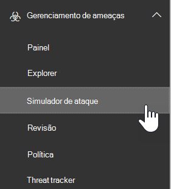

# Simulador de ataque no Office 365 ATP

Simulador de ataque no Office 365 o plano de proteção avançada contra ameaças (plano ATP 2) permite que você execute as campanhas realísticas, mas phishing e de ataques de senha simuladas em sua organização. Você pode usar os resultados de campanhas para identificar e treinar usuários vulneráveis.

## O que você precisa saber antes de começar?

- Para abrir o centro de conformidade & segurança do Office 365, <https://protection.office.com/>vá para. O simulador de ataque está disponível no **Threat Management** \> **Attack Simulator**.

  

- Para obter mais informações sobre a disponibilidade do simulador de ataque em assinaturas diferentes do Office 365, confira [Descrição do serviço de proteção avançada contra ameaças do office 365](https://docs.microsoft.com/office365/servicedescriptions/office-365-advanced-threat-protection-service-description).

- Você precisa ser membro dos grupos de função de **Gerenciamento da organização** ou de administrador de **segurança** . Para obter mais informações sobre grupos de função no centro de conformidade & segurança, consulte [permissões no centro de conformidade & segurança do Office 365](permissions-in-the-security-and-compliance-center.md).

- Sua conta precisa ser configurada para a MFA (autenticação multifator) para criar e gerenciar campanhas no simulador de ataques. Para obter instruções, consulte [Configurar a autenticação multifator](https://docs.microsoft.com/office365/admin/security-and-compliance/set-up-multi-factor-authentication).

- Você só pode executar campanhas de phishing ou de ataques de senha em usuários com caixas de correio no Exchange Online.

- Campanhas de phishing coletam e processam eventos por 30 dias. Dados de campanha históricos estarão disponíveis por até 90 dias após a execução da campanha.

- Não há cmdlets do PowerShell correspondentes para o simulador de ataques.

## Campanhas de spear phishing

*Phishing* é um termo genérico para ataques de email que tentam roubar informações confidenciais em mensagens que parecem ser de remetentes legítimos ou confiáveis. O *spear phishing* é um ataque de phishing direcionado que usa conteúdo muito focalizado e personalizado que é especificamente ajustado para os destinatários direcionados (normalmente, após o reconhecimento dos destinatários pelo invasor).

Para obter mais informações sobre phishing e spear phishing, consulte [phishing](https://docs.microsoft.com/windows/security/threat-protection/intelligence/phishing).

No simulador de ataques, dois tipos diferentes de campanhas de phishing de Spear estão disponíveis:

- **Spear phishing (coleta de credenciais)**: o ataque tenta convencer os destinatários a clicar em uma URL na mensagem. Se clicar no link, os usuários serão solicitados a inserir suas credenciais. Se o fizerem, eles serão levados a um dos seguintes locais:

  - Uma página padrão que explica isso era um teste apenas e fornece dicas para reconhecer mensagens de phishing.

    

  - Uma página personalizada (URL) que você especificar.

- **Spear phishing (anexo)**: o ataque tenta convencer os destinatários a abrir um anexo. docx ou. pdf na mensagem. O anexo contém o mesmo conteúdo do link phishing padrão, mas a primeira sentença começa com "\<nome\>de exibição, você está vendo esta mensagem como uma mensagem de email recente que você abriu...".

> [!NOTE]
> Atualmente, as campanhas de spear phishing no simulador de ataques não expiram.

### Criar uma campanha de spear phishing

Uma parte importante de qualquer campanha de spear phishing é a aparência da mensagem de email enviada aos destinatários de destino. Para criar e configurar a mensagem de email, você tem estas opções:

- **Use um modelo de email interno**: dois modelos internos estão disponíveis: **prêmios** e atualizações de folha de **pagamento**. Você pode personalizar ainda mais algumas, todas ou nenhuma das propriedades de email do modelo ao criar e iniciar a campanha.

- **Criar um modelo de email reutilizável**: depois de criar e salvar o modelo de email, você pode usá-lo novamente em futuras campanhas de spear phishing. Você pode personalizar ainda mais algumas, todas ou nenhuma das propriedades de email do modelo ao criar e iniciar a campanha.

- **Criar a mensagem de email no assistente**: você pode criar a mensagem de email diretamente no assistente ao criar e iniciar a campanha de spear phishing.

#### Etapa 1 (opcional): criar um modelo de email personalizado

Se você for usar um dos modelos internos ou criar a mensagem de email diretamente no assistente, poderá pular esta etapa.

1. No centro de conformidade & segurança, vá para **Threat management** \> **simulador de ataque**de gerenciamento de ameaças.

2. Na página **simular ataques** , nas seções **spear phishing (informações de coleta de credenciais)** ou **spear phishing (anexo)** , clique em **detalhes do ataque**.

   Não importa onde você crie o modelo. As opções disponíveis no modelo são as mesmas para os dois tipos de ataques de phishing.

3. Na página **detalhes do ataque** que é aberta, na **seção modelos de phishing** , na área **criar modelos** , clique em **novo modelo**.

4. O assistente para **Configurar modelo de phishing** é iniciado em um novo submenu. Na etapa **Iniciar** , digite um nome de exibição exclusivo para o modelo e clique em **Avançar**.

5. Na etapa **Configurar detalhes de email** , defina as seguintes configurações:

   - **De (nome)**: o nome de exibição que é usado para o remetente da mensagem.

   - **De (email)**: o endereço de email do remetente.

   - **URL do servidor de logon de phishing**: clique no menu suspenso e selecione uma das URLs disponíveis na lista. Esta é a URL para a qual os usuários terão tentado clicar. As opções são:

     - <http://portal.docdeliveryapp.com>
     - <http://portal.docdeliveryapp.net>
     - <http://portal.docstoreinternal.com>
     - <http://portal.docstoreinternal.net>
     - <http://portal.hardwarecheck.net>
     - <http://portal.hrsupportint.com>
     - <http://portal.payrolltooling.com>
     - <http://portal.payrolltooling.net>
     - <http://portal.prizegiveaway.net>
     - <http://portal.prizesforall.com>
     - <http://portal.salarytoolint.com>
     - <http://portal.salarytoolint.net>

     > [!NOTE]
     > <ul><li>Todas as URLs são intencionalmente http, não HTTPS.</li><li>Um serviço de reputação de URL pode identificar uma ou mais dessas URLs como não seguras. Verifique a disponibilidade da URL nos navegadores da Web com suporte antes de usar a URL em uma campanha de phishing.</li></ul>

   - **URL da página de aterrissagem personalizada**: Insira uma página de aterrissagem opcional, onde os usuários são conduzidos, caso eles cliquem no link phishing e insiram suas credenciais. Este link substitui a página de aterrissagem padrão. Por exemplo, se você tiver um treinamento de conscientização interna, poderá especificar essa URL aqui.

   - **Categoria**: no momento, essa configuração não é usada (tudo o que você inserir será ignorado).

   - **Assunto**: o campo **assunto** da mensagem de email.

   Quando terminar, clique em **Avançar**.

6. Na etapa de **redação de email** , crie o corpo da mensagem de email. Você pode usar a guia **email** (um editor de HTML avançado) ou a guia **fonte** (código HTML bruto).

   A formatação HTML pode ser simples ou complexa, pois você precisará dela. Você pode inserir imagens e texto para aprimorar o believability da mensagem no cliente de email do destinatário.

   - `${username}`Insere o nome do destinatário.

   - `${loginserverurl}`Insere o valor de **URL do servidor de logon de phishing** da etapa anterior.

   Quando terminar, clique em **Avançar**.

7. Na etapa **confirmar** , clique em **concluir**.

#### Etapa 2: criar e iniciar a campanha de spear phishing

1. No centro de conformidade & segurança, vá para **Threat management** \> **simulador de ataque**de gerenciamento de ameaças.

2. Na página **simular ataques** , faça uma das seguintes seleções com base no tipo de campanha que você deseja criar:

   - Na seção **spear phishing (coleta de credenciais)** , clique em **Iniciar ataque** ou clique em **detalhes** \> do ataque de **lançamento**.

   - Na seção **spear phishing (anexo)** , clique em **Iniciar ataque** ou clique em **detalhes** \> do ataque de **lançamento**.

3. O assistente para **configurar ataques de phishing** é iniciado em um novo submenu. Na etapa **Iniciar** , execute uma das seguintes etapas:

   - Na caixa **nome** , digite um nome de exibição exclusivo para a campanha. Não clique em **usar modelo**, porque você criará a mensagem de email mais tarde no assistente.

   - Clique em **usar modelo** e selecione um modelo de email interno ou personalizado. Depois de selecionar o modelo, a caixa **nome** é preenchida automaticamente com base no modelo, mas você pode alterar o nome.

   

   Quando terminar, clique em **Avançar**.

4. Na etapa **destinatários de destino** , execute uma das seguintes etapas:

   - Clique em **Catálogo de endereços** para selecionar os destinatários (usuários ou grupos) da campanha. Cada destinatário almejado deve ter uma caixa de correio do Exchange Online. Se você clicar em **Filtrar** e **aplicar** sem inserir um critério de pesquisa, todos os destinatários serão retornados e adicionados à campanha.

   - Clique em **importar** e em importar **arquivo** para importar um valor separado por vírgula (CSV) ou um arquivo separado por linha de endereços de email. Cada linha deve conter o endereço de email do destinatário.

   Quando terminar, clique em **Avançar**.

5. Na etapa **Configurar detalhes de email** , defina as seguintes configurações:

   Se você selecionou um modelo na etapa de **início** , a maioria desses valores já está configurada, mas você pode alterá-los.

   - **De (nome)**: o nome de exibição que é usado para o remetente da mensagem.

   - **De (email)**: o endereço de email do remetente. Você pode inserir um endereço de email verdadeiro ou falso no domínio de email da sua organização ou pode inserir um endereço de email externo real ou falso. Um endereço de email válido de um remetente da sua organização será realmente resolvido no cliente de email do destinatário.

   - **URL do servidor de logon de phishing**: clique no menu suspenso e selecione uma das URLs disponíveis na lista. Esta é a URL para a qual os usuários terão tentado clicar. As opções são:

     - <http://portal.docdeliveryapp.com>
     - <http://portal.docdeliveryapp.net>
     - <http://portal.docstoreinternal.com>
     - <http://portal.docstoreinternal.net>
     - <http://portal.hardwarecheck.net>
     - <http://portal.hrsupportint.com>
     - <http://portal.payrolltooling.com>
     - <http://portal.payrolltooling.net>
     - <http://portal.prizegiveaway.net>
     - <http://portal.prizesforall.com>
     - <http://portal.salarytoolint.com>
     - <http://portal.salarytoolint.net>

     > [!NOTE]
     > <ul><li>Todas as URLs são intencionalmente http, não HTTPS.</li><li>Um serviço de reputação de URL pode identificar uma ou mais dessas URLs como não seguras. Verifique a disponibilidade da URL nos navegadores da Web com suporte antes de usar a URL em uma campanha de phishing.</li><li>Você deve selecionar uma URL. Para campanhas de **spear phishing (Attachment)** , você pode remover o link do corpo da mensagem na próxima etapa (caso contrário, a mensagem conterá um link **e** um anexo).</li></ul>

   - **Tipo de anexo**: essa configuração só está disponível em campanhas de **spear phishing (Attachment)** . Clique na lista suspensa e selecione **. DOCX** ou **. PDF** na lista.

   - **Nome do anexo**: essa configuração só está disponível em campanhas de **spear phishing (Attachment)** . Insira um nome de arquivo para o anexo. docx ou. pdf.

   - **URL da página de aterrissagem personalizada**: Insira uma página de aterrissagem opcional, onde os usuários são conduzidos, caso eles cliquem no link phishing e insiram suas credenciais. Este link substitui a página de aterrissagem padrão. Por exemplo, se você tiver um treinamento de conscientização interna, poderá especificar essa URL aqui.

   - **Assunto**: o campo **assunto** da mensagem de email.

   Quando terminar, clique em **Avançar**.

6. Na etapa de **redação de email** , crie o corpo da mensagem de email. Se você selecionou um modelo na etapa **Iniciar** , o corpo da mensagem já está configurado, mas você pode personalizá-lo. Você pode usar a guia **email** (um editor de HTML avançado) ou a guia **fonte** (código HTML bruto).

   A formatação HTML pode ser simples ou complexa, pois você precisará dela. Você pode inserir imagens e texto para aprimorar o believability da mensagem no cliente de email do destinatário.

   - `${username}`Insere o nome do destinatário.

   - `${loginserverurl}`Insere o valor de **URL do servidor de logon de phishing** .

   Para campanhas de **spear phishing (Attachment)** , você deve remover o link do corpo da mensagem (caso contrário, a mensagem conterá um link **e** um anexo e os cliques de link não serão rastreados em uma campanha de anexo).

   

   Quando terminar, clique em **Avançar**.

7. Na etapa **confirmar** , clique em **concluir** para iniciar a campanha. A mensagem de phishing é entregue aos destinatários direcionados.

## Campanhas de ataque por senha

Um *ataque de senha* tenta adivinhar senhas para contas de usuário em uma organização, normalmente após o invasor ter identificado uma ou mais contas de usuário válidas.

No simulador de ataques, dois tipos diferentes de campanhas de ataque por senha estão disponíveis para você testar a complexidade das senhas de seus usuários:

- **Senha de força bruta (ataque de dicionário)**: um ataque de *força bruta** ou de *dicionário* usa um arquivo de dicionário grande de senhas em uma conta de usuário, com a esperança de que um deles funcionará (muitas senhas em uma conta). Bloqueios de senha incorretos ajudam a evitar ataques de senha forçada.

  Para o ataque de dicionário, você pode especificar uma ou várias senhas para tentar (inseridas manualmente ou em um arquivo carregado) e pode especificar um ou vários usuários.

- **Ataque de irrigação de senha**: um ataque de *irrigação de senha* usa a mesma senha cuidadosamente considerada em uma lista de contas de usuário (uma senha em muitas contas). Os ataques de irrigação de senha são mais difíceis de detectar que os ataques de senha de força bruta (a probabilidade de sucessos aumenta quando um invasor tenta uma senha em dezenas ou centenas de contas sem o risco de recorrer o bloqueio de senha incorreto do usuário).

  Para o ataque de irrigação de senha, você só pode especificar uma senha para tentar, e você pode especificar um ou vários usuários.

> [!NOTE]
> Os ataques de senha no simulador de ataque passam solicitações de autenticação básicas de nome de usuário e senha para um ponto de extremidade, de modo que também funcionem com outros métodos de autenticação (AD FS, sincronização de hash de senha, passagem, PingFederate, etc.). Para usuários que têm o MFA habilitado, mesmo que o ataque de senha Tente sua senha real, a tentativa sempre será registrada como uma falha (em outras palavras, os usuários da MFA nunca aparecerão na contagem de **tentativas bem-sucedidas** da campanha). Este é o resultado esperado. A MFA é um método principal para ajudar a proteger contra ataques de senha.

### Criar e iniciar uma campanha de ataque de senha

1. No centro de conformidade & segurança, vá para **Threat management** \> **simulador de ataque**de gerenciamento de ameaças.

2. Na página **simular ataques** , faça uma das seguintes seleções com base no tipo de campanha que você deseja criar:

   - Na seção **senha de força bruta (ataque de dicionário)** , clique em **Iniciar ataque** ou clique em **detalhes** \> do ataque de **lançamento**.

   - na seção **ataque de irrigação de senha** , clique em **Iniciar ataque** ou em **detalhes** \> de **lançamento**de ataques.

3. O assistente **Configurar ataque de senha** é iniciado em um novo submenu. Na etapa **Iniciar** , digite um nome de exibição exclusivo para a campanha e clique em **Avançar**.

4. Na etapa **usuários de destino** , execute uma das seguintes etapas:

   - Clique em **Catálogo de endereços** para selecionar os destinatários (usuários ou grupos) da campanha. Cada destinatário almejado deve ter uma caixa de correio do Exchange Online. Se você clicar em **Filtrar** e **aplicar** sem inserir um critério de pesquisa, todos os destinatários serão retornados e adicionados à campanha.

   - Clique em **importar** e em importar **arquivo** para importar um valor separado por vírgula (CSV) ou um arquivo separado por linha de endereços de email. Cada linha deve conter o endereço de email do destinatário.

   Quando terminar, clique em **Avançar**.

5. Na etapa **escolher as configurações de ataque** , escolha o que fazer com base no tipo de campanha:

   - **Senha de força bruta (ataque de dicionário)**: execute uma das seguintes etapas:

     - **Inserir senhas manualmente**: na caixa **pressione ENTER para adicionar uma senha** , digite uma senha e pressione Enter. Repita essa etapa quantas vezes forem necessárias.

     - **Carregar senhas de um arquivo de dicionário**: clique em **carregar** para importar um arquivo de texto existente que contenha uma senha em cada linha e uma última linha em branco. O arquivo de texto deve ter 10 MB ou menos de tamanho e não pode conter mais de 30000 senhas.

   - **Ataque de irrigação de senha**: na caixa de entrada **(s) senha a ser usada no ataque** , digite uma senha.

   Quando terminar, clique em **Avançar**.

6. Na etapa **confirmar** , clique em **concluir** para iniciar a campanha. As senhas que você especificou são tentadas nos usuários que você especificou.

## Exibir resultados da campanha

Depois de iniciar uma campanha, você pode verificar o progresso e os resultados na página principal de **ataques de simulações** .

As campanhas ativas mostrarão uma barra de status, um valor de porcentagem concluído e a contagem "(usuários concluídos) de (total de usuários)". Clicar no botão **Atualizar** atualizará o progresso de todas as campanhas ativas. Você também pode clicar em **encerrar** para interromper uma campanha ativa.

Quando a campanha é concluída, o status é alterado para **ataque concluído**. Você pode exibir os resultados da campanha executando uma das seguintes ações:

- Na página principais **ataques de simular** , clique em **Exibir relatório** sob o nome da campanha.

- Na página principal **simular ataques** , clique em **detalhes do ataque** na seção referente ao tipo de ataque. Na página **detalhes do ataque** que é aberta, selecione a campanha na seção **histórico de ataques** .

Qualquer uma das ações anteriores levará você para uma página chamada **detalhes do ataque**. As informações disponíveis nesta página para cada tipo de campanha são descritas nas seções a seguir.

### Resultados da campanha de spear phishing (coleta de credenciais)

As informações a seguir estão disponíveis na página de **detalhes do ataque** de cada campanha:

- A duração (data/hora de início e data/hora de término) da campanha.

- **Total de usuários direcionados**

- **Tentativas bem-sucedidas**: o número de usuários que clicaram no link **e** inseriram suas credenciais (*qualquer* nome de usuário e de senha).

- **Taxa de êxito geral**: uma porcentagem calculada por **tentativas** / bem-sucedidas**total dos usuários direcionados**.

- **Clique mais rápido**: quanto tempo levava o primeiro usuário a clicar no link depois que você iniciou a campanha.

- **Clique médio**: a soma de quanto tempo levava para todos clicar no link dividido pelo número de usuários que clicaram no link.

- **Clique em taxa de êxito**: uma porcentagem calculada por (número de usuários que clicaram no link)/ **total de usuários direcionados**.

- **Credenciais mais rápidas**: quanto tempo levava o primeiro usuário a inserir suas credenciais após o lançamento da campanha.

- **Média de credenciais**: a soma de quanto tempo levava para todos inserir suas credenciais divididas pelo número de usuários que inseriram suas credenciais.

- **Taxa de êxito da credencial**: uma porcentagem calculada por (número de usuários que inseriram suas credenciais)/ **total de usuários direcionados**.

- Um gráfico de barras que mostra o **link clicado** e os números **fornecidos por credencial** por dia.

- Um gráfico de círculo que mostra o **link clicado**, as **credenciais fornecidas**e **nenhuma** porcentagem para a campanha.

- A seção **usuários comprometidos** lista os detalhes dos usuários que clicaram no link:

  - O endereço de email do usuário

  - A data/hora em que o link foi clicado.

  - O endereço IP do cliente.

  - Detalhes sobre a versão do usuário do Windows e do navegador da Web.

  Você pode clicar em **Exportar** para exportar os resultados para um arquivo CSV.

### Resultados da campanha de spear phishing (Attachment)

As informações a seguir estão disponíveis na página de **detalhes do ataque** de cada campanha:

- A duração (data/hora de início e data/hora de término) da campanha.

- **Total de usuários direcionados**

- **Tentativas bem-sucedidas**: o número de usuários que abriram ou baixaram e abriram o anexo (a visualização não conta).

- **Taxa de êxito geral**: uma porcentagem calculada por **tentativas** / bem-sucedidas**total dos usuários direcionados**.

- **Tempo de abertura do anexo mais rápido**: quanto tempo levava o primeiro usuário a abrir o anexo depois que você iniciou a campanha.

- **Tempo médio de abertura do anexo**: a soma de quanto tempo levava todos para abrir o anexo dividido pelo número de usuários que abriram o anexo.

- **Taxa de êxito na abertura do anexo**: uma porcentagem calculada por (número de usuários que abriram o anexo)/ **total de usuários direcionados**.

### Senha de força bruta (ataque de dicionário) resultados da campanha

As informações a seguir estão disponíveis na página de **detalhes do ataque** de cada campanha:

- A duração (data/hora de início e data/hora de término) da campanha.

- **Total de usuários direcionados**

- **Tentativas bem-sucedidas**: o número de usuários que foram encontrados usando uma das senhas especificadas.

- **Taxa de êxito geral**: uma porcentagem calculada por **tentativas** / bem-sucedidas**total dos usuários direcionados**.

- A seção **usuários comprometidos** lista os endereços de email dos usuários afetados. Você pode clicar em **Exportar** para exportar os resultados para um arquivo CSV.

### Resultados da campanha de ataque de irrigação de senha

As informações a seguir estão disponíveis na página de **detalhes do ataque** de cada campanha:

- A duração (data/hora de início e data/hora de término) da campanha.

- **Total de usuários direcionados**

- **Tentativas bem-sucedidas**: o número de usuários que foram encontrados usando a senha especificada.

- **Taxa de êxito geral**: uma porcentagem calculada por **tentativas** / bem-sucedidas**total dos usuários direcionados**.
