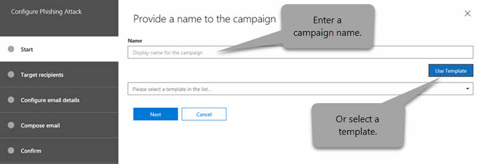

# Simulador de ataque em ATPAttack Simulator in ATP

**Resumo** Se você for um administrador global ou um administrador de segurança e sua organização tiver o Office 365 Advanced Threat Protection Plan 2, que inclui os [recursos de investigação e resposta contra ameaças](office-365-ti.md), você poderá usar o simulador de ataques para executar cenários de ataque realísticos em sua organização.**Summary** If you are a global administrator or a security administrator and your organization has Office 365 Advanced Threat Protection Plan 2, which includes [Threat Investigation and Response capabilities](office-365-ti.md), you can use Attack Simulator to run realistic attack scenarios in your organization. Isso pode ajudar você a identificar e a encontrar usuários vulneráveis, antes que um ataque real afete o resultado.This can help you identify and find vulnerable users before a real attack impacts your bottom line. Leia este artigo para saber mais.Read this article to learn more.

## O que você precisa saber antes de começar?What do you need to know before you begin?

- Para abrir o centro de conformidade & segurança, vá <https://protection.office.com/>para.To open the Security & Compliance Center, go to <https://protection.office.com/>. O simulador de ataque está disponível no **Threat Management** \> **Attack Simulator**.Attack simulator is available at **Threat management** \> **Attack simulator**.

  

- Para obter mais informações sobre a disponibilidade do simulador de ataque em assinaturas diferentes da Microsoft 365, confira [Descrição do serviço de proteção avançada contra ameaças do Office 365](https://docs.microsoft.com/office365/servicedescriptions/office-365-advanced-threat-protection-service-description).For more information about the availability of Attack Simulator across different Microsoft 365 subscriptions, see [Office 365 Advanced Threat Protection service description](https://docs.microsoft.com/office365/servicedescriptions/office-365-advanced-threat-protection-service-description).

- Você precisa ser membro dos grupos de função de **Gerenciamento da organização** ou de administrador de **segurança** .You need to be a member of the **Organization Management** or **Security Administrator** role groups. Para obter mais informações sobre grupos de função no centro de conformidade de & de segurança, consulte [permissões no centro de conformidade de & de segurança](permissions-in-the-security-and-compliance-center.md).For more information about role groups in the Security & Compliance Center, see [Permissions in the Security & Compliance Center](permissions-in-the-security-and-compliance-center.md).

- Sua conta precisa ser configurada para a MFA (autenticação multifator) para criar e gerenciar campanhas no simulador de ataques.Your account needs to be configured for multi-factor authentication (MFA) to create and manage campaigns in Attack Simulator. Para obter instruções, consulte [Configurar a autenticação multifator](https://docs.microsoft.com/office365/admin/security-and-compliance/set-up-multi-factor-authentication).For instructions, see [Set up multi-factor authentication](https://docs.microsoft.com/office365/admin/security-and-compliance/set-up-multi-factor-authentication).

Para que um ataque seja iniciado com êxito, certifique-se de que a conta que você está usando para executar ataques simulados esteja usando a autenticação multifator.For an attack to be successfully launched, make sure that the account you are using to run simulated attacks is using multi-factor authentication. Além disso, você deve ser um administrador global ou um administrador de segurança.In addition, you must be a global administrator or a security administrator. (Para saber mais sobre funções e permissões, consulte [permissões no centro de conformidade de & de segurança](permissions-in-the-security-and-compliance-center.md).)(To learn more about roles and permissions, see [Permissions in the Security & Compliance Center](permissions-in-the-security-and-compliance-center.md).)

- Campanhas de phishing coletam e processam eventos por 30 dias.Phishing campaigns will collect and process events for 30 days. Dados de campanha históricos estarão disponíveis por até 90 dias após a execução da campanha.Historical campaign data will be available for up to 90 days after you launch the campaign.

- Não há cmdlets do PowerShell correspondentes para o simulador de ataques.There are no corresponding PowerShell cmdlets for Attack Simulator.

## Campanhas de spear phishingSpear phishing campaigns

*Phishing* é um termo genérico para ataques de email que tentam roubar informações confidenciais em mensagens que parecem ser de remetentes legítimos ou confiáveis.*Phishing* is a generic term for email attacks that try to steal sensitive information in messages that appear to be from legitimate or trusted senders. O *spear phishing* é um ataque de phishing direcionado que usa conteúdo muito focalizado e personalizado que é especificamente ajustado para os destinatários direcionados (normalmente, após o reconhecimento dos destinatários pelo invasor).*Spear phishing* is a targeted phishing attack that uses very focused and customized content that's specifically tailored to the targeted recipients (typically, after reconnaissance on the recipients by the attacker).

- Você é um administrador global ou administrador de segurançaYou are a global administrator or security administrator

No simulador de ataques, dois tipos diferentes de campanhas de phishing de Spear estão disponíveis:In Attack Simulator, two different types of spear phishing campaigns are available:

- A [autenticação multifator/acesso condicional](https://docs.microsoft.com/office365/admin/security-and-compliance/set-up-multi-factor-authentication) está ativada, por pelo menos a conta de administrador global e os administradores de segurança que usarão o simulador de ataques.[Multi-factor authentication/Conditional Access](https://docs.microsoft.com/office365/admin/security-and-compliance/set-up-multi-factor-authentication) is turned on, for at least the global administrator account and security administrators who will be using Attack Simulator. (Idealmente, a autenticação multifator/acesso condicional está ativada para todos os usuários da sua organização.)(Ideally, multi-factor authentication/conditional access is turned on for all users in your organization.)

  - Uma página padrão que explica isso era um teste apenas e fornece dicas para reconhecer mensagens de phishing.A default page that explains this was a just a test, and gives tips for recognizing phishing messages.

    

  - Uma página personalizada (URL) que você especificar.A custom page (URL) that you specify.

- **Spear phishing (anexo)**: o ataque tenta convencer os destinatários a abrir um anexo. docx ou. pdf na mensagem.**Spear phishing (attachment)**: The attack tries to convince the recipients to open a .docx or .pdf attachment in the message. O anexo contém o mesmo conteúdo do link phishing padrão, mas a primeira sentença começa com "\<nome\>de exibição, você está vendo esta mensagem como uma mensagem de email recente que você abriu...".The attachment contains the same content from the default phishing link, but the first sentence starts with "\<Display Name\>, you are seeing this message as a recent email message you opened...".

> [!NOTE]
> Atualmente, as campanhas de spear phishing no simulador de ataques não expiram.Currently, spear phishing campaigns in Attack Simulator don't expire.

### Criar uma campanha de spear phishingCreate a spear phishing campaign

Uma parte importante de qualquer campanha de spear phishing é a aparência da mensagem de email enviada aos destinatários de destino.An important part of any spear phishing campaign is the look and feel of the email message that's sent to the targeted recipients. Para criar e configurar a mensagem de email, você tem estas opções:To create and configure the email message, you have these options:

- **Use um modelo de email interno**: dois modelos internos estão disponíveis: **prêmios** e atualizações de folha de **pagamento**.**Use a built-in email template**: Two built-in templates are available: **Prize Giveaway** and **Payroll Update**. Você pode personalizar ainda mais algumas, todas ou nenhuma das propriedades de email do modelo ao criar e iniciar a campanha.You can further customize some, all, or none of the email properties from the template when you create and launch the campaign.

- **Criar um modelo de email reutilizável**: depois de criar e salvar o modelo de email, você pode usá-lo novamente em futuras campanhas de spear phishing.**Create a reusable email template**: After you create and save the email template, you can use it again in future spear phishing campaigns. Você pode personalizar ainda mais algumas, todas ou nenhuma das propriedades de email do modelo ao criar e iniciar a campanha.You can further customize some, all, or none of the email properties from the template when you create and launch the campaign.

- **Criar a mensagem de email no assistente**: você pode criar a mensagem de email diretamente no assistente ao criar e iniciar a campanha de spear phishing.**Create the email message in the wizard**: You can create the email message directly in the wizard as you create and launch the spear phishing campaign.

#### Etapa 1 (opcional): criar um modelo de email personalizadoStep 1 (Optional): Create a custom email template

Se você for usar um dos modelos internos ou criar a mensagem de email diretamente no assistente, poderá pular esta etapa.If you're going to use one of the built-in templates or create the email message directly in the wizard, you can skip this step.

1. No centro de conformidade & segurança, vá para **Threat management** \> **simulador de ataque**de gerenciamento de ameaças.In the Security & Compliance Center, go to **Threat management** \> **Attack simulator**.

2. Na página **simular ataques** , nas seções **spear phishing (informações de coleta de credenciais)** ou **spear phishing (anexo)** , clique em **detalhes do ataque**.On the **Simulate attacks** page, in either the **Spear Phishing (Credentials Harvest)** or **Spear Phishing (Attachment)** sections, click **Attack Details**.

   Não importa onde você crie o modelo.It doesn't matter where you create the template. As opções disponíveis no modelo são as mesmas para os dois tipos de ataques de phishing.The available options in the template are the same for both types of phishing attacks.

3. Na página **detalhes do ataque** que é aberta, na **seção modelos de phishing** , na área **criar modelos** , clique em **novo modelo**.In the **Attack details** page that opens, in the **Phishing Templates** section, in the **Create Templates** area, click **New Template**.

4. O assistente para **Configurar modelo de phishing** é iniciado em um novo submenu.The **Configure Phishing Template** wizard starts in a new flyout. Na etapa **Iniciar** , digite um nome de exibição exclusivo para o modelo e clique em **Avançar**.In the **Start** step, enter a unique display name for the template, and then click **Next**.

5. Na etapa **Configurar detalhes de email** , defina as seguintes configurações:In the **Configure email details** step, configure the following settings:

   - **De (nome)**: o nome de exibição que é usado para o remetente da mensagem.**From (Name)**: The display name that's used for the message sender.

   - **De (email)**: o endereço de email do remetente.**From (Email)**: The sender's email address.

   - **URL do servidor de logon de phishing**: clique no menu suspenso e selecione uma das URLs disponíveis na lista.**Phishing Login Server URL**: Click the drop down and select one of the available URLs from the list. Esta é a URL para a qual os usuários terão tentado clicar.This is the URL that users will be tempted to click. As opções são:The choices are:

     - <http://portal.docdeliveryapp.com>
     - <http://portal.docdeliveryapp.net>
     - <http://portal.docstoreinternal.com>
     - <http://portal.docstoreinternal.net>
     - <http://portal.hardwarecheck.net>
     - <http://portal.hrsupportint.com>
     - <http://portal.payrolltooling.com>
     - <http://portal.payrolltooling.net>
     - <http://portal.prizegiveaway.net>
     - <http://portal.prizesforall.com>
     - <http://portal.salarytoolint.com>
     - <http://portal.salarytoolint.net>

     > [!NOTE]
     > <ul><li>Todas as URLs são intencionalmente http, não HTTPS.All of the URLs are intentionally http, not https.</li><li>Um serviço de reputação de URL pode identificar uma ou mais dessas URLs como não seguras.A URL reputation service might identify one or more of these URLs as unsafe. Verifique a disponibilidade da URL nos navegadores da Web com suporte antes de usar a URL em uma campanha de phishing.Check the availability of the URL in your supported web browsers before you use the URL in a phishing campaign.</li></ul>

   - **URL da página de aterrissagem personalizada**: Insira uma página de aterrissagem opcional, onde os usuários são conduzidos, caso eles cliquem no link phishing e insiram suas credenciais.**Custom Landing Page URL**: Enter an optional landing page where users are taken if they click the phishing link and enter their credentials. Este link substitui a página de aterrissagem padrão.This link replaces the default landing page. Por exemplo, se você tiver um treinamento de conscientização interna, poderá especificar essa URL aqui.For example, if you have internal awareness training, you can specify that URL here.

   - **Categoria**: no momento, essa configuração não é usada (tudo o que você inserir será ignorado).**Category**: Currently, this setting isn't used (anything you enter is ignored).

   - **Assunto**: o campo **assunto** da mensagem de email.**Subject**: The **Subject** field of the email message.

   Quando terminar, clique em **Avançar**.When you're finished, click **Next**.

6. Na etapa de **redação de email** , crie o corpo da mensagem de email.In the **Compose email** step, create the message body of the email message. Você pode usar a guia **email** (um editor de HTML avançado) ou a guia **fonte** (código HTML bruto).You can use the **Email** tab (a rich HTML editor) or the **Source** tab (raw HTML code).

   A formatação HTML pode ser simples ou complexa, pois você precisará dela.The HTML formatting can be as simple or complex as you need it to be. Você pode inserir imagens e texto para aprimorar o believability da mensagem no cliente de email do destinatário.You can insert images and text to enhance the believability of the message in the recipient's email client.

   - `${username}`Insere o nome do destinatário.`${username}` inserts the recipient's name.

   - `${loginserverurl}`Insere o valor de **URL do servidor de logon de phishing** da etapa anterior.`${loginserverurl}` inserts the **Phishing Login Server URL** value from the previous step.

   Quando terminar, clique em **Avançar**.When you're finished, click **Next**.

7. Na etapa **confirmar** , clique em **concluir**.In the **Confirm** step, click **Finish**.

#### Etapa 2: criar e iniciar a campanha de spear phishingStep 2: Create and launch the spear phishing campaign

1. No centro de conformidade & segurança, vá para **Threat management** \> **simulador de ataque**de gerenciamento de ameaças.In the Security & Compliance Center, go to **Threat management** \> **Attack simulator**.

2. Na página **simular ataques** , faça uma das seguintes seleções com base no tipo de campanha que você deseja criar:On the **Simulate attacks** page, make one of the following selections based on the type of campaign you want to create:

   - Na seção **spear phishing (coleta de credenciais)** , clique em **Iniciar ataque** ou clique em **detalhes** \> do ataque de **lançamento**.In the **Spear Phishing (Credentials Harvest)** section, click **Launch Attack** or click **Attack Details** \> **Launch Attack**.

   - Na seção **spear phishing (anexo)** , clique em **Iniciar ataque** ou clique em **detalhes** \> do ataque de **lançamento**.In the **Spear Phishing (Attachment)** section, click **Launch Attack** or click **Attack Details** \> **Launch Attack**.

3. O assistente para **configurar ataques de phishing** é iniciado em um novo submenu.The **Configure Phishing Attack** wizard starts in a new flyout. Na etapa **Iniciar** , execute uma das seguintes etapas:In the **Start** step, do one of the following steps:

   - Na caixa **nome** , digite um nome de exibição exclusivo para a campanha.In the **Name** box, enter a unique display name for the campaign. Não clique em **usar modelo**, porque você criará a mensagem de email mais tarde no assistente.Don't click **Use Template**, because you'll create the email message later in the wizard.

   - Clique em **usar modelo** e selecione um modelo de email interno ou personalizado.Click **Use Template** and select a built-in or custom email template. Depois de selecionar o modelo, a caixa **nome** é preenchida automaticamente com base no modelo, mas você pode alterar o nome.After you select the template, the **Name** box is automatically filled based on the template, but you can change the name.

   

   Quando terminar, clique em **Avançar**.When you're finished, click **Next**.

4. Na etapa **destinatários de destino** , execute uma das seguintes etapas:In the **Target recipients** step, do one of the following steps:

   - Clique em **Catálogo de endereços** para selecionar os destinatários (usuários ou grupos) da campanha.Click **Address Book** to select the recipients (users or groups) for the campaign. Cada destinatário almejado deve ter uma caixa de correio do Exchange Online.Each targeted recipient must have an Exchange Online mailbox. Se você clicar em **Filtrar** e **aplicar** sem inserir um critério de pesquisa, todos os destinatários serão retornados e adicionados à campanha.If you click **Filter** and **Apply** without entering a search criteria, all recipients are returned and added to the campaign.

   - Clique em **importar** e em importar **arquivo** para importar um valor separado por vírgula (CSV) ou um arquivo separado por linha de endereços de email.Click **Import** then **File Import** to import a comma-separated value (CSV) or line-separated file of email addresses. Cada linha deve conter o endereço de email do destinatário.Each line must contain the recipient's email address.

   Quando terminar, clique em **Avançar**.When you're finished, click **Next**.

5. Na etapa **Configurar detalhes de email** , defina as seguintes configurações:In the **Configure email details** step, configure the following settings:

   Se você selecionou um modelo na etapa de **início** , a maioria desses valores já está configurada, mas você pode alterá-los.If you selected a template in the **Start** step, most of these values are already configured, but you can change them.

   - **De (nome)**: o nome de exibição que é usado para o remetente da mensagem.**From (Name)**: The display name that's used for the message sender.

   - **De (email)**: o endereço de email do remetente.**From (Email)**: The sender's email address. Você pode inserir um endereço de email verdadeiro ou falso no domínio de email da sua organização ou pode inserir um endereço de email externo real ou falso.You can enter a real or fake email address from your organization's email domain, or you can enter a real or fake external email address. Um endereço de email válido de um remetente da sua organização será realmente resolvido no cliente de email do destinatário.A valid sender email address from your organization will actually resolve in the recipient's email client.

   - **URL do servidor de logon de phishing**: clique no menu suspenso e selecione uma das URLs disponíveis na lista.**Phishing Login Server URL**: Click the drop down and select one of the available URLs from the list. Esta é a URL para a qual os usuários terão tentado clicar.This is the URL that users will be tempted to click. As opções são:The choices are:

     - <http://portal.docdeliveryapp.com>
     - <http://portal.docdeliveryapp.net>
     - <http://portal.docstoreinternal.com>
     - <http://portal.docstoreinternal.net>
     - <http://portal.hardwarecheck.net>
     - <http://portal.hrsupportint.com>
     - <http://portal.payrolltooling.com>
     - <http://portal.payrolltooling.net>
     - <http://portal.prizegiveaway.net>
     - <http://portal.prizesforall.com>
     - <http://portal.salarytoolint.com>
     - <http://portal.salarytoolint.net>

     > [!NOTE]
     > <ul><li>Todas as URLs são intencionalmente http, não HTTPS.All of the URLs are intentionally http, not https.</li><li>Um serviço de reputação de URL pode identificar uma ou mais dessas URLs como não seguras.A URL reputation service might identify one or more of these URLs as unsafe. Verifique a disponibilidade da URL nos navegadores da Web com suporte antes de usar a URL em uma campanha de phishing.Check the availability of the URL in your supported web browsers before you use the URL in a phishing campaign.</li><li>Você deve selecionar uma URL.You are required to select a URL. Para campanhas de <b>spear phishing (Attachment)</b> , você pode remover o link do corpo da mensagem na próxima etapa (caso contrário, a mensagem conterá um link <b>e</b> um anexo).For <b>Spear Phishing (Attachment)</b> campaigns, you can remove the link from the body of the message in the next step (otherwise, the message will contain both a link <b>and</b> an attachment).</li></ul>

   - **Tipo de anexo**: essa configuração só está disponível em campanhas de **spear phishing (Attachment)** .**Attachment Type**: This setting is only available in **Spear Phishing (Attachment)** campaigns. Clique na lista suspensa e selecione **. DOCX** ou **. PDF** na lista.Click the drop down and select **.DOCX** or **.PDF** from the list.

   - **Nome do anexo**: essa configuração só está disponível em campanhas de **spear phishing (Attachment)** .**Attachment Name**: This setting is only available in **Spear Phishing (Attachment)** campaigns. Insira um nome de arquivo para o anexo. docx ou. pdf.Enter a filename for the .docx or .pdf attachment.

   - **URL da página de aterrissagem personalizada**: Insira uma página de aterrissagem opcional, onde os usuários são conduzidos, caso eles cliquem no link phishing e insiram suas credenciais.**Custom Landing Page URL**: Enter an optional landing page where users are taken if they click the phishing link and enter their credentials. Este link substitui a página de aterrissagem padrão.This link replaces the default landing page. Por exemplo, se você tiver um treinamento de conscientização interna, poderá especificar essa URL aqui.For example, if you have internal awareness training, you can specify that URL here.

   - **Assunto**: o campo **assunto** da mensagem de email.**Subject**: The **Subject** field of the email message.

   Quando terminar, clique em **Avançar**.When you're finished, click **Next**.

6. Na etapa de **redação de email** , crie o corpo da mensagem de email.In the **Compose email** step, create the message body of the email message. Se você selecionou um modelo na etapa **Iniciar** , o corpo da mensagem já está configurado, mas você pode personalizá-lo.If you selected a template in the **Start** step, the message body is already configured, but you can customize it. Você pode usar a guia **email** (um editor de HTML avançado) ou a guia **fonte** (código HTML bruto).You can use the **Email** tab (a rich HTML editor) or the **Source** tab (raw HTML code).

   A formatação HTML pode ser simples ou complexa, pois você precisará dela.The HTML formatting can be as simple or complex as you need it to be. Você pode inserir imagens e texto para aprimorar o believability da mensagem no cliente de email do destinatário.You can insert images and text to enhance the believability of the message in the recipient's email client.

   - `${username}`Insere o nome do destinatário.`${username}` inserts the recipient's name.

   - `${loginserverurl}`Insere o valor de **URL do servidor de logon de phishing** .`${loginserverurl}` inserts the **Phishing Login Server URL** value.

   Para campanhas de **spear phishing (Attachment)** , você deve remover o link do corpo da mensagem (caso contrário, a mensagem conterá um link **e** um anexo e os cliques de link não serão rastreados em uma campanha de anexo).For **Spear Phishing (Attachment)** campaigns, you should remove the link from the body of the message (otherwise, the message will contain both a link **and** an attachment, and link clicks aren't tracked in an attachment campaign).

   

   Quando terminar, clique em **Avançar**.When you're finished, click **Next**.

7. Na etapa **confirmar** , clique em **concluir** para iniciar a campanha.In the **Confirm** step, click **Finish** to launch the campaign. A mensagem de phishing é entregue aos destinatários direcionados.The phishing message is delivered to the targeted recipients.

## Campanhas de ataque por senhaPassword attack campaigns

Um *ataque de senha* tenta adivinhar senhas para contas de usuário em uma organização, normalmente após o invasor ter identificado uma ou mais contas de usuário válidas.A *password attack* tries to guess passwords for user accounts in an organization, typically after the attacker has identified one or more valid user accounts.

No simulador de ataques, dois tipos diferentes de campanhas de ataque por senha estão disponíveis para você testar a complexidade das senhas de seus usuários:In Attack Simulator, two different types of password attack campaigns are available for you to test the complexity of your users' passwords:

- **Senha de força bruta (ataque de dicionário)**: um ataque de *força bruta* ou de *dicionário* usa um arquivo de dicionário grande de senhas em uma conta de usuário, com a esperança de que um deles funcionará (muitas senhas em uma conta).**Brute force password (dictionary attack)**: A *brute force* or *dictionary* attack uses a large dictionary file of passwords on a user account with the hope that one of them will work (many passwords against one account). Bloqueios de senha incorretos ajudam a evitar ataques de senha forçada.Incorrect password lock-outs help deter brute force password attacks.

  Para o ataque de dicionário, você pode especificar uma ou várias senhas para tentar (inseridas manualmente ou em um arquivo carregado) e pode especificar um ou vários usuários.For the dictionary attack, you can specify one or many passwords to try (manually entered or in an uploaded file), and you can specify one or many users.

- **Ataque de irrigação de senha**: um ataque de *irrigação de senha* usa a mesma senha cuidadosamente considerada em uma lista de contas de usuário (uma senha em muitas contas).**Password spray attack**: A *password spray* attack uses the same carefully considered password against a list of user accounts (one password against many accounts). Os ataques de irrigação de senha são mais difíceis de detectar que os ataques de senha de força bruta (a probabilidade de sucessos aumenta quando um invasor tenta uma senha em dezenas ou centenas de contas sem o risco de recorrer o bloqueio de senha incorreto do usuário).Password spray attacks are harder to detect than brute force password attacks (the probability of success increases when an attacker tries one password across dozens or hundreds of accounts without the risk of tripping the user's incorrect password lock-out).

  Para o ataque de irrigação de senha, você só pode especificar uma senha para tentar, e você pode especificar um ou vários usuários.For the password spray attack, you can only specify one password to try, and you can specify one or many users.

> [!NOTE]
> Os ataques de senha no simulador de ataque passam solicitações de autenticação básicas de nome de usuário e senha para um ponto de extremidade, de modo que também funcionem com outros métodos de autenticação (AD FS, sincronização de hash de senha, passagem, PingFederate, etc.).The password attacks in Attack Simulator pass username and password Basic auth requests to an endpoint, so they also work with other authentication methods (AD FS, password hash sync, pass-through, PingFederate, etc.). Para usuários que têm o MFA habilitado, mesmo que o ataque de senha Tente sua senha real, a tentativa sempre será registrada como uma falha (em outras palavras, os usuários da MFA nunca aparecerão na contagem de **tentativas bem-sucedidas** da campanha).For users that have MFA enabled, even if the password attack tries their actual password, the attempt will always register as a failure (in other words, MFA users will never appear in the **Successful attempts** count of the campaign). Este é o resultado esperado.This is the expected result. A MFA é um método principal para ajudar a proteger contra ataques de senha.MFA is a primary method to help protect against password attacks.

### Criar e iniciar uma campanha de ataque de senhaCreate and launch a password attack campaign

1. No centro de conformidade & segurança, vá para **Threat management** \> **simulador de ataque**de gerenciamento de ameaças.In the Security & Compliance Center, go to **Threat management** \> **Attack simulator**.

2. Na página **simular ataques** , faça uma das seguintes seleções com base no tipo de campanha que você deseja criar:On the **Simulate attacks** page, make one of the following selections based on the type of campaign you want to create:

   - Na seção **senha de força bruta (ataque de dicionário)** , clique em **Iniciar ataque** ou clique em **detalhes** \> do ataque de **lançamento**.In the **Brute Force Password (Dictionary Attack)** section, click **Launch Attack** or click **Attack Details** \> **Launch Attack**.

   - na seção **ataque de irrigação de senha** , clique em **Iniciar ataque** ou em **detalhes** \> de **lançamento**de ataques.in the **Password spray attack** section, click **Launch Attack** or click **Attack Details** \> **Launch Attack**.

3. O assistente **Configurar ataque de senha** é iniciado em um novo submenu.The **Configure Password Attack** wizard starts in a new flyout. Na etapa **Iniciar** , digite um nome de exibição exclusivo para a campanha e clique em **Avançar**.In the **Start** step, enter a unique display name for the campaign, and then click **Next**.

4. Na etapa **usuários de destino** , execute uma das seguintes etapas:In the **Target users** step, do one of the following steps:

   - Clique em **Catálogo de endereços** para selecionar os destinatários (usuários ou grupos) da campanha.Click **Address Book** to select the recipients (users or groups) for the campaign. Cada destinatário almejado deve ter uma caixa de correio do Exchange Online.Each targeted recipient must have an Exchange Online mailbox. Se você clicar em **Filtrar** e **aplicar** sem inserir um critério de pesquisa, todos os destinatários serão retornados e adicionados à campanha.If you click **Filter** and **Apply** without entering a search criteria, all recipients are returned and added to the campaign.

   - Clique em **importar** e em importar **arquivo** para importar um valor separado por vírgula (CSV) ou um arquivo separado por linha de endereços de email.Click **Import** then **File Import** to import a comma-separated value (CSV) or line-separated file of email addresses. Cada linha deve conter o endereço de email do destinatário.Each line must contain the recipient's email address.

   Quando terminar, clique em **Avançar**.When you're finished, click **Next**.

5. Na etapa **escolher as configurações de ataque** , escolha o que fazer com base no tipo de campanha:In the **Choose attack settings** step, choose what to do based on the campaign type:

   - **Senha de força bruta (ataque de dicionário)**: execute uma das seguintes etapas:**Brute Force Password (Dictionary Attack)**: Do either of the following steps:

     - **Inserir senhas manualmente**: na caixa **pressione ENTER para adicionar uma senha** , digite uma senha e pressione Enter.**Enter passwords manually**: In the **Press enter to add a password** box, type a password and then press ENTER. Repita essa etapa quantas vezes forem necessárias.Repeat this step as many times as necessary.

     - **Carregar senhas de um arquivo de dicionário**: clique em **carregar** para importar um arquivo de texto existente que contenha uma senha em cada linha e uma última linha em branco.**Upload passwords from a dictionary file**: Click **Upload** to import an existing text file that contains one password on each line and a blank last line. O arquivo de texto deve ter 10 MB ou menos de tamanho e não pode conter mais de 30000 senhas.The text file must be 10 MB or less in size, and can't contain more than 30000 passwords.

   - **Ataque de irrigação de senha**: na caixa de entrada **(s) senha a ser usada no ataque** , digite uma senha.**Password spray attack**: In **The password(s) to use in the attack** box, enter one password.

   Quando terminar, clique em **Avançar**.When you're finished, click **Next**.

6. Na etapa **confirmar** , clique em **concluir** para iniciar a campanha.In the **Confirm** step, click **Finish** to launch the campaign. As senhas que você especificou são tentadas nos usuários que você especificou.The passwords you specified are tried on users you specified.

## Exibir resultados da campanhaView campaign results

Depois de iniciar uma campanha, você pode verificar o progresso e os resultados na página principal de **ataques de simulações** .After you launch a campaign, you can check the progress and results on the main **Simulate attacks** page.

As campanhas ativas mostrarão uma barra de status, um valor de porcentagem concluído e a contagem "(usuários concluídos) de (total de usuários)".Active campaigns will show a status bar, a completed percentage value and "(completed users) of (total users)" count. Clicar no botão **Atualizar** atualizará o progresso de todas as campanhas ativas.Clicking the **Refresh** button will update the progress of any active campaigns. Você também pode clicar em **encerrar** para interromper uma campanha ativa.You can also click **Terminate** to stop an active campaign.

Quando a campanha é concluída, o status é alterado para **ataque concluído**.When the campaign is finished, the status changes to **Attack completed**. Você pode exibir os resultados da campanha executando uma das seguintes ações:You can view the results of the campaign by doing either of the following actions:

- Na página principais **ataques de simular** , clique em **Exibir relatório** sob o nome da campanha.On the main **Simulate attacks** page, click **View Report** under the name of the campaign.

- Na página principal **simular ataques** , clique em **detalhes do ataque** na seção referente ao tipo de ataque.On the main **Simulate attacks** page, click **Attack Details** in the section for the type of attack. Na página **detalhes do ataque** que é aberta, selecione a campanha na seção **histórico de ataques** .On the **Attack details** page that opens, select the campaign in the **Attack History** section.

Qualquer uma das ações anteriores levará você para uma página chamada **detalhes do ataque**.Either of the previous actions will take you to a page named **Attack details**. As informações disponíveis nesta página para cada tipo de campanha são descritas nas seções a seguir.The information that's available on this page for each type of campaign is described in the following sections.

### Resultados da campanha de spear phishing (coleta de credenciais)Spear Phishing (Credentials Harvest) campaign results

As informações a seguir estão disponíveis na página de **detalhes do ataque** de cada campanha:The following information is available on the **Attack details** page for each campaign:

- A duração (data/hora de início e data/hora de término) da campanha.The duration (start date/time and end date/time) of the campaign.

- **Total de usuários direcionados****Total users targeted**

- **Tentativas bem-sucedidas**: o número de usuários que clicaram no link **e** inseriram suas credenciais (*qualquer* nome de usuário e de senha).**Successful attempts**: The number of users who clicked the link **and** entered their credentials (*any* username and password value).

- **Taxa de êxito geral**: uma porcentagem calculada por **tentativas** / bem-sucedidas**total dos usuários direcionados**.**Overall Success Rate**: A percentage that's calculated by **Successful attempts** / **Total users targeted**.

- **Clique mais rápido**: quanto tempo levava o primeiro usuário a clicar no link depois que você iniciou a campanha.**Fastest Click**: How long it took the first user to click the link after you launched the campaign.

- **Clique médio**: a soma de quanto tempo levava para todos clicar no link dividido pelo número de usuários que clicaram no link.**Average Click**: The sum of how long it took everyone to click the link divided by the number of users who clicked the link.

- **Clique em taxa de êxito**: uma porcentagem calculada por (número de usuários que clicaram no link)/ **total de usuários direcionados**.**Click Success Rate**: A percentage that's calculated by (number of users who clicked the link) / **Total users targeted**.

- **Credenciais mais rápidas**: quanto tempo levava o primeiro usuário a inserir suas credenciais após o lançamento da campanha.**Fastest Credentials**: How long it took the first user to enter their credentials after you launched the campaign.

- **Média de credenciais**: a soma de quanto tempo levava para todos inserir suas credenciais divididas pelo número de usuários que inseriram suas credenciais.**Average Credentials**: The sum of how long it took everyone to enter their credentials divided by the number of users who entered their credentials.

- **Taxa de êxito da credencial**: uma porcentagem calculada por (número de usuários que inseriram suas credenciais)/ **total de usuários direcionados**.**Credential Success Rate**: A percentage that's calculated by (number of users who entered their credentials) / **Total users targeted**.

- Um gráfico de barras que mostra o **link clicado** e os números **fornecidos por credencial** por dia.A bar graph that shows the **Link clicked** and **Credential supplied** numbers per day.

- Um gráfico de círculo que mostra o **link clicado**, as **credenciais fornecidas**e **nenhuma** porcentagem para a campanha.A circle graph that shows the **Link clicked**, **Credential supplied**, and **None** percentages for the campaign.

- A seção **usuários comprometidos** lista os detalhes dos usuários que clicaram no link:The **Compromised Users** section lists the details of the users who clicked the link:

  - O endereço de email do usuárioThe user's email address

  - A data/hora em que o link foi clicado.The date/time when they clicked the link.

  - O endereço IP do cliente.The client IP address.

  - Detalhes sobre a versão do usuário do Windows e do navegador da Web.Details about the user's version of Windows and web browser.

  Você pode clicar em **Exportar** para exportar os resultados para um arquivo CSV.You can click **Export** to export the results to a CSV file.

### Resultados da campanha de spear phishing (Attachment)Spear Phishing (Attachment) campaign results

As informações a seguir estão disponíveis na página de **detalhes do ataque** de cada campanha:The following information is available on the **Attack details** page for each campaign:

- A duração (data/hora de início e data/hora de término) da campanha.The duration (start date/time and end date/time) of the campaign.

- **Total de usuários direcionados****Total users targeted**

- **Tentativas bem-sucedidas**: o número de usuários que abriram ou baixaram e abriram o anexo (a visualização não conta).**Successful attempts**: The number of users who opened or downloaded and opened the attachment (preview doesn't count).

- **Taxa de êxito geral**: uma porcentagem calculada por **tentativas** / bem-sucedidas**total dos usuários direcionados**.**Overall Success Rate**: A percentage that's calculated by **Successful attempts** / **Total users targeted**.

- **Tempo de abertura do anexo mais rápido**: quanto tempo levava o primeiro usuário a abrir o anexo depois que você iniciou a campanha.**Fastest attachment open time**: How long it took the first user to open the attachment after you launched the campaign.

- **Tempo médio de abertura do anexo**: a soma de quanto tempo levava todos para abrir o anexo dividido pelo número de usuários que abriram o anexo.**Average attachment open time**: The sum of how long it took everyone to open the attachment divided by the number of users who opened the attachment.

- **Taxa de êxito na abertura do anexo**: uma porcentagem calculada por (número de usuários que abriram o anexo)/ **total de usuários direcionados**.**Attachment open success rate**: A percentage that's calculated by (number of users who opened the attachment) / **Total users targeted**.

### Senha de força bruta (ataque de dicionário) resultados da campanhaBrute Force Password (Dictionary Attack) campaign results

As informações a seguir estão disponíveis na página de **detalhes do ataque** de cada campanha:The following information is available on the **Attack details** page for each campaign:

- A duração (data/hora de início e data/hora de término) da campanha.The duration (start date/time and end date/time) of the campaign.

- **Total de usuários direcionados****Total users targeted**

- **Tentativas bem-sucedidas**: o número de usuários que foram encontrados usando uma das senhas especificadas.**Successful attempts**: The number of users who were found to be using one of the specified passwords.

- **Taxa de êxito geral**: uma porcentagem calculada por **tentativas** / bem-sucedidas**total dos usuários direcionados**.**Overall Success Rate**: A percentage that's calculated by **Successful attempts** / **Total users targeted**.

- A seção **usuários comprometidos** lista os endereços de email dos usuários afetados.The **Compromised Users** section lists the email addresses of the affected users. Você pode clicar em **Exportar** para exportar os resultados para um arquivo CSV.You can click **Export** to export the results to a CSV file.

### Resultados da campanha de ataque de irrigação de senhaPassword spray attack campaign results

As informações a seguir estão disponíveis na página de **detalhes do ataque** de cada campanha:The following information is available on the **Attack details** page for each campaign:

- A duração (data/hora de início e data/hora de término) da campanha.The duration (start date/time and end date/time) of the campaign.

- **Total de usuários direcionados****Total users targeted**

- **Tentativas bem-sucedidas**: o número de usuários que foram encontrados usando a senha especificada.**Successful attempts**: The number of users who were found to be using the specified password.

- **Taxa de êxito geral**: uma porcentagem calculada por **tentativas** / bem-sucedidas**total dos usuários direcionados**.**Overall Success Rate**: A percentage that's calculated by **Successful attempts** / **Total users targeted**.
