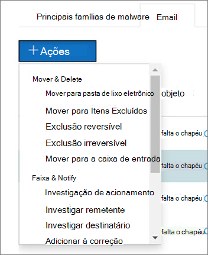

# Uma visão geral da investigação e resposta automatizadas (AIR) no Microsoft defender para Office 365An overview of automated investigation and response (AIR) in Microsoft Defender for Office 365

[!INCLUDE [Microsoft 365 Defender rebranding](../includes/microsoft-defender-for-office.md)]

Como os alertas de segurança são disparados, a equipe de operações de segurança pode examinar os alertas e realizar etapas para proteger sua organização.As security alerts are triggered, it's up to your security operations team to look into those alerts and take steps to protect your organization. Às vezes, as equipes de operações de segurança podem se sentir sobrecarregadas pelo volume de alertas disparados.Sometimes, security operations teams can feel overwhelmed by the volume of alerts that are triggered. Os recursos de investigação e resposta automatizada (AIR) no Microsoft defender para Office 365 podem ajudar.Automated investigation and response (AIR) capabilities in Microsoft Defender for Office 365 can help. 

O AIR permite que sua equipe de operações de segurança opere de forma mais eficiente e eficaz.AIR enables your security operations team to operate more efficiently and effectively. Os recursos de ar incluem processos de investigação automatizados em resposta a ameaças já conhecidas que existem atualmente.AIR capabilities include automated investigation processes in response to well-known threats that exist today. Ações de correção apropriadas aguardam aprovação, permitindo que sua equipe de operações de segurança responda a ameaças detectadas.Appropriate remediation actions await approval, enabling your security operations team to respond to detected threats. 

Este artigo fornece uma visão geral do AIR.This article provides an overview of AIR. Quando estiver pronto para começar a usar o AIR, confira [investigar automaticamente e responder a ameaças](office-365-air.md).When you're ready to get started using AIR, see [Automatically investigate and respond to threats](office-365-air.md).

## Em um nível altoAt a high level

À medida que os alertas são disparados, os guias de segurança entram em vigor.As alerts are triggered, security playbooks go into effect. Dependendo da situação, um processo de [investigação automatizado](https://docs.microsoft.com/microsoft-365/security/office-365-security/office-365-air) pode começar.Depending on the situation, an [automated investigation process](https://docs.microsoft.com/microsoft-365/security/office-365-security/office-365-air) can begin. Durante e após uma investigação automatizada, [ações de correção](air-remediation-actions.md) são recomendadas.During and after an automated investigation, [remediation actions](air-remediation-actions.md) are recommended. Nenhuma ação é executada automaticamente no Microsoft defender para Office 365.No actions are taken automatically in Microsoft Defender for Office 365. Sua equipe de operações de segurança é revisada e, em seguida, [aprova ou rejeita cada ação de correção](air-review-approve-pending-completed-actions.md).Your security operations team reviews, and then [approves or rejects each remediation action](air-review-approve-pending-completed-actions.md). Quando todas as ações após uma investigação são aprovadas ou rejeitadas, a investigação é concluída.When all of the actions following an investigation are approved or rejected, the investigation completes. Todas essas atividades são rastreadas e exibidas no centro de segurança do Microsoft 365 ( [https://security.microsoft.com](https://security.microsoft.com) ).All of these activities are tracked and viewable in the Microsoft 365 security center ([https://security.microsoft.com](https://security.microsoft.com)). (Para saber mais, confira [Exibir detalhes de uma investigação](air-view-investigation-results.md#view-details-of-an-investigation)).(To learn more, see [View details of an investigation](air-view-investigation-results.md#view-details-of-an-investigation)).

As seções a seguir fornecem mais detalhes sobre alertas, guias de segurança e exemplos de ar em ação.The following sections provide more details about alerts, security playbooks, and examples of AIR in action.

## AlertasAlerts

Os [alertas](../../compliance/alert-policies.md#viewing-alerts) representam disparadores de fluxos de trabalho da equipe de operações de segurança para resposta a incidentes.[Alerts](../../compliance/alert-policies.md#viewing-alerts) represent triggers for security operations team workflows for incident response. Priorizar o conjunto certo de alertas para investigação e, ao mesmo tempo, garantir que nenhuma ameaça seja difícil.Prioritizing the right set of alerts for investigation, while making sure no threats are unaddressed is challenging. Quando as investigações nos alertas são realizadas manualmente, as equipes de operações de segurança devem procurar e correlacionar entidades (como conteúdo, dispositivos e usuários) em risco de ameaças.When investigations into alerts are performed manually, security operations teams must hunt and correlate entities (such as content, devices and users) at risk from threats. Essas tarefas e fluxos de trabalho podem ser muito demorados e envolver várias ferramentas e sistemas.Such tasks and workflows can be very time consuming and involve multiple tools and systems. Com o AIR, a investigação e a resposta de eventos de segurança são automatizados com a chave de segurança e alertas de gerenciamento de ameaças que acionam guias de resposta de segurança automaticamente.With AIR, investigation and response for security events are automated by having key security and threat management alerts trigger security response playbooks automatically. 

Atualmente para o AIR, os alertas gerados a partir dos seguintes tipos de políticas de alerta são investigados automaticamente:Currently for AIR, alerts generated from the following kinds of alert policies are auto-investigated:  

- Um clique em URL potencialmente mal-intencionado foi detectadoA potentially malicious URL click was detected
- Email relatado pelo usuário como phishing`*`Email reported by user as phish`*`
- Mensagens de email contendo malware removidos após a entrega`*`Email messages containing malware removed after delivery`*`
- Mensagens de email que contêm URLs de phishing removidos após a entrega`*`Email messages containing phish URLs removed after delivery`*`
- Padrões de envio de emails suspeitos detectadosSuspicious email sending patterns detected
- Usuário impedido de enviar emailUser restricted from sending email
- Investigação manual de email disparada pelo administrador`*`Admin triggered manual investigation of email`*`

> [!NOTE]
> Os alertas marcados com um asterisco ( `*` ) recebem uma severidade *informativa* nas respectivas políticas de alerta no centro de segurança do Microsoft 365, com as notificações por email desativadas.The alerts marked with an asterisk (`*`) are assigned an *Informational* severity in the respective alert policies within the Microsoft 365 security center, with email notifications turned off. As notificações por email podem ser ativadas por meio da [configuração da política de alerta](../../compliance/alert-policies.md#alert-policy-settings).Email notifications can be turned on through [Alert policy configuration](../../compliance/alert-policies.md#alert-policy-settings). 

Para exibir alertas, no centro de conformidade & segurança, escolha **alertas**  >  **exibir alertas**.To view alerts, in the Security & Compliance Center, choose **Alerts** > **View alerts**. Selecione um alerta para exibir seus detalhes e, em seguida, use o link **Exibir investigação** para ir para a [investigação](air-view-investigation-results.md#investigation-graph)correspondente.Select an alert to view its details, and from there, use the **View investigation** link to go to the corresponding [investigation](air-view-investigation-results.md#investigation-graph).  

> [!NOTE]
> Os alertas informativos ficam ocultos no modo de exibição de alerta por padrão.Informational alerts are hidden in the alert view by default. Para vê-los, altere a filtragem de alerta para incluir alertas informativos.To see them, change the alert filtering to include informational alerts.

Se sua organização gerencia seus alertas de segurança por meio de um sistema de gerenciamento de alerta, sistema de gerenciamento de serviços ou informações de segurança e sistema de gerenciamento de eventos (SIEM), você pode enviar alertas para esse sistema por meio de uma notificação por email ou por meio da [API de atividade de gerenciamento do Office 365](https://docs.microsoft.com/office/office-365-management-api/office-365-management-activity-api-reference).If your organization manages your security alerts through an alert management system, service management system, or Security Information and Event Management (SIEM) system, you can send alerts to that system via either email notification or via the [Office 365 Management Activity API](https://docs.microsoft.com/office/office-365-management-api/office-365-management-activity-api-reference). As notificações de alerta de investigação via email ou API incluem links para acessar os alertas no centro de segurança do Microsoft 365, permitindo que o administrador de segurança atribuído Navegue rapidamente para a investigação.The investigation alert notifications via email or API include links to access the alerts in the Microsoft 365 security center, enabling the assigned security administrator to navigate quickly to the investigation.

 

## Guias de segurançaSecurity playbooks

Os guias de segurança são políticas de back-end que estão no coração de automação no Microsoft defender para Office 365 e Microsoft 365 defender.Security playbooks are back-end policies that are at the heart of automation in Microsoft Defender for Office 365 and Microsoft 365 Defender. Os guias estratégicos de segurança fornecidos no AIR são baseados em cenários comuns de segurança do mundo real e desenvolvidos com base nos comentários das equipes de operações de segurança.The security playbooks provided in AIR are based on common real-world security scenarios and developed based on feedback from security operations teams. Um guia de segurança é iniciado automaticamente quando alertas específicos são disparados em sua organização.A security playbook is launched automatically when specific alerts are triggered within your organization. Depois que o alerta é acionado, o manual associado é executado pelo sistema de investigação e resposta automatizada.Once the alert triggers, the associated playbook is run by the automated investigation and response system. As etapas de investigação por meio da análise do alerta com base no manual de alerta específico, em todos os metadados associados (incluindo mensagens de email, usuários, assuntos, remetentes, etc.).The investigation steps through analysis of the alert based on that particular alert's playbook, looking at all the associated metadata (including email messages, users, subjects, senders, etc.). Com base nas conclusões do guia estratégico, o AIR recomenda um conjunto de ações que a equipe de segurança de sua organização pode executar para controlar e reduzir a ameaça.Based on the investigation playbook's findings, AIR recommends a set of actions that your organization's security team can take to control and mitigate the threat. 

Os guias de segurança que você receberá com o AIR são projetados para lidar com as ameaças mais frequentes que as organizações encontram atualmente com o email.The security playbooks you'll get with AIR are designed to tackle the most frequent threats that organizations encounter today with email. Eles são baseados na entrada de operações de segurança e em equipes de resposta a incidentes, incluindo pessoas que ajudam a defender o Microsoft e os ativos de nossos clientes.They're based on input from security operations and incident response teams, including people who help defend Microsoft and our customers' assets.

- Mensagem de phishing relatada pelo usuárioUser-reported phish message
- URL-clique em veredicto alterarURL-click verdict change
- Malware detectado após a entrega (malware ZAP)Malware detected post-delivery (Malware ZAP)
- O phishing detectou o post-Delivery ZAP (Phish ZAP)Phish detected post-delivery ZAP (Phish ZAP)
- Usuário relatado como comprometidoUser reported as compromised 
- Investigação de e-mail manual (disparada pelo administrador de malware, Phish ou todos os modos de exibição de email)Manual email investigation (triggered by administrator from Explorer Malware, Phish, or All Email view)

Mais guias estratégicos e atualizações do guia estratégico serão lançadas à medida que forem concluídas.More playbooks and playbook updates will be released as they are completed. Visite o [mapa do Microsoft 365](https://www.microsoft.com/microsoft-365/roadmap) para ver o que mais está planejado e disponível em breve.Visit the [Microsoft 365 Roadmap](https://www.microsoft.com/microsoft-365/roadmap) to see what else is planned and coming soon.

### Os guias estratégicos incluem investigação e recomendaçõesPlaybooks include investigation and recommendations

No AIR, cada guia estratégico de segurança inclui:In AIR, each security playbook includes: 

- uma investigação raiz de entidades de email (como arquivos, URLs, destinatários, endereços IP e muito mais)a root investigation of an email's entities (such as files, URLs, recipients, IP addresses, and more),
- busca detalhada de emails semelhantes recebidos pela organizaçãofurther hunting for similar emails received by the organization 
- etapas seguidas para identificar e correlacionar outras ameaças potenciais esteps taken to identify and correlate other potential threats, and 
- ações de correção de ameaças recomendadas.recommended threat remediation actions.

Cada etapa de alto nível inclui várias subetapas executadas para fornecer uma resposta detalhada, detalhada e exaustiva às ameaças.Each high-level step includes a number of substeps that are executed to provide a deep, detailed, and exhaustive response to threats.

## Exemplo: uma mensagem de phishing relatada pelo usuário inicia um guia estratégico de investigaçãoExample: A user-reported phish message launches an investigation playbook

Suponha que um usuário em sua organização receba um email que eles pensam ser uma tentativa de phishing.Suppose that a user in your organization receives an email that they think is a phishing attempt. O usuário, treinado para relatar essas mensagens, usa o [suplemento de mensagem de relatório](enable-the-report-message-add-in.md) para enviá-la à Microsoft para análise.The user, trained to report such messages, uses the [Report Message add-in](enable-the-report-message-add-in.md) to send it to Microsoft for analysis. O envio também é enviado ao seu sistema e fica visível no Explorer, no modo de exibição de **envios** (conhecido anteriormente como modo de exibição **relatado pelo usuário** ).The submission is also sent to your system and is visible in Explorer in the **Submissions** view (formerly referred to as the **User-reported** view). Além disso, a mensagem relatada pelo usuário agora dispara um alerta informativo baseado no sistema, que inicia automaticamente o manual de investigação.In addition, the user-reported message now triggers a system-based informational alert, which automatically launches the investigation playbook.

Durante a fase de investigação de raiz, vários aspectos do email são avaliados.During the root investigation phase, various aspects of the email are assessed. Esses aspectos incluem:These aspects include:

- Uma determinação sobre o tipo de ameaça que ela pode ser;A determination about what type of threat it might be;
- Quem o enviou;Who sent it;
- De onde o email foi enviado (infraestrutura de envio);Where the email was sent from (sending infrastructure);
- Se outras instâncias do email foram entregues ou bloqueadas;Whether other instances of the email were delivered or blocked;
- Uma avaliação de nossos analistas;An assessment from our analysts;
- Se o email está associado a qualquer campanha conhecida;Whether the email is associated with any known campaigns;
- e muito mais.and more.

Depois que a investigação raiz estiver concluída, o guia estratégico fornecerá uma lista de ações recomendadas a serem executadas no email original e entidades associadas a ela.After the root investigation is complete, the playbook provides a list of recommended actions to take on the original email and entities associated with it.
  
Em seguida, várias etapas de investigação e busca de ameaças são executadas:Next, several threat investigation and hunting steps are executed:

- Mensagens de email semelhantes são identificadas por pesquisas de clusters de email.Similar email messages are identified via email cluster searches.
- O sinal é compartilhado com outras plataformas, como [o Microsoft defender para ponto de extremidade](https://docs.microsoft.com/windows/security/threat-protection/microsoft-defender-atp/microsoft-defender-advanced-threat-protection).The signal is shared with other platforms, such as [Microsoft Defender for Endpoint](https://docs.microsoft.com/windows/security/threat-protection/microsoft-defender-atp/microsoft-defender-advanced-threat-protection).
- É possível determinar se qualquer usuário clicou por links mal-intencionados em mensagens de email suspeitas.A determination is made on whether any users have clicked through any malicious links in suspicious email messages.
- Uma verificação é feita na proteção do Exchange Online ([EOP](exchange-online-protection-overview.md)) e ([Microsoft Defender para Office 365](office-365-atp.md)) para ver se há outras mensagens semelhantes relatadas pelos usuários.A check is done across Exchange Online Protection ([EOP](exchange-online-protection-overview.md)) and ([Microsoft Defender for Office 365](office-365-atp.md)) to see if there are any other similar messages reported by users.
- Uma verificação é feita para ver se um usuário foi comprometido.A check is done to see if a user has been compromised. Esta verificação utiliza sinais no Office 365, no [Microsoft Cloud app Security](https://docs.microsoft.com/cloud-app-security)e no [Azure Active Directory](https://docs.microsoft.com/azure/active-directory), correlacionando qualquer anomalia relacionada à atividade do usuário.This check leverages signals across Office 365, [Microsoft Cloud App Security](https://docs.microsoft.com/cloud-app-security), and [Azure Active Directory](https://docs.microsoft.com/azure/active-directory), correlating any related user activity anomalies.

Durante a fase de caça, riscos e ameaças são atribuídos a várias etapas de busca.During the hunting phase, risks and threats are assigned to various hunting steps. 

Correção é a fase final do guia estratégico.Remediation is the final phase of the playbook. Durante esta fase, as etapas de correção são tomadas, com base nas fases de investigação e busca.During this phase, remediation steps are taken, based on the investigation and hunting phases. 

## Exemplo: um administrador de segurança dispara uma investigação do explorador de ameaçasExample: A security administrator triggers an investigation from Threat Explorer

Além de investigações automatizadas disparadas por um alerta, a equipe de operações de segurança da sua organização pode acionar uma investigação automatizada a partir de um modo de exibição no [Explorador de ameaças](threat-explorer.md).In addition to automated investigations that are triggered by an alert, your organization's security operations team can trigger an automated investigation from a view in [Threat Explorer](threat-explorer.md).  Essa investigação também cria um alerta, de modo que os incidentes do Microsoft defender e as ferramentas externas do SIEM podem ver que essa investigação foi acionada.This investigation also creates an alert, so that Microsoft Defender Incidents and external SIEM tools can see that this investigation was triggered. 

Por exemplo, suponha que você esteja usando o modo de exibição de **malware** no Explorer.For example, suppose that you are using the **Malware** view in Explorer. Usando as guias abaixo do gráfico, você seleciona a guia **email** . Se você selecionar um ou mais itens na lista, o botão **+ Actions** será ativado.Using the tabs below the chart, you select the **Email** tab. If you select one or more items in the list, the **+ Actions** button activates. 

Usando o menu **ações** , você pode selecionar **disparador de investigação**.Using the **Actions** menu, you can select **Trigger investigation**.

Semelhante aos guias estratégicos acionados por um alerta, as investigações automáticas disparadas de um modo de exibição no Explorer incluem uma investigação raiz, etapas para identificar e correlacionar ameaças e ações recomendadas para atenuar essas ameaças.Similar to playbooks triggered by an alert, automatic investigations that are triggered from a view in Explorer include a root investigation, steps to identify and correlate threats, and recommended actions to mitigate those threats.

## Exemplo: uma equipe de operações de segurança integra o ar com seu SIEM usando a API de atividade de gerenciamento do Office 365Example: A security operations team integrates AIR with their SIEM using the Office 365 Management Activity API

Recursos de ar no Microsoft defender para Office 365 incluem [relatórios & detalhes](air-view-investigation-results.md) que as equipes de operações de segurança podem usar para monitorar e lidar com ameaças.AIR capabilities in Microsoft Defender for Office 365 include [reports & details](air-view-investigation-results.md) that security operations teams can use to monitor and address threats. Mas você também pode integrar recursos de ar com outras soluções.But you can also integrate AIR capabilities with other solutions. Os exemplos incluem um sistema de gerenciamento de eventos e informações de segurança (SIEM), um sistema de gerenciamento de casos ou uma solução de relatórios personalizada.Examples include a security information and event management (SIEM) system, a case management system, or a custom reporting solution. Esses tipos de integrações podem ser feitos usando a [API de atividade de gerenciamento do Office 365](https://docs.microsoft.com/office/office-365-management-api/office-365-management-activity-api-reference).These kinds of integrations can be done by using the [Office 365 Management Activity API](https://docs.microsoft.com/office/office-365-management-api/office-365-management-activity-api-reference). 

Por exemplo, recentemente, uma organização configurou uma maneira de sua equipe de operações de segurança exibir alertas de phishing relatados pelo usuário que já foram processados pelo AIR.For example, recently, an organization set up a way for their security operations team to view user-reported phish alerts that were already processed by AIR. Sua solução integra alertas relevantes com o servidor SIEM da organização e seu sistema de gerenciamento de casos.Their solution integrates relevant alerts with the organization's SIEM server and their case-management system. A solução reduz muito o número de falsos positivos para que a equipe de operações de segurança possa concentrar seu tempo e esforço em ameaças reais.The solution greatly reduces the number of false positives so that their security operations team can focus their time and effort on real threats. Para saber mais sobre essa solução personalizada, consulte [blog da comunidade técnica: aprimore a eficácia do seu SoC com o Microsoft defender para Office 365 e a API de gerenciamento do O365](https://techcommunity.microsoft.com/t5/microsoft-security-and/improve-the-effectiveness-of-your-soc-with-office-365-atp-and/ba-p/1525185).To learn more about this custom solution, see [Tech Community blog: Improve the Effectiveness of your SOC with Microsoft Defender for Office 365 and the O365 Management API](https://techcommunity.microsoft.com/t5/microsoft-security-and/improve-the-effectiveness-of-your-soc-with-office-365-atp-and/ba-p/1525185).

## Próximas etapasNext steps

- [Introdução ao uso do AIRGet started using AIR](office-365-air.md)

- [Visite o mapa do Microsoft 365 para ver o que está planejado e liberando em breveVisit the Microsoft 365 Roadmap to see what's planned and releasing soon](https://www.microsoft.com/microsoft-365/roadmap?filters=)

- [Saiba mais sobre os recursos de investigação e resposta automatizados adicionais no Microsoft 365 defenderLearn about additional automated investigation and response capabilities in Microsoft 365 Defender](https://docs.microsoft.com/microsoft-365/security/mtp/mtp-autoir?view=o365-worldwide&preserve-view=true)
