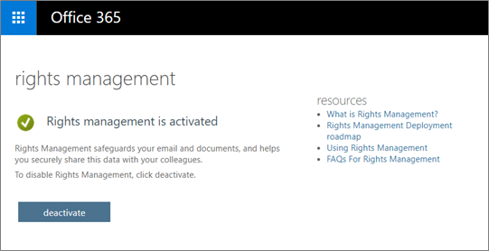

# <a name="protection-features-in-azure-information-protection-rolling-out-to-existing-tenants"></a>Recursos de proteção na Proteção de Informações do Azure sendo implantadas para locatários existentes

[!INCLUDE [Microsoft 365 Defender rebranding](../includes/microsoft-defender-for-office.md)]

**Aplica-se a**
- [Microsoft Defender para Office 365 plano 2](https://go.microsoft.com/fwlink/?linkid=2148715)
- [Microsoft 365 Defender](https://go.microsoft.com/fwlink/?linkid=2118804)

Para ajudar na etapa inicial de proteção de suas informações, a partir de julho de 2018, todos os locatários qualificados da Proteção de Informações do Azure terão os recursos de proteção na Proteção de Informações do Azure habilitados por padrão. Os recursos de proteção na Proteção de Informações do Azure eram conhecidos anteriormente no Office 365 como Rights Management ou Azure RMS. Se sua organização tiver um plano de serviço do Office E3 ou um plano de serviço superior, você começará a proteger as informações por meio da Proteção de Informações do Azure quando lançarmos esses recursos.

## <a name="changes-beginning-july-1-2018"></a>Alterações a partir de 1º de julho de 2018

A partir de 1º de julho de 2018, a Microsoft habilita o recurso de proteção na Proteção de Informações do Azure para todas as organizações com um dos seguintes planos de assinatura:

- A Criptografia de Mensagens do Office 365 é oferecida como parte do Office 365 E3 e E5, Microsoft E3 e E5, Office 365 A1, A3 e A5, além do Office 365 G3 e G5. Você não precisa de licenças adicionais para receber os novos recursos de proteção da Proteção de Informações do Azure.

- Você também pode adicionar o Plano 1 da Proteção de Informações do Azure aos seguintes planos para receber os novos recursos de Criptografia de Mensagem do Office 365: Exchange Online Plano 1, Exchange Online Plano 2, Office 365 F1, Microsoft 365 Business Basic, Microsoft 365 Business Standard ou Office 365 Enterprise E1.

- Cada usuário que se beneficia da Criptografia de Mensagens do Office 365 precisa ser licenciado para ser coberto pelo recurso.

- Para ver a lista completa, confira as [descrições de serviço do Exchange Online para](https://docs.microsoft.com/office365/servicedescriptions/exchange-online-service-description/exchange-online-service-description) a Criptografia de Mensagens do Office 365.

Os administradores de locatários podem verificar o status de proteção no portal do administrador do Office 365.



## <a name="why-are-we-making-this-change"></a>Por que estamos fazendo essa alteração?

A Criptografia de Mensagens do Office 365 aproveita os recursos de proteção na Proteção de Informações do Azure. No centro das melhorias recentes para a Criptografia de Mensagens do Office 365 e nossos investimentos mais amplos na proteção de informações no Microsoft 365, estamos facilitando a adoção e o uso de nossos recursos de proteção, como historicamente, tecnologias de criptografia têm sido difíceis de configurar. Ao ligar os recursos de proteção na Proteção de Informações do Azure por padrão, você pode começar a proteger seus dados confidenciais rapidamente.

## <a name="does-this-impact-me"></a>Isso me afeta?

Se sua organização comprou uma licença qualificada do Office 365, seu locatário será afetado por essa alteração.

 **IMPORTANTE!** Se você estiver usando o Active Directory Rights Management Services (AD RMS) em seu ambiente local, deverá optar por não fazer essa alteração imediatamente ou migrar para a Proteção de Informações do Azure antes de lançarmos essa alteração nos próximos 30 dias. Para obter informações sobre como optar por não participar, consulte "Uso o AD RMS, como faço para não participar?" mais adiante neste artigo. Se você preferir migrar, confira [Migrar do AD RMS para a Proteção de Informações do Azure.](https://docs.microsoft.com/azure/information-protection/plan-design/migrate-from-ad-rms-to-azure-rms)

## <a name="can-i-use-azure-information-protection-with-active-directory-rights-management-services-ad-rms"></a>Posso usar a Proteção de Informações do Azure com o Active Directory Rights Management Services (AD RMS)?

Não. Este não é um cenário de implantação com suporte. Sem seguir as etapas adicionais de aceitação, alguns computadores podem começar automaticamente a usar o serviço Azure Rights Management e também se conectar ao cluster do AD RMS. Esse cenário não é suportado e tem resultados não confiáveis, portanto, é importante que você re opte por essa alteração nos próximos 30 dias antes de lançarmos esses novos recursos. Para obter informações sobre como optar por não participar, consulte "Uso o AD RMS, como faço para não participar?" mais adiante neste artigo. Se você preferir migrar, confira [Migrar do AD RMS para a Proteção de Informações do Azure.](https://docs.microsoft.com/azure/information-protection/plan-design/migrate-from-ad-rms-to-azure-rms)

## <a name="how-do-i-know-if-im-using-ad-rms"></a>Como saber se estou usando o AD RMS?

Use estas instruções para preparar o ambiente para o Azure Rights Management quando também tiver o [Active Directory Rights Management Services (AD RMS)](https://docs.microsoft.com/azure/information-protection/deploy-use/prepare-environment-adrms) para verificar se você implantou o AD RMS:

1. Embora opcional, a maioria das implantações do AD RMS publica o SCP (ponto de conexão de serviço) no Active Directory para que os computadores de domínio possam descobrir o cluster do AD RMS.

Use o AdsI Edit para ver se você tem um SCP publicado no Active Directory: CN=Configuration [nome do servidor], CN=Services, CN=RightsManagementServices, CN=SCP

2. Se você não estiver usando um SCP, os computadores Windows que se conectam a um cluster do AD RMS devem ser configurados para o redirecionamento de licenciamento ou descoberta de serviço do lado do cliente usando o Registro do Windows: HKEY_LOCAL_MACHINE\SOFTWARE\Microsoft\MSIPC\ServiceLocation ou HKEY_LOCAL_MACHINE\SOFTWARE\Wow6432Node\Microsoft\MSIPC\ServiceLocation

Para obter mais informações sobre essas configurações do Registro, consulte Habilitando a descoberta de serviço do lado do cliente usando o Registro do [Windows](https://docs.microsoft.com/azure/information-protection/rms-client/client-deployment-notes#enabling-client-side-service-discovery-by-using-the-windows-registry) e redirecionando o tráfego [do servidor de licenciamento.](https://docs.microsoft.com/azure/information-protection/rms-client/client-deployment-notes#redirecting-licensing-server-traffic)

## <a name="i-use-ad-rms-how-do-i-opt-out"></a>Eu uso o AD RMS, como faço para não participar?

Para optar por não realizar as alterações futuras, conclua estas etapas:

1. Usando uma conta de trabalho ou de estudante que tenha permissões de administrador global em sua organização, inicie uma sessão do Windows PowerShell e conecte-se ao Exchange Online. Para obter instruções, confira [Conectar-se ao PowerShell do Exchange Online](https://docs.microsoft.com/powershell/exchange/connect-to-exchange-online-powershell).

2. Execute o Set-IRMConfiguration cmdlet usando a seguinte sintaxe:

  ```powershell
  Set-IRMConfiguration -AutomaticServiceUpdateEnabled $false
  ```

## <a name="what-can-i-expect-after-this-change-has-been-made"></a>O que posso esperar depois que essa alteração tiver sido feita?

Depois que isso for habilitado, desde que você não tenha optado por não usá-la, você poderá começar a usar a nova versão da Criptografia de Mensagens do Office 365 anunciada no [Microsoft Ignite 2017](https://techcommunity.microsoft.com/t5/Security-Privacy-and-Compliance/Email-Encryption-and-Rights-Protection/ba-p/110801) e aproveita os recursos de criptografia e proteção da Proteção de Informações do Azure.


Para obter mais informações sobre os novos aprimoramentos, consulte Criptografia de Mensagem do [Office 365.](../../compliance/ome.md)
