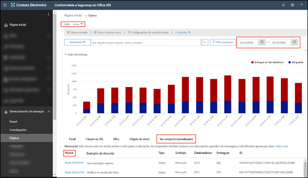
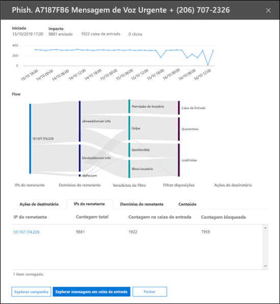
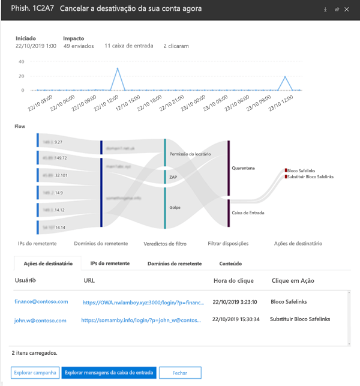

# Modos de Exibição de Campanha no Office 365 ATPCampaign Views in Office 365 ATP

> [!NOTE]
> Os recursos descritos neste tópico estão atualmente em versão prévia e estão sujeitos a alterações.The features described in this article are currently in preview and subject to change.

Os Modos de Exibição de Campanhas é um recurso no ATP (Proteção Avançada contra Ameaças) no Centro de Conformidade e Segurança do Office 365 que identifica e categoriza os ataques de phishing no serviço.Campaign Views is a feature in Advanced Threat Protection (ATP) in the Office 365 Security & Compliance Center that identifies and categorizes phishing attacks in the service. Os Modos de Exibição de Campanhas podem ajudá-lo a:Campaign Views can help you to:

- Investigar e responder de forma eficiente os ataques de phishing.Efficiently investigate and respond to phishing attacks.

- Entender melhor o escopo do ataque.Better understand the scope of the attack.

- Mostrar valor aos tomadores de decisões.Show value to decision makers.

Os Modos de Exibição de Campanhas permitem que você veja o panorama de um ataque de forma mais rápida e completa do que qualquer pessoa.Campaign Views lets you see the big picture of an attack faster and more complete than any human.

## O que é uma campanha?What is a ToolTip?

Uma campanha é um ataque coordenado por email contra uma ou várias organizações.A campaign is a coordinated email attack against one or many organizations. Hoje, os ataques por email que roubam credenciais e dados da empresa são negócios grandes e lucrativos.Today, email attacks that steal credentials and company data are a big and lucrative business. À medida que as tecnologias focam seus esforços para interromper os ataques, os invasores são sofisticados o suficiente para modificar seus métodos em um esforço para garantir o sucesso contínuo.As technologies increase in an effort to stop attacks, attackers are sophisticated enough to modify their methods in an effort to ensure continued success.

A Microsoft aproveita o vasto volume de dados e experiência de antiphishing, antispam e antimalware no serviço do Office 365 em todo o mundo para identificar as campanhas.Microsoft leverages the vast amounts of anti-phishing, anti-spam, and anti-malware data and experience across the entire Office 365 service world-wide to identify campaigns. As informações do ataque são analisadas e classificadas de acordo com vários fatores.The attack information is analyzed and classified according to several factors. Por exemplo:For example:

- **Fonte de ataque**: endereços IP de origem e domínios de email do remetente.**Attack source**: Source IP addresses and sender email domains.

- **Propriedades da mensagem de ataque**: o conteúdo, estilo e tom das mensagens de ataque.**Attack message properties**: The content, style, and tone of the attack messages.

- **Destinatários de um ataque**: domínios do destinatário, funções de trabalho do destinatário (administradores, executivos, etc.), tipos de empresa (grandes, pequenas, públicas, privadas etc.) e setores.**Attack recipients**: Recipient domains, recipient job functions (admins, executives, etc.), company types (large, small, public, private, etc.), and industries.

- **Payload de ataque**: links mal-intencionados, anexos ou outros payloads.**Attack payload**: Malicious links, attachments, or other payloads.

## Modos de Exibição de Campanhas no Centro de Conformidade e Segurança do Office 365Permissions in the Office 365 Security & Compliance Center

Os Modos de Exibição de Campanhas estão disponíveis no [Centro de Conformidade e Segurança](https://docs.microsoft.com/microsoft-365/compliance/go-to-the-securitycompliance-center) nos seguintes locais:Campaign Views is available in the [Security & Compliance Center](https://docs.microsoft.com/microsoft-365/compliance/go-to-the-securitycompliance-center) at the following locations:

- **Gerenciamento de ameaças** \> **Explorer** \> **Exibir** \> **Phish** \> **Campanha principal (visualização)****Threat management** \> **Explorer** \> **View** \> **Phish** \> **Top campaign (Preview)**

- **Gerenciamento de ameaças** \> **Explorer** \> **Exibir** \> **Todos os emails** \> **Campanha principal (visualização)****Threat management** \> **Explorer** \> **View** \> **All email** \> **Top campaign (Preview)**

> [!TIP]
> No momento, a única filtragem disponível é o intervalo de datas.Currently, the only filtering that's available is the date range. Caso não veja nenhum dado da campanha, experimente alterar o intervalo de datas.If you don't see any campaign data, try changing the date range.

A página Visão geral mostra as seguintes informações sobre a campanha:The overview page shows the following information about the campaign:

- **Nome****Name**

- **Exemplo de assunto**: a linha de assunto de uma das mensagens na campanha.**Sample subject**: The subject line of one of the messages in the campaign. Observe que _todas_ as mensagens na campanha não terão necessariamente essa mesma linha de assunto.Note that _all_ the messages in the campaign will not necessarily have this same subject line.

- **Tipo**: atualmente, esse valor será sempre **Phish**.**Type**: Currently, this value will always be **Phish**.

- **Subtipo**: quando disponível, a marca que está sendo visada por esta campanha.**Subtype**: Where available, the brand that is being phished by this campaign. Quando a detecção é orientada pela tecnologia ATP, o prefixo **ATP-** é adicionado ao valor do subtipo.When the detection is driven by ATP technology, the prefix **ATP-** is added to the subtype value.

- **Destinatários**: o número de usuários que foram alvos desta campanha.**Recipients**: The number of users that were targeted by this campaign.

- **Entregue**: o número de usuários que receberam mensagens desta campanha na caixa de entrada.**Delivered**: The number of users that received messages from this campaign into their Inbox.

- **ID**: o identificador exclusivo da campanha.**ID**: A unique identifier for the campaign.

Quando você clica no nome de uma campanha, os detalhes da campanha aparecem em um submenu.When you click on the name of a campaign, the campaign details appears in a flyout.

## Detalhes da campanhaCampaign details

No modo de exibição de detalhes da campanha, estão disponíveis muitas informações sobre a campanha:In the campaign details view, a lot of information is available about the campaign:

- Informações da campanha:Campaign information:

  - **ID**: o mesmo identificador exclusivo da campanha na tela visão geral.**ID**: The same unique identifier of the campaign from the overview screen.

  - **Iniciado** e **Finalizado**: o filtro do intervalo de datas selecionado.**Started** and **Ended**: the date range filter you selected.

  - **Impacto**: o número de mensagens enviadas no intervalo de datas selecionado, quantas eram "caixa de entrada" (isto é, entregue na caixa de entrada) e quantos usuários clicaram na URL do payload na mensagem de phishing.**Impact**: the number of messages sent in the date range you selected, how many were "inboxed" (that is, delivered to the Inbox), and how many users clicked on the URL payload in the phishing message.

  - Uma linha do tempo de atividade da campanha: quando a campanha começou e terminou e o volume de mensagens neste período.A timeline of campaign activity: When the campaign started and ended, and the volume of messages over time.

### Fluxo de campanhaCampaign flow

Os detalhes importantes sobre a campanha são apresentados em um diagrama de fluxo horizontal (conhecido como diagrama _Sankey_) na seção **Fluxo**.Important details about the campaign are presented in a horizontal flow diagram (known as a _Sankey_ diagram) in the **Flow** section. Esses detalhes ajudarão você a entender os elementos da campanha e o impacto potencial na sua organização.These details will help you to understand the elements of the campaign and the potential impact in your organization.

Se passar o mouse sobre uma faixa horizontal no diagrama, você verá o número de mensagens relacionadas (por exemplo, mensagens de um determinado IP de origem, mensagens do IP de origem usando o domínio do remetente especificado, etc.).If you hover over a horizontal band in the diagram, you'll see the number of related messages (for example, messages from a particular source IP, messages from the source IP using the specified sender domain, etc.).

O diagrama contém as seguintes informações:The activity report contains the following information.

- **IPs do remetente****Sender IPs**

- **Domínios do remetente****Sender domains**

- **Filtrar veredictos**: os valores aqui estão relacionados aos veredictos do filtro antiphishing e antispam disponíveis, como descrito em [Cabeçalhos de mensagem antispam](anti-spam-message-headers.md).**Filter verdicts**: The values here are related to the available anti-phishing and anti-spam filter verdicts as described in [Anti-spam message headers](anti-spam-message-headers.md). O mais importante aqui são os valores **Permissão do locatário**, que significa que uma configuração definida na organização permitiu uma mensagem que de outra forma seria bloqueada pelo serviço (por exemplo, um domínio na lista de Remetentes permitidos).Of great interest here are the values **Tenant Allow**, which means a configured setting in the organization allowed a message through that would have been otherwise blocked by the service (for example, a domain in the Allowed Senders list).

  - **Bloqueio do locatário**: esse valor indica que uma configuração na sua organização (por exemplo, uma entrada de domínio na [lista de Remetentes bloqueados](create-block-sender-lists-in-office-365.md)) detectou a mensagem e determinou onde ela foi entregue.**Tenant Block**: This value indicates that a setting in your organization (for example, a domain entry in the [Blocked Senders list](create-block-sender-lists-in-office-365.md)) both detected the message and determined where it was delivered. Para mensagens que não estão em quarentena, examine as configurações de remetentes bloqueados para determinar por que a mensagem foi entregue.For messages that weren't quarantined, review your blocked senders settings to determine why the message was delivered.

  - **Detectado****Detected app**

  - **Permissão do locatário****Tenant Allow**

- **Locais de entrega**: Você provavelmente desejará investigar as mensagens que foram realmente entregues aos destinatários (na pasta Caixa de Entrada ou Lixo Eletrônico), mesmo se os usuários não clicarem na URL do payload na mensagem.**Delivery locations**: You'll likely want to investigate messages that were actually delivered to recipients (either to the Inbox or the Junk Email folder), even if users didn't click on the payload URL in the message. Você também pode remover as mensagens em quarentena em [Colocar mensagens de email em quarentena no Office 365](quarantine-email-messages.md).You can also remove the quarantined messages from [Quarantine email messages in Office 365](quarantine-email-messages.md).

  - **Pasta Lixo Eletrônico****Junk folder**

  - **Quarentena****Quarantine**

  - **Caixa de Entrada****Inbox**

#### Cliques na URLURL clicks

Há sempre uma chance de que as mensagens entregues na pasta Caixa de Entrada ou Lixo Eletrônico do destinatário possam ser acionadas pelo usuário (ou seja, o usuário clicará na URL mal-intencionada da mensagem).There's always the chance that messages delivered to the recipient's Inbox or Junk Email folder can be acted upon by the user (that is, user will click on the malicious URL in the message). Se eles não clicaram, isso é uma pequena vitória, embora você certamente precise determinar por que a mensagem prejudicial foi entregue à caixa de correio deles.If they haven't, that's a small measure of success, although you certainly need to determine why the harmful message was delivered to their mailbox in the first place.

Se um usuário clicou na URL mal-intencionada, as ações serão exibidas na área do diagrama **Cliques na URL**.If a user has clicked on the malicious URL, the actions are displayed in the **URL clicks** area of the diagram.

- **Bloqueio de Links Seguros**: este valor indica que o destinatário clicou na URL do payload na mensagem, mas foi bloqueado pelas políticas de [Links Seguros ATP](atp-safe-links.md) da sua organização.**Safe Links Block**: This value indicates the recipient clicked on the payload URL in the message, but it was blocked by the [ATP Safe Links](atp-safe-links.md) policies in your organization.

- **Substituir Bloqueio de Links Seguros**: esse valor também indica que o destinatário clicou na URL do payload na mensagem, os Links de Seguros do ATP tentaram pará-lo, mas eles tiveram permissão para substituir o bloqueio.**Safe Links Block Override**: This value also indicates the recipient clicked on the payload URL in the message, ATP Safe Links tried to stop them, but they were allowed to override the block. É necessário investigar as suas [políticas de Links Seguros](set-up-atp-safe-links-policies.md)para ver por que os usuários têm permissão para substituir o veredicto dos Links Seguros e clicar em URLs mal-intencionadas.You need to investigate your [Safe Links policies](set-up-atp-safe-links-policies.md) to see why users are allowed to override the Safe Links verdict and click on malicious URLs.

### GuiasTabs

Há várias guias no modo de exibição de detalhes da campanha que permitem uma investigação mais detalhada.There are several tabs in the campaign details view that allow you to further investigate the campaign.

- **Cliques na URL**: se não houve cliques na URL do payload na mensagem de phishing, essa seção ficará em branco.**URL Clicks**: If the payload URL in the phishing message wasn't clicked, this section will be blank. Se um usuário conseguiu clicar na URL, vocêIf a user was able to click on the URL, you

  - **Usuário**\*User

  - **URL**\*URL

  - **Hora do clique****Click Time**

  - **Ação do clique**Click **Action**.

- **IPs do remetente****Sender IPs**

  - **IP do remetente**\***Sender IP**\*

  - **Contagem total****Total Count**

  - **Contagem na caixa de entrada****Inboxed Count**

  - **Contagem bloqueado****Blocked Count**

  - **SPF transmitido****SPF Passed**

- **Remetentes****Senders**

  - **Remetente****Sender**

  - **Contagem total****Total Count**

  - **Contagem na caixa de entrada****Inboxed Count**

  - **Contagem bloqueado****Blocked Count**

  - **DKIM aprovado****DKIM Passed**

  - **DMARC aprovado****DMARC Passed**

- **Payloads****Payloads**

  - **URL**\*URL

  - **Contagem total****Total Count**

\* Clicar nesse valor abre um novo submenu que contém mais detalhes sobre o item especificado (usuário, URL, etc.) na parte superior do modo de exibição de detalhes da campanha.\* Clicking on this value opens a new flyout that contains more details about the specified item (user, URL, etc.) on top of the campaign details view. Para retornar ao modo de exibição de detalhes da campanha, clique em **Concluído** no novo submenu.To return to the campaign details view, click **Done** in the new flyout.

### BotõesButtons

Os botões no modo de exibição de detalhes da campanha permitem usar os recursos do Explorador de Ameaças para investigar ainda mais a campanha.The buttons in the campaign details view allow you to use the power of Threat Explorer to further investigate the campaign.

- **Explorar campanhas**: abre uma nova guia de pesquisa do Explorador de Ameaças usando o valor **ID da campanha** como filtro de pesquisa.**Explore campaign**: Opens a new Threat Explorer search tab using the **Campaign ID** value as the search filter.

- **Explorar mensagens da Caixa de Entrada**: abre uma nova guia de pesquisa do Explorador de Ameaças usando a **ID da campanha** e o **Local de entrega: Caixa de Entrada** como filtro da pesquisa.**Explore Inbox messages**: Opens a new Threat Explorer search tab using the **Campaign ID** and **Delivery location: Inbox** as the search filter.
