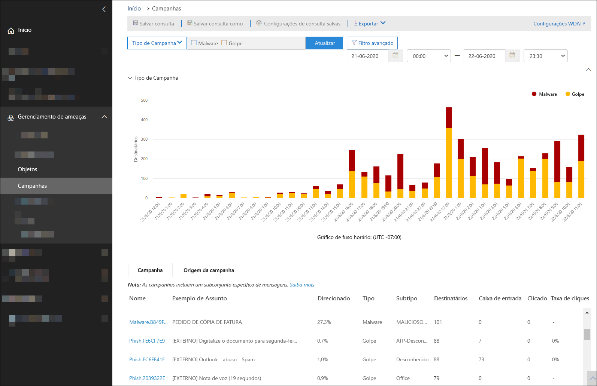
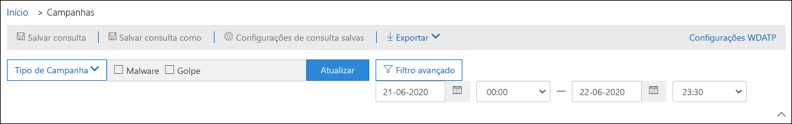
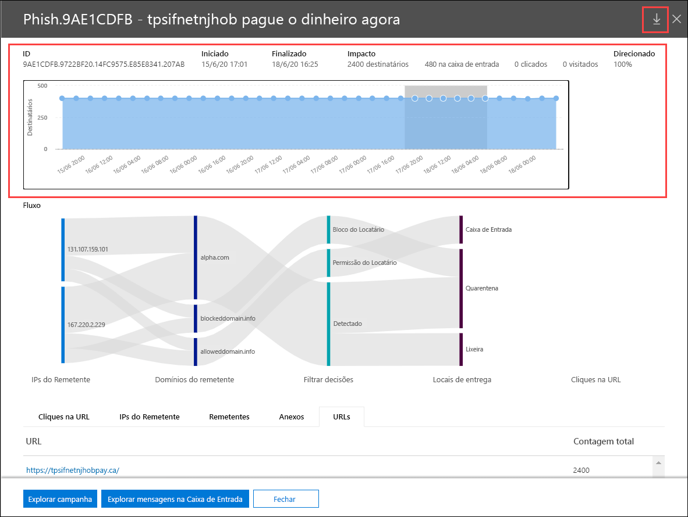
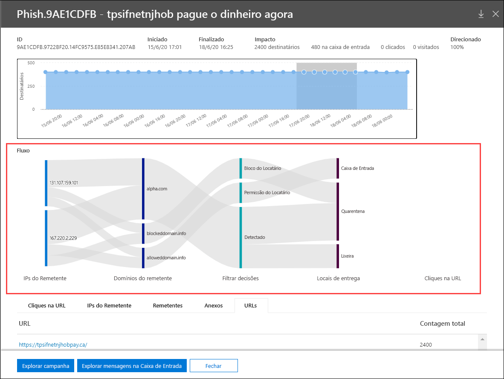

# Modos de exibição de campanha no Microsoft defender para Office 365

[!INCLUDE [Microsoft 365 Defender rebranding](../includes/microsoft-defender-for-office.md)]

O modo de exibição de campanha é um recurso do Microsoft defender para Office 365 plano 2 (por exemplo, Microsoft 365 E5 ou organizações com um defender para Office 365 plano 2). Os modos de exibição de campanha no centro de conformidade & segurança identifica e categoriza os ataques de phishing no serviço. Os Modos de Exibição de Campanhas podem ajudá-lo a:

- Investigar e responder de forma eficiente os ataques de phishing.
- Entender melhor o escopo do ataque.
- Mostrar valor aos tomadores de decisões.

Os Modos de Exibição de Campanhas permitem que você veja o panorama de um ataque de forma mais rápida e completa do que qualquer pessoa.

## O que é uma campanha?

Uma campanha é um ataque coordenado por email contra uma ou várias organizações. Os ataques de email que roubam credenciais e dados da empresa são um setor grande e lucrative. À medida que as tecnologias aumentam em um esforço para interromper ataques, os invasores modificam seus métodos em um esforço para garantir o sucesso contínuo.

A Microsoft aproveita as vastas quantidades de dados anti-phishing, antispam e antimalware em todo o serviço para ajudar a identificar campanhas. Analisamos e classificamos as informações de ataque de acordo com vários fatores. Por exemplo:

- **Fonte de ataque** : os endereços IP de origem e os domínios de email do remetente.
- **Propriedades da mensagem** : o conteúdo, o estilo e o Tom das mensagens.
- **Destinatários da mensagem** : como os destinatários estão relacionados. Por exemplo, domínios de destinatário, funções de trabalho de destinatário (administradores, executivos, etc.), tipos de empresas (grandes, pequenos, públicos, privados etc.) e setores.
- **Carga de ataque** : links mal-intencionados, anexos ou outras cargas nas mensagens.

Uma campanha pode ser de vida curta ou pode abranger vários dias, semanas ou meses com períodos ativos e inativos. Uma campanha pode ser iniciada em sua organização específica ou sua organização pode fazer parte de uma campanha maior em várias empresas.

## Modos de exibição de campanha no centro de conformidade & segurança

Os modos de exibição de campanha estão disponíveis no [centro de conformidade & segurança](https://protection.office.com) em campanhas de **Gerenciamento de ameaças** \> **Campaigns** ou diretamente em <https://protection.office.com/campaigns> .

Você também pode obter modos de exibição de campanha de:

- **Gerenciamento** \> de ameaças **Explorer** \> **Exibir** \> **Campanhas**
- **Gerenciamento** \> de ameaças **Explorer** \> **Exibir** \> **Todos os emails** \> Guia **campanha**
- **Gerenciamento** \> de ameaças **Explorer** \> **Exibir** \> **Phish** \> Guia **campanha**
- **Gerenciamento** \> de ameaças **Explorer** \> **Exibir** \> **Malware** \> Guia **campanha**

Para acessar modos de exibição de campanha, você precisa ser membro dos grupos de função de **Gerenciamento da organização** , **administrador de segurança** ou leitor de **segurança** no centro de conformidade de & de segurança. Para saber mais, confira [Permissões no Centro de Conformidade de Segurança](permissions-in-the-security-and-compliance-center.md).

## Visão geral de campanhas

A página Visão geral mostra informações sobre todas as campanhas.

Na guia **campanha** padrão, a área **tipo de campanha** mostra um gráfico de barras que mostra o número de destinatários por dia. Por padrão, o gráfico mostra tanto dados de **phishing** quanto de **malware** .

> [!TIP]
> Se você não vir nenhum dado da campanha, tente alterar o intervalo de datas ou os [filtros](#filters-and-settings).

O restante da página Visão geral mostra as seguintes informações na guia **campanha** :

- **Nome**

- **Exemplo de assunto** : a linha de assunto de uma das mensagens na campanha. Observe que todas as mensagens na campanha não terão necessariamente o mesmo assunto.

- **Direcionado** : o percentual conforme calculado por: (o número de destinatários da campanha em sua organização)/(o número total de destinatários na campanha em todas as organizações no serviço). Esse valor indica o grau para o qual a campanha é direcionada somente em sua organização (um valor maior) vs. também direcionado a outras organizações no serviço (um valor mais baixo).

- **Tipo** : esse valor é **Phish** ou **malware**.

- **Subtipo** : esse valor contém mais detalhes sobre a campanha. Por exemplo:
  - **Phish** : quando disponível, a marca que está sendo enphishingada por esta campanha. Por exemplo,,,,, `Microsoft` `365` `Unknown` `Outlook` ou `DocuSign` .
  - **Malware** : por exemplo, `HTML/PHISH` ou `HTML/<MalwareFamilyName>` .

  Quando disponível, a marca que está sendo enphishingada por esta campanha. Quando a detecção é orientada pela tecnologia do defender para Office 365, o prefixo **ATP-** é adicionado ao valor de subtipo.

- **Destinatários** : o número de usuários que foram alvos desta campanha.

- **Caixa de entrada** : o número de usuários que receberam mensagens desta campanha em sua caixa de entrada (não entregue na pasta lixo eletrônico).

- **Clicado** : o número de usuários que clicaram na URL ou abriram o anexo na mensagem de phishing.

- **Taxa de clique** : a porcentagem conforme calculada por " **clicado** em  /  **caixa de entrada** ". Esse valor é um indicador da eficácia da campanha. Em outras palavras, se os destinatários foram capazes de identificar a mensagem como phishing e se não clicar na URL de carga.

  Observe que a **taxa de clique** não é usada em campanhas de malware.

- **Visitado** : quantos usuários realmente o fizeram no site de carga de transferência. Se houver valores **clicados** , mas os links seguros bloquearam o acesso ao site, esse valor será zero.

A guia **origem da campanha** mostra as fontes de mensagens em um mapa do mundo.

### Filtros e configurações

Na parte superior da página modos de exibição de campanha, há várias configurações de filtro e de consulta para ajudá-lo a encontrar e isolar campanhas específicas.

A filtragem mais básica que você pode fazer é a data/hora de início e a data/hora de término.

Para filtrar mais detalhadamente o modo de exibição, você pode fazer uma única propriedade com vários valores, clicando no botão **tipo de campanha** , fazendo sua seleção e, em seguida, clicando em **Atualizar**.

As propriedades de campanha filtradas que estão disponíveis no botão **tipo de campanha** são descritas na lista a seguir:

- **Básico** :
  - **Tipo de campanha** : selecione **malware** ou **phishing**. Limpar as seleções tem o mesmo resultado que selecionar ambos.
  - **Nome da campanha**
  - **Subtipo de campanha**
  - **Sender**
  - **Destinatários**
  - **Domínio do remetente**
  - **Assunto**
  - **Nome do arquivo anexo**
  - **Família de malware**
  - **Marcas** : usuários ou grupos que tiveram a marca de usuário especificada aplicada (incluindo contas de prioridade). Para obter mais informações sobre marcas de usuário, consulte [User Tags](user-tags.md).
  - **Substituições de sistema**
  - **Ação de entrega**
  - **Ação adicional**
  - **Directionality**
  - **Tecnologia de detecção**
  - **Local de entrega original**
  - **Local de entrega mais recente**
  - **Substituições de sistema**

- **Avançado** :
  - **ID de mensagem da Internet** : disponível no campo de cabeçalho **Message-ID** no cabeçalho da mensagem. Um valor de exemplo é `<08f1e0f6806a47b4ac103961109ae6ef@server.domain>` (Observe os colchetes angulares).
  - **ID da mensagem de rede** : um valor de GUID que está disponível no campo de cabeçalho **X-MS-Exchange-Organization-Network-Message-ID** no cabeçalho da mensagem.
  - **IP do remetente**
  - **Attachment SHA256** : para localizar o valor de hash SHA256 de um arquivo no Windows, execute o seguinte comando em um prompt de comando: `certutil.exe -hashfile "<Path>\<Filename>" SHA256` .
  - **ID do cluster**
  - **ID da política de alerta**
  - **Sinal de URL ZAP**

- **URLs** :
  - **Domínio da URL**
  - **Caminho e domínio da URL**
  - **URL**
  - **Caminho da URL**
  - **Clique em veredicto**

Para uma filtragem mais avançada, incluindo a filtragem por várias propriedades, você pode clicar no botão de **filtro avançado** para criar uma consulta. As mesmas propriedades de campanha estão disponíveis, mas com os seguintes aprimoramentos:

- Você pode clicar em **Adicionar uma condição** para selecionar várias condições.
- Você pode escolher o operador **and** ou **or** entre condições.
- Você pode selecionar o item de **grupo de condição** na parte inferior da lista de condições para formar condições compostas complexas.

Quando tiver terminado, clique no botão **consulta** .

Depois de criar um filtro básico ou avançado, você poderá salvá-lo usando **Salvar consulta** ou **Salvar consulta como**. Posteriormente, quando você retornar a exibições de campanhas, poderá carregar um filtro salvo clicando em **configurações de consulta salvas**.

Para exportar o gráfico ou a lista de campanhas, clique em **Exportar** e selecione **exportar dados do gráfico** ou **Exportar lista de campanhas**.

Se você tiver uma assinatura do Microsoft defender para ponto de extremidade, você pode clicar em **WDATP** para conectar ou desconectar as informações de campanhas com o Microsoft defender para ponto de extremidade. Para obter mais informações, consulte [integrar o Microsoft defender para Office 365 com o Microsoft defender para ponto de extremidade](https://docs.microsoft.com/microsoft-365/security/office-365-security/integrate-office-365-ti-with-wdatp).

## Detalhes da campanha

Quando você clica no nome de uma campanha, os detalhes da campanha aparecem em um submenu.

### Informações de campanha

Na parte superior do modo de exibição detalhes da campanha, as seguintes informações de campanha estão disponíveis:

- **ID** : o identificador exclusivo da campanha.

- **Iniciado** e **finalizado** : a data de início e a data de término da campanha. Observe que essas datas podem ser estendidas além das datas de filtro selecionadas na página Visão geral.

- **Impacto** : Esta seção contém os seguintes dados para o filtro de intervalo de datas que você selecionou (ou que você selecionou na linha do tempo):
  - O número total de destinatários.
  - O número de mensagens que foram "caixa de entrada" (isto é, entregues na caixa de entrada, e não na pasta lixo eletrônico).
  - Quantos usuários clicaram na carga da URL na mensagem de phishing.
  - Howe muitos usuários visitaram a URL.

- **Direcionado** : o percentual conforme calculado por: (o número de destinatários da campanha em sua organização)/(o número total de destinatários na campanha em todas as organizações no serviço). Observe que esse valor é calculado sobre todo o tempo de vida da campanha e não é alterado com base nos filtros de data.

- Uma linha do tempo interativa da atividade de campanha: a linha do tempo mostra a atividade durante todo o tempo de vida da campanha. Por padrão, a área sombreada inclui o filtro intervalo de datas que você selecionou na visão geral. Você pode clicar e arrastar para selecionar um ponto inicial e um ponto final específicos, <u>o que irá alterar os dados exibidos na área de **impacto** e no restante da página, conforme descrito nas próximas seções</u>.

Na barra de título, você pode clicar no botão de **gravação da campanha de download**  para baixar os detalhes da campanha em um documento do Word (por padrão, CampaignReport.docx). Observe que o download contém detalhes sobre todo o tempo de vida da campanha (não apenas as datas de filtro selecionadas).

### Fluxo de campanha

No meio do modo de exibição detalhes da campanha, detalhes importantes sobre a campanha são apresentados na seção **fluxo** em um diagrama de fluxo horizontal (conhecido como diagrama do _Sankey_ ). Esses detalhes ajudarão você a entender os elementos da campanha e o impacto potencial na sua organização.

> [!TIP]
> As informações exibidas no diagrama de **fluxo** são controladas pelo intervalo de datas sombreado na linha do tempo, conforme descrito na seção anterior.

Se passar o mouse sobre uma faixa horizontal no diagrama, você verá o número de mensagens relacionadas (por exemplo, mensagens de um determinado IP de origem, mensagens do IP de origem usando o domínio do remetente especificado, etc.).

O diagrama contém as seguintes informações:

- **IPs do remetente**
- **Domínios do remetente**
- **Verdicts de filtro** : os valores de veredicto estão relacionados à verdicts de filtragem phishing e spam disponível conforme descrito em [cabeçalhos de mensagens antispam](anti-spam-message-headers.md). Os valores disponíveis são descritos na tabela a seguir:

  ****

  |Valor|Veredicto de filtro de spam|Descrição|
  |---|---|---|
  |**Permitido**|`SFV:SKN`    `SFV:SKI`|A mensagem foi marcada como não spam e/ou a filtragem ignorada antes de ser avaliada pela filtragem de spam. Por exemplo, a mensagem foi marcada como não spam por uma regra de fluxo de emails (também conhecida como regra de transporte).  A mensagem ignorou a filtragem de spam por outros motivos. Por exemplo, o remetente e o destinatário parecem estar na mesma organização.|
  |**Bloqueado**|`SFV:SKS`|A mensagem foi marcada como spam antes de ser avaliada pela filtragem de spam. Por exemplo, por uma regra de fluxo de emails.|
  |**Detectado**|`SFV:SPM`|A mensagem foi marcada como spam pela filtragem de spam.|
  |**Não detectado**|`SFV:NSPM`|A mensagem foi marcada como não spam por filtragem de spam.|
  |**Solta**|`SFV:SKQ`|A mensagem ignorou a filtragem de spam porque foi liberada da quarentena.|
  |**Permissão de locatário**\*|`SFV:SKA`|A mensagem ignorou a filtragem de spam devido às configurações de uma política antispam. Por exemplo, o remetente estava na lista de remetentes permitidos ou no domínio permitido.|
  |**Bloco de locatário**\*\*|`SFV:SKA`|A mensagem foi bloqueada por filtragem de spam devido às configurações de uma política antispam. Por exemplo, o remetente estava na lista de remetentes permitidos ou no domínio permitido.|
  |**Usuário permitir**\*|`SFV:SFE`|A mensagem ignorou a filtragem de spam porque o remetente estava na lista de remetentes confiáveis de um usuário.|
  |**Bloco de usuário**\*\*|`SFV:BLK`|A mensagem foi bloqueada por filtragem de spam porque o remetente estava na lista de remetentes bloqueados de um usuário.|
  |**ZAP**|n/d|[Limpeza automática de zero horas (zap)](zero-hour-auto-purge.md) moveu a mensagem entregue para a pasta lixo eletrônico ou quarentena. Você configura a ação em sua política antispam.|
  |

  \* Revise suas políticas antispam, pois a mensagem permitida provavelmente teria sido bloqueada pelo serviço.

  \*\* Revise suas políticas antispam, pois essas mensagens devem ser colocadas em quarentena, não entregues.

- **Locais de entrega** : provavelmente você desejará investigar as mensagens que foram entregues aos destinatários (tanto para a caixa de entrada quanto para a pasta lixo eletrônico), mesmo se os usuários não clicar na URL de carga na mensagem. Você também pode remover as mensagens em quarentena da quarentena. Para obter mais informações, consulte [mensagens de email em quarentena no EOP](quarantine-email-messages.md).
  - **Pasta excluída**
  - **Abandonado**
  - **Externo** : o destinatário está localizado em sua organização de email local em ambientes híbridos.
  - **Falhou**
  - **Encaminhadas**
  - **Caixa de Entrada**
  - **Pasta Lixo Eletrônico**
  - **Quarentena**
  - **Unknown**

- **Cliques de URL** : esses valores são descritos na próxima seção.

> [!NOTE]
> Em todas as camadas que contêm mais de 10 itens, os dez principais itens são mostrados, enquanto o restante é agrupado em **outros**.

#### Cliques na URL

Quando uma mensagem de phishing é entregue para a caixa de entrada de um destinatário ou para a pasta lixo eletrônico, há sempre a chance de que o usuário clique na URL de carga. Não clicar na URL é uma pequena medida do sucesso, mas você precisa determinar por que a mensagem de phishing foi entregue até a caixa de correio.

Se um usuário clicou na URL de carga na mensagem de phishing, as ações são exibidas na área de **cliques da URL** do diagrama no modo de exibição detalhes da campanha.

- **Permitido**
- **BlockPage** : o destinatário clicou na URL de carga, mas seu acesso ao site mal-intencionado foi bloqueado por uma política de [links seguros](atp-safe-links.md) em sua organização.
- **BlockPageOverride** : o destinatário clicou na URL da carga de mensagens, os links seguros tentaram interrompê-los, mas eles tinham permissão para substituir o bloco. Inspecione suas [políticas de links seguros](set-up-atp-safe-links-policies.md) para ver por que os usuários têm permissão para substituir os links de segurança veredicto e continuar no site mal-intencionado.
- **PendingDetonationPage** : os anexos seguros no Microsoft defender para Office 365 estão no processo de abertura e investigação da URL de carga em um ambiente de computador virtual.
- **PendingDetonationPageOverride** : o destinatário tinha permissão para substituir o processo de acionamento de carga e abrir a URL sem aguardar os resultados.

### Guias

As guias no modo de exibição detalhes da campanha permitem investigar ainda mais a campanha.

> [!TIP]
> As informações exibidas nas guias são controladas pelo intervalo de datas sombreado na linha do tempo, conforme descrito na seção [informações da campanha](#campaign-information) .

- **Cliques de URL** : se os usuários não clicar na URL de carga na mensagem, esta seção ficará em branco. Se um usuário conseguir clicar na URL, os seguintes valores serão preenchidos:
  - **Usuário**\*
  - **URL**\*
  - **Horário de clique**
  - **Clique em veredicto**

- **IPs do remetente**
  - **IP do remetente**\*
  - **Contagem total**
  - **Caixa de entrada**
  - **Não caixa de entrada**
  - **SPF aprovado** : o remetente foi autenticado pela [estrutura de política de remetente (SPF)](how-office-365-uses-spf-to-prevent-spoofing.md). Um remetente que não transmite validação de SPF indica um remetente não autenticado ou a mensagem está falsificando um remetente legítimo.

- **Remetentes**
  - **Remetente** : Este é o endereço do remetente real no comando mail SMTP from, que não é necessariamente o endereço de email que os usuários vêem em seus clientes de email.
  - **Contagem total**
  - **Caixa de entrada**
  - **Não caixa de entrada**
  - **DKIM passado** : o remetente foi autenticado por [chaves de domínio identificadas por email (DKIM)](support-for-validation-of-dkim-signed-messages.md). Um remetente que não aprova a validação do DKIM indica um remetente não autenticado ou a mensagem está falsificando um remetente legítimo.
  - **DMARC passado** : o remetente foi autenticado por [autenticação de mensagens baseadas em domínio, relatórios e conformidade (DMARC)](use-dmarc-to-validate-email.md). Um remetente que não aprova a validação do DMARC indica um remetente não autenticado ou a mensagem está falsificando um remetente legítimo.

- **Anexos**
  - **Filename**
  - **SHA256**
  - **Família de malware**
  - **Contagem total**

- **URL**
  - **URL**\*
  - **Contagem total**

\* Clicar nesse valor abre um novo submenu que contém mais detalhes sobre o item especificado (usuário, URL, etc.) na parte superior do modo de exibição de detalhes da campanha. Para retornar ao modo de exibição de detalhes da campanha, clique em **Concluído** no novo submenu.

### Botões

Os botões no modo de exibição de detalhes da campanha permitem usar os recursos do Explorador de Ameaças para investigar ainda mais a campanha.

- **Explorar campanhas** : abre uma nova guia de pesquisa do Explorador de Ameaças usando o valor **ID da campanha** como filtro de pesquisa.
- **Explorar mensagens de caixa de entrada** : abre uma nova guia de pesquisa do explorador de ameaças usando a **ID de campanha** e o **local de entrega: caixa de entrada** como o filtro de pesquisa.
