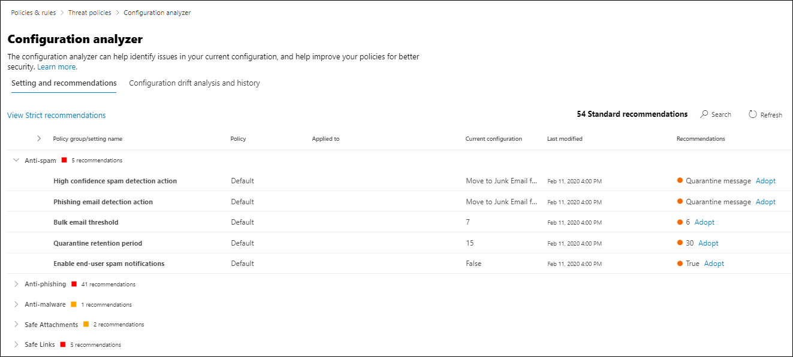
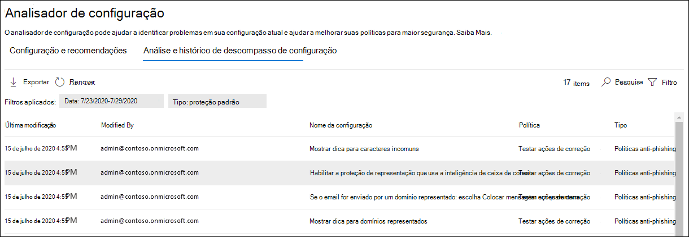

# Analisador de configuração para políticas de proteção no EOP e no Microsoft Defender para Office 365Configuration analyzer for protection policies in EOP and Microsoft Defender for Office 365

[!INCLUDE [Microsoft 365 Defender rebranding](../includes/microsoft-defender-for-office.md)]

**Aplica-se a****Applies to**
- [Proteção do Exchange OnlineExchange Online Protection](exchange-online-protection-overview.md)
- [Plano 1 e plano 2 do Microsoft Defender para Office 365Microsoft Defender for Office 365 plan 1 and plan 2](defender-for-office-365.md)
- [Microsoft 365 DefenderMicrosoft 365 Defender](../defender/microsoft-365-defender.md)

O analisador de configuração no portal do defender Microsoft 365 fornece um local central para localizar e corrigir políticas de segurança em que as configurações estão abaixo das configurações de perfil de proteção padrão e estrita em políticas de segurança [predefinidas.](preset-security-policies.md)Configuration analyzer in the Microsoft 365 Defender portal provides a central location to find and fix security policies where the settings are below the Standard protection and Strict protection profile settings in [preset security policies](preset-security-policies.md).

Os seguintes tipos de políticas são analisados pelo analisador de configuração:The following types of policies are analyzed by the configuration analyzer:

- **Proteção do Exchange Online (EOP)**: isso inclui organizações Microsoft 365 com caixas de correio Exchange Online e organizações EOP autônomas sem Exchange Online caixas de correio:**Exchange Online Protection (EOP) policies**: This includes Microsoft 365 organizations with Exchange Online mailboxes and standalone EOP organizations without Exchange Online mailboxes:

  - [Políticas anti-spam](configure-your-spam-filter-policies.md).[Anti-spam policies](configure-your-spam-filter-policies.md).
  - [Políticas anti-malware](configure-anti-malware-policies.md).[Anti-malware policies](configure-anti-malware-policies.md).
  - [Políticas anti-phishing do EOP](set-up-anti-phishing-policies.md#spoof-settings).[EOP anti-phishing policies](set-up-anti-phishing-policies.md#spoof-settings).

- **Políticas do Microsoft Defender para Office 365**: isso inclui organizações com o Microsoft 365 E5 ou o Defender para Office 365 assinaturas de complemento:**Microsoft Defender for Office 365 policies**: This includes organizations with Microsoft 365 E5 or Defender for Office 365 add-on subscriptions:

  - Políticas anti-phishing no Microsoft Defender para Office 365, que incluem:Anti-phishing policies in Microsoft Defender for Office 365, which include:
    - As mesmas [configurações de spoof](set-up-anti-phishing-policies.md#spoof-settings) que estão disponíveis nas políticas anti-phishing do EOP.The same [spoof settings](set-up-anti-phishing-policies.md#spoof-settings) that are available in the EOP anti-phishing policies.
    - [Configurações de representaçãoImpersonation settings](set-up-anti-phishing-policies.md#impersonation-settings-in-anti-phishing-policies-in-microsoft-defender-for-office-365)
    - [Limites avançados de phishingAdvanced phishing thresholds](set-up-anti-phishing-policies.md#advanced-phishing-thresholds-in-anti-phishing-policies-in-microsoft-defender-for-office-365)
  - [Cofre Políticas de links.](set-up-safe-links-policies.md)[Safe Links policies](set-up-safe-links-policies.md).
  - [Cofre de anexos.](set-up-safe-attachments-policies.md)[Safe Attachments policies](set-up-safe-attachments-policies.md).

Os valores  **de configuração** de política Padrão e Estrita usados como linhas de base são descritos em [Configurações recomendadas](recommended-settings-for-eop-and-office365.md)para EOP e Microsoft Defender para Office 365 segurança .The **Standard** and **Strict** policy setting values that are used as baselines are described in [Recommended settings for EOP and Microsoft Defender for Office 365 security](recommended-settings-for-eop-and-office365.md).

## Do que você precisa saber para começar?What do you need to know before you begin?

- Você abre o portal Microsoft 365 Defender em <https://security.microsoft.com> .You open the Microsoft 365 Defender portal at <https://security.microsoft.com>. Para ir diretamente para a página **analisador de** configuração, use <https://security.microsoft.com/configurationAnalyzer> .To go directly to the **Configuration analyzer** page, use <https://security.microsoft.com/configurationAnalyzer>.

- Para se conectar ao PowerShell do Exchange Online, confira [Conectar ao PowerShell do Exchange Online](/powershell/exchange/connect-to-exchange-online-powershell).To connect to Exchange Online PowerShell, see [Connect to Exchange Online PowerShell](/powershell/exchange/connect-to-exchange-online-powershell).

- Você precisa ter permissões atribuídas no portal Microsoft 365 Defender antes de poder fazer os procedimentos neste artigo:You need to be assigned permissions in the Microsoft 365 Defender portal before you can do the procedures in this article:
  - Para usar o **analisador** de configuração e fazer atualizações para  políticas de segurança, você precisa ser membro dos grupos de função Gerenciamento da Organização ou Administrador **de** Segurança.To use the configuration analyzer **and** make updates to security policies, you need to be a member of the **Organization Management** or **Security Administrator** role groups.
  - Para acesso somente leitura ao analisador de configuração, você precisa ser membro dos grupos de função Leitor **Global** ou **Leitor de** Segurança.For read-only access to the configuration analyzer, you need to be a member of the **Global Reader** or **Security Reader** role groups.

  Para obter mais informações, consulte [Permissões no portal Microsoft 365 Defender](permissions-microsoft-365-security-center.md).For more information, see [Permissions in the Microsoft 365 Defender portal](permissions-microsoft-365-security-center.md).

  > [!NOTE]
  >  
  > - Adicionar usuários à função Azure Active Directory correspondente fornece aos usuários as permissões necessárias no _portal_ Microsoft 365 Defender e permissões para outros recursos no Microsoft 365.Adding users to the corresponding Azure Active Directory role gives users the required permissions in the Microsoft 365 Defender portal _and_ permissions for other features in Microsoft 365. Para obter mais informações, confira o artigo [Sobre funções de administrador](../../admin/add-users/about-admin-roles.md).For more information, see [About admin roles](../../admin/add-users/about-admin-roles.md).
  >
  > - O grupo de função **Gerenciamento de Organização Somente para Exibição** no [Exchange Online](/Exchange/permissions-exo/permissions-exo#role-groups) também fornece acesso somente leitura ao recurso.The **View-Only Organization Management** role group in [Exchange Online](/Exchange/permissions-exo/permissions-exo#role-groups) also gives read-only access to the feature.

## Use o analisador de configuração no portal Microsoft 365 DefenderUse the configuration analyzer in the Microsoft 365 Defender portal

No portal Microsoft 365 Defender, vá para **Email** & políticas de colaboração & políticas de ameaça Seção Políticas \>  \>  \>  \> **modelo. Analisador de configuração.**In the Microsoft 365 Defender portal, go to **Email & collaboration** \> **Policies & rules** \> **Threat policies** \> **Templated policies** section \> **Configuration analyzer**.

A **página analisador de** configuração tem duas guias principais:The **Configuration analyzer** page has two main tabs:

- **Configurações e recomendações**: você escolhe **Standard** ou **Strict** e compara essas configurações às políticas de segurança existentes.**Settings and recommendations**: You pick **Standard** or **Strict** and compare those settings to your existing security policies. Nos resultados, você pode ajustar os valores de suas configurações para trazê-los para o mesmo nível que Standard ou Strict.In the results, you can adjust the values of your settings to bring them up to the same level as Standard or Strict.
- **Análise e histórico de desvios de** configuração : essa exibição permite controlar as alterações de política ao longo do tempo.**Configuration drift analysis and history**: This view allows you to track policy changes over time.

### Guia Configuração e recomendações no analisador de configuraçãoSetting and recommendations tab in the configuration analyzer

Por padrão, a guia é aberta na comparação com o perfil de proteção padrão.By default, the tab opens on the comparison to the Standard protection profile. Você pode alternar para a comparação do perfil de proteção estrito **selecionando Exibir recomendações estritas.**You can switch to the comparison of the Strict protection profile by selecting **View Strict recommendations**. Para alternar de volta, selecione **Exibir recomendações padrão**.To switch back, select **View Standard recommendations**.

Por padrão, a coluna **Grupo de política/nome** de configuração contém um modo de exibição recolhido dos diferentes tipos de políticas de segurança e o número de configurações que precisam ser melhoradas (se alguma).By default, the **Policy group/setting name** column contains a collapsed view of the different types of security policies and the number of settings that need improvement (if any). Os tipos de políticas são:The types of policies are:

- **Anti-spam****Anti-spam**
- **Anti-phishing****Anti-phishing**
- **Anti-malware****Anti-malware**
- **Cofre Anexos** (se sua assinatura incluir o Microsoft Defender para Office 365)**Safe Attachments** (if your subscription includes Microsoft Defender for Office 365)
- **Cofre Links** (se sua assinatura incluir o Microsoft Defender para Office 365)**Safe Links** (if your subscription includes Microsoft Defender for Office 365)

No modo de exibição padrão, tudo é recolhido.In the default view, everything is collapsed. Ao lado de cada política, há um resumo dos resultados de comparação de suas políticas (que você pode modificar) e as configurações nas políticas correspondentes para os perfis de proteção Standard ou Strict (que você não pode modificar).Next to each policy, there's a summary of comparison results from your policies (which you can modify) and the settings in the corresponding policies for the Standard or Strict protection profiles (which you can't modify). Você verá as seguintes informações para o perfil de proteção ao que está comparando:You'll see the following information for the protection profile that you're comparing to:

- **Verde**: Todas as configurações em todas as políticas existentes são pelo menos tão seguras quanto o perfil de proteção.**Green**: All settings in all existing policies are at least as secure as the protection profile.
- **Âmbar**: um pequeno número de configurações nas políticas existentes não são tão seguras quanto o perfil de proteção.**Amber**: A small number of settings in the existing policies are not as secure as the protection profile.
- **Vermelho**: um número significativo de configurações nas políticas existentes não são tão seguras quanto o perfil de proteção.**Red**: A significant number of settings in the existing policies are not as secure as the protection profile. Isso pode ser algumas configurações em muitas políticas ou em muitas configurações em uma política.This could be a few settings in many policies or many settings in one policy.

Para comparações favoráveis, você verá o texto: **Todas as configurações seguem** as \<**Standard** or **Strict**\> **recomendações**.For favorable comparisons, you'll see the text: **All settings follow** \<**Standard** or **Strict**\> **recommendations**. Caso contrário, você verá o número de configurações recomendadas a ser mudada.Otherwise, you'll see the number of recommended settings to change.

Se você expandir o nome do grupo **de política/configuração**, todas as políticas e as configurações associadas em cada política específica que exigem atenção serão reveladas.If you expand **Policy group/setting name**, all of the policies and the associated settings in each specific policy that require attention are revealed. Ou, você pode expandir um tipo específico de política (por exemplo, **Anti-spam**) para ver apenas essas configurações nesses tipos de políticas que exigem sua atenção.Or, you can expand a specific type of policy (for example, **Anti-spam**) to see just those settings in those types of policies that require your attention.

Se a comparação não tiver recomendações de melhoria (verde), a expansão da política não revelará nada.If the comparison has no recommendations for improvement (green), expanding the policy reveals nothing. Se houver qualquer número de recomendações de melhoria (vermelho ou vermelho), as configurações que exigem atenção serão reveladas e as informações correspondentes serão reveladas nas seguintes colunas:If there are any number of recommendations for improvement (amber or red), the settings that require attention are revealed, and corresponding information is revealed in the following columns:

- **Nome do grupo de política/configuração:** o nome da configuração que requer sua atenção.**Policy group/setting name**: The name of the setting that requires your attention. Por exemplo, na captura de tela anterior, são as configurações na política anti-spam padrão.For example, in the previous screenshot, it's the settings in the default anti-spam policy.
- **Política**: o nome da política afetada que contém a configuração.**Policy**: The name of the affected policy that contains the setting.
- **Aplicado a**: o número de usuários aos que as políticas afetadas são aplicadas.**Applied to**: The number of users that the affected policies are applied to.
- **Configuração atual**: O valor atual da configuração.**Current configuration**: The current value of the setting. Para a política padrão desse tipo que se aplica a todos os destinatários, esse valor está em branco.For the default policy of that type that applies to all recipients, this value is blank.
- **Última modificação:** a data em que a política foi modificada pela última vez.**Last modified**: The date that the policy was last modified.
- **Recomendações:** o valor da configuração no perfil de proteção Padrão ou Estrito.**Recommendations**: The value of the setting in the Standard or Strict protection profile. Para alterar o valor da configuração em sua política para corresponder ao valor recomendado no perfil de proteção, clique em **Adotar**.To change the value of the setting in your policy to match the recommended value in the protection profile, click **Adopt**. Se a alteração for bem-sucedida, você verá a mensagem: Recomendações **adotada com êxito.**If the change is successful, you'll see the message: **Recommendations successfully adopted**. Clique **em** Atualizar para ver o número reduzido de recomendações e a remoção da linha de configuração/política específica dos resultados.Click **Refresh** to see the reduced number of recommendations, and the removal of the specific setting/policy row from the results.

### Análise de deriva de configuração e guia histórico no analisador de configuraçãoConfiguration drift analysis and history tab in the configuration analyzer

Essa guia permite rastrear as alterações feitas em suas políticas de segurança personalizadas.This tab allows you to track the changes that you've made to your custom security policies. Por padrão, as seguintes informações são exibidas:By default, the following information is displayed:

- **Última modificação****Last modified**
- **Modificado por****Modified by**
- **Nome da configuração****Setting Name**
- **Política****Policy**
- **Tipo****Type**
- **Alteração de configuração****Configuration change**
- **Deriva de configuração**: o valor **Aumentar** ou **Diminuir**.**Configuration drift**: The value **Increase** or **Decrease**.

Para filtrar os resultados, clique em **Filtro**.To filter the results, click **Filter**. No flyout **Filters** exibido, você pode selecionar entre os seguintes filtros:In the **Filters** flyout that appears, you can select from the following filters:

- **Hora de início** **e hora de término** (data)**Start time** and **End time** (date)
- **Proteção padrão** ou **proteção estrita****Standard protection** or **Strict protection**

Para exportar os resultados para um arquivo .csv, clique em **Exportar**.To export the results to a .csv file, click **Export**.

