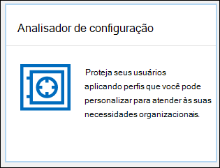

# Analisador de configuração para políticas de proteção no EOP e no Microsoft Defender para Office 365

[!INCLUDE [Microsoft 365 Defender rebranding](../includes/microsoft-defender-for-office.md)]

**Aplica-se a**
- [Proteção do Exchange Online](exchange-online-protection-overview.md)
- [Plano 1 e plano 2 do Microsoft Defender para Office 365](office-365-atp.md)
- [Microsoft 365 Defender](../mtp/microsoft-threat-protection.md)

O analisado & r de configuração no Centro de Conformidade e Segurança fornece um local central para localizar e corrigir políticas de segurança em que as configurações estão abaixo das configurações de perfil de proteção padrão e de proteção estrita em políticas de segurança predefinidas.

Os seguintes tipos de políticas são analisados pelo analisador de configuração:

- Políticas de Proteção do **Exchange Online (EOP)**: Isso inclui organizações do Microsoft 365 com caixas de correio do Exchange Online e organizações EOP autônomas sem caixas de correio do Exchange Online:

  - [Políticas anti-spam](configure-your-spam-filter-policies.md).
  - [Políticas anti-malware](configure-anti-malware-policies.md).
  - [Políticas anti-phishing do EOP](set-up-anti-phishing-policies.md#spoof-settings).

- **Políticas do Microsoft Defender para Office 365**: Isso inclui organizações com assinaturas de complemento do Microsoft 365 E5 ou do Defender para Office 365:

  - Políticas anti-phishing no Microsoft Defender para Office 365, que incluem:

    - As mesmas [configurações de spoof](set-up-anti-phishing-policies.md#spoof-settings) que estão disponíveis nas políticas anti-phishing do EOP.
    - [Configurações de representação](set-up-anti-phishing-policies.md#impersonation-settings-in-anti-phishing-policies-in-microsoft-defender-for-office-365)
    - [Limites avançados de phishing](set-up-anti-phishing-policies.md#advanced-phishing-thresholds-in-anti-phishing-policies-in-microsoft-defender-for-office-365)

  - [Políticas de Links Seguros](set-up-atp-safe-links-policies.md).

  - [Políticas de Anexos Seguros](set-up-atp-safe-attachments-policies.md).

Os valores  **de configuração** de política Padrão e Estrita usados como linhas de base são descritos em Configurações recomendadas para a segurança do EOP e do Microsoft Defender para [Office 365.](recommended-settings-for-eop-and-office365-atp.md)

## O que você precisa saber antes de começar?

- Abra o Centro de Conformidade e Segurança em <https://protection.office.com/>. Para ir diretamente para a página **analisador de** configuração, use <https://protection.office.com/configurationAnalyzer> .

- Para se conectar ao Windows PowerShell do Exchange Online, confira [Conectar ao Windows PowerShell do Exchange Online](/powershell/exchange/connect-to-exchange-online-powershell).

- Você precisa de permissões no Centro de Conformidade e Segurança antes de poder realizar os procedimentos neste artigo:
  - Para usar o **analisador** de configuração e fazer atualizações para  políticas de segurança, você precisa ser membro dos grupos de função Gerenciamento da Organização ou Administrador **de** Segurança.
  - Para acesso somente leitura ao analisador de configuração, você precisa ser membro dos grupos de função Leitor **Global** ou **Leitor de** Segurança.

  Para saber mais, confira [Permissões no Centro de Conformidade de Segurança](permissions-in-the-security-and-compliance-center.md).

  > [!NOTE]
  >  
  > - Adicionar usuários à função correspondente do Azure Active Directory no Centro de administração do Microsoft 365 fornece aos usuários as permissões necessárias no Centro de Segurança e Conformidade _e_ permissões para outros recursos no Microsoft 365. Para obter mais informações, confira o artigo [Sobre funções de administrador](../../admin/add-users/about-admin-roles.md).
  >
  > - O grupo de função **Gerenciamento de Organização Somente para Exibição** no [Exchange Online](/Exchange/permissions-exo/permissions-exo#role-groups) também fornece acesso somente leitura ao recurso.

## Use o analisador de configuração no Centro de Conformidade & Segurança

No Centro de Conformidade & segurança, vá **para** Analisador de Configuração de Política de Gerenciamento \>  \> **de Ameaças.**

O analisador de configuração tem duas guias principais:

- **Configurações e recomendações:** escolha Padrão ou Estrito e compare essas configurações às políticas de segurança existentes. Nos resultados, você pode ajustar os valores de suas configurações para trazê-los para o mesmo nível que Standard ou Strict.

- **Análise e histórico de desvios de** configuração : essa exibição permite controlar as alterações de política ao longo do tempo.

### Guia Configuração e recomendações no analisador de configuração

Por padrão, a guia é aberta na comparação com o perfil de proteção padrão. Você pode alternar para a comparação do perfil de proteção estrita clicando em **Exibir recomendações estritas.** Para alternar de volta, selecione **Exibir recomendações padrão**.

Por padrão, a coluna **Grupo de política/nome** de configuração contém um modo de exibição recolhido dos diferentes tipos de políticas de segurança e o número de configurações que precisam ser melhoradas (se alguma). Os tipos de políticas são:

- **Anti-spam**
- **Anti-phishing**
- **Anti-malware**
- **Anexos seguros atp** (se sua assinatura incluir o Microsoft Defender para Office 365)
- **Links seguros atp** (se sua assinatura incluir o Microsoft Defender para Office 365)

No modo de exibição padrão, tudo é recolhido. Ao lado de cada política, há um resumo dos resultados de comparação de suas políticas (que você pode modificar) e as configurações nas políticas correspondentes para os perfis de proteção Standard ou Strict (que você não pode modificar). Você verá as seguintes informações para o perfil de proteção ao que está comparando:

- **Verde**: Todas as configurações em todas as políticas existentes são pelo menos tão seguras quanto o perfil de proteção.
- **Âmbar**: um pequeno número de configurações nas políticas existentes não são tão seguras quanto o perfil de proteção.
- **Vermelho**: um número significativo de configurações nas políticas existentes não são tão seguras quanto o perfil de proteção. Isso pode ser algumas configurações em muitas políticas ou em muitas configurações em uma política.

Para comparações favoráveis, você verá o texto: **Todas as configurações seguem** as \<**Standard** or **Strict**\> **recomendações**. Caso contrário, você verá o número de configurações recomendadas a ser mudada.

Se você expandir o nome do grupo **de política/configuração**, todas as políticas e as configurações associadas em cada política específica que exigem atenção serão reveladas. Ou, você pode expandir um tipo específico de política (por exemplo, **Anti-spam**) para ver apenas essas configurações nesses tipos de políticas que exigem sua atenção.

Se a comparação não tiver recomendações de melhoria (verde), a expansão da política não revelará nada. Se houver qualquer número de recomendações de melhoria (vermelho ou vermelho), as configurações que exigem atenção serão reveladas e as informações correspondentes serão reveladas nas seguintes colunas:

- O nome da configuração que requer sua atenção. Por exemplo, na captura de tela anterior, é o limite de **email** em massa em uma política anti-spam.

- **Política**: o nome da política afetada que contém a configuração.

- **Aplicado a**: o número de usuários aos que as políticas afetadas são aplicadas.

- **Configuração atual**: O valor atual da configuração.

- **Última modificação:** a data em que a política foi modificada pela última vez.

- **Recomendações**: O valor da configuração no perfil de proteção Padrão ou Estrito. Para alterar o valor da configuração em sua política para corresponder ao valor recomendado no perfil de proteção, clique em **Adotar**. Se a alteração for bem-sucedida, você verá a mensagem: **Recomendações adotadas com êxito.** Clique **em** Atualizar para ver o número reduzido de recomendações e a remoção da linha de configuração/política específica dos resultados.

### Análise de deriva de configuração e guia histórico no analisador de configuração

Essa guia permite rastrear as alterações feitas em suas políticas de segurança personalizadas. Por padrão, as seguintes informações são exibidas:

- **Última modificação**
- **Modificado por**
- **Nome da configuração**
- **Política**
- **Tipo**

Para filtrar os resultados, clique em **Filtro**. No flyout **Filters** exibido, você pode selecionar entre os seguintes filtros:

- **Hora de início** **e hora de término** (data)
- **Proteção padrão** ou **proteção estrita**

Para exportar os resultados para um arquivo .csv, clique em **Exportar**.

