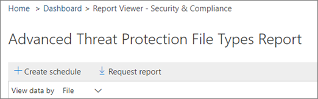

# Criar um cronograma para um relatório no centro de &amp; conformidade de segurançaCreate a schedule for a report in the Security &amp; Compliance Center

No centro de &amp; conformidade de segurança, vários [relatórios e informações](reports-and-insights-in-security-and-compliance.md) estão disponíveis para ajudar a equipe de segurança da sua organização a reduzir e resolver ameaças à sua organização.In the Security &amp; Compliance Center, several [reports and insights](reports-and-insights-in-security-and-compliance.md) are available to help your organization's security team mitigate and address threats to your organization. Se você é membro da equipe de segurança da sua organização, pode criar um cronograma para um relatório.If you're a member of your organization's security team, you can create a schedule for a report. O agendamento que você cria pode incluir um intervalo de datas personalizado para atender à sua organização.The schedule you create can include a custom date ranges to suit your organization. 
  
## Criar um cronograma de um relatórioCreate a schedule for a report

> [!IMPORTANT]
> Verifique se você tem as permissões necessárias para executar essa tarefa.Make sure that you have the necessary permissions to perform this task. Em geral, administradores globais, administradores de segurança e leitores de segurança podem acessar relatórios no centro &amp; de conformidade de segurança.In general, global administrators, security administrators, and security readers can access reports in the Security &amp; Compliance Center. Para saber mais sobre permissões, consulte [permissões no centro de &amp; conformidade de segurança](permissions-in-the-security-and-compliance-center.md).To learn more about permissions, see [Permissions in the Security &amp; Compliance Center](permissions-in-the-security-and-compliance-center.md).
  
1. No [centro de &amp; conformidade de segurança](https://protection.office.com), vá para **painel**de **relatórios** \> .In the [Security &amp; Compliance Center](https://protection.office.com), go to **Reports** \> **Dashboard**.
    
2. Escolha um dos seguintes relatórios:Choose one of the following reports: 

    - Correspondências de política DLPDLP policy matches
    - Regra de transporte do ExchangeExchange Transport Rule
    - Falsos positivos e substituições de DLPDLP false positives and overrides
    - Tipos de arquivo do Office 365 ATPOffice 365 ATP file types
    - Disposição de mensagens ATP do Office 365Office 365 ATP message disposition
    - Malware detectado no emailMalware detected in email
    - Principais malwareTop malware
    - Principais remetentes e destinatáriosTop senders and recipients
    - Detecções falsasSpoof detections
    - Detecções de spamSpam detections
    - Emails enviados e recebidosSent and received email
    - Incidentes de DLPDLP incidents
    - Relatório de criptografiaEncryption report

    Para este exemplo, escolheremos o relatório tipos de arquivo de proteção avançada contra ameaças.For this example, we'll choose the Advanced Threat Protection File Types report.
    
3. No canto superior esquerdo do relatório, escolha **+ criar agendamento**.In the upper left corner of the report, choose **+ Create schedule**. 
    
    

    > [!NOTE]
    > Nem todos os relatórios têm o botão **+ criar agenda** .Not all reports have the **+ Create schedule** button.
  
    A caixa de diálogo **criar agendamento** é aberta.The **Create schedule** dialog box opens. 
    
4. Mantenha as configurações padrão e escolha **criar agenda**ou escolha **Personalizar agendamento**.Keep the default settings and choose **Create schedule**, or choose **Customize schedule**.
    
    
  
    Se você optar por personalizar seu cronograma de relatório, poderá especificar a frequência do relatório, o endereço de email de um remetente e o endereço de email de um destinatário.If you choose to customize your report schedule, you can specify the report's frequency, a sender's email address, and a recipient's email address. 
    
Depois de criar um cronograma para um relatório, esse relatório será entregue automaticamente por email aos endereços de email dos destinatários.Once you have created a schedule for a report, that report will be delivered via email to recipients' email addresses automatically. 
  
## Tópicos relacionadosRelated topics

[Relatórios e insights no centro de &amp; conformidade de segurançaReports and insights in the Security &amp; Compliance Center](reports-and-insights-in-security-and-compliance.md)
  
[Gerenciar agendas para relatórios no centro &amp; de conformidade de segurançaManage schedules for reports in the Security &amp; Compliance Center](manage-schedules-for-multiple-reports.md)
  
[Baixar relatórios existentes no centro de &amp; conformidade de segurançaDownload existing reports in the Security &amp; Compliance Center](download-existing-reports.md)
  
[Baixar um relatório personalizado no centro de &amp; conformidade de segurançaDownload a custom report in the Security &amp; Compliance Center](set-up-and-download-a-custom-report.md)
  

