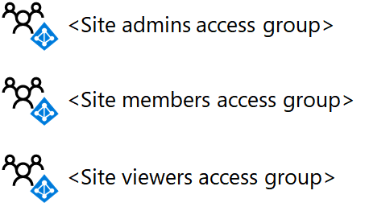

# <a name="deploy-an-isolated-sharepoint-online-team-site"></a>Implantar um site de equipe do SharePoint Online isolado

 **Resumo:** Implante um novo site de equipe do SharePoint Online isolado com as instruções passo a passo.
  
Este artigo é um guia de implantação passo a passo para criar e configurar um site de equipe do SharePoint Online isolado no Microsoft Office 365. Essas etapas pressupõem o uso dos três grupos padrão do SharePoint e níveis de permissão correspondentes, com um único grupo de acesso baseado em AD (Active Directory) do Azure para cada nível de acesso.
  
## <a name="phase-1-create-and-populate-the-team-site-access-groups"></a>Fase 1: criar e preencher os grupos de acesso ao site de equipe

Nesta fase, você cria os três grupos de acesso baseados no AD do Azure para os três grupos padrão do SharePoint e os preenche com as contas de usuário apropriadas.
  
> [!NOTE]
> As etapas a seguir pressupõem que todas as contas de usuário necessárias já existam e que recebem as licenças apropriadas. Caso contrário, adicione-os e atribua licenças antes de prosseguir para a etapa 1. 
  
### <a name="step-1-list-the-sharepoint-online-admins-for-the-site"></a>Etapa 1: listar os administradores do SharePoint Online para o site

Determine o conjunto de contas de usuário correspondentes aos administradores do SharePoint Online para o site de equipe isolado.
  
Se você estiver gerenciando contas de usuário e grupos pelo Microsoft 365 e quiser usar o Windows PowerShell, faça uma lista de seus nomes principais de usuário (UPNs) (exemplo de UPN: belindan@contoso.com).
  
### <a name="step-2-list-the-members-for-the-site"></a>Etapa 2: listar os membros do site

Determine o conjunto de contas de usuário correspondentes aos membros do site de equipe isolado, aqueles que serão colaborativos nos recursos armazenados no site.
  
Se você estiver gerenciando contas de usuário e grupos pelo Microsoft 365 e quiser usar o PowerShell, faça uma lista de seus UPNs. Se houver muitos membros do site, você poderá armazenar a lista de UPNs em um arquivo de texto e adicioná-los todos com um único comando do PowerShell.
  
### <a name="step-3-list-the-viewers-for-the-site"></a>Etapa 3: listar os visualizadores para o site

Determinar o conjunto de contas de usuário correspondentes aos visualizadores do site de equipe isolado, aqueles que podem exibir os recursos armazenados no site, mas não modificá-los ou colaborar diretamente em seu conteúdo.
  
Se você estiver gerenciando contas de usuário e grupos pelo Microsoft 365 e quiser usar o PowerShell, faça uma lista de seus UPNs. Se houver muitos membros do site, você poderá armazenar a lista de UPNs em um arquivo de texto e adicioná-los todos com um único comando do PowerShell.
  
Os visualizadores do site podem incluir gerência executiva, assessoria jurídica ou participantes entre departamentos.
  
### <a name="step-4-create-the-three-access-groups-for-the-site-in-azure-ad"></a>Etapa 4: criar os três grupos de acesso para o site no Azure AD

Você precisa criar os seguintes grupos de acesso no Azure AD:
  
- Administradores de site (que conterá a lista da etapa 1)
    
- Membros do site (que conterá a lista da etapa 2)
    
- Visualizadores de site (que conterá a lista da etapa 3)
    
1. No navegador, vá para o portal do Azure em [https://portal.azure.com](https://portal.azure.com) e entre com as credenciais de uma conta que tenha sido atribuída com o administrador de gerenciamento de usuário ou a função de administrador da empresa.
    
2. No Portal do Azure, clique em **Azure Active Directory > Grupos**.
    
3. Na folha **Grupos – Todos os grupos**, clique em **+ Novo grupo**.
    
4. Na folha **novo grupo** :
    
    - Selecione **Segurança** em **Tipo de grupo**.

    - Digite o nome do grupo em **nome**.

    - Digite uma descrição do grupo em **Descrição do grupo**.

    - Escolha **Atribuído** em **Tipo de Associação**.
    
5. Clique em **Criar** e, em seguida, feche a folha **Grupo**.
    
6. Repita as etapas 3-5 para seus grupos adicionais.
    
> [!NOTE]
> Você precisa usar o portal do Azure para criar os grupos de modo que eles tenham recursos do Office habilitados. Se um site isolado do SharePoint Online for configurado posteriormente como um site altamente confidencial com um rótulo de proteção de informações do Azure para criptografar arquivos e atribuir permissão a grupos específicos, os grupos permitidos deverão ter sido criados com recursos do Office habilitados. Você não pode alterar a configuração de recursos do Office de um grupo do Azure AD após ele ter sido criado. 
  
Aqui está a configuração resultante com os três grupos de acesso de site.
  

  
### <a name="step-5-add-the-user-accounts-to-the-access-groups"></a>Etapa 5. Adicionar as contas de usuário aos grupos de acesso

Nesta etapa, faça o seguinte:
  
1. Adicionar a lista de usuários da etapa 1 ao grupo de acesso de administradores de site
    
2. Adicionar a lista de usuários da etapa 2 ao grupo de acesso de membros do site
    
3. Adicionar a lista de usuários da etapa 3 ao grupo de acesso de visualizadores de sites
    
Se você estiver gerenciando contas de usuário e grupos por meio de serviços de domínio do Active Directory (AD DS), adicione usuários aos grupos de acesso apropriados usando seus procedimentos normais de gerenciamento de usuários e grupos do AD DS e aguarde a sincronização com sua assinatura do Microsoft 365.
  
Se você estiver gerenciando contas de usuário e grupos através do Office 365, poderá usar o centro de administração do Microsoft 365 ou o PowerShell. Se você tiver nomes de grupo duplicados para qualquer um dos grupos de acesso, deverá usar o centro de administração do Microsoft 365.
  
Para o centro de administração do Microsoft 365, entre com uma conta de usuário que tenha atribuído a função Administrador de conta de usuário ou administrador da empresa e use grupos para adicionar as contas de usuário e grupos apropriados aos grupos de acesso apropriados.
  
Para o PowerShell, primeiro [Conecte-se ao módulo do PowerShell do Azure Active Directory para Graph](https://docs.microsoft.com/office365/enterprise/powershell/connect-to-office-365-powershell#connect-with-the-azure-active-directory-powershell-for-graph-module).
  
Em seguida, use o seguinte bloco de comando para adicionar uma conta de usuário individual a um grupo de acesso:
  
```powershell
$userUPN="<UPN of the user account>"
$grpName="<display name of the access group>"
Add-AzureADGroupMember -RefObjectId (Get-AzureADUser | Where { $_.UserPrincipalName -eq $userUPN }).ObjectID -ObjectId (Get-AzureADGroup | Where { $_.DisplayName -eq $grpName }).ObjectID
```
Se você armazenou os UPNs de contas de usuário para qualquer um dos grupos de acesso em um arquivo de texto, você pode usar o seguinte bloco de comando do PowerShell para adicionar todos ao mesmo tempo:
  
```powershell
$grpName="<display name of the access group>"
$fileName="<path and name of the file containing the list of account UPNs>"
$grpID=(Get-AzureADGroup | Where { $_.DisplayName -eq $grpName }).ObjectID
Get-Content $fileName | ForEach { $userUPN=$_; Add-AzureADGroupMember -RefObjectId (Get-AzureADUser | Where { $_.UserPrincipalName -eq $userUPN }).ObjectID -ObjectID $grpID }
```

Para o PowerShell, use o seguinte bloco de comando para adicionar um grupo individual a um grupo de acesso:
  
```powershell
$nestedGrpName="<display name of the group to add to the access group>"
$grpName="<display name of the access group>"
Add-AzureADGroupMember -RefObjectId (Get-AzureADGroup | Where { $_.DisplayName -eq $nestedGrpName }).ObjectID -ObjectID (Get-AzureADGroup | Where { $_.DisplayName -eq $grpName }).ObjectID

```

Os resultados devem ser os seguintes:
  
- O grupo Administradores do site do Azure AD contém as contas de usuário ou grupos de administrador do site
    
- O grupo membros do site do Azure AD contém as contas de usuário ou grupos do site membro
    
- O grupo Visualizador do site do Azure AD contém as contas de usuário ou grupos que só podem exibir o conteúdo do site
    
Valide a lista de membros do grupo para cada grupo de acesso com o centro de administração do Microsoft 365 ou com o seguinte bloco de comando do PowerShell:
  
```powershell
$grpName="<display name of the access group>"
Get-AzureADGroupMember -ObjectId (Get-AzureADGroup | Where { $_.DisplayName -eq $grpName }).ObjectID | Sort UserPrincipalName | Select UserPrincipalName,DisplayName,UserType
```

Aqui está a configuração resultante com os três grupos de acesso de site preenchidos com contas de usuário ou grupos.
  

  
## <a name="phase-2-create-and-configure-the-isolated-team-site"></a>Fase 2: criar e configurar o site de equipe isolado

Nesta fase, você cria o site do SharePoint Online isolado e configura as permissões para os níveis de permissão padrão do SharePoint Online para usar seus novos grupos de acesso baseados no Azure AD. Por padrão, os novos sites de equipe incluem um grupo do Microsoft 365 e outros recursos relacionados, mas neste caso, criaremos um site de equipe sem um grupo do Microsoft 365. Isso permite manter as permissões completamente no SharePoint.
  
Primeiro, crie o site de equipe do SharePoint Online com estas etapas.
  
1. Entre no centro de administração do Microsoft 365 com uma conta que também será usada para administrar o site de equipe do SharePoint Online (um administrador do SharePoint Online). Para obter ajuda, consulte [Onde entrar no Office 365](https://support.microsoft.com/office/e9eb7d51-5430-4929-91ab-6157c5a050b4).

2. No centro de administração do Microsoft 365, em **centros de administração**, clique em **SharePoint**.

3. No centro de administração do SharePoint, expanda **sites** e clique em **sites ativos**.

4. Clique em **criar**e, em seguida, escolha **outras opções**.

5. Na lista **escolher um modelo** , escolha **site de equipe**.
   
6. Em **nome do site**, digite um nome para o site de equipe. 
    
7. Em **administrador principal**, digite a conta com a qual você está conectado.
 
8. Clique em **Concluir**.
    
Em seguida, no novo site de equipe do SharePoint Online, configure as permissões.
  
1. Na barra de ferramentas, clique no ícone Configurações e, em seguida, clique em **Permissões do site**.

2. Em **compartilhamento de sites**, clique em **alterar como os membros podem compartilhar**.

3. Escolha os **únicos proprietários de site que podem compartilhar arquivos, pastas e o site**.

4. Defina **Permitir solicitações de acesso** para **desativado**.

5. Clique em **Salvar**.
    
6. No painel **permissões** , clique em **configurações de permissões avançadas**.
    
7. Na guia **permissões** do navegador, clique em ** \<site name> Membros** na lista.
    
8. Em **Pessoas e Grupos**, clique em **Novo**.
    
9. Na caixa de diálogo **compartilhar** , digite o nome do grupo de acesso de membros do site, selecione-o e clique em **compartilhar**.
    
10. Clique no botão Voltar de seu navegador.
    
11. Clique em ** \<site name> proprietários** na lista.
    
12. Em **Pessoas e Grupos**, clique em **Novo**.
    
13. Na caixa de diálogo **compartilhar** , digite o nome do grupo de acesso de administradores de site, selecione-o e clique em **compartilhar**.
    
14. Clique no botão Voltar de seu navegador.
    
15. Clique em ** \<site name> visitantes** na lista.
    
16. Em **Pessoas e Grupos**, clique em **Novo**.
    
17. Na caixa de diálogo **compartilhar** , digite o nome do grupo de acesso visualizadores de sites, selecione-o e clique em **compartilhar**.
    
18. Feche a guia **Permissões** do navegador.
    
Os resultados dessas configurações de permissão são:
  
- O grupo ** \<site name> proprietários** do SharePoint contém o grupo de acesso de administradores de site, em que todos os membros têm o nível de permissão **controle total** .
    
- O grupo ** \<site name> Membros** do SharePoint contém o grupo de acesso de membros do site, em que todos os membros têm o nível de permissão **Editar** .
    
- O grupo ** \<site name> visitantes** do SharePoint contém o grupo de acesso visualizadores de sites, em que todos os membros têm o nível de permissão de **leitura** .
    
- A capacidade de os membros de convidar outros membros ou de não membros solicitarem o acesso está desabilitada.
    
Aqui está a configuração resultante com os três grupos do SharePoint para o site configurado para usar os três grupos de acesso, que são preenchidos com contas de usuário ou grupos do Azure AD.
  

  
Você e os membros do site, por meio da Associação de grupo em um dos grupos de acesso, agora podem colaborar usando os recursos do site.
  
## <a name="next-step"></a>Próxima etapa

Quando você precisar alterar a associação de grupo de acesso ao site ou criar uma pasta de documentos com permissões personalizadas, consulte [gerenciar um site de equipe isolado do SharePoint Online](manage-an-isolated-sharepoint-online-team-site.md).
  
## <a name="see-also"></a>Confira também

[Sites de equipe do SharePoint Online isolados](isolated-sharepoint-online-team-sites.md)
  
[Projetar um site de equipe do SharePoint Online isolado](design-an-isolated-sharepoint-online-team-site.md)
  
[Gerenciar um site de equipe do SharePoint Online isolado](manage-an-isolated-sharepoint-online-team-site.md)
  


