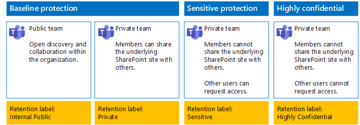
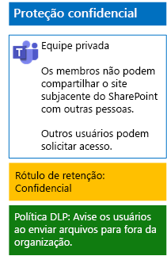
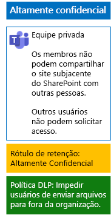

# Proteger arquivos em equipes com rótulos de retenção e DLPProtect files in teams with retention labels and DLP

 
Use as etapas neste artigo para projetar e implantar rótulos de retenção e DLP (prevenção contra perda de dados) em equipes de linha de base, confidenciais e altamente confidenciais e seus sites subjacentes do SharePoint.Use the steps in this article to design and deploy retention labels and data loss prevention (DLP) policies for baseline, sensitive, and highly confidential teams and their underlying SharePoint sites. Para obter mais informações sobre essas três camadas de proteção, confira [Proteção de arquivos no Microsoft Teams](secure-files-in-teams.md).For more information about these three tiers of protection, see [Secure files in Microsoft Teams](secure-files-in-teams.md).
  
## Como isso funcionaHow this works

1. Crie e publique as etiquetas de retenção desejadas.Create the desired retention labels and publish these. Pode levar até 12 horas para que elas sejam publicadas.It can take up to 12 hours for these to be published.
2. Para os sites subjacentes do SharePoint desejados, edite as configurações da biblioteca de documentos para aplicar os rótulos de retenção desejados a itens na biblioteca.For the desired underlying SharePoint sites, edit the document library settings to apply the desired retention labels to items in the library.
3. Crie políticas DLP para executar ações com base nos rótulos de retenção.Create DLP policies to take action based on the retention labels.

Quando os usuários adicionarem um documento à biblioteca de sites subjacentes do SharePoint da equipe, o documento receberá o rótulo de retenção atribuído por padrão.When users add a document to the underlying SharePoint site library for the team, the document will receive the assigned retention label by default. Os usuários podem alterar o rótulo, se necessário.Users can change the label, if needed. Quando um usuário compartilha um documento para fora da organização, a DLP verificará se há um rótulo atribuído e agirá se houver uma política DLP que corresponda ao rótulo.When a user shares a document outside the organization, DLP will check to see if a label is assigned and take action if a DLP policy matches the label. A DLP também procurará outras políticas que correspondam, como proteger arquivos com números de cartão de crédito, caso este tipo de política estiver configurado.DLP will look for other policy matches as well, such as protecting files with credit card numbers if this type of policy is configured. 

## Rótulos de retenção para sites subjacentes do SharePointRetention labels for your underlying SharePoint sites

Há três fases para criar e atribuir rótulos de retenção a sites subjacentes do SharePoint.There are three phases to creating and then assigning retention labels to underlying SharePoint sites.
  
### Etapa 1: determinar os nomes dos rótulos de retençãoStep 1: Determine the retention label names

Nessa fase, você determina os nomes dos rótulos de retenção para os quatro níveis de proteção de informações aplicados a sites subjacentes do SharePoint.In this phase, you determine the names of your retention labels for the four levels of information protection applied to underlying SharePoint sites. A tabela a seguir lista os nomes recomendados para cada nível.The following table lists the recommended names for each level.
  
|**nível de proteção de sites subjacentes do SharePoint****underlying SharePoint sites protection level**|**Nome do rótulo****Label name**|
|:-----|:-----|
|Linha de base públicoBaseline-Public    |Público internoInternal public    |
|Linha de base privadoBaseline-Private    |PrivatePrivate    |
|ConfidencialSensitive    |ConfidencialSensitive    |
|Altamente ConfidencialHighly Confidential    |Altamente ConfidencialHighly Confidential    |
   
### Fase 2: criar os rótulos de retençãoStep 2: Create the retention labels

Nesta fase, você cria e publica seus rótulos determinados para os diferentes níveis de proteção de informações.In this phase, you create and then publish your determined labels for the different levels of information protection.
  
1. Entre no [portal de conformidade do Microsoft 365](https://compliance.microsoft.com) com uma conta que tenha a função de Administrador de Segurança ou Administrador da Empresa.Sign in to the [Microsoft 365 compliance portal](https://compliance.microsoft.com) with an account that has the Security Administrator or Company Administrator role.
    
2. Na guia **Início - Conformidade do Microsoft 365** do navegador, clique em **Classificações > Rótulos**.From the **Home - Microsoft 365 compliance** tab of your browser, click **Classifications > Labels**.
    
3. Clique em **Rótulos de retenção > Criar um rótulo**.Click **Retention labels > Create a label**.
    
4. No painel **Atribuir nome ao seu rótulo**, digite o nome do rótulo e uma descrição para administradores e usuários e, em seguida, clique em **Avançar**.On the **Name your label** pane, type the name of the label and a description for admins and users, and then click **Next**.

5. No painel **Descritores do planejamento de arquivo**, preencha conforme necessário e clique em **Avançar**.On the **File plan descriptors** pane, fill in as needed, and then click **Next**.
    
6. No painel **Configurações de rótulo**, se necessário, defina **Retenção** como **Ligado** e faça as configurações de retenção.On the **Label settings** pane, if needed, set **Retention** to **On** and configure retention settings. Clique em **Avançar**.Click **Next**.
    
7. No painel **Revise suas configurações**, clique em **Criar o rótulo**.On the **Review your settings** pane, click **Create the label**.
    
8. Para obter mais rótulos, clique em **Criar um rótulo** e repita as etapas 3-7 deste procedimento conforme necessário.For your additional labels, click **Create a label**, and then repeat steps 3-7 in this procedure as needed.
    

### Publique seus novos rótulosPublish your new labels

Em seguida, use estas etapas para publicar os novos rótulos de retenção.Next, use these steps to publish the new retention labels.
  
1. No painel **Rótulos**, clique na guia **Rótulos de retenção** e, em seguida, clique em **Publicar rótulos**.From the **Labels** pane, click the **Retention labels** tab, and then click **Publish labels**.
    
2. No painel **Escolher rótulos para publicar**, clique em **Escolher rótulos para publicar**.On the **Choose labels to publish** pane, click **Choose labels to publish**.
    
3. No painel **Escolher rótulos**, clique em **Adicionar**, selecione todos os quatro rótulos, clique em **Adicionar**.On the **Choose labels** pane, click **Add**, select all four labels, click **Add**.
    
4. Clique em **Concluído**.Click **Done**.
    
5. No painel **Escolher rótulos para publicar**, clique em **Avançar**.On the **Choose labels to publish** pane, click **Next**.
    
6. No painel **Escolher locais**, clique em **Avançar**.On the **Choose locations** pane, click **Next**.
    
7. No painel **Atribuir um nome à política**, digite um nome para o conjunto de rótulos em **Nome** e clique em **Avançar**.On the **Name your policy** pane, type a name for your set of labels in **Name**, and then click **Next**.
    
8. No painel **Examine as configurações**, clique em **Publicar rótulos** e clique em **Fechar**.On the **Review your settings** pane, click **Publish labels**, and then click **Close**.

    
### Etapa 3: aplicar os rótulos de retenção a sites subjacentes do SharePointStep 3: Apply the retention labels to your underlying SharePoint sites

Use estas etapas para aplicar os rótulos de retenção às pastas de documentos dos sites subjacentes do SharePoint.Use these steps to apply the retention labels to the documents folders of your underlying SharePoint sites.
  
1.  Na equipe, clique em **Arquivos** e em **Abrir no SharePoint**.From the team, click **Files**, and then click **Open in SharePoint**.

2. Na nova guia de site do SharePoint do navegador, clique em **Documentos**.In the new SharePoint site tab of your browser, click **Documents**.
    
3. Clique no ícone de configurações e clique em **Configurações de biblioteca**.Click the settings icon, and then click **Library settings**.
    
4. Em **Permissões e Gerenciamento**, clique em **Aplicar o rótulo aos itens nessa biblioteca**.Under **Permissions and Management**, click **Apply label to items in this library**.
    
5. Em **Configurações – Aplicar Rótulo**, selecione o rótulo de retenção adequado e clique em **Salvar**.In **Settings-Apply Label**, select the appropriate retention label, and then click **Save**.
    
6. Feche a guia do site do SharePoint.Close the tab for the SharePoint site.
    
7. Repita as etapas 1-6 para atribuir rótulos de retenção a sites subjacentes do SharePoint adicionais.Repeat steps 1-6 to assign retention labels to your additional underlying SharePoint sites.
    
Esta é a configuração resultante.Here is your resulting configuration.
  

  
## Políticas DLP para os sites subjacentes do SharePointDLP policies for your underlying SharePoint sites

Use estas etapas para configurar uma política DLP que notifique os usuários quando eles compartilharem um documento em um site subjacente do SharePoint fora da organização.Use these steps to configure a DLP policy that notifies users when they share a document on an underlying SharePoint site outside the organization.

1. Entre no [portal de conformidade do Microsoft 365](https://compliance.microsoft.com/) com uma conta que tenha a função de Administrador de Segurança ou Administrador da Empresa.Sign in to the [Microsoft 365 compliance portal](https://compliance.microsoft.com/) with an account that has the Security Administrator or Company Administrator role.
    
2. Na nova guia **conformidade do Microsoft 365** em seu navegador, clique em**Políticas > Prevenção de perda de dados**.On the new **Microsoft 365 compliance** tab in your browser, click **Policies > Data loss prevention**.
    
3. No painel **Início > Prevenção de perda de dados**, clique em **Criar uma política**.In the **Home > Data loss prevention** pane, click **Create a policy**.
    
4. No painel **Iniciar com um modelo ou criar uma política personalizada**, clique em **Personalizado** e, em seguida, clique em **Avançar**.In the **Start with a template or create a custom policy** pane, click **Custom**, and then click **Next**.
    
5. No painel **Atribuir um nome à política**, digite o nome da política DLP de nível confidencial em **Nome** e clique em **Avançar**.In the **Name your policy** pane, type the name for the sensitive level DLP policy in **Name**, and then click **Next**.
    
6. No painel **Escolher locais**, clique em **Deixe-me escolher locais específicos** e, em seguida, clique em **Avançar**.In the **Choose locations** pane, click **Let me choose specific locations**, and then click **Next**.
    
7. Na lista de locais, desabilite os locais **email do Exchange**, **contas do OneDrive** e **Mensagens do canal e do chat do Teams** e, em seguida, clique em **Avançar**.In the list of locations, disable the **Exchange email**, **OneDrive accounts**, and **Teams chat and channel messages** locations, and then click **Next**.
    
8. No painel **Personalizar o tipo de conteúdo que você deseja proteger**, clique em **Editar**.In the **Customize the type of content you want to protect** pane, click **Edit**.
    
9. No painel **Escolher os tipos de conteúdo para proteger**, clique em **Adicionar** na caixa suspensa e, em seguida, clique em **Rótulos de retenção**.In the **Choose the types of content to protect** pane, click **Add** in the drop-down box, and then click **Retention labels**.
    
10. No painel **Rótulos de retenção**, clique em \*\* Adicionar\*\*, selecione o rótulo **Confidencial**, clique em **Adicionar** e, em seguida, clique em **Concluído**.In the **Retention labels** pane, click **Add**, select the **Sensitive** label, click **Add**, and then click **Done**.
    
11. No painel **Escolher os tipos de conteúdo para proteger**, clique em **Salvar**.In the **Choose the types of content to protect** pane, click **Save**.
    
12. No painel **personalizar um tipo de conteúdo que deseja proteger**, clique em **próxima**.In the **Customize the type of content you want to protect** pane, click **Next**.

13. No painel **O que deseja fazer se detectarmos informações confidenciais?**, clique em **Personalizar a dica e o email**.In the **What do you want to do if we detect sensitive info?** pane, click **Customize the tip and email**.
    
14. No painel **Personalizar dicas de política e notificações de email**, clique em **Personalizar o texto da dica da política**.In the **Customize policy tips and email notifications** pane, click **Customize the policy tip text**.
    
15. Na caixa de texto, digite ou cole uma das seguintes dicas:In the text box, type or paste in one of the following tips:
    
  - Para compartilhar com um usuário de fora da organização, baixe o arquivo e abra-o. Clique em Arquivo, em seguida, Proteger Documento e Criptografar com Senha e especifique uma senha forte. Envie a senha em um email separado ou outros meios de comunicação.To share with a user outside the organization, download the file and then open it. Click File, then Protect Document, and then Encrypt with Password, and then specify a strong password. Send the password in a separate email or other means of communication.
  - Arquivos altamente confidenciais são protegidos com criptografia. Somente usuários externos que recebam permissões do seu departamento de TI para esses arquivos poderão lê-los.Highly confidential files are protected with encryption. Only external users who are granted permissions to these files by your IT department can read them.
    
    Como alternativa, digite ou cole em sua própria dica de política que instrui os usuários sobre como compartilhar um arquivo fora da organização.Alternately, type or paste in your own policy tip that instructs users on how to share a file outside your organization.
    
16. Clique em **OK**.Click **OK**.
    
17. No painel **O que deseja fazer se detectarmos informações confidenciais?**, clique em **Avançar**.In the **What do you want to do if we detect sensitive info?** pane, click **Next**.
    
18. No painel **Deseja ativar a política ou testar primeiro?**, clique em **Sim** para ativá-la imediatamente e clique em **Avançar**.In the **Do you want to turn on the policy or test things out first?** pane, click **Yes, turn it on right away**, and then click **Next**.
    
19. No painel **Examine as configurações**, clique em **Criar** e em **Fechar**.In the **Review your settings** pane, click **Create**, and then click **Close**.
    
Estas são as configurações resultantes para equipes confidenciais.Here is your resulting configuration for sensitive teams.
  

  
Depois, siga estas etapas para configurar uma política DLP que impeça os usuários de compartilhar um documento em um site subjacente do SharePoint fora da organização.Next, use these steps to configure a DLP policy that blocks users when they share a document on an underlying SharePoint site outside the organization.
  
1. Na nova guia **conformidade do Microsoft 365** em seu navegador, clique em**Políticas > Prevenção de perda de dados**.On the new **Microsoft 365 compliance** tab in your browser, click **Policies > Data loss prevention**.
    
2. No painel **Prevenção de perda de dados**, clique em **Criar uma política**.In the **Data loss prevention** pane, click **Create a policy**.
    
3. No painel **Iniciar com um modelo ou criar uma política personalizada**, clique em **Personalizado** e clique em **Avançar**.In the **Start with a template or create a custom policy** pane, click **Custom**, and then click **Next**.
    
4. No painel **Atribuir um nome à política**, digite o nome da política DLP de nível altamente confidencial em **Nome** e clique em **Avançar**.In the **Name your policy** pane, type the name for the highly sensitive level DLP policy in **Name**, and then click **Next**.
    
5. No painel **Escolher locais**, clique em **Deixe-me escolher locais específicos** e, em seguida, clique em **Avançar**.In the **Choose locations** pane, click **Let me choose specific locations**, and then click **Next**.
    
6. Na lista de locais, desabilite os locais **email do Exchange**, **contas do OneDrive** e **Mensagens do canal e do chat do Teams** e, em seguida, clique em **Avançar**.In the list of locations, disable the **Exchange email**, **OneDrive accounts**, and **Teams chat and channel messages** locations, and then click **Next**.
    
7. No painel **Personalizar os tipos de informações confidenciais que deseja proteger**, clique em **Editar**.In the **Customize the types of sensitive info you want to protect** pane, click **Edit**.
    
8. No painel **Escolher os tipos de conteúdo para proteger**, clique em **Adicionar** na caixa suspensa e, em seguida, clique em **Rótulos de retenção**.In the **Choose the types of content to protect** pane, click **Add** in the drop-down box, and then click **Retention labels**.
    
9. No painel **Rótulos de retenção**, clique em **Adicionar**, selecione o rótulo **Altamente Confidencial**, clique em **Adicionar** e, em seguida, clique em **Concluído**.In the **Retention labels** pane, click **Add**, select the **Highly Confidential** label, click **Add**, and then click **Done**.
    
10. No painel **Escolher os tipos de conteúdo para proteger**, clique em **Salvar**.In the **Choose the types of content to protect** pane, click **Save**.
    
12. No painel **Personalizar os tipos de informações confidenciais que deseja proteger** e clique em **Avançar**.In the **Customize the types of sensitive info you want to protect** pane, click **Next**.
    
13. No painel **O que deseja fazer se detectarmos informações confidenciais?**, clique em **Personalizar a dica e o email**.In the **What do you want to do if we detect sensitive info?** pane, click **Customize the tip and email**.
    
14. No painel **Personalizar dicas de política e notificações de email**, clique em **Personalizar o texto da dica da política**.In the **Customize policy tips and email notifications** pane, click **Customize the policy tip text**.
    
15. Na caixa de texto, digite ou cole o seguinte:In the text box, type or paste in the following:
    
  - Para compartilhar com um usuário de fora da organização, baixe o arquivo e abra-o. Clique em Arquivo, em seguida, Proteger Documento e Criptografar com Senha e especifique uma senha forte. Envie a senha em um email separado ou outros meios de comunicação.To share with a user outside the organization, download the file and then open it. Click File, then Protect Document, and then Encrypt with Password, and then specify a strong password. Send the password in a separate email or other means of communication.
    
    Como alternativa, digite ou cole em sua própria dica de política que instrui os usuários sobre como compartilhar um arquivo fora da organização.Alternately, type or paste in your own policy tip that instructs users on how to share a file outside your organization.
    
16. Clique em **OK**.Click **OK**.
    
17. Na caixa **O que você deseja fazer se detectarmos informações confidenciais?**, em **Detectar quando uma quantidade específica de informações confidenciais está sendo compartilhada ao mesmo tempo**, clique em **Restringir acesso ou criptografar o conteúdo** e, em seguida, clique em **Avançar**.In the **What do you want to do if we detect sensitive info?** pane, under **Detect when a specific amount of sensitive info is being shared at one time**, click **Restrict access or encrypt the content**, and then click **Next**.
    
18. No painel **Deseja ativar a política ou testar primeiro?**, clique em **Sim** para ativá-la imediatamente e clique em **Avançar**.In the **Do you want to turn on the policy or test things out first?** pane, click **Yes, turn it on right away**, and then click **Next**.
    
19. No painel **Examine as configurações**, clique em **Criar** e em **Fechar**.In the **Review your settings** pane, click **Create**, and then click **Close**.
    
Esta é a configuração resultante para a equipe de alta confidencialidade.Here is your resulting configuration for high confidentiality team.
  

  
## Próxima etapaNext step

[Proteger arquivos em equipes com rótulos de confidencialidadeProtect files in teams with sensitivity labels](deploy-teams-sensitivity-labels.md)
    
## Confira tambémSee Also

[Proteger arquivos no Microsoft TeamsSecure files in Microsoft Teams](secure-files-in-teams.md)
  
[Adoção da nuvem e de soluções híbridasCloud adoption and hybrid solutions](https://docs.microsoft.com/office365/enterprise/cloud-adoption-and-hybrid-solutions)

