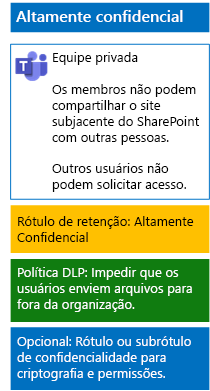

# Proteger arquivos em equipes com rótulos de confidencialidade

Ao contrário de um rótulo de confidencialidade para dados altamente regulamentados que qualquer pessoa pode aplicar a qualquer arquivo, uma equipe altamente segura precisa de seu próprio rótulo ou sub-rótulo para que os arquivos atribuídos:

- Sejam individualmente criptografados.
- Contenham permissões personalizadas para que somente membros da equipe possam abri-lo.

Para obter esse nível de segurança adicional para arquivos armazenados no site subjacente do SharePoint de uma equipe, configure um rótulo de confidencialidade personalizado que seja seu próprio rótulo ou um sub-rótulo do rótulo geral para dados altamente regulamentados. Somente os membros da equipe verão o rótulo ou o sub-rótulo personalizado na lista de rótulos.

Use um rótulo de confidencialidade quando precisar de um pequeno número de rótulos para uso global e equipes privadas individuais. 

Use um sub-rótulo de confidencialidade quando houver um grande número de rótulos ou quiser organizar rótulos paras equipes altamente confidenciais sob o rótulo altamente regulamentado.

Use [estas instruções](https://docs.microsoft.com/microsoft-365/compliance/encryption-sensitivity-labels) para configurar um rótulo separado ou um sub-rótulo com as seguintes configurações:

- O nome do rótulo ou do sub-rótulo contém o nome da equipe
- A criptografia está ativada
- O grupo do Office 365 para a equipe tem permissões de coautoria

Depois de criar, publique o novo rótulo ou sub-rótulo para seus usuários, que poderão, aplicá-los a arquivos localmente antes de carregá-los para a equipe ou, posteriormente, quando o arquivo estiver armazenado na equipe.

Esta é a configuração da equipe altamente confidencial que usa rótulos de confidencialidade para criptografia e permissões de arquivos.

## Confira também

[Proteger arquivos no Microsoft Teams](secure-files-in-teams.md)
  
[Adoção da nuvem e de soluções híbridas](https://docs.microsoft.com/office365/enterprise/cloud-adoption-and-hybrid-solutions)
