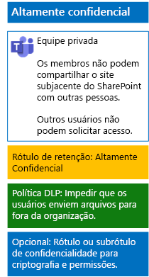

# Proteger arquivos em equipes com rótulos de confidencialidadeProtect files in teams with sensitivity labels

Ao contrário de um rótulo de confidencialidade para dados altamente regulamentados que qualquer pessoa pode aplicar a qualquer arquivo, uma equipe altamente segura precisa de seu próprio rótulo ou sub-rótulo para que os arquivos atribuídos:Unlike a sensitivity label for highly regulated data that anyone can apply to any file, a secure team needs its own label or sublabel so that assigned files:

- Sejam individualmente criptografados.Are individually encrypted.
- Contenham permissões personalizadas para que somente membros da equipe possam abri-lo.Contain custom permissions so that only members of the Team Group can open it.

Para obter esse nível de segurança adicional para arquivos armazenados no site subjacente do SharePoint de uma equipe, configure um rótulo de confidencialidade personalizado que seja seu próprio rótulo ou um sub-rótulo do rótulo geral para dados altamente regulamentados.To accomplish this additional level of security for files stored in the Team Site, you must configure a new sensitivity label that is either its own label a sublabel of the general label for highly regulated files. Somente os membros da equipe verão o rótulo ou o sub-rótulo personalizado na lista de rótulos.Only team members will see the customized label or sublabel in their list of labels.

Use um rótulo de confidencialidade quando precisar de um pequeno número de rótulos para uso global e equipes privadas individuais.Use a sensitivity label when you need a small number of labels for both global use and individual private teams. 

Use um sub-rótulo de confidencialidade quando houver um grande número de rótulos ou quiser organizar rótulos paras equipes altamente confidenciais sob o rótulo altamente regulamentado.Use a sensitivity sublabel when you have a large number of labels or want to organize labels for private teams under the highly regulated label.

Use [estas instruções](https://docs.microsoft.com/microsoft-365/compliance/encryption-sensitivity-labels) para configurar um rótulo separado ou um sub-rótulo com as seguintes configurações:[Use these instructions](https://docs.microsoft.com/microsoft-365/compliance/encryption-sensitivity-labels) to configure a separate label or a sublabel with the following settings:

- O nome do rótulo ou do sub-rótulo contém o nome da equipeThe name of the label contains the name of the team
- A criptografia está ativadaEncryption is enabled
- O grupo do Office 365 para a equipe tem permissões de coautoriaThe Office 365 group for the team has Co-Author permissions

Depois de criar, publique o novo rótulo ou sub-rótulo para seus usuários, que poderão, aplicá-los a arquivos localmente antes de carregá-los para a equipe ou, posteriormente, quando o arquivo estiver armazenado na equipe.After creating, publish the new label or sublabel for your users, who can then apply them to files either locally before uploading them to the team or later once the file is stored in the team.

Esta é a configuração da equipe altamente confidencial que usa rótulos de confidencialidade para criptografia e permissões de arquivos.Here is the configuration of the highly confidential team that uses sensitivity labels for file encryption and permissions.

## Confira tambémSee Also

[Proteger arquivos no Microsoft TeamsSecure files in Microsoft Teams](secure-files-in-teams.md)
  
[Adoção da nuvem e de soluções híbridasCloud adoption and hybrid solutions](https://docs.microsoft.com/office365/enterprise/cloud-adoption-and-hybrid-solutions)
