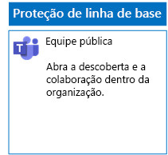
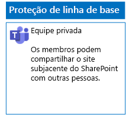
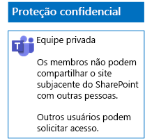
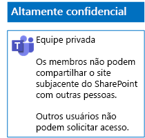

# Implantar equipes para três camadas de proteção para arquivosDeploy teams for three tiers of protection for files

Use as etapas neste artigo para projetar e implantar equipes de linha de base, confidenciais e altamente confidenciais.Use the steps in this article to design and deploy baseline, sensitive, and highly confidential teams. Para obter mais informações sobre essas três camadas de proteção, confira [Proteção de arquivos no Microsoft Teams](secure-files-in-teams.md).For more information about these three tiers of protection, see [Secure files in Microsoft Teams](secure-files-in-teams.md).

## Equipes de linha de baseBaseline teams

A proteção de linha de base inclui as equipes públicas e privadas.Baseline protection includes both public and private teams. As equipes públicas podem ser descobertas e acessadas por qualquer pessoa na organização.Public teams can be discovered and accessed by anybody in the organization. Os sites privados podem ser descobertos e acessados somente por membros do grupo do Office 365 associado à equipe.Private sites can only be discovered and accessed by members of the Office 365 group associated with the team. Ambos os tipos de equipes permitem aos membros compartilhar o site com outras pessoas.Both of these types of teams allow members to share the site with others.

### PúblicoPublic

Siga as instruções [neste artigo](https://support.office.com/article/174adf5f-846b-4780-b765-de1a0a737e2b) para criar uma equipe de base com acesso e permissões públicas.Follow the instructions in [this article](https://support.office.com/article/174adf5f-846b-4780-b765-de1a0a737e2b) to create a baseline Team with public access and permissions.

Esta é a configuração resultante.Here is your resulting configuration.

### PrivadoPrivate

Siga as instruções [neste artigo](https://support.office.com/article/174adf5f-846b-4780-b765-de1a0a737e2b) para criar uma equipe de base com acesso e permissões privadas.Follow the instructions in [this article](https://support.office.com/article/174adf5f-846b-4780-b765-de1a0a737e2b) to create a baseline Team with private access and permissions.

Esta é a configuração resultante.Here is your resulting configuration.

## Dados confidenciaisSensitive teams

Para uma equipe confidencial, comece [criando uma equipe privada](https://support.office.com/article/174adf5f-846b-4780-b765-de1a0a737e2b).For a sensitive team, you start by [creating a private team](https://support.office.com/article/174adf5f-846b-4780-b765-de1a0a737e2b).

Em seguida, configure o site subjacente do SharePoint para evitar o compartilhamento por membros da equipe.Next, you configure the underlying SharePoint site to prevent sharing by team members.

1. Na barra de ferramentas da equipe, clique em **Arquivos**.In the tool bar for the team, click **Files**.

2. Clique nas reticências e em **Abrir no SharePoint**.Click the ellipsis, and then click **Open in SharePoint**.

3. Na barra de ferramentas do site do SharePoint subjacente, clique no ícone de configurações e, em seguida, clique em **Permissões do site**.In the tool bar of the underlying SharePoint site, click the settings icon, and then click **Site permissions**.

4. No painel **Permissões do site**, em **Configurações de Compartilhamento**, clique em **Alterar configurações de compartilhamento**.In the **Site permissions** pane, under **Sharing Settings**, click **Change sharing settings**.

5. Em **Permissões de compartilhamento**, selecione **Somente proprietários do site podem compartilhar arquivos, pastas e o site** e clique em **Salvar**.Under **Sharing permissions**, choose **Only site owners can share files, folders, and the site**, and then click **Save**.

Esta é a configuração resultante.Here is your resulting configuration.

## Equipes altamente confidenciaisHighly confidential teams

Com uma equipe altamente confidencial, comece [criando uma equipe privada](https://support.office.com/article/174adf5f-846b-4780-b765-de1a0a737e2b).With a highly confidential team, you start by [creating a private team](https://support.office.com/article/174adf5f-846b-4780-b765-de1a0a737e2b).

Em seguida, configure o site subjacente do SharePoint para evitar compartilhamentos por membros da equipe e solicitações de acesso por não membros da equipe.Next, you configure the underlying SharePoint site to prevent sharing by team members and the requesting of access by non-members of the team.

1. Na barra de ferramentas da equipe, clique em **Arquivos**.In the tool bar for the team, click **Files**.

2. Clique nas reticências e em **Abrir no SharePoint**.Click the ellipsis, and then click **Open in SharePoint**.

3. Na barra de ferramentas do site do SharePoint subjacente, clique no ícone de configurações e, em seguida, clique em **Permissões do site**.In the tool bar of the underlying SharePoint site, click the settings icon, and then click **Site permissions**.

4. No painel **Permissões do site**, em **Configurações de Compartilhamento**, clique em **Alterar configurações de compartilhamento**.In the **Site permissions** pane, under **Sharing Settings**, click **Change sharing settings**.

5. Em **Permissões de compartilhamento**, **Somente proprietários do site podem compartilhar arquivos, pastas e o site**.Under **Sharing permissions**, choose **Only site owners can share files, folders, and the site**.

6. Desative **Permitir solicitações de acesso** e clique em **Salvar**.Turn off **Allow access requests**, and then click **Save**.

Esta é a configuração resultante.Here is your resulting configuration.

## Próxima etapaNext step

[Proteger arquivos em equipes com rótulos de retenção e DLPProtect files in teams with retention labels and DLP](deploy-teams-retention-DLP.md)

## Confira tambémSee also

[Proteger arquivos no Microsoft TeamsSecure files in Microsoft Teams](secure-files-in-teams.md)

[Adoção da nuvem e de soluções híbridasCloud adoption and hybrid solutions](https://docs.microsoft.com/office365/enterprise/cloud-adoption-and-hybrid-solutions)
