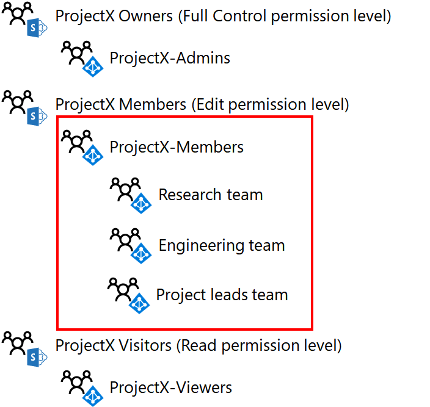

# Projetar um site de equipe do SharePoint Online isolado

[!INCLUDE [Microsoft 365 Defender rebranding](../includes/microsoft-defender-for-office.md)]

**Aplica-se a**
- [Microsoft Defender para Office 365 plano 1 e plano 2](https://go.microsoft.com/fwlink/?linkid=2148715)
- [Microsoft 365 Defender](https://go.microsoft.com/fwlink/?linkid=2118804)

 **Resumo:** Passo a passo do processo de design para sites de equipe isolados do SharePoint Online.

Este artigo o leva pelas principais decisões de design que você deve tomar antes de criar um site de equipe do SharePoint Online isolado.

## Fase 1: Determinar seus grupos e níveis de permissão do SharePoint

Todos os sites de equipe do SharePoint Online por padrão são criados com os seguintes grupos do SharePoint:

- \<site name> Membros

- \<site name> Visitantes

- \<site name> Proprietários

Esses grupos são separados dos grupos do Microsoft 365 e do Azure Active Directory (AD) e são a base para atribuir permissões para os recursos do site.

O conjunto de permissões específicas que determina o que um membro de um grupo do SharePoint pode fazer em um site é um nível de permissão. Há três níveis de permissão por padrão para um site de equipe do SharePoint Online: Editar, Ler e Controle total. A tabela a seguir mostra a correlação padrão de grupos do SharePoint e níveis de permissão atribuídos:

****

|Grupo do SharePoint|Nível de permissão|
|---|---|
|\<site name> Membros|Editar|
|\<site name> Visitantes|Ler|
|\<site name> Proprietários|Controle total|
|

 **Prática prática:** Você pode criar grupos e níveis de permissão adicionais do SharePoint. No entanto, recomendamos usar os grupos padrão do SharePoint e os níveis de permissão para o site isolado do SharePoint Online.

Aqui estão os grupos padrão do SharePoint e os níveis de permissão.

## Fase 2: Atribuir permissões a usuários com grupos de acesso

Você pode atribuir permissões a usuários adicionando sua conta de usuário ou um grupo do Microsoft 365 ou Azure AD do qual a conta de usuário é membro, para os grupos do SharePoint. Depois de adicionadas, as contas de usuário, direta ou indiretamente por meio da associação a um grupo do Microsoft 365 ou Azure AD, são atribuídas ao nível de permissão associado ao grupo do SharePoint.

Usando os grupos padrão do SharePoint como exemplo:

- Os membros do grupo **\<site name> Membros** do SharePoint, que podem incluir contas de usuário e grupos, são atribuídos ao **nível de** permissão Editar

- Os membros do grupo **\<site name> Visitantes** do SharePoint, que podem incluir contas de usuário e grupos, são atribuídos ao **nível de permissão** De leitura

- Os membros do grupo **\<site name> Proprietários** do SharePoint, que podem incluir contas de usuário e grupos, são atribuídos ao **nível de** permissão Controle total

 **Prática prática:** Embora você possa gerenciar permissões por meio de contas de usuário individuais, recomendamos usar um único grupo do Azure AD, conhecido como grupo de acesso. Isso simplifica o gerenciamento de permissões por meio da associação ao grupo de acesso, em vez de gerenciar a lista de contas de usuário para cada grupo do SharePoint.

Os grupos do Azure AD para o Microsoft 365 são grupos diferentes do Microsoft 365. Os grupos do Azure AD aparecem no centro  de  administração do Microsoft 365 com o tipo definido como Segurança e não têm um endereço de email. Os grupos do Azure AD podem ser gerenciados em:

- Serviços de Domínio Active Directory (AD DS)

    Esses são grupos que foram criados em sua infraestrutura do AD DS local e sincronizados com sua assinatura do Microsoft 365. No centro de administração do Microsoft 365, esses grupos têm um **Status** de **Sincronizado com o Active Directory.**

- Office 365

    Esses são grupos que foram criados usando o Centro de administração do Microsoft 365, o portal do Azure ou o Microsoft PowerShell. No centro de administração do Microsoft 365, esses grupos têm um **Status** de **Nuvem.**

 **Prática prática:** Se você estiver usando o AD DS local e sincronizando com sua assinatura do Microsoft 365, execute o gerenciamento de usuários e grupos com o AD DS.

Para sites de equipe isolados do SharePoint Online, a estrutura de grupo recomendada tem esta aparência:

****

|Grupo do SharePoint|Grupo de acesso baseado no Azure AD|Nível da permissão|
|---|---|---|
|\<site name> Membros|\<site name> Membros|Editar|
|\<site name> Visitantes|\<site name> Visualizadores|Ler|
|\<site name> Proprietários|\<site name> Administradores|Controle total|
|

 **Prática prática:** Embora você possa usar grupos do Microsoft 365 ou Azure AD como membros de grupos do SharePoint, recomendamos que você use grupos do Azure AD. Os grupos do Azure AD, gerenciados por meio do AD DS ou do Microsoft 365, oferecem mais flexibilidade para usar grupos aninhados para atribuir permissões.

Aqui estão os grupos padrão do SharePoint configurados para usar grupos de acesso baseados no Azure AD.

Ao projetar os três grupos de acesso, lembre-se do seguinte:

- Deve haver apenas alguns membros **\<site name>** no grupo de acesso Administradores, correspondendo a um pequeno número de administradores do SharePoint Online que estão gerenciando o site de equipe.

- A maioria dos membros do site está nos grupos **\<site name> de acesso Membros** ou **\<site name> Visualizadores.** Como os membros do site **no \<site name>** grupo de acesso Membros têm a capacidade de excluir ou modificar recursos no site, considere cuidadosamente sua associação. Quando estiver em dúvida, adicione o membro do site ao grupo **\<site name> de acesso Visualizadores.**

Aqui está um exemplo dos grupos do SharePoint e grupos de acesso para um site isolado chamado ProjectX.

## Fase 3: Usar grupos aninhados do Azure AD

Para um projeto confinado a um pequeno número de pessoas, um único nível de grupos de acesso baseados no Azure AD adicionados aos grupos do SharePoint do site se ajustará à maioria dos cenários. No entanto, se você tiver um grande número de pessoas e essas pessoas já são membros de grupos estabelecidos do Azure AD, você pode atribuir permissões do SharePoint mais facilmente usando grupos aninhados ou grupos que contêm outros grupos como membros.

Por exemplo, você deseja criar um site de equipe online isolado do SharePoint para colaboração entre os executivos dos departamentos de vendas, marketing, engenharia, jurídico e de suporte, e esses departamentos já têm seus próprios grupos com associação de conta de usuário executiva. Em vez de criar um novo grupo para os novos membros do site e colocar todas as contas de usuário executivos individuais nele, coloque os grupos executivos existentes para cada departamento no novo grupo.

 Se você estiver compartilhando uma assinatura do Microsoft 365 entre várias organizações, um único nível de associação de grupo para um site isolado de uma organização pode se tornar difícil de gerenciar devido ao grande número de contas de usuário. Nesse caso, você pode usar grupos aninhados do Azure AD para cada organização que contenha os grupos em suas organizações para gerenciar as permissões.

Para usar grupos aninhados do Azure AD:

1. Identifique ou crie os grupos do Azure AD que conterão contas de usuário e adicione as contas de usuário apropriadas como membros.

2. Crie o grupo de acesso baseado no Azure AD do contêiner que conterá os outros grupos do Azure AD e adicione esses grupos como membros.

3. Para o nível apropriado de acesso para o grupo de acesso do contêiner, identifique o grupo do SharePoint e o nível de permissão correspondente.

> [!NOTE]
> Você não pode usar grupos aninhados do Microsoft 365.

Aqui está um exemplo de grupos aninhados do Azure AD para o grupo de acesso de membros do ProjectX.

Como todas as contas de usuário nas equipes de pesquisa, engenharia e projeto são projetadas para ser membros do site, é mais fácil adicionar seus grupos do Azure AD ao grupo de acesso membros do ProjectX.

## Próxima etapa

Quando você estiver pronto para criar e configurar um site isolado em produção, confira Implantar um [site de equipe do SharePoint Online isolado.](deploy-an-isolated-sharepoint-online-team-site.md)

## Confira também

[Sites de equipe do SharePoint Online isolados](isolated-sharepoint-online-team-sites.md)

[Gerenciar um site de equipe do SharePoint Online isolado](manage-an-isolated-sharepoint-online-team-site.md)

[Implantar um site de equipe do SharePoint Online isolado](deploy-an-isolated-sharepoint-online-team-site.md)
