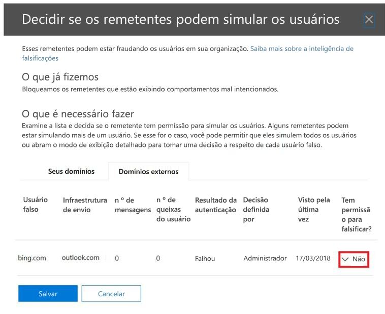

# <a name="email-authentication-in-eop"></a><span data-ttu-id="32706-103">Autenticação de e-mail no EOP</span><span class="sxs-lookup"><span data-stu-id="32706-103">Email authentication in EOP</span></span>

[!INCLUDE [Microsoft 365 Defender rebranding](../includes/microsoft-defender-for-office.md)]

<span data-ttu-id="32706-104">**Aplica-se a**</span><span class="sxs-lookup"><span data-stu-id="32706-104">**Applies to**</span></span>
- [<span data-ttu-id="32706-105">Proteção do Exchange Online</span><span class="sxs-lookup"><span data-stu-id="32706-105">Exchange Online Protection</span></span>](exchange-online-protection-overview.md)
- [<span data-ttu-id="32706-106">Plano 1 e plano 2 do Microsoft Defender para Office 365</span><span class="sxs-lookup"><span data-stu-id="32706-106">Microsoft Defender for Office 365 plan 1 and plan 2</span></span>](office-365-atp.md)
- [<span data-ttu-id="32706-107">Microsoft 365 Defender</span><span class="sxs-lookup"><span data-stu-id="32706-107">Microsoft 365 Defender</span></span>](../mtp/microsoft-threat-protection.md)


<span data-ttu-id="32706-108">A autenticação de email (também conhecida como validação de email) é um grupo de padrões que tenta interromper a falsificação (mensagens de email de remetentes forjados).</span><span class="sxs-lookup"><span data-stu-id="32706-108">Email authentication (also known as email validation) is a group of standards that tries to stop spoofing (email messages from forged senders).</span></span> <span data-ttu-id="32706-109">Em todas as organizações do Microsoft 365, o EOP usa estes padrões para verificar emails de entrada:</span><span class="sxs-lookup"><span data-stu-id="32706-109">In all Microsoft 365 organizations, EOP uses these standards to verify inbound email:</span></span>

- [<span data-ttu-id="32706-110">SPF</span><span class="sxs-lookup"><span data-stu-id="32706-110">SPF</span></span>](set-up-spf-in-office-365-to-help-prevent-spoofing.md)

- [<span data-ttu-id="32706-111">DKIM</span><span class="sxs-lookup"><span data-stu-id="32706-111">DKIM</span></span>](use-dkim-to-validate-outbound-email.md)

- [<span data-ttu-id="32706-112">DMARCDMARC</span><span class="sxs-lookup"><span data-stu-id="32706-112">DMARC</span></span>](use-dmarc-to-validate-email.md)

<span data-ttu-id="32706-113">A autenticação de email verifica se as mensagens de email de um remetente (por exemplo, laura@contoso.com) são legítimas e vêm de fontes esperadas para o domínio de email (por exemplo, contoso.com.)</span><span class="sxs-lookup"><span data-stu-id="32706-113">Email authentication verifies that email messages from a sender (for example, laura@contoso.com) are legitimate and come from expected sources for that email domain (for example, contoso.com.)</span></span>

<span data-ttu-id="32706-114">O restante deste artigo explica como essas tecnologias funcionam e como o EOP as usa para verificar emails de entrada.</span><span class="sxs-lookup"><span data-stu-id="32706-114">The rest of this article explains how these technologies work, and how EOP uses them to check inbound email.</span></span>

## <a name="use-email-authentication-to-help-prevent-spoofing"></a><span data-ttu-id="32706-115">Use a autenticação de email para ajudar a impedir a falsificação</span><span class="sxs-lookup"><span data-stu-id="32706-115">Use email authentication to help prevent spoofing</span></span>

<span data-ttu-id="32706-116">O DMARC impede falsificações ao examinar o endereço **De** nas mensagens.</span><span class="sxs-lookup"><span data-stu-id="32706-116">DMARC prevents spoofing by examining the **From** address in messages.</span></span> <span data-ttu-id="32706-117">O endereço **De** é o endereço de email do remetente que os usuários veem em seus clientes de email.</span><span class="sxs-lookup"><span data-stu-id="32706-117">The **From** address is the sender's email address that users see in their email client.</span></span> <span data-ttu-id="32706-118">As organizações de email de destino também podem verificar se o domínio de email passou pelo SPF ou DKIM.</span><span class="sxs-lookup"><span data-stu-id="32706-118">Destination email organizations can also verify that the email domain has passed SPF or DKIM.</span></span> <span data-ttu-id="32706-119">Em outras palavras, o domínio foi autenticado e, portanto, o endereço de email do remetente não é falso.</span><span class="sxs-lookup"><span data-stu-id="32706-119">In other words, the domain has been authenticated and therefore the sender's email address is not spoofed.</span></span>

<span data-ttu-id="32706-120">No entanto, os registros DNS para SPF, DKIM e DMARC (chamados coletivamente como políticas de autenticação de email) são opcionais.</span><span class="sxs-lookup"><span data-stu-id="32706-120">However, DNS records for SPF, DKIM, and DMARC (collectively known as email authentication policies) are optional.</span></span> <span data-ttu-id="32706-121">Domínios com políticas fortes de autenticação de email, como o microsoft.com e o skype.com, estão protegidos contra falsificação.</span><span class="sxs-lookup"><span data-stu-id="32706-121">Domains with strong email authentication policies like microsoft.com and skype.com are protected from spoofing.</span></span> <span data-ttu-id="32706-122">No entanto, os domínios com políticas de autenticação de email mais fracas, ou sem nenhuma política, são os principais alvos de falsificação.</span><span class="sxs-lookup"><span data-stu-id="32706-122">But domains with weaker email authentication policies, or no policy at all, are prime targets for being spoofed.</span></span>

<span data-ttu-id="32706-123">Em março de 2018, apenas 9% dos domínios de empresas da lista Fortune 500 publicavam políticas fortes de autenticação de email.</span><span class="sxs-lookup"><span data-stu-id="32706-123">As of March 2018, only 9% of domains of companies in the Fortune 500 publish strong email authentication policies.</span></span> <span data-ttu-id="32706-124">Os 91% restantes das empresas podem ser falsificados por um invasor.</span><span class="sxs-lookup"><span data-stu-id="32706-124">The remaining 91% of companies might be spoofed by an attacker.</span></span> <span data-ttu-id="32706-125">A menos que haja outro mecanismo de filtragem de email, os emails de remetentes falsificados nesses domínios podem ser entregues aos usuários.</span><span class="sxs-lookup"><span data-stu-id="32706-125">Unless some other email filtering mechanism is in-place, email from spoofed senders in these domains might be delivered to users.</span></span>


<span data-ttu-id="32706-127">A quantidade de pequenas e médias empresas que publicam políticas fortes de autenticação de email é menor.</span><span class="sxs-lookup"><span data-stu-id="32706-127">The proportion of small-to-medium sized companies that publish strong email authentication policies is smaller.</span></span> <span data-ttu-id="32706-128">E o número é ainda menor para domínios de email fora da América do Norte e da Europa Ocidental.</span><span class="sxs-lookup"><span data-stu-id="32706-128">And the number is even smaller for email domains outside North America and western Europe.</span></span>

<span data-ttu-id="32706-129">A falta de políticas fortes de autenticação de email é um grande problema.</span><span class="sxs-lookup"><span data-stu-id="32706-129">Lack of strong email authentication policies is a large problem.</span></span> <span data-ttu-id="32706-130">Enquanto as organizações talvez não entendam como funciona a autenticação de email, os invasores entendem perfeitamente e tiram proveito disso.</span><span class="sxs-lookup"><span data-stu-id="32706-130">W while organizations might not understand how email authentication works, attackers fully understand, and they take advantage.</span></span> <span data-ttu-id="32706-131">Devido às preocupações com phishing e à adoção limitada de políticas fortes de autenticação de email, a Microsoft usa *autenticação implícita de email* para verificar os emails recebidos.</span><span class="sxs-lookup"><span data-stu-id="32706-131">Because of phishing concerns and the limited adoption of strong email authentication policies, Microsoft uses *implicit email authentication* to check inbound email.</span></span>

<span data-ttu-id="32706-132">A autenticação implícita de email é uma extensão das políticas comuns de autenticação de email.</span><span class="sxs-lookup"><span data-stu-id="32706-132">Implicit email authentication is an extension of regular email authentication policies.</span></span> <span data-ttu-id="32706-133">Essas extensões incluem: reputação do remetente, histórico do remetente, histórico do destinatário, análise comportamental e outras técnicas avançadas.</span><span class="sxs-lookup"><span data-stu-id="32706-133">These extensions include: sender reputation, sender history, recipient history, behavioral analysis, and other advanced techniques.</span></span> <span data-ttu-id="32706-134">Na ausência de outros sinais dessas extensões, as mensagens enviadas de domínios que não usam políticas de autenticação de email serão marcadas como falsas.</span><span class="sxs-lookup"><span data-stu-id="32706-134">In the absence of other signals from these extensions, messages sent from domains that don't use email authentication policies will be marked as spoof.</span></span>

<span data-ttu-id="32706-135">Para ver o anúncio geral da Microsoft, confira [A Sea of Phish Part 2 - Enhanced Anti-spoofing in Microsoft 365](https://techcommunity.microsoft.com/t5/Security-Privacy-and-Compliance/Schooling-A-Sea-of-Phish-Part-2-Enhanced-Anti-spoofing/ba-p/176209).</span><span class="sxs-lookup"><span data-stu-id="32706-135">To see Microsoft's general announcement, see [A Sea of Phish Part 2 - Enhanced Anti-spoofing in Microsoft 365](https://techcommunity.microsoft.com/t5/Security-Privacy-and-Compliance/Schooling-A-Sea-of-Phish-Part-2-Enhanced-Anti-spoofing/ba-p/176209).</span></span>

## <a name="composite-authentication"></a><span data-ttu-id="32706-136">Autenticação composta</span><span class="sxs-lookup"><span data-stu-id="32706-136">Composite authentication</span></span>

<span data-ttu-id="32706-137">Se um domínio não tiver registros SPF, DKIM e DMARC tradicionais, essas verificações de registro não comunicarão informações suficientes sobre o status de autenticação.</span><span class="sxs-lookup"><span data-stu-id="32706-137">If a domain doesn't have traditional SPF, DKIM, and DMARC records, those record checks don't communicate enough authentication status information.</span></span> <span data-ttu-id="32706-138">Portanto, a Microsoft desenvolveu um algoritmo para autenticação implícita de email.</span><span class="sxs-lookup"><span data-stu-id="32706-138">Therefore, Microsoft has developed an algorithm for implicit email authentication.</span></span> <span data-ttu-id="32706-139">Esse algoritmo combina vários sinais em um único valor chamado de _autenticação composta_, ou abreviada como `compauth`.</span><span class="sxs-lookup"><span data-stu-id="32706-139">This algorithm combines multiple signals into a single value called _composite authentication_, or `compauth` for short.</span></span> <span data-ttu-id="32706-140">O valor `compauth` é marcado no cabeçalho **Resultados de Autenticação** nos cabeçalhos da mensagem.</span><span class="sxs-lookup"><span data-stu-id="32706-140">The `compauth` value is stamped into the **Authentication-Results** header in the message headers.</span></span>

```text
Authentication-Results:
   compauth=<fail | pass | softpass | none> reason=<yyy>
```

<span data-ttu-id="32706-141">Estes valores são explicados em [Resultados de autenticação do cabeçalho da mensagem](anti-spam-message-headers.md#authentication-results-message-header).</span><span class="sxs-lookup"><span data-stu-id="32706-141">These values are explained at [Authentication-results message header](anti-spam-message-headers.md#authentication-results-message-header).</span></span>

<span data-ttu-id="32706-142">Ao examinar os cabeçalhos das mensagens, os administradores ou usuários finais podem determinar como o Microsoft 365 determinou que o remetente é falsificado.</span><span class="sxs-lookup"><span data-stu-id="32706-142">By examining the message headers, admins or even end users can determine how Microsoft 365 determined that the sender is spoofed.</span></span>

## <a name="why-email-authentication-is-not-always-enough-to-stop-spoofing"></a><span data-ttu-id="32706-143">Por que a autenticação de email nem sempre é suficiente para impedir a falsificação</span><span class="sxs-lookup"><span data-stu-id="32706-143">Why email authentication is not always enough to stop spoofing</span></span>

<span data-ttu-id="32706-144">Confiar apenas nos registros de autenticação de email para determinar se uma mensagem de entrada é falsa tem as seguintes limitações:</span><span class="sxs-lookup"><span data-stu-id="32706-144">Relying only on email authentication records to determine if an incoming message is spoofed has the following limitations:</span></span>

- <span data-ttu-id="32706-145">O domínio de envio pode não ter os registros DNS necessários, ou os registros estão configurados incorretamente.</span><span class="sxs-lookup"><span data-stu-id="32706-145">The sending domain might lack the required DNS records, or the records are incorrectly configured.</span></span>

- <span data-ttu-id="32706-146">O domínio de origem configurou corretamente os registros DNS, mas esse domínio não corresponde ao domínio no endereço De.</span><span class="sxs-lookup"><span data-stu-id="32706-146">The source domain has correctly configured DNS records, but that domain doesn't match the domain in the From address.</span></span> <span data-ttu-id="32706-147">O SPF e o DKIM não exigem que o domínio seja usado no endereço De.</span><span class="sxs-lookup"><span data-stu-id="32706-147">SPF and DKIM don't require the domain to be used in the From address.</span></span> <span data-ttu-id="32706-148">Os invasores ou serviços legítimos podem registrar um domínio, configurar o SPF e o DKIM para o domínio, e usar um domínio completamente diferente no endereço De.</span><span class="sxs-lookup"><span data-stu-id="32706-148">Attackers or legitimate services can register a domain, configure SPF and DKIM for the domain, and use a completely different domain in the From address.</span></span> <span data-ttu-id="32706-149">As mensagens de remetentes neste domínio passarão pelo SPF e DKIM.</span><span class="sxs-lookup"><span data-stu-id="32706-149">Messages from senders in this domain will pass SPF and DKIM.</span></span>

<span data-ttu-id="32706-150">A autenticação composta pode solucionar essas limitações transmitindo mensagens que, de outra forma, falhariam nas verificações de autenticação de email.</span><span class="sxs-lookup"><span data-stu-id="32706-150">Composite authentication can address these limitations by passing messages that would otherwise fail email authentication checks.</span></span>

<span data-ttu-id="32706-151">Para simplificar, os exemplos a seguir se concentram nos resultados da autenticação de email.</span><span class="sxs-lookup"><span data-stu-id="32706-151">For simplicity, the following examples concentrate on email authentication results.</span></span> <span data-ttu-id="32706-152">Outros fatores de inteligência de back-end poderiam identificar mensagens aprovadas na autenticação de email como falsas, ou mensagens reprovadas na autenticação de email como legítimas.</span><span class="sxs-lookup"><span data-stu-id="32706-152">Other back-end intelligence factors could identify messages that pass email authentication as spoofed, or messages that fail email email authentication as legitimate.</span></span>

<span data-ttu-id="32706-153">Por exemplo, o domínio fabrikam.com não possui registros SPF, DKIM ou DMARC.</span><span class="sxs-lookup"><span data-stu-id="32706-153">For example, the fabrikam.com domain has no SPF, DKIM, or DMARC records.</span></span> <span data-ttu-id="32706-154">Mensagens de remetentes no domínio fabrikam.com podem ser reprovadas na autenticação composta (observe o valor `compauth` e o motivo):</span><span class="sxs-lookup"><span data-stu-id="32706-154">Messages from senders in the fabrikam.com domain can fail composite authentication (note the `compauth` value and reason):</span></span>

```text
Authentication-Results: spf=none (sender IP is 10.2.3.4)
  smtp.mailfrom=fabrikam.com; contoso.com; dkim=none
  (message not signed) header.d=none; contoso.com; dmarc=none
  action=none header.from=fabrikam.com; compauth=fail reason=001
From: chris@fabrikam.com
To: michelle@contoso.com
```

<span data-ttu-id="32706-155">Se o fabrikam.com configurar um SPF sem um registro DKIM, a mensagem poderá passar pela autenticação composta.</span><span class="sxs-lookup"><span data-stu-id="32706-155">If fabrikam.com configures an SPF without a DKIM record, the message can pass composite authentication.</span></span> <span data-ttu-id="32706-156">O domínio que passou pelas verificações de SPF está alinhado com o domínio no endereço De:</span><span class="sxs-lookup"><span data-stu-id="32706-156">The domain that passed SPF checks is aligned with the domain in the From address:</span></span>

```text
Authentication-Results: spf=pass (sender IP is 10.2.3.4)
  smtp.mailfrom=fabrikam.com; contoso.com; dkim=none
  (message not signed) header.d=none; contoso.com; dmarc=bestguesspass
  action=none header.from=fabrikam.com; compauth=pass reason=109
From: chris@fabrikam.com
To: michelle@contoso.com
```

<span data-ttu-id="32706-157">Se o fabrikam.com configurar um registro DKIM sem um registro SPF, a mensagem poderá passar pela autenticação composta.</span><span class="sxs-lookup"><span data-stu-id="32706-157">If fabrikam.com configures a DKIM record without an SPF record, the message can pass composite authentication.</span></span> <span data-ttu-id="32706-158">O domínio na assinatura DKIM está alinhado com o domínio no endereço De:</span><span class="sxs-lookup"><span data-stu-id="32706-158">The domain in the DKIM signature is aligned with the domain in the From address:</span></span>

```text
Authentication-Results: spf=none (sender IP is 10.2.3.4)
  smtp.mailfrom=fabrikam.com; contoso.com; dkim=pass
  (signature was verified) header.d=outbound.fabrikam.com;
  contoso.com; dmarc=bestguesspass action=none
  header.from=fabrikam.com; compauth=pass reason=109
From: chris@fabrikam.com
To: michelle@contoso.com
```

<span data-ttu-id="32706-159">Se o domínio no SPF ou a assinatura DKIM não estiver alinhado com o domínio no endereço De, a mensagem poderá falhar na autenticação composta:</span><span class="sxs-lookup"><span data-stu-id="32706-159">If the domain in SPF or the DKIM signature doesn't align with the domain in the From address, the message can fail composite authentication:</span></span>

```text
Authentication-Results: spf=none (sender IP is 192.168.1.8)
  smtp.mailfrom=maliciousdomain.com; contoso.com; dkim=pass
  (signature was verified) header.d=maliciousdomain.com;
  contoso.com; dmarc=none action=none header.from=contoso.com;
  compauth=fail reason=001
From: chris@contoso.com
To: michelle@fabrikam.com
```

## <a name="solutions-for-legitimate-senders-who-are-sending-unauthenticated-email"></a><span data-ttu-id="32706-160">Soluções para remetentes legítimos que enviam emails não autenticados</span><span class="sxs-lookup"><span data-stu-id="32706-160">Solutions for legitimate senders who are sending unauthenticated email</span></span>

<span data-ttu-id="32706-161">O Microsoft 365 mantém o controle de quem está enviando emails não autenticados para sua organização.</span><span class="sxs-lookup"><span data-stu-id="32706-161">Microsoft 365 keeps track of who is sending unauthenticated email to your organization.</span></span> <span data-ttu-id="32706-162">Se o serviço considerar que o remetente não é legítimo, ele marcará as mensagens desse remetente como uma falha de autenticação composta.</span><span class="sxs-lookup"><span data-stu-id="32706-162">If the service thinks the sender is not legitimate, it will mark messages from this sender as a composite authentication failure.</span></span> <span data-ttu-id="32706-163">Para evitar essa decisão, você pode usar as recomendações nesta seção.</span><span class="sxs-lookup"><span data-stu-id="32706-163">To avoid this verdict, you can use the recommendations in this section.</span></span>

### <a name="configure-email-authentication-for-domains-you-own"></a><span data-ttu-id="32706-164">Configure a autenticação de email para domínios que você possui</span><span class="sxs-lookup"><span data-stu-id="32706-164">Configure email authentication for domains you own</span></span>

<span data-ttu-id="32706-165">Você pode usar este método para solucionar problemas de falsificação dentro da organização e falsificação entre domínios nos casos em que você possui ou interage com vários locatários.</span><span class="sxs-lookup"><span data-stu-id="32706-165">You can use this method to resolve intra-org spoofing and cross-domain spoofing in cases where you own or interact with multiple tenants.</span></span> <span data-ttu-id="32706-166">Ele também ajuda a resolver a falsificação entre domínios que você envia para outros clientes no Microsoft 365 ou em terceiros que são hospedados por outros provedores.</span><span class="sxs-lookup"><span data-stu-id="32706-166">It also helps resolve cross-domain spoofing where you send to other customers within Microsoft 365 or third parties that are hosted by other providers.</span></span>

- <span data-ttu-id="32706-167">[Configurar registros SPF](set-up-spf-in-office-365-to-help-prevent-spoofing.md) para seus domínios.</span><span class="sxs-lookup"><span data-stu-id="32706-167">[Configure SPF records](set-up-spf-in-office-365-to-help-prevent-spoofing.md) for your domains.</span></span>

- <span data-ttu-id="32706-168">[Configurar registros DKIM](use-dkim-to-validate-outbound-email.md) para seus domínios principais.</span><span class="sxs-lookup"><span data-stu-id="32706-168">[Configure DKIM records](use-dkim-to-validate-outbound-email.md) for your primary domains.</span></span>

- <span data-ttu-id="32706-169">[Considere configurar registros DMARC](use-dmarc-to-validate-email.md) para seu domínio para determinar seus remetentes legítimos.</span><span class="sxs-lookup"><span data-stu-id="32706-169">[Consider setting up DMARC records](use-dmarc-to-validate-email.md) for your domain to determine your legitimate senders.</span></span>

<span data-ttu-id="32706-170">A Microsoft não fornece diretrizes detalhadas de implementação para registros SPF, DKIM e DMARC.</span><span class="sxs-lookup"><span data-stu-id="32706-170">Microsoft doesn't provide detailed implementation guidelines for SPF, DKIM, and DMARC records.</span></span> <span data-ttu-id="32706-171">No entanto, há várias informações disponíveis online.</span><span class="sxs-lookup"><span data-stu-id="32706-171">However, there's many information available online.</span></span> <span data-ttu-id="32706-172">Também há empresas de terceiros dedicadas a ajudar sua organização a configurar registros de autenticação de email.</span><span class="sxs-lookup"><span data-stu-id="32706-172">There are also third party companies dedicated to helping your organization set up email authentication records.</span></span>

#### <a name="you-dont-know-all-sources-for-your-email"></a><span data-ttu-id="32706-173">Você não conhece todas as fontes do seu email</span><span class="sxs-lookup"><span data-stu-id="32706-173">You don't know all sources for your email</span></span>

<span data-ttu-id="32706-174">Muitos domínios não publicam registros SPF porque não conhecem todas as fontes de email das mensagens em seu domínio.</span><span class="sxs-lookup"><span data-stu-id="32706-174">Many domains don't publish SPF records because they don't know all of the email sources for messages in their domain.</span></span> <span data-ttu-id="32706-175">Comece publicando um registro SPF que contenha todas as fontes de email que você conhece (especialmente onde o seu tráfego corporativo está localizado) e publique a política neutra de SPF `?all`.</span><span class="sxs-lookup"><span data-stu-id="32706-175">Start by publishing an SPF record that contains all of the email sources you know about (especially where your corporate traffic is located), and publish the neutral SPF policy `?all`.</span></span> <span data-ttu-id="32706-176">Por exemplo:</span><span class="sxs-lookup"><span data-stu-id="32706-176">For example:</span></span>

```text
fabrikam.com IN TXT "v=spf1 include:spf.fabrikam.com ?all"
```

<span data-ttu-id="32706-177">Este exemplo significa que emails da sua infraestrutura corporativa passarão pela autenticação de email, mas emails de fontes desconhecidas voltarão à neutralidade.</span><span class="sxs-lookup"><span data-stu-id="32706-177">This example means that email from your corporate infrastructure will pass email authentication, but email from unknown sources will fall back to neutral.</span></span>

<span data-ttu-id="32706-178">O Microsoft 365 tratará os emails de entrada da infraestrutura corporativa como autenticado.</span><span class="sxs-lookup"><span data-stu-id="32706-178">Microsoft 365 will treat inbound email from your corporate infrastructure as authenticated.</span></span> <span data-ttu-id="32706-179">Os emails de fontes não identificadas ainda poderão ser marcados como falsos se houver falhas na autenticação implícita.</span><span class="sxs-lookup"><span data-stu-id="32706-179">Email from unidentified sources might still be marked as spoof if it fails implicit authentication.</span></span> <span data-ttu-id="32706-180">No entanto, isso ainda é uma melhoria em relação à situação em que todos os emails são marcados como falsificação pelo Microsoft 365.</span><span class="sxs-lookup"><span data-stu-id="32706-180">However, this is still an improvement from all email being marked as spoof by Microsoft 365.</span></span>

<span data-ttu-id="32706-181">Após começar a usar um registro SPF com a política de fallback `?all`, você poderá gradualmente descobrir e incluir mais fontes de email para suas mensagens e, em seguida, atualizar seu registro SPF com uma política mais rígida.</span><span class="sxs-lookup"><span data-stu-id="32706-181">Once you've gotten started with an SPF fallback policy of `?all`, you can gradually discover and include more email sources for your messages, and then update your SPF record with a stricter policy.</span></span>

### <a name="use-spoof-intelligence-to-configure-permitted-senders-of-unauthenticated-email"></a><span data-ttu-id="32706-182">Use a inteligência contra falsificação para configurar remetentes permitidos de email não autenticado</span><span class="sxs-lookup"><span data-stu-id="32706-182">Use spoof intelligence to configure permitted senders of unauthenticated email</span></span>

<span data-ttu-id="32706-183">Você também pode usar a [inteligência contra falsificação](learn-about-spoof-intelligence.md) para permitir que os remetentes transmitam mensagens não autenticadas para a sua organização.</span><span class="sxs-lookup"><span data-stu-id="32706-183">You can also use [spoof intelligence](learn-about-spoof-intelligence.md) to permit senders to transmit unauthenticated messages to your organization.</span></span>

<span data-ttu-id="32706-184">Para domínios externos, o usuário falsificado é o domínio no endereço De, enquanto a infraestrutura de envio é o endereço IP de origem (dividido em intervalos /24 CIDR) ou o domínio organizacional do registro de DNS reverso (PTR).</span><span class="sxs-lookup"><span data-stu-id="32706-184">For external domains, the spoofed user is the domain in the From address, while the sending infrastructure is either the source IP address (divided up into /24 CIDR ranges), or the organizational domain of the reverse DNS (PTR) record.</span></span>

<span data-ttu-id="32706-185">Na captura de tela abaixo, o IP de origem pode ser 131.107.18.4 com o registro PTR outbound.mail.protection.outlook.com.</span><span class="sxs-lookup"><span data-stu-id="32706-185">In the screenshot below, the source IP might be 131.107.18.4 with the PTR record outbound.mail.protection.outlook.com.</span></span> <span data-ttu-id="32706-186">Isso apareceria como outlook.com para a infraestrutura de envio.</span><span class="sxs-lookup"><span data-stu-id="32706-186">This would show up as outlook.com for the sending infrastructure.</span></span>

<span data-ttu-id="32706-187">Para permitir que esse remetente envie emails não autenticados, altere **No** para **Yes**.</span><span class="sxs-lookup"><span data-stu-id="32706-187">To permit this sender to send unauthenticated email, change the **No** to a **Yes**.</span></span>



### <a name="create-an-allow-entry-for-the-senderrecipient-pair"></a><span data-ttu-id="32706-189">Crie uma permissão de entrada para o par remetente/destinatário</span><span class="sxs-lookup"><span data-stu-id="32706-189">Create an allow entry for the sender/recipient pair</span></span>

<span data-ttu-id="32706-190">Para ignorar a filtragem de spam, algumas partes da filtragem de phishing, mas não a filtragem de malware de remetentes específicos, confira [Criar listas de remetentes confiáveis no Microsoft 365](create-safe-sender-lists-in-office-365.md).</span><span class="sxs-lookup"><span data-stu-id="32706-190">To bypass spam filtering, some parts of filtering for phishing, but not malware filtering for specific senders, see [Create safe sender lists in Microsoft 365](create-safe-sender-lists-in-office-365.md).</span></span>

### <a name="ask-the-sender-to-configure-email-authentication-for-domains-you-dont-own"></a><span data-ttu-id="32706-191">Peça ao remetente para configurar a autenticação de email para domínios que você não possui</span><span class="sxs-lookup"><span data-stu-id="32706-191">Ask the sender to configure email authentication for domains you don't own</span></span>

<span data-ttu-id="32706-192">Devido ao problema de spam e phishing, a Microsoft recomenda autenticação de email para todas as organizações de email.</span><span class="sxs-lookup"><span data-stu-id="32706-192">Because of the problem of spam and phishing, Microsoft recommends email authentication for all email organizations.</span></span> <span data-ttu-id="32706-193">Em vez de configurar substituições manuais em sua organização, você pode pedir a um administrador no domínio de envio para configurar seus registros de autenticação de email.</span><span class="sxs-lookup"><span data-stu-id="32706-193">Instead of configuring manual overrides in your organization, you can ask an admin in the sending domain to configure their email authentication records.</span></span>

- <span data-ttu-id="32706-194">Mesmo que ele não tenha precisado publicar registros de autenticação de email no passado, ele deverá fazê-lo se enviar emails para a Microsoft.</span><span class="sxs-lookup"><span data-stu-id="32706-194">Even if they didn't need to publish email authentication records in the past, they should do so if they send email to Microsoft.</span></span>

- <span data-ttu-id="32706-195">Configure o SPF para publicar os endereços IP de envio do domínio e configure o DKIM (se disponível) para assinar digitalmente as mensagens.</span><span class="sxs-lookup"><span data-stu-id="32706-195">Set up SPF to publish the domain's sending IP addresses, and set up DKIM (if available) to digitally sign messages.</span></span> <span data-ttu-id="32706-196">Ele também deve considerar a criação de registros DMARC.</span><span class="sxs-lookup"><span data-stu-id="32706-196">They should also consider setting up DMARC records.</span></span>

- <span data-ttu-id="32706-197">Se ele usar remetentes em massa para enviar emails em seu nome, verifique se o domínio no endereço De (se pertencer a ele) está alinhado com o domínio que passa no SPF ou no DMARC.</span><span class="sxs-lookup"><span data-stu-id="32706-197">If they use bulk senders to send email on their behalf, verify that the domain in the From address (if it belongs to them) aligns with the domain that passes SPF or DMARC.</span></span>

- <span data-ttu-id="32706-198">Verifique se os seguintes locais (se ele não os usar) estão incluídos no registro SPF:</span><span class="sxs-lookup"><span data-stu-id="32706-198">Verify the following locations (if they use them) are included in the SPF record:</span></span>

  - <span data-ttu-id="32706-199">Servidores de email no local.</span><span class="sxs-lookup"><span data-stu-id="32706-199">On-premises email servers.</span></span>
  - <span data-ttu-id="32706-200">Email enviado de um provedor de software como serviço (SaaS).</span><span class="sxs-lookup"><span data-stu-id="32706-200">Email sent from a software-as-a-service (SaaS) provider.</span></span>
  - <span data-ttu-id="32706-201">Email enviado de um serviço de hospedagem em nuvem (Microsoft Azure, GoDaddy, Rackspace, Amazon Web Services, etc.).</span><span class="sxs-lookup"><span data-stu-id="32706-201">Email sent from a cloud-hosting service (Microsoft Azure, GoDaddy, Rackspace, Amazon Web Services, etc.).</span></span>

- <span data-ttu-id="32706-202">Para domínios pequenos hospedados por um ISP, configure o registro SPF de acordo com as instruções do ISP.</span><span class="sxs-lookup"><span data-stu-id="32706-202">For small domains that are hosted by an ISP, configure the SPF record according to the instructions from the ISP.</span></span>

<span data-ttu-id="32706-203">Embora inicialmente possa ser difícil enviar domínios para autenticação, com o passar do tempo, à medida que mais e mais filtros de email começarem a acumular ou até mesmo rejeitar seus emails, isso fará com que eles configurem os registros apropriados para melhorar a entrega.</span><span class="sxs-lookup"><span data-stu-id="32706-203">While it may be difficult at first to get sending domains to authenticate, over time, as more and more email filters start junking or even rejecting their email, it will cause them to set up the proper records to ensure better delivery.</span></span> <span data-ttu-id="32706-204">Além disso, sua participação pode ajudar no combate a phishing e reduzir a possibilidade de phishing em sua organização ou organizações para as quais ele envia emails.</span><span class="sxs-lookup"><span data-stu-id="32706-204">Also, their participation can help in the fight against phishing, and can reduce the possibility of phishing in their organization or organizations that they send email to.</span></span>

#### <a name="information-for-infrastructure-providers-isps-esps-or-cloud-hosting-services"></a><span data-ttu-id="32706-205">Informações para provedores de infraestrutura (ISPs, ESPs ou serviços de hospedagem em nuvem)</span><span class="sxs-lookup"><span data-stu-id="32706-205">Information for infrastructure providers (ISPs, ESPs, or cloud hosting services)</span></span>

<span data-ttu-id="32706-206">Se você hospedar o email de um domínio ou fornecer uma infraestrutura de hospedagem que possa enviar emails, execute as seguintes etapas:</span><span class="sxs-lookup"><span data-stu-id="32706-206">If you host a domain's email or provide hosting infrastructure that can send email, you should do the following steps:</span></span>

- <span data-ttu-id="32706-207">Garanta que seus clientes tenham uma documentação que explique como eles devem configurar seus registros SPF</span><span class="sxs-lookup"><span data-stu-id="32706-207">Ensure your customers have documentation that explains how your customers should configure their SPF records</span></span>

- <span data-ttu-id="32706-208">Considere a inclusão de assinaturas DKIM nos emails de saída, mesmo que o cliente não os configure explicitamente (assine com um domínio padrão).</span><span class="sxs-lookup"><span data-stu-id="32706-208">Consider signing DKIM-signatures on outbound email, even if the customer doesn't explicitly set it up (sign with a default domain).</span></span> <span data-ttu-id="32706-209">Você pode até mesmo assinar duplamente o email com assinaturas DKIM (uma vez com o domínio do cliente, se ele estiver configurado, e uma segunda vez com a assinatura DKIM de sua empresa)</span><span class="sxs-lookup"><span data-stu-id="32706-209">You can even double-sign the email with DKIM signatures (once with the customer's domain if they have set it up, and a second time with your company's DKIM signature)</span></span>

<span data-ttu-id="32706-210">A capacidade de entrega para a Microsoft não é garantida, mesmo que você autentique emails originados de sua plataforma, mas pelo menos isso garante que a Microsoft não marque seu email como lixo eletrônico porque ele não está autenticado.</span><span class="sxs-lookup"><span data-stu-id="32706-210">Deliverability to Microsoft is not guaranteed even if you authenticate email originating from your platform, but at least it ensures that Microsoft does not junk your email because it isn't authenticated.</span></span>

## <a name="related-links"></a><span data-ttu-id="32706-211">Links relacionados</span><span class="sxs-lookup"><span data-stu-id="32706-211">Related links</span></span>

<span data-ttu-id="32706-212">Para obter mais informações sobre as práticas recomendadas dos provedores de serviços, confira [Práticas Recomendadas de Mensagens Móveis do M3AAWG para Provedores de Serviços](https://www.m3aawg.org/sites/default/files/m3aawg-mobile-messaging-best-practices-service-providers-2015-08_0.pdf).</span><span class="sxs-lookup"><span data-stu-id="32706-212">For more information about service providers best practices, see [M3AAWG Mobile Messaging Best Practices for Service Providers](https://www.m3aawg.org/sites/default/files/m3aawg-mobile-messaging-best-practices-service-providers-2015-08_0.pdf).</span></span>

<span data-ttu-id="32706-213">Saiba como o Office 365 usa SPF e tem suporte para a validação DKIM:</span><span class="sxs-lookup"><span data-stu-id="32706-213">Learn how Office 365 uses SPF and supports DKIM validation:</span></span>

- [<span data-ttu-id="32706-214">Mais sobre SPF</span><span class="sxs-lookup"><span data-stu-id="32706-214">More about SPF</span></span>](how-office-365-uses-spf-to-prevent-spoofing.md)

- [<span data-ttu-id="32706-215">Mais sobre DKIM</span><span class="sxs-lookup"><span data-stu-id="32706-215">More about DKIM</span></span>](support-for-validation-of-dkim-signed-messages.md)
