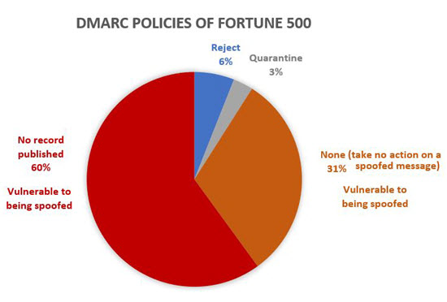
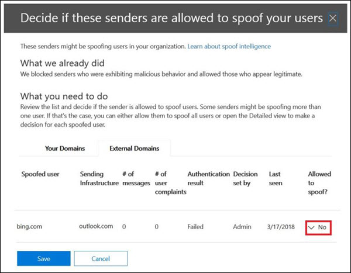

# <a name="email-authentication-in-office-365"></a>Autenticação de email no Office 365

A autenticação de email (também conhecida como validação de email) é um grupo de padrões que tenta interromper a falsificação (mensagens de email de remetentes forjados). Nas organizações do Office 365 com caixas de correio do Exchange Online e organizações autônomas da Proteção do Exchange Online (EOP) sem caixas de correio do Exchange Online, a EOP usa os padrões para verificar emails de entrada:

- [SPF](how-office-365-uses-spf-to-prevent-spoofing.md)

- [DKIM](support-for-validation-of-dkim-signed-messages.md)

- [DMARCDMARC](use-dmarc-to-validate-email.md)

A autenticação de email verifica se as mensagens de email de um remetente (por exemplo, laura@contoso.com) são legítimas e vêm de fontes esperadas para o domínio de email (por exemplo, contoso.com.)

O restante deste tópico explica como essas tecnologias funcionam e como a EOP as utiliza para verificar emails de entrada.

## <a name="use-email-authentication-to-help-prevent-spoofing"></a>Use a autenticação de email para ajudar a impedir a falsificação

O DMARC impede a falsificação examinando o endereço **De** nas mensagens (o endereço de email do remetente que os usuários veem no cliente de email). As organizações de email de destino também podem verificar se o domínio do email passou no SPF ou DKIM, o que significa que o domínio foi autenticado e, portanto, não é falsificado. 

No entanto, o problema é que os registros SPF, DKIM e DMARC no DNS para autenticação de email (conhecidos coletivamente como políticas de autenticação de email) são completamente opcionais. Portanto, embora domínios com políticas fortes de autenticação de email, como microsoft.com e skype.com, sejam protegidos contra falsificação, domínios que publicam políticas de autenticação de email mais fracas ou nenhuma política são os principais alvos de falsificação.

Em março de 2018, apenas 9% dos domínios de empresas da lista Fortune 500 publicavam políticas de autenticação de emails fortes. Os 91% restantes das empresas podem ser falsificados por um invasor. A menos que haja outro mecanismo de filtragem de email, os emails de remetentes falsificados nesses domínios podem ser entregues aos usuários.



A proporção de empresas de pequeno a médio porte que não fazem parte da lista Fortune 500 que publicam políticas fortes de autenticação de email é menor, sendo ainda menor para domínios de email fora da América do Norte e da Europa Ocidental.

Esse é um grande problema porque, embora as empresas possam não estar cientes de como a autenticação de email funciona, os invasores a entendem completamente e se aproveitam disso. Como o phishing é um problema considerável e devido à adoção limitada de políticas fortes de autenticação de email, a Microsoft usa a *autenticação implícita de email* para verificar os emails de entrada.

A autenticação implícita de email se baseia em várias extensões de políticas regulares de autenticação de email. Essas extensões incluem a reputação do remetente, histórico do remetente, histórico do destinatário, análise comportamental e outras técnicas avançadas. Uma mensagem enviada de um domínio que não usa políticas de autenticação de email será marcada como falsa, a menos que contenha outros sinais para indicar que é legítima.

Para ver o comunicado geral da Microsoft, confira [Um mar de phishing, parte 2 ‒ antifalsificação aprimorada no Office 365](https://techcommunity.microsoft.com/t5/Security-Privacy-and-Compliance/Schooling-A-Sea-of-Phish-Part-2-Enhanced-Anti-spoofing/ba-p/176209).

## <a name="composite-authentication"></a>Autenticação composta

Embora o SPF, o DKIM e o DMARC sejam úteis por si só, não comunicam um status de autenticação suficiente caso uma mensagem não tenha registros de autenticação explícitos. Portanto, a Microsoft desenvolveu um algoritmo para autenticação implícita de email, que combina vários sinais em um único valor chamado de _autenticação composta_ ou compauth, abreviado. O valor compauth é marcado no cabeçalho **Authentication-Results** nos cabeçalhos da mensagem.

> Authentication-Results:<br/>&nbsp;&nbsp;&nbsp;compauth=\<fail | pass | softpass | none\> reason=\<yyy\>

Esses valores são explicados nos [campos de cabeçalho da mensagem Authentication-results usados pela autenticação de email do Office 365](anti-spam-message-headers.md#authentication-results-message-header-fields-used-by-office-365-email-authentication).

Ao examinar os cabeçalhos das mensagens, os administradores ou mesmo os usuários finais podem determinar como o Office 365 determinou que o remetente é falsificado.

## <a name="why-email-authentication-is-not-always-enough-to-stop-spoofing"></a>Por que a autenticação de email nem sempre é suficiente para impedir a falsificação

Confiar apenas nos registros de autenticação de email para determinar se uma mensagem de entrada é falsa tem as seguintes limitações:

- O domínio de envio pode não ter os registros DNS necessários, ou os registros estão configurados incorretamente.

- O domínio de origem configurou corretamente os registros DNS, mas esse domínio não corresponde ao domínio no endereço De. O SPF e o DKIM não exigem que o domínio seja usado no endereço De. Invasores ou serviços legítimos podem registrar um domínio, configurar o SPF e o DKIM para o domínio, usar um domínio completamente diferente no endereço De e essa mensagem passará no SPF e DKIM.

A autenticação composta pode solucionar essas limitações transmitindo mensagens que, de outra forma, falhariam nas verificações de autenticação de email.

> [!NOTE]
> Conforme descrito anteriormente, a autenticação implícita de email usa vários sinais para determinar se uma mensagem é legítima. Para simplificar, os exemplos a seguir se concentram nos resultados da autenticação de email. Outros fatores de inteligência de back-end poderiam identificar mensagens aprovadas na autenticação de email como falsas, ou mensagens reprovadas na autenticação de email como legítimas.

Por exemplo, o domínio fabrikam.com não possui registros SPF, DKIM ou DMARC. Mensagens de remetentes no domínio fabrikam.com podem ser reprovadas na autenticação composta (observe o valor `compauth` e o motivo):

```text
Authentication-Results: spf=none (sender IP is 10.2.3.4)
  smtp.mailfrom=fabrikam.com; contoso.com; dkim=none
  (message not signed) header.d=none; contoso.com; dmarc=none
  action=none header.from=fabrikam.com; compauth=fail reason=001
From: chris@fabrikam.com
To: michelle@contoso.com
```

Se fabrikam.com configurar um SPF sem um registro DKIM, a mensagem poderá passar pela autenticação composta, porque o domínio que passou no SPF está alinhado com o domínio no endereço De:

```text
Authentication-Results: spf=pass (sender IP is 10.2.3.4)
  smtp.mailfrom=fabrikam.com; contoso.com; dkim=none
  (message not signed) header.d=none; contoso.com; dmarc=bestguesspass
  action=none header.from=fabrikam.com; compauth=pass reason=109
From: chris@fabrikam.com
To: michelle@contoso.com
```

Se fabrikam.com configurar um registro DKIM sem um registro SPF, a mensagem poderá passar pela autenticação composta, porque o domínio na assinatura DKIM aprovada está alinhado com o domínio no endereço De:

```text
Authentication-Results: spf=none (sender IP is 10.2.3.4)
  smtp.mailfrom=fabrikam.com; contoso.com; dkim=pass
  (signature was verified) header.d=outbound.fabrikam.com;
  contoso.com; dmarc=bestguesspass action=none
  header.from=fabrikam.com; compauth=pass reason=109
From: chris@fabrikam.com
To: michelle@contoso.com
```

Se o domínio no SPF ou a assinatura DKIM não se alinhar com o domínio no endereço De, a mensagem poderá ser reprovada na autenticação composta:

```text
Authentication-Results: spf=none (sender IP is 192.168.1.8)
  smtp.mailfrom=maliciousdomain.com; contoso.com; dkim=pass
  (signature was verified) header.d=maliciousdomain.com;
  contoso.com; dmarc=none action=none header.from=contoso.com;
  compauth=fail reason=001
From: chris@contoso.com
To: michelle@fabrikam.com
```

## <a name="solutions-for-legitimate-senders-who-are-sending-unauthenticated-email"></a>Soluções para remetentes legítimos que enviam emails não autenticados

O Office 365 mantém o controle de quem está enviando emails não autenticados para sua organização. Se o serviço considerar que o remetente não é legítimo, ele o marcará como uma falha de autenticação composta. Para evitar isso, você pode usar as recomendações nesta seção.

### <a name="configure-email-authentication-for-domains-you-own"></a>Configure a autenticação de email para domínios que você possui

Você pode usar este método para solucionar problemas de falsificação dentro da organização e falsificação entre domínios nos casos em que você possui ou interage com vários locatários. Também ajuda a solucionar problemas de falsificação entre domínios em que você envia para outros clientes no Office 365 ou terceiros hospedados por outros provedores.

- [Configurar registros SPF](set-up-spf-in-office-365-to-help-prevent-spoofing.md) para seus domínios.

- [Configurar registros DKIM](use-dkim-to-validate-outbound-email.md) para seus domínios principais.

- [Considere configurar registros DMARC](use-dmarc-to-validate-email.md) para seu domínio para determinar seus remetentes legítimos.

A Microsoft não fornece diretrizes detalhadas de implementação para registros SPF, DKIM e DMARC. No entanto, há muitas informações disponíveis online. Também há empresas de terceiros dedicadas a ajudar sua organização a configurar registros de autenticação de email.

#### <a name="you-dont-know-all-sources-for-your-email"></a>Você não conhece todas as fontes do seu email

Muitos domínios não publicam registros SPF porque não conhecem todas as fontes de email das mensagens em seu domínio. Comece publicando um registro SPF que contenha todas as fontes de email que você conhece (especialmente onde o seu tráfego corporativo está localizado) e publique a política neutra de SPF `?all`. Por exemplo:

```text
fabrikam.com IN TXT "v=spf1 include:spf.fabrikam.com ?all"
```

Este exemplo significa que emails da sua infraestrutura corporativa passarão pela autenticação de email, mas emails de fontes desconhecidas voltarão à neutralidade.

O Office 365 tratará emails de entrada da sua infraestrutura corporativa como autenticados, mas emails de fontes não identificadas ainda poderão ser marcados como falsos (dependendo de se o Office 365 puder autenticá-los implicitamente). No entanto, isso ainda é uma melhoria em relação à situação em que todos os emails são marcados como falsificação pelo Office 365.

Após começar a usar um registro SPF com a política de fallback `?all`, você poderá gradualmente descobrir e incluir mais fontes de email para suas mensagens e, em seguida, atualizar seu registro SPF com uma política mais rígida.

### <a name="use-spoof-intelligence-to-configure-permitted-senders-of-unauthenticated-email"></a>Use a inteligência contra falsificação para configurar remetentes permitidos de email não autenticado

Você também pode usar a [inteligência contra falsificação](learn-about-spoof-intelligence.md) para permitir que os remetentes transmitam mensagens não autenticadas para a sua organização.

Para domínios externos, o usuário falsificado é o domínio no endereço De, enquanto a infraestrutura de envio é o endereço IP de origem (dividido em intervalos /24 CIDR) ou o domínio organizacional do registro de DNS reverso (PTR).

Na captura de tela abaixo, o IP de origem pode ser 131.107.18.4 com o registro PTR outbound.mail.protection.outlook.com. Isso apareceria como outlook.com para a infraestrutura de envio.

Para permitir que esse remetente envie emails não autenticados, altere **No** para **Yes**.



### <a name="create-an-allow-entry-for-the-senderrecipient-pair"></a>Crie uma permissão de entrada para o par remetente/destinatário

Para ignorar a filtragem de spam e algumas partes da filtragem de phishing, mas não a filtragem de malware para remetentes específicos, confira [Criar listas de remetentes seguros no Office 365](create-safe-sender-lists-in-office-365.md).

### <a name="ask-the-sender-to-configure-email-authentication-for-domains-you-dont-own"></a>Peça ao remetente para configurar a autenticação de email para domínios que você não possui

Devido ao problema de spam e phishing, a Microsoft recomenda autenticação de email para todas as organizações de email. Em vez de configurar substituições manuais em sua organização, você pode pedir a um administrador no domínio de envio para configurar seus registros de autenticação de email.

- Mesmo que ele não tenha precisado publicar registros de autenticação de email no passado, ele deverá fazê-lo se enviar emails para a Microsoft.

- Configure o SPF para publicar os endereços IP de envio do domínio e configure o DKIM (se disponível) para assinar digitalmente as mensagens. Ele também deve considerar a criação de registros DMARC.

- Se ele usar remetentes em massa para enviar emails em seu nome, verifique se o domínio no endereço De (se pertencer a ele) está alinhado com o domínio que passa no SPF ou no DMARC.

- Verifique se os seguintes locais (se ele não os usar) estão incluídos no registro SPF:
  
  - Servidores de email no local.
  - Email enviado de um provedor de software como serviço (SaaS).
  - Email enviado de um serviço de hospedagem em nuvem (Microsoft Azure, GoDaddy, Rackspace, Amazon Web Services, etc.).

- Para domínios pequenos hospedados por um ISP, configure o registro SPF de acordo com as instruções do ISP.

Embora inicialmente possa ser difícil enviar domínios para autenticação, com o passar do tempo, à medida que mais e mais filtros de email começarem a acumular ou até mesmo rejeitar seus emails, isso fará com que eles configurem os registros apropriados para melhorar a entrega. Além disso, sua participação pode ajudar no combate a phishing e reduzir a possibilidade de phishing em sua organização ou organizações para as quais ele envia emails.

#### <a name="information-for-infrastructure-providers-isps-esps-or-cloud-hosting-services"></a>Informações para provedores de infraestrutura (ISPs, ESPs ou serviços de hospedagem em nuvem)

Se você hospedar o email de um domínio ou fornecer uma infraestrutura de hospedagem que possa enviar emails, execute as seguintes etapas:

- Garanta que seus clientes tenham uma documentação que explique como eles devem configurar seus registros SPF

- Considere a inclusão de assinaturas DKIM nos emails de saída, mesmo que o cliente não os configure explicitamente (assine com um domínio padrão). Você pode até mesmo assinar duplamente o email com assinaturas DKIM (uma vez com o domínio do cliente, se ele estiver configurado, e uma segunda vez com a assinatura DKIM de sua empresa)

A capacidade de entrega para a Microsoft não é garantida, mesmo que você autentique emails originados de sua plataforma, mas pelo menos isso garante que a Microsoft não marque seu email como lixo eletrônico porque ele não está autenticado.

Para obter mais detalhes sobre as práticas recomendadas dos provedores de serviços, confira [Práticas recomendadas de mensagens móveis do M3AAWG para provedores de serviços](https://www.m3aawg.org/sites/default/files/M3AAWG-Mobile-Messaging-Best-Practices-Service-Providers-2015-08.pdf).
