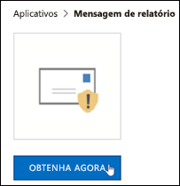
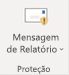
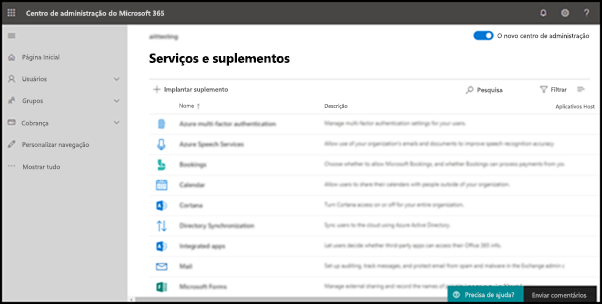
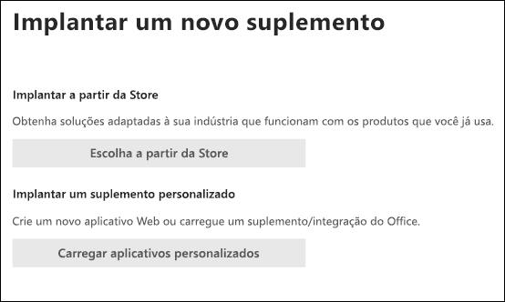
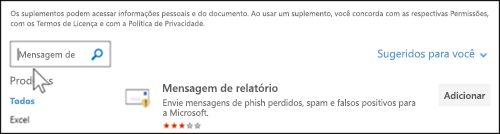
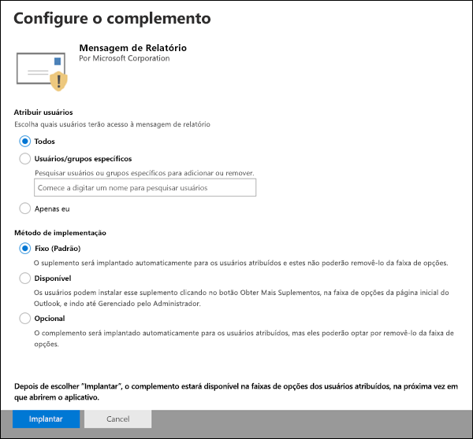
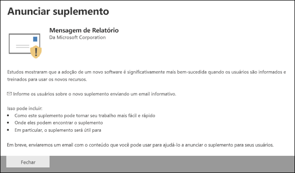
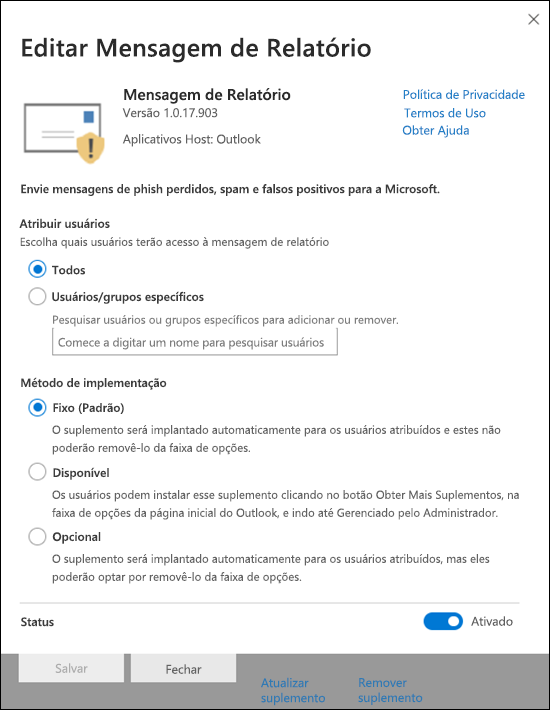
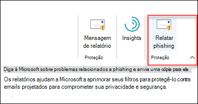
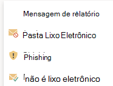

# Habilitar a Mensagem de Relatório ou os complementos de Phishing de Relatório

[!INCLUDE [Microsoft 365 Defender rebranding](../includes/microsoft-defender-for-office.md)]

**Aplica-se a**
- [Proteção do Exchange Online](exchange-online-protection-overview.md)
- [Plano 1 e plano 2 do Microsoft Defender para Office 365](defender-for-office-365.md)
- [Microsoft 365 Defender](../defender/microsoft-365-defender.md)

> [!NOTE]
> Se você for um administrador em uma organização Microsoft 365 com caixas de correio Exchange Online, recomendamos que você use a página **Envios** no portal Microsoft 365 Defender. Para obter mais informações, [consulte Use Admin Submission to submit suspected spam, phish, URLs, and files to Microsoft](admin-submission.md).

Os complementos De Relatório de Mensagens e Phishing para Outlook e Outlook na Web (anteriormente conhecidos como Outlook Web App) permitem que as pessoas reportem facilmente falsos positivos (bons emails marcados como ruins) ou falsos negativos (email ruim permitido) para a Microsoft e suas afiliadas para análise.

A Microsoft usa esses envios para melhorar a eficácia das tecnologias de proteção de email. Por exemplo, suponha que as pessoas estão relatando muitas mensagens usando o add-in De Phishing de relatório. Essas informações são publicadas no Painel de Segurança e em outros relatórios. A equipe de segurança da sua organização pode usar essas informações como uma indicação de que as políticas anti-phishing podem precisar ser atualizadas.

Você pode instalar o add-in Report Message ou Report Phishing. Se você quiser que seus usuários reportem mensagens de spam e phishing, implante o complemento Mensagem de Relatório em sua organização. Para obter mais informações, consulte Enable the Report Message add-in.

O complemento Mensagem de Relatório oferece a opção de relatar mensagens de spam e phishing. Os administradores podem habilitar o complemento Mensagem de Relatório para a organização, e usuários individuais podem instalá-lo por conta própria.

O add-in Relatório phishing fornece a opção de relatar apenas mensagens de phishing. Os administradores podem habilitar o complemento Relatar Phishing para a organização, e usuários individuais podem instalá-lo por conta própria.

Se você for um usuário individual, poderá habilitar os dois complementos para si mesmo.

Se você for um administrador global ou um administrador de Exchange Online e o Exchange estiver configurado para usar a autenticação OAuth, você poderá habilitar o complemento Mensagem de Relatório e o complemento Relatar Phishing para sua organização. Os dois complementos agora estão disponíveis por meio da [Implantação Centralizada.](../../admin/manage/centralized-deployment-of-add-ins.md)

## O que você precisa saber antes de começar?

- O complemento Mensagem de Relatório e o complemento Phishing de Relatório funcionam com a maioria das assinaturas Microsoft 365 e os seguintes produtos:
  - Outlook na Web
  - Outlook 2013 SP1 ou posterior
  - Outlook 2016 para Mac
  - Outlook incluído com Microsoft 365 aplicativos para Enterprise
  - Outlook aplicativo para iOS e Android

- Ambos os complementos não estão disponíveis para caixas de correio compartilhadas ou caixas de correio em organizações Exchange locais.

- O navegador da Web existente deve trabalhar com os complementos De Relatório Mensagem e Phishing de Relatório. Mas, se você observar que o complemento não está disponível ou não está funcionando conforme o esperado, tente um navegador diferente.

- Para as instalações organizacionais, a organização precisa ser configurada para usar a autenticação OAuth. Para obter mais informações, [consulte Determine if Centralized Deployment of add-ins works for your organization](../../admin/manage/centralized-deployment-of-add-ins.md).

- Os administradores precisam ser membros do grupo de função Administradores Globais. Para obter mais informações, veja [Permissões no portal do Microsoft 365 Defender](permissions-microsoft-365-security-center.md).

- Para obter mais informações sobre como relatar uma mensagem usando o recurso Mensagem de Relatório, consulte [Report false positives and false negatives in Outlook](report-false-positives-and-false-negatives.md).

> [!IMPORTANT]
> Não recomendamos a experiência interna de relatório no Outlook porque ela não pode usar a [política de envio do usuário.](./user-submission.md) Em vez disso, recomendamos o uso do add-in Mensagem de Relatório ou do add-in Relatar Phishing.

## Obter o complemento Mensagem de Relatório

### Obter o complemento Mensagem de Relatório para você mesmo

1. Vá para o Microsoft AppSource em <https://appsource.microsoft.com/marketplace/apps> e pesquise o complemento Mensagem de Relatório. Para ir diretamente para o add-in Mensagem de Relatório, vá para <https://appsource.microsoft.com/product/office/wa104381180> .

2. Clique **em OBTER AGORA**.

   

3. Na caixa de diálogo exibida, revise os termos de uso e política de privacidade e clique em **Continuar**.

4. Entre usando sua conta comercial ou de estudante (para uso comercial) ou sua conta da Microsoft (para uso pessoal).

Depois que o add-in for instalado e habilitado, você verá os seguintes ícones:

- Em Outlook, o ícone tem esta aparência:

  > [!div class="mx-imgBorder"]
  > 

- Em Outlook na Web, o ícone tem esta aparência:

  > [!div class="mx-imgBorder"]
  > 

### Obter o complemento Mensagem de Relatório para sua organização

> [!NOTE]
> Pode levar até 12 horas para que o complemento apareça em sua organização.

1. No Centro de administração do Microsoft 365, vá para **a** página de Configurações \> **Desem vez** em <https://admin.microsoft.com/AdminPortal/Home#/Settings/AddIns> . Se você não vir  a Página de Complementos, vá para o link Configurações  \>  \> **Aplicativos integrados,** na parte superior da página **Aplicativos** integrados.

2. Selecione **Implantar o Add-in** na parte superior da página e selecione **Próximo**.

   

3. No **sub-sub-projeto** que aparece, revise as informações e clique em **Próximo**.

4. Na próxima página, clique **em Escolher na Loja**.

   

5. Na página **Selecionar o add-in** que  aparece, clique na caixa Pesquisar, insira **Mensagem** de Relatório e clique em **Pesquisar**  Pesquisa. Na lista de resultados, encontre **Mensagem de Relatório** e clique em **Adicionar**.

   

6. Na caixa de diálogo exibida, revise as informações de licenciamento e privacidade e clique em **Continuar**.

7. Na página **Configurar o complemento** que aparece, configure as seguintes configurações:

   - **Usuários atribuídos**: Selecione um dos seguintes valores:
     - **Todos** (padrão)
     - **Usuários/grupos específicos**
     - **Só eu**

   - **Método de implantação**: selecione um dos seguintes valores:
     - **Fixo (Padrão)**: o complemento é implantado automaticamente para os usuários especificados e eles não podem removê-lo.
     - **Disponível**: os usuários podem instalar o add-in em **Home** \> **Get add-ins** \> **Admin-managed**.
     - **Opcional**: o complemento é implantado automaticamente para os usuários especificados, mas eles podem optar por removê-lo.

   

   Quando terminar, clique em **Implantar**.

8. Na página **Implantar Mensagem** de Relatório exibida, você verá um relatório de progresso seguido de uma confirmação de que o complemento foi implantado. Depois de ler as informações, clique em **Próximo**.

   

9. Na página **Anunciar o** complemento que aparece, revise as informações e clique em **Fechar**.

   

## Revisar ou editar configurações do complemento Mensagem de Relatório

1. Na Centro de administração do Microsoft 365, vá para a página  ir para a página de Configurações \> **Desem.** <https://admin.microsoft.com/AdminPortal/Home#/Settings/AddIns> Se você não vir  a Página de Complementos, vá para o link Configurações  \>  \> **Aplicativos integrados,** na parte superior da página **Aplicativos** integrados.

   

2. Encontre e selecione o complemento **Mensagem** de Relatório.

3. No flyout **Editar Relatório Mensagem** que aparece, revise e edite as configurações conforme apropriado para sua organização. Quando concluir, clique em **Salvar**.

   

## Obter o complemento Phishing de Relatório

### Obter o complemento De relatório phishing para si mesmo

1. Vá para o Microsoft AppSource em <https://appsource.microsoft.com/marketplace/apps> e pesquise o add-in De Phishing de relatório.

2. Clique **em OBTER AGORA**.

3. Na caixa de diálogo exibida, revise os termos de uso e política de privacidade e clique em **Continuar**.

4. Entre usando sua conta comercial ou de estudante (para uso comercial) ou sua conta da Microsoft (para uso pessoal).

Depois que o add-in for instalado e habilitado, você verá os seguintes ícones:

- Em Outlook, o ícone tem esta aparência:

  

- Em Outlook na Web, o ícone tem esta aparência:

  > [!div class="mx-imgBorder"]
  > 

### Obter o complemento Phishing de relatório para sua organização

> [!NOTE]
> Pode levar até 12 horas para que o complemento apareça em sua organização.

1. Na Centro de administração do Microsoft 365, vá para a página  ir para a página de Configurações \> **Desem.** <https://admin.microsoft.com/AdminPortal/Home#/Settings/AddIns> Se você não vir  a Página de Complementos, vá para o link Configurações  \>  \> **Aplicativos integrados,** na parte superior da página **Aplicativos** integrados.

2. Selecione **Implantar o Add-in** na parte superior da página e selecione **Próximo**.

   

3. No **sub-sub-projeto** que aparece, revise as informações e clique em **Próximo**.

4. Na próxima página, clique **em Escolher na Loja**.

   

5. Na página **Selecionar o add-in** que  aparece, clique na caixa Pesquisar, digite **Relatar Phishing** e clique em **Pesquisar** ícone  Pesquisa. Na lista de resultados, encontre **Relatar Phishing** e clique em **Adicionar**.

6. Na caixa de diálogo exibida, revise as informações de licenciamento e privacidade e clique em **Continuar**.

7. Na página **Configurar o complemento** que aparece, configure as seguintes configurações:

   - **Usuários atribuídos**: Selecione um dos seguintes valores:
     - **Todos** (padrão)
     - **Usuários/grupos específicos**
     - **Só eu**

   - **Método de implantação**: selecione um dos seguintes valores:
     - **Fixo (Padrão)**: o complemento é implantado automaticamente para os usuários especificados e eles não podem removê-lo.
     - **Disponível**: os usuários podem instalar o add-in em **Home** \> **Get add-ins** \> **Admin-managed**.
     - **Opcional**: o complemento é implantado automaticamente para os usuários especificados, mas eles podem optar por removê-lo.

   Quando terminar, clique em **Implantar**.

8. Na página **Implantar Phishing** de Relatório que aparece, você verá um relatório de progresso seguido de uma confirmação de que o complemento foi implantado. Depois de ler as informações, clique em **Próximo**.

9. Na página **Anunciar o** complemento que aparece, revise as informações e clique em **Fechar**.

## Revisar ou editar configurações do add-in Relatar Phishing

1. Na Centro de administração do Microsoft 365, vá para a página  ir para a página de Configurações \> **Desem.** <https://admin.microsoft.com/AdminPortal/Home#/Settings/AddIns> Se você não vir  a Página de Complementos, vá para o link Configurações  \>  \> **Aplicativos integrados,** na parte superior da página **Aplicativos** integrados.

2. Encontre e selecione o **complemento Relatar Phishing.**

3. No flyout **Editar Relatório phishing** que aparece, revise e edite as configurações conforme apropriado para sua organização. Ao finalizar, clique em **Salvar**.
