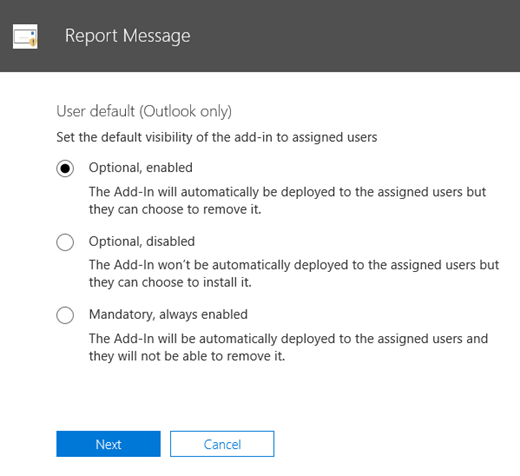
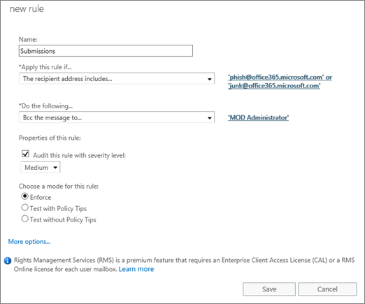
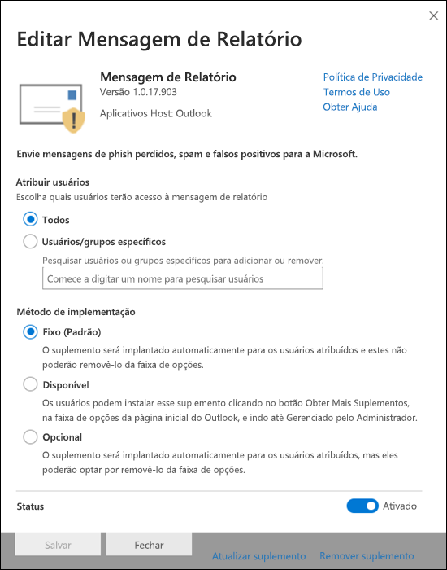

# Habilitar o suplemento de Mensagem de RelatórioEnable the Report Message add-in

> [!NOTE]
> O suplemento de mensagem de relatório para o Outlook e o Outlook na Web não é exatamente o mesmo que o [filtro de lixo eletrônico do Outlook](https://support.office.com/article/5ae3ea8e-cf41-4fa0-b02a-3b96e21de089), embora ambos possam ser usados para marcar email como lixo eletrônico, não lixo eletrônico ou uma tentativa de phishing.The Report Message add-in for Outlook and Outlook on the web is not exactly the same thing as the [Outlook Junk Email Filter](https://support.office.com/article/5ae3ea8e-cf41-4fa0-b02a-3b96e21de089), although both can be used to mark email as junk, not junk, or a phishing attempt. A diferença é, o suplemento de mensagem de relatório para o Outlook e o Outlook na Web notifica a Microsoft sobre emails não classificados, enquanto o filtro de lixo eletrônico do Outlook é usado para organizar mensagens de email na caixa de correio de um usuário.The difference is, the Report Message add-in for Outlook and Outlook on the web notifies Microsoft about misclassified email, whereas the Outlook Junk Email Filter is used to organize email messages in a user's mailbox.

## Visão GeralOverview

O suplemento de mensagem de relatório para o Outlook e o Outlook na Web (anteriormente conhecido como Outlook Web App) permite que as pessoas relatem facilmente emails mal classificados, sejam seguros ou mal-intencionados para a Microsoft e seus afiliados para análise.The Report Message add-in for Outlook and Outlook on the web (formerly known as Outlook Web App) enables people to easily report misclassified email, whether safe or malicious, to Microsoft and its affiliates for analysis. A Microsoft usa esses envios para melhorar a eficácia das tecnologias de proteção de email.Microsoft uses these submissions to improve the effectiveness of email protection technologies. Além disso, se sua organização estiver usando o [Office 365 Advanced Threat Protection Plan 1](office-365-atp.md) ou o [plano 2](office-365-ti.md), o suplemento de mensagem de relatório fornecerá a equipe de segurança da sua organização com informações úteis que podem ser usadas para analisar e atualizar as políticas de segurança.In addition, if your organization is using [Office 365 Advanced Threat Protection Plan 1](office-365-atp.md) or [Plan 2](office-365-ti.md), the Report Message add-in provides your organization's security team with useful information they can use to review and update security policies.

Por exemplo, suponha que as pessoas estejam relatando muitas mensagens como phishing.For example, suppose that people are reporting a lot of messages as phishing. Essas informações são superfícies no [painel de segurança](security-dashboard.md) e em outros relatórios.This information surfaces in the [Security Dashboard](security-dashboard.md) and other reports. A equipe de segurança da sua organização pode usar essas informações como indicação de que as políticas anti-phishing podem precisar ser atualizadas.Your organization's security team can use this information as an indication that anti-phishing policies might need to be updated. Ou, se as pessoas estiverem relatando muitas mensagens que foram sinalizadas como lixo eletrônico como não sendo lixo eletrônico usando o suplemento de mensagem de relatório, a equipe de segurança da sua organização poderá precisar ajustar [políticas antispam](configure-the-anti-spam-policies.md).Or, if people are reporting a lot of messages that were flagged as junk mail as Not Junk by using the Report Message add-in, your organization's security team might need to adjust [anti-spam policies](configure-the-anti-spam-policies.md).

O suplemento de mensagem de relatório funciona com a maioria das assinaturas do Office 365 e os seguintes produtos:The Report Message add-in works with most Office 365 subscriptions and the following products:

 - Outlook na WebOutlook on the web
 - Outlook 2013 SP1Outlook 2013 SP1
 - Outlook 2016Outlook 2016
 - Outlook 2016 para MacOutlook 2016 for Mac
 - Outlook incluído no Office 365 ProPlusOutlook included with Office 365 ProPlus

O suplemento de mensagem de relatório atualmente não está disponível para:The Report Message add-in is currently not available for:

 - Caixas de correio em organizações do Exchange localMailboxes in on-premises Exchange organizations
 - Assinaturas GCC, GCC alta ou DoDGCC, GCC HIGH, or DoD subscriptions

O navegador da Web existente deve ser suficiente para que o suplemento de mensagem de relatório funcione; no entanto, se você notar que o suplemento não está disponível ou não está funcionando conforme o esperado, tente um navegador diferente.Your existing web browser should suffice for the Report Message add-in to work; however, if you notice the add-in is not available or not working as expected, try a different browser.

Se você for um usuário individual, é possível [habilitar o relatório de suplemento de mensagens para você](#get-the-report-message-add-in-for-yourself).If you're an individual user, you can [enable the Report Message add-in for yourself](#get-the-report-message-add-in-for-yourself).

Se você for um administrador global do Office 365 ou um administrador do Exchange Online e o Exchange estiver configurado para usar a autenticação OAuth, você poderá [habilitar o suplemento de mensagem de relatório para sua organização](#get-and-enable-the-report-message-add-in-for-your-organization).If you're an Office 365 global administrator or an Exchange Online administrator, and Exchange is configured to use OAuth authentication, you can [enable the Report Message add-in for your organization](#get-and-enable-the-report-message-add-in-for-your-organization). O suplemento de mensagem de relatório agora está disponível por meio da [implantação centralizada](https://docs.microsoft.com/office365/admin/manage/centralized-deployment-of-add-ins).The Report Message Add-In is now available through [Centralized Deployment](https://docs.microsoft.com/office365/admin/manage/centralized-deployment-of-add-ins).

## Obter o suplemento de mensagem de relatório para você mesmoGet the Report Message add-in for yourself

1. No [Microsoft AppSource](https://appsource.microsoft.com/marketplace/apps), procure o [suplemento de mensagem de relatório](https://appsource.microsoft.com/product/office/wa104381180).In [Microsoft AppSource](https://appsource.microsoft.com/marketplace/apps), search for the [Report Message add-in](https://appsource.microsoft.com/product/office/wa104381180).

2. Escolha **obtê-lo agora**.Choose **GET IT NOW**.

   

3. Revise os termos de uso e política de privacidade.Review the terms of use and privacy policy. Em seguida, escolha **Continuar**.Then choose **Continue**.

4. Entre no Office 365 usando sua conta corporativa ou de estudante (para uso comercial) ou sua conta da Microsoft (para uso pessoal).Sign in to Office 365 using your work or school account (for business use) or your Microsoft account (for personal use).

Depois que o suplemento estiver instalado e habilitado, você verá os seguintes ícones:After the add-in is installed and enabled, you'll see the following icons:

- No Outlook, o ícone tem a seguinte aparência:In Outlook, the icon looks like this:

  

- No Outlook na Web (anteriormente conhecido como Outlook Web App), o ícone tem a seguinte aparência:In Outlook on the web (formerly known as Outlook Web App), the icon looks like this:

  

> [!TIP]
> Como próxima etapa, saiba como [usar o suplemento de mensagem de relatório](https://support.office.com/article/b5caa9f1-cdf3-4443-af8c-ff724ea719d2).As a next step, learn how to [Use the Report Message add-in](https://support.office.com/article/b5caa9f1-cdf3-4443-af8c-ff724ea719d2).

## Obter e habilitar o suplemento de mensagem de relatório para sua organizaçãoGet and enable the Report Message add-in for your organization

> [!IMPORTANT]
> Você deve ser um administrador global do Office 365 ou um administrador do Exchange Online para concluir essa tarefa.You must be an Office 365 global administrator or an Exchange Online Administrator to complete this task. Além disso, o Exchange deve ser configurado para usar a autenticação OAuth para saber mais, consulte [Exchange Requirements (implantação centralizada de suplementos)](https://docs.microsoft.com/office365/admin/manage/centralized-deployment-of-add-ins).In addition, Exchange must be configured to use OAuth authentication To learn more, see [Exchange requirements (Centralized Deployment of add-ins)](https://docs.microsoft.com/office365/admin/manage/centralized-deployment-of-add-ins).

1. Vá até a [página serviços & suplementos](https://admin.microsoft.com/AdminPortal/Home#/Settings/ServicesAndAddIns) no centro de administração do Microsoft 365.Go to the [Services & add-ins page](https://admin.microsoft.com/AdminPortal/Home#/Settings/ServicesAndAddIns) in the Microsoft 365 admin center.

   

2. Escolha **+ implantar suplemento**.Choose **+ Deploy Add-in**.

   

3. Na tela **novo suplemento** , revise as informações e, em seguida, escolha **Avançar**.In the **New Add-In** screen, review the information, and then choose **Next**.

   

4. Selecione **desejo adicionar um suplemento da Office Store**e, em seguida, escolha **Avançar**.Select **I want to add an Add-In from the Office Store**, and then choose **Next**.

   

5. Procure por **mensagem de relatório**e, na lista de resultados, ao lado do **suplemento de mensagem de relatório**, escolha **Adicionar**.Search for **Report Message**, and in the list of results, next to the **Report Message Add-In**, choose **Add**.

   

6. Na tela de **mensagens de relatório** , revise as informações e, em seguida, escolha **Avançar**.On the **Report Message** screen, review the information, and then choose **Next**.

   

7. Especifique as configurações padrão do usuário para o Outlook e, em seguida, escolha **Avançar**.Specify the user default settings for Outlook, and  then choose **Next**.

   

8. Especifique quem recebe o suplemento de mensagem de relatório e, em seguida, escolha **salvar**.Specify who gets the Report Message Add-in, and then choose **Save**.

   

> [!TIP]
> Recomendamos [Configurar uma regra para obter uma cópia das mensagens de email relatadas por seus usuários](#set-up-a-rule-to-get-a-copy-of-email-messages-reported-by-your-users).We recommend [setting up a rule to get a copy of email messages reported by your users](#set-up-a-rule-to-get-a-copy-of-email-messages-reported-by-your-users).

Dependendo do que você selecionou quando configurou o suplemento (etapas 7-8 acima), as pessoas em sua organização terão o [suplemento de mensagem de relatório](https://support.office.com/article/b5caa9f1-cdf3-4443-af8c-ff724ea719d2) disponível.Depending on what you selected when you set up the add-in (steps 7-8 above), people in your organization will have the [Report Message add-in](https://support.office.com/article/b5caa9f1-cdf3-4443-af8c-ff724ea719d2) available. As pessoas na sua organização verão os seguintes ícones:People in your organization will see the following icons:

- No Outlook, o ícone tem a seguinte aparência:In Outlook, the icon looks like this:

  

- No Outlook na Web, o ícone tem a seguinte aparência:In Outlook on the web, the icon looks like this:

  

> [!TIP]
> Ao notificar os usuários sobre o suplemento de mensagens de relatório, inclua um link para [usar o suplemento de mensagem de relatório](https://support.office.com/article/b5caa9f1-cdf3-4443-af8c-ff724ea719d2).When you notify users about the Report Message add-in, include a link to [Use the Report Message add-in](https://support.office.com/article/b5caa9f1-cdf3-4443-af8c-ff724ea719d2).

## Configurar uma regra para obter uma cópia das mensagens de email relatadas por seus usuáriosSet up a rule to get a copy of email messages reported by your users

> [!IMPORTANT]
> Você deve ser um administrador do Exchange Online para executar essa tarefa.You must be an Exchange Online Administrator to perform this task.

Você pode configurar uma regra para obter uma cópia das mensagens de email relatadas por usuários em sua organização.You can set up a rule to get a copy of email messages reported by users in your organization. Faça isso depois de baixar e habilitar o suplemento de mensagem de relatório para sua organização.You do this after you have downloaded and enabled the Report Message add-in for your organization.

1. No centro de administração do Exchange, escolha **regras**de **fluxo** \> de email.In the Exchange admin center, choose **mail flow** \> **rules**.

2. Escolha **+** \> **criar uma nova regra**.Choose **+** \> **Create a new rule**.

3. Na caixa **nome** , digite um nome, como envios.In the **Name** box, type a name, such as Submissions.

4. Na lista **aplicar esta regra se** , escolha **o endereço do destinatário inclui..**.In the **Apply this rule if** list, choose **The recipient address includes...**.

5. Na tela **especificar palavras ou frases** , adicione `junk@office365.microsoft.com` e `phish@office365.microsoft.com`, em seguida, escolha **OK**.In the **specify words or phrases** screen, add `junk@office365.microsoft.com` and `phish@office365.microsoft.com`, and then choose **OK**.

   

6. Na lista **faça o seguinte...** , escolha **Cco a mensagem para..**..In the **Do the following...** list, choose **Bcc the message to...**.

7. Adicione um administrador global, um administrador de segurança e/ou um leitor de segurança que deve receber uma cópia de cada mensagem de email que as pessoas relatam à Microsoft e, em seguida, escolha **OK**.Add a global administrator, security administrator, and/or security reader who should receive a copy of each email message that people report to Microsoft, and then choose **OK**.

   

8. Selecione **auditar esta regra com nível de severidade**e escolha **médio**.Select **Audit this rule with severity level**, and choose **Medium**.

9. Em **escolher um modo para essa regra**, escolha **impor**.Under **Choose a mode for this rule**, choose **Enforce**.

   

10. Selecione **Salvar**.Choose **Save**.

Com essa regra em vigor, sempre que alguém em sua organização relatar uma mensagem de email usando o suplemento de mensagem de relatório, seu administrador global, administrador de segurança e/ou leitor de segurança receberá uma cópia dessa mensagem.With this rule in place, whenever someone in your organization reports an email message using the Report Message add-in, your global administrator, security administrator, and/or security reader will receive a copy of that message. Essas informações podem permitir que você configure ou ajuste políticas, como as políticas de [links seguros de ATP do Office 365](atp-safe-links.md) ou suas configurações [antispam](anti-spam-protection.md) .This information can enable you to set up or adjust policies, such as [Office 365 ATP Safe Links](atp-safe-links.md) policies, or your [anti-spam](anti-spam-protection.md) settings.

## Saiba como usar o suplemento de mensagem de relatórioLearn how to use the Report Message add-in

Confira [usar o suplemento de mensagem de relatório](https://support.office.com/article/b5caa9f1-cdf3-4443-af8c-ff724ea719d2).See [Use the Report Message add-in](https://support.office.com/article/b5caa9f1-cdf3-4443-af8c-ff724ea719d2).

## Revise ou edite as configurações do suplemento de mensagem de relatórioReview or edit settings for the Report Message add-in

Você pode revisar e editar as configurações padrão para o suplemento de mensagem de relatório na [página de suplementos de serviços &](https://admin.microsoft.com/AdminPortal/Home#/Settings/ServicesAndAddIns).You can review and edit the default settings for the Report Message add-in on the [Services & Add-Ins page](https://admin.microsoft.com/AdminPortal/Home#/Settings/ServicesAndAddIns).

> [!IMPORTANT]
> Você deve ser um administrador global do Office 365 ou um administrador do Exchange Online para concluir essa tarefa.You must be an Office 365 global administrator or an Exchange Online Administrator to complete this task.

1. Vá até a [página serviços & suplementos](https://admin.microsoft.com/AdminPortal/Home#/Settings/ServicesAndAddIns) no centro de administração do Microsoft 365.Go to the [Services & add-ins page](https://admin.microsoft.com/AdminPortal/Home#/Settings/ServicesAndAddIns) in the Microsoft 365 admin center.

   

2. Localize e selecione o suplemento de mensagem de relatório.Find and select the Report Message add-in.

   

3. Na tela de mensagens de relatório, revise e edite as configurações conforme apropriado para sua organização.On the Report Message screen, review and edit settings as appropriate for your organization.

   

## Tópicos relacionadosRelated topics

[Usar o suplemento de mensagem de relatórioUse the Report Message add-in](https://support.office.com/article/b5caa9f1-cdf3-4443-af8c-ff724ea719d2)

[Exibir relatórios de segurança de email no &amp; centro de conformidade de segurançaView email security reports in the Security &amp; Compliance Center](view-email-security-reports.md)

[Exibir relatórios para a proteção avançada contra ameaças do Office 365View reports for Office 365 Advanced Threat Protection](view-reports-for-atp.md)

[Usar o Explorer no centro &amp; de conformidade de segurançaUse Explorer in the Security &amp; Compliance Center](threat-explorer.md)
