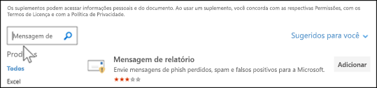
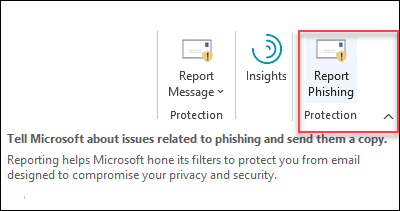

# Habilitar a Mensagem de Relatório ou os complementos de Phishing de RelatórioEnable the Report Message or the Report Phishing add-ins

[!INCLUDE [Microsoft 365 Defender rebranding](../includes/microsoft-defender-for-office.md)]

**Aplica-se a****Applies to**
- [Proteção do Exchange OnlineExchange Online Protection](exchange-online-protection-overview.md)
- [Plano 1 e plano 2 do Microsoft Defender para Office 365Microsoft Defender for Office 365 plan 1 and plan 2](defender-for-office-365.md)
- [Microsoft 365 DefenderMicrosoft 365 Defender](../defender/microsoft-365-defender.md)

> [!NOTE]
> Se você for um administrador em uma organização Microsoft 365 com caixas de correio Exchange Online, recomendamos que você use o portal Envios no Centro de Conformidade & Segurança.If you're an admin in a Microsoft 365 organization with Exchange Online mailboxes, we recommend that you use the Submissions portal in the Security & Compliance Center. Para obter mais informações, [consulte Use Admin Submission to submit suspected spam, phish, URLs, and files to Microsoft](admin-submission.md).For more information, see [Use Admin Submission to submit suspected spam, phish, URLs, and files to Microsoft](admin-submission.md).

Os complementos De Relatório de Mensagens e Phishing para Outlook e Outlook na Web (anteriormente conhecido como Outlook Web App) permitem que as pessoas reportem facilmente falsos positivos (bons emails marcados como ruins) ou falsos negativos (email ruim permitido) para a Microsoft e suas afiliadas para análise.The Report Message and Report Phishing add-ins for Outlook and Outlook on the web (formerly known as Outlook Web App) enable people to easily report false positives (good email marked as bad) or false negatives (bad email allowed) to Microsoft and its affiliates for analysis. 

A Microsoft usa esses envios para melhorar a eficácia das tecnologias de proteção de email.Microsoft uses these submissions to improve the effectiveness of email protection technologies. Por exemplo, suponha que as pessoas estão relatando muitas mensagens usando o add-in De Phishing de relatório.For example, suppose that people are reporting many messages using the Report Phishing add-in. Essas informações são publicadas no Painel de Segurança e em outros relatórios.This information surfaces in the Security Dashboard and other reports. A equipe de segurança da sua organização pode usar essas informações como uma indicação de que as políticas anti-phishing podem precisar ser atualizadas.Your organization's security team can use this information as an indication that anti-phishing policies might need to be updated. 

Você pode instalar o add-in Report Message ou Report Phishing.You can install either the Report Message or Report Phishing add-in. Se você quiser que seus usuários reportem mensagens de spam e phishing, implante o complemento Mensagem de Relatório em sua organização.If you want your users to report both spam and phishing messages, deploy the Report Message add-in in your organization. Para obter mais informações, consulte Enable the Report Message add-in.For more information, see Enable the Report Message add-in. 

O complemento Mensagem de Relatório oferece a opção de relatar mensagens de spam e phishing.The Report Message add-in provides the option to report both spam and phishing messages. Os administradores podem habilitar o complemento Mensagem de Relatório para a organização, e usuários individuais podem instalá-lo por conta própria.Admins can enable the Report Message add-in for the organization, and individual users can install it for themselves. 

O add-in Relatório phishing fornece a opção de relatar apenas mensagens de phishing.The Report Phishing add-in provides the option to report only phishing messages. Os administradores podem habilitar o complemento Relatar Phishing para a organização, e usuários individuais podem instalá-lo por conta própria.Admins can enable the Report Phishing add-in for the organization, and individual users can install it for themselves. 

Se você for um usuário individual, poderá habilitar os dois complementos para si mesmo.If you're an individual user, you can enable both the add-ins for yourself.

Se você for um administrador global ou um administrador de Exchange Online e o Exchange estiver configurado para usar a autenticação OAuth, você poderá habilitar o complemento Mensagem de Relatório e o complemento Relatar Phishing para sua organização.If you're a global administrator or an Exchange Online administrator, and Exchange is configured to use OAuth authentication, you can enable the Report Message add-in and the Report Phishing add-in for your organization. Os dois complementos agora estão disponíveis por meio da [Implantação Centralizada.](../../admin/manage/centralized-deployment-of-add-ins.md)Both add-ins are now available through [Centralized Deployment](../../admin/manage/centralized-deployment-of-add-ins.md).

## Do que você precisa saber para começar?What do you need to know before you begin?

- O complemento Mensagem de Relatório e o complemento Phishing de Relatório funcionam com a maioria das assinaturas Microsoft 365 e os seguintes produtos:Both the Report Message add-in and the Report Phishing add-in works with most Microsoft 365 subscriptions and the following products:
  - Outlook na WebOutlook on the web
  - Outlook 2013 SP1 ou posteriorOutlook 2013 SP1 or later
  - Outlook 2016 para MacOutlook 2016 for Mac
  - Outlook incluído com Microsoft 365 aplicativos para EnterpriseOutlook included with Microsoft 365 apps for Enterprise
  - Outlook aplicativo para iOS e AndroidOutlook app for iOS and Android

- Ambos os complementos não estão disponíveis para caixas de correio compartilhadas ou caixas de correio em organizações Exchange locais.Both add-ins are not available for shared mailboxes or mailboxes in on-premises Exchange organizations.

- O navegador da Web existente deve trabalhar com os complementos De Relatório Mensagem e Phishing de Relatório. Mas, se você observar que o complemento não está disponível ou não está funcionando conforme o esperado, tente um navegador diferente.Your existing web browser should work with both the Report Message and Report Phishing add-ins. But, if you notice the add-in is not available or not working as expected, try a different browser.

- Para as instalações organizacionais, a organização precisa ser configurada para usar a autenticação OAuth.For organizational installs, the organization needs to be configured to use OAuth authentication. Para obter mais informações, [consulte Determine if Centralized Deployment of add-ins works for your organization](../../admin/manage/centralized-deployment-of-add-ins.md).For more information, see [Determine if Centralized Deployment of add-ins works for your organization](../../admin/manage/centralized-deployment-of-add-ins.md).

- Os administradores precisam ser membros do grupo de função Administradores Globais.Admins need to be a member of the Global admins role group. Para saber mais, confira [Permissões no Centro de Conformidade e Segurança](permissions-in-the-security-and-compliance-center.md).For more information, see [Permissions in the Security & Compliance Center](permissions-in-the-security-and-compliance-center.md).

- Para obter mais informações sobre como relatar uma mensagem usando o recurso Mensagem de Relatório, consulte [Report false positives and false negatives in Outlook](report-false-positives-and-false-negatives.md).For more information on how to report a message using the Report Message feature, see [Report false positives and false negatives in Outlook](report-false-positives-and-false-negatives.md).

> [!IMPORTANT]
> Não recomendamos a experiência interna de relatório no Outlook porque ela não pode usar a [política de envio do usuário.](./user-submission.md)We don't recommend the built-in reporting experience in Outlook because it can't use the [user submission policy](./user-submission.md). Em vez disso, recomendamos o uso do add-in Mensagem de Relatório ou do add-in Relatar Phishing.We recommend using the Report Message add-in or the Report Phishing add-in instead.

## Obter o complemento Mensagem de RelatórioGet the Report Message add-in

### Obter o complemento para você mesmoGet the add-in for yourself

1. Vá para o Microsoft AppSource em <https://appsource.microsoft.com/marketplace/apps> e pesquise o complemento Mensagem de Relatório.Go to the Microsoft AppSource at <https://appsource.microsoft.com/marketplace/apps> and search for the Report Message add-in. Para ir diretamente para o add-in Mensagem de Relatório, vá para <https://appsource.microsoft.com/product/office/wa104381180> .To go directly to the Report Message add-in, go to <https://appsource.microsoft.com/product/office/wa104381180>.

2. Clique **em OBTER AGORA**.Click **GET IT NOW**.

   

3. Na caixa de diálogo exibida, revise os termos de uso e política de privacidade e clique em **Continuar**.In the dialog that appears, review the terms of use and privacy policy, and then click **Continue**.

4. Entre usando sua conta comercial ou de estudante (para uso comercial) ou sua conta da Microsoft (para uso pessoal).Sign in using your work or school account (for business use) or your Microsoft account (for personal use).

Depois que o add-in for instalado e habilitado, você verá os seguintes ícones:After the add-in is installed and enabled, you'll see the following icons:

- Em Outlook, o ícone tem esta aparência:In Outlook, the icon looks like this:

  > [!div class="mx-imgBorder"]
  > 

- Em Outlook na Web, o ícone tem esta aparência:In Outlook on the web, the icon looks like this:

  > [!div class="mx-imgBorder"]
  > 

### Obter o complemento para sua organizaçãoGet the add-in for your organization

> [!NOTE]
> Pode levar até 12 horas para que o complemento apareça em sua organização.It could take up to 12 hours for the add-in to appear in your organization.

1. No centro Microsoft 365 de administração, vá para  a página de Configurações de \> **Configurações em** <https://admin.microsoft.com/AdminPortal/Home#/Settings/AddIns> .In the Microsoft 365 admin center, go to the go to the **Settings** \> **Add-ins** page at <https://admin.microsoft.com/AdminPortal/Home#/Settings/AddIns>. Se você não vir  a Página de Complementos, vá para o link Configurações  \>  \> **Aplicativos integrados,** na parte superior da página **Aplicativos** integrados.If you don't see the **Add-in** Page, go to the **Settings** \> **Integrated apps** \> **Add-ins** link on the top of the **Integrated apps** page.

2. Selecione **Implantar o Add-in** na parte superior da página e selecione **Próximo**.Select **Deploy Add-in** at the top of the page, and then select **Next**.

   

3. No **sub-sub-projeto** que aparece, revise as informações e clique em **Próximo**.In the **Deploy a new add-in** flyout that appears, review the information, and then click **Next**.

4. Na próxima página, clique **em Escolher na Loja**.On the next page, click **Choose from the Store**.

   

5. Na página **Selecionar o add-in** que  aparece, clique na caixa Pesquisar, insira **Mensagem** de Relatório e clique em **Pesquisar**  Pesquisa.In the **Select add-in** page that appears, click in the **Search** box, enter **Report Message**, and then click **Search** . Na lista de resultados, encontre **Mensagem de Relatório** e clique em **Adicionar**.In the list of results, find **Report Message** and then click **Add**.

   

6. Na caixa de diálogo exibida, revise as informações de licenciamento e privacidade e clique em **Continuar**.In the dialog that appears, review the licensing and privacy information, and then click **Continue**.

7. Na página **Configurar o complemento** que aparece, configure as seguintes configurações:In the **Configure add-in** page that appears, configure the following settings:

   - **Usuários atribuídos**: Selecione um dos seguintes valores:**Assigned users**: Select one of the following values:

     - **Todos** (padrão)**Everyone** (default)
     - **Usuários/grupos específicos****Specific users / groups**
     - **Só eu****Just me**

   - **Método de implantação**: selecione um dos seguintes valores:**Deployment method**: Select one of the following values:

     - **Fixo (Padrão)**: o complemento é implantado automaticamente para os usuários especificados e eles não podem removê-lo.**Fixed (Default)**: The add-in is automatically deployed to the specified users and they can't remove it.
     - **Disponível**: os usuários podem instalar o add-in em **Home** \> **Get add-ins** \> **Admin-managed**.**Available**: Users can install the add-in at **Home** \> **Get add-ins** \> **Admin-managed**.
     - **Opcional**: o complemento é implantado automaticamente para os usuários especificados, mas eles podem optar por removê-lo.**Optional**: The add-in is automatically deployed to the specified users, but they can choose to remove it.

   

   Quando terminar, clique em **Implantar**.When you're finished, click **Deploy**.

8. Na página **Implantar Mensagem** de Relatório exibida, você verá um relatório de progresso seguido de uma confirmação de que o complemento foi implantado.In the **Deploy Report Message** page that appears, you'll see a progress report followed by a confirmation that the add-in was deployed. Depois de ler as informações, clique em **Próximo**.After you read the information, click **Next**.

   

9. Na página **Anunciar o** complemento que aparece, revise as informações e clique em **Fechar**.On the **Announce add-in** page that appears, review the information, and then click **Close**.

   

## Revisar ou editar configurações do complemento Mensagem de RelatórioReview or edit settings for the Report Message add-in

1. No centro Microsoft 365 de administração, vá para  a página de Configurações de \> **Configurações em** <https://admin.microsoft.com/AdminPortal/Home#/Settings/AddIns> .In the Microsoft 365 admin center, go to the go to the **Settings** \> **Add-ins** page at <https://admin.microsoft.com/AdminPortal/Home#/Settings/AddIns>. Se você não vir  a Página de Complementos, vá para o link Configurações  \>  \> **Aplicativos integrados,** na parte superior da página **Aplicativos** integrados.If you don't see the **Add-in** Page, go to the **Settings** \> **Integrated apps** \> **Add-ins** link on the top of the **Integrated apps** page.

   

2. Encontre e selecione o complemento **Mensagem** de Relatório.Find and select the **Report Message** add-in.

3. No flyout **Editar Relatório Mensagem** que aparece, revise e edite as configurações conforme apropriado para sua organização.In the **Edit Report Message** flyout that appears, review and edit settings as appropriate for your organization. Quando concluir, clique em **Salvar**.When you're finished, click **Save**.

   

## Obter o complemento Phishing de RelatórioGet the Report Phishing add-in

### Obter o complemento para você mesmoGet the add-in for yourself

1. Vá para o Microsoft AppSource em <https://appsource.microsoft.com/marketplace/apps> e pesquise o add-in De Phishing de relatório.Go to the Microsoft AppSource at <https://appsource.microsoft.com/marketplace/apps> and search for the Report Phishing add-in.

2. Clique **em OBTER AGORA**.Click **GET IT NOW**.

3. Na caixa de diálogo exibida, revise os termos de uso e política de privacidade e clique em **Continuar**.In the dialog that appears, review the terms of use and privacy policy, and then click **Continue**.

4. Entre usando sua conta comercial ou de estudante (para uso comercial) ou sua conta da Microsoft (para uso pessoal).Sign in using your work or school account (for business use) or your Microsoft account (for personal use).

Depois que o add-in for instalado e habilitado, você verá os seguintes ícones:After the add-in is installed and enabled, you'll see the following icons:

- Em Outlook, o ícone tem esta aparência:In Outlook, the icon looks like this:

  

- Em Outlook na Web, o ícone tem esta aparência:In Outlook on the web, the icon looks like this:

  > [!div class="mx-imgBorder"]
  > 

### Obter o complemento para sua organizaçãoGet the add-in for your organization

> [!NOTE]
> Pode levar até 12 horas para que o complemento apareça em sua organização.It could take up to 12 hours for the add-in to appear in your organization.

1. No centro Microsoft 365 de administração, vá para  a página de Configurações de \> **Configurações em** <https://admin.microsoft.com/AdminPortal/Home#/Settings/AddIns> .In the Microsoft 365 admin center, go to the go to the **Settings** \> **Add-ins** page at <https://admin.microsoft.com/AdminPortal/Home#/Settings/AddIns>. Se você não vir  a Página de Complementos, vá para o link Configurações  \>  \> **Aplicativos integrados,** na parte superior da página **Aplicativos** integrados.If you don't see the **Add-in** Page, go to the **Settings** \> **Integrated apps** \> **Add-ins** link on the top of the **Integrated apps** page.

2. Selecione **Implantar o Add-in** na parte superior da página e selecione **Próximo**.Select **Deploy Add-in** at the top of the page, and then select **Next**.

   

3. No **sub-sub-projeto** que aparece, revise as informações e clique em **Próximo**.In the **Deploy a new add-in** flyout that appears, review the information, and then click **Next**.

4. Na próxima página, clique **em Escolher na Loja**.On the next page, click **Choose from the Store**.

   

5. Na página **Selecionar o add-in** que  aparece, clique na caixa Pesquisar, digite **Relatar Phishing** e clique em **Pesquisar** ícone  Pesquisa.In the **Select add-in** page that appears, click in the **Search** box, enter **Report Phishing**, and then click **Search** . Na lista de resultados, encontre **Relatar Phishing** e clique em **Adicionar**.In the list of results, find **Report Phishing** and then click **Add**.

6. Na caixa de diálogo exibida, revise as informações de licenciamento e privacidade e clique em **Continuar**.In the dialog that appears, review the licensing and privacy information, and then click **Continue**.

7. Na página **Configurar o complemento** que aparece, configure as seguintes configurações:In the **Configure add-in** page that appears, configure the following settings:

   - **Usuários atribuídos**: Selecione um dos seguintes valores:**Assigned users**: Select one of the following values:

     - **Todos** (padrão)**Everyone** (default)
     - **Usuários/grupos específicos****Specific users / groups**
     - **Só eu****Just me**

   - **Método de implantação**: selecione um dos seguintes valores:**Deployment method**: Select one of the following values:

     - **Fixo (Padrão)**: o complemento é implantado automaticamente para os usuários especificados e eles não podem removê-lo.**Fixed (Default)**: The add-in is automatically deployed to the specified users and they can't remove it.
     - **Disponível**: os usuários podem instalar o add-in em **Home** \> **Get add-ins** \> **Admin-managed**.**Available**: Users can install the add-in at **Home** \> **Get add-ins** \> **Admin-managed**.
     - **Opcional**: o complemento é implantado automaticamente para os usuários especificados, mas eles podem optar por removê-lo.**Optional**: The add-in is automatically deployed to the specified users, but they can choose to remove it.

   Quando terminar, clique em **Implantar**.When you're finished, click **Deploy**.

8. Na página **Implantar Phishing** de Relatório que aparece, você verá um relatório de progresso seguido de uma confirmação de que o complemento foi implantado.In the **Deploy Report Phishing** page that appears, you'll see a progress report followed by a confirmation that the add-in was deployed. Depois de ler as informações, clique em **Próximo**.After you read the information, click **Next**.

9. Na página **Anunciar o** complemento que aparece, revise as informações e clique em **Fechar**.On the **Announce add-in** page that appears, review the information, and then click **Close**.

## Revisar ou editar configurações do add-in Relatar PhishingReview or edit settings for the Report Phishing add-in

1. No centro Microsoft 365 de administração, vá para  a página de Configurações de \> **Configurações em** <https://admin.microsoft.com/AdminPortal/Home#/Settings/AddIns> .In the Microsoft 365 admin center, go to the go to the **Settings** \> **Add-ins** page at <https://admin.microsoft.com/AdminPortal/Home#/Settings/AddIns>. Se você não vir  a Página de Complementos, vá para o link Configurações  \>  \> **Aplicativos integrados,** na parte superior da página **Aplicativos** integrados.If you don't see the **Add-in** Page, go to the **Settings** \> **Integrated apps** \> **Add-ins** link on the top of the **Integrated apps** page.

2. Encontre e selecione o **complemento Relatar Phishing.**Find and select the **Report Phishing** add-in.

3. No flyout **Editar Relatório phishing** que aparece, revise e edite as configurações conforme apropriado para sua organização.In the **Edit Report Phishing** flyout that appears, review, and edit settings as appropriate for your organization. Ao finalizar, clique em **Salvar**.When you're finished, click **Save**.
