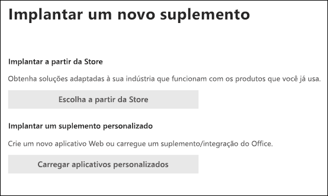

# Habilite o suplemento Relatório de PhishingEnable the Report Phishing add-in

[!INCLUDE [Microsoft 365 Defender rebranding](../includes/microsoft-defender-for-office.md)]

> [!NOTE]
> Se você for um administrador em uma organização do Microsoft 365 com caixas de correio do Exchange Online, recomendamos usar o portal Envios no Centro de Conformidade e Segurança & Segurança.If you're an admin in a Microsoft 365 organization with Exchange Online mailboxes, we recommend that you use the Submissions portal in the Security & Compliance Center. Para obter mais informações, consulte Usar o Envio de Administrador para [enviar spam, phishing, URLs e arquivos suspeitos para a Microsoft.](admin-submission.md)For more information, see [Use Admin Submission to submit suspected spam, phish, URLs, and files to Microsoft](admin-submission.md).

Os complementos De Relatório de Mensagem e Phishing para Outlook e Outlook na Web (anteriormente conhecido como Outlook Web App) permitem que as pessoas reportem facilmente falsos positivos (emails válidos marcados como ruins) ou falsos negativos (emails ruins permitidos) para a Microsoft e suas afiliadas para análise.The Report Message and Report Phishing add-ins for Outlook and Outlook on the web (formerly known as Outlook Web App) enable people to easily report false positives (good email marked as bad) or false negatives (bad email allowed) to Microsoft and its affiliates for analysis.

A Microsoft usa esses envios para melhorar a eficácia das tecnologias de proteção de email.Microsoft uses these submissions to improve the effectiveness of email protection technologies. Por exemplo, suponha que as pessoas estão relatando muitas mensagens usando o complemento Phishing de Relatório.For example, suppose that people are reporting many messages using the Report Phishing add-in. Essas informações são fornecidas no Painel [de Segurança e](security-dashboard.md) em outros relatórios.This information surfaces in the [Security Dashboard](security-dashboard.md) and other reports. A equipe de segurança da sua organização pode usar essas informações como uma indicação de que as políticas anti-phishing talvez precisem ser atualizadas.Your organization's security team can use this information as an indication that anti-phishing policies might need to be updated.

Você pode instalar o complemento Mensagem de Relatório ou Phishing de Relatório.You can install either the Report Message or Report Phishing add-in. Se você quiser que os usuários reportem mensagens de spam e phishing, implante o complemento Mensagem de Relatório em sua organização.If you want your users to report both spam and phishing messages, deploy the Report Message add-in in your organization. Para obter mais informações, [consulte Habilitar o complemento Mensagem de Relatório.](enable-the-report-message-add-in.md)For more information, see [Enable the Report Message add-in](enable-the-report-message-add-in.md).

O complemento De Relatório de Phishing oferece a opção de relatar apenas mensagens de phishing.The Report Phishing add-in provides the option to report only phishing messages. Os administradores podem habilitar o complemento Phishing de Relatório para a organização, e usuários individuais podem instalá-lo por conta própria.Admins can enable the Report Phishing add-in for the organization, and individual users can install it for themselves.

Se você for um usuário individual, poderá habilitar o complemento [Phishing de Relatório para si mesmo.](#get-the-report-phishing-add-in-for-yourself)If you're an individual user, you can [enable the Report Phishing add-in for yourself](#get-the-report-phishing-add-in-for-yourself).

Se você for um administrador global ou um administrador do Exchange Online e o Exchange estiver configurado para usar a autenticação OAuth, você poderá habilitar o complemento Phishing de Relatório para [sua organização.](#get-and-enable-the-report-phishing-add-in-for-your-organization)If you're a global administrator or an Exchange Online administrator, and Exchange is configured to use OAuth authentication, you can [enable the Report Phishing add-in for your organization](#get-and-enable-the-report-phishing-add-in-for-your-organization). O relatório de Add-In phishing agora está disponível por meio [da Implantação Centralizada.](https://docs.microsoft.com/microsoft-365/admin/manage/centralized-deployment-of-add-ins)The Report Phishing Add-In is now available through [Centralized Deployment](https://docs.microsoft.com/microsoft-365/admin/manage/centralized-deployment-of-add-ins).

## O que você precisa saber antes de começar?What do you need to know before you begin?

- O complemento De Phishing de Relatório funciona com a maioria das assinaturas do Microsoft 365 e os seguintes produtos:The Report Phishing add-in works with most Microsoft 365 subscriptions and the following products:

  - Outlook na WebOutlook on the web
  - Outlook 2013 SP1 ou posteriorOutlook 2013 SP1 or later
  - Outlook 2016 para MacOutlook 2016 for Mac
  - Outlook incluído nos aplicativos do Microsoft 365 para EmpresasOutlook included with Microsoft 365 apps for Enterprise

- O complemento De Phishing de Relatório não está disponível para caixas de correio em organizações locais do Exchange.The Report Phishing add-in is not available for mailboxes in on-premises Exchange organizations.

- Você pode configurar mensagens relatadas para serem copiadas ou redirecionadas para uma caixa de correio que você especificar.You can configure reported messages to be copied or redirected to a mailbox that you specify. Para obter mais informações, consulte [Políticas de envios de usuário.](user-submission.md)For more information, see [User submissions policies](user-submission.md).

- Seu navegador da Web existente deve funcionar com o complemento Phishing de Relatório.Your existing web browser should work with the Report Phishing add-in. Porém, se você perceber que o complemento não está disponível ou não está funcionando conforme o esperado, tente outro navegador.But, if you notice the add-in is not available or not working as expected, try a different browser.

- Para as instalações organizacionais, a organização precisa ser configurada para usar a autenticação OAuth.For organizational installs, the organization needs to be configured to use OAuth authentication. Para obter mais informações, [consulte Determinar se a Implantação Centralizada de complementos funciona para sua organização.](../../admin/manage/centralized-deployment-of-add-ins.md)For more information, see [Determine if Centralized Deployment of add-ins works for your organization](../../admin/manage/centralized-deployment-of-add-ins.md).

- Os administradores precisam ser membros do grupo de funções Administradores globais.Admins need to be a member of the Global admins role group. Para saber mais, confira [Permissões no Centro de Conformidade de Segurança](permissions-in-the-security-and-compliance-center.md).For more information, see [Permissions in the Security & Compliance Center](permissions-in-the-security-and-compliance-center.md).

## Obter o add-in de Phishing de relatório por si mesmoGet the Report Phishing add-in for yourself

1. Vá para o Microsoft AppSource em <https://appsource.microsoft.com/marketplace/apps> e pesquise o complemento Phishing de relatório.Go to the Microsoft AppSource at <https://appsource.microsoft.com/marketplace/apps> and search for the Report Phishing add-in.

2. Clique **EM OBTER AGORA.**Click **GET IT NOW**.

3. Na caixa de diálogo exibida, revise os termos de uso e a política de privacidade e clique em **Continuar.**In the dialog that appears, review the terms of use and privacy policy, and then click **Continue**.

4. Entre usando sua conta comercial ou de estudante (para uso comercial) ou sua conta da Microsoft (para uso pessoal).Sign in using your work or school account (for business use) or your Microsoft account (for personal use).

Depois que o complemento for instalado e habilitado, você verá os seguintes ícones:After the add-in is installed and enabled, you'll see the following icons:

- No Outlook, o ícone tem esta aparência:In Outlook, the icon looks like this:

  

- No Outlook na Web, o ícone tem esta aparência:In Outlook on the web, the icon looks like this:

  

## Obter e habilitar o add-in de Phishing de Relatório para sua organizaçãoGet and enable the Report Phishing add-in for your organization

> [!NOTE]
> Pode levar até 12 horas para que o complemento apareça em sua organização.It could take up to 12 hours for the add-in to appear in your organization.

1. No Centro de administração do Microsoft 365, vá para a página Configurações de  \> **Add-ins** em , Se você não vir a Página de Complementos, vá para o link Configurações Integradas de <https://admin.microsoft.com/AdminPortal/Home#/Settings/AddIns>  Aplicativos, na parte superior da página **Aplicativos integrados.** \>  \>  In the Microsoft 365 admin center, go to the go to the **Settings** \> **Add-ins** page at <https://admin.microsoft.com/AdminPortal/Home#/Settings/AddIns>, If you don't see the **Add-in** Page, go to the **Settings** \> **Integrated apps** \> **Add-ins** link on the top of the **Integrated apps** page.

2. Selecione **Implantar o add-in** na parte superior da página e, em seguida, **selecione Próximo**.Select **Deploy Add-in** at the top of the page, and then select **Next**.

   

3. In the **Deploy a new add-in** flyout that appears, review the information, and then click **Next**.In the **Deploy a new add-in** flyout that appears, review the information, and then click **Next**.

4. Na próxima página, clique **em Escolher na Loja.**On the next page, click **Choose from the Store**.

   

5. Na página Selecionar **add-in** exibida,  clique na caixa Pesquisar, insira  **Phishing** de Relatório e clique no ícone  Pesquisar.In the **Select add-in** page that appears, click in the **Search** box, enter **Report Phishing**, and then click **Search** . Na lista de resultados, encontre **Phishing de Relatório** e clique em **Adicionar.**In the list of results, find **Report Phishing** and then click **Add**.

6. Na caixa de diálogo exibida, revise as informações de licenciamento e privacidade e clique em **Continuar.**In the dialog that appears, review the licensing and privacy information, and then click **Continue**.

7. Na página **Configurar o complemento** exibida, de configure as seguintes configurações:In the **Configure add-in** page that appears, configure the following settings:

   - **Usuários atribuídos:** selecione um dos seguintes valores:**Assigned users**: Select one of the following values:

     - **Todos** (padrão)**Everyone** (default)
     - **Usuários/grupos específicos****Specific users / groups**
     - **Somente eu****Just me**

   - **Método de** implantação: selecione um dos seguintes valores:**Deployment method**: Select one of the following values:

     - **Corrigido (padrão)**: o complemento é implantado automaticamente para os usuários especificados e não pode removê-lo.**Fixed (Default)**: The add-in is automatically deployed to the specified users and they can't remove it.
     - **Disponível:** os usuários podem instalar o add-in em **Home** \> **Get add-ins** \> **Admin-managed**.**Available**: Users can install the add-in at **Home** \> **Get add-ins** \> **Admin-managed**.
     - **Opcional**: o complemento é implantado automaticamente para os usuários especificados, mas eles podem optar por removê-lo.**Optional**: The add-in is automatically deployed to the specified users, but they can choose to remove it.

   Quando terminar, clique em **Implantar.**When you're finished, click **Deploy**.

8. Na página **Implantar Phishing** de Relatório exibida, você verá um relatório de progresso seguido de uma confirmação de que o complemento foi implantado.In the **Deploy Report Phishing** page that appears, you'll see a progress report followed by a confirmation that the add-in was deployed. Depois de ler as informações, clique em **Próximo.**After you read the information, click **Next**.

9. Na página **Anunciar o complemento** que aparece, revise as informações e clique em **Fechar.**On the **Announce add-in** page that appears, review the information, and then click **Close**.

## Saiba como usar o complemento Phishing de RelatórioLearn how to use the Report Phishing add-in

As pessoas que têm o complemento atribuído a elas verão os seguintes ícones:People who have the add-in assigned to them will see the following icons:

- No Outlook, o ícone tem esta aparência:In Outlook, the icon looks like this:

  

- No Outlook na Web, o ícone tem esta aparência:In Outlook on the web, the icon looks like this:

  

## Revisar ou editar configurações para o add-in de Phishing de RelatórioReview or edit settings for the Report Phishing add-in

1. No Centro de administração do Microsoft 365, vá para a página Configurações de  \> **Add-ins** em , Se você não vir a Página de Complementos, vá para o link Configurações Integradas de <https://admin.microsoft.com/AdminPortal/Home#/Settings/AddIns>  Aplicativos, na parte superior da página **Aplicativos integrados.** \>  \>  In the Microsoft 365 admin center, go to the go to the **Settings** \> **Add-ins** page at <https://admin.microsoft.com/AdminPortal/Home#/Settings/AddIns>, If you don't see the **Add-in** Page, go to the **Settings** \> **Integrated apps** \> **Add-ins** link on the top of the **Integrated apps** page.

2. Encontre e selecione o **add-in De Phishing** de Relatório.Find and select the **Report Phishing** add-in.

3. No flyout **Editar Relatório de Phishing** que aparece, revise e edite as configurações conforme apropriado para sua organização.In the **Edit Report Phishing** flyout that appears, review, and edit settings as appropriate for your organization. Quando concluir, clique em **Salvar**.When you're finished, click **Save**.

## Exibir e revisar mensagens relatadasView and review reported messages

Para revisar as mensagens que os usuários relatam à Microsoft, você tem estas opções:To review messages that users report to Microsoft, you have these options:

- Use o portal de Envios de Administrador.Use the Admin Submissions portal. Para obter mais informações, [consulte Exibir envios de usuário para a Microsoft.](admin-submission.md#view-user-submissions-to-microsoft)For more information, see [View user submissions to Microsoft](admin-submission.md#view-user-submissions-to-microsoft).

- Crie uma regra de fluxo de emails (também conhecida como regra de transporte) para enviar cópias das mensagens relatadas.Create a mail flow rule (also known as a transport rule) to send copies of reported messages. Para obter instruções, [confira Usar regras de fluxo de emails para ver o que seus usuários estão relatando à Microsoft.](use-mail-flow-rules-to-see-what-your-users-are-reporting-to-microsoft.md)For instructions, see [Use mail flow rules to see what your users are reporting to Microsoft](use-mail-flow-rules-to-see-what-your-users-are-reporting-to-microsoft.md).