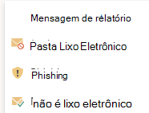

# Habilite o suplemento Relatório de Phishing

[!INCLUDE [Microsoft 365 Defender rebranding](../includes/microsoft-defender-for-office.md)]

> [!NOTE]
> Se você for um administrador em uma organização do Microsoft 365 com caixas de correio do Exchange Online, recomendamos usar o portal Envios no Centro de Conformidade e Segurança & Segurança. Para obter mais informações, consulte Usar o Envio de Administrador [para enviar spam, phishing, URLs e arquivos suspeitos para a Microsoft.](admin-submission.md)

Os complementos De Relatório de Mensagem e Phishing para Outlook e Outlook na Web (anteriormente conhecido como Outlook Web App) permitem que as pessoas reportem facilmente falsos positivos (emails válidos marcados como ruins) ou falsos negativos (emails ruins permitidos) para a Microsoft e suas afiliadas para análise.

A Microsoft usa esses envios para melhorar a eficácia das tecnologias de proteção de email. Por exemplo, suponha que as pessoas estão relatando muitas mensagens usando o complemento Phishing de Relatório. Essas informações são fornecidas no Painel [de Segurança e](security-dashboard.md) em outros relatórios. A equipe de segurança da sua organização pode usar essas informações como uma indicação de que as políticas anti-phishing talvez precisem ser atualizadas.

Você pode instalar o complemento Mensagem de Relatório ou Phishing de Relatório. Se você quiser que os usuários reportem mensagens de spam e phishing, implante o complemento Mensagem de Relatório em sua organização. Para obter mais informações, [consulte Habilitar o complemento Mensagem de Relatório.](enable-the-report-message-add-in.md)

O complemento De Relatório de Phishing oferece a opção de relatar apenas mensagens de phishing. Os administradores podem habilitar o complemento Phishing de Relatório para a organização, e usuários individuais podem instalá-lo por conta própria.

Se você for um usuário individual, poderá habilitar o complemento [Phishing de Relatório para si mesmo.](#get-the-report-phishing-add-in-for-yourself)

Se você for um administrador global ou um administrador do Exchange Online e o Exchange estiver configurado para usar a autenticação OAuth, você poderá habilitar o complemento Phishing de Relatório para [sua organização.](#get-and-enable-the-report-phishing-add-in-for-your-organization) O relatório de Add-In phishing agora está disponível por meio [da Implantação Centralizada.](https://docs.microsoft.com/microsoft-365/admin/manage/centralized-deployment-of-add-ins)

## O que você precisa saber antes de começar?

- O complemento De Phishing de Relatório funciona com a maioria das assinaturas do Microsoft 365 e os seguintes produtos:

  - Outlook na Web
  - Outlook 2013 SP1 ou posterior
  - Outlook 2016 para Mac
  - Outlook incluído nos aplicativos do Microsoft 365 para Empresas
  - Aplicativo outlook para iOS e Android

- O complemento De Phishing de Relatório não está disponível para caixas de correio em organizações locais do Exchange.

- Você pode configurar mensagens relatadas para serem copiadas ou redirecionadas para uma caixa de correio que você especificar. Para obter mais informações, consulte [Políticas de envios de usuário.](user-submission.md)

- Seu navegador da Web existente deve funcionar com o complemento Phishing de Relatório. Porém, se você perceber que o complemento não está disponível ou não está funcionando conforme o esperado, tente outro navegador.

- Para as instalações organizacionais, a organização precisa ser configurada para usar a autenticação OAuth. Para obter mais informações, [consulte Determinar se a Implantação Centralizada de complementos funciona para sua organização.](../../admin/manage/centralized-deployment-of-add-ins.md)

- Os administradores precisam ser membros do grupo de funções Administradores globais. Para saber mais, confira [Permissões no Centro de Conformidade de Segurança](permissions-in-the-security-and-compliance-center.md).

## Obter o add-in de Phishing de relatório por si mesmo

1. Vá para o Microsoft AppSource em <https://appsource.microsoft.com/marketplace/apps> e pesquise o complemento Phishing de relatório.

2. Clique **EM OBTER AGORA.**

3. Na caixa de diálogo exibida, revise os termos de uso e a política de privacidade e clique em **Continuar.**

4. Entre usando sua conta comercial ou de estudante (para uso comercial) ou sua conta da Microsoft (para uso pessoal).

Depois que o complemento for instalado e habilitado, você verá os seguintes ícones:

- No Outlook, o ícone tem esta aparência:

  

- No Outlook na Web, o ícone tem esta aparência:

  

## Obter e habilitar o add-in de Phishing de Relatório para sua organização

> [!NOTE]
> Pode levar até 12 horas para que o complemento apareça em sua organização.

1. No Centro de administração do Microsoft 365, vá para a página Configurações de  \> **Add-ins** em , Se você não vir a Página de Complementos, vá para o link Configurações Integradas de <https://admin.microsoft.com/AdminPortal/Home#/Settings/AddIns>  Aplicativos, na parte superior da página **Aplicativos integrados.** \>  \>  

2. Selecione **Implantar o add-in** na parte superior da página e, em seguida, **selecione Próximo**.

   

3. In the **Deploy a new add-in** flyout that appears, review the information, and then click **Next**.

4. Na próxima página, clique **em Escolher na Loja.**

   

5. Na página Selecionar **add-in** exibida,  clique na caixa Pesquisar, insira  **Phishing** de Relatório e clique no ícone  Pesquisar. Na lista de resultados, encontre **Phishing de Relatório** e clique em **Adicionar.**

6. Na caixa de diálogo exibida, revise as informações de licenciamento e privacidade e clique em **Continuar.**

7. Na página **Configurar o complemento** exibida, de configure as seguintes configurações:

   - **Usuários atribuídos:** selecione um dos seguintes valores:

     - **Todos** (padrão)
     - **Usuários/grupos específicos**
     - **Somente eu**

   - **Método de** implantação: selecione um dos seguintes valores:

     - **Corrigido (padrão)**: o complemento é implantado automaticamente para os usuários especificados e não pode removê-lo.
     - **Disponível:** os usuários podem instalar o add-in em **Home** \> **Get add-ins** \> **Admin-managed**.
     - **Opcional**: o complemento é implantado automaticamente para os usuários especificados, mas eles podem optar por removê-lo.

   Quando terminar, clique em **Implantar.**

8. Na página **Implantar Phishing** de Relatório exibida, você verá um relatório de progresso seguido de uma confirmação de que o complemento foi implantado. Depois de ler as informações, clique em **Próximo.**

9. Na página **Anunciar o complemento** que aparece, revise as informações e clique em **Fechar.**

## Saiba como usar o complemento Phishing de Relatório

As pessoas que têm o complemento atribuído a elas verão os seguintes ícones:

- No Outlook, o ícone tem esta aparência:

  

- No Outlook na Web, o ícone tem esta aparência:

  

## Revisar ou editar configurações para o add-in de Phishing de Relatório

1. No Centro de administração do Microsoft 365, vá para a página Configurações de  \> **Add-ins** em , Se você não vir a Página de Complementos, vá para o link Configurações Integradas de <https://admin.microsoft.com/AdminPortal/Home#/Settings/AddIns>  Aplicativos, na parte superior da página **Aplicativos integrados.** \>  \>  

2. Encontre e selecione o **add-in De Phishing** de Relatório.

3. No flyout **Editar Relatório de Phishing** que aparece, revise e edite as configurações conforme apropriado para sua organização. Quando concluir, clique em **Salvar**.

## Exibir e revisar mensagens relatadas

Para revisar as mensagens que os usuários relatam à Microsoft, você tem estas opções:

- Use o portal de Envios de Administrador. Para obter mais informações, [consulte Exibir envios de usuário para a Microsoft.](admin-submission.md#view-user-submissions-to-microsoft)

- Crie uma regra de fluxo de emails (também conhecida como regra de transporte) para enviar cópias das mensagens relatadas. Para obter instruções, [confira Usar regras de fluxo de emails para ver o que seus usuários estão relatando à Microsoft.](use-mail-flow-rules-to-see-what-your-users-are-reporting-to-microsoft.md)
