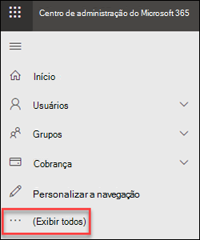
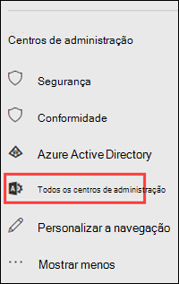
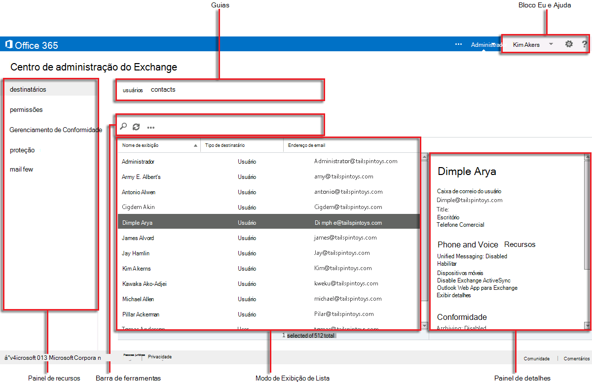

# Centro de administração do Exchange no EOP autônomo

[!INCLUDE [Microsoft 365 Defender rebranding](../includes/microsoft-defender-for-office.md)]

**Aplica-se a**
-  [Proteção do Exchange Online autônoma](https://go.microsoft.com/fwlink/?linkid=2148611)

O Centro de administração do Exchange (EAC) é um console de gerenciamento baseado na Web para o Exchange Online Protection (EOP) autônomo.

Procurando a versão do Exchange Online deste tópico? Confira [Exchange admin center in Exchange Online](https://docs.microsoft.com/exchange/exchange-admin-center).

## Abrir o EAC no EOP

Os clientes autônomos do EOP podem acessar o EAC usando os seguintes métodos:

- **No Centro de administração do Microsoft 365:**

  1. Vá para <https://admin.microsoft.com> e clique em Mostrar **tudo.**

     

  2. Na seção **Centros de administração** exibida, clique em Todos os centros de **administração.**

     

  3. Na página **Todos os centros de administração** exibida, clique em Proteção do Exchange **Online.**

- Vá diretamente para `https://admin.protection.outlook.com/ecp/` .

## Elementos comuns da interface do usuário no EAC no EOP

Esta seção descreve os elementos da interface do usuário encontrados no EAC.

### Painel de recursos

Este é o primeiro nível de navegação para a maioria das tarefas que você executará no EAC. O painel de recursos é organizado por áreas de recursos.

- **Destinatários:** é aqui que você exibirá grupos e contatos externos.

- **Permissões:** aqui, você gerenciará as funções de administrador.

- **Gerenciamento de** Conformidade : aqui você encontrará o relatório do grupo de funções de administrador e o relatório de log de auditoria do administrador.

- **Proteção:** é aqui que você pode gerenciar políticas anti-malware, a política de filtro de conexão padrão e o DKIM.

  > [!NOTE]
  > Você deve gerenciar políticas anti-malware e a política de filtro de conexão padrão no Centro de Conformidade & Segurança. Para obter mais informações, [consulte Configurar políticas anti-malware no EOP](configure-anti-malware-policies.md) e [configurar a filtragem de conexão no EOP.](configure-the-connection-filter-policy.md)

- **Fluxo de** Emails: é aqui que você gerenciará as regras de fluxo de emails (também conhecidas como regras de transporte), domínios aceitos e conectores, bem como onde você pode ir para executar o rastreamento de mensagens.

- **Híbrido:** é aqui que você pode executar o Assistente de [Configuração](https://docs.microsoft.com/Exchange/hybrid-configuration-wizard)Híbrida e instalar o módulo [do PowerShell do Exchange Online.](https://docs.microsoft.com/powershell/exchange/mfa-connect-to-exchange-online-powershell)

### Guias

As guias são seu segundo nível de navegação. Cada uma das áreas de recursos contém várias guias, cada uma representando um recurso.

### Barra de ferramentas

Ao clicar na maioria das guias, você verá uma barra de ferramentas. A barra de ferramentas possui ícones que realizam ações específicas, A tabela a seguir descreve os ícones e suas ações.

****

|Ícone|Nome|Action|
|---|---|---|
||Adicionar, Novo|Use esse ícone para criar um novo objeto. Alguns desses ícones têm uma seta para baixo associada, na qual é possível clicar para exibir objetos adicionais que você pode criar.|
||Editar|Use esse ícone para editar um objeto.|
||Excluir|Use esse ícone para excluir um objeto. Alguns ícones excluídos têm uma seta para baixo na qual é possível clicar para mostrar opções adicionais.|
||Pesquisar|Use esse ícone para abrir uma caixa de pesquisa na qual é possível digitar a frase de pesquisa para um objeto que você deseja encontrar.|
||Atualizar|Use essa opção para atualizar a exibição de lista.|
||Mais opções|Use esse ícone para ver mais ações que podem ser realizadas para os objetos dessa guia. Por exemplo, em **Destinatários \> Usuários**, um clique neste ícone mostra a opção para executar uma **Pesquisa Avançada**.  |
||Seta para cima e seta para baixo|Use esses ícones para mover a prioridade de um objeto para cima ou para baixo.|
||Remover|Use esse ícone para remover objetos de uma lista.|
|

### Exibição de Lista

Ao selecionar uma guia, na maioria dos casos, você verá uma exibição de lista. O limite visualizável com o modo de exibição em lista do EAC é de aproximadamente 10.000 objetos. Além disso, a paginação está incluída, para que você possa paginar os resultados.

### Painel de Detalhes

Quando você seleciona um objeto na exibição de lista, informações sobre esse objeto são exibidas no painel de detalhes. Em alguns casos, o painel de detalhes inclui tarefas de gerenciamento.

### Bloco Eu e Ajuda

O bloco **Eu** permite sair do EAC e entrar como um usuário diferente. No   ajuda, você pode fazer as seguintes ações:

- **Ajuda:** clique  online.
- **Comentários:** Deixe comentários.
- **Comunidade:** poste uma pergunta para encontrar respostas nos fóruns da comunidade.
- **Desabilitar bolha de** Ajuda: a bolha de Ajuda exibe ajuda contextual para campos quando você cria ou edita um objeto. Você pode desativar a bolha de Ajuda ou ativá-la se tiver sido desabilitada.
- **Mostrar Log de** Comando: uma nova janela é aberta, que mostra os comandos equivalentes do PowerShell com base no que você configurou no EAC.

## Navegadores com suporte

Para ter a melhor experiência ao usar o EAC, recomendamos que você sempre use os navegadores, clientes do Office e aplicativos mais recentes. Também recomendamos que você instale as atualizações de software quando elas estiverem disponíveis. Para obter mais informações sobre os navegadores suportados e os requisitos do sistema para o serviço, consulte [Requisitos do sistema para o Office](https://products.office.com/office-system-requirements).

## Idiomas compatíveis

Os seguintes idiomas são suportados e estão disponíveis para o EAC no EOP autônomo.

- Amharic
- Árabe
- Basco (Basco)
- Bengali (Índia)
- Búlgaro
- Catalão
- Chinês (simplificado)
- Chinês (tradicional)
- Croata
- Tcheco
- Dinamarquês
- Holandês
- Inglês
- Estoniano
- Filipino (Filipinas)
- Finlandês
- Francês
- Galego
- Alemão
- Grego
- Gujarati
- Hebraico
- Híndi
- Húngaro
- Islandês
- Indonésio
- Italiano
- Japonês
- Kannada
- Cazaque
- Kiswahili
- Coreano
- Letão
- Lituano
- Malaio (Brunei Darussalam)
- Malaio (Malásia)
- Malaiala
- Marati
- Norueguês (Bokmål)
- Norueguês (Nynorsk)
- Oriá
- Persa
- Polonês
- Português (Brasil)
- Português (Portugal)
- Romeno
- Russo
- Sérvio (cirílico, Sérvia)
- Sérvio (latino)
- Eslovaco
- Esloveno
- Espanhol
- Sueco
- Tâmil
- Telugu
- Tailandês
- Turco
- Ucraniano
- Urdu
- Vietnamita
- Galês
