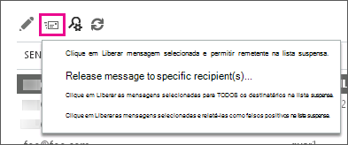

# Localizar e liberar mensagens em quarentena como um administradorFind and release quarantined messages as an administrator

Este tópico descreve como os administradores do Exchange Online e do Exchange Online Protection (EOP) podem localizar, liberar e relatar mensagens que estejam na quarentena do Centro de administração do Exchange (EAC).This topic describes how Exchange Online and Exchange Online Protection (EOP) admins can find, release, and report on quarantined messages in the Exchange admin center (EAC). O Office 365 direciona as mensagens para quarentena porque elas foram identificadas como spam ou correspondem a uma regra de fluxo de emails (também conhecida como regra de transporte).Office 365 directs messages to quarantine either because they were identified as spam or they matched a mail flow rule (also known as a transport rule).

Você pode usar o centro de conformidade & segurança em vez da Eat para concluir qualquer uma dessas tarefas também; o portal de quarentena dentro do centro de administração do Exchange (Eat) está definido como decommisioned.You can use the Security & Compliance Center instead of the EAC to complete any of these tasks as well; the Quarantine portal within the Exchange admin center (EAC) is set to be decommisioned. Para obter mais informações, consulte [Quarantine Email messages in Office 365](quarantine-email-messages.md).For more information, see [Quarantine email messages in Office 365](quarantine-email-messages.md).

As mensagens em quarentena são listadas na página **quarentena** do EAC. Por padrão, as mensagens são classificadas da mais nova para a mais antiga no campo **RECEBIDAS**. Os valores **REMETENTE**, **ASSUNTO** e **EXPIRA** também são listados para cada mensagem. Você pode classificar com base em qualquer um desses campos clicando nos cabeçalhos. Clicar em um cabeçalho de coluna uma segunda vez inverterá a ordem de classificação. No máximo 500 mensagens podem ser exibidas na página **quarentena**Quarantined messages are listed on the **quarantine** page in EAC. By default, messages are sorted from newest to oldest on the **RECEIVED** field. **SENDER**, **SUBJECT**, and **EXPIRES** values are also listed for each message. You can sort on any of these fields by clicking their headers. If you click a column header a second time, the sort order reverses. The **quarantine** page displays a maximum of 500 messages.

É possível exibir uma lista de todas as mensagens em quarentena ou pesquisar por mensagens específicas determinando critérios de filtragem (a filtragem também pode ajudar a reduzir o conjunto de resultados se você tiver mais de 500 mensagens). Após procurar e localizar uma mensagem em quarentena específica, é possível visualizar detalhes sobre a mensagem. Você também pode:You can view a list of all quarantined messages, or you can search for specific messages by specifying filter criteria (filtering can also help reduce your result set if you have more than 500 messages). After searching for and locating a specific quarantined message, you can view details about the message. You can also:

- Liberar a mensagem para um ou mais destinatários e, como opção, relatá-la como um falso positivo (que não é lixo eletrônico) para a equipe de análise de spam da Microsoft, que avaliará e analisará a mensagem. Dependendo dos resultados da análise, as regras de filtro de conteúdo de spam de todo o serviço podem ser ajustadas para permitir a mensagem.Release the message to one or more recipients, and optionally report it as a false positive (not junk) message to the Microsoft Spam Analysis Team, who will evaluate and analyze the message. Depending on the results of the analysis, the service-wide spam content filter rules may be adjusted to allow the message through.

- Liberar a mensagem e permitir todas as mensagens futuras desse remetente.Release the message and allow all future messages from that sender.

## O que você precisa saber antes de começar?What do you need to know before you begin?

- Para executar este procedimento ou estes procedimentos, você precisa receber permissões.You need to be assigned permissions before you can perform this procedure or procedures. Para ver de que permissões você precisa, consulte o entrada "quarentena" no tópico [permissões de recurso no Exchange Online](https://docs.microsoft.com/exchange/permissions-exo/feature-permissions) .To see what permissions you need, see the "Quarantine" entry in the [Feature Permissions in Exchange Online](https://docs.microsoft.com/exchange/permissions-exo/feature-permissions) topic.

- Você pode liberar ou relatar várias mensagens ao mesmo tempo na página **quarentena**. Como alternativa, pode criar um script do Windows PowerShell remoto para realizar essa tarefa. Use o cmdlet [Get-QuarantineMessage](https://docs.microsoft.com/powershell/module/exchange/antispam-antimalware/get-quarantinemessage) para procurar as mensagens e o cmdlet [Release-QuarantineMessage](https://docs.microsoft.com/powershell/module/exchange/antispam-antimalware/release-quarantinemessage) para liberá-las.You can release or report multiple messages at once on the **quarantine** page. Alternatively you can create a remote Windows PowerShell script to accomplish this task. Use the [Get-QuarantineMessage](https://docs.microsoft.com/powershell/module/exchange/antispam-antimalware/get-quarantinemessage) cmdlet to search for messages, and the [Release-QuarantineMessage](https://docs.microsoft.com/powershell/module/exchange/antispam-antimalware/release-quarantinemessage) cmdlet to release them.

- Para obter informações sobre os atalhos de teclado que podem se aplicar aos procedimentos deste tópico, consulte [atalhos de teclado para o centro de administração do Exchange no Exchange Online](https://docs.microsoft.com/Exchange/accessibility/keyboard-shortcuts-in-admin-center).For information about keyboard shortcuts that may apply to the procedures in this topic, see [Keyboard shortcuts for the Exchange admin center in Exchange Online](https://docs.microsoft.com/Exchange/accessibility/keyboard-shortcuts-in-admin-center).

> [!TIP]
> Está com problemas?Having problems? Peça ajuda no fórum do [Exchange Online Protection](https://go.microsoft.com/fwlink/p/?linkId=285351) .Ask for help in the [Exchange Online Protection](https://go.microsoft.com/fwlink/p/?linkId=285351) forum.

## Usar a pesquisa avançada para filtrar e localizar mensagens em quarentenaUse advanced search to filter and locate quarantined messages

No Centro de administração do Exchange (EAC), você pode filtrar itens da quarentena de acordo com várias condições usando a pesquisa avançada. É possível utilizar estes critérios separadamente ou combinados. A pesquisa fornecerá uma lista de mensagens que atendem a todos os seus critérios de filtro.In the Exchange admin center (EAC), you can filter quarantined items based on several different conditions using advanced search. You can use these conditions separately or in combination with one another. The search will provide a list of messages that meet all your filter criteria.

1. No Eat, navegue até \*\*\*\* \> **quarentena**de proteção e clique em **pesquisa avançada**.In EAC, navigate to **Protection** \> **quarantine**, and then click **Advanced search**.

2. Na janela **Pesquisa Avançada** selecione qualquer combinação das condições a seguir.In the **Advanced search** window, select any combination of the following conditions. Marque a caixa de seleção associada para permitir cada condição.Select the associated check box to enable each condition. Não há suporte para curingas.Wildcards aren't supported.

   1. **ID da mensagem**: você pode usar esse parâmetro para executar uma pesquisa direcionada para uma mensagem específica.**Message ID**: You can use this parameter to perform a targeted search for a specific message. Por exemplo, se uma mensagem específica é enviada por, ou destinada a, um usuário em sua organização, mas ela nunca chega ao seu destino, você pode procurar a mensagem utilizando o recurso de rastreamento de mensagens.For example, if a specific message is sent by, or intended for, a user in your organization, but it never reaches its destination, you can search for the message using the message trace feature. Para saber mais, confira [Run a Message Trace and View Results](https://docs.microsoft.com/exchange/monitoring/trace-an-email-message/run-a-message-trace-and-view-results).For details, see [Run a Message Trace and View Results](https://docs.microsoft.com/exchange/monitoring/trace-an-email-message/run-a-message-trace-and-view-results). Se você descobrir que a mensagem foi enviada para a quarentena, talvez porque ela corresponde a uma regra ou foi identificada como spam, é possível encontrá-la facilmente na quarentena especificando sua ID de Mensagem.If you discover that the message was sent to the quarantine, perhaps because it matched a rule or was identified as spam, you can then easily find this message in the quarantine by specifying its Message ID. Lembre-se de incluir a sequência completa da ID da Mensagem.Be sure to include the full Message ID string. Isso pode incluir colchetes angulares\<\>().This might include angle brackets (\<\>).

   2. **Endereço de email do remetente**: especifique o endereço de email da pessoa que enviou a mensagem.**Sender email address**: Specify the email address of the person who sent the message.

   3. **Endereço de email do destinatário**: especifique o endereço de email do destinatário pretendido da mensagem.**Recipient email address**: Specify the email address of the intended recipient of the message.

   4. **Assunto**: especifique o texto da linha de assunto da mensagem.**Subject**: Specify the subject line text of the message.

   5. **Recebido**: é possível selecionar que a mensagem foi recebida por quarentena nas últimas 24 horas ( **hoje**), nas últimas 48 horas ( **últimos 2 dias**), na semana passada ( **últimos 7 dias**) ou você pode selecionar um intervalo de tempo personalizado durante o qual a mensagem foi recebida pela quarentena.**Received**: You can select that the message was received by quarantine within the past 24 hours ( **Today**), within the past 48 hours ( **Last 2 days**), within the past week ( **Last 7 days**), or you can select a custom time interval during which the message was received by the quarantine.

   6. **Expira**: é possível selecionar que a mensagem será excluída da quarentena nas próximas 24 horas ( **hoje**), nas próximas 48 horas ( **próximos 2 dias**), na próxima semana (próximos **7 dias**) ou você pode selecionar um intervalo de tempo personalizado durante o qual a mensagem será excluída da quarentena.**Expires**: You can select that the message will be deleted from quarantine within the next 24 hours ( **Today**), within the next 48 hours ( **Next 2 days**), within the next week ( **Next 7 days**), or you can select a custom time interval during which the message will be deleted from quarantine.

      > [!IMPORTANT]
      > Por padrão, as mensagens de spam em quarentena são mantidas em quarentena por 30 dias, enquanto as mensagens em quarentena que correspondem a uma regra de fluxo de emails são mantidas em quarentena por até 30 dias, com base no período de retenção definido na sua política de filtro de conteúdo padrão.By default, spam-quarantined messages are kept in quarantine for 30 days, while quarantined messages that matched a mail flow rule are kept in the quarantine for up to 30 days based on the retention period set in your default content filter policy. Após esse período de tempo, o Office 365 exclui as mensagens e elas não podem ser recuperadas.After this period of time Office 365 deletes the messages and they are not retrievable. O período de retenção para mensagens em quarentena que correspondem a uma regra de fluxo de emails não é configurável.The retention period for quarantined messages that matched a mail flow rule is not configurable. No entanto, o período de retenção para mensagens de spam em quarentena pode ser reduzido através da configuração **Reter spam por (dias)** nas suas políticas de filtro de conteúdo.However, the retention period for spam-quarantined messages can be lowered via the **Retain spam for (days)** setting in your content filter policies. Para obter mais informações, consulte [Configurar suas políticas de filtro de spam](configure-your-spam-filter-policies.md).For more information, see [Configure your spam filter policies](configure-your-spam-filter-policies.md).

   7. **Tipo** Você pode especificar se deseja pesquisar por mensagens em quarentena que foram identificadas como **spam**ou se deseja pesquisar mensagens que correspondam a uma regra de fluxo de emails (**regra de transporte**).**Type** You can specify whether to search for quarantined messages that have been identified as **Spam**, or whether to search for messages that matched a mail flow rule (**Transport rule**).

3. Clique em **OK** para iniciar a pesquisa avançada.Click **OK** to start running the advanced search.

   > [!NOTE]
   > Para apagar seus critérios de pesquisa e exibir todas as mensagens em quarentena, apague todas as caixas de seleção na janela **Pesquisa avançada** e, em seguida, clique em **OK**.To clear your search criteria and view all messages in the quarantine, clear all the check boxes in the **Advanced search** window, and then click **OK**.

Após pesquisar por mensagens, os resultados que correspondem aos seus critérios especificados serão exibidos na interface do usuário. No máximo 500 mensagens podem ser exibidas no EAC.After searching for messages, the results that match your specified criteria will display in the user interface. A maximum of 500 messages can be displayed in the EAC.

## Visualizar detalhes sobre uma mensagem específica colocada em quarentenaView details about a specific quarantined message

Após localizar uma determinada mensagem em quarentena na página **quarentena**, é possível exibir detalhes sobre ela.After locating a specific quarantined message on the **quarantine** page, you can view details about it.

1. Na página **quarentena**, selecione uma mensagem específica e um resumo das propriedades dessa mensagem é exibido no painel de detalhes no lado direito da tela.On the **quarantine** page, select a specific message and a summary of the properties of that message appear in the details pane on the right side of the screen.

   Os valores de **Status da mensagem** são os seguintes:The **Message status** values are as follows:

   - **Tipo**: indica se a mensagem foi identificada como **spam** ou se corresponde a uma regra de fluxo de emails (**regra de transporte**).**Type**: Denotes whether the message has been identified as **Spam** or matched a mail flow rule (**Transport rule**).

   - **Expira**: a data em que a mensagem será excluída da quarentena.**Expires**: The date when the message will be deleted from the quarantine.

   Os valores dos **Detalhes da mensagem** são os seguintes:The **Message details** values are as follows:

   - **Remetente**: o endereço de email da pessoa que enviou a mensagem.**Sender**: The email address of the person who sent the message.

   - **Assunto**: o texto da linha de assunto da mensagem.**Subject**: The subject line text of the message.

   - **Recebido**: a data em que a mensagem foi recebida pela quarentena.**Received**: The date on which the message was received by the quarantine.

   - **Tamanho**: o tamanho da mensagem, em kilobytes (KB) ou, se o tamanho da mensagem for maior que 999 KBS, em megabytes (MB).**Size**: The size of the message, in kilobytes (KB), or, if the message size is greater than 999 KBs, in megabytes (MB).

   - **Exibir cabeçalho da mensagem**: clique neste link para abrir a caixa de diálogo **cabeçalho da mensagem** , que permite exibir o texto do cabeçalho da mensagem.**View message header**: Click this link to open the **message header** dialog box, which lets you view the message header text. Você também pode copiar o texto do cabeçalho da mensagem para a área de transferência e colá-lo no [analisador de cabeçalho de mensagem](https://testconnectivity.microsoft.com/?tabid=mha).You can also copy the message header text to your clipboard and paste it into the [Message Header Analyzer](https://testconnectivity.microsoft.com/?tabid=mha). Quando estiver na ferramenta Analisador de Cabeçalhos de Mensagens, clique em **Analisar cabeçalhos** para recuperar informações sobre o cabeçalho.Once in the Message Header Analyzer tool, click **Analyze headers** in order to retrieve information about the header.

    > [!TIP]
    > Para obter informações sobre campos de cabeçalho de mensagem antispam específicos inseridos pelo serviço, consulte [anti-spam Message Headers](anti-spam-message-headers.md).For information about specific anti-spam message header fields inserted by the service, see [Anti-spam message headers](anti-spam-message-headers.md).

   - **Visualizar a mensagem de email** Clique nesse link para analisar o texto da mensagem.**Preview email message** Click this link to review the text of the message.

2. Se você clicar duas vezes em uma mensagem em quarentena, a janela **Mensagem em quarentena** abre e exibe a informação a seguir:If you double-click a quarantined message, the **Quarantined message** window opens and displays the following information:

   - **Liberado para**: uma lista de todos os endereços de email para quem a mensagem foi liberada, se houver.**Released to**: A list of all email addresses to whom the message has been released, if any.

   - **Ainda não liberado para**: uma lista de todos os endereços de email aos quais a mensagem não foi liberada, se houver.**Not yet released to**: A list of all email addresses to whom the message has not been released, if any. Você pode clicar no link **Liberar para** para liberar a mensagem; para saber mais sobre como liberar uma mensagem, confira a próxima seção.You can click the **Release to** link in order to release the message; for more information about releasing a message, see the next section.

   - **ID da mensagem**: a ID de mensagem da Internet (também conhecida como ID do cliente) encontrada no cabeçalho da mensagem.**Message ID**: The Internet Message ID (also known as the Client ID) found in the header of the message.

   Clique em **Fechar** para retornar ao painel principal da quarentena.Click **Close** to return to the main quarantine pane.

## Liberar as mensagens da quarentenaRelease messages from quarantine

Se você quiser liberar as mensagens para destinatários, as opções são:If you want to release messages to recipients, your options are:

- [Liberar uma mensagem em quarentena e permitir as mensagens futuras do remetenteRelease a quarantined message and allow future messages from the sender](#release-a-quarantined-message-and-allow-future-messages-from-the-sender)

- [Liberar uma mensagem em quarentena para destinatários específicos sem relatá-la como falso positivoRelease a quarantined message to specific recipients without reporting it as a false positive](#release-a-quarantined-message-to-specific-recipients-without-reporting-it-as-a-false-positive)

- [Liberar uma ou mais mensagens em quarentena a todos os destinatáriosRelease one or more quarantined messages to all recipients](#release-one-or-more-quarantined-messages-to-all-recipients)

- [Liberar uma ou mais mensagens em quarentena a todos os destinatários e relatar falsos positivosRelease one or more quarantined messages to all recipients and report false positives](#release-one-or-more-quarantined-messages-to-all-recipients-and-report-false-positives)

### Liberar uma mensagem em quarentena e permitir as mensagens futuras do remetenteRelease a quarantined message and allow future messages from the sender

1. No Eat, navegue até \*\*\*\* \> **quarentena**de proteção.In EAC, navigate to **Protection** \> **quarantine**.

2. Clique em uma mensagem para selecioná-la e, em seguida, clique no ícone **Liberar Mensagem**, conforme mostrado na captura de tela a seguir.Click on a message to select it and then click the **Release Message** icon as shown in the following screen shot.

   

   Clique em **Liberar mensagem selecionada e permitir remetente** na lista suspensa.Click **Release selected message and allow sender** from the drop-down list.

3. A caixa de diálogo **liberar mensagem e permitir remetente** é exibida.The **release message and allow sender** dialog box opens. Opcionalmente, você pode optar por relatar a mensagem para a Microsoft e, então, clicar em **liberar e permitir**.Optionally, you can choose to report the message to Microsoft, then click **release and allow**. A mensagem será disponibilizada a todos os destinatários para os quais é endereçada e todas as mensagens futuras deste remetente serão permitidas.The message will be released to all recipients it's addressed to and all future messages from this sender will be allowed. No entanto, se essa mensagem foi colocada em quarentena devido a uma regra de fluxo de emails ou remetente bloqueado, o remetente continuará a ser bloqueado para mensagens futuras.However, if this message was quarantined because of a mail flow rule or blocked sender, the sender will continue to be blocked for future messages.

### Liberar uma mensagem em quarentena para destinatários específicos sem relatá-la como falso positivoRelease a quarantined message to specific recipients without reporting it as a false positive

1. No Eat, navegue até \*\*\*\* \> **quarentena**de proteção.In EAC, navigate to **Protection** \> **quarantine**.

2. Selecione uma mensagem, clique no ícone **Liberar Mensagem** e, então, clique em **Liberar a mensagem para destinatários específicos** na lista suspensa.Select a message, click the **Release Message** icon, and then click **Release message to specific recipients** from the drop-down list.

3. Na caixa de diálogo **Liberar mensagem**, selecione uma das seguintes opções:In the **release message** dialog box, select one of the following options:

   - **Liberar mensagem para todos os destinatários** Ao selecionar essa opção, esteja ciente de que uma mensagem não pode ser liberada mais de uma vez para o mesmo destinatário.**Release message to all recipients** When you select this option, be aware that a message cannot be released more than once to the same recipient. Se um destinatário recebeu a mensagem anteriormente, ela não será liberada novamente para esse destinatário.If a recipient has previously received the message, it will not be released again to that recipient.

   - **Liberar mensagem para destinatários especificados** Selecione os destinatários aos quais a mensagem pode ser liberada.**Release message to specified recipients** Select the recipient(s) to whom the message can be released. Como uma mensagem pode ser liberada apenas uma vez para cada destinatário, somente os destinatários para os quais podem ser liberados aparecem nessa lista.Because a message can only be released once to each recipient, only recipients to whom it can be released appear in this list. Há suporte para várias seleções.Multi-selection is supported. Após fazer suas seleções de destinatário, clique em **Adicionar**.After making your recipient selections, click **add**.

4. Clique em **Liberar**.Click **release**.

Se você clicar em **Atualizar**  de atualização para atualizar seus dados e, em seguida, clicar duas vezes na mensagem, verá que ela foi liberada para os destinatários pretendidos.If you click **Refresh**  to refresh your data, and then double-click the message, you should see that it's been released to the intended recipients.

### Liberar uma ou mais mensagens em quarentena a todos os destinatáriosRelease one or more quarantined messages to all recipients

1. No Eat, navegue até \*\*\*\* \> **quarentena**de proteção.In EAC, navigate to **Protection** \> **quarantine**.

2. Clique em uma mensagem para selecioná-la, ou use a tecla Shift para selecionar várias mensagens.Click on a message to select it, or use the shift key to select multiple messages. Clique no ícone **Liberar Mensagem**.Then click the **Release Message** icon.

3. Clique em **Liberar as mensagens selecionadas para TODOS os destinatários** na lista suspensa. Click **Release selected message(s) to ALL recipients** from the drop-down list.

4. A caixa de diálogo de aviso. Leia o aviso e selecione **Sim** se quiser prosseguir. Ao selecionar esta opção, esteja ciente que uma mensagem não pode ser liberada mais que uma vez para o mesmo destinatário. Se um destinatário recebeu a mensagem anteriormente, ela não será liberada novamente para esse destinatário.The warning dialog box opens. Read the warning and select **Yes** if you want to proceed. When you select this option, be aware that a message cannot be released more than once to the same recipient. If a recipient has previously received the message, it will not be released again to that recipient.

### Liberar uma ou mais mensagens em quarentena a todos os destinatários e relatar falsos positivosRelease one or more quarantined messages to all recipients and report false positives

1. No Eat, navegue até \*\*\*\* \> **quarentena**de proteção.In EAC, navigate to **Protection** \> **quarantine**.

2. Clique em uma mensagem para selecioná-la, ou use a tecla Shift para selecionar várias mensagens. Clique no ícone **Liberar Mensagem**. Click on a message to select it, or use the shift key to select multiple messages. Then click the **Release Message** icon.

3. Clique em **Liberar as mensagens selecionadas e relatá-las como falsos positivos** na lista suspensa. Click **Release selected message(s) and report as false positive** from the drop-down list.

4. A caixa de diálogo de aviso. Leia o aviso e selecione **Sim** se quiser prosseguir. Ao selecionar esta opção, esteja ciente que uma mensagem não pode ser liberada mais que uma vez para o mesmo destinatário. Se um destinatário recebeu a mensagem anteriormente, ela não será liberada novamente para esse destinatário.The warning dialog box opens. Read the warning and select **Yes** if you want to proceed. When you select this option, be aware that a message cannot be released more than once to the same recipient. If a recipient has previously received the message, it will not be released again to that recipient.

   Ao escolher esta opção, a mensagem será liberada para todos os destinatários que ainda não a receberam.When you choose this option, the message will be released to all recipients who have not yet received it. Se for uma mensagem de spam em quarentena, ela também será reportada para a equipe de análise de spam da Microsoft, que avaliará e analisará a mensagem.If it's a spam-quarantined message, it will also be reported to the Microsoft Spam Analysis Team, who will evaluate and analyze the message. Dependendo dos resultados da análise, as regras de filtro de conteúdo de spam de todo o serviço podem ser ajustadas para permitir a mensagem.Depending on the results of the analysis, the service-wide spam content filter rules may be adjusted to allow the message through.

> [!TIP]
> Ajude a garantir que uma mensagem não seja marcada como spam seguindo as etapas em [como ajudar a garantir que uma mensagem não seja marcada como spam](how-to-help-ensure-that-a-message-isn-t-marked-as-spam.md).Help ensure that a message isn't marked as spam by following the steps in [How to help ensure that a message isn't marked as spam](how-to-help-ensure-that-a-message-isn-t-marked-as-spam.md).

Se você clicar no ícone **Atualizar** de atualização para atualizar seus dados e, em seguida, clicar duas vezes na mensagem, verá que ela foi liberada para os destinatários pretendidos.If you click the **Refresh** icon to refresh your data, and then double-click the message, you should see that it's been released to the intended recipients.

## Para obter mais informaçõesFor more information

[Quarantine FAQQuarantine FAQ](quarantine-faq.md)
