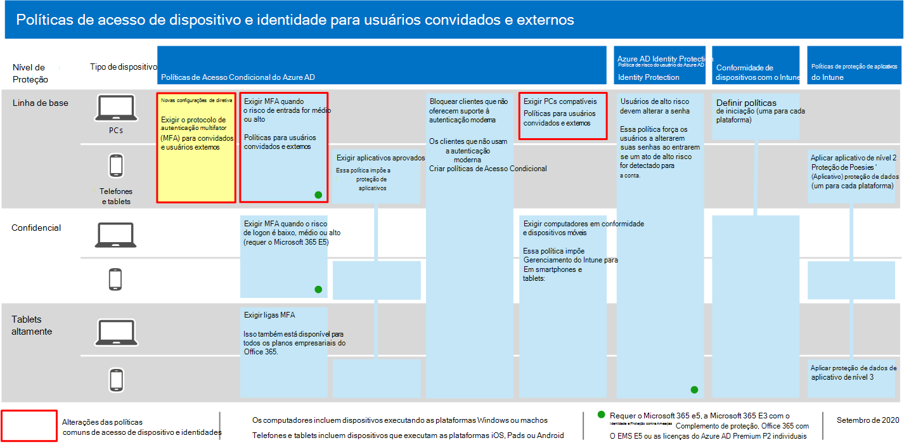
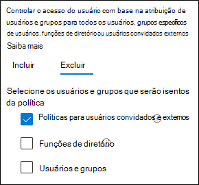
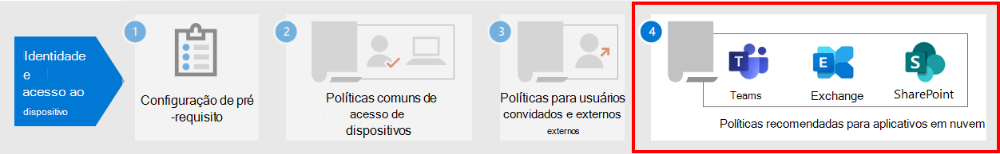

# Políticas para permitir acesso de convidados e acesso de usuário externo B2B

Este artigo discute o ajuste das políticas de acesso de identidade e dispositivo recomendadas para permitir o acesso a convidados e usuários externos que tenham uma conta do Azure Active Directory (Azure AD) Entre Empresas (B2B). Essa orientação se baseia nas políticas comuns de acesso a dispositivos [e identidades.](identity-access-policies.md)

Essas recomendações foram projetadas para se aplicar à camada **de linha de base** de proteção. Mas você também pode ajustar as recomendações com base em suas necessidades específicas de **proteção** altamente **controlada e** sensível.

Fornecer um caminho para contas B2B autenticar com seu locatário do Azure AD não dá a essas contas acesso a todo o seu ambiente. Os usuários B2B e suas contas têm acesso a serviços e recursos, como arquivos, compartilhados com eles pela política de Acesso Condicional.

## Atualizando as políticas comuns para permitir e proteger convidados e acesso de usuário externo

Este diagrama mostra quais políticas adicionar ou atualizar entre as políticas comuns de acesso a dispositivos e identidade, para acesso de usuário externo e convidado B2B.

[Ver uma versão maior desta imagem](https://github.com/MicrosoftDocs/microsoft-365-docs/raw/public/microsoft-365/media/microsoft-365-policies-configurations/identity-access-ruleset-guest.png)

A tabela a seguir lista as políticas que você precisa criar e atualizar. As políticas comuns vinculam-se às instruções de configuração associadas no artigo De identidade [comum e políticas de acesso a dispositivos.](identity-access-policies.md)

|Nível de Proteção|Políticas|Mais informações|
|---|---|---|
|**Baseline**|[Exigir MFA sempre para convidados e usuários externos](identity-access-policies.md#require-mfa-based-on-sign-in-risk)|Crie essa nova política e configure: <ul><li>For **Assignments > Users and groups > Include**, choose Select users and **groups**, and then select All guest and **external users**.</li><li>Para **Atribuições > condições > entrar,** deixe todas as opções desmarcadas para sempre impor a MFA (autenticação multifatória).</li></ul>|
||[Exigir MFA quando o risco de login for *médio* ou *alto*](identity-access-policies.md#require-mfa-based-on-sign-in-risk)|Modifique essa política para excluir convidados e usuários externos.|
||[Exigir PCs compatíveis](identity-access-policies.md#require-compliant-pcs-but-not-compliant-phones-and-tablets)|Modifique essa política para excluir convidados e usuários externos.|

Para incluir ou excluir convidados e usuários **externos** em políticas de Acesso Condicional, para Atribuições > Usuários e grupos > Incluir ou **Excluir,** verifique todos os usuários convidados e **externos.**

## Mais informações

### Convidados e acesso de usuário externo com o Microsoft Teams

O Microsoft Teams define os seguintes usuários:

- **O acesso** de convidados usa uma conta B2B do Azure AD que pode ser adicionada como membro de uma equipe e ter acesso às comunicações e aos recursos da equipe.

- **O acesso** externo é para um usuário externo que não tem uma conta B2B. O acesso de usuário externo inclui convites, chamadas, chats e reuniões, mas não inclui a associação à equipe e o acesso aos recursos da equipe.

Para obter mais informações, consulte a [comparação entre convidados e o acesso de usuário externo para equipes.](https://docs.microsoft.com/microsoftteams/communicate-with-users-from-other-organizations#compare-external-and-guest-access)

Para obter mais informações sobre como proteger políticas de acesso a identidades e dispositivos para o Teams, confira Recomendações de política para proteger [chats,](teams-access-policies.md)grupos e arquivos do Teams.

### Exigir MFA sempre para usuários convidados e externos

Essa política solicita que os convidados se registrem para a MFA em seu locatário, independentemente de eles estar registrados para MFA em seu locatário de residência. Ao acessar recursos em seu locatário, convidados e usuários externos devem usar a MFA para cada solicitação.

### Excluindo convidados e usuários externos da MFA baseada em risco

Embora as organizações possam impor políticas baseadas em risco para usuários B2B usando o Azure AD Identity Protection, há limitações na implementação do Azure AD Identity Protection para usuários de colaboração B2B em um diretório de recursos devido à sua identidade existente em seu diretório base. Devido a essas limitações, a Microsoft recomenda que você exclua convidados de políticas de MFA baseadas em risco e exige que esses usuários sempre usem a MFA.

Para obter mais informações, consulte [Limitações da Proteção de Identidade para usuários de colaboração B2B.](https://docs.microsoft.com/azure/active-directory/identity-protection/concept-identity-protection-b2b#limitations-of-identity-protection-for-b2b-collaboration-users)

### Excluindo convidados e usuários externos do gerenciamento de dispositivos

Somente uma organização pode gerenciar um dispositivo. Se você não excluir convidados e usuários externos de políticas que exigem conformidade do dispositivo, essas políticas bloquearão esses usuários.

## Próxima etapa

Configurar políticas de Acesso Condicional para:

- [Microsoft Teams](teams-access-policies.md)
- [Exchange Online](secure-email-recommended-policies.md)
- [SharePoint](sharepoint-file-access-policies.md)
