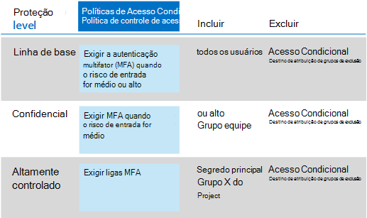
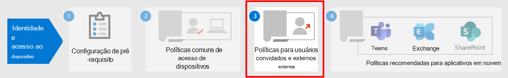

# Identidade comum e políticas de acesso ao dispositivoCommon identity and device access policies

Este artigo descreve as políticas comuns recomendadas para proteger o acesso aos serviços de nuvem do Microsoft 365, incluindo aplicativos locais publicados com o proxy de aplicativo do Azure Active Directory (Azure AD).This article describes the common recommended policies for securing access to Microsoft 365 cloud services, including on-premises applications published with Azure Active Directory (Azure AD) Application Proxy. 

Este guia discute como implantar as políticas recomendadas em um ambiente provisionado recentemente.This guidance discusses how to deploy the recommended policies in a newly-provisioned environment. Configurar essas políticas em um ambiente de laboratório separado permite que você entenda e avalie as políticas recomendadas antes de preparar a distribuição para seus ambientes de pré-produção e produção.Setting up these policies in a separate lab environment allows you to understand and evaluate the recommended policies before staging the rollout to your preproduction and production environments. Seu ambiente provisionado recentemente pode ser apenas na nuvem ou híbrido para refletir suas necessidades de avaliação.Your newly provisioned environment can be cloud-only or hybrid to reflect your evaluation needs.  

## Conjunto de políticasPolicy set 

O diagrama a seguir ilustra o conjunto de políticas recomendado.The following diagram illustrates the recommended set of policies. Ele mostra qual camada de proteção cada política se aplica e se as políticas se aplicam a PCs ou telefones e tablets ou a ambas as categorias de dispositivos.It shows which tier of protections each policy applies to and whether the policies apply to PCs or phones and tablets, or both categories of devices. Ele também indica onde você configura essas políticas.It also indicates where you configure these policies.

 
 [consulte uma versão maior desta imagem](https://github.com/MicrosoftDocs/microsoft-365-docs/raw/public/microsoft-365/media/microsoft-365-policies-configurations/Identity_device_access_policies_byplan.png)
[See a larger version of this image](https://github.com/MicrosoftDocs/microsoft-365-docs/raw/public/microsoft-365/media/microsoft-365-policies-configurations/Identity_device_access_policies_byplan.png)

Veja um resumo do PDF de uma página com links para as políticas individuais:Here's a one-page PDF summary with links to the individual policies:

    [Exibir como um PDF](../../downloads/MSFT-cloud-architecture-identity-device-protection-handout.pdf) \| [Baixar como um PDF](https://github.com/MicrosoftDocs/microsoft-365-docs/raw/public/microsoft-365/downloads/MSFT-cloud-architecture-identity-device-protection-handout.pdf)[View as a PDF](../../downloads/MSFT-cloud-architecture-identity-device-protection-handout.pdf) \| [Download as a PDF](https://github.com/MicrosoftDocs/microsoft-365-docs/raw/public/microsoft-365/downloads/MSFT-cloud-architecture-identity-device-protection-handout.pdf)  

O restante deste artigo descreve como configurar essas políticas.The rest of this article describes how to configure these policies. 

>[!Note]
>É recomendável exigir o uso da MFA (autenticação multifator) antes de registrar dispositivos no Intune para garantir que o dispositivo esteja na posse do usuário desejado.Requiring the use of multi-factor authentication (MFA) is recommended before enrolling devices in Intune to assure that the device is in the possession of the intended user. Você deve registrar dispositivos no Intune antes de reforçar as políticas de conformidade do dispositivo.You must enroll devices in Intune before you can enforce device compliance policies.
>

Para dar tempo para realizar essas tarefas, recomendamos implementar as políticas de linha de base na ordem listada nesta tabela.To give you time to accomplish these tasks, we recommend implementing the baseline policies in the order listed in this table. No entanto, as políticas da MFA de níveis confidenciais e altamente regulamentados de proteção podem ser implementadas a qualquer momento.However, the MFA policies for sensitive and highly regulated levels of protection can be implemented at any time.

|Nível de ProteçãoProtection level|PolíticasPolicies|Mais informaçõesMore information|
|:---------------|:-------|:----------------|
|**Baseline****Baseline**|[Exigir MFA quando o risco de entrada for *médio* ou *alto*Require MFA when sign-in risk is *medium* or *high*](#require-mfa-based-on-sign-in-risk)| |
|        |[Bloquear clientes sem suporte para a autenticação modernaBlock clients that don't support modern authentication](#block-clients-that-dont-support-modern-authentication)|Os clientes que não usam a autenticação moderna podem ignorar as políticas de acesso condicional, portanto, é importante bloqueá-los.Clients that do not use modern authentication can bypass Conditional Access policies, so it's important to block these.|
|        |[Usuários de alto risco devem alterar a senhaHigh risk users must change password](#high-risk-users-must-change-password)|Obriga os usuários a alterarem a senha ao entrar se a atividade de alto risco for detectada para sua conta.Forces users to change their password when signing in if high-risk activity is detected for their account.|
|        |[Aplicar políticas de proteção de dados do aplicativoApply app data protection policies](#apply-app-data-protection-policies)|Uma política de proteção de aplicativos do Intune por plataforma (Windows, iOS/iPadOS, Android).One Intune App Protection policy per platform (Windows, iOS/iPadOS, Android).|
|        |[Exigir aplicativos aprovados e proteção de aplicativosRequire approved apps and app protection](#require-approved-apps-and-app-protection)|Impõe proteção de aplicativos móveis para telefones e tablets usando iOS, iPadOS ou Android.Enforces mobile app protection for phones and tablets using iOS, iPadOS, or Android.|
|        |[Definir políticas de conformidade do dispositivoDefine device compliance policies](#define-device-compliance-policies)|Uma política para cada plataforma.One policy for each platform.|
|        |[Exigir PCs compatíveisRequire compliant PCs](#require-compliant-pcs-but-not-compliant-phones-and-tablets)|Impõe o gerenciamento do Intune de PCs usando o Windows ou o MacOS.Enforces Intune management of PCs using Windows or MacOS.|
|**Confidencial****Sensitive**|[Exigir MFA quando o risco de entrada for *baixo*, *médio*ou *alto*Require MFA when sign-in risk is *low*, *medium*, or *high*](#require-mfa-based-on-sign-in-risk)| |
|         |[Exigir computadores *em conformidade e* dispositivos móveisRequire compliant PCs *and* mobile devices](#require-compliant-pcs-and-mobile-devices)|Impõe o gerenciamento do Intune para ambos os PCs (Windows ou MacOS) e telefones ou tablets (iOS, iPadOS ou Android).Enforces Intune management for both PCs (Windows or MacOS) and phones or tablets (iOS, iPadOS, or Android).|
|**Altamente controlado****Highly regulated**|[*Sempre* exigir MFA*Always* require MFA](#require-mfa-based-on-sign-in-risk)|
| | | |

## Atribuindo políticas a grupos e usuáriosAssigning policies to groups and users

Antes de configurar as políticas, identifique os grupos do Azure AD que você está usando para cada camada de proteção.Before configuring policies, identify the Azure AD groups you are using for each tier of protection. Normalmente, a proteção de linha de base se aplica a todas as pessoas na organização.Typically, baseline protection applies to everybody in the organization. Um usuário que está incluído na linha de base e proteção confidencial terá todas as políticas de linha de base aplicadas mais as políticas confidenciais.A user who is included for both baseline and sensitive protection will have all the baseline policies applied plus the sensitive policies. A proteção é cumulativa e a política mais restritiva é imposta.Protection is cumulative and the most restrictive policy is enforced. 

Uma prática recomendada é criar um grupo do Azure AD para exclusão de acesso condicional.A recommended practice is to create an Azure AD group for Conditional Access exclusion. Adicione esse grupo a todas as suas políticas de acesso condicional no valor de **exclusão** da configuração **usuários e grupos** na seção **atribuições** .Add this group to all of your Conditional Access policies in the **Exclude** value of the **Users and groups** setting in the **Assignments** section. Isso fornece um método para fornecer acesso a um usuário enquanto você soluciona problemas de acesso.This gives you a method to provide access to a user while you troubleshoot access issues. Isso é recomendado somente como uma solução temporária.This is recommended as a temporary solution only. Monitore esse grupo para alterações e certifique-se de que o grupo de exclusão esteja sendo usado apenas conforme o esperado.Monitor this group for changes and be sure the exclusion group is being used only as intended. 

Veja um exemplo de atribuição de grupo e exclusões para exigir MFA.Here's an example of group assignment and exclusions for requiring MFA.

Estes são os resultados:Here are the results:

- Todos os usuários precisam usar a MFA quando o risco de entrada for médio ou alto.All users are required to use MFA when the sign-in risk is medium or high.

- Os membros do grupo executivo staff precisam usar a MFA quando o risco de entrada for baixo, médio ou alto.Members of the Executive Staff group are required to use MFA when the sign-in risk is low, medium, or high.

  Nesse caso, os membros do grupo executivo staff correspondem tanto à linha de base quanto às políticas de acesso condicional sensíveis.In this case, members of the Executive Staff group match both the baseline and sensitive Conditional Access policies. Os controles de acesso para ambas as políticas são combinados, o que, nesse caso, é equivalente à política de acesso condicional confidencial.The access controls for both policies are combined, which in this case is equivalent to the sensitive Conditional Access policy.

- Os membros do grupo de principais projetos do Project X sempre são necessários para usar MFAMembers of the Top Secret Project X group are always required to use MFA

  Nesse caso, os membros do grupo de principais projetos do Project X correspondem à linha de base e às políticas de acesso condicional altamente regulamentadas.In this case, members of the Top Secret Project X group match both the baseline and highly-regulated Conditional Access policies. Os controles de acesso para ambas as políticas são combinados.The access controls for both policies are combined. Como o controle de acesso para a política de acesso condicional altamente regulamentada é mais restritivo, ele é usado.Because the access control for the highly-regulated Conditional Access policy is more restrictive, it is used.

Tenha cuidado ao aplicar níveis mais altos de proteção a grupos e usuários.Be careful when applying higher levels of protection to groups and users. Por exemplo, os membros do grupo de principais projetos do Project X serão necessários para usar a MFA sempre que eles entrarem, mesmo se não estiverem trabalhando no conteúdo altamente regulamentado para o Project X.For example, members of the Top Secret Project X group will be required to use MFA every time they sign in, even if they are not working on the highly-regulated content for Project X.  

Todos os grupos do Azure AD criados como parte dessas recomendações devem ser criados como grupos do Microsoft 365.All Azure AD groups created as part of these recommendations must be created as Microsoft 365 groups. Isso é importante para a implantação de rótulos de confidencialidade ao proteger documentos no Microsoft Teams e no SharePoint.This is important for the deployment of sensitivity labels when securing documents in Microsoft Teams and SharePoint.

## Exigir a MFA com base no risco de entradaRequire MFA based on sign-in risk

Os usuários devem se registrar na MFA antes de exigir seu uso.You should have your users register for MFA prior to requiring its use. Se você tiver o Microsoft 365 e5, a Microsoft 365 E3 com a identidade & complemento de proteção contra ameaças, Office 365 com EMS E5 ou licenças do Azure AD Premium P2 individuais, você poderá usar a política de registro da MFA com a proteção de identidade do Azure AD para exigir que os usuários se registrem para MFA.If you have Microsoft 365 E5, Microsoft 365 E3 with the Identity & Threat Protection add-on, Office 365 with EMS E5, or individual Azure AD Premium P2 licenses, you can use the MFA registration policy with Azure AD Identity Protection to require that users register for MFA. O [trabalho de pré-requisito](identity-access-prerequisites.md) inclui o registro de todos os usuários com a MFA.The [prerequisite work](identity-access-prerequisites.md) includes registering all users with MFA.

Depois que os usuários estiverem registrados, você poderá exigir a MFA de entrar com uma nova política de acesso condicional.After your users are registered, you can require MFA for sign-in with a new Conditional Access policy.

1. Acesse o [Portal do Azure](https://portal.azure.com) e entre com suas credenciais.Go to the [Azure portal](https://portal.azure.com), and sign in with your credentials.
2. Na lista de serviços do Azure, escolha **Azure Active Directory**.In the list of Azure services, choose **Azure Active Directory**.
3. Na lista **gerenciar** , escolha **segurança**e, em seguida, escolha **acesso condicional**.In the **Manage** list, choose **Security**, and then choose **Conditional Access**.
4. Escolha **nova política** e digite o nome da nova política.Choose **New policy** and type the new policy's name.

As tabelas a seguir descrevem as configurações de política de acesso condicional para exigir a MFA com base no risco de entrada.The following tables describes the Conditional Access policy settings to require MFA based on sign-in risk.

Na seção **assignments** :In the **Assignments** section:

|ConfiguraçãoSetting|PropriedadesProperties|ValoresValues|AnotaçõesNotes|
|:---|:---------|:-----|:----|
|Usuários e gruposUsers and groups|IncluirInclude| **Selecione usuários e grupos > usuários e grupos**: selecionar grupos específicos contendo contas de usuário direcionadas.**Select users and groups > Users and groups**:  Select specific groups containing targeted user accounts. |Comece com o grupo que inclui as contas de usuário piloto.Start with the group that includes pilot user accounts.|
||ExcluirExclude| **Usuários e grupos**: Selecione seu grupo de exceções de acesso condicional; contas de serviço (identidades de aplicativos).**Users and groups**: Select your Conditional Access exception group; service accounts (app identities).|A associação deve ser modificada de acordo com a necessidade e temporária.Membership should be modified on an as-needed, temporary basis.|
|Ações ou aplicativos de nuvemCloud apps or actions| **Os aplicativos de nuvem > incluem****Cloud apps > Include** | **Selecionar aplicativos**: selecione os aplicativos para os quais você deseja aplicar essa política.**Select apps**: Select the apps you want this policy to apply to. Por exemplo, selecione Exchange Online.For example, select Exchange Online.||
|CondiçõesConditions| | |Configurar condições específicas para seu ambiente e necessidades.Configure conditions that are specific to your environment and needs.|
||Risco de entradaSign-in risk||Confira as orientações na tabela a seguir.See the guidance in the following table.|
|||||

**Configurações de condição de risco de entrada****Sign-in risk condition settings**

Aplique as configurações de nível de risco com base no nível de proteção que você está direcionando.Apply the risk level settings based on the protection level you are targeting.

|Nível de proteçãoLevel of protection|Valores de nível de risco necessáriosRisk level values needed|ActionAction|
|:---------|:-----|:----|
|Linha de baseBaseline|Alto, médioHigh, medium|Verifique ambos.Check both.|
|ConfidencialSensitive|Alta, média, baixaHigh, medium, low|Verifique todos os três.Check all three.|
|Altamente controladoHighly regulated| |Deixe todas as opções desmarcadas para sempre impor a MFA.Leave all options unchecked to always enforce MFA.|
||||

Na seção **controles de acesso** :In the **Access controls** section:

|ConfiguraçãoSetting|PropriedadesProperties|ValoresValues|ActionAction|
|:---|:---------|:-----|:----|
|ConcederGrant|**Grant access****Grant access**| | SelecionarSelect |
|||**Exigir autenticação multifator****Require Multi-factor authentication**| VerificarCheck |
||**Exigir todos os controles selecionados****Require all the selected controls** ||SelecionarSelect|
|||||

Escolha **selecionar** para salvar as configurações de **concessão** .Choose **Select** to save the **Grant** settings.

Por fim, selecione **ativado** para **habilitar política**e, em seguida, escolha **criar**.Finally, select **On** for **Enable policy**, and then choose **Create**.

Considere também usar a ferramenta [e se](https://docs.microsoft.com/azure/active-directory/active-directory-conditional-access-whatif) para testar a política.Also consider using the [What if](https://docs.microsoft.com/azure/active-directory/active-directory-conditional-access-whatif) tool to test the policy.

## Bloquear clientes que não oferecem suporte à autenticação modernaBlock clients that don't support modern authentication

Use as configurações dessas tabelas para uma política de acesso condicional para bloquear clientes que não dão suporte à autenticação moderna.Use the settings in these tables for a Conditional Access policy to block clients that don't support modern authentication.

Confira [Este artigo](../../enterprise/microsoft-365-client-support-modern-authentication.md) para obter uma lista de clientes no Microsoft 365 que fazem a autenticação moderna do suporte.See [this article](../../enterprise/microsoft-365-client-support-modern-authentication.md) for a list of clients in Microsoft 365 that do suppport modern authentication.

Na seção **assignments** :In the **Assignments** section:

|ConfiguraçãoSetting|PropriedadesProperties|ValoresValues|AnotaçõesNotes|
|:---|:---------|:-----|:----|
|Usuários e gruposUsers and groups|IncluirInclude| **Selecione usuários e grupos > usuários e grupos**: selecionar grupos específicos contendo contas de usuário direcionadas.**Select users and groups > Users and groups**:  Select specific groups containing targeted user accounts. |Comece com o grupo que inclui as contas de usuário piloto.Start with the group that includes pilot user accounts.|
||ExcluirExclude| **Usuários e grupos**: Selecione seu grupo de exceções de acesso condicional; contas de serviço (identidades de aplicativos).**Users and groups**: Select your Conditional Access exception group; service accounts (app identities).|A associação deve ser modificada de acordo com a necessidade e temporária.Membership should be modified on an as-needed, temporary basis.|
|Ações ou aplicativos de nuvemCloud apps or actions|**Os aplicativos de nuvem > incluem****Cloud apps > Include**| **Selecionar aplicativos**: selecione os aplicativos correspondentes aos clientes que não dão suporte à autenticação moderna.**Select apps**: Select the apps corresponding to the clients that do not support modern authentication.||
|CondiçõesConditions| **Aplicativos cliente****Client apps** | Escolha **Sim** para **Configurar**Choose **Yes** for **Configure**   Limpar as marcas de seleção de **navegador** e **aplicativos móveis e clientes de desktop**Clear the check marks for **Browser** and **Mobile apps and desktop clients** | |
||||

Na seção **controles de acesso** :In the **Access controls** section:

|ConfiguraçãoSetting|PropriedadesProperties|ValoresValues|ActionAction|
|:---|:---------|:-----|:----|
|ConcederGrant|**Bloquear acesso****Block access**| | SelecionarSelect |
||**Exigir todos os controles selecionados****Require all the selected controls** ||SelecionarSelect|
|||||

Escolha **selecionar** para salvar as configurações de **concessão** .Choose **Select** to save the **Grant** settings.

Por fim, selecione **ativado** para **habilitar política**e, em seguida, escolha **criar**.Finally, select **On** for **Enable policy**, and then choose **Create**.

Considere usar a ferramenta [e se](https://docs.microsoft.com/azure/active-directory/active-directory-conditional-access-whatif) para testar a política.Consider using the [What if](https://docs.microsoft.com/azure/active-directory/active-directory-conditional-access-whatif) tool to test the policy.

Para o Exchange Online, você pode usar políticas de autenticação para [desabilitar a autenticação básica](https://docs.microsoft.com/exchange/clients-and-mobile-in-exchange-online/disable-basic-authentication-in-exchange-online), o que força todas as solicitações de acesso para cliente a usar a autenticação moderna.For Exchange Online, you can use authentication policies to [disable Basic authentication](https://docs.microsoft.com/exchange/clients-and-mobile-in-exchange-online/disable-basic-authentication-in-exchange-online), which forces all client access requests to use modern authentication.

## Usuários de alto risco devem alterar a senhaHigh risk users must change password

Para garantir que todas as contas comprometidas de usuários de alto risco sejam forçadas a executar uma alteração de senha ao entrar, você deve aplicar a política a seguir.To ensure that all high-risk users' compromised accounts are forced to perform a password change when signing-in, you must apply the following policy.

Faça logon no [Portal do Microsoft Azure (https://portal.azure.com)](https://portal.azure.com/) com suas credenciais de administrador e, em seguida, navegue até **Azure AD Identity Protection > Política de Risco do Usuário**.Log in to the [Microsoft Azure portal (https://portal.azure.com)](https://portal.azure.com/) with your administrator credentials, and then navigate to **Azure AD Identity Protection > User Risk Policy**.

Na seção **assignments** :In the **Assignments** section:

|TipoType|PropriedadesProperties|ValoresValues|ActionAction|
|:---|:---------|:-----|:----|
|UsuáriosUsers|IncluirInclude|**Todos os usuários****All users**|SelecionarSelect|
|Risco do usuárioUser risk| **High****High**||SelecionarSelect|
|||||

Na segunda seção de **atribuições** :In the second **Assignments** section:

| TipoType | PropriedadesProperties | ValoresValues                  | ActionAction |
|:-----|:-----------|:------------------------|:------|
| AccessAccess | **Permitir acesso****Allow access** |  | SelecionarSelect  |
|      |     | **Requer a alteração de senha****Require password change** | VerificarCheck  |
|||||

Escolha **concluído** para salvar as configurações de **acesso** .Choose **Done** to save the **Access** settings.

Por fim, selecione **ativado** para **impor política**e, em seguida, escolha **salvar**.Finally, select **On** for **Enforce policy**, and then choose **Save**.

Considere usar a ferramenta [e se](https://docs.microsoft.com/azure/active-directory/active-directory-conditional-access-whatif) para testar a política.Consider using the [What if](https://docs.microsoft.com/azure/active-directory/active-directory-conditional-access-whatif) tool to test the policy.

Use essa política junto com a [configuração de proteção de senha do Azure ad](https://docs.microsoft.com/azure/active-directory/authentication/concept-password-ban-bad), que detecta e bloqueia senhas fracas conhecidas e suas variantes e outros termos fracos que são específicos para sua organização.Use this policy in conjunction with [Configure Azure AD password protection](https://docs.microsoft.com/azure/active-directory/authentication/concept-password-ban-bad), which detects and blocks known weak passwords and their variants and additional weak terms that are specific to your organization. O uso da proteção de senha do Azure AD garante que as senhas alteradas sejam fortes.Using Azure AD password protection ensures that changed passwords are strong ones.

## Aplicar políticas de proteção de dados do aplicativoApply APP data protection policies

As políticas de proteção de aplicativos (aplicativo) definem quais aplicativos são permitidos e as ações que eles podem realizar com os dados da sua organização.App Protection Policies (APP) define which apps are allowed and the actions they can take with your organization's data. As opções disponíveis no aplicativo permitem que as organizações adaptem a proteção às suas necessidades específicas.The choices available in APP enable organizations to tailor the protection to their specific needs. Para alguns, talvez não seja óbvio quais configurações de política são necessárias para implementar um cenário completo.For some, it may not be obvious which policy settings are required to implement a complete scenario. Para ajudar as organizações a priorizar a proteção de ponto de extremidade do cliente móvel, a Microsoft introduziu a taxonomia de sua estrutura de proteção de dados do aplicativo para o gerenciamento de aplicativos móveis iOS e Android.To help organizations prioritize mobile client endpoint hardening, Microsoft has introduced taxonomy for its APP data protection framework for iOS and Android mobile app management. 

A estrutura de proteção de dados do aplicativo é organizada em três níveis de configuração distintos, e cada nível cria o nível anterior:The APP data protection framework is organized into three distinct configuration levels, with each level building off the previous level: 

- A **proteção de dados do Enterprise Basic** (nível 1) garante que os aplicativos estão protegidos com PIN e criptografados e realiza operações de apagamento seletivo.**Enterprise basic data protection** (Level 1) ensures that apps are protected with a PIN and encrypted and performs selective wipe operations. Para dispositivos Android, esse nível valida o atestado de dispositivo Android.For Android devices, this level validates Android device attestation. Esta é uma configuração de nível de entrada que fornece controle de proteção de dados semelhante nas políticas de caixa de correio do Exchange Online e apresenta a população e o preenchimento do usuário para o aplicativo.This is an entry level configuration that provides similar data protection control in Exchange Online mailbox policies and introduces IT and the user population to APP. 
- **Enterprise Enhanced Data Protection** (Level 2) apresenta mecanismos de prevenção de perda de dados de aplicativo e requisitos mínimos de so.**Enterprise enhanced data protection** (Level 2) introduces APP data leakage prevention mechanisms and minimum OS requirements. Esta é a configuração que se aplica à maioria dos usuários móveis que acessam dados corporativos ou de estudante.This is the configuration that is applicable to most mobile users accessing work or school data. 
- **Alta proteção de dados da empresa** (nível 3) apresenta mecanismos avançados de proteção de dados, configuração de PIN avançado e defesa contra ameaças móveis de aplicativos.**Enterprise high data protection** (Level 3) introduces advanced data protection mechanisms, enhanced PIN configuration, and APP Mobile Threat Defense. Essa configuração é desejável para usuários que estão acessando dados de alto risco.This configuration is desirable for users that are accessing high risk data. 

Para ver as recomendações específicas para cada nível de configuração e os aplicativos mínimos que devem ser protegidos, revise a [estrutura de proteção de dados usando políticas de proteção de aplicativos](https://docs.microsoft.com/mem/intune/apps/app-protection-framework).To see the specific recommendations for each configuration level and the minimum apps that must be protected, review [Data protection framework using app protection policies](https://docs.microsoft.com/mem/intune/apps/app-protection-framework). 

Usando os princípios descritos nas configurações de [acesso a dispositivos e identidades](microsoft-365-policies-configurations.md), a linha de base e as camadas de proteção sensíveis mapeiam em conjunto com as configurações de proteção avançada de dados da empresa de nível 2.Using the principles outlined in [Identity and device access configurations](microsoft-365-policies-configurations.md), the Baseline and Sensitive protection tiers map closely with the Level 2 enterprise enhanced data protection settings. A camada de proteção altamente regulamentada é mapeada de perto das configurações de alta proteção de dados da empresa de nível 3.The Highly regulated protection tier maps closely to the Level 3 enterprise high data protection settings.

|Nível de ProteçãoProtection level |Política de proteção de aplicativosApp Protection Policy  |Mais informaçõesMore information  |
|---------|---------|---------|
|Linha de baseBaseline     | [Proteção avançada de dados de nível 2Level 2 enhanced data protection](https://docs.microsoft.com/mem/intune/apps/app-protection-framework#level-2-enterprise-enhanced-data-protection)        | As configurações de política aplicadas no nível 2 incluem todas as configurações de política recomendadas para o nível 1 e somente adiciona ou atualiza as configurações de política abaixo para implementar mais controles e uma configuração mais sofisticada do que o nível 1.The policy settings enforced in level 2 include all the policy settings recommended for level 1 and only adds to or updates the below policy settings to implement more controls and a more sophisticated configuration than level 1.         |
|ConfidencialSensitive     | [Proteção avançada de dados de nível 2Level 2 enhanced data protection](https://docs.microsoft.com/mem/intune/apps/app-protection-framework#level-2-enterprise-enhanced-data-protection)        | As configurações de política aplicadas no nível 2 incluem todas as configurações de política recomendadas para o nível 1 e somente adiciona ou atualiza as configurações de política abaixo para implementar mais controles e uma configuração mais sofisticada do que o nível 1.The policy settings enforced in level 2 include all the policy settings recommended for level 1 and only adds to or updates the below policy settings to implement more controls and a more sophisticated configuration than level 1.        |
|Altamente regulamentadoHighly Regulated     | [Nível 3 de alta proteção de dados corporativosLevel 3 enterprise high data protection](https://docs.microsoft.com/mem/intune/apps/app-protection-framework#level-3-enterprise-high-data-protection)        | As configurações de política impostas no nível 3 incluem todas as configurações de política recomendadas para o nível 1 e 2, e somente adiciona ou atualiza as configurações de política abaixo para implementar mais controles e uma configuração mais sofisticada do que o nível 2.The policy settings enforced in level 3 include all the policy settings recommended for level 1 and 2 and only adds to or updates the below policy settings to implement more controls and a more sophisticated configuration than level 2.        |

Para criar uma nova política de proteção de aplicativos para cada plataforma (iOS e Android) no Microsoft Endpoint Manager usando as configurações da estrutura de proteção de dados, você pode:To create a new app protection policy for each platform (iOS and Android) within Microsoft Endpoint Manager using the data protection framework settings, you can:

1. Crie manualmente as políticas seguindo as etapas descritas em [como criar e implantar políticas de proteção de aplicativos com o Microsoft Intune](https://docs.microsoft.com/mem/intune/apps/app-protection-policies).Manually create the policies by following the steps in [How to create and deploy app protection policies with Microsoft Intune](https://docs.microsoft.com/mem/intune/apps/app-protection-policies). 
2. Importe os [modelos JSON da estrutura de configuração de política de proteção de aplicativo do Intune](https://github.com/microsoft/Intune-Config-Frameworks/tree/master/AppProtectionPolicies) de exemplo com os [scripts do PowerShell do Intune](https://github.com/microsoftgraph/powershell-intune-samples).Import the sample [Intune App Protection Policy Configuration Framework JSON templates](https://github.com/microsoft/Intune-Config-Frameworks/tree/master/AppProtectionPolicies) with [Intune's PowerShell scripts](https://github.com/microsoftgraph/powershell-intune-samples).

## Exigir aplicativos aprovados e proteção de aplicativosRequire approved apps and APP protection

Para impor as políticas de proteção de aplicativo aplicadas no Intune, você deve criar uma política de acesso condicional para exigir aplicativos cliente aprovados e as condições definidas nas políticas de proteção de aplicativos.To enforce the APP protection policies you applied in Intune, you must create a Conditional Access policy to require approved client apps and the conditions set in the APP protection policies. 

A aplicação de políticas de proteção de aplicativos requer um conjunto de políticas descritas em na [requer política de proteção de aplicativo para o acesso de aplicativo em nuvem com acesso condicional](https://docs.microsoft.com/azure/active-directory/conditional-access/app-protection-based-conditional-access).Enforcing APP protection policies requires a set of policies described in in [Require app protection policy for cloud app access with Conditional Access](https://docs.microsoft.com/azure/active-directory/conditional-access/app-protection-based-conditional-access). Essas políticas são incluídas neste conjunto recomendado de políticas de configuração de identidade e acesso.These policies are each included in this recommended set of identity and access configuration policies.

Para criar a política de acesso condicional que requer aplicativos aprovados e proteção de aplicativos, siga "etapa 1: configurar uma política de acesso condicional do Azure AD para a Microsoft 365" no [cenário 1: os aplicativos da Microsoft 365 exigem aplicativos aprovados com políticas de proteção de aplicativos](https://docs.microsoft.com/azure/active-directory/conditional-access/app-protection-based-conditional-access#scenario-1-office-365-apps-require-approved-apps-with-app-protection-policies), o que permite o Outlook para IOS e Android, mas bloqueia clientes compatíveis com OAuth do ExchangeTo create the Conditional Access policy that requires approved apps and APP protection, follow "Step 1: Configure an Azure AD Conditional Access policy for Microsoft 365" in [Scenario 1: Microsoft 365 apps require approved apps with app protection policies](https://docs.microsoft.com/azure/active-directory/conditional-access/app-protection-based-conditional-access#scenario-1-office-365-apps-require-approved-apps-with-app-protection-policies), which allows Outlook for iOS and Android, but blocks OAuth capable Exchange ActiveSync clients from connecting to Exchange Online.

   > [!NOTE]
   > Essa política garante que os usuários móveis possam acessar todos os pontos de extremidade do Office usando os aplicativos aplicáveis.This policy ensures mobile users can access all Office endpoints using the applicable apps.

Se você estiver habilitando o acesso móvel ao Exchange Online, implemente [os clientes do Block ActiveSync](secure-email-recommended-policies.md#block-activesync-clients), o que impede que os clientes do Exchange ActiveSync aproveitem a autenticação básica para se conectar ao Exchange Online.If you are enabling mobile access to Exchange Online, implement [Block ActiveSync clients](secure-email-recommended-policies.md#block-activesync-clients), which prevents Exchange ActiveSync clients leveraging basic authentication from connecting to Exchange Online. Essa política não é mostrada na ilustração no início deste artigo.This policy is not pictured in the illustration at the top of this article. Ele é descrito e desfigurado nas [recomendações de política para proteger o email](secure-email-recommended-policies.md).It is described and pictured in [Policy recommendations for securing email](secure-email-recommended-policies.md).

 Essas políticas aproveitam os controles Grant [exigem aplicativo cliente aprovado](https://docs.microsoft.com/azure/active-directory/conditional-access/concept-conditional-access-grant#require-approved-client-app) e [exigem a política de proteção de aplicativos](https://docs.microsoft.com/azure/active-directory/conditional-access/concept-conditional-access-grant#require-app-protection-policy).These policies leverage the grant controls [Require approved client app](https://docs.microsoft.com/azure/active-directory/conditional-access/concept-conditional-access-grant#require-approved-client-app) and [Require app protection policy](https://docs.microsoft.com/azure/active-directory/conditional-access/concept-conditional-access-grant#require-app-protection-policy).

Por fim, o bloqueio de autenticação herdada para outros aplicativos cliente em iOS e dispositivos Android garante que esses clientes não possam ignorar as políticas de acesso condicional.Finally, blocking legacy authentication for other client apps on iOS and Android devices ensures that these clients cannot bypass Conditional Access policies. Se você estiver seguindo as orientações deste artigo, já configurou [clientes de bloco que não dão suporte à autenticação moderna](#block-clients-that-dont-support-modern-authentication).If you're following the guidance in this article, you've already configured [Block clients that don't support modern authentication](#block-clients-that-dont-support-modern-authentication).

<!---
With Conditional Access, organizations can restrict access to approved (modern authentication capable) iOS and Android client apps with Intune app protection policies applied to them. Several Conditional Access policies are required, with each policy targeting all potential users. Details on creating these policies can be found in [Require app protection policy for cloud app access with Conditional Access](https://docs.microsoft.com/azure/active-directory/conditional-access/app-protection-based-conditional-access).

1. Follow "Step 1: Configure an Azure AD Conditional Access policy for Microsoft 365" in [Scenario 1: Microsoft 365 apps require approved apps with app protection policies](https://docs.microsoft.com/azure/active-directory/conditional-access/app-protection-based-conditional-access#scenario-1-office-365-apps-require-approved-apps-with-app-protection-policies), which allows Outlook for iOS and Android, but blocks OAuth capable Exchange ActiveSync clients from connecting to Exchange Online.

   > [!NOTE]
   > This policy ensures mobile users can access all Office endpoints using the applicable apps.

2. If enabling mobile access to Exchange Online, implement [Block ActiveSync clients](secure-email-recommended-policies.md#block-activesync-clients), which prevents Exchange ActiveSync clients leveraging basic authentication from connecting to Exchange Online.

   The above policies leverage the grant controls [Require approved client app](https://docs.microsoft.com/azure/active-directory/conditional-access/concept-conditional-access-grant#require-approved-client-app) and [Require app protection policy](https://docs.microsoft.com/azure/active-directory/conditional-access/concept-conditional-access-grant#require-app-protection-policy).

3. Disable legacy authentication for other client apps on iOS and Android devices. For more information, see [Block clients that don't support modern authentication](#block-clients-that-dont-support-modern-authentication).
-->

## Definir políticas de conformidade de dispositivosDefine device-compliance policies

As políticas de conformidade de dispositivos definem os requisitos que os dispositivos devem atender para serem determinados como em conformidade.Device-compliance policies define the requirements that devices must meet to be determined as compliant. Você cria políticas de conformidade de dispositivo do Intune a partir do centro de administração do Microsoft Endpoint Manager.You create Intune device compliance policies from within the Microsoft Endpoint Manager admin center.

Você deve criar uma política para cada PC, telefone ou plataforma Tablet:You must create a policy for each PC, phone, or tablet platform:

- Administrador do dispositivo AndroidAndroid device administrator
- Android EnterpriseAndroid Enterprise
- iOS/iPadOSiOS/iPadOS
- macOSmacOS
- Windows 8,1 e posteriorWindows 8.1 and later
- Windows 10 e posteriorWindows 10 and later

Para criar políticas de conformidade de dispositivos, faça logon no [centro de administração do Microsoft Endpoint Manager](https://endpoint.microsoft.com) com suas credenciais de administrador e, em seguida, navegue até políticas de políticas de conformidade de **dispositivos**  >  **Compliance policies**  >  **Policies**.To create device compliance policies, log in to the [Microsoft Endpoint Manager Admin Center](https://endpoint.microsoft.com) with your administrator credentials, and then navigate to **Devices** > **Compliance policies** > **Policies**. Selecione **criar política**.Select **Create Policy**.

Para que as políticas de conformidade do dispositivo sejam implantadas, elas devem ser atribuídas a grupos de usuários.For device compliance policies to be deployed, they must be assigned to user groups. Você atribui uma política depois de criá-la e salvá-la.You assign a policy after you create and save it. No centro de administração, selecione a política e, em seguida, selecione **atribuições**.In the admin center, select the policy and then select **Assignments**. Após selecionar os grupos para os quais você deseja receber a política, selecione **salvar** para salvar a atribuição de grupo e implantar a política.After selecting the groups that you want to receive the policy, select **Save** to save that group assignment and deploy the policy.

Para obter uma orientação passo a passo sobre a criação de políticas de conformidade no Intune, consulte [criar uma política de conformidade no Microsoft Intune](https://docs.microsoft.com/mem/intune/protect/create-compliance-policy) na documentação do Intune.For step-by-step guidance on creating compliance policies in Intune, see [Create a compliance policy in Microsoft Intune](https://docs.microsoft.com/mem/intune/protect/create-compliance-policy) in the Intune documentation.

### Configurações recomendadas para Windows 10 e posteriorRecommended settings for Windows 10 and later

As configurações a seguir são recomendadas para computadores que executam o Windows 10 e posterior, conforme configurado na **etapa 2: configurações de conformidade**do processo de criação de políticas.The following settings are recommended for PCs running Windows 10 and later, as configured in **Step 2: Compliance settings**, of the policy creation process.

Para obter **integridade do dispositivo > regras de avaliação do serviço de atestado de integridade do Windows**, Confira esta tabela.For **Device health > Windows Health Attestation Service evaluation rules**, see this table.

|PropriedadesProperties|ValorValue|ActionAction|
|:---------|:-----|:----|
|Exigir BitLockerRequire BitLocker|PrecisaRequire| SelecionarSelect |
|Exigir que a inicialização segura seja habilitada no dispositivoRequire Secure Boot to be enabled on the device|PrecisaRequire| SelecionarSelect |
|Exigir integridade de códigoRequire code integrity|PrecisaRequire| SelecionarSelect |
||||

Para **Propriedades de dispositivo**, especifique os valores apropriados para as versões do sistema operacional com base em suas políticas de segurança e de ti.For **Device properties**, specify appropriate values for operating system versions based on your IT and security policies.

Para obter conformidade com o **Gerenciador de configurações**, selecione **exigir**.For **Configuration Manager Compliance**, select **Require**.

Para **segurança do sistema**, Confira esta tabela.For **System security**, see this table.

|TipoType|PropriedadesProperties|ValorValue|ActionAction|
|:---|:---------|:-----|:----|
|SenhaPassword|Exigir uma senha para desbloquear dispositivos móveisRequire a password to unlock mobile devices|PrecisaRequire| SelecionarSelect |
||Senhas simplesSimple passwords|BloquearBlock|SelecionarSelect|
||Tipo de senhaPassword type|Padrão do dispositivoDevice default|SelecionarSelect|
||Tamanho mínimo da senhaMinimum password length|6 6|TipoType|
||Máximo de minutos de inatividade antes que a senha seja necessáriaMaximum minutes of inactivity before password is required|15 15|TipoType  Essa configuração tem suporte para o Android versões 4,0 e superior ou o KNOX 4,0 e superior.This setting is supported for Android versions 4.0 and above or KNOX 4.0 and above. Para dispositivos iOS, ele é compatível com iOS 8,0 e superior.For iOS devices, it's supported for iOS 8.0 and above.|
||Vencimento da senha (dias)Password expiration (days)|4141|TipoType|
||Número de senhas anteriores para evitar reutilizaçãoNumber of previous passwords to prevent reuse|5 5|TipoType|
||Exigir senha quando o dispositivo retornar do estado ocioso (móvel e Holographic)Require password when device returns from idle state (Mobile and Holographic)|PrecisaRequire|Disponível para Windows 10 e posteriorAvailable for Windows 10 and later|
|CriptografiaEncryption|Criptografia do armazenamento de dados no dispositivoEncryption of data storage on device|PrecisaRequire|SelecionarSelect|
|Segurança do dispositivoDevice Security|FirewallFirewall|PrecisaRequire|SelecionarSelect|
||AntivírusAntivirus|PrecisaRequire|SelecionarSelect|
||AntiSpywareAntispyware|PrecisaRequire|SelecionarSelect   Esta configuração requer uma solução anti-spyware registrada com a central de segurança do Windows.This setting requires an Anti-Spyware solution registered with Windows Security Center.|
|DefenderDefender|Microsoft Defender AntimalwareMicrosoft Defender Antimalware|PrecisaRequire|SelecionarSelect|
||Versão mínima do Microsoft Defender AntimalwareMicrosoft Defender Antimalware minimum version||TipoType   Compatível apenas com a área de trabalho do Windows 10.Only supported for Windows 10 desktop. A Microsoft recomenda as versões não mais do que cinco atrás da versão mais recente.Microsoft recommends versions no more than five behind from the most recent version.|
||Assinatura do Microsoft Defender Antimalware atualizadaMicrosoft Defender Antimalware signature up to date|PrecisaRequire|SelecionarSelect|
||Proteção em tempo realReal-time protection|PrecisaRequire|SelecionarSelect  Compatível apenas com a área de trabalho do Windows 10Only supported for Windows 10 desktop|
|||||

**Microsoft Defender ATP****Microsoft Defender ATP**

|TipoType|PropriedadesProperties|ValorValue|ActionAction|
|:---|:---------|:-----|:----|
|Regras de proteção avançada contra ameaças do Microsoft defenderMicrosoft Defender Advanced Threat Protection rules|Exigir que o dispositivo esteja no ou abaixo da Pontuação de risco da máquinaRequire the device to be at or under the machine-risk score|MédioMedium|SelecionarSelect|
|||||

## Exigir computadores compatíveis (mas telefones e tablets não compatíveis)Require compliant PCs (but not compliant phones and tablets)

Antes de adicionar uma política para exigir computadores compatíveis, não deixe de inscrever dispositivos para gerenciamento no Intune.Before adding a policy to require compliant PCs, be sure to enroll devices for management into Intune. É recomendável usar a autenticação multifator antes de registrar dispositivos no Intune para garantir que o dispositivo esteja na posse do usuário desejado.Using multi-factor authentication is recommended before enrolling devices into Intune for assurance that the device is in the possession of the intended user. 

Para exigir computadores compatíveis:To require compliant PCs:

1. Acesse o [Portal do Azure](https://portal.azure.com) e entre com suas credenciais.Go to the [Azure portal](https://portal.azure.com), and sign in with your credentials.
2. Na lista de serviços do Azure, escolha **Azure Active Directory**.In the list of Azure services, choose **Azure Active Directory**.
3. Na lista **gerenciar** , escolha **segurança**e, em seguida, escolha **acesso condicional**.In the **Manage** list, choose **Security**, and then choose **Conditional Access**.
4. Escolha **nova política** e digite o nome da nova política.Choose **New policy** and type the new policy's name.

5. Em **assignments**, escolha **Users and Groups** e inclua a quem você deseja aplicar a política.Under **Assignments**, choose **Users and groups** and include who you want the policy to apply to. Também excluir seu grupo de exclusão de acesso condicional.Also exclude your Conditional Access exclusion group.

6. Em **assignments**, escolha **aplicativos de nuvem ou ações**.Under **Assignments**, choose **Cloud apps or actions**.

7. Para **incluir**, escolha **selecionar aplicativos > selecione**e, em seguida, selecione os aplicativos desejados na lista de **aplicativos de nuvem** .For **Include**, choose **Select apps > Select**, and then select the desired apps from the **Cloud apps** list. Por exemplo, selecione Exchange Online.For example, select Exchange Online. Escolha **selecionar** quando concluído.Choose **Select** when done.

8. Para exigir que computadores compatíveis (mas com telefones e tablets não compatíveis), em **assignments**, escolha **condições > plataformas de dispositivos**.To require compliant PCs (but not compliant phones and tablets), under **Assignments**, choose **Conditions > Device platforms**. Selecione **Sim** para **Configurar**.Select **Yes** for **Configure**. Escolha  **Selecionar plataformas de dispositivo**, selecione **Windows** e **MacOS**e, em seguida, escolha **concluído**.Choose  **Select device platforms**, select **Windows** and **macOS**, and then choose **Done**.

9. Em **controles de acesso**, escolha **conceder** .Under **Access controls**, choose **Grant** .

10. Escolha **conceder acesso** e marque **exigir que o dispositivo seja marcado como em conformidade**.Choose **Grant access** and then check **Require device to be marked as compliant**. Para vários controles, selecione **exigir todos os controles selecionados**.For multiple controls, select **Require all the selected controls**. Quando concluir, escolha **selecionar**.When complete, choose **Select**. 

10. Selecione **ativado** para **habilitar a política**e, em seguida, escolha **criar**.Select **On** for **Enable policy**, and then choose **Create**.

>[!Note]
>Certifique-se de que o dispositivo está em conformidade antes de habilitar esta política.Make sure that your device is compliant before enabling this policy. Caso contrário, você pode ter bloqueado e não poderá alterar essa política até que sua conta de usuário tenha sido adicionada ao grupo de exclusão de acesso condicional.Otherwise, you could get locked out and will be unable to change this policy until your user account has been added to the Conditional Access exclusion group.
>

## Exigir computadores *em conformidade e* dispositivos móveisRequire compliant PCs *and* mobile devices

Para exigir a conformidade de todos os dispositivos:To require compliance for all devices:

1. Acesse o [Portal do Azure](https://portal.azure.com) e entre com suas credenciais.Go to the [Azure portal](https://portal.azure.com), and sign in with your credentials.
2. Na lista de serviços do Azure, escolha **Azure Active Directory**.In the list of Azure services, choose **Azure Active Directory**.
3. Na lista **gerenciar** , escolha **segurança**e, em seguida, escolha **acesso condicional**.In the **Manage** list, choose **Security**, and then choose **Conditional Access**.
4. Escolha **nova política** e digite o nome da nova política.Choose **New policy** and type the new policy's name.

5. Em **assignments**, escolha **Users and Groups** e inclua a quem você deseja aplicar a política.Under **Assignments**, choose **Users and groups** and include who you want the policy to apply to. Também excluir seu grupo de exclusão de acesso condicional.Also exclude your Conditional Access exclusion group.

6. Em **assignments**, escolha **aplicativos de nuvem ou ações**.Under **Assignments**, choose **Cloud apps or actions**.

7. Para **incluir**, escolha **selecionar aplicativos > selecione**e, em seguida, selecione os aplicativos desejados na lista de **aplicativos de nuvem** .For **Include**, choose **Select apps > Select**, and then select the desired apps from the **Cloud apps** list. Por exemplo, selecione Exchange Online.For example, select Exchange Online. Escolha **selecionar** quando concluído.Choose **Select** when done.

8. Em **controles de acesso**, escolha **conceder** .Under **Access controls**, choose **Grant** .

9. Escolha **conceder acesso** e marque **exigir que o dispositivo seja marcado como em conformidade**.Choose **Grant access** and then check **Require device to be marked as compliant**. Para vários controles, selecione **exigir todos os controles selecionados**.For multiple controls, select **Require all the selected controls**. Quando concluir, escolha **selecionar**.When complete, choose **Select**. 

10. Selecione **ativado** para **habilitar a política**e, em seguida, escolha **criar**.Select **On** for **Enable policy**, and then choose **Create**.

>[!Note]
>Certifique-se de que o dispositivo está em conformidade antes de habilitar esta política.Make sure that your device is compliant before enabling this policy. Caso contrário, você pode ter bloqueado e não poderá alterar essa política até que sua conta de usuário tenha sido adicionada ao grupo de exclusão de acesso condicional.Otherwise, you could get locked out and will be unable to change this policy until your user account has been added to the Conditional Access exclusion group.
>

## Próxima etapaNext step

[Saiba mais sobre as recomendações de política para usuários convidados e externosLearn about policy recommendations for guest and external users](identity-access-policies-guest-access.md)
