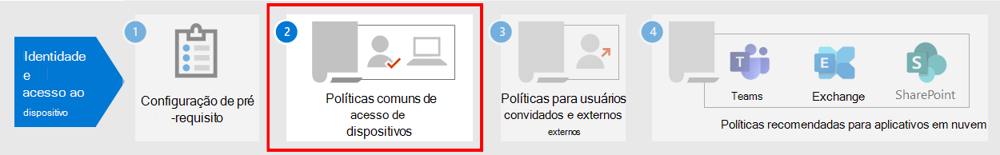

# Trabalho de pré-requisito para implementar políticas de acesso a dispositivos e identidadesPrerequisite work for implementing identity and device access policies

**Aplica-se a****Applies to**
- [Proteção do Exchange OnlineExchange Online Protection](exchange-online-protection-overview.md)
- [Plano 1 e plano 2 do Microsoft Defender para Office 365Microsoft Defender for Office 365 plan 1 and plan 2](defender-for-office-365.md)
- AzureAzure

Este artigo descreve que os administradores de pré-requisitos devem se reunir para usar políticas de acesso de dispositivo e identidade recomendadas e usar o Acesso Condicional.This article describes the prerequisites admins must meet to use recommended identity and device access policies, and to use Conditional Access. Ele também discute os padrões recomendados para configurar plataformas cliente para a melhor experiência de SSO (login único).It also discusses the recommended defaults for configuring client platforms for the best single sign-on (SSO) experience.

## Pré-requisitosPrerequisites

Antes de usar as políticas de acesso a dispositivos e identidades recomendadas, sua organização precisa atender aos pré-requisitos.Before using the identity and device access policies that are recommended, your organization needs to meet prerequisites. Os requisitos são diferentes para os vários modelos de identidade e autenticação listados:The requirements are different for the various identity and authentication models listed:

- Apenas NuvemCloud-only
- Híbrida com autenticação PHS (sincronização de hash de senha)Hybrid with password hash sync (PHS) authentication
- Híbrido com autenticação de passagem (PTA)Hybrid with pass-through authentication (PTA)
- FederadoFederated

A tabela a seguir detalha os recursos de pré-requisito e sua configuração que se aplicam a todos os modelos de identidade, exceto quando notados.The following table details the prerequisite features and their configuration that apply to all identity models, except where noted.

|ConfiguraçãoConfiguration|ExceçõesExceptions|LicenciamentoLicensing|
|---|:---:|---|
|[Configurar PHS](/azure/active-directory/hybrid/how-to-connect-password-hash-synchronization).[Configure PHS](/azure/active-directory/hybrid/how-to-connect-password-hash-synchronization).  Isso deve ser habilitado para detectar credenciais vazadas e para atuar neles para o Acesso Condicional baseado em risco.This must be enabled to detect leaked credentials and to act on them for risk-based Conditional Access. **Observação:** Isso é necessário independentemente de sua organização usar autenticação federada.**Note:** This is required regardless of whether your organization uses federated authentication.|Apenas NuvemCloud-only|Microsoft 365 E3 ou E5Microsoft 365 E3 or E5|
|[Habilita o logom único contínuo](/azure/active-directory/connect/active-directory-aadconnect-sso) para entrar automaticamente nos usuários quando eles estão em seus dispositivos de organização conectados à rede da sua organização.[Enable seamless single sign-on](/azure/active-directory/connect/active-directory-aadconnect-sso) to automatically sign users in when they are on their organization devices connected to your organization network.|Somente nuvem e federadoCloud-only and federated|Microsoft 365 E3 ou E5Microsoft 365 E3 or E5|
|[Configurar locais nomeados](/azure/active-directory/reports-monitoring/quickstart-configure-named-locations).[Configure named locations](/azure/active-directory/reports-monitoring/quickstart-configure-named-locations). O Azure AD Identity Protection coleta e analisa todos os dados de sessão disponíveis para gerar uma pontuação de risco.Azure AD Identity Protection collects and analyzes all available session data to generate a risk score. Recomendamos que você especifique os intervalos ip públicos da sua organização para sua rede na configuração de locais nomeados do Azure AD.We recommend you specify your organization's public IP ranges for your network in the Azure AD named locations configuration. O tráfego proveniente desses intervalos recebe uma pontuação de risco reduzida, e o tráfego de fora do ambiente da organização recebe uma pontuação de risco maior.Traffic coming from these ranges is given a reduced risk score, and traffic from outside the organization environment is given a higher risk score.||Microsoft 365 E3 ou E5Microsoft 365 E3 or E5|
|Registre todos os usuários para redefinição de senha de [autoatendados (SSPR) e autenticação multifafatória (MFA)](/azure/active-directory/authentication/concept-registration-mfa-sspr-converged).[Register all users for self-service password reset (SSPR) and multi-factor authentication (MFA)](/azure/active-directory/authentication/concept-registration-mfa-sspr-converged). Recomendamos que você registre usuários para a Autenticação Multifa factor do Azure AD com antecedência.We recommend you register users for Azure AD Multi-Factor Authentication ahead of time. A Proteção de Identidade do Azure AD usa a Autenticação Multifafação do Azure AD para executar verificação de segurança adicional.Azure AD Identity Protection makes use of Azure AD Multi-Factor Authentication to perform additional security verification. Além disso, para a melhor experiência de entrada, recomendamos que os usuários instalem o aplicativo [Microsoft Authenticator](/azure/active-directory/user-help/microsoft-authenticator-app-how-to) e o aplicativo microsoft Portal da Empresa em seus dispositivos.Additionally, for the best sign-in experience, we recommend users install the [Microsoft Authenticator app](/azure/active-directory/user-help/microsoft-authenticator-app-how-to) and the Microsoft Company Portal app on their devices. Eles podem ser instalados na loja de aplicativos para cada plataforma.These can be installed from the app store for each platform.||Microsoft 365 E3 ou E5Microsoft 365 E3 or E5|
|[Habilitar o registro automático de dispositivo de computadores Windows de domínio.](/azure/active-directory/active-directory-conditional-access-automatic-device-registration-setup)[Enable automatic device registration of domain-joined Windows computers](/azure/active-directory/active-directory-conditional-access-automatic-device-registration-setup). O Acesso Condicional garantirá que os dispositivos que se conectam aos aplicativos sejam ingressados no domínio ou em conformidade.Conditional Access will make sure devices connecting to apps are domain-joined or compliant. Para dar suporte a isso em computadores Windows, o dispositivo deve ser registrado com o Azure AD.To support this on Windows computers, the device must be registered with Azure AD.  Este artigo discute como configurar o registro de dispositivo automático.This article discusses how to configure automatic device registration.|Apenas NuvemCloud-only|Microsoft 365 E3 ou E5Microsoft 365 E3 or E5|
|**Preparar sua equipe de suporte**.**Prepare your support team**. Tenha um plano em vigor para os usuários que não podem concluir a MFA.Have a plan in place for users that cannot complete MFA. Isso pode estar adicionando-os a um grupo de exclusão de política ou registrando novas informações de MFA para eles.This could be adding them to a policy exclusion group, or registering new MFA information for them. Antes de fazer qualquer uma dessas alterações sensíveis à segurança, você precisa garantir que o usuário real está fazendo a solicitação.Before making either of these security-sensitive changes, you need to ensure that the actual user is making the request. Exigir que os gerentes dos usuários ajudem na aprovação é uma etapa eficaz.Requiring users' managers to help with the approval is an effective step.||Microsoft 365 E3 ou E5Microsoft 365 E3 or E5|
|[Configurar o write-back de senha para o AD local](/azure/active-directory/active-directory-passwords-getting-started).[Configure password writeback to on-premises AD](/azure/active-directory/active-directory-passwords-getting-started). O writeback de senha permite ao Azure AD exigir que os usuários alterem suas senhas locais quando um comprometimento de conta de alto risco é detectado.Password writeback allows Azure AD to require that users change their on-premises passwords when a high-risk account compromise is detected. Você pode habilitar esse recurso usando o Azure AD Conexão de duas maneiras: habilitar o **Writeback** de Senha na tela de recursos opcionais do assistente de instalação do Azure AD Conexão ou habilita-lo por meio de Windows PowerShell.You can enable this feature using Azure AD Connect in one of two ways: either enable **Password Writeback** in the optional features screen of the Azure AD Connect setup wizard, or enable it via Windows PowerShell.|Apenas NuvemCloud-only|Microsoft 365 E3 ou E5Microsoft 365 E3 or E5|
|[Configurar a proteção de senha do Azure AD.](/azure/active-directory/authentication/concept-password-ban-bad)[Configure Azure AD password protection](/azure/active-directory/authentication/concept-password-ban-bad). A Proteção por Senha do Microsoft Azure AD detecta e bloqueia senhas fracas conhecidas e suas variantes e também pode bloquear termos fracos adicionais específicos de sua organização.Azure AD Password Protection detects and blocks known weak passwords and their variants, and can also block additional weak terms that are specific to your organization. Listas de senhas globais proibidas padrão são aplicadas automaticamente a todos os usuários em um locatário do Microsoft Azure AD.Default global banned password lists are automatically applied to all users in an Azure AD tenant. Você pode definir entradas adicionais em uma lista de senhas proibidas personalizadas.You can define additional entries in a custom banned password list. Quando os usuários alteram ou redefinem suas senhas, essas listas de senhas proibidas são verificadas para garantir o uso de senhas fortes.When users change or reset their passwords, these banned password lists are checked to enforce the use of strong passwords.||Microsoft 365 E3 ou E5Microsoft 365 E3 or E5|
|[Habilitar Azure Active Directory Proteção de Identidade](/azure/active-directory/identity-protection/overview-identity-protection).[Enable Azure Active Directory Identity Protection](/azure/active-directory/identity-protection/overview-identity-protection). A Proteção de Identidade do Azure AD permite detectar possíveis vulnerabilidades que afetam as identidades da sua organização e configurar uma política de correção automatizada para baixo, médio e alto risco de login e risco de usuário.Azure AD Identity Protection enables you to detect potential vulnerabilities affecting your organization's identities and configure an automated remediation policy to low, medium, and high sign-in risk and user risk.||Microsoft 365 E5 ou Microsoft 365 E3 com o complemento segurança do E5Microsoft 365 E5 or Microsoft 365 E3 with the E5 Security add-on|
|**Habilitar a autenticação** [moderna para Exchange Online](/Exchange/clients-and-mobile-in-exchange-online/enable-or-disable-modern-authentication-in-exchange-online) e para Skype for Business [Online.](https://social.technet.microsoft.com/wiki/contents/articles/34339.skype-for-business-online-enable-your-tenant-for-modern-authentication.aspx)**Enable modern authentication** for [Exchange Online](/Exchange/clients-and-mobile-in-exchange-online/enable-or-disable-modern-authentication-in-exchange-online) and for [Skype for Business Online](https://social.technet.microsoft.com/wiki/contents/articles/34339.skype-for-business-online-enable-your-tenant-for-modern-authentication.aspx). A autenticação moderna é um pré-requisito para usar o MFA.Modern authentication is a prerequisite for using MFA. A autenticação moderna é habilitada por padrão para clientes Office 2016 e 2019, SharePoint e OneDrive for Business.Modern authentication is enabled by default for Office 2016 and 2019 clients, SharePoint, and OneDrive for Business.||Microsoft 365 E3 ou E5Microsoft 365 E3 or E5|
|

## Configurações de cliente recomendadasRecommended client configurations

Esta seção descreve as configurações padrão do cliente de plataforma que recomendamos para fornecer a melhor experiência de SSO para seus usuários, bem como os pré-requisitos técnicos para Acesso Condicional.This section describes the default platform client configurations we recommend to provide the best SSO experience to your users, as well as the technical prerequisites for Conditional Access.

### Dispositivos WindowsWindows devices

Recomendamos o Windows 10 (versão 2004 ou posterior), pois o Azure foi projetado para fornecer a experiência de SSO mais suave possível tanto para o local quanto para o Azure AD.We recommend the Windows 10 (version 2004 or later), as Azure is designed to provide the smoothest SSO experience possible for both on-premises and Azure AD. Dispositivos de trabalho ou de estudante devem ser configurados para ingressar diretamente no Azure AD ou se a organização usa a junção de domínio do AD local, esses dispositivos devem ser configurados para registrar-se automaticamente e silenciosamente no [Azure AD](/azure/active-directory/active-directory-conditional-access-automatic-device-registration-setup).Work or school-issued devices should be configured to join Azure AD directly or if the organization uses on-premises AD domain join, those devices should be [configured to automatically and silently register with Azure AD](/azure/active-directory/active-directory-conditional-access-automatic-device-registration-setup).

Para dispositivos Windows BYOD, os usuários podem usar **Adicionar conta de estudante ou trabalho.**For BYOD Windows devices, users can use **Add work or school account**. Observe que os usuários do navegador Google Chrome  em dispositivos Windows 10 precisam instalar uma extensão para obter a mesma experiência de entrada suave que Microsoft Edge usuários.Note that users of the Google Chrome browser on Windows 10 devices need to [install an extension](https://chrome.google.com/webstore/detail/windows-10-accounts/ppnbnpeolgkicgegkbkbjmhlideopiji?utm_source=chrome-app-launcher-info-dialog) to get the same smooth sign-in experience as Microsoft Edge users. Além disso, se sua organização tiver dispositivos Windows 8 ou 8.1 ingressados no domínio, você poderá instalar o Microsoft Workplace Join para computadores que não Windows 10.Also, if your organization has domain-joined Windows 8 or 8.1 devices, you can install Microsoft Workplace Join for non-Windows 10 computers. [Baixe o pacote para registrar](https://www.microsoft.com/download/details.aspx?id=53554) os dispositivos com o Azure AD.[Download the package to register](https://www.microsoft.com/download/details.aspx?id=53554) the devices with Azure AD.

### Dispositivos iOSiOS devices

Recomendamos instalar o aplicativo [Microsoft Authenticator em](/azure/multi-factor-authentication/end-user/microsoft-authenticator-app-how-to) dispositivos de usuário antes de implantar políticas de Acesso Condicional ou MFA.We recommend installing the [Microsoft Authenticator app](/azure/multi-factor-authentication/end-user/microsoft-authenticator-app-how-to) on user devices before deploying Conditional Access or MFA policies. No mínimo, o aplicativo deve ser instalado quando os usuários são solicitados a registrar seu dispositivo no Azure AD adicionando uma conta de estudante ou trabalho ou quando instalam o aplicativo portal da empresa do Intune para registrar seu dispositivo no gerenciamento.At a minimum, the app should be installed when users are asked to register their device with Azure AD by adding a work or school account, or when they install the Intune company portal app to enroll their device into management. Isso depende da política de Acesso Condicional configurada.This depends on the configured Conditional Access policy.

### Dispositivos AndroidAndroid devices

Recomendamos que os usuários instalem o [aplicativo Portal da Empresa do Intune](https://play.google.com/store/apps/details?id=com.microsoft.windowsintune.companyportal&hl=en) e o aplicativo [Microsoft Authenticator](/azure/multi-factor-authentication/end-user/microsoft-authenticator-app-how-to) antes que as políticas de Acesso Condicional sejam implantadas ou quando necessárias durante determinadas tentativas de autenticação.We recommend users install the [Intune Company Portal app](https://play.google.com/store/apps/details?id=com.microsoft.windowsintune.companyportal&hl=en) and [Microsoft Authenticator app](/azure/multi-factor-authentication/end-user/microsoft-authenticator-app-how-to) before Conditional Access policies are deployed or when required during certain authentication attempts. Após a instalação do aplicativo, os usuários podem ser solicitados a se registrarem com o Azure AD ou registrar seus dispositivos com o Intune.After app installation, users may be asked to register with Azure AD or enroll their device with Intune. Isso depende da política de Acesso Condicional configurada.This depends on the configured Conditional Access policy.

Também recomendamos que os dispositivos de propriedade da organização sejam padronizados em OEMs e versões que suportam Android for Work ou Samsung Knox para permitir que contas de email, sejam gerenciadas e protegidas pela política MDM do Intune.We also recommend that organization-owned devices are standardized on OEMs and versions that support Android for Work or Samsung Knox to allow mail accounts, be managed and protected by Intune MDM policy.

### Clientes de email recomendadosRecommended email clients

Os clientes de email a seguir suportam autenticação moderna e Acesso Condicional.The following email clients support modern authentication and Conditional Access.

|PlataformaPlatform|ClienteClient|Versão/NotasVersion/Notes|
|---|---|---|
|**Windows****Windows**|OutlookOutlook|2019, 2016, 20132019, 2016, 2013 
 [Habilitar autenticação modernaEnable modern authentication](../../admin/security-and-compliance/enable-modern-authentication.md) 
 [Atualizações necessáriasRequired updates](https://support.office.com/article/Outlook-Updates-472c2322-23a4-4014-8f02-bbc09ad62213)|
|**iOS****iOS**|Outlook para iOSOutlook for iOS|[Mais recenteLatest](https://itunes.apple.com/us/app/microsoft-outlook-email-and-calendar/id951937596?mt=8)|
|**Android****Android**|Outlook para AndroidOutlook for Android|[Mais recenteLatest](https://play.google.com/store/apps/details?id=com.microsoft.office.outlook&hl=en)|
|**macOS****macOS**|OutlookOutlook|2019 e 20162019 and 2016|
|**Linux****Linux**|Sem suporteNot supported||
|

### Plataformas de cliente recomendadas ao proteger documentosRecommended client platforms when securing documents

Os clientes a seguir são recomendados quando uma política de documentos seguros foi aplicada.The following clients are recommended when a secure documents policy has been applied.

|PlataformaPlatform|Word/Excel/PowerPointWord/Excel/PowerPoint|OneNoteOneNote|Aplicativo OneDriveOneDrive App|Aplicativo do SharePointSharePoint App|[Cliente de sincronização do OneDriveOneDrive sync client](/onedrive/enable-conditional-access)|
|---|---|---|---|---|---|
|Windows 8.1Windows 8.1|Com suporteSupported|Com suporteSupported|N/DN/A|N/DN/A|CompatívelSupported|
|Windows 10Windows 10|Com suporteSupported|Com suporteSupported|N/DN/A|N/DN/A|CompatívelSupported|
|AndroidAndroid|Com suporteSupported|Com suporteSupported|Com suporteSupported|Com suporteSupported|N/DN/A|
|iOSiOS|Com suporteSupported|Com suporteSupported|Com suporteSupported|Com suporteSupported|N/DN/A|
|macOSmacOS|Com suporteSupported|Com suporteSupported|N/DN/A|N/DN/A|Sem suporteNot supported|
|LinuxLinux|Sem suporteNot supported|Sem suporteNot supported|Sem suporteNot supported|Sem suporteNot supported|Sem suporteNot supported|
|

### Suporte ao aplicativo cliente do Microsoft 365Microsoft 365 client support

Para obter mais informações sobre o suporte ao cliente Microsoft 365, consulte os seguintes artigos:For more information about client support in Microsoft 365, see the following articles:

- [Microsoft 365 Suporte ao aplicativo cliente - Acesso CondicionalMicrosoft 365 Client App Support - Conditional Access](../../enterprise/microsoft-365-client-support-conditional-access.md)
- [Microsoft 365 Suporte ao aplicativo cliente - autenticação multifaçãoMicrosoft 365 Client App Support - Multi-factor authentication](../../enterprise/microsoft-365-client-support-multi-factor-authentication.md)

## Protegendo contas de administradorProtecting administrator accounts

Para Microsoft 365 E3 ou E5 ou com licenças separadas do Azure AD Premium P1 ou P2, você pode exigir MFA para contas de administrador com uma política de Acesso Condicional criada manualmente.For Microsoft 365 E3 or E5 or with separate Azure AD Premium P1 or P2 licenses, you can require MFA for administrator accounts with a manually-created Conditional Access policy. Consulte [Acesso Condicional: Exigir MFA para administradores](/azure/active-directory/conditional-access/howto-conditional-access-policy-admin-mfa) para obter os detalhes.See [Conditional Access: Require MFA for administrators](/azure/active-directory/conditional-access/howto-conditional-access-policy-admin-mfa) for the details.

Para edições de Microsoft 365 ou Office 365 que não suportam o Acesso  Condicional, você pode habilitar os padrões de segurança para exigir MFA para todas as contas.For editions of Microsoft 365 or Office 365 that do not support Conditional Access, you can enable [security defaults](/azure/active-directory/fundamentals/concept-fundamentals-security-defaults) to require MFA for all accounts.

Aqui estão algumas recomendações adicionais:Here are some additional recommendations:

- Use [o Azure AD Privileged Identity Management](/azure/active-directory/privileged-identity-management/pim-getting-started) reduzir o número de contas administrativas persistentes.Use [Azure AD Privileged Identity Management](/azure/active-directory/privileged-identity-management/pim-getting-started) to reduce the number of persistent administrative accounts.
- [Use o gerenciamento de](../../compliance/privileged-access-management-overview.md) acesso privilegiado para proteger sua organização contra violações que podem usar contas de administrador privilegiadas existentes com acesso permanente a dados confidenciais ou acesso a configurações críticas.[Use privileged access management](../../compliance/privileged-access-management-overview.md) to protect your organization from breaches that may use existing privileged admin accounts with standing access to sensitive data or access to critical configuration settings.
- Criar e usar contas separadas que são atribuídas [Microsoft 365 funções](../../admin/add-users/about-admin-roles.md) de administrador somente *para administração*.Create and use separate accounts that are assigned [Microsoft 365 administrator roles](../../admin/add-users/about-admin-roles.md) *only for administration*. Os administradores devem ter sua própria conta de usuário para uso normal não administrativo e usar apenas uma conta administrativa quando necessário para concluir uma tarefa associada à função ou função de trabalho.Admins should have their own user account for regular non-administrative use and only use an administrative account when necessary to complete a task associated with their role or job function.
- Siga [as práticas recomendadas](/azure/active-directory/admin-roles-best-practices) para proteger contas privilegiadas no Azure AD.Follow [best practices](/azure/active-directory/admin-roles-best-practices) for securing privileged accounts in Azure AD.

## Próxima etapaNext step

[Configurar as políticas comuns de identidade e acesso a dispositivosConfigure the common identity and device access policies](identity-access-policies.md)