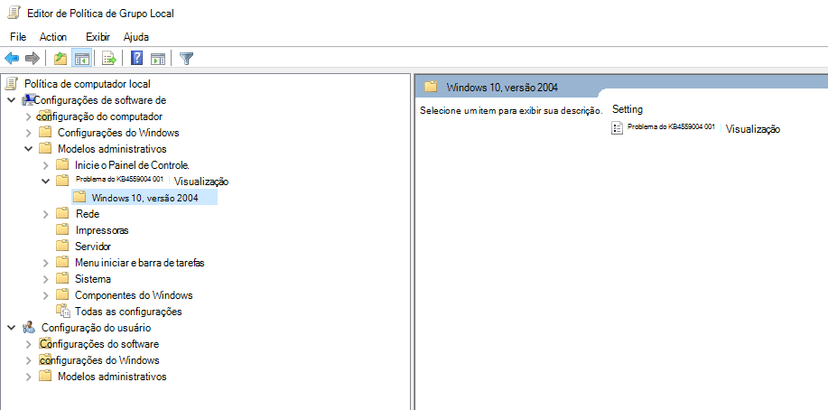
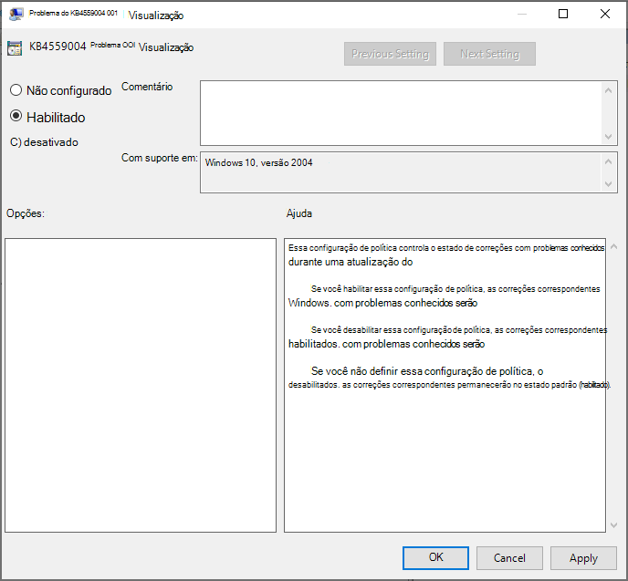

# <a name="application-guard-for-office-public-preview-for-admins"></a><span data-ttu-id="5881c-105">Application Guard para Office (visualização pública) para administradores</span><span class="sxs-lookup"><span data-stu-id="5881c-105">Application Guard for Office (public preview) for admins</span></span>


<span data-ttu-id="5881c-106">**Aplica-se a:** Word, Excel e PowerPoint para Microsoft 365, Windows 10 Enterprise</span><span class="sxs-lookup"><span data-stu-id="5881c-106">**Applies to:** Word, Excel, and PowerPoint for Microsoft 365, Windows 10 Enterprise</span></span>

>[!IMPORTANT]
><span data-ttu-id="5881c-107">Algumas informações estão relacionadas a um produto de pré-lançamento que pode ser modificado substancialmente antes de ser lançado comercialmente.</span><span class="sxs-lookup"><span data-stu-id="5881c-107">Some information relates to a prereleased product which may be substantially modified before it's commercially released.</span></span> <span data-ttu-id="5881c-108">Microsoft makes no warranties, express or implied, with respect to the information provided here.</span><span class="sxs-lookup"><span data-stu-id="5881c-108">Microsoft makes no warranties, express or implied, with respect to the information provided here.</span></span>


<span data-ttu-id="5881c-109">O Microsoft defender Application Guard para Office (Application Guard para Office) ajuda a impedir que arquivos não confiáveis acessem recursos confiáveis, mantendo sua empresa segura contra ataques novos e emergentes.</span><span class="sxs-lookup"><span data-stu-id="5881c-109">Microsoft Defender Application Guard for Office (Application Guard for Office) helps prevent untrusted files from accessing trusted resources, keeping your enterprise safe from new and emerging attacks.</span></span> <span data-ttu-id="5881c-110">Este artigo orienta os administradores na configuração de dispositivos para uma visualização do Application Guard para Office.</span><span class="sxs-lookup"><span data-stu-id="5881c-110">This article walks admins through setting up devices for a preview of Application Guard for Office.</span></span> <span data-ttu-id="5881c-111">Ele fornece informações sobre os requisitos do sistema e as etapas de instalação para habilitar o Application Guard para Office em um dispositivo.</span><span class="sxs-lookup"><span data-stu-id="5881c-111">It provides information about system requirements and installation steps to enable Application Guard for Office on a device.</span></span>

## <a name="prerequisites"></a><span data-ttu-id="5881c-112">Pré-requisitos</span><span class="sxs-lookup"><span data-stu-id="5881c-112">Prerequisites</span></span>

### <a name="minimum-hardware-requirements"></a><span data-ttu-id="5881c-113">Requisitos mínimos de hardware</span><span class="sxs-lookup"><span data-stu-id="5881c-113">Minimum hardware requirements</span></span>

* <span data-ttu-id="5881c-114">**CPU**: 64 bits, 4 núcleos (físico ou virtual), extensões de virtualização (Intel VT-x ou AMD-V), Core i5 equivalente ou superior recomendado</span><span class="sxs-lookup"><span data-stu-id="5881c-114">**CPU**: 64-bit, 4 cores (physical or virtual), virtualization extensions   (Intel VT-x OR AMD-V), Core i5 equivalent or higher recommended</span></span>
* <span data-ttu-id="5881c-115">**Memória física**: 8 GB de RAM</span><span class="sxs-lookup"><span data-stu-id="5881c-115">**Physical memory**: 8-GB RAM</span></span>
* <span data-ttu-id="5881c-116">**Disco rígido**: 10 GB de espaço livre na unidade do sistema (SSD recomendado)</span><span class="sxs-lookup"><span data-stu-id="5881c-116">**Hard disk**: 10 GB of free space on the system drive (SSD recommended)</span></span>

### <a name="minimum-software-requirements"></a><span data-ttu-id="5881c-117">Requisitos mínimos de software</span><span class="sxs-lookup"><span data-stu-id="5881c-117">Minimum software requirements</span></span>

* <span data-ttu-id="5881c-118">**Windows 10**: Windows 10 Enterprise Edition, Client Build Version 2004 (20H1) Build 19041</span><span class="sxs-lookup"><span data-stu-id="5881c-118">**Windows 10**: Windows 10 Enterprise edition, Client Build version 2004 (20H1) build 19041</span></span>
* <span data-ttu-id="5881c-119">**Office**: Office beta Channel Build versão 2008 16.0.13212 ou posterior</span><span class="sxs-lookup"><span data-stu-id="5881c-119">**Office**: Office Beta Channel Build version 2008 16.0.13212 or later</span></span>
* <span data-ttu-id="5881c-120">**Pacote de atualização**: atualizações de segurança mensais cumulativas do Windows 10 [KB4566782](https://support.microsoft.com/help/4566782/windows-10-update-kb4566782)</span><span class="sxs-lookup"><span data-stu-id="5881c-120">**Update package**: Windows 10 cumulative monthly security updates [KB4566782](https://support.microsoft.com/help/4566782/windows-10-update-kb4566782)</span></span> 

<span data-ttu-id="5881c-121">Para requisitos de sistema detalhados, consulte [requisitos do sistema para o Microsoft defender Application Guard](https://docs.microsoft.com/windows/security/threat-protection/microsoft-defender-application-guard/reqs-md-app-guard).</span><span class="sxs-lookup"><span data-stu-id="5881c-121">For detailed system requirements, refer to [System requirements for Microsoft Defender Application Guard](https://docs.microsoft.com/windows/security/threat-protection/microsoft-defender-application-guard/reqs-md-app-guard).</span></span> <span data-ttu-id="5881c-122">Para saber mais sobre as compilações do Office Insider Preview, consulte Introdução à implantação do Office Insider [Compilations](https://insider.office.com/business/deploy).</span><span class="sxs-lookup"><span data-stu-id="5881c-122">To learn more about Office Insider Preview builds, refer to [Getting started on deploying Office Insider builds](https://insider.office.com/business/deploy).</span></span>

### <a name="licensing-requirements"></a><span data-ttu-id="5881c-123">Requisitos de licença</span><span class="sxs-lookup"><span data-stu-id="5881c-123">Licensing requirements</span></span>
* <span data-ttu-id="5881c-124">Segurança da Microsoft 365 E5 ou do Microsoft 365 e5</span><span class="sxs-lookup"><span data-stu-id="5881c-124">Microsoft 365 E5 or Microsoft 365 E5 Security</span></span>

## <a name="deploy-application-guard-for-office"></a><span data-ttu-id="5881c-125">Implantar o Application Guard para Office</span><span class="sxs-lookup"><span data-stu-id="5881c-125">Deploy Application Guard for Office</span></span>

### <a name="enable-application-guard-for-office"></a><span data-ttu-id="5881c-126">Habilitar o Application Guard para Office</span><span class="sxs-lookup"><span data-stu-id="5881c-126">Enable Application Guard for Office</span></span>

1.  <span data-ttu-id="5881c-127">Baixe e instale **as atualizações de segurança mensal cumulativas do Windows 10 KB4566782**.</span><span class="sxs-lookup"><span data-stu-id="5881c-127">Download and install **Windows 10 cumulative monthly security updates KB4566782**.</span></span> 

2. <span data-ttu-id="5881c-128">Baixe e instale o [**pacote de habilitação de recursos do Application Guard para Office**](https://download.microsoft.com/download/e/4/c/e4c1180a-fcff-462a-8324-4151c44973a8/Windows%20Preview%20-%20WDAG%20Office%20070920%2001.msi).</span><span class="sxs-lookup"><span data-stu-id="5881c-128">Download and install [**Application Guard for Office Feature enablement package**](https://download.microsoft.com/download/e/4/c/e4c1180a-fcff-462a-8324-4151c44973a8/Windows%20Preview%20-%20WDAG%20Office%20070920%2001.msi).</span></span> <span data-ttu-id="5881c-129">Este pacote instala uma diretiva de grupo chamada "KB4559004 Issue 001 Preview" em **configuração do Computador\modelos modelos**.</span><span class="sxs-lookup"><span data-stu-id="5881c-129">This package installs a group policy called "KB4559004 Issue 001 Preview" under **Computer Configuration\Administrative Templates**.</span></span> <span data-ttu-id="5881c-130">Defina essa política de grupo como **habilitado**.</span><span class="sxs-lookup"><span data-stu-id="5881c-130">Set this group policy  to **Enabled**.</span></span>
     <span data-ttu-id="5881c-131"></span><span class="sxs-lookup"><span data-stu-id="5881c-131"></span></span>

     

    <span data-ttu-id="5881c-133">Você também pode definir diretamente as seguintes chaves do registro:</span><span class="sxs-lookup"><span data-stu-id="5881c-133">You can also directly set the following reg keys:</span></span> 
    
    ```
    reg add HKLM\SYSTEM\CurrentControlSet\Policies\Microsoft\FeatureManagement\Overrides /v 3457697930 /t REG_DWORD /d 1 
    ```
    ```
    reg add HKLM\SYSTEM\CurrentControlSet\Policies\Microsoft\FeatureManagement\Overrides /v 94539402 /t REG_DWORD /d 1 
    ```
    <span data-ttu-id="5881c-134">Em seguida, execute este comando do PowerShell:</span><span class="sxs-lookup"><span data-stu-id="5881c-134">Then, run this PowerShell command:</span></span> 
    
    ```powershell
    Get-ScheduledTask -TaskName "ReconcileFeatures" -TaskPath "\Microsoft\Windows\Flighting\FeatureConfig\" | Start-ScheduledTask 
    ```

3.  <span data-ttu-id="5881c-135">Selecione **Microsoft defender Application Guard** em recursos do Windows e clique em **OK**.</span><span class="sxs-lookup"><span data-stu-id="5881c-135">Select **Microsoft Defender Application Guard** under Windows Features and select **OK**.</span></span> <span data-ttu-id="5881c-136">Habilitar o recurso de proteção de aplicativos solicitará uma reinicialização do sistema.</span><span class="sxs-lookup"><span data-stu-id="5881c-136">Enabling the Application Guard feature will prompt a system reboot.</span></span> <span data-ttu-id="5881c-137">Você pode optar por reinicializar agora ou após a etapa 4.</span><span class="sxs-lookup"><span data-stu-id="5881c-137">You can choose to reboot now or after step 4.</span></span>

    
    
    <span data-ttu-id="5881c-139">O recurso também pode ser habilitado executando o seguinte comando do PowerShell como administrador:</span><span class="sxs-lookup"><span data-stu-id="5881c-139">The feature can also be enabled by running the following PowerShell command as administrator:</span></span> 

    ```powershell
    Enable-WindowsOptionalFeature -online -FeatureName Windows-Defender-ApplicationGuard 
    ```

4.  <span data-ttu-id="5881c-140">Procure o Microsoft defender Application Guard na política de grupo do modo gerenciado, localizada em **configuração \\ do computador modelos \\ \\ do Windows do Microsoft defender Application Guard**.</span><span class="sxs-lookup"><span data-stu-id="5881c-140">Look for the Microsoft Defender Application Guard in Managed Mode group policy located at **Computer Configuration\\Administrative Templates\\Windows Components\\Microsoft Defender Application Guard**.</span></span> <span data-ttu-id="5881c-141">Ative esta política Configurando o valor em opções como **2** ou **3** e, em seguida, selecione **OK** ou **aplicar**.</span><span class="sxs-lookup"><span data-stu-id="5881c-141">Turn this policy on by setting the value under Options as **2** or **3** then selecting **OK** or **Apply**.</span></span>

    
  
    <span data-ttu-id="5881c-143">Como alternativa, você pode definir a política de CSP correspondente:</span><span class="sxs-lookup"><span data-stu-id="5881c-143">Alternatively, you can set the corresponding CSP policy:</span></span> 

    <span data-ttu-id="5881c-144">OMA-URI: **./Device/Vendor/MSFT/WindowsDefenderApplicationGuard/Settings/AllowWindowsDefenderApplicationGuard** 
    </span><span class="sxs-lookup"><span data-stu-id="5881c-144">OMA-URI: **./Device/Vendor/MSFT/WindowsDefenderApplicationGuard/Settings/AllowWindowsDefenderApplicationGuard** 
    </span></span><br><span data-ttu-id="5881c-145">Tipo de dados: **inteiro** 
</span><span class="sxs-lookup"><span data-stu-id="5881c-145">Data type: **Integer** 
</span></span><br><span data-ttu-id="5881c-146">Valor: **2**</span><span class="sxs-lookup"><span data-stu-id="5881c-146">Value: **2**</span></span>


5.  <span data-ttu-id="5881c-147">Reinicialize o sistema.</span><span class="sxs-lookup"><span data-stu-id="5881c-147">Reboot the system.</span></span>

### <a name="set-diagnostics--feedback-to-send-full-data"></a><span data-ttu-id="5881c-148">Definir & comentários de diagnóstico para enviar dados completos</span><span class="sxs-lookup"><span data-stu-id="5881c-148">Set Diagnostics & feedback to send full data</span></span>

<span data-ttu-id="5881c-149">Esta etapa garante que os dados necessários para identificar e corrigir problemas estejam chegando à Microsoft.</span><span class="sxs-lookup"><span data-stu-id="5881c-149">This step ensures that the data necessary to identify and fix problems is reaching Microsoft.</span></span> <span data-ttu-id="5881c-150">Siga estas etapas para habilitar o diagnóstico no seu dispositivo Windows:</span><span class="sxs-lookup"><span data-stu-id="5881c-150">Follow these steps to enable diagnostics on your Windows device:</span></span>

1.  <span data-ttu-id="5881c-151">Abra **configurações** no menu iniciar.</span><span class="sxs-lookup"><span data-stu-id="5881c-151">Open **Settings** from the Start menu.</span></span>

    

2.  <span data-ttu-id="5881c-153">Em **configurações do Windows**, selecione **privacidade**.</span><span class="sxs-lookup"><span data-stu-id="5881c-153">On **Windows Settings**, select **Privacy**.</span></span>

    

3.  <span data-ttu-id="5881c-155">Em privacidade, selecione **diagnóstico & comentários** e selecione **dados de diagnóstico opcionais**.</span><span class="sxs-lookup"><span data-stu-id="5881c-155">Under Privacy, select **Diagnostics & feedback** and select **Optional diagnostic data**.</span></span>

    

<span data-ttu-id="5881c-157">Para saber mais sobre como definir as configurações de diagnóstico do Windows, confira [configurando dados de diagnóstico do Windows em sua organização](https://docs.microsoft.com/windows/privacy/configure-windows-diagnostic-data-in-your-organization#enterprise-management).</span><span class="sxs-lookup"><span data-stu-id="5881c-157">For more on configuring Windows diagnostic settings, refer to [Configuring Windows diagnostic data in your organization](https://docs.microsoft.com/windows/privacy/configure-windows-diagnostic-data-in-your-organization#enterprise-management).</span></span>

### <a name="confirm-that-application-guard-for-office-is-enabled-and-working"></a><span data-ttu-id="5881c-158">Confirmar se o Application Guard para Office está habilitado e funcionando</span><span class="sxs-lookup"><span data-stu-id="5881c-158">Confirm that Application Guard for Office is enabled and working</span></span>

<span data-ttu-id="5881c-159">Antes de confirmar que o Application Guard para Office está habilitado, inicie o Word, o Excel ou o PowerPoint em um dispositivo onde as políticas foram implantadas.</span><span class="sxs-lookup"><span data-stu-id="5881c-159">Before confirming that the Application Guard for Office is enabled, launch Word, Excel, or PowerPoint on a device where the policies have been deployed.</span></span> <span data-ttu-id="5881c-160">Verifique se o Office está ativado.</span><span class="sxs-lookup"><span data-stu-id="5881c-160">Make sure Office is activated.</span></span> <span data-ttu-id="5881c-161">Talvez seja necessário usar sua identidade de trabalho para ativar primeiro o produto do Office.</span><span class="sxs-lookup"><span data-stu-id="5881c-161">You may need to use your work identity to activate the Office product first.</span></span>

<span data-ttu-id="5881c-162">Para confirmar se o Application Guard para Office agora está habilitado, inicie o Word, o Excel ou o PowerPoint e abra um documento não confiável.</span><span class="sxs-lookup"><span data-stu-id="5881c-162">To confirm that Application Guard for Office is now enabled, launch Word, Excel, or PowerPoint and open an untrusted document.</span></span> <span data-ttu-id="5881c-163">Por exemplo, você pode abrir um documento baixado da Internet ou um anexo de email de alguém fora da sua organização.</span><span class="sxs-lookup"><span data-stu-id="5881c-163">For example, you can open a document downloaded from the internet or an email attachment from someone outside your organization.</span></span>

<span data-ttu-id="5881c-164">Na primeira inicialização de um arquivo não confiável, você pode ver uma tela de abertura do Office como a seguinte.</span><span class="sxs-lookup"><span data-stu-id="5881c-164">On the first launch of an untrusted file, you may see an Office splash screen like the one below.</span></span> <span data-ttu-id="5881c-165">Ele pode mostrar por algum tempo enquanto o Application Guard para Office está sendo ativado e o arquivo está sendo aberto.</span><span class="sxs-lookup"><span data-stu-id="5881c-165">It might show for some time while Application Guard for Office is being activated and the file is being opened.</span></span> <span data-ttu-id="5881c-166">Os lançamentos subsequentes de arquivos não confiáveis devem ser mais rápidos.</span><span class="sxs-lookup"><span data-stu-id="5881c-166">Subsequent launches of untrusted files should be faster.</span></span>


<span data-ttu-id="5881c-168">Após a abertura, o arquivo deve exibir alguns indicadores visuais que o arquivo foi aberto no Application Guard para Office:</span><span class="sxs-lookup"><span data-stu-id="5881c-168">Upon being opened, the file should display a few visual indicators that the file was opened inside Application Guard for Office:</span></span>

* <span data-ttu-id="5881c-169">Um texto explicativo na faixa de opções</span><span class="sxs-lookup"><span data-stu-id="5881c-169">A callout in the ribbon</span></span>

    
* <span data-ttu-id="5881c-171">O ícone do aplicativo com um escudo na barra de tarefas</span><span class="sxs-lookup"><span data-stu-id="5881c-171">The application icon with a shield in the taskbar</span></span> 

    


## <a name="configure-application-guard-for-office"></a><span data-ttu-id="5881c-173">Configurar o Application Guard para Office</span><span class="sxs-lookup"><span data-stu-id="5881c-173">Configure Application Guard for Office</span></span>
<span data-ttu-id="5881c-174">O Office oferece suporte às seguintes políticas para permitir que você configure os recursos do Application Guard para Office.</span><span class="sxs-lookup"><span data-stu-id="5881c-174">Office supports the following policies to enable you to configure the capabilities of Application Guard for Office.</span></span> <span data-ttu-id="5881c-175">Essas políticas podem ser configuradas por meio de políticas de grupo ou através do serviço política de nuvem do Office.</span><span class="sxs-lookup"><span data-stu-id="5881c-175">These policies can be configured through Group policies or through the Office cloud policy service.</span></span> 

>[!NOTE] 
> <span data-ttu-id="5881c-176">Essas políticas ficarão disponíveis em breve.</span><span class="sxs-lookup"><span data-stu-id="5881c-176">These policies will become available soon.</span></span>
><span data-ttu-id="5881c-177">Além disso, a configuração dessas políticas pode desabilitar algumas funcionalidades para arquivos abertos no Application Guard para Office.</span><span class="sxs-lookup"><span data-stu-id="5881c-177">Also, configuring these policies can disable some functionalities for files opened in Application Guard for Office.</span></span>

| <span data-ttu-id="5881c-178">Política</span><span class="sxs-lookup"><span data-stu-id="5881c-178">Policy</span></span>                                                                          | <span data-ttu-id="5881c-179">Descrição</span><span class="sxs-lookup"><span data-stu-id="5881c-179">Description</span></span>                                                                                                                                                                                                                                                                                             |
|---------------------------------------------------------------------------------|---------------------------------------------------------------------------------------------------------------------------------------------------------------------------------------------------------------------------------------------------------------------------------------------------------|
| <span data-ttu-id="5881c-180">Desabilitar o Application Guard para Office</span><span class="sxs-lookup"><span data-stu-id="5881c-180">Disable Application Guard for Office</span></span>                                            | <span data-ttu-id="5881c-181">Habilitar essa política forçará o Word, o Excel e o PowerPoint a usar o contêiner de isolamento do modo de exibição protegido, em vez do Application Guard para Office.</span><span class="sxs-lookup"><span data-stu-id="5881c-181">Enabling this policy will force Word, Excel, and PowerPoint to use the Protected View isolation container instead of Application Guard for Office.</span></span> <span data-ttu-id="5881c-182">Essa política pode ser usada para desabilitar temporariamente o Application Guard para Office quando há problemas para deixá-lo habilitado para a borda.</span><span class="sxs-lookup"><span data-stu-id="5881c-182">This policy can be used to temporarily disable Application Guard for Office when there are issues in leaving it enabled for Edge.</span></span>                                  |
| <span data-ttu-id="5881c-183">Desabilitar copiar/colar para documentos abertos no Application Guard</span><span class="sxs-lookup"><span data-stu-id="5881c-183">Disable copy/paste for documents opened in Application Guard</span></span>                    | <span data-ttu-id="5881c-184">Habilitar essa política impedirá que um usuário Copie e cole o conteúdo de um documento aberto no Application Guard para Office em um documento aberto fora dele.</span><span class="sxs-lookup"><span data-stu-id="5881c-184">Enabling this policy will prevent a user from copying and pasting content from a document opened in Application Guard for Office to a document opened outside it.</span></span>                                                                                                                                   |
| <span data-ttu-id="5881c-185">Impedir que os usuários removam a proteção do Application Guard nos arquivos</span><span class="sxs-lookup"><span data-stu-id="5881c-185">Prevent users from removing Application Guard protection on files</span></span>               | <span data-ttu-id="5881c-186">Habilitar essa política removerá a opção (dentro da experiência de aplicativo do Office) para desabilitar a proteção do Application Guard ou abrir um arquivo fora do Application Guard.</span><span class="sxs-lookup"><span data-stu-id="5881c-186">Enabling this policy will remove the option (within the Office application experience) to disable Application Guard protection or open a file outside Application Guard.</span></span> <br><br><span data-ttu-id="5881c-187">**Observação:** Os usuários ainda podem ignorar essa política removendo manualmente a propriedade de marca da Web do arquivo ou movendo um documento para um local confiável.</span><span class="sxs-lookup"><span data-stu-id="5881c-187">**Note:** Users can still bypass this policy by manually removing the mark-of-the-web property from the file or by moving a document to a Trusted location.</span></span> |
| <span data-ttu-id="5881c-188">Restringir a impressão de documentos abertos no Application Guard</span><span class="sxs-lookup"><span data-stu-id="5881c-188">Restrict printing from documents opened in Application Guard</span></span>                    | <span data-ttu-id="5881c-189">Habilitar essa política limitará as impressoras que um usuário pode imprimir de um arquivo aberto no Application Guard para Office.</span><span class="sxs-lookup"><span data-stu-id="5881c-189">Enabling this policy will limit printers a user can print to from a file opened in Application Guard for Office.</span></span> <span data-ttu-id="5881c-190">Por exemplo, você pode usar essa política para restringir que os usuários imprimam apenas em PDF.</span><span class="sxs-lookup"><span data-stu-id="5881c-190">For example, you can use this policy to restrict users to only print to PDF.</span></span>                              |
| <span data-ttu-id="5881c-191">Desligar o acesso de câmera e microfone para documentos abertos no Application Guard</span><span class="sxs-lookup"><span data-stu-id="5881c-191">Turn off camera and microphone access for documents opened in Application Guard</span></span> | <span data-ttu-id="5881c-192">Habilitar essa política removerá o Office Access para câmera e microfone dentro do Application Guard para Office.</span><span class="sxs-lookup"><span data-stu-id="5881c-192">Enabling this policy will remove Office access to Camera and Microphone inside Application Guard for Office.</span></span>                                                                                                                                                                                                     |
>[!NOTE] 
><span data-ttu-id="5881c-193">As políticas a seguir exigirão que o usuário faça logoff e logon novamente no Windows para ter efeito:</span><span class="sxs-lookup"><span data-stu-id="5881c-193">The following policies will require the user to log off and re-login to Windows to take effect:</span></span>
> 
> *  <span data-ttu-id="5881c-194">Desabilitar copiar/colar para documentos abertos no Application Guard</span><span class="sxs-lookup"><span data-stu-id="5881c-194">Disable copy/paste for documents opened in Application Guard</span></span>
>*  <span data-ttu-id="5881c-195">Restringir a impressão de documentos abertos no Application Guard</span><span class="sxs-lookup"><span data-stu-id="5881c-195">Restrict printing for documents opened in Application Guard</span></span>
> *  <span data-ttu-id="5881c-196">Desligar o acesso de câmera e microfone aos documentos abertos no Application Guard</span><span class="sxs-lookup"><span data-stu-id="5881c-196">Turn off camera and mic access to documents opened in Application Guard</span></span>


## <a name="submit-feedback"></a><span data-ttu-id="5881c-197">Enviar comentários</span><span class="sxs-lookup"><span data-stu-id="5881c-197">Submit feedback</span></span>

### <a name="submit-feedback-via-feedback-hub"></a><span data-ttu-id="5881c-198">Enviar comentários via hub de comentários</span><span class="sxs-lookup"><span data-stu-id="5881c-198">Submit feedback via Feedback Hub</span></span>

<span data-ttu-id="5881c-199">Se você tiver problemas ao iniciar o Application Guard para Office, será incentivado a enviar seus comentários por meio do hub de comentários:</span><span class="sxs-lookup"><span data-stu-id="5881c-199">If you encounter any issues when launching Application Guard for Office, you are encouraged to submit your feedback via Feedback Hub:</span></span>

1.  <span data-ttu-id="5881c-200">Abra o **aplicativo de Hub de comentários** e entre.</span><span class="sxs-lookup"><span data-stu-id="5881c-200">Open the **Feedback Hub app** and sign in.</span></span>

2.  <span data-ttu-id="5881c-201">Se você receber uma caixa de diálogo de erro ao iniciar o Application Guard, selecione **relatar à Microsoft** na caixa de diálogo de erro para iniciar um novo envio de comentários.</span><span class="sxs-lookup"><span data-stu-id="5881c-201">If you get an error dialog while launching Application Guard, select **Report to Microsoft** in the error dialog to start a new feedback submission.</span></span> <span data-ttu-id="5881c-202">Caso contrário, navegue até <https://aka.ms/wdagoffice-fb> para selecionar a categoria correta para o Application Guard e, em seguida, selecione **+ Adicionar novo feedback** perto do canto superior direito.</span><span class="sxs-lookup"><span data-stu-id="5881c-202">Otherwise, navigate to <https://aka.ms/wdagoffice-fb> to select the correct category for Application Guard, then select **+ Add new feedback** near the top right.</span></span>

3.  <span data-ttu-id="5881c-203">Preencha a caixa **resumir sua opinião** se ela ainda não estiver preenchida para você.</span><span class="sxs-lookup"><span data-stu-id="5881c-203">Fill in the **Summarize your feedback** box if it isn’t already filled in for you.</span></span>

4.  <span data-ttu-id="5881c-204">Preencha a **explicação em** uma caixa de detalhes com uma descrição detalhada do problema que você experimentou e quais etapas você executou e, em seguida, selecione **Avançar**.</span><span class="sxs-lookup"><span data-stu-id="5881c-204">Fill in the **Explain in more detail** box with a detailed description of the issue you experienced and what steps you took, then select **Next**.</span></span>

5.  <span data-ttu-id="5881c-205">Selecione o balão próximo a problema.</span><span class="sxs-lookup"><span data-stu-id="5881c-205">Select the bubble next to Problem.</span></span> <span data-ttu-id="5881c-206">Certifique-se de que a categoria selecionada é **segurança e privacidade \> Microsoft defender Application Guard – Office**e, em seguida, selecione **Avançar**.</span><span class="sxs-lookup"><span data-stu-id="5881c-206">Make sure the category selected is **Security and Privacy \> Microsoft Defender Application Guard – Office**, then select **Next**.</span></span>

6.  <span data-ttu-id="5881c-207">Selecione **novo comentário**e, em seguida, **Avançar**.</span><span class="sxs-lookup"><span data-stu-id="5881c-207">Select **New feedback**, then **Next**.</span></span>

7.  <span data-ttu-id="5881c-208">Coletar rastreamentos sobre o problema:</span><span class="sxs-lookup"><span data-stu-id="5881c-208">Collect traces about the issue:</span></span>

    1. <span data-ttu-id="5881c-209">Expanda o bloco **recriar meu problema** .</span><span class="sxs-lookup"><span data-stu-id="5881c-209">Expand the **Recreate my problem** tile.</span></span>

    2.  <span data-ttu-id="5881c-210">Se o problema que você está tendo ocorre enquanto o Application Guard está sendo executado, abra uma instância do Application Guard.</span><span class="sxs-lookup"><span data-stu-id="5881c-210">If the issue you’re experiencing occurs while Application Guard is running, open an Application Guard instance.</span></span> <span data-ttu-id="5881c-211">Isso permite que rastreamentos adicionais sejam coletados de dentro do contêiner do Application Guard.</span><span class="sxs-lookup"><span data-stu-id="5881c-211">Doing this allows additional traces to be collected from within the Application Guard container.</span></span>

    3.  <span data-ttu-id="5881c-212">Selecione **Iniciar gravação** e aguarde até que o bloco pare de rodar e diga *parar gravação*.</span><span class="sxs-lookup"><span data-stu-id="5881c-212">Select **Start recording** and wait for the tile to stop spinning and say *Stop recording*.</span></span>

    4.  <span data-ttu-id="5881c-213">Reproduza o problema com o Application Guard.</span><span class="sxs-lookup"><span data-stu-id="5881c-213">Fully reproduce the issue with Application Guard.</span></span> <span data-ttu-id="5881c-214">Isso pode incluir a tentativa de iniciar uma instância do Application Guard e aguardar até que ela falhe, ou reproduzir um problema em uma instância de proteção de aplicativo em execução.</span><span class="sxs-lookup"><span data-stu-id="5881c-214">This might include attempting to launch an Application Guard instance and waiting until it fails, or reproducing an issue in a running Application Guard instance.</span></span>

    5.  <span data-ttu-id="5881c-215">Selecione o bloco **parar gravação** .</span><span class="sxs-lookup"><span data-stu-id="5881c-215">Select the **Stop recording** tile.</span></span>

    6.  <span data-ttu-id="5881c-216">Mantenha qualquer instância do Application Guard em execução aberta, mesmo até alguns minutos após o envio, para que o diagnóstico de contêiner também possa ser coletado.</span><span class="sxs-lookup"><span data-stu-id="5881c-216">Keep any running Application Guard instance/s open, even until a few minutes after submission, so that container diagnostics can also be collected.</span></span>

8.  <span data-ttu-id="5881c-217">Anexe quaisquer capturas de tela ou arquivos relevantes relacionados ao problema.</span><span class="sxs-lookup"><span data-stu-id="5881c-217">Attach any relevant screenshots or files related to the problem.</span></span>

9.  <span data-ttu-id="5881c-218">Selecione **Enviar**.</span><span class="sxs-lookup"><span data-stu-id="5881c-218">Select **Submit**.</span></span>


### <a name="submit-feedback-via-office-customer-voice"></a><span data-ttu-id="5881c-219">Enviar comentários via voz de cliente do Office</span><span class="sxs-lookup"><span data-stu-id="5881c-219">Submit feedback via Office Customer Voice</span></span>

<span data-ttu-id="5881c-220">Você também pode enviar comentários de dentro do Office se o problema ocorrer quando os documentos do Office são abertos no Application Guard.</span><span class="sxs-lookup"><span data-stu-id="5881c-220">You may also submit feedback from within Office if the issue happens when Office documents are opened in Application Guard.</span></span> <span data-ttu-id="5881c-221">Consulte o [manual do Office Insider](https://insider.office.com/handbook) para enviar comentários.</span><span class="sxs-lookup"><span data-stu-id="5881c-221">Refer to the [Office Insider Handbook](https://insider.office.com/handbook) for submitting feedback.</span></span>

## <a name="integration-with-microsoft-defender-atp-and-office-atp"></a><span data-ttu-id="5881c-222">Integração com o Microsoft defender ATP e o Office ATP</span><span class="sxs-lookup"><span data-stu-id="5881c-222">Integration with Microsoft Defender ATP and Office ATP</span></span>

<span data-ttu-id="5881c-223">O Application Guard para Office é integrado ao Microsoft defender Advanced Threat Protection (ATP) para fornecer monitoramento e alerta sobre atividades mal-intencionadas acontecendo no ambiente isolado.</span><span class="sxs-lookup"><span data-stu-id="5881c-223">Application Guard for Office is integrated with Microsoft Defender Advance Threat Protection (ATP) to provide monitoring and alerting on malicious activity happening in the isolated environment.</span></span>

<span data-ttu-id="5881c-224">O Microsoft defender ATP é uma plataforma de segurança projetada para ajudar as redes corporativas a prevenir, detectar, investigar e responder a ameaças avançadas.</span><span class="sxs-lookup"><span data-stu-id="5881c-224">Microsoft Defender ATP is a security platform designed to help enterprise networks prevent, detect, investigate, and respond to advanced threats.</span></span> <span data-ttu-id="5881c-225">Para obter mais detalhes sobre esta plataforma, visite a página [proteção avançada contra ameaças do Microsoft defender](https://www.microsoft.com/microsoft-365/windows/microsoft-defender-atp) .</span><span class="sxs-lookup"><span data-stu-id="5881c-225">For more details about this platform, visit the [Microsoft Defender Advanced Threat Protection](https://www.microsoft.com/microsoft-365/windows/microsoft-defender-atp) page.</span></span> <span data-ttu-id="5881c-226">Saiba mais sobre os dispositivos de integração com esta plataforma em [dispositivos integrados ao serviço Microsoft defender ATP](https://docs.microsoft.com/windows/security/threat-protection/microsoft-defender-atp/onboard-configure).</span><span class="sxs-lookup"><span data-stu-id="5881c-226">Learn more about onboarding devices to this platform at [Onboard devices to the Microsoft Defender ATP service](https://docs.microsoft.com/windows/security/threat-protection/microsoft-defender-atp/onboard-configure).</span></span>

<span data-ttu-id="5881c-227">Você também pode configurar o Office 365 ATP para funcionar com o Microsoft defender ATP.</span><span class="sxs-lookup"><span data-stu-id="5881c-227">You can also configure Office 365 ATP to work with Microsoft Defender ATP.</span></span> <span data-ttu-id="5881c-228">Consulte [integrar o Office 365 ATP com o Microsoft defender ATP](https://docs.microsoft.com/microsoft-365/security/office-365-security/integrate-office-365-ti-with-wdatp?view=o365-worldwide).</span><span class="sxs-lookup"><span data-stu-id="5881c-228">Refer to [Integrate Office 365 ATP with Microsoft Defender ATP](https://docs.microsoft.com/microsoft-365/security/office-365-security/integrate-office-365-ti-with-wdatp?view=o365-worldwide).</span></span>

## <a name="limitations-and-considerations"></a><span data-ttu-id="5881c-229">Limitações e considerações</span><span class="sxs-lookup"><span data-stu-id="5881c-229">Limitations and considerations</span></span>

* <span data-ttu-id="5881c-230">O Application Guard para Office é um modo restrito que isola documentos não confiáveis de acessar recursos corporativos confiáveis, intranet, identidade do usuário e arquivos arbitrários presentes no computador.</span><span class="sxs-lookup"><span data-stu-id="5881c-230">Application Guard for Office is a restricted mode that isolates untrusted documents from accessing trusted corporate resources, intranet, the user's identity, and arbitrary files present on the computer.</span></span> <span data-ttu-id="5881c-231">Como resultado, se um usuário tentar acessar um recurso que tenha uma dependência desse acesso, por exemplo, inserindo uma imagem de um arquivo local no disco, ele falhará e produzirá um prompt como o seguinte.</span><span class="sxs-lookup"><span data-stu-id="5881c-231">As a result, if a user tries to access a feature that has a dependency on such access, for example, inserting a picture from a local file on disk, it will fail and produce a prompt like the one below.</span></span> <span data-ttu-id="5881c-232">Para habilitar um documento não confiável para acessar recursos confiáveis, os usuários devem remover a proteção do Application Guard do documento.</span><span class="sxs-lookup"><span data-stu-id="5881c-232">To enable an untrusted document to access trusted resources, users must remove Application Guard protection from the document.</span></span>

    

    >[!NOTE]    
    ><span data-ttu-id="5881c-234">Recomende que os usuários só removam a proteção se confiarem no arquivo e em sua origem ou de onde eles vieram.</span><span class="sxs-lookup"><span data-stu-id="5881c-234">Advise users to only remove protection if they trust the file and its source or where it came from.</span></span>

* <span data-ttu-id="5881c-235">O conteúdo ativo em documentos, como macros e controles ActiveX, está desabilitado no Application Guard para Office.</span><span class="sxs-lookup"><span data-stu-id="5881c-235">Active content in documents like macros and ActiveX controls are disabled in Application Guard for Office.</span></span> <span data-ttu-id="5881c-236">Os usuários precisam remover a proteção do Application Guard para habilitar o conteúdo ativo.</span><span class="sxs-lookup"><span data-stu-id="5881c-236">Users need to remove Application Guard protection to enable active content.</span></span>

* <span data-ttu-id="5881c-237">Arquivos não confiáveis abertos de compartilhamentos de rede ou arquivos compartilhados do OneDrive, OneDrive for Business ou SharePoint Online de uma organização diferente aberta como somente leitura no Application Guard.</span><span class="sxs-lookup"><span data-stu-id="5881c-237">Untrusted files opened from network shares or files shared from OneDrive, OneDrive for Business, or SharePoint Online from a different organization open as read-only in Application Guard.</span></span> <span data-ttu-id="5881c-238">Os usuários podem salvar uma cópia local desses arquivos para continuar trabalhando no contêiner ou remover a proteção para trabalhar diretamente com o arquivo original.</span><span class="sxs-lookup"><span data-stu-id="5881c-238">Users can save a local copy of such files to continue working in the container or remove protection to directly work with the original file.</span></span>

* <span data-ttu-id="5881c-239">Arquivos protegidos por IRM (gerenciamento de direitos de informação) continuam a ser abertos no modo de exibição protegido.</span><span class="sxs-lookup"><span data-stu-id="5881c-239">Files that are protected by Information Rights Management (IRM) continue to   open in Protected View.</span></span>
* <span data-ttu-id="5881c-240">Quaisquer personalizações para aplicativos do Office no Application Guard para Office não serão mantidas depois que um usuário fizer logoff e login novamente ou reiniciar o dispositivo.</span><span class="sxs-lookup"><span data-stu-id="5881c-240">Any customizations to Office applications in Application Guard for Office will not persist after a user logs off and logs back in or reboots the device.</span></span> 

* <span data-ttu-id="5881c-241">Somente ferramentas de acessibilidade que usam o UIA Framework podem fornecer uma experiência acessível para arquivos abertos no Application Guard para Office.</span><span class="sxs-lookup"><span data-stu-id="5881c-241">Only Accessibility tools that use the UIA framework can provide an accessible experience for files opened in Application Guard for Office.</span></span>

* <span data-ttu-id="5881c-242">A conectividade de rede é necessária para o primeiro lançamento do Application Guard após a instalação.</span><span class="sxs-lookup"><span data-stu-id="5881c-242">Network connectivity is required for the first launch of Application Guard after installation.</span></span> <span data-ttu-id="5881c-243">Isso é necessário para que o Application Guard valide a licença.</span><span class="sxs-lookup"><span data-stu-id="5881c-243">This is required for Application Guard to validate the license.</span></span>
* <span data-ttu-id="5881c-244">Na seção informações do documento, a propriedade *Last Modified by* pode exibir WDAGUtilityAccount como o usuário.</span><span class="sxs-lookup"><span data-stu-id="5881c-244">In the document's info section, the *Last Modified By* property may display WDAGUtilityAccount as the user.</span></span> <span data-ttu-id="5881c-245">Este é o usuário anônimo configurado no Application Guard, Considerando que a identidade do usuário da área de trabalho não é compartilhada dentro do contêiner do Application Guard.</span><span class="sxs-lookup"><span data-stu-id="5881c-245">This is the anonymous user configured in Application Guard given that the desktop user's identity is not shared inside the Application Guard container.</span></span> 

## <a name="performance-optimizations-for-application-guard"></a><span data-ttu-id="5881c-246">Otimizações de desempenho para o Application Guard</span><span class="sxs-lookup"><span data-stu-id="5881c-246">Performance optimizations for Application Guard</span></span> 

<span data-ttu-id="5881c-247">Esta seção fornece uma visão geral das otimizações de desempenho usadas no Application Guard para Office.</span><span class="sxs-lookup"><span data-stu-id="5881c-247">This section provides an overview of the performance optimizations used in Application Guard for Office.</span></span> <span data-ttu-id="5881c-248">Essas informações podem ajudar os administradores a diagnosticar relatórios de usuários relacionados ao desempenho do Office ou ao sistema geral quando o Application Guard estiver habilitado.</span><span class="sxs-lookup"><span data-stu-id="5881c-248">This information can help administrators diagnose reports from users related to the performance of Office or the overall system when Application Guard is enabled.</span></span> 

<span data-ttu-id="5881c-249">O Application Guard usa um contêiner virtualizado para isolar documentos não confiáveis do sistema.</span><span class="sxs-lookup"><span data-stu-id="5881c-249">Application Guard uses a virtualized container to isolate untrusted documents away from the system.</span></span> <span data-ttu-id="5881c-250">O processo de criação de um contêiner e a configuração do contêiner do Application Guard para abrir documentos do Office tem uma sobrecarga de desempenho que pode afetar negativamente a experiência do usuário quando os usuários abrem um documento não confiável.</span><span class="sxs-lookup"><span data-stu-id="5881c-250">The process of creating a container and setting up the Application Guard container to open Office documents has a performance overhead that might negatively impact user experience when users open an  untrusted document.</span></span> 


<span data-ttu-id="5881c-251">Para fornecer aos usuários a experiência de abertura de arquivo esperada, o Application Guard usa a lógica para criar previamente um contêiner quando o seguinte heurístico é atendido em um sistema: um usuário abriu um arquivo no modo de exibição protegido ou no Application Guard nos últimos 28 dias.</span><span class="sxs-lookup"><span data-stu-id="5881c-251">To provide users with the expected file opening experience, Application Guard uses logic to pre-create a container when the following heuristic is met on a system: A user has opened a file in either Protected View or Application Guard in the past 28 days.</span></span> 

<span data-ttu-id="5881c-252">Quando esse heurístico é atendido, o Office criará um contêiner de proteção de aplicativo para o usuário depois de fazer logon no Windows.</span><span class="sxs-lookup"><span data-stu-id="5881c-252">When this heuristic is met, Office will pre-create an Application Guard container for the user after they log in to Windows.</span></span> <span data-ttu-id="5881c-253">Quando essa operação de criação prévia está em andamento, o sistema pode experimentar desempenho lento.</span><span class="sxs-lookup"><span data-stu-id="5881c-253">When this pre-create operation is in progress, the system may experience slow performance.</span></span> <span data-ttu-id="5881c-254">Isso será resolvido assim que a operação for concluída.</span><span class="sxs-lookup"><span data-stu-id="5881c-254">This will resolve as soon as the operation completes.</span></span> 


>[!NOTE] 
><span data-ttu-id="5881c-255">As dicas necessárias para o heurístico usado para criar o contêiner são geradas por aplicativos do Office como um usuário os utiliza.</span><span class="sxs-lookup"><span data-stu-id="5881c-255">The hints needed for the heuristic used to pre-create the container are generated by Office applications as a user uses them.</span></span> <span data-ttu-id="5881c-256">Se um usuário instalar o Office em um novo sistema onde o Application Guard estiver habilitado, o Office não criará previamente o contêiner até depois da primeira vez que um usuário abrir um documento não confiável no sistema.</span><span class="sxs-lookup"><span data-stu-id="5881c-256">If a user installs Office on a new system where Application Guard is enabled, Office will not pre-create the container until after the first time a user opens an untrusted document on the system.</span></span> <span data-ttu-id="5881c-257">O usuário observará que esse primeiro arquivo demora mais para abrir no Application Guard.</span><span class="sxs-lookup"><span data-stu-id="5881c-257">The user will observe that this first file takes longer to open in Application Guard.</span></span> 

## <a name="known-issues-in-preview"></a><span data-ttu-id="5881c-258">Problemas conhecidos na visualização</span><span class="sxs-lookup"><span data-stu-id="5881c-258">Known issues in preview</span></span>

* <span data-ttu-id="5881c-259">Clicar em links da Web ( ```http``` ou ```https``` ) não abre o navegador.</span><span class="sxs-lookup"><span data-stu-id="5881c-259">Clicking on web links (```http``` or ```https```) does not open the browser.</span></span> 
* <span data-ttu-id="5881c-260">As atualizações do .NET causam falha na abertura de arquivos no Application Guard.</span><span class="sxs-lookup"><span data-stu-id="5881c-260">.NET updates cause files to fail to open in Application Guard.</span></span> <span data-ttu-id="5881c-261">Como uma solução alternativa, os usuários podem reiniciar o dispositivo quando esse problema for encontrado.</span><span class="sxs-lookup"><span data-stu-id="5881c-261">As a workaround, users can reboot their device when this issue is encountered.</span></span>
    <span data-ttu-id="5881c-262">Saiba mais sobre o problema ao [receber uma mensagem de erro ao tentar abrir o Windows Defender Application Guard ou a área restrita do Windows](https://support.microsoft.com/help/4575917/receiving-an-error-message-when-attempting-to-open-windows-defender-ap).</span><span class="sxs-lookup"><span data-stu-id="5881c-262">Learn more about the issue at [Receiving an error message when attempting to open Windows Defender Application Guard or Windows Sandbox](https://support.microsoft.com/help/4575917/receiving-an-error-message-when-attempting-to-open-windows-defender-ap).</span></span>
