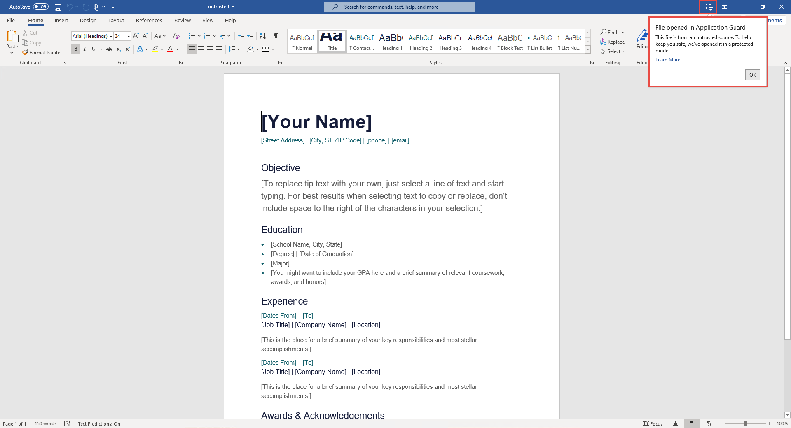

# <a name="application-guard-for-office-public-preview-for-admins"></a>Application Guard para Office (visualização pública) para administradores

[!INCLUDE [Microsoft 365 Defender rebranding](../includes/microsoft-defender-for-office.md)]


**Aplica-se a:** Word, Excel e PowerPoint para Microsoft 365, Windows 10 Enterprise

>[!IMPORTANT]
>Algumas informações estão relacionadas a um produto de pré-lançamento que pode ser modificado substancialmente antes de ser lançado comercialmente. Microsoft makes no warranties, express or implied, with respect to the information provided here.


O Microsoft defender Application Guard para Office (Application Guard para Office) ajuda a impedir que arquivos não confiáveis acessem recursos confiáveis, mantendo sua empresa segura contra ataques novos e emergentes. Este artigo orienta os administradores na configuração de dispositivos para uma visualização do Application Guard para Office. Ele fornece informações sobre os requisitos do sistema e as etapas de instalação para habilitar o Application Guard para Office em um dispositivo.

## <a name="prerequisites"></a>Pré-requisitos

### <a name="minimum-hardware-requirements"></a>Requisitos mínimos de hardware

* **CPU**: 64 bits, 4 núcleos (físico ou virtual), extensões de virtualização (Intel VT-x ou AMD-V), Core i5 equivalente ou superior recomendado
* **Memória física**: 8 GB de RAM
* **Disco rígido**: 10 GB de espaço livre na unidade do sistema (SSD recomendado)

### <a name="minimum-software-requirements"></a>Requisitos mínimos de software

* **Windows 10**: Windows 10 Enterprise Edition, Client Build Version 2004 (20H1) Build 19041
* **Office**: Office beta Channel Build versão 2008 16.0.13212 ou posterior
* **Pacote de atualização**: atualizações de segurança mensais cumulativas do Windows 10 [KB4571756](https://support.microsoft.com/help/4571756/windows-10-update-KB4571756) 

Para requisitos de sistema detalhados, consulte [requisitos do sistema para o Microsoft defender Application Guard](https://docs.microsoft.com/windows/security/threat-protection/microsoft-defender-application-guard/reqs-md-app-guard). Para saber mais sobre as compilações do Office Insider Preview, consulte Introdução à implantação do Office Insider [Compilations](https://insider.office.com/business/deploy).

### <a name="licensing-requirements"></a>Requisitos de licença
* Segurança da Microsoft 365 E5 ou do Microsoft 365 e5

## <a name="deploy-application-guard-for-office"></a>Implantar o Application Guard para Office

### <a name="enable-application-guard-for-office"></a>Habilitar o Application Guard para Office

1.  Baixe e instale **as atualizações de segurança mensal cumulativas do Windows 10 KB4571756**. 

2.  Selecione **Microsoft defender Application Guard** em recursos do Windows e clique em **OK**. Habilitar o recurso de proteção de aplicativos solicitará uma reinicialização do sistema. Você pode optar por reinicializar agora ou após a etapa 3.

    
    
    O recurso também pode ser habilitado executando o seguinte comando do PowerShell como administrador: 

    ```powershell
    Enable-WindowsOptionalFeature -online -FeatureName Windows-Defender-ApplicationGuard 
    ```

3.  Procure o Microsoft defender Application Guard na política de grupo do modo gerenciado, localizada em **configuração \\ do computador modelos \\ \\ do Windows do Microsoft defender Application Guard**. Ative esta política Configurando o valor em opções como **2** ou **3** e, em seguida, selecione **OK** ou **aplicar**.

    
  
    Como alternativa, você pode definir a política de CSP correspondente: 

    OMA-URI: **./Device/Vendor/MSFT/WindowsDefenderApplicationGuard/Settings/AllowWindowsDefenderApplicationGuard** 
    <br>Tipo de dados: **inteiro** 
    <br>Valor: **2**


4.  Reinicialize o sistema.

### <a name="set-diagnostics--feedback-to-send-full-data"></a>Definir & comentários de diagnóstico para enviar dados completos

Esta etapa garante que os dados necessários para identificar e corrigir problemas estejam chegando à Microsoft. Siga estas etapas para habilitar o diagnóstico no seu dispositivo Windows:

1.  Abra **configurações** no menu iniciar.

    

2.  Em **configurações do Windows**, selecione **privacidade**.

    

3.  Em privacidade, selecione **diagnóstico & comentários** e selecione **dados de diagnóstico opcionais**.

    

Para saber mais sobre como definir as configurações de diagnóstico do Windows, confira [configurando dados de diagnóstico do Windows em sua organização](https://docs.microsoft.com/windows/privacy/configure-windows-diagnostic-data-in-your-organization#enterprise-management).

### <a name="confirm-that-application-guard-for-office-is-enabled-and-working"></a>Confirmar se o Application Guard para Office está habilitado e funcionando

Antes de confirmar que o Application Guard para Office está habilitado, inicie o Word, o Excel ou o PowerPoint em um dispositivo onde as políticas foram implantadas. Verifique se o Office está ativado. Talvez seja necessário usar sua identidade de trabalho para ativar primeiro o produto do Office.

Para confirmar se o Application Guard para Office agora está habilitado, inicie o Word, o Excel ou o PowerPoint e abra um documento não confiável. Por exemplo, você pode abrir um documento baixado da Internet ou um anexo de email de alguém fora da sua organização.

Na primeira inicialização de um arquivo não confiável, você pode ver uma tela de abertura do Office como a seguinte. Ele pode mostrar por algum tempo enquanto o Application Guard para Office está sendo ativado e o arquivo está sendo aberto. Os lançamentos subsequentes de arquivos não confiáveis devem ser mais rápidos.


Após a abertura, o arquivo deve exibir alguns indicadores visuais que o arquivo foi aberto no Application Guard para Office:

* Um texto explicativo na faixa de opções

    
* O ícone do aplicativo com um escudo na barra de tarefas 

    


## <a name="configure-application-guard-for-office"></a>Configurar o Application Guard para Office
O Office oferece suporte às seguintes políticas para permitir que você configure os recursos do Application Guard para Office. Essas políticas podem ser configuradas por meio de políticas de grupo ou através do serviço política de nuvem do Office. 

>[!NOTE] 
> Essas políticas ficarão disponíveis em breve.
>Além disso, a configuração dessas políticas pode desabilitar algumas funcionalidades para arquivos abertos no Application Guard para Office.

| Política                                                                          | Descrição                                                                                                                                                                                                                                                                                             |
|---------------------------------------------------------------------------------|---------------------------------------------------------------------------------------------------------------------------------------------------------------------------------------------------------------------------------------------------------------------------------------------------------|
| Desabilitar o Application Guard para Office                                            | Habilitar essa política forçará o Word, o Excel e o PowerPoint a usar o contêiner de isolamento do modo de exibição protegido, em vez do Application Guard para Office. Essa política pode ser usada para desabilitar temporariamente o Application Guard para Office quando há problemas para deixá-lo habilitado para a borda.                                  |
| Desabilitar copiar/colar para documentos abertos no Application Guard                    | Habilitar essa política impedirá que um usuário Copie e cole o conteúdo de um documento aberto no Application Guard para Office em um documento aberto fora dele.                                                                                                                                   |
| Impedir que os usuários removam a proteção do Application Guard nos arquivos               | Habilitar essa política removerá a opção (dentro da experiência de aplicativo do Office) para desabilitar a proteção do Application Guard ou abrir um arquivo fora do Application Guard. <br><br>**Observação:** Os usuários ainda podem ignorar essa política removendo manualmente a propriedade de marca da Web do arquivo ou movendo um documento para um local confiável. |
| Restringir a impressão de documentos abertos no Application Guard                    | Habilitar essa política limitará as impressoras que um usuário pode imprimir de um arquivo aberto no Application Guard para Office. Por exemplo, você pode usar essa política para restringir que os usuários imprimam apenas em PDF.                              |
| Desligar o acesso de câmera e microfone para documentos abertos no Application Guard | Habilitar essa política removerá o Office Access para câmera e microfone dentro do Application Guard para Office.                                                                                                                                                                                                     |
>[!NOTE] 
>As políticas a seguir exigirão que o usuário faça logoff e logon novamente no Windows para ter efeito:
> 
> *  Desabilitar copiar/colar para documentos abertos no Application Guard
>*  Restringir a impressão de documentos abertos no Application Guard
> *  Desligar o acesso de câmera e microfone aos documentos abertos no Application Guard


## <a name="submit-feedback"></a>Enviar comentários

### <a name="submit-feedback-via-feedback-hub"></a>Enviar comentários via hub de comentários

Se você tiver problemas ao iniciar o Application Guard para Office, será incentivado a enviar seus comentários por meio do hub de comentários:

1.  Abra o **aplicativo de Hub de comentários** e entre.

2.  Se você receber uma caixa de diálogo de erro ao iniciar o Application Guard, selecione **relatar à Microsoft** na caixa de diálogo de erro para iniciar um novo envio de comentários. Caso contrário, navegue até <https://aka.ms/wdagoffice-fb> para selecionar a categoria correta para o Application Guard e, em seguida, selecione **+ Adicionar novo feedback** perto do canto superior direito.

3.  Preencha a caixa **resumir sua opinião** se ela ainda não estiver preenchida para você.

4.  Preencha a **explicação em** uma caixa de detalhes com uma descrição detalhada do problema que você experimentou e quais etapas você executou e, em seguida, selecione **Avançar**.

5.  Selecione o balão próximo a problema. Certifique-se de que a categoria selecionada é **segurança e privacidade \> Microsoft defender Application Guard – Office**e, em seguida, selecione **Avançar**.

6.  Selecione **novo comentário**e, em seguida, **Avançar**.

7.  Coletar rastreamentos sobre o problema:

    1. Expanda o bloco **recriar meu problema** .

    2.  Se o problema que você está tendo ocorre enquanto o Application Guard está sendo executado, abra uma instância do Application Guard. Isso permite que rastreamentos adicionais sejam coletados de dentro do contêiner do Application Guard.

    3.  Selecione **Iniciar gravação** e aguarde até que o bloco pare de rodar e diga *parar gravação*.

    4.  Reproduza o problema com o Application Guard. Isso pode incluir a tentativa de iniciar uma instância do Application Guard e aguardar até que ela falhe, ou reproduzir um problema em uma instância de proteção de aplicativo em execução.

    5.  Selecione o bloco **parar gravação** .

    6.  Mantenha qualquer instância do Application Guard em execução aberta, mesmo até alguns minutos após o envio, para que o diagnóstico de contêiner também possa ser coletado.

8.  Anexe quaisquer capturas de tela ou arquivos relevantes relacionados ao problema.

9.  Selecione **Enviar**.


### <a name="submit-feedback-via-office-customer-voice"></a>Enviar comentários via voz de cliente do Office

Você também pode enviar comentários de dentro do Office se o problema ocorrer quando os documentos do Office são abertos no Application Guard. Consulte o [manual do Office Insider](https://insider.office.com/handbook) para enviar comentários.

## <a name="integration-with-microsoft-defender-atp-and-office-atp"></a>Integração com o Microsoft defender ATP e o Office ATP

O Application Guard para Office é integrado ao Microsoft defender Advanced Threat Protection (ATP) para fornecer monitoramento e alerta sobre atividades mal-intencionadas acontecendo no ambiente isolado.

O Microsoft defender ATP é uma plataforma de segurança projetada para ajudar as redes corporativas a prevenir, detectar, investigar e responder a ameaças avançadas. Para obter mais detalhes sobre esta plataforma, visite a página [proteção avançada contra ameaças do Microsoft defender](https://www.microsoft.com/microsoft-365/windows/microsoft-defender-atp) . Saiba mais sobre os dispositivos de integração com esta plataforma em [dispositivos integrados ao serviço Microsoft defender ATP](https://docs.microsoft.com/windows/security/threat-protection/microsoft-defender-atp/onboard-configure).

Você também pode configurar o Office 365 ATP para funcionar com o Microsoft defender ATP. Consulte [integrar o Office 365 ATP com o Microsoft defender ATP](https://docs.microsoft.com/microsoft-365/security/office-365-security/integrate-office-365-ti-with-wdatp?view=o365-worldwide).

## <a name="limitations-and-considerations"></a>Limitações e considerações

* O Application Guard para Office é um modo restrito que isola documentos não confiáveis de acessar recursos corporativos confiáveis, intranet, identidade do usuário e arquivos arbitrários presentes no computador. Como resultado, se um usuário tentar acessar um recurso que tenha uma dependência desse acesso, por exemplo, inserindo uma imagem de um arquivo local no disco, ele falhará e produzirá um prompt como o seguinte. Para habilitar um documento não confiável para acessar recursos confiáveis, os usuários devem remover a proteção do Application Guard do documento.

    

    >[!NOTE]    
    >Recomende que os usuários só removam a proteção se confiarem no arquivo e em sua origem ou de onde eles vieram.

* O conteúdo ativo em documentos, como macros e controles ActiveX, está desabilitado no Application Guard para Office. Os usuários precisam remover a proteção do Application Guard para habilitar o conteúdo ativo.

* Arquivos não confiáveis abertos de compartilhamentos de rede ou arquivos compartilhados do OneDrive, OneDrive for Business ou SharePoint Online de uma organização diferente aberta como somente leitura no Application Guard. Os usuários podem salvar uma cópia local desses arquivos para continuar trabalhando no contêiner ou remover a proteção para trabalhar diretamente com o arquivo original.

* Arquivos protegidos por IRM (gerenciamento de direitos de informação) continuam a ser abertos no modo de exibição protegido.
* Quaisquer personalizações para aplicativos do Office no Application Guard para Office não serão mantidas depois que um usuário fizer logoff e login novamente ou reiniciar o dispositivo. 

* Somente ferramentas de acessibilidade que usam o UIA Framework podem fornecer uma experiência acessível para arquivos abertos no Application Guard para Office.

* A conectividade de rede é necessária para o primeiro lançamento do Application Guard após a instalação. Isso é necessário para que o Application Guard valide a licença.
* Na seção informações do documento, a propriedade *Last Modified by* pode exibir WDAGUtilityAccount como o usuário. Este é o usuário anônimo configurado no Application Guard, Considerando que a identidade do usuário da área de trabalho não é compartilhada dentro do contêiner do Application Guard. 

## <a name="performance-optimizations-for-application-guard"></a>Otimizações de desempenho para o Application Guard 

Esta seção fornece uma visão geral das otimizações de desempenho usadas no Application Guard para Office. Essas informações podem ajudar os administradores a diagnosticar relatórios de usuários relacionados ao desempenho do Office ou ao sistema geral quando o Application Guard estiver habilitado. 

O Application Guard usa um contêiner virtualizado para isolar documentos não confiáveis do sistema. O processo de criação de um contêiner e a configuração do contêiner do Application Guard para abrir documentos do Office tem uma sobrecarga de desempenho que pode afetar negativamente a experiência do usuário quando os usuários abrem um documento não confiável. 


Para fornecer aos usuários a experiência de abertura de arquivo esperada, o Application Guard usa a lógica para criar previamente um contêiner quando o seguinte heurístico é atendido em um sistema: um usuário abriu um arquivo no modo de exibição protegido ou no Application Guard nos últimos 28 dias. 

Quando esse heurístico é atendido, o Office criará um contêiner de proteção de aplicativo para o usuário depois de fazer logon no Windows. Quando essa operação de criação prévia está em andamento, o sistema pode experimentar desempenho lento. Isso será resolvido assim que a operação for concluída. 


>[!NOTE] 
>As dicas necessárias para o heurístico usado para criar o contêiner são geradas por aplicativos do Office como um usuário os utiliza. Se um usuário instalar o Office em um novo sistema onde o Application Guard estiver habilitado, o Office não criará previamente o contêiner até depois da primeira vez que um usuário abrir um documento não confiável no sistema. O usuário observará que esse primeiro arquivo demora mais para abrir no Application Guard. 

## <a name="known-issues-in-preview"></a>Problemas conhecidos na visualização

* Clicar em links da Web ( ```http``` ou ```https``` ) não abre o navegador. 
* As atualizações do .NET causam falha na abertura de arquivos no Application Guard. Como uma solução alternativa, os usuários podem reiniciar o dispositivo quando esse problema for encontrado.
    Saiba mais sobre o problema ao [receber uma mensagem de erro ao tentar abrir o Windows Defender Application Guard ou a área restrita do Windows](https://support.microsoft.com/help/4575917/receiving-an-error-message-when-attempting-to-open-windows-defender-ap).
